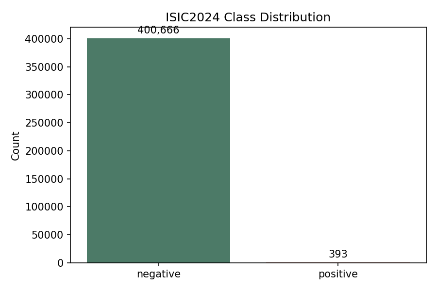
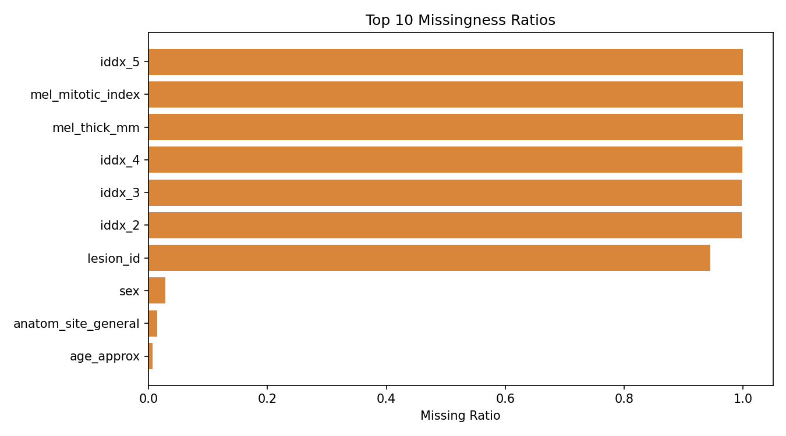
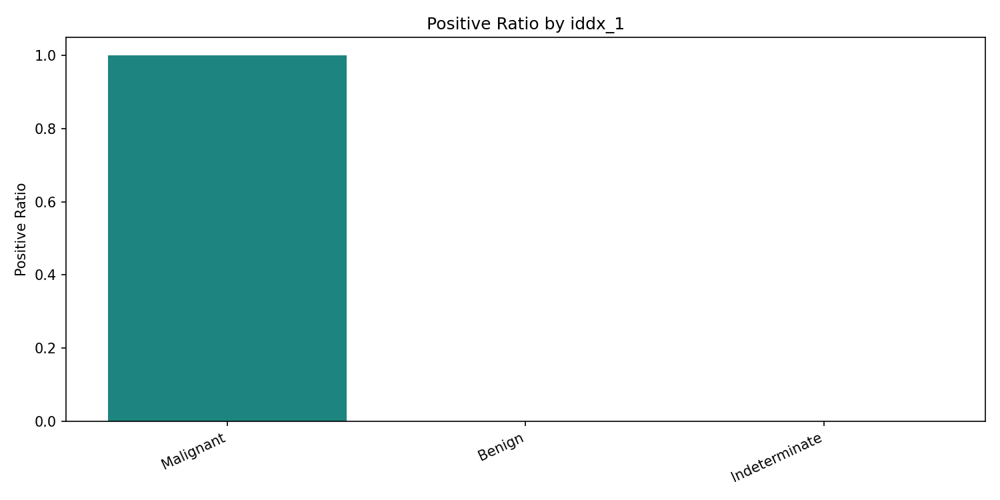
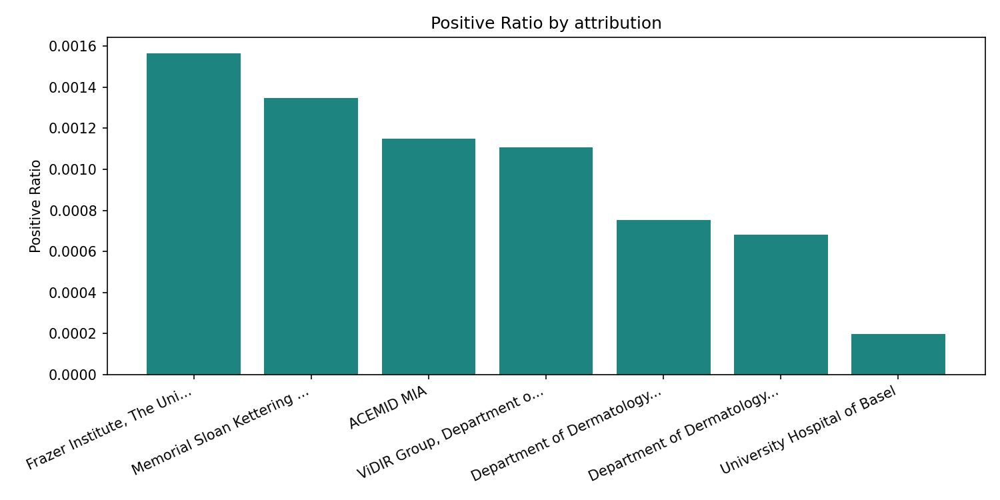
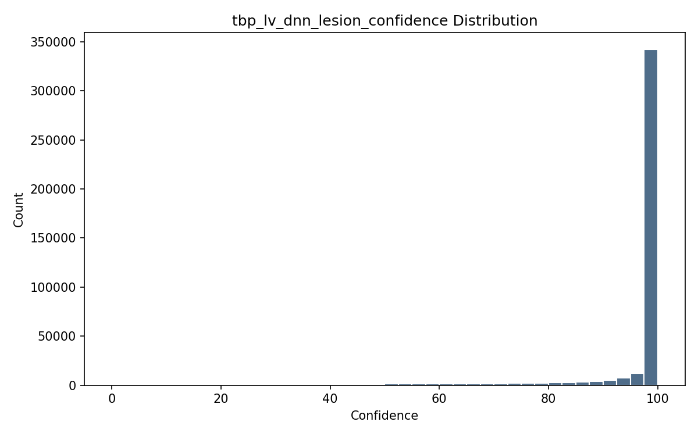

# ISIC2024 Tabular EDA Report

## 1. 목적 및 분석 범위

이 문서는 `ISIC2024` tabular 데이터를 대상으로 데이터 구조, 클래스 불균형, 결측 패턴, 주요 범주형/수치형 변수의 분포, leakage 가능성, 그리고 baseline feature set 설계 근거를 정리한다.  
또한 목표 2에서 실행한 tabular baseline 결과와 EDA 해석을 연결하여, 어떤 feature set을 메인 비교 기준으로 삼아야 하는지 논의한다.

### 읽기 가이드

> **핵심 방향**: 데이터 분포 확인 및 baseline 비교를 위한 `strict / relaxed / oracle` 기준을 설계

- `strict`는 메인 비교용 현실형 baseline이다.
- `relaxed`는 보조 메타데이터가 성능에 미치는 영향을 점검하기 위한 보조 실험이다.
- `oracle`은 leakage 상한선을 확인하기 위한 참고 세트다.
- 따라서 이 보고서에서는 `성능이 높은가`보다 `어떤 정보 때문에 높아졌는가`에 초점을 둔다.

### 분석 원칙

- **불균형 우선 해석**: 양성 비율이 매우 낮기 때문에 정확도보다 `average precision`, `AUC`, `balanced accuracy`, `recall`을 우선 본다.
- **그룹 분리 우선**: 동일 환자 표본이 많으므로 `patient_id -> lesion_id -> isic_id` 정책으로 split을 해석한다.
- **컬럼 허용 여부 우선**: 모든 컬럼을 동일하게 보지 않고, 식별자, 편향 가능 메타데이터, 진단 leakage, 일반 feature를 구분한다.
- **공정한 비교 우선**: tabular 결과와 image 결과를 나중에 연결하기 위해, 메인 baseline은 설명 가능한 정보만 남긴 `strict`를 중심으로 설계한다.

> 현재 데이터는 총 `401,059`건이며, 양성 비율은 `0.000980`이다. 이 조건에서는 EDA의 역할이 단순 요약보다 실험 설계 근거 정리에 더 가깝다.

## 2. 데이터 개요

표 1. 데이터셋 개요

| 항목 | 값 |
| --- | --- |
| dataset_root | /home/junkim2603a/proj/paper_ajou_dev/dataset/isic-2024-challenge |
| rows | 401059 |
| target_column | target |
| positive_count | 393 |
| negative_count | 400666 |
| positive_ratio | 0.000980 |
| column_count | 58 |

### 해석

본 데이터셋은 총 `401,059`개의 표본으로 구성되어 있으며, 이 중 양성 비율은 `0.000980`에 불과하다. 이는 일반적인 분류 데이터셋과 비교해도 매우 극단적인 불균형 조건에 해당한다. 따라서 이후 baseline 결과를 해석할 때 단순 정확도보다는 양성 탐지 능력을 반영하는 지표를 우선적으로 살펴봐야 한다.

또한 전체 컬럼 수는 많지 않지만, 컬럼의 성격은 균질하지 않다. 일부 변수는 메타데이터 수준의 보조 정보인 반면, 일부 변수는 사실상 진단 결과와 매우 가까운 의미를 가진다. 이 때문에 이번 EDA의 핵심 목적은 단순 분포 요약이 아니라, 어떤 컬럼을 메인 baseline feature로 허용할 수 있는지에 대한 판단 근거를 만드는 데 있다.

## 3. 클래스 불균형 분석

그림 1. 클래스 분포

### 해석

음성 표본은 `400,666`건인 반면 양성 표본은 `393`건에 불과하다. 이 차이는 모델이 단순히 음성만 예측해도 매우 높은 정확도를 얻을 수 있음을 의미한다. 즉, 이 문제에서 정확도는 모델이 실제로 병변을 잘 탐지하는지를 보여주는 대표 지표가 될 수 없다.

따라서 목표 2에서 구성한 tabular baseline은 `best_average_precision`, `balanced_accuracy`, `recall`을 함께 확인하도록 설계했다. 이는 모델이 얼마나 많은 양성을 실제로 포착하는지, 그리고 예측 점수의 순위가 얼마나 유의미한지를 동시에 보기 위함이다.

## 4. 결측 패턴 분석

그림 2. 상위 결측률 컬럼

표 2. 상위 결측률 컬럼 요약

| column | missing_count | missing_ratio |
| --- | --- | --- |
| iddx_5 | 401058 | 0.999998 |
| mel_mitotic_index | 401006 | 0.999868 |
| mel_thick_mm | 400996 | 0.999843 |
| iddx_4 | 400508 | 0.998626 |
| iddx_3 | 399994 | 0.997345 |
| iddx_2 | 399991 | 0.997337 |
| lesion_id | 379001 | 0.945001 |
| sex | 11517 | 0.028716 |
| anatom_site_general | 5756 | 0.014352 |
| age_approx | 2798 | 0.006977 |

### 해석

`iddx_5`의 결측률은 `0.999998`이다. `mel_mitotic_index`의 결측률은 `0.999868`이다. `mel_thick_mm`의 결측률은 `0.999843`이다. `iddx_4`의 결측률은 `0.998626`이다. `iddx_3`의 결측률은 `0.997345`이다. 상위 결측 컬럼 대부분은 `iddx_*` 후반부와 `mel_*` 계열로 나타났다. 이 패턴은 두 가지 해석을 가능하게 한다. 첫째, 이러한 변수는 데이터셋 전반에서 관측 가능한 일반 변수라기보다 특정 상황에서만 기록되는 후속 진단 정보일 가능성이 높다. 둘째, 실제 baseline feature로 사용할 경우 결측 처리 자체가 결과를 왜곡할 수 있다.

또한 `patient_id`, `lesion_id`, `attribution`, `copyright_license`처럼 본질적 병변 특징보다 수집 단위나 출처에 가까운 컬럼은 단순 분포만 보면 유용해 보일 수 있어도, 공정한 일반화 비교 기준으로 쓰기에는 해석 리스크가 있다. 이번 전환에서는 이런 컬럼을 `strict`에서 제외하고 `relaxed`에서만 별도 비교하도록 분리한다.

## 5. 범주형 변수 분석

### 5.1 `iddx_1`별 양성 비율

그림 3. `iddx_1`별 양성 비율

표 3. `iddx_1`별 양성 비율

| iddx_1 | count | positive_count | positive_ratio |
| --- | --- | --- | --- |
| Benign | 400552 | 0 | 0.0 |
| Malignant | 393 | 393 | 1.0 |
| Indeterminate | 114 | 0 | 0.0 |

### 해석

`iddx_1=Malignant`의 양성 비율은 `1.000000`이고, `iddx_1=Indeterminate`은 `0.000000`이다. 이 차이는 단순 상관 수준을 넘어, `iddx_1`이 사실상 타깃과 매우 가까운 진단 정보를 포함하고 있음을 보여준다.

즉, 이 변수는 메타데이터라기보다 이미 정리된 진단 판단 결과에 가깝다. 따라서 `iddx_1`을 일반 baseline feature에 포함하면 모델이 입력 데이터를 학습하는 것이 아니라, 이미 주어진 정답 힌트를 활용하는 구조가 된다. 이 때문에 본 프로젝트에서는 `iddx_1`을 `oracle` 세트에만 포함시키고, 메인 비교에서는 제외하는 것이 타당하다.

### 5.2 `attribution`별 양성 비율

그림 4. `attribution`별 양성 비율

표 4. `attribution`별 양성 비율

| attribution | count | positive_count | positive_ratio |
| --- | --- | --- | --- |
| Frazer Institute, The University of Queensland, Dermatology Research Centre | 51768 | 81 | 0.0015646731571627 |
| Memorial Sloan Kettering Cancer Center | 129068 | 174 | 0.0013481265689404 |
| ACEMID MIA | 28665 | 33 | 0.0011512297226582 |
| ViDIR Group, Department of Dermatology, Medical University of Vienna | 12640 | 14 | 0.0011075949367088 |
| Department of Dermatology, University of Athens, Andreas Syggros Hospital of Skin and Venereal Diseases, Alexander Stratigos, Konstantinos Liopyris | 7976 | 6 | 0.0007522567703109 |
| Department of Dermatology, Hospital Clínic de Barcelona | 105724 | 72 | 0.0006810185010026 |
| University Hospital of Basel | 65218 | 13 | 0.0001993314729062 |

### 해석

기관별 양성 비율은 최소 `0.000199`에서 최대 `0.001565`까지 차이가 난다. 이는 수집 기관에 따라 표본 구성과 난이도가 다를 수 있음을 시사한다. 다시 말해 `attribution`은 병변의 본질적 성질을 설명하는 변수라기보다, 데이터가 어떤 환경에서 수집되었는지를 반영하는 변수일 가능성이 높다.

`attribution`은 `iddx_*`처럼 직접적인 leakage 컬럼으로 보기는 어렵지만, 분포 차이를 통해 모델 성능에 간접적인 영향을 줄 수 있다. 따라서 메인 비교용 `strict`에서는 제외하고, `relaxed`에서만 별도 비교하여 기관별 편향 가능성을 점검하는 것이 바람직하다.

## 6. 수치형 변수 분석

### 6.1 `tbp_lv_dnn_lesion_confidence` 분포

그림 5. `tbp_lv_dnn_lesion_confidence` 히스토그램

표 5. 수치형 변수 요약 통계

| column | group | count | mean | median | min | max |
| --- | --- | --- | --- | --- | --- | --- |
| age_approx | all | 398261 | 58.012986 | 60.0 | 5.0 | 85.0 |
| age_approx | target_0 | 397871 | 58.009694 | 60.0 | 5.0 | 85.0 |
| age_approx | target_1 | 390 | 61.371795 | 60.0 | 20.0 | 85.0 |
| clin_size_long_diam_mm | all | 401059 | 3.930827 | 3.37 | 1.0 | 28.4 |
| clin_size_long_diam_mm | target_0 | 400666 | 3.929043 | 3.37 | 1.0 | 28.4 |
| clin_size_long_diam_mm | target_1 | 393 | 5.749771 | 5.14 | 1.01 | 18.94 |
| mel_thick_mm | all | 63 | 0.670952 | 0.4 | 0.2 | 5.0 |
| mel_thick_mm | target_0 | 0 |  |  |  |  |
| mel_thick_mm | target_1 | 63 | 0.670952 | 0.4 | 0.2 | 5.0 |
| tbp_lv_A | all | 401059 | 19.974007 | 19.80191 | -2.487115 | 48.18961 |
| tbp_lv_A | target_0 | 400666 | 19.971528 | 19.800474 | -2.487115 | 48.18961 |
| tbp_lv_A | target_1 | 393 | 22.500924 | 21.99098 | 4.971736 | 43.71767 |
| tbp_lv_Aext | all | 401059 | 14.919247 | 14.71393 | -9.080269 | 37.02168 |
| tbp_lv_Aext | target_0 | 400666 | 14.916682 | 14.712272 | -9.080269 | 37.02168 |
| tbp_lv_Aext | target_1 | 393 | 17.534401 | 16.877089 | 4.826737 | 35.86719 |
| tbp_lv_B | all | 401059 | 28.281706 | 28.17157 | -0.730989 | 54.3069 |
| tbp_lv_B | target_0 | 400666 | 28.286065 | 28.174977 | -0.730989 | 54.3069 |
| tbp_lv_B | target_1 | 393 | 23.837896 | 24.04374 | 2.870907 | 44.625461 |
| tbp_lv_Bext | all | 401059 | 26.913015 | 26.701704 | 9.237066 | 48.3727 |
| tbp_lv_Bext | target_0 | 400666 | 26.91494 | 26.703165 | 9.237066 | 48.3727 |
| tbp_lv_Bext | target_1 | 393 | 24.950406 | 25.077617 | 12.63714 | 42.718264 |
| tbp_lv_C | all | 401059 | 34.786341 | 34.82258 | 3.054228 | 58.76517 |
| tbp_lv_C | target_0 | 400666 | 34.788027 | 34.823648 | 3.054228 | 58.76517 |
| tbp_lv_C | target_1 | 393 | 33.067349 | 33.446362 | 7.715667 | 53.569388 |
| tbp_lv_Cext | all | 401059 | 30.921279 | 30.804893 | 11.84652 | 54.30529 |
| tbp_lv_Cext | target_0 | 400666 | 30.921401 | 30.804718 | 11.84652 | 54.30529 |
| tbp_lv_Cext | target_1 | 393 | 30.796881 | 31.005119 | 17.381603 | 47.263349 |
| tbp_lv_H | all | 401059 | 54.653689 | 55.035632 | -1.574164 | 105.875784 |
| tbp_lv_H | target_0 | 400666 | 54.66145 | 55.040083 | -1.574164 | 105.875784 |
| tbp_lv_H | target_1 | 393 | 46.741528 | 47.277889 | 7.174666 | 65.25869 |
| tbp_lv_Hext | all | 401059 | 60.996869 | 61.109173 | 28.43649 | 130.9833 |
| tbp_lv_Hext | target_0 | 400666 | 61.002632 | 61.1127 | 28.43649 | 130.9833 |
| tbp_lv_Hext | target_1 | 393 | 55.121791 | 55.385449 | 32.649963 | 75.477687 |
| tbp_lv_L | all | 401059 | 42.289976 | 42.34377 | 4.223007 | 87.548888 |
| tbp_lv_L | target_0 | 400666 | 42.291356 | 42.343629 | 4.223007 | 87.548888 |
| tbp_lv_L | target_1 | 393 | 40.883934 | 42.548845 | 6.157081 | 63.70602 |
| tbp_lv_Lext | all | 401059 | 51.199529 | 51.425557 | 17.70226 | 98.58825 |
| tbp_lv_Lext | target_0 | 400666 | 51.199687 | 51.424885 | 17.70226 | 98.58825 |
| tbp_lv_Lext | target_1 | 393 | 51.03826 | 52.349597 | 20.553112 | 74.01323 |
| tbp_lv_areaMM2 | all | 401059 | 8.539975 | 5.68587 | 0.431601 | 334.1527 |
| tbp_lv_areaMM2 | target_0 | 400666 | 8.526291 | 5.68587 | 0.431601 | 334.1527 |
| tbp_lv_areaMM2 | target_1 | 393 | 22.490554 | 12.85419 | 0.656784 | 141.114656 |
| tbp_lv_area_perim_ratio | all | 401059 | 19.084517 | 17.42395 | 10.761634 | 87.20534 |
| tbp_lv_area_perim_ratio | target_0 | 400666 | 19.082902 | 17.42338 | 10.761634 | 87.20534 |
| tbp_lv_area_perim_ratio | target_1 | 393 | 20.730862 | 18.32528 | 11.134446 | 49.86905 |
| tbp_lv_color_std_mean | all | 401059 | 1.070408 | 0.931402 | 0.0 | 9.952932 |
| tbp_lv_color_std_mean | target_0 | 400666 | 1.069828 | 0.931117 | 0.0 | 9.952932 |
| tbp_lv_color_std_mean | target_1 | 393 | 1.661645 | 1.489238 | 0.0 | 8.009495 |
| tbp_lv_deltaA | all | 401059 | 5.05476 | 4.643926 | -13.81985 | 32.13759 |
| tbp_lv_deltaA | target_0 | 400666 | 5.054846 | 4.643749 | -13.81985 | 32.13759 |
| tbp_lv_deltaA | target_1 | 393 | 4.966523 | 5.038595 | -8.280943 | 16.31623 |
| tbp_lv_deltaB | all | 401059 | 1.368691 | 1.593945 | -18.088106 | 12.64393 |
| tbp_lv_deltaB | target_0 | 400666 | 1.371125 | 1.59573 | -18.088106 | 12.64393 |
| tbp_lv_deltaB | target_1 | 393 | -1.11251 | -0.649948 | -15.339217 | 6.903996 |
| tbp_lv_deltaL | all | 401059 | -8.909552 | -8.132223 | -38.75614 | -1.590631 |
| tbp_lv_deltaL | target_0 | 400666 | -8.908332 | -8.131439 | -38.75614 | -1.590631 |
| tbp_lv_deltaL | target_1 | 393 | -10.154326 | -9.229332 | -34.69047 | -2.587007 |
| tbp_lv_deltaLB | all | 401059 | 9.455766 | 8.699932 | 2.952675 | 39.19772 |
| tbp_lv_deltaLB | target_0 | 400666 | 9.454437 | 8.699245 | 2.952675 | 39.19772 |
| tbp_lv_deltaLB | target_1 | 393 | 10.810271 | 9.763281 | 2.962654 | 37.7161 |
| tbp_lv_deltaLBnorm | all | 401059 | 7.538922 | 6.94632 | 3.001138 | 30.487456 |
| tbp_lv_deltaLBnorm | target_0 | 400666 | 7.53778 | 6.945794 | 3.001138 | 30.487456 |
| tbp_lv_deltaLBnorm | target_1 | 393 | 8.703975 | 7.629472 | 3.05825 | 30.34092 |
| tbp_lv_dnn_lesion_confidence | all | 401059 | 97.162204 | 99.994588 | 0.0 | 100.0 |
| tbp_lv_dnn_lesion_confidence | target_0 | 400666 | 97.177634 | 99.99461 | 0.0 | 100.0 |
| tbp_lv_dnn_lesion_confidence | target_1 | 393 | 81.431493 | 99.68489 | 2e-06 | 100.0 |
| tbp_lv_eccentricity | all | 401059 | 0.741238 | 0.768215 | 0.027667 | 0.97496 |
| tbp_lv_eccentricity | target_0 | 400666 | 0.741262 | 0.768237 | 0.027667 | 0.97496 |
| tbp_lv_eccentricity | target_1 | 393 | 0.716914 | 0.738177 | 0.193099 | 0.960627 |
| tbp_lv_minorAxisMM | all | 401059 | 2.539773 | 2.265201 | 0.273973 | 18.3879 |
| tbp_lv_minorAxisMM | target_0 | 400666 | 2.538459 | 2.264226 | 0.273973 | 18.3879 |
| tbp_lv_minorAxisMM | target_1 | 393 | 3.879183 | 3.543483 | 0.547945 | 13.031066 |
| tbp_lv_nevi_confidence | all | 401059 | 38.520265 | 14.408514 | 0.0 | 100.0 |
| tbp_lv_nevi_confidence | target_0 | 400666 | 38.537596 | 14.451695 | 0.0 | 100.0 |
| tbp_lv_nevi_confidence | target_1 | 393 | 20.850907 | 0.489743 | 0.0 | 99.99878 |
| tbp_lv_norm_border | all | 401059 | 3.451523 | 2.996933 | 0.589426 | 10.0 |
| tbp_lv_norm_border | target_0 | 400666 | 3.451159 | 2.996717 | 0.589426 | 10.0 |
| tbp_lv_norm_border | target_1 | 393 | 3.823057 | 3.345044 | 1.023068 | 10.0 |
| tbp_lv_norm_color | all | 401059 | 3.09159 | 2.764664 | 0.0 | 10.0 |
| tbp_lv_norm_color | target_0 | 400666 | 3.090164 | 2.763985 | 0.0 | 10.0 |
| tbp_lv_norm_color | target_1 | 393 | 4.545228 | 4.531665 | 0.0 | 10.0 |
| tbp_lv_perimeterMM | all | 401059 | 11.878891 | 10.01544 | 2.579237 | 102.4939 |
| tbp_lv_perimeterMM | target_0 | 400666 | 11.872182 | 10.015438 | 2.579237 | 102.4939 |
| tbp_lv_perimeterMM | target_1 | 393 | 18.718538 | 16.24227 | 2.806203 | 76.01962 |
| tbp_lv_radial_color_std_max | all | 401059 | 1.016459 | 0.902281 | 0.0 | 11.49114 |
| tbp_lv_radial_color_std_max | target_0 | 400666 | 1.015873 | 0.902049 | 0.0 | 11.49114 |
| tbp_lv_radial_color_std_max | target_1 | 393 | 1.613218 | 1.475259 | 0.0 | 7.020391 |
| tbp_lv_stdL | all | 401059 | 2.71519 | 2.186693 | 0.26816 | 17.56365 |
| tbp_lv_stdL | target_0 | 400666 | 2.7145 | 2.186371 | 0.26816 | 17.56365 |
| tbp_lv_stdL | target_1 | 393 | 3.418305 | 2.724339 | 0.490105 | 14.004394 |
| tbp_lv_stdLExt | all | 401059 | 2.238605 | 2.149758 | 0.636247 | 25.534791 |
| tbp_lv_stdLExt | target_0 | 400666 | 2.238095 | 2.149499 | 0.636247 | 25.534791 |
| tbp_lv_stdLExt | target_1 | 393 | 2.758215 | 2.534622 | 1.112039 | 15.73316 |
| tbp_lv_symm_2axis | all | 401059 | 0.306823 | 0.282297 | 0.052034 | 0.977055 |
| tbp_lv_symm_2axis | target_0 | 400666 | 0.306813 | 0.282258 | 0.052034 | 0.977055 |
| tbp_lv_symm_2axis | target_1 | 393 | 0.317134 | 0.303571 | 0.076033 | 0.767033 |
| tbp_lv_symm_2axis_angle | all | 401059 | 86.332073 | 90.0 | 0.0 | 175.0 |
| tbp_lv_symm_2axis_angle | target_0 | 400666 | 86.330647 | 90.0 | 0.0 | 175.0 |
| tbp_lv_symm_2axis_angle | target_1 | 393 | 87.78626 | 90.0 | 0.0 | 175.0 |
| tbp_lv_x | all | 401059 | -3.091862 | -5.747253 | -624.870728 | 614.4717 |
| tbp_lv_x | target_0 | 400666 | -3.07548 | -5.724847 | -624.870728 | 614.4717 |
| tbp_lv_x | target_1 | 393 | -19.793436 | -22.899292 | -499.481934 | 467.8475 |
| tbp_lv_y | all | 401059 | 1039.598221 | 1172.803 | -1052.134 | 1887.766846 |
| tbp_lv_y | target_0 | 400666 | 1039.470821 | 1172.709919 | -1052.134 | 1887.766846 |
| tbp_lv_y | target_1 | 393 | 1169.483517 | 1286.181 | 25.816711 | 1864.878662 |
| tbp_lv_z | all | 401059 | 55.823389 | 67.957947 | -291.890442 | 319.407 |
| tbp_lv_z | target_0 | 400666 | 55.845144 | 67.992142 | -291.890442 | 319.407 |
| tbp_lv_z | target_1 | 393 | 33.644145 | 35.604858 | -218.2009 | 220.5186 |

### 해석

`tbp_lv_dnn_lesion_confidence`의 평균은 음성 `97.177634`, 양성 `81.431493`로 차이가 나타난다. 이 값은 악성 확률이라기보다 TBP 시스템이 해당 부위를 병변으로 얼마나 확신하는지를 나타내는 lesion confidence score에 가깝다. 평균 차이만으로 모든 것이 설명되지는 않지만, 최소한 이 컬럼이 양성과 음성을 구분하는 데 일정 수준의 신호를 제공하고 있음을 보여준다. 현재 `strict` 세트에서 유지되는 핵심 image-derived 수치형 변수로 남는 이유도 여기에 있다.

반면 `mel_thick_mm`는 양성에서만 유효값 `63`개가 관측되었다. 이런 패턴은 모델이 병변 특성을 학습한다기보다, 후속 진단 과정에서만 기록된 정보를 통해 양성을 맞히게 만들 수 있다. 따라서 이 변수는 설명용으로는 의미가 있지만, 메인 baseline feature로 사용하기에는 위험하다. `mel_mitotic_index` 역시 유효값이 거의 없어 실제 학습 feature로서는 적절하지 않다.

## 7. Leakage 후보 분석

표 6. Leakage 후보 및 제외 컬럼

| 구분 | 컬럼 |
| --- | --- |
| excluded_columns | image_exists, image_path, isic_id, patient_id, split_group_id |
| high_leakage_risk_columns | iddx_1, iddx_2, iddx_3, iddx_4, iddx_5, iddx_full, mel_mitotic_index, mel_thick_mm |

### 해석

`iddx_*`, `iddx_full`은 계층형 진단 정보를 직접 담고 있어 leakage 위험이 높다. 이 변수들을 포함했을 때 모델 성능이 과도하게 좋아진다면, 그것은 모델이 실제 예측 능력을 가진 것이 아니라 정답에 가까운 정보를 받아들였기 때문일 수 있다.

`mel_thick_mm`, `mel_mitotic_index` 역시 관측 패턴이 일반형 입력 변수와 다르다. 특히 유효값이 양성에만 집중되거나 거의 존재하지 않는 경우, 메인 baseline에서 사용하면 설명 가능성과 일반화 가능성을 동시에 해친다. 따라서 본 프로젝트는 `strict`를 메인 비교 세트로, `oracle`을 leakage 상한선 확인용 세트로 명확히 분리한다.

## 8. Feature Set 설계

### 8.1 실험 설계 관점 요약

> **실험 설계 관점 요약**
>
> 이 보고서는 컬럼을 모두 같은 수준의 입력으로 취급하지 않는다. 식별자, 기관/출처 메타데이터, 진단 계열 정보, 일반 임상/TBP 수치형 feature를 분리해서 다루며, 메인 baseline에는 설명 가능성과 공정성을 우선한다.
>
> 즉, EDA의 목표는 `무엇이 보이는가`를 나열하는 것이 아니라, `무엇을 학습에 허용할 것인가`를 결정하는 것이다.

표 7. 컬럼 배치 규칙

| column_or_group | observation | decision | placement |
| --- | --- | --- | --- |
| `patient_id`, `isic_id`, `image_path`, `split_group_id` | 식별자 또는 분할 기준 | 학습 입력으로 사용하지 않음 | excluded |
| `lesion_id` | 병변 식별 메타데이터 | 메인 기준에서는 제외하고 편향 점검용으로만 사용 | relaxed, oracle |
| `attribution`, `copyright_license` | 기관/출처 메타데이터 | 메타데이터 편향 가능성 점검용 | relaxed, oracle |
| `iddx_1`, `iddx_full` | 진단 결과와 거의 직접 연결 | leakage 상한선 확인용으로만 사용 | oracle |
| `mel_thick_mm`, `mel_mitotic_index` | 후속 진단 계열 + 극단적 결측 | 메인 baseline에는 부적절 | oracle |
| `tbp_lv_dnn_lesion_confidence` | 모든 샘플에 존재하는 lesion confidence score | 설명 가능한 핵심 수치형 신호로 유지 | strict, relaxed, oracle |
| 기본 임상 + 대부분의 `tbp_lv_*` | 결측이 적고 일반 feature로 해석 가능 | 메인 baseline 중심 입력 | strict, relaxed, oracle |

### 해석

현재 추천안에서 `strict`는 `41`개, `relaxed`는 `44`개, `oracle`은 `52`개 컬럼으로 구성된다. 이 차이는 단순히 컬럼 수를 늘리고 줄이는 문제가 아니라, 어떤 정보를 공정한 메인 비교에 허용할 것인지에 대한 정책 차이를 반영한다.

특히 `strict`는 실제 성능을 보고하는 기준선이고, `relaxed`는 메타데이터 편향을 점검하는 보조 세트이며, `oracle`은 진단 leakage가 얼마나 큰지 확인하는 상한선이다. 따라서 `strict` 대비 `relaxed` 또는 `oracle`의 성능 상승은 모델 구조의 우수성이라기보다 입력 정보의 성격 변화로 먼저 해석해야 한다.

### 8.2 Feature set 구성

표 8. Feature set 구성

| feature_set | num_columns | columns |
| --- | --- | --- |
| strict | 41 | age_approx, anatom_site_general, clin_size_long_diam_mm, image_type, sex, tbp_lv_A, tbp_lv_Aext, tbp_lv_B, tbp_lv_Bext, tbp_lv_C, tbp_lv_Cext, tbp_lv_H, tbp_lv_Hext, tbp_lv_L, tbp_lv_Lext, tbp_lv_areaMM2, tbp_lv_area_perim_ratio, tbp_lv_color_std_mean, tbp_lv_deltaA, tbp_lv_deltaB, tbp_lv_deltaL, tbp_lv_deltaLB, tbp_lv_deltaLBnorm, tbp_lv_dnn_lesion_confidence, tbp_lv_eccentricity, tbp_lv_location, tbp_lv_location_simple, tbp_lv_minorAxisMM, tbp_lv_nevi_confidence, tbp_lv_norm_border, tbp_lv_norm_color, tbp_lv_perimeterMM, tbp_lv_radial_color_std_max, tbp_lv_stdL, tbp_lv_stdLExt, tbp_lv_symm_2axis, tbp_lv_symm_2axis_angle, tbp_lv_x, tbp_lv_y, tbp_lv_z, tbp_tile_type |
| relaxed | 44 | age_approx, anatom_site_general, attribution, clin_size_long_diam_mm, copyright_license, image_type, lesion_id, sex, tbp_lv_A, tbp_lv_Aext, tbp_lv_B, tbp_lv_Bext, tbp_lv_C, tbp_lv_Cext, tbp_lv_H, tbp_lv_Hext, tbp_lv_L, tbp_lv_Lext, tbp_lv_areaMM2, tbp_lv_area_perim_ratio, tbp_lv_color_std_mean, tbp_lv_deltaA, tbp_lv_deltaB, tbp_lv_deltaL, tbp_lv_deltaLB, tbp_lv_deltaLBnorm, tbp_lv_dnn_lesion_confidence, tbp_lv_eccentricity, tbp_lv_location, tbp_lv_location_simple, tbp_lv_minorAxisMM, tbp_lv_nevi_confidence, tbp_lv_norm_border, tbp_lv_norm_color, tbp_lv_perimeterMM, tbp_lv_radial_color_std_max, tbp_lv_stdL, tbp_lv_stdLExt, tbp_lv_symm_2axis, tbp_lv_symm_2axis_angle, tbp_lv_x, tbp_lv_y, tbp_lv_z, tbp_tile_type |
| oracle | 52 | age_approx, anatom_site_general, attribution, clin_size_long_diam_mm, copyright_license, iddx_1, iddx_2, iddx_3, iddx_4, iddx_5, iddx_full, image_type, lesion_id, mel_mitotic_index, mel_thick_mm, sex, tbp_lv_A, tbp_lv_Aext, tbp_lv_B, tbp_lv_Bext, tbp_lv_C, tbp_lv_Cext, tbp_lv_H, tbp_lv_Hext, tbp_lv_L, tbp_lv_Lext, tbp_lv_areaMM2, tbp_lv_area_perim_ratio, tbp_lv_color_std_mean, tbp_lv_deltaA, tbp_lv_deltaB, tbp_lv_deltaL, tbp_lv_deltaLB, tbp_lv_deltaLBnorm, tbp_lv_dnn_lesion_confidence, tbp_lv_eccentricity, tbp_lv_location, tbp_lv_location_simple, tbp_lv_minorAxisMM, tbp_lv_nevi_confidence, tbp_lv_norm_border, tbp_lv_norm_color, tbp_lv_perimeterMM, tbp_lv_radial_color_std_max, tbp_lv_stdL, tbp_lv_stdLExt, tbp_lv_symm_2axis, tbp_lv_symm_2axis_angle, tbp_lv_x, tbp_lv_y, tbp_lv_z, tbp_tile_type |

### 해석

`strict`는 현실형 비교 기준으로, 실제 메인 결과표에 가장 적합하다. `relaxed`는 주의가 필요한 보조 정보까지 일부 포함하여, 어떤 컬럼이 성능을 얼마나 끌어올리는지 탐색하는 실험 세트다. `oracle`은 진단 계열 변수까지 포함하는 상한선 세트로, 모델 성능 자체보다는 leakage 영향의 크기를 보여주는 참고 기준으로 이해해야 한다.

> **해석 원칙**: `strict`보다 높은 성능이 관찰되더라도, 먼저 모델이 더 좋아졌다고 결론내리지 않고 어떤 추가 컬럼이 들어갔는지를 확인해야 한다.

## 9. Discussion: EDA와 Baseline 결과의 연결

표 9. Tabular baseline 요약

| model_name | feature_set | best_average_precision | balanced_accuracy | recall | auc_roc |
| --- | --- | --- | --- | --- | --- |
| xgboost | oracle | 1.0 | 1.0 | 1.0 | 1.0 |
| catboost | oracle | 0.9999999999999998 | 1.0 | 1.0 | 1.0 |
| mlp | oracle | 0.9999999999999998 | 1.0 | 1.0 | 1.0 |
| svm | oracle | 0.9999999999999998 | 1.0 | 1.0 | 1.0 |
| logistic_regression | oracle | 0.9999999999999998 | 1.0 | 1.0 | 1.0 |

### Discussion

`oracle` 세트에서는 `xgboost`가 `best_average_precision=1.000000`를 기록했다. 현재 결과에서 `oracle` 성능이 거의 완벽해지는 현상은, EDA에서 지적한 `iddx_*` 계열 leakage 위험이 실제 실험 결과로도 재확인되었음을 의미한다.

종합하면, EDA는 단순히 분포를 설명하는 단계에 그치지 않고, 어떤 feature set이 메인 baseline 비교 기준이 되어야 하는지 직접적인 실험 설계 근거를 제공했다. 본 프로젝트에서는 `strict`를 메인 비교 기준으로 유지하고, `relaxed`와 `oracle`은 보조 해석 및 leakage 확인용으로 제한하는 것이 가장 일관된 선택이다.

### Tabluar 전처리 요약

- 컬럼은 dtype 기준으로만 분리해 수치형과 범주형으로 나눔
- 수치형: SimpleImputer(strategy="median")로 결측을 중앙값으로 채우고,  StandardScaler()로 스케일을 맞춰 표준화
- 범주형: SimpleImputer(strategy="most_frequent")로 결측을 최빈값으로 채우고, OneHotEncoder(handle_unknown="ignore")로 범주값을 숫자 형태로 변환

## 10. 결론

본 EDA는 `ISIC2024` tabular 데이터가 단순한 메타데이터 분류 문제가 아니라, 극단적 클래스 불균형과 강한 leakage 후보가 동시에 존재하는 민감한 실험 환경임을 보여주었다. 특히 `iddx_1`, `iddx_full`, `mel_thick_mm` 계열은 분포와 baseline 결과 모두에서 비정상적으로 강한 신호를 보였기 때문에, 메인 비교 실험에 그대로 사용하는 것은 적절하지 않다.

또한 동일 환자의 표본이 매우 많이 반복되므로, 이번 전환에서는 `patient_id` 기반 split을 통해 train/val/test 간 환자 중복을 차단하는 것이 핵심 전제다. 따라서 현재 시점에서 가장 타당한 메인 baseline 기준은 `strict` feature set이다. `relaxed`와 `oracle`은 성능 향상 자체를 보고하기보다는, 어떤 컬럼이 결과를 과도하게 좋게 만드는지를 보여주는 보조 분석으로 활용하는 것이 적절하다. 이 결론은 이후 image baseline 결과와 tabular baseline 결과를 공정하게 비교할 때도 중요한 기준점이 된다.
