# ISIC 2024 메타데이터 EDA

이 노트북은 `train-metadata.csv`를 단계적으로 탐색하면서, 발표와 보고서에 바로 연결될 수 있는 설명형 EDA 문서를 만들기 위한 노트북이다.

여기서의 EDA는 단순히 흥미로운 패턴을 많이 찾는 작업이 아니라, SLICE-3D/ISIC 2024 데이터가 어떤 방식으로 만들어졌고 어떤 제약을 가지는지 코드로 확인한 뒤, 그 결과 때문에 어떤 분석과 어떤 실험 체계를 택할 수밖에 없는지를 정리하는 작업에 가깝다.

---

## 목차

- 0. 개요
  - 0.1 대분류 목차
  - 0.2 소분류 목차
  - 0.3 최종 요약 메모
- 1. 데이터 생성 메커니즘과 분석 제약
  - 1.1 `train-metadata.csv` 적재와 과제 난도 확인
    - 1.1 해석
  - 1.2 라벨이 붙은 방식 확인
    - 1.2 해석
  - 1.3 미리 주목받은 샘플의 흔적 확인
    - 1.3 해석
  - 1.4 기관/촬영환경 차이 확인
    - 1.4 해석
  - 1.5 왜 row-level이 아니라 `patient_id` 단위로 분할해야 하는가
    - 1.5 해석
  - 1.6 왜 public `test-metadata.csv`는 분석 중심에서 배제되는가
    - 1.6 해석
  - 1.7 중간 결론
- 2. 카테고리 기반 변수 체계 정리
  - 2.1 목적 기반 변수 카테고리 정의
    - 2.1 해석
  - 2.2 카테고리별 컬럼 분포 확인
    - 2.2 해석
  - 2.2-b 숫자형 컬럼 분포 미리보기
    - 2.2-b 해석
  - 2.3 카테고리와 `Strict (메인용) / Relaxed (보조용) / Oracle (참고용)` 매핑 정리
    - 2.3 해석
- 3. 데이터 구조 개요
  - 3.1 데이터 파일과 분석 대상 확인
    - 3.1 해석
  - 3.2 데이터 크기와 첫 인상 확인
    - 3.2 해석
  - 3.3 컬럼 스키마 요약
    - 3.3 해석
  - 3.4 전체 수준 요약 지표 정리
    - 3.4 해석
  - 3.5 자료형 분포 확인
    - 3.5 해석
  - 3.6 현재 단계의 중간 결론
- 4. 결측치 구조 분석
  - 4.1 컬럼별 결측치 규모 확인
    - 4.1 해석
  - 4.2 결측치 비율 상위 변수 해석
    - 4.2 해석
- 5. 카테고리별 EDA
  - 5.1 식별자 및 출처
    - 5.1 해석
  - 5.2 환자 인구통계
    - 5.2 해석
  - 5.3 임상·병리 정보
    - 5.3 해석
  - 5.4 촬영 조건 메타데이터
    - 5.4 해석
  - 5.5 색채·광학 특징
    - 5.5 해석
  - 5.6 형태·기하 특징
    - 5.6 해석
  - 5.7 위치·공간 좌표
    - 5.7 해석
- 6. `Strict (메인용) / Relaxed (보조용) / Oracle (참고용)` 체계 정리
  - 6.1 `Strict (메인용)` 정의
    - 6.1 해석
  - 6.2 `Relaxed (보조용)` 정의
    - 6.2 해석
  - 6.3 `Oracle (참고용)` 정의
    - 6.3 해석
- 7. 변수 간 관계 탐색
  - 7.1 상관관계 탐색: correlation heatmap과 target 상관관계
    - 7.1 해석
  - 7.2 다중공선성 정량 진단: VIF
    - 7.2 해석
  - 7.3 차원 구조 탐색: PCA
    - 7.3 해석
  - 7.4 전역 이상치 검토: IQR 기준 boxplot
    - 7.4 해석
- 8. `patient_id` 기준 내부 split 설계
  - 8.1 split 설계 원칙과 목표치 정리
    - 8.1 해석
  - 8.2 `patient_id` 기준 split 생성과 결과 요약
    - 8.2 해석
  - 8.3 split 산출물 저장
    - 8.3 해석
  - 8.4 환자별 malignant burden 분포 점검
    - 8.4 해석
- 9. 전처리 설계와 모델링 관점 시사점
  - 9.1 train 기준 결측치/상수 컬럼 처리 규칙
    - 9.1 해석
  - 9.2 이상치 대응, 변환 원칙, 전처리 spec 저장
    - 9.2 해석
  - 9.3 tail 구간의 malignant 집중도 점검
    - 9.3 해석
- 10. 전처리 후 변수 간 관계 재점검
  - 10.1 전처리 후 분포와 왜도 재확인
    - 10.1 해석
  - 10.2 전처리 후 상관관계와 다중공선성 재점검
    - 10.2 해석
  - 10.3 전처리 후 PCA 재확인
    - 10.3 해석
  - 10.4 malignant-aware 분산 구조 재점검
    - 10.4 해석
- 11. 문헌 기반 feature engineering 후보 정리
  - 11.1 feature engineering 후보 생성과 1차 선별
    - 11.1-a 문헌별 대표 feature 요약표
    - 11.1 해석
  - 11.2 후보-후보 관계 재점검과 최종 채택
    - 11.2 해석
  - 11.3 전환 메모: 초기 Strict 후보에서 최종 Strict로
  - 11.4 VIF / PCA 재점검과 최종 Strict 재정의
    - 11.3 해석
- 12. Strict / Relaxed / Oracle 최종 입력 세트 확정 (v3)
  - 12.1 최종 feature set 구성 규칙 확정
    - 12.1 해석
  - 12.2 최종 feature set 저장과 산출물 정리
    - 12.2 해석
- 13. 후속 검증 notebook 안내
  - 13.1 본선 notebook과 후속 검증 notebook 분리 원칙
  - 13.2 후속 검증 notebook 링크

---

## 0. 개요

이 칸은 전체 EDA가 끝난 뒤, 분석 내용을 한눈에 요약하기 위해 사용하는 최종 개요 영역이다.

### 0.1 대분류 목차

1. 데이터 생성 메커니즘과 분석 제약
2. 카테고리 기반 변수 체계 정리
3. 데이터 구조 개요
4. 결측치 구조 분석
5. 카테고리별 EDA
6. `Strict (메인용) / Relaxed (보조용) / Oracle (참고용)` 체계 정리
7. 변수 간 관계 탐색
8. `patient_id` 기준 내부 split 설계
9. 전처리 설계와 모델링 관점 시사점
10. 전처리 후 변수 간 관계 재점검
11. feature engineering 후보 정리
12. Strict / Relaxed / Oracle 최종 입력 세트 확정
13. 후속 검증 notebook 안내

### 0.2 소분류 목차

1.1 `train-metadata.csv` 적재와 과제 난도 확인
1.2 라벨이 붙은 방식 확인
1.3 미리 주목받은 샘플의 흔적 확인
1.4 기관/촬영환경 차이 확인
1.5 왜 row-level이 아니라 `patient_id` 단위로 분할해야 하는가
1.6 왜 public `test-metadata.csv`는 분석 중심에서 배제되는가
2.1 목적 기반 변수 카테고리 정의
2.2 카테고리별 컬럼 분포 확인
2.2-b 숫자형 컬럼 분포 미리보기
2.3 카테고리와 `Strict (메인용) / Relaxed (보조용) / Oracle (참고용)` 매핑 정리
3.1 데이터 파일과 분석 대상 확인
3.2 데이터 크기와 첫 인상 확인
3.3 컬럼 스키마 요약
3.4 전체 수준 요약 지표 정리
3.5 자료형 분포 확인
4.1 컬럼별 결측치 규모 확인
4.2 결측치 비율 상위 변수 해석
5.1 식별자 및 출처
5.2 환자 인구통계
5.3 임상·병리 정보
5.4 촬영 조건 메타데이터
5.5 색채·광학 특징
5.6 형태·기하 특징
5.7 위치·공간 좌표
6.1 `Strict (메인용)` 정의
6.2 `Relaxed (보조용)` 정의
6.3 `Oracle (참고용)` 정의
7.1 변수 간 관계 탐색
7.2 다중공선성 점검
7.3 PCA
7.4 전역 이상치 검토
8.1 split 설계 원칙과 목표치 정리
8.2 `patient_id` 기준 split 생성과 결과 요약
8.3 split 산출물 저장
8.4 환자별 malignant burden 분포 점검
9.1 train 기준 결측치/상수 컬럼 처리 규칙
9.2 이상치 대응, 변환 원칙, 전처리 spec 저장
9.3 tail 구간의 malignant 집중도 점검
10.1 전처리 후 분포와 왜도 재확인
10.2 전처리 후 상관관계와 다중공선성 재점검
10.3 전처리 후 PCA 재확인
10.4 malignant-aware 분산 구조 재점검
11.1 feature engineering 후보 생성과 1차 선별
12.1 최종 feature set 구성 규칙 확정
12.2 최종 feature set 저장과 shape 확인
13.1 본선 notebook과 후속 검증 notebook 분리 원칙
13.2 후속 검증 notebook 링크

### 0.3 최종 요약 메모

- 이 notebook은 `Strict (메인용)`가 도출되는 본선 흐름을 우선한다
- `Strict-Full`, `Strict-Pruned`, `Strict Sparse`, imbalance handling 같은 파생 비교는 별도 follow-up notebook으로 분리한다
- 반드시 `Strict (메인용)`를 메인 결과, `Relaxed (보조용)`를 보조 결과, `Oracle (참고용)`을 상한선 참고 결과로 정리한다

---

## 1. 데이터 생성 메커니즘과 분석 제약

Scientific Data 논문([s41597-024-03743-w](https://www.nature.com/articles/s41597-024-03743-w#Fig3))을 참고하면, ISIC 2024 메타데이터는 단순한 이진 분류 표가 아니라 `라벨이 붙은 방식`, `관심 병변 선별`, `기관/조명 차이`, `환자 단위 묶음 구조`가 함께 남아 있는 테이블이다.

따라서 이 장에서는 설명을 먼저 두지 않고, `train-metadata.csv`를 직접 분석한 결과를 먼저 제시한 뒤 그 결과가 왜 이후 EDA 방향과 benchmark 설계를 강제하는지 정리한다.

---

### 1.1 `train-metadata.csv` 적재와 과제 난도 확인

가장 먼저 `train-metadata.csv`를 직접 불러와 `target` 분포를 확인한다. 이 단계의 목적은 이번 대회가 실제로 얼마나 심한 클래스 불균형 위에서 돌아가는 문제인지, 그리고 이후 모든 해석이 왜 드문 malignant를 중심으로 이루어져야 하는지를 확인하는 것이다.

---

#### 1.1 해석

실제 train 메타데이터에서 benign는 `400,666`건, malignant는 `393`건이다. 비율로 보면 benign가 `99.902%`, malignant가 `0.098%`다. 즉 이 과제는 처음부터 강한 class imbalance 위에서 희귀한 malignant signal을 포착해야 하는 문제로 주어진다.

이 결과는 왜 이후의 모든 EDA가 단순 평균 비교보다 `드문 malignant가 어떤 조건에서 나타나는가`를 먼저 봐야 하는지를 설명해 준다.

---

### 1.2 라벨이 붙은 방식 확인

논문은 benign와 malignant가 같은 방식으로 라벨링된 데이터가 아님을 설명한다. 이를 메타데이터에서 직접 확인하기 위해 `iddx_1`과 `iddx_full` 분포를 본다. 목적은 train 메타데이터 안에 이미 `강하게 확인된 라벨`과 `상대적으로 약한 라벨`의 차이가 남아 있는지를 점검하는 것이다.

---

#### 실행 결과

---

| iddx_1 | count |
| --- | --- |
| Benign | 400552 |
| Malignant | 393 |
| Indeterminate | 114 |

---

| iddx_full | count |
| --- | --- |
| Benign | 399991 |
| Benign::Benign melanocytic proliferations::Nevus::Nevus, Atypical, Dysplastic, or Clark | 228 |
| Benign::Benign melanocytic proliferations::Nevus | 141 |
| Malignant::Malignant adnexal epithelial proliferations - Follicular::Basal cell carcinoma::Basal cell carcinoma, Nodular | 98 |
| Indeterminate::Indeterminate melanocytic proliferations::Atypical melanocytic neoplasm | 64 |
| Benign::Benign epidermal proliferations::Seborrheic keratosis | 56 |
| Malignant::Malignant adnexal epithelial proliferations - Follicular::Basal cell carcinoma::Basal cell carcinoma, Superficial | 48 |
| Malignant::Malignant epidermal proliferations::Squamous cell carcinoma in situ | 48 |
| Malignant::Malignant melanocytic proliferations (Melanoma)::Melanoma in situ | 46 |
| Indeterminate::Indeterminate epidermal proliferations::Solar or actinic keratosis | 38 |

---

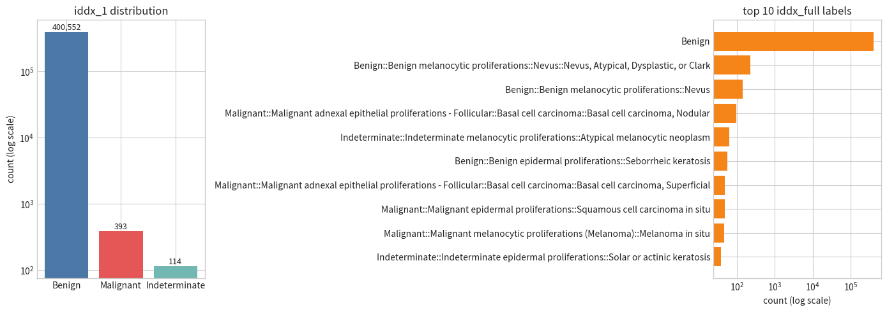

---

#### 1.2 해석

`iddx_1`은 `Benign 400,552`, `Malignant 393`, `Indeterminate 114`로 나타난다. `iddx_full`의 최빈값은 단일한 `Benign`으로 `399,991`건이며, 그 아래에 보다 세분화된 양성/악성 진단명이 소수로 등장한다.

이는 논문이 설명한 `라벨이 붙은 방식의 차이`와 잘 맞는다. 즉 train 메타데이터는 benign와 malignant가 똑같은 수준으로 정리된 테이블이 아니라, benign에는 비교적 거친 수준의 라벨이 대규모로 섞여 있고 malignant는 상대적으로 더 강한 진단 과정을 거친 사례가 집중된 테이블일 가능성이 높다. 따라서 `iddx_*` 계열은 단순 보조 진단명이 아니라 `라벨이 붙은 방식의 흔적`으로 읽어야 한다.

---

### 1.3 미리 주목받은 샘플의 흔적 확인

논문 설명에 따르면 `lesion_id`는 manually tagged lesion of interest와 관련된 식별자다. 이 컬럼이 클래스에 따라 얼마나 다르게 채워져 있는지 확인하면, 단순 식별자 이상의 `미리 중요하게 본 샘플의 흔적`이 있는지 볼 수 있다.

---

#### 실행 결과

---

| target | lesion_id_non_null_pct |
| --- | --- |
| benign | 5.407247 |
| malignant | 100.000000 |

---

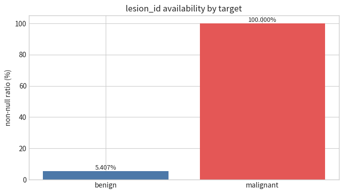

---

#### 1.3 해석

`lesion_id` 비결측 비율은 benign에서 `5.407%`, malignant에서 `100.000%`다. 이 정도 차이면 `lesion_id`는 단순 식별자라기보다 `관심 병변으로 수동 태깅되었는가`를 반영하는 대리 신호일 가능성이 크다.

즉 이 컬럼은 모델이 병변 자체를 배우는 대신, 이미 임상적으로 주목받았던 병변을 다시 찾아내는 데 이용될 위험이 있다. 그래서 `lesion_id`는 의미상으로는 식별자지만, 모델링 실험에서는 `정답에 너무 가까운 참고용 정보`로 보아야 한다.

---

### 1.4 기관/촬영환경 차이 확인

논문은 `tbp_tile_type`이 중요한 기술적 변동 요인임을 강조한다. 또한 여러 기관(`attribution`)이 섞인 데이터이므로, 출처와 조명 조건이 클래스 분포와 함께 움직이는지 확인할 필요가 있다.

---

#### 실행 결과

---

| tbp_tile_type | benign_pct | malignant_pct |
| --- | --- | --- |
| 3D: XP | 71.308 | 50.127 |
| 3D: white | 28.692 | 49.873 |

---

| attribution | row_count |
| --- | --- |
| Memorial Sloan Kettering Cancer Center | 129068 |
| Department of Dermatology, Hospital Clínic de Barcelona | 105724 |
| University Hospital of Basel | 65218 |
| Frazer Institute, The University of Queensland, Dermatology Research Centre | 51768 |
| ACEMID MIA | 28665 |
| ViDIR Group, Department of Dermatology, Medical University of Vienna | 12640 |
| Department of Dermatology, University of Athens, Andreas Syggros Hospital of Skin and Venereal Diseases, Alexander Stratigos, Konstantinos Liopyris | 7976 |

---

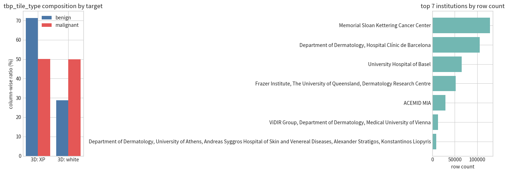

---

#### 1.4 해석

`tbp_tile_type` 분포를 보면 benign에서는 `3D: white`가 `28.692%`인데 malignant에서는 `49.873%`다. 반대로 `3D: XP`는 benign에서 `71.308%`, malignant에서 `50.127%`다. 즉 클래스와 조명 조건이 완전히 독립적이라고 보기 어렵다.

출처도 한쪽으로 치우쳐 있다. 상위 기관 몇 곳이 전체 row의 큰 부분을 차지하며, 예를 들어 Memorial Sloan Kettering Cancer Center가 `129,068`행, Hospital Clínic de Barcelona가 `105,724`행을 가진다. 이는 메타데이터 기반 모델이 병변 정보 외에 기관/조명 차이까지 함께 학습할 가능성을 시사한다. 따라서 `attribution`과 `tbp_tile_type`은 단순 부가 정보가 아니라 `기관/촬영환경 차이`를 확인하는 변수로 다뤄야 한다.

---

### 1.5 왜 row-level이 아니라 `patient_id` 단위로 분할해야 하는가

이제 환자당 row 수 분포와 malignant를 가진 환자 수를 함께 본다. 목적은 이 데이터가 단순 row 집합이 아니라 환자 단위 cluster 구조를 가지며, row-level random split이 왜 지나치게 낙관적인 평가를 만들 위험이 큰지 확인하는 것이다.

---

#### 실행 결과

---

| col_1 | value |
| --- | --- |
| patients_total | 1042.0 |
| patients_with_malignant | 259.0 |
| patients_without_malignant | 783.0 |
| patients_with_both_classes | 258.0 |
| patients_all_positive | 1.0 |
| median_rows_per_patient | 241.5 |
| max_rows_per_patient | 9184.0 |

---

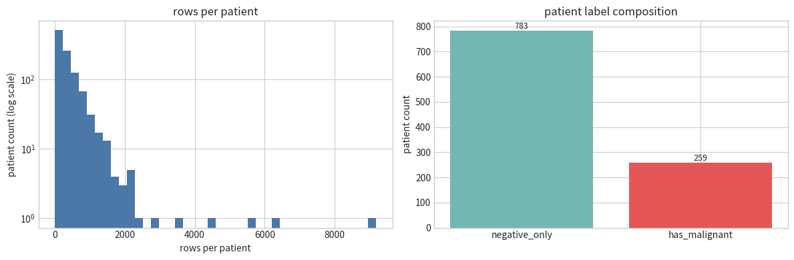

---

#### 1.5 해석

전체 `401,059`개 row는 `1,042`명의 환자로 묶여 있다. 환자당 row 수의 중앙값은 약 `241.5`개이고, 최대 환자는 `9,184`개 row를 가진다. malignant를 하나라도 가진 환자는 `259`명이며, 이 중 `258`명은 benign와 malignant를 동시에 갖고 있고 `1`명만 모든 row가 positive다.

이 구조에서는 row-level random split이 지나치게 낙관적일 수 있다. 같은 환자의 benign와 malignant가 서로 다른 split에 동시에 흩어지면, 모델은 병변 일반화보다 환자 고유 분포를 재식별했을 가능성이 크다. 따라서 이번 프로젝트의 기본 분할 단위는 row가 아니라 `patient_id`가 되어야 한다.

---

### 1.6 왜 public `test-metadata.csv`는 분석 중심에서 배제되는가

public test 배제는 이번 노트북의 중심 주제는 아니지만, 짧게 근거를 남길 필요는 있다. 따라서 공개 test의 크기만 비교해 보고, 왜 본격 EDA와 내부 benchmark 설계는 `train-metadata.csv` 중심으로 갈 수밖에 없는지 확인한다.

---

#### 실행 결과

---

| col_1 | dataset | rows | columns |
| --- | --- | --- | --- |
| 0 | train-metadata | 401059 | 55 |
| 1 | public test-metadata | 3 | 44 |

---

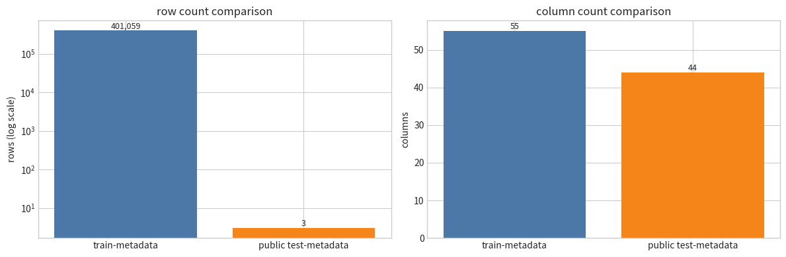

---

#### 1.6 해석

공개 train은 `401,059`행 `55`컬럼인데, 공개 test는 `3`행 `44`컬럼이다. 이 정도 규모 차이면 public test를 일반적인 hold-out test처럼 해석하는 것은 사실상 불가능하다.

따라서 public test는 파이프라인 점검용 참고 자료로만 두고, 본격적인 EDA와 `train / validation / internal test` 재구성은 `train-metadata.csv` 내부에서 수행하는 것이 타당하다.

---

### 1.7 중간 결론

앞의 코드 결과를 종합하면, 현재 EDA는 다음 방향으로 갈 수밖에 없다.

1. 이 데이터는 극단적 클래스 불균형을 가진다.
2. `iddx_*` 분포는 `라벨이 붙은 방식의 차이`를 보여 준다.
3. `lesion_id`는 단순 식별자를 넘어 `미리 주목받은 샘플의 흔적`일 가능성이 높다.
4. `tbp_tile_type`과 `attribution`은 `기관/촬영환경 차이`를 확인하는 변수로 다뤄야 한다.
5. split은 row-level이 아니라 `patient_id` disjoint를 기본으로 해야 한다.
6. public test는 본격 EDA 대상이 아니라 배제 근거만 남기고 넘어가는 것이 적절하다.

따라서 이후 노트북은 `카테고리별 의미`와 `사용 가능성(regime)`을 동시에 보는 2축 구조로 진행한다.

---

## 2. 카테고리 기반 변수 체계 정리

이제 변수들을 목적 기반 카테고리로 나누어 EDA의 기본 단위를 잡는다. 다만 의미상 카테고리만으로는 충분하지 않기 때문에, 뒤에서는 같은 컬럼들을 다시 `메인용(strict) / 보조용(relaxed) / 참고용(oracle) / 입력 제외(not_feature)` 관점으로도 함께 정리한다.

---

### 2.1 목적 기반 변수 카테고리 정의

이번 코드 셀의 목적은 전체 컬럼을 해석하기 쉬운 목적 기반 카테고리로 나누는 것이다. 이후의 카테고리별 EDA는 이 분류를 따라 진행한다.

---

#### 실행 결과

---

| category | column_count |
| --- | --- |
| 색채·광학 특징 | 18 |
| 형태·기하 특징 | 12 |
| 임상·병리 정보 | 9 |
| 위치·공간 좌표 | 6 |
| 식별자 및 출처 | 5 |
| 환자 인구통계 | 2 |
| 촬영 조건 메타데이터 | 2 |
| 예측 타깃 | 1 |

---

| col_1 | column | category |
| --- | --- | --- |
| 0 | tbp_lv_A | 색채·광학 특징 |
| 1 | tbp_lv_Aext | 색채·광학 특징 |
| 2 | tbp_lv_B | 색채·광학 특징 |
| 3 | tbp_lv_Bext | 색채·광학 특징 |
| 4 | tbp_lv_C | 색채·광학 특징 |
| 5 | tbp_lv_Cext | 색채·광학 특징 |
| 6 | tbp_lv_H | 색채·광학 특징 |
| 7 | tbp_lv_Hext | 색채·광학 특징 |
| 8 | tbp_lv_L | 색채·광학 특징 |
| 9 | tbp_lv_Lext | 색채·광학 특징 |
| 10 | tbp_lv_color_std_mean | 색채·광학 특징 |
| 11 | tbp_lv_deltaA | 색채·광학 특징 |

---

_요약표는 상위 12행만 보여준다. 전체 표는 [009_2_1_목적_기반_변수_카테고리_정의.md](isic2024_presentation_only_eda_chatgpt_report_tables/009_2_1_목적_기반_변수_카테고리_정의.md)에서 확인할 수 있다._

---

```text
unassigned_columns: []
```

---

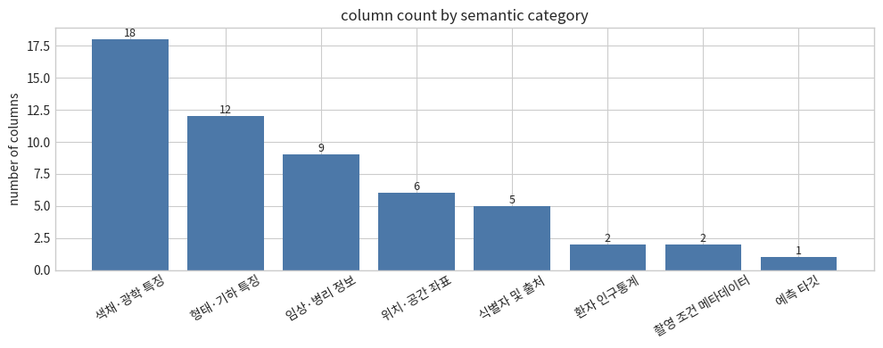

---

#### 2.1 해석

전체 55개 컬럼은 `예측 타깃`, `식별자 및 출처`, `환자 인구통계`, `임상·병리 정보`, `촬영 조건 메타데이터`, `색채·광학 특징`, `형태·기하 특징`, `위치·공간 좌표`의 여덟 카테고리로 무리 없이 분류된다. `unassigned_columns`가 비어 있으므로, 현재 카테고리 설계는 train 메타데이터 전체를 빠짐없이 덮고 있다.

이 구조의 장점은 이후 EDA를 `컬럼 하나씩`이 아니라 `의미 있는 묶음 단위`로 진행할 수 있다는 점이다. 특히 발표나 보고서에서는 이 카테고리 구조가 훨씬 읽기 쉽다.

---

### 2.2 카테고리별 컬럼 분포 확인

이번 코드 셀의 목적은 각 카테고리가 어떤 dtype과 결측 수준을 갖는지 한 번에 보는 것이다. 이렇게 해야 `어떤 카테고리가 안정적인 공통 feature군이고, 어떤 카테고리가 본질적으로 불안정하거나 train 전용 성격을 띠는지`를 빠르게 파악할 수 있다.

---

#### 실행 결과

---

**표 2.2-a. 카테고리별 컬럼 수와 평균 결측률**

---

| category | column_count | mean_missing_ratio_pct |
| --- | --- | --- |
| 색채·광학 특징 | 18 | 0.000 |
| 형태·기하 특징 | 12 | 0.000 |
| 임상·병리 정보 | 9 | 66.589 |
| 위치·공간 좌표 | 6 | 0.239 |
| 식별자 및 출처 | 5 | 18.900 |
| 촬영 조건 메타데이터 | 2 | 0.000 |
| 환자 인구통계 | 2 | 1.785 |
| 예측 타깃 | 1 | 0.000 |

---

**표 2.2-b. 카테고리별 개별 컬럼 목록과 결측률**

---

| col_1 | column | category | dtype | missing_ratio_pct |
| --- | --- | --- | --- | --- |
| 0 | tbp_lv_A | 색채·광학 특징 | float64 | 0.000 |
| 1 | tbp_lv_Aext | 색채·광학 특징 | float64 | 0.000 |
| 2 | tbp_lv_B | 색채·광학 특징 | float64 | 0.000 |
| 3 | tbp_lv_Bext | 색채·광학 특징 | float64 | 0.000 |
| 4 | tbp_lv_C | 색채·광학 특징 | float64 | 0.000 |
| 5 | tbp_lv_Cext | 색채·광학 특징 | float64 | 0.000 |
| 6 | tbp_lv_H | 색채·광학 특징 | float64 | 0.000 |
| 7 | tbp_lv_Hext | 색채·광학 특징 | float64 | 0.000 |
| 8 | tbp_lv_L | 색채·광학 특징 | float64 | 0.000 |
| 9 | tbp_lv_Lext | 색채·광학 특징 | float64 | 0.000 |
| 10 | tbp_lv_color_std_mean | 색채·광학 특징 | float64 | 0.000 |
| 11 | tbp_lv_deltaA | 색채·광학 특징 | float64 | 0.000 |

---

_요약표는 상위 12행만 보여준다. 전체 표는 [011_2_2_카테고리별_컬럼_분포_확인.md](isic2024_presentation_only_eda_chatgpt_report_tables/011_2_2_카테고리별_컬럼_분포_확인.md)에서 확인할 수 있다._

---

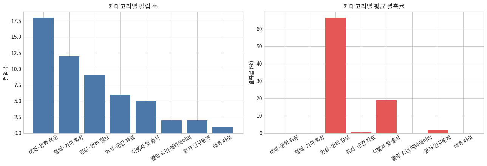

---

#### 2.2 해석

색채·광학 특징과 형태·기하 특징이 가장 큰 feature 묶음을 이룬다. 반면 평균 결측률을 보면 `임상·병리 정보`와 `식별자 및 출처` 카테고리는 다른 카테고리보다 훨씬 불안정하다. 이는 앞에서 본 `iddx_*`, `mel_*`, `lesion_id` 구조가 카테고리 수준에서도 그대로 드러난다는 뜻이다.

즉 카테고리 기반 EDA는 단순 분류표를 넘어서, 어떤 범주가 실제형 feature군이고 어떤 범주가 `미리 주목받은 샘플의 흔적` 또는 `정답에 너무 가까운 참고용 정보` 성격을 띠는지를 파악하는 첫 필터 역할을 한다.

---

### 2.2-b 숫자형 컬럼 분포 미리보기

앞의 표와 막대그래프는 `무슨 컬럼이 얼마나 있는가`를 보여준다. 이번 셀은 한 걸음 더 나아가, 각 카테고리 안의 숫자형 컬럼 분포를 `페이지를 넘기듯` 나눠서 보는 미리보기 셀이다. 한 화면에 너무 많은 그래프를 올리지 않기 위해 카테고리와 페이지를 나누어 보도록 구성한다.

---

#### 실행 결과

---

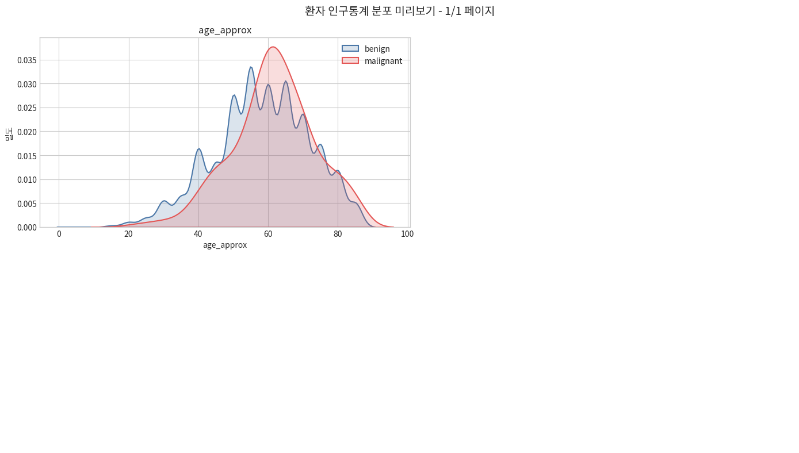

---

**현재 페이지 변수 목록:** age_approx

---

```text
ipywidgets를 사용할 수 없어 기본 페이지(1)만 먼저 보여 준다.
```

---

#### 2.2-b 해석

이 셀은 `전체 숫자형 컬럼을 한 번에 다 보기 어렵다`는 문제를 해결하기 위한 탐색용 페이지다. 카테고리별로 4개 변수씩 나누어 보기 때문에, 특정 묶음 안에서 benign과 malignant 분포가 어디서 갈라지는지 더 차분하게 확인할 수 있다.

이 미리보기 셀의 역할은 결론을 단정하는 것이 아니라, 뒤의 `5.5 색채·광학 특징`, `5.6 형태·기하 특징`, `5.7 위치·공간 좌표`에서 더 깊게 볼 후보 변수를 고르는 것이다.

---

### 2.3 카테고리와 `Strict (메인용) / Relaxed (보조용) / Oracle (참고용)` 매핑 정리

의미 기반 카테고리만으로는 모델링 사용 가능성을 설명할 수 없으므로, 같은 컬럼들을 다시 `어디까지 써도 되는가` 관점으로 매핑한다. 목적은 `무슨 컬럼인가`와 `써도 되는가`를 동시에 정리하는 것이다.

---

#### 실행 결과

---

**표 2.3-a. 카테고리별 regime 분포 요약**

---

| regime / category | Strict (메인용) | Relaxed (보조용) | Oracle (참고용) | Not Feature (입력 제외) | Label (예측 타깃) |
| --- | --- | --- | --- | --- | --- |
| 색채·광학 특징 | 18 | 0 | 0 | 0 | 0 |
| 식별자 및 출처 | 0 | 2 | 1 | 2 | 0 |
| 예측 타깃 | 0 | 0 | 0 | 0 | 1 |
| 위치·공간 좌표 | 6 | 0 | 0 | 0 | 0 |
| 임상·병리 정보 | 0 | 0 | 9 | 0 | 0 |
| 촬영 조건 메타데이터 | 2 | 0 | 0 | 0 | 0 |
| 형태·기하 특징 | 12 | 0 | 0 | 0 | 0 |
| 환자 인구통계 | 2 | 0 | 0 | 0 | 0 |

---

**표 2.3-b. 컬럼별 카테고리-레짐 매핑표**

---

| col_1 | category | column | regime_display | missing_ratio_pct |
| --- | --- | --- | --- | --- |
| 0 | 색채·광학 특징 | tbp_lv_A | Strict (메인용) | 0.000 |
| 1 | 색채·광학 특징 | tbp_lv_Aext | Strict (메인용) | 0.000 |
| 2 | 색채·광학 특징 | tbp_lv_B | Strict (메인용) | 0.000 |
| 3 | 색채·광학 특징 | tbp_lv_Bext | Strict (메인용) | 0.000 |
| 4 | 색채·광학 특징 | tbp_lv_C | Strict (메인용) | 0.000 |
| 5 | 색채·광학 특징 | tbp_lv_Cext | Strict (메인용) | 0.000 |
| 6 | 색채·광학 특징 | tbp_lv_H | Strict (메인용) | 0.000 |
| 7 | 색채·광학 특징 | tbp_lv_Hext | Strict (메인용) | 0.000 |
| 8 | 색채·광학 특징 | tbp_lv_L | Strict (메인용) | 0.000 |
| 9 | 색채·광학 특징 | tbp_lv_Lext | Strict (메인용) | 0.000 |
| 10 | 색채·광학 특징 | tbp_lv_color_std_mean | Strict (메인용) | 0.000 |
| 11 | 색채·광학 특징 | tbp_lv_deltaA | Strict (메인용) | 0.000 |

---

_요약표는 상위 12행만 보여준다. 전체 표는 [013_2_3_카테고리와_Strict_메인용_Relaxed_보조용_Oracle_참고용_매핑_정리.md](isic2024_presentation_only_eda_chatgpt_report_tables/013_2_3_카테고리와_Strict_메인용_Relaxed_보조용_Oracle_참고용_매핑_정리.md)에서 확인할 수 있다._

---

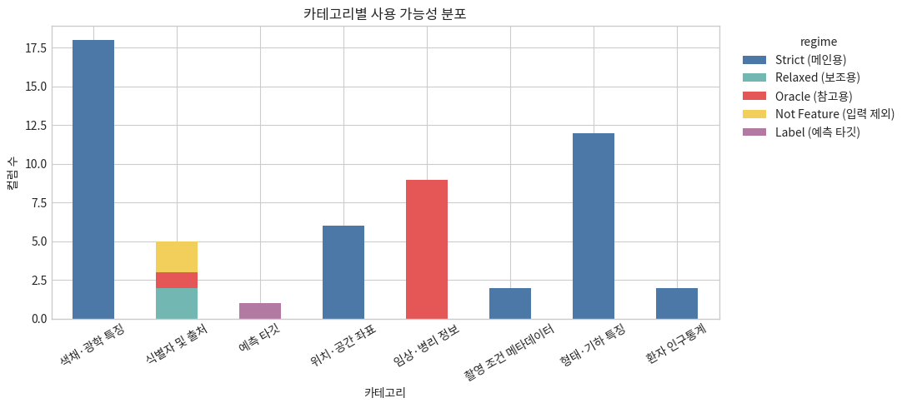

---

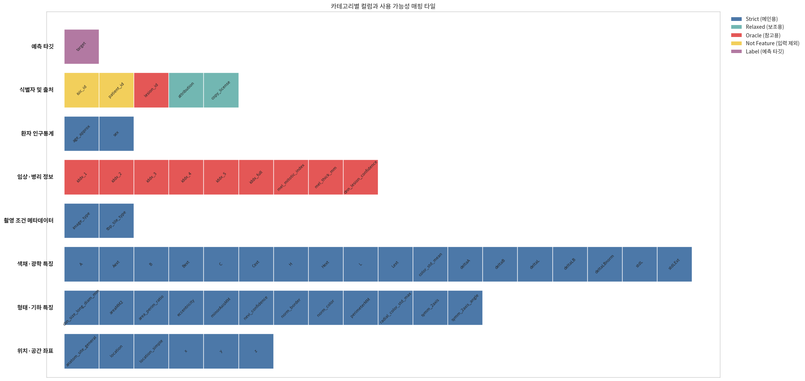

---

#### 2.3 해석

같은 카테고리 안에서도 사용 가능성이 갈린다는 점이 중요하다. 예를 들어 `식별자 및 출처` 카테고리 안에서도 `isic_id`, `patient_id`는 `Not Feature (입력 제외)`, `attribution`, `copyright_license`는 `Relaxed (보조용)`, `lesion_id`는 `Oracle (참고용)`이다. `임상·병리 정보` 카테고리는 거의 전부 `Oracle (참고용)` 성격이고, 환자 인구통계나 색채·광학 특징, 형태·기하 특징은 주로 `Strict (메인용)`에 속한다.

즉 이후 EDA는 `카테고리별로 해석하되`, 모델링 논의에서는 반드시 `사용 가능성 수준`을 함께 적어야 한다. 타일 다이어그램은 이 원칙을 한눈에 보여 주는 지도 역할을 한다.

---

## 3. 데이터 구조 개요

앞에서 방향과 분류 체계를 고정했으므로, 이제 같은 `train_df`를 기준으로 데이터 구조를 조금 더 정리한다. 아래에서도 동일한 원칙을 유지한다. 먼저 코드로 관찰하고, 그 결과를 바탕으로 해석한 뒤 다음 분석으로 넘어간다.

---

### 3.1 데이터 파일과 분석 대상 확인

이번 코드 셀은 이후 분석 전부가 같은 파일을 보고 있다는 점을 고정하기 위한 것이다.

---

#### 실행 결과

---

```text
PosixPath('/home/junkim2603a/proj/paper_ajou_dev/dataset/isic-2024-challenge/train-metadata.csv')
```

---

#### 3.1 해석

분석 대상은 ISIC 2024 챌린지의 메타데이터 파일인 `train-metadata.csv`다. 이 노트북은 의도적으로 train 자체의 구조를 중심으로 해석하는 문서다.

---

### 3.2 데이터 크기와 첫 인상 확인

이 코드 셀은 이미 적재한 train 메타데이터를 기준으로 전체 shape와 앞부분 몇 행을 다시 확인하는 것이다. 여기서는 한 row가 어떤 메타데이터 구조를 가지는지 눈으로 점검하는 데 목적이 있다.

---

#### 실행 결과

---

```text
shape: (401059, 55)
```

---

| col_1 | isic_id | target | patient_id | age_approx | sex | anatom_site_general | clin_size_long_diam_mm | image_type | tbp_tile_type | tbp_lv_A | ... | lesion_id | iddx_full | iddx_1 | iddx_2 | iddx_3 | iddx_4 | iddx_5 | mel_mitotic_index | mel_thick_mm | tbp_lv_dnn_lesion_confidence |
| --- | --- | --- | --- | --- | --- | --- | --- | --- | --- | --- | --- | --- | --- | --- | --- | --- | --- | --- | --- | --- | --- |
| 0 | ISIC_0015670 | 0 | IP_1235828 | 60.0 | male | lower extremity | 3.04 | TBP tile: close-up | 3D: white | 20.244422 | ... | NaN | Benign | Benign | NaN | NaN | NaN | NaN | NaN | NaN | 97.517282 |
| 1 | ISIC_0015845 | 0 | IP_8170065 | 60.0 | male | head/neck | 1.10 | TBP tile: close-up | 3D: white | 31.712570 | ... | IL_6727506 | Benign | Benign | NaN | NaN | NaN | NaN | NaN | NaN | 3.141455 |
| 2 | ISIC_0015864 | 0 | IP_6724798 | 60.0 | male | posterior torso | 3.40 | TBP tile: close-up | 3D: XP | 22.575830 | ... | NaN | Benign | Benign | NaN | NaN | NaN | NaN | NaN | NaN | 99.804040 |

---

#### 3.2 해석

데이터는 총 `401,059`개 행과 `55`개 컬럼으로 구성된다. 한 행은 개별 샘플의 메타데이터로 보이며, `isic_id`, `patient_id`, `target` 같은 식별/라벨 정보와 `tbp_lv_*` 계열의 수치형 특징, 진단 관련 문자열 컬럼이 한 테이블에 함께 들어 있다.

즉 첫 인상부터 이 파일은 일반 메타데이터와 진단 관련 후행 정보가 섞인 복합 테이블이라는 점을 드러낸다.

---

### 3.3 컬럼 스키마 요약

이 코드 셀의 목적은 각 컬럼의 자료형, 결측 개수, 결측 비율, 고유값 개수를 한 번에 정리해서 어떤 변수들이 어떤 성격을 가지는지 파악하는 것이다.

---

#### 실행 결과

---

**표 3.3-a. 컬럼 스키마 요약표**

---

| col_1 | column | dtype | null_count | null_ratio_pct | n_unique | category | regime | regime_display | description_ko |
| --- | --- | --- | --- | --- | --- | --- | --- | --- | --- |
| 0 | iddx_5 | object | 401058 | 100.00 | 1 | 임상·병리 정보 | oracle | Oracle (참고용) | 5단계 병변 진단 분류 |
| 1 | mel_mitotic_index | object | 401006 | 99.99 | 7 | 임상·병리 정보 | oracle | Oracle (참고용) | 침윤성 악성 흑색종의 mitotic index |
| 2 | mel_thick_mm | float64 | 400996 | 99.98 | 19 | 임상·병리 정보 | oracle | Oracle (참고용) | 흑색종 침윤 깊이(mm) |
| 3 | iddx_4 | object | 400508 | 99.86 | 26 | 임상·병리 정보 | oracle | Oracle (참고용) | 4단계 병변 진단 분류 |
| 4 | iddx_3 | object | 399994 | 99.73 | 25 | 임상·병리 정보 | oracle | Oracle (참고용) | 3단계 병변 진단 분류 |
| 5 | iddx_2 | object | 399991 | 99.73 | 14 | 임상·병리 정보 | oracle | Oracle (참고용) | 2단계 병변 진단 분류 |
| 6 | lesion_id | object | 379001 | 94.50 | 22058 | 식별자 및 출처 | oracle | Oracle (참고용) | 수동으로 관심 병변으로 태깅된 lesion 고유 ID |
| 7 | sex | object | 11517 | 2.87 | 2 | 환자 인구통계 | strict | Strict (메인용) | 환자 성별 |
| 8 | anatom_site_general | object | 5756 | 1.44 | 5 | 위치·공간 좌표 | strict | Strict (메인용) | 병변이 위치한 큰 신체 부위 |
| 9 | age_approx | float64 | 2798 | 0.70 | 16 | 환자 인구통계 | strict | Strict (메인용) | 촬영 시점의 환자 대략 나이 |
| 10 | isic_id | object | 0 | 0.00 | 401059 | 식별자 및 출처 | not_feature | Not Feature (입력 제외) | 각 이미지/사례를 구분하는 고유 식별자 |
| 11 | tbp_lv_deltaB | float64 | 0 | 0.00 | 398886 | 색채·광학 특징 | strict | Strict (메인용) | 병변 내부와 외부의 평균 B* 대비 |

---

_요약표는 상위 12행만 보여준다. 전체 표는 [015_3_3_컬럼_스키마_요약.md](isic2024_presentation_only_eda_chatgpt_report_tables/015_3_3_컬럼_스키마_요약.md)에서 확인할 수 있다._

---

#### 3.3 해석

이 장에서는 산점도보다 `설명형 스키마 표`에 집중하도록 구성했다. 현재 단계에서는 `각 컬럼이 무엇을 뜻하는가`, `결측이 얼마나 있는가`, `어느 카테고리와 regime에 속하는가`를 한 줄에서 같이 읽는 것이 더 중요하기 때문이다.

특히 표의 가장 오른쪽 설명 열은 `dataset_description.txt`를 바탕으로 각 컬럼의 역할을 짧게 정리한 것이다. 그래서 이 표는 단순 사전 목록이 아니라, 이후 `메인용 / 보조용 / 참고용`을 구분하고 전처리 규칙을 정할 때 계속 참고하는 기준표 역할을 한다.

---

### 3.4 전체 수준 요약 지표 정리

이 코드 셀은 데이터셋 전체를 거시적으로 보기 위한 요약 지표를 모은다. 행/열 개수, 전체 결측치 수, 결측 비율, 중복 행 수, 숫자형/문자형 컬럼 수를 빠르게 확인한다.

---

#### 실행 결과

---

```text
n_rows                    401059.00
n_columns                     55.00
total_cells             22058245.00
total_missing_values     2802625.00
missing_ratio_pct             12.71
duplicate_rows                 0.00
numeric_columns               37.00
object_columns                18.00
dtype: float64
```

---

#### 3.4 해석

전체 셀 수는 `22,058,245`개이고, 이 중 결측은 `2,802,625`개로 약 `12.71%`다. 완전히 동일한 중복 행은 `0`개이므로, 현재 시점에서는 단순 중복 제거보다 결측 구조와 컬럼 사용 가능성을 이해하는 것이 더 중요하다.

또한 숫자형 컬럼이 `37`개, 문자열 기반 컬럼이 `18`개이므로 이후 EDA는 수치형 분포 분석과 범주형 빈도 분석을 나누어 진행하는 것이 자연스럽다.

---

### 3.5 자료형 분포 확인

이 코드 셀의 목적은 dtype 분포를 요약해서 전처리 관점에서 어떤 타입의 컬럼이 주를 이루는지 빠르게 파악하는 것이다.

---

#### 실행 결과

---

| dtype | count |
| --- | --- |
| float64 | 35 |
| object | 18 |
| int64 | 2 |

---

#### 3.5 해석

자료형은 `float64` 35개, `object` 18개, `int64` 2개다. 즉 이 메타데이터는 연속형 수치 특성이 중심이고, 일부 식별자/진단 문자열 컬럼이 이를 보완하는 구조라고 볼 수 있다.

정수형이 거의 없다는 점도 특징이다. 사실상 `target`과 `tbp_lv_symm_2axis_angle` 정도만 정수형으로 관리되고 있어, 이후 분석에서는 수치형 변수의 분포와 범주형 변수의 결측/빈도 구조를 분리해서 보는 것이 좋다.

---

### 3.6 현재 단계의 중간 결론

- 데이터 규모는 충분히 크지만 malignant signal은 극도로 희귀하다.
- 데이터는 독립 row 집합이 아니라 환자 단위 cluster 구조를 가진다.
- `iddx_*`, `mel_*`, `lesion_id`, `tbp_lv_dnn_lesion_confidence`는 일반 메타데이터와 같은 수준으로 다루기 어렵다.
- 이후 EDA는 카테고리별 분석을 진행하되, 각 카테고리 끝에서 반드시 `메인용 / 보조용 / 참고용 / 입력 제외` 관점을 함께 적는 방식으로 이어가는 것이 타당하다.

---

## 4. 결측치 구조 분석

이 장에서는 결측을 단순한 데이터 품질 문제로 보지 않고, 어떤 카테고리가 구조적으로 비어 있고 어떤 카테고리가 비교적 안정적인지를 확인한다. 특히 ISIC 2024 메타데이터에서는 결측 자체가 `train 전용 진단 정보`, `미리 주목받은 샘플의 흔적`, `관측 가능성의 차이`를 반영할 수 있으므로, 결측 구조를 먼저 해석하는 것이 중요하다.

---

### 4.1 컬럼별 결측치 규모 확인

먼저 컬럼 단위와 카테고리 단위에서 결측치 규모를 동시에 본다. 이 단계의 목적은 어떤 컬럼이 거의 전부 비어 있는지, 그리고 그 결측이 특정 의미 카테고리에 집중되어 있는지를 확인하는 것이다.

---

#### 실행 결과

---

| col_1 | column | null_count | null_ratio_pct | dtype |
| --- | --- | --- | --- | --- |
| 51 | iddx_5 | 401058 | 99.9998 | object |
| 52 | mel_mitotic_index | 401006 | 99.9868 | object |
| 53 | mel_thick_mm | 400996 | 99.9843 | float64 |
| 50 | iddx_4 | 400508 | 99.8626 | object |
| 49 | iddx_3 | 399994 | 99.7345 | object |
| 48 | iddx_2 | 399991 | 99.7337 | object |
| 45 | lesion_id | 379001 | 94.5001 | object |
| 4 | sex | 11517 | 2.8716 | object |
| 5 | anatom_site_general | 5756 | 1.4352 | object |
| 3 | age_approx | 2798 | 0.6977 | float64 |
| 0 | isic_id | 0 | 0.0000 | object |
| 1 | target | 0 | 0.0000 | int64 |

---

_요약표는 상위 12행만 보여준다. 전체 표는 [017_4_1_컬럼별_결측치_규모_확인.md](isic2024_presentation_only_eda_chatgpt_report_tables/017_4_1_컬럼별_결측치_규모_확인.md)에서 확인할 수 있다._

---

| category | n_columns | mean_missing_ratio_pct | max_missing_ratio_pct |
| --- | --- | --- | --- |
| 임상·병리 정보 | 9 | 66.589078 | 99.9998 |
| 식별자 및 출처 | 5 | 18.900020 | 94.5001 |
| 환자 인구통계 | 2 | 1.784650 | 2.8716 |
| 위치·공간 좌표 | 6 | 0.239200 | 1.4352 |
| 색채·광학 특징 | 18 | 0.000000 | 0.0000 |
| 예측 타깃 | 1 | 0.000000 | 0.0000 |
| 촬영 조건 메타데이터 | 2 | 0.000000 | 0.0000 |
| 형태·기하 특징 | 12 | 0.000000 | 0.0000 |

---

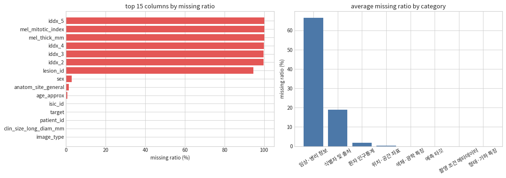

---

#### 4.1 해석

결측 상위 컬럼은 `iddx_5 99.9998%`, `mel_mitotic_index 99.9868%`, `mel_thick_mm 99.9843%`, `iddx_4 99.8626%`, `iddx_3 99.7345%`, `iddx_2 99.7337%`, `lesion_id 94.5001%` 순이다. 반면 `sex 2.8716%`, `anatom_site_general 1.4352%`, `age_approx 0.6977%`를 제외하면 나머지 공통 메타데이터는 거의 비어 있지 않다.

카테고리 수준에서 보면 평균 결측률은 `임상·병리 정보 66.5891%`, `식별자 및 출처 18.9000%`, `환자 인구통계 1.7847%`, `위치·공간 좌표 0.2392%` 순이다. 반면 `촬영 조건 메타데이터`, `색채·광학 특징`, `형태·기하 특징`은 평균 결측률이 사실상 `0%`다.

즉 이 데이터의 결측은 랜덤하게 퍼진 문제가 아니라, 특정 카테고리에 구조적으로 집중되어 있다. 특히 `임상·병리 정보`는 관측 누락이라기보다 특정 subset에서만 정의되는 후행 정보일 가능성이 높다.

---

### 4.2 결측치 비율 상위 변수 해석

이제 결측 상위 컬럼을 의미별로 해석한다. 목적은 결측이 단순 잡음인지, 아니면 `정답에 너무 가까운 후행 진단 정보`, `미리 주목받은 샘플의 흔적`, `일반적인 누락` 중 어느 쪽에 가까운지를 구분하는 것이다.

---

#### 실행 결과

---

| col_1 | column | null_ratio_pct | category | regime |
| --- | --- | --- | --- | --- |
| 51 | iddx_5 | 99.9998 | 임상·병리 정보 | oracle |
| 52 | mel_mitotic_index | 99.9868 | 임상·병리 정보 | oracle |
| 53 | mel_thick_mm | 99.9843 | 임상·병리 정보 | oracle |
| 50 | iddx_4 | 99.8626 | 임상·병리 정보 | oracle |
| 49 | iddx_3 | 99.7345 | 임상·병리 정보 | oracle |
| 48 | iddx_2 | 99.7337 | 임상·병리 정보 | oracle |
| 45 | lesion_id | 94.5001 | 식별자 및 출처 | oracle |
| 4 | sex | 2.8716 | 환자 인구통계 | strict |
| 5 | anatom_site_general | 1.4352 | 위치·공간 좌표 | strict |
| 3 | age_approx | 0.6977 | 환자 인구통계 | strict |
| 0 | isic_id | 0.0000 | 식별자 및 출처 | not_feature |
| 1 | target | 0.0000 | 예측 타깃 | label |

---

_요약표는 상위 12행만 보여준다. 전체 표는 [019_4_2_결측치_비율_상위_변수_해석.md](isic2024_presentation_only_eda_chatgpt_report_tables/019_4_2_결측치_비율_상위_변수_해석.md)에서 확인할 수 있다._

---

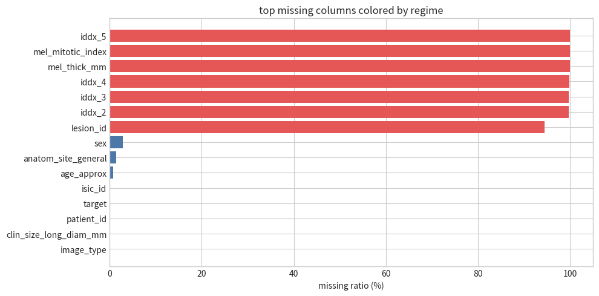

---

#### 4.2 해석

결측 상위 컬럼 대부분은 `임상·병리 정보` 또는 `식별자 및 출처` 카테고리에 속하고, 사용 가능성 관점에서는 거의 전부 `참고용` 또는 그에 준하는 위험한 정보다. 특히 `iddx_2`~`iddx_5`, `mel_mitotic_index`, `mel_thick_mm`는 거의 전부 비어 있으므로, 일반 입력 feature라기보다 특정 강한 진단 경로를 거친 샘플에서만 정의된 후행 변수로 해석하는 편이 타당하다.

`lesion_id` 역시 높은 결측률 때문에 단순 식별자처럼 보이지 않는다. 앞 장에서 본 것처럼 malignant에서는 거의 항상 존재하고 benign에서는 대부분 비어 있으므로, 이는 결측 자체가 `미리 주목받은 샘플의 흔적`일 가능성을 시사한다. 반대로 `sex`, `age_approx`, `anatom_site_general`의 결측은 상대적으로 낮아 `메인용` feature군 안에서 관리 가능한 일반 누락에 가깝다.

따라서 결측치 관점만 보더라도 `메인용 / 보조용 / 참고용` 분리는 임의적 선택이 아니라 데이터 구조가 강제한 결과라고 볼 수 있다.

---

## 5. 카테고리별 EDA

이 장부터는 앞에서 정의한 카테고리 순서대로 세부 EDA를 진행한다. 각 카테고리에서는 먼저 코드로 구조를 확인하고, 그 결과를 해석한 뒤, 마지막에 해당 카테고리가 `메인용 / 보조용 / 참고용 / 입력 제외` 중 어디에 가까운지도 함께 정리한다.

---

### 5.1 식별자 및 출처

이 카테고리에는 `isic_id`, `patient_id`, `lesion_id`, `attribution`, `copyright_license`가 포함된다. 목적은 이 변수들이 단순 관리용 메타데이터인지, 아니면 데이터 집중도와 `미리 주목받은 샘플의 흔적`을 드러내는 분석 축인지 확인하는 것이다.

---

#### 실행 결과

---

**표 5.1-a. 식별자 및 출처 변수 기본 요약**

---

| col_1 | column | dtype | n_unique | null_count | null_ratio_pct | regime_display |
| --- | --- | --- | --- | --- | --- | --- |
| 0 | isic_id | object | 401059 | 0 | 0.0000 | Not Feature (입력 제외) |
| 1 | patient_id | object | 1042 | 0 | 0.0000 | Not Feature (입력 제외) |
| 2 | lesion_id | object | 22058 | 379001 | 94.5001 | Oracle (참고용) |
| 3 | attribution | object | 7 | 0 | 0.0000 | Relaxed (보조용) |
| 4 | copyright_license | object | 3 | 0 | 0.0000 | Relaxed (보조용) |

---

**표 5.1-b. 환자당 row 수 분위수**

---

| col_1 | rows_per_patient |
| --- | --- |
| 0% | 1.00 |
| 25% | 115.00 |
| 50% | 241.50 |
| 75% | 477.50 |
| 90% | 822.90 |
| 95% | 1122.65 |
| 99% | 2157.58 |
| 100% | 9184.00 |

---

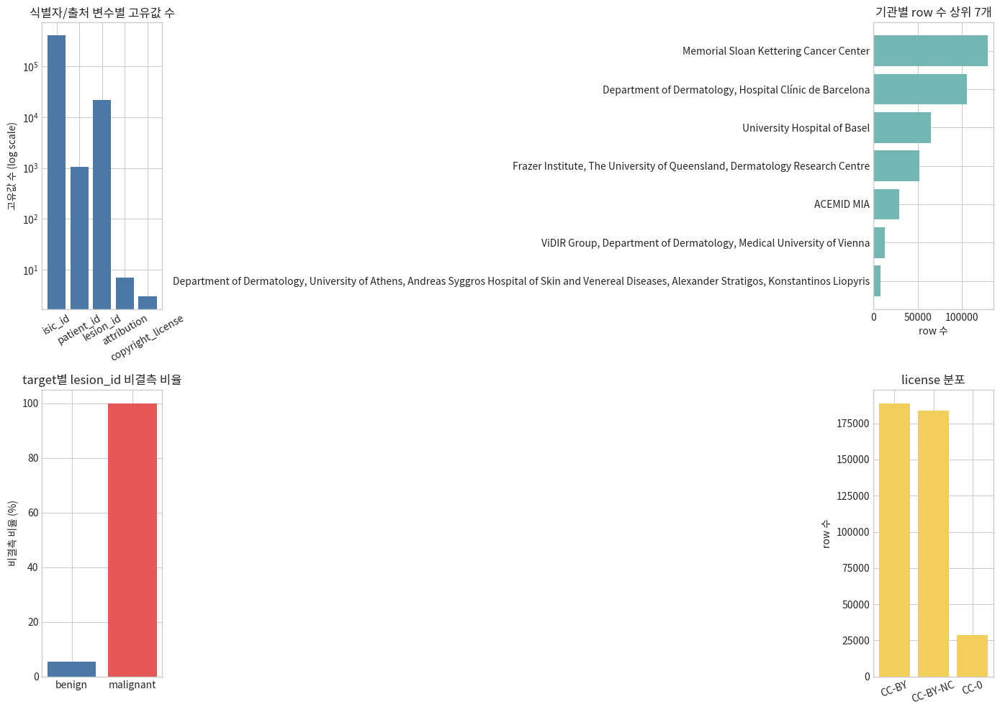

---

#### 5.1 해석

`isic_id`는 `401,059`개 고유값을 가지므로 사실상 row-level 식별자이고, `patient_id`는 `1,042`개 고유값을 가진다. `lesion_id`는 `22,058`개 고유값만 남아 있으며 결측률이 `94.5001%`로 매우 높다. 즉 식별자 및 출처 카테고리 안에서도 역할이 완전히 갈린다.

환자당 row 수 분포를 보면 중앙값이 `241.5`, 99% 분위수가 `2,157.58`, 최대값이 `9,184`다. 이는 `patient_id`가 단순 그룹 레이블이 아니라 split 설계를 지배하는 핵심 구조 변수임을 다시 보여 준다.

출처는 소수 기관에 강하게 집중되어 있다. 상위 4개 기관이 전체 row의 약 `87.7%`를 차지하므로, `attribution`은 `Relaxed (보조용)`에서는 볼 수 있어도 `Strict (메인용)`에서는 조심스럽게 다뤄야 한다. 또 `lesion_id`는 benign에서 `5.4072%`, malignant에서 `100.0000%` 비결측이므로, `Oracle (참고용)`에 가까운 강한 신호다.

---

### 5.2 환자 인구통계

이 카테고리에는 `age_approx`와 `sex`가 포함된다. 목적은 환자 인구통계 분포가 target과 어떤 방향으로 연결되는지 확인하고, 이 변수들이 `Strict (메인용)` baseline에 포함될 만한 안정적인 공통 메타데이터인지 점검하는 것이다.

---

#### 실행 결과

---

**표 5.2-a. 환자 인구통계 기본 요약**

---

| col_1 | column | dtype | null_count | null_ratio_pct | regime_display |
| --- | --- | --- | --- | --- | --- |
| 0 | age_approx | float64 | 2798 | 0.6977 | Strict (메인용) |
| 1 | sex | object | 11517 | 2.8716 | Strict (메인용) |

---

**표 5.2-b. target별 나이 요약 통계**

---

| target | count | mean | std | min | 25% | 50% | 75% | max |
| --- | --- | --- | --- | --- | --- | --- | --- | --- |
| benign | 397871.0 | 58.010 | 13.597 | 5.0 | 50.0 | 60.0 | 70.0 | 85.0 |
| malignant | 390.0 | 61.372 | 11.933 | 20.0 | 55.0 | 60.0 | 70.0 | 85.0 |

---

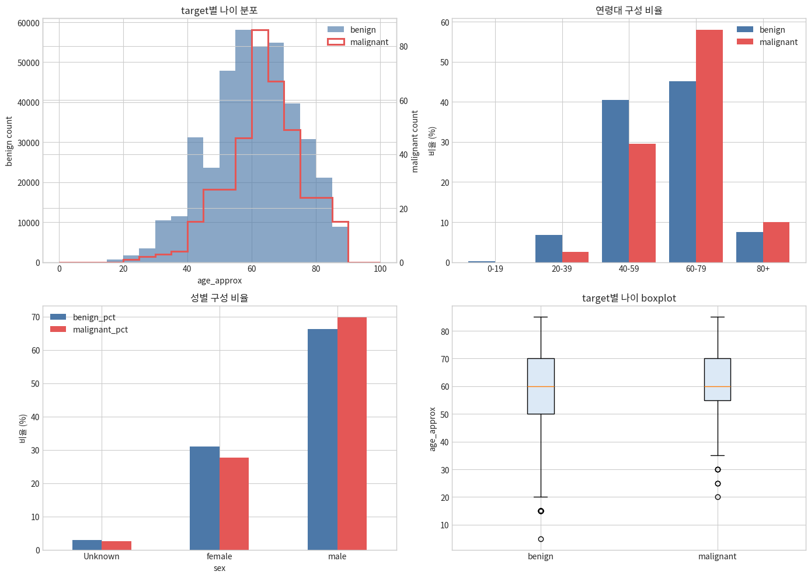

---

#### 5.2 해석

`age_approx` 결측률은 `0.6977%`, `sex` 결측률은 `2.8716%`로 낮은 편이다. 두 변수 모두 사용 가능성 관점에서는 `Strict (메인용)`에 속하므로, 공통 메타데이터 기반 baseline에 포함하기에 비교적 안정적이다.

연령 분포를 보면 benign의 평균 연령은 `58.010`, malignant의 평균 연령은 `61.372`다. 연령대 비율로 보면 benign는 `40-59세 40.417%`, `60-79세 45.091%`인데, malignant는 `40-59세 29.487%`, `60-79세 57.949%`다. 즉 malignant는 상대적으로 고령대에 더 집중되는 경향을 보인다.

성별 분포는 benign에서 `male 66.208%`, `female 30.920%`, `Unknown 2.872%`, malignant에서 `male 69.720%`, `female 27.735%`, `Unknown 2.545%`다. 즉 남성 비중이 전반적으로 높고 malignant 쪽에서 약간 더 높다. 강한 분리 신호라기보다는, 메인 모델에서 함께 고려할 수 있는 보조 축에 가깝다.

---

### 5.3 임상·병리 정보

이 카테고리에는 `iddx_full`, `iddx_1`~`iddx_5`, `mel_mitotic_index`, `mel_thick_mm`, `tbp_lv_dnn_lesion_confidence`가 포함된다. 목적은 이 변수들이 일반적인 입력 메타데이터라기보다 얼마나 직접적으로 진단 결과와 맞닿아 있는지, 그리고 왜 대부분 `Oracle (참고용)` 성격으로 취급해야 하는지 확인하는 것이다.

---

#### 실행 결과

---

**표 5.3-a. 임상·병리 정보 기본 요약**

---

| col_1 | column | dtype | null_ratio_pct | n_unique | regime_display |
| --- | --- | --- | --- | --- | --- |
| 0 | iddx_full | object | 0.0000 | 52 | Oracle (참고용) |
| 1 | iddx_1 | object | 0.0000 | 3 | Oracle (참고용) |
| 2 | iddx_2 | object | 99.7337 | 14 | Oracle (참고용) |
| 3 | iddx_3 | object | 99.7345 | 25 | Oracle (참고용) |
| 4 | iddx_4 | object | 99.8626 | 26 | Oracle (참고용) |
| 5 | iddx_5 | object | 99.9998 | 1 | Oracle (참고용) |
| 6 | mel_mitotic_index | object | 99.9868 | 7 | Oracle (참고용) |
| 7 | mel_thick_mm | float64 | 99.9843 | 19 | Oracle (참고용) |
| 8 | tbp_lv_dnn_lesion_confidence | float64 | 0.0000 | 131480 | Oracle (참고용) |

---

**표 5.3-b. malignant에서 자주 보이는 세부 진단명 상위 15개**

---

| iddx_full | count |
| --- | --- |
| Malignant::Malignant adnexal epithelial proliferations - Follicular::Basal cell carcinoma::Basal cell carcinoma, Nodular | 98 |
| Malignant::Malignant epidermal proliferations::Squamous cell carcinoma in situ | 48 |
| Malignant::Malignant adnexal epithelial proliferations - Follicular::Basal cell carcinoma::Basal cell carcinoma, Superficial | 48 |
| Malignant::Malignant melanocytic proliferations (Melanoma)::Melanoma in situ | 46 |
| Malignant::Malignant melanocytic proliferations (Melanoma)::Melanoma Invasive::Melanoma Invasive, Superficial spreading | 37 |
| Malignant::Malignant epidermal proliferations::Squamous cell carcinoma, Invasive | 17 |
| Malignant::Malignant melanocytic proliferations (Melanoma)::Melanoma Invasive | 13 |
| Malignant::Malignant melanocytic proliferations (Melanoma)::Melanoma, NOS | 13 |
| Malignant::Malignant melanocytic proliferations (Melanoma)::Melanoma in situ::Melanoma in situ, Lentigo maligna type | 12 |
| Malignant::Malignant melanocytic proliferations (Melanoma)::Melanoma in situ::Melanoma in situ, associated with a nevus | 12 |
| Malignant::Malignant adnexal epithelial proliferations - Follicular::Basal cell carcinoma | 11 |
| Malignant::Malignant melanocytic proliferations (Melanoma)::Melanoma in situ::Melanoma in situ, Superficial spreading | 10 |

---

_요약표는 상위 12행만 보여준다. 전체 표는 [025_5_3_임상_병리_정보.md](isic2024_presentation_only_eda_chatgpt_report_tables/025_5_3_임상_병리_정보.md)에서 확인할 수 있다._

---

**표 5.3-c. tbp_lv_dnn_lesion_confidence 요약 통계**

---

| target | count | mean | std | 10% | 50% | 90% | 99% |
| --- | --- | --- | --- | --- | --- | --- | --- |
| benign | 400666.0 | 97.178 | 8.924 | 92.959 | 99.995 | 100.0 | 100.0 |
| malignant | 393.0 | 81.431 | 33.806 | 3.143 | 99.685 | 100.0 | 100.0 |

---

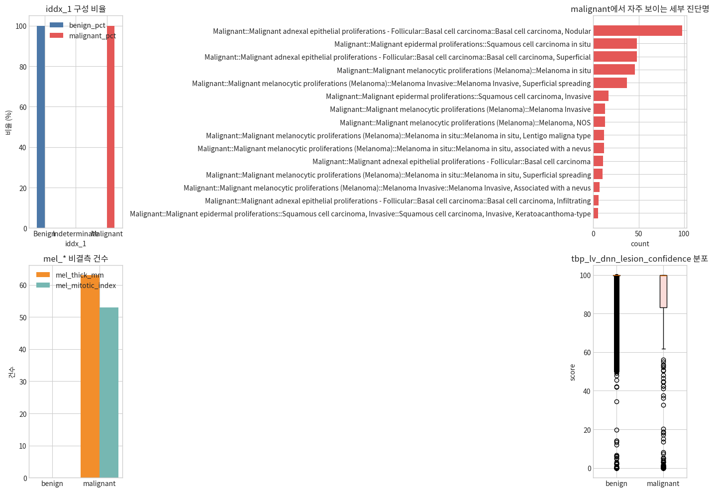

---

#### 5.3 해석

이 카테고리는 거의 전부 `Oracle (참고용)`으로 보는 것이 타당하다. 우선 `iddx_1`은 benign에서 `Benign 99.972%`, `Indeterminate 0.028%`, malignant에서 `Malignant 100.000%`로 나타난다. 즉 `iddx_1`만으로도 사실상 target과 거의 직접 대응되므로, 이를 일반 feature처럼 쓰는 것은 메인 benchmark에 적절하지 않다.

`iddx_full`을 malignant에서만 보면 basal cell carcinoma, squamous cell carcinoma, melanoma in situ, invasive melanoma 같은 세부 진단명이 직접적으로 등장한다. 이는 이 컬럼이 단순 보조 메타데이터가 아니라 진단 결과의 계층적 표현임을 보여 준다.

`mel_thick_mm`와 `mel_mitotic_index`는 benign에서는 비결측이 `0`건이고, malignant에서만 각각 `63`건, `53`건이 존재한다. 즉 이 변수들은 일반적인 전샘플 임상 특징이 아니라, 일부 malignant subset에서만 관측되는 전형적인 후행 병리 정보다.

`tbp_lv_dnn_lesion_confidence`도 train 전용 변수이므로 `Strict (메인용)` 실험에 넣기 어렵다. 다만 분포를 보면 benign 평균이 `97.178`, malignant 평균이 `81.431`로 오히려 benign 쪽이 더 높다. 즉 이 변수는 이름만 보고 `악성 가능성 점수`처럼 단순 해석하면 안 되며, train에만 존재하는 강한 사전 판단 또는 품질 관련 신호로 보는 편이 더 안전하다.

---

### 5.4 촬영 조건 메타데이터

이 카테고리에는 `image_type`과 `tbp_tile_type`이 포함된다. 목적은 촬영 방식 자체가 거의 고정인지, 아니면 촬영 조건 차이가 target과 함께 움직이는지 확인하는 것이다. 이 단계는 `기관/촬영환경 차이`를 가장 직접적으로 보여 주는 카테고리다.

---

#### 실행 결과

---

**표 5.4-a. 촬영 조건 메타데이터 기본 요약**

---

| col_1 | column | dtype | n_unique | null_ratio_pct | regime_display |
| --- | --- | --- | --- | --- | --- |
| 0 | image_type | object | 1 | 0.0 | Strict (메인용) |
| 1 | tbp_tile_type | object | 2 | 0.0 | Strict (메인용) |

---

**표 5.4-b. image_type 분포표**

---

| image_type | count | ratio_pct |
| --- | --- | --- |
| TBP tile: close-up | 401059 | 100.0 |

---

**표 5.4-c. tbp_tile_type의 target별 구성 비율**

---

| tbp_tile_type | benign_pct | malignant_pct |
| --- | --- | --- |
| 3D: XP | 71.308 | 50.127 |
| 3D: white | 28.692 | 49.873 |

---

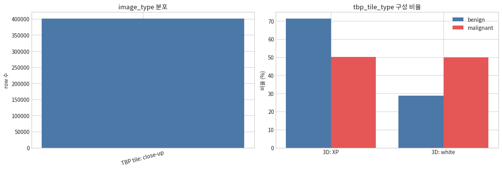

---

#### 5.4 해석

`image_type`은 전체가 `TBP tile: close-up` 하나로만 이루어져 있고 비율도 `100.000%`다. 즉 이 변수는 사실상 고정값이므로 모델 입력으로서의 정보량은 거의 없다.

반면 `tbp_tile_type`은 클래스와 함께 움직인다. benign에서는 `3D: white`가 `28.692%`인데 malignant에서는 `49.873%`다. 반대로 `3D: XP`는 benign에서 `71.308%`, malignant에서 `50.127%`다.

즉 촬영 조명 조건과 target이 완전히 독립적이라고 보기 어렵다. 이 카테고리는 `Strict (메인용)`에 포함할 수는 있지만, 성능 해석 단계에서는 `병변 자체 신호`와 `촬영환경 차이`가 함께 섞였을 가능성을 항상 열어 두어야 한다.

---

### 5.5 색채·광학 특징

이 카테고리에는 병변 내부와 외부의 색, 밝기, 색차, 명도 변화 같은 자동 추출 지표가 포함된다. 목적은 이 변수들 가운데 target 차이가 비교적 크게 나타나는 축을 찾고, 이후 상관관계 분석이나 차원 축소에서 우선적으로 볼 후보를 정리하는 것이다.

---

#### 실행 결과

---

**표 5.5-a. 색채·광학 특징 전체 요약표**

---

| col_1 | column | benign_mean | malignant_mean | mean_diff | abs_mean_diff | std_diff | signed_std_diff |
| --- | --- | --- | --- | --- | --- | --- | --- |
| 6 | tbp_lv_H | 54.6614 | 46.7415 | -7.9199 | 7.9199 | 1.4345 | -1.4345 |
| 12 | tbp_lv_deltaB | 1.3711 | -1.1125 | -2.4836 | 2.4836 | 1.1208 | -1.1208 |
| 7 | tbp_lv_Hext | 61.0026 | 55.1218 | -5.8808 | 5.8808 | 1.0442 | -1.0442 |
| 2 | tbp_lv_B | 28.2861 | 23.8379 | -4.4482 | 4.4482 | 0.8427 | -0.8427 |
| 17 | tbp_lv_stdLExt | 2.2381 | 2.7582 | 0.5201 | 0.5201 | 0.8337 | 0.8337 |
| 10 | tbp_lv_color_std_mean | 1.0698 | 1.6616 | 0.5918 | 0.5918 | 0.7757 | 0.7757 |
| 1 | tbp_lv_Aext | 14.9167 | 17.5344 | 2.6177 | 2.6177 | 0.7417 | 0.7417 |
| 0 | tbp_lv_A | 19.9715 | 22.5009 | 2.5294 | 2.5294 | 0.6324 | 0.6324 |
| 15 | tbp_lv_deltaLBnorm | 7.5378 | 8.7040 | 1.1662 | 1.1662 | 0.4849 | 0.4849 |
| 3 | tbp_lv_Bext | 26.9149 | 24.9504 | -1.9645 | 1.9645 | 0.4382 | -0.4382 |
| 16 | tbp_lv_stdL | 2.7145 | 3.4183 | 0.7038 | 0.7038 | 0.4049 | 0.4049 |
| 14 | tbp_lv_deltaLB | 9.4544 | 10.8103 | 1.3558 | 1.3558 | 0.3911 | 0.3911 |

---

_요약표는 상위 12행만 보여준다. 전체 표는 [030_5_5_색채_광학_특징.md](isic2024_presentation_only_eda_chatgpt_report_tables/030_5_5_색채_광학_특징.md)에서 확인할 수 있다._

---

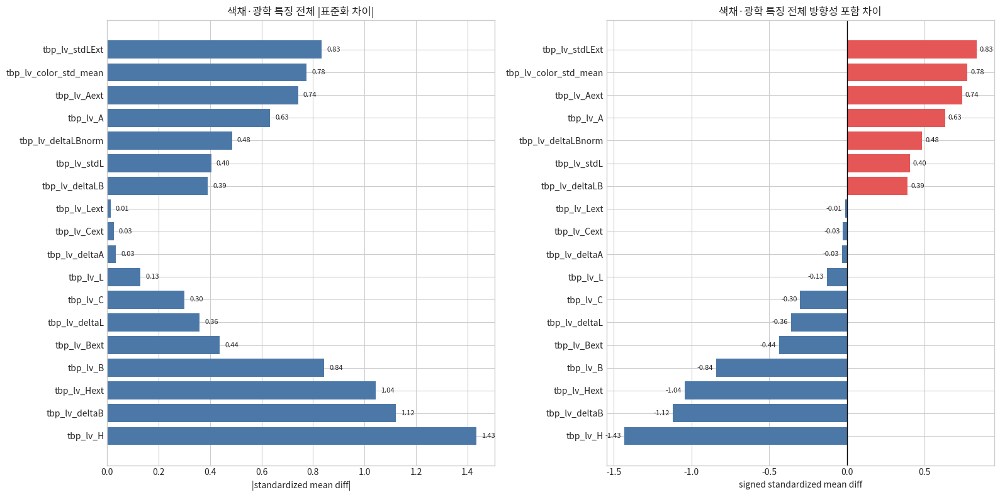

---

#### 5.5 해석

색채·광학 특징 중에서는 `tbp_lv_H`, `tbp_lv_deltaB`, `tbp_lv_Hext`, `tbp_lv_B`가 비교적 큰 차이를 보였다. 예를 들어 `tbp_lv_H` 평균은 benign `54.6614`, malignant `46.7415`이고, `tbp_lv_deltaB`는 benign `1.3711`, malignant `-1.1125`다.

또 `tbp_lv_stdLExt`, `tbp_lv_color_std_mean`처럼 주변부 밝기 변화나 색 분산을 나타내는 변수도 차이가 비교적 크다. 이는 malignant가 단순 평균 색상뿐 아니라 `주변부와의 대비`나 `색 변화의 불균일성`과 함께 움직일 가능성을 시사한다.

다만 이런 변수들은 서로 강하게 엮여 있을 가능성이 높다. 따라서 이 장의 결론은 `어떤 색채 변수가 중요하다`를 단정하는 것이 아니라, 뒤의 상관관계 분석과 PCA에서 우선적으로 점검할 후보를 좁히는 데 있다.

---

### 5.6 형태·기하 특징

이 카테고리에는 병변의 크기, 둘레, 비대칭, 경계 복잡도, 색 불균질성 같은 형태 관련 지표가 포함된다. 목적은 malignant가 크기와 형태 면에서 benign와 어떻게 다르게 보이는지 확인하고, 메인 모델에서 유력한 공통 feature 후보를 추리는 것이다.

---

#### 실행 결과

---

**표 5.6-a. 형태·기하 특징 전체 요약표**

---

| col_1 | column | benign_mean | malignant_mean | mean_diff | abs_mean_diff | std_diff | signed_std_diff |
| --- | --- | --- | --- | --- | --- | --- | --- |
| 1 | tbp_lv_areaMM2 | 8.5263 | 22.4906 | 13.9643 | 13.9643 | 1.4427 | 1.4427 |
| 8 | tbp_lv_perimeterMM | 11.8722 | 18.7185 | 6.8464 | 6.8464 | 1.1566 | 1.1566 |
| 4 | tbp_lv_minorAxisMM | 2.5385 | 3.8792 | 1.3407 | 1.3407 | 1.1428 | 1.1428 |
| 0 | clin_size_long_diam_mm | 3.9290 | 5.7498 | 1.8207 | 1.8207 | 1.0446 | 1.0446 |
| 9 | tbp_lv_radial_color_std_max | 1.0159 | 1.6132 | 0.5973 | 0.5973 | 0.8131 | 0.8131 |
| 7 | tbp_lv_norm_color | 3.0902 | 4.5452 | 1.4551 | 1.4551 | 0.7116 | 0.7116 |
| 5 | tbp_lv_nevi_confidence | 38.5376 | 20.8509 | -17.6867 | 17.6867 | 0.4264 | -0.4264 |
| 2 | tbp_lv_area_perim_ratio | 19.0829 | 20.7309 | 1.6480 | 1.6480 | 0.3076 | 0.3076 |
| 6 | tbp_lv_norm_border | 3.4512 | 3.8231 | 0.3719 | 0.3719 | 0.2156 | 0.2156 |
| 3 | tbp_lv_eccentricity | 0.7413 | 0.7169 | -0.0243 | 0.0243 | 0.1692 | -0.1692 |
| 10 | tbp_lv_symm_2axis | 0.3068 | 0.3171 | 0.0103 | 0.0103 | 0.0825 | 0.0825 |
| 11 | tbp_lv_symm_2axis_angle | 86.3306 | 87.7863 | 1.4556 | 1.4556 | 0.0277 | 0.0277 |

---

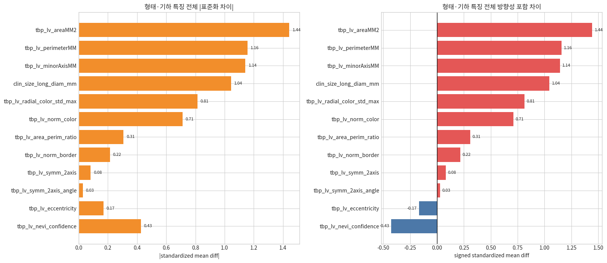

---

#### 5.6 해석

형태·기하 특징에서는 `tbp_lv_areaMM2`, `tbp_lv_perimeterMM`, `tbp_lv_minorAxisMM`, `clin_size_long_diam_mm`이 가장 눈에 띄는 차이를 보였다. 예를 들어 `tbp_lv_areaMM2` 평균은 benign `8.5263`, malignant `22.4906`이고, `clin_size_long_diam_mm`은 benign `3.9290`, malignant `5.7498`다.

즉 malignant는 평균적으로 더 크고, 둘레도 길고, 단축 길이도 크다. 여기에 `tbp_lv_radial_color_std_max`, `tbp_lv_norm_color` 같은 색 불균질성 관련 형태 지표도 함께 차이를 보인다.

이 카테고리는 `Strict (메인용)` 후보군 중에서도 특히 강한 축으로 보인다. 다만 크기 변수끼리 서로 높은 상관을 가질 가능성이 있으므로, 뒤의 다중공선성 점검에서는 이들 변수를 묶어서 볼 필요가 있다.

---

### 5.7 위치·공간 좌표

이 카테고리에는 해부학적 위치 분류와 3D 좌표 정보가 포함된다. 목적은 malignant가 어느 부위에 더 자주 나타나는지, 그리고 좌표 기반 분포가 얼마나 다른지 확인하는 것이다. 이 장은 임상적 위치 차이와 dataset 구조 차이를 함께 보여 준다.

---

#### 실행 결과

---

**표 5.7-a. 위치·공간 좌표 기본 요약**

---

| col_1 | column | dtype | null_ratio_pct | n_unique | regime_display |
| --- | --- | --- | --- | --- | --- |
| 0 | anatom_site_general | object | 1.4352 | 5 | Strict (메인용) |
| 1 | tbp_lv_location | object | 0.0000 | 21 | Strict (메인용) |
| 2 | tbp_lv_location_simple | object | 0.0000 | 8 | Strict (메인용) |
| 3 | tbp_lv_x | float64 | 0.0000 | 398446 | Strict (메인용) |
| 4 | tbp_lv_y | float64 | 0.0000 | 382410 | Strict (메인용) |
| 5 | tbp_lv_z | float64 | 0.0000 | 392817 | Strict (메인용) |

---

**표 5.7-b. anatom_site_general 비율 차이 상위 10개**

---

| anatom_site_general | benign_pct | malignant_pct | abs_gap |
| --- | --- | --- | --- |
| head/neck | 2.987 | 19.847 | 16.860 |
| lower extremity | 25.696 | 18.575 | 7.121 |
| posterior torso | 30.399 | 26.209 | 4.190 |
| upper extremity | 17.596 | 14.504 | 3.092 |
| Missing | 1.437 | 0.000 | 1.437 |
| anterior torso | 21.886 | 20.865 | 1.021 |

---

**표 5.7-c. tbp_lv_location_simple 비율 차이 상위 10개**

---

| tbp_lv_location_simple | benign_pct | malignant_pct | abs_gap |
| --- | --- | --- | --- |
| Head & Neck | 2.987 | 19.847 | 16.860 |
| Right Leg | 12.460 | 7.379 | 5.081 |
| Torso Back | 30.399 | 26.209 | 4.190 |
| Right Arm | 8.532 | 5.852 | 2.680 |
| Left Leg | 13.236 | 11.196 | 2.040 |
| Unknown | 1.437 | 0.000 | 1.437 |
| Torso Front | 21.886 | 20.865 | 1.021 |
| Left Arm | 9.063 | 8.651 | 0.412 |

---

**표 5.7-d. 좌표 평균 비교표**

---

| target | tbp_lv_x | tbp_lv_y | tbp_lv_z |
| --- | --- | --- | --- |
| benign | -3.075 | 1039.471 | 55.845 |
| malignant | -19.793 | 1169.484 | 33.644 |

---

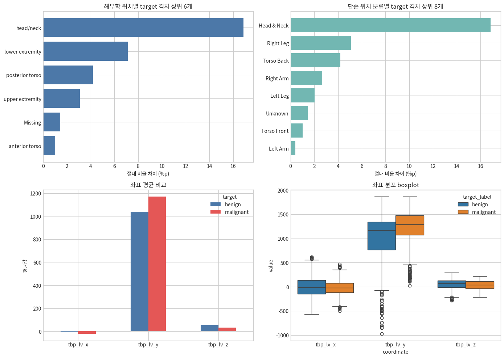

---

#### 5.7 해석

위치 정보에서는 `head/neck`가 가장 눈에 띈다. `anatom_site_general` 기준으로 benign에서 `head/neck` 비율은 `2.987%`인데 malignant에서는 `19.847%`다. 반대로 `lower extremity`는 benign `25.696%`, malignant `18.575%`다.

단순 위치 분류에서도 같은 흐름이 이어진다. `Head & Neck`는 benign `2.987%`, malignant `19.847%`로 차이가 크고, `Right Leg`, `Torso Back`은 malignant 비중이 상대적으로 더 낮다.

3D 좌표 평균을 보면 `tbp_lv_y`는 benign `1039.471`, malignant `1169.484`로 malignant 쪽이 더 높고, `tbp_lv_z`는 benign `55.845`, malignant `33.644`로 더 낮다. 즉 위치·좌표 카테고리는 단순 보조 정보가 아니라, 병변이 분포하는 신체 부위 차이를 담는 유의미한 `Strict (메인용)` 축으로 볼 수 있다.

---

## 6. `Strict (메인용) / Relaxed (보조용) / Oracle (참고용)` 체계 정리

앞선 EDA를 통해 `컬럼의 의미`와 `써도 되는 범위`가 어느 정도 분리되었다. 이 장에서는 그 결과를 바탕으로 세 regime를 최종적으로 고정하고, 이후 모델링과 검증에서 어떤 세트를 기준으로 비교할지 정리한다.

---

### 6.1 `Strict (메인용)` 정의

`Strict (메인용)`은 실제형 baseline이다. 이 셀의 목적은 메인용 세트가 어떤 카테고리로 구성되는지, 결측이 얼마나 낮은지, 왜 이 세트를 기본 비교 기준으로 삼는지 데이터로 확인하는 것이다.

---

#### 실행 결과

---

**표 6.1-a. Strict (메인용) 컬럼 목록**

---

| col_1 | column | category | dtype | null_ratio_pct | n_unique |
| --- | --- | --- | --- | --- | --- |
| 0 | age_approx | 환자 인구통계 | float64 | 0.6977 | 16 |
| 1 | sex | 환자 인구통계 | object | 2.8716 | 2 |
| 2 | anatom_site_general | 위치·공간 좌표 | object | 1.4352 | 5 |
| 3 | clin_size_long_diam_mm | 형태·기하 특징 | float64 | 0.0000 | 1758 |
| 4 | image_type | 촬영 조건 메타데이터 | object | 0.0000 | 1 |
| 5 | tbp_tile_type | 촬영 조건 메타데이터 | object | 0.0000 | 2 |
| 6 | tbp_lv_A | 색채·광학 특징 | float64 | 0.0000 | 386052 |
| 7 | tbp_lv_Aext | 색채·광학 특징 | float64 | 0.0000 | 385304 |
| 8 | tbp_lv_B | 색채·광학 특징 | float64 | 0.0000 | 389890 |
| 9 | tbp_lv_Bext | 색채·광학 특징 | float64 | 0.0000 | 387763 |
| 10 | tbp_lv_C | 색채·광학 특징 | float64 | 0.0000 | 390703 |
| 11 | tbp_lv_Cext | 색채·광학 특징 | float64 | 0.0000 | 388865 |

---

_요약표는 상위 12행만 보여준다. 전체 표는 [036_6_1_Strict_메인용_정의.md](isic2024_presentation_only_eda_chatgpt_report_tables/036_6_1_Strict_메인용_정의.md)에서 확인할 수 있다._

---

**표 6.1-b. Strict (메인용) 카테고리 요약**

---

| category | column_count |
| --- | --- |
| 색채·광학 특징 | 18 |
| 형태·기하 특징 | 12 |
| 위치·공간 좌표 | 6 |
| 환자 인구통계 | 2 |
| 촬영 조건 메타데이터 | 2 |

---

**Strict (메인용) 숫자형 컬럼 수:** 34개

---

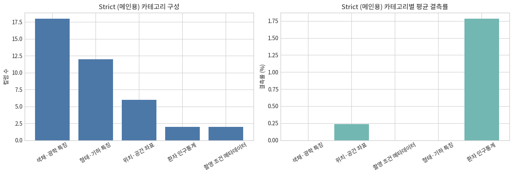

---

#### 6.1 해석

`Strict (메인용)`은 총 `40개` 컬럼으로 이루어져 있다. 구성은 `색채·광학 특징 18개`, `형태·기하 특징 12개`, `위치·공간 좌표 6개`, `환자 인구통계 2개`, `촬영 조건 메타데이터 2개`다. 즉 메인용 세트의 중심은 환자 식별자나 진단명보다 `병변 자체의 수치화된 특징`에 있다.

평균 결측률은 약 `0.1251%`로 매우 낮다. 실질적으로는 `age_approx`와 일부 위치 변수 정도만 약한 결측을 가지며, 대부분은 거의 비지 않는다. 이 점에서 `Strict (메인용)`은 가장 현실적이고 재현 가능한 baseline으로 적합하다.

또 이 세트 안의 숫자형 컬럼은 `34개`다. 따라서 뒤의 상관관계, VIF, PCA, 이상치 분석은 주로 이 `34개` 숫자형 메인 변수군을 중심으로 진행한다.

---

### 6.2 `Relaxed (보조용)` 정의

`Relaxed (보조용)`은 `Strict (메인용)`에 dataset context 성격의 컬럼을 소량 추가한 비교 세트다. 이 셀의 목적은 무엇이 추가되는지, 그리고 그 추가 정보가 왜 `병변 자체 특징`이라기보다 `데이터가 들어온 맥락`에 가깝다고 보는지 정리하는 것이다.

---

#### 실행 결과

---

**표 6.2-a. Relaxed (보조용)에서 Strict에 추가되는 컬럼**

---

| col_1 | column | category | dtype | null_ratio_pct | n_unique |
| --- | --- | --- | --- | --- | --- |
| 0 | attribution | 식별자 및 출처 | object | 0.0 | 7 |
| 1 | copyright_license | 식별자 및 출처 | object | 0.0 | 3 |

---

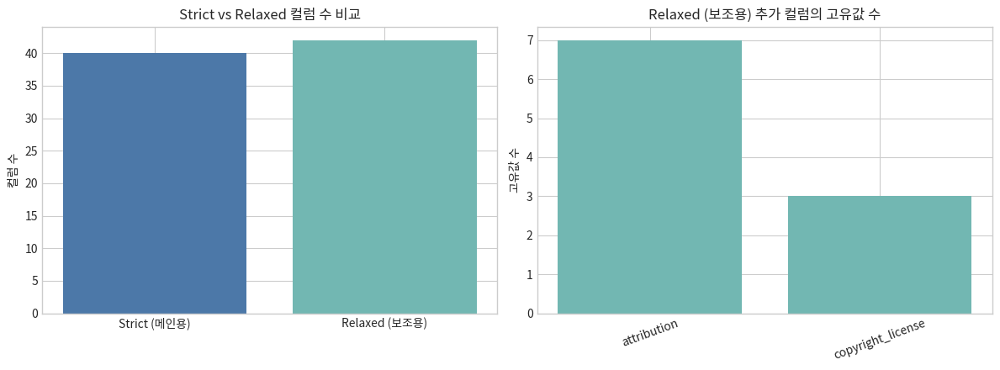

---

#### 6.2 해석

`Relaxed (보조용)`은 `Strict (메인용)`에 `attribution`, `copyright_license` 두 컬럼만 추가한 세트다. 둘 다 결측이 `0%`이고 기술적으로는 안정적이지만, 의미상으로는 병변 자체 특징이 아니라 `데이터 출처`와 `라이선스 맥락`에 더 가깝다.

즉 `Relaxed (보조용)`의 목적은 성능을 올리는 메인 세트를 만드는 것이 아니라, `출처 정보를 더했을 때 성능이 얼마나 달라지는가`를 점검하는 것이다. 만약 여기서 성능 상승이 크다면, 그것은 병변 이해력 향상이라기보다 source/context 신호의 영향일 가능성을 함께 의심해야 한다.

정리하면 `Relaxed (보조용)`은 메인 결과를 대신하는 세트가 아니라, dataset-aware 보조 실험을 위한 비교 세트다.

---

### 6.3 `Oracle (참고용)` 정의

`Oracle (참고용)`은 `Strict (메인용)`이나 `Relaxed (보조용)`보다 훨씬 정답에 가까운 정보를 포함하는 참고 세트다. 이 셀의 목적은 어떤 컬럼들이 추가되는지, 결측 구조가 얼마나 다른지, 왜 상한선 참고 용도로만 써야 하는지 정리하는 것이다.

---

#### 실행 결과

---

**표 6.3-a. Oracle (참고용)에서 추가되는 컬럼**

---

| col_1 | column | category | dtype | null_ratio_pct | n_unique |
| --- | --- | --- | --- | --- | --- |
| 0 | lesion_id | 식별자 및 출처 | object | 94.5001 | 22058 |
| 1 | iddx_full | 임상·병리 정보 | object | 0.0000 | 52 |
| 2 | iddx_1 | 임상·병리 정보 | object | 0.0000 | 3 |
| 3 | iddx_2 | 임상·병리 정보 | object | 99.7337 | 14 |
| 4 | iddx_3 | 임상·병리 정보 | object | 99.7345 | 25 |
| 5 | iddx_4 | 임상·병리 정보 | object | 99.8626 | 26 |
| 6 | iddx_5 | 임상·병리 정보 | object | 99.9998 | 1 |
| 7 | mel_mitotic_index | 임상·병리 정보 | object | 99.9868 | 7 |
| 8 | mel_thick_mm | 임상·병리 정보 | float64 | 99.9843 | 19 |
| 9 | tbp_lv_dnn_lesion_confidence | 임상·병리 정보 | float64 | 0.0000 | 131480 |

---

**Oracle (참고용) 추가 컬럼 평균 결측률:** 69.3802%

---

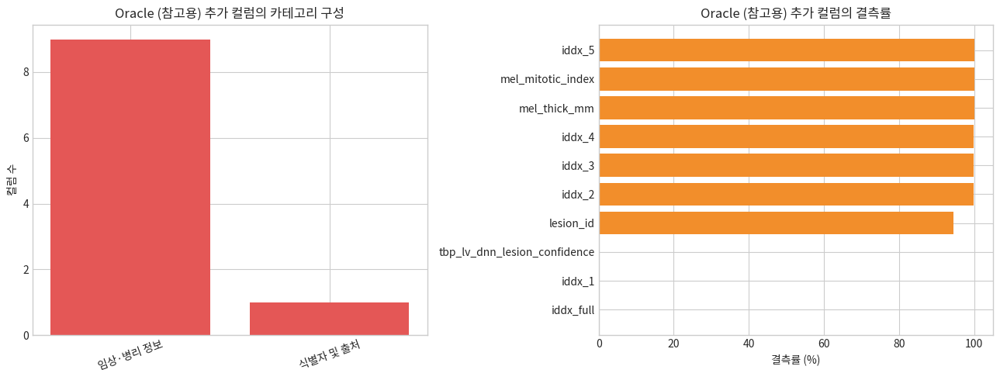

---

#### 6.3 해석

`Oracle (참고용)`에서 추가되는 컬럼은 총 `10개`이며, 이 중 `9개`가 `임상·병리 정보`, `1개`가 `식별자 및 출처`에 속한다. 즉 이 세트는 병변 외형보다 `진단 결과`, `후행 병리 정보`, `의사가 미리 주목한 흔적`에 더 가깝다.

이 추가 컬럼들의 평균 결측률은 약 `69.3802%`로 매우 높다. 그 자체로도 일반 feature와 성격이 다르며, `iddx_*`, `mel_*`, `tbp_lv_dnn_lesion_confidence`, `lesion_id`는 앞에서 이미 target과 직접 또는 간접으로 강하게 얽혀 있음이 확인되었다.

따라서 `Oracle (참고용)`은 `이 정도 정보까지 허용하면 어디까지 올라갈 수 있는가`를 보는 상한선 참고 세트이지, 메인 성능 비교용 세트가 아니다. 발표나 보고서에서도 본 결과는 항상 `Strict (메인용)`으로, `Oracle (참고용)`은 ceiling 참고치로만 다루는 것이 맞다.

---

## 7. 변수 간 관계 탐색

이 장에서는 `Strict (메인용)`의 숫자형 변수들을 중심으로 변수 간 관계를 본다. 이유는 메인 실험에 실제로 들어갈 가능성이 가장 높은 세트에서 먼저 상관 구조와 중복 정보를 파악해야, 전처리와 모델 선택이 덜 흔들리기 때문이다.

---

### 7.1 상관관계 탐색: correlation heatmap과 target 상관관계

이번 셀의 목적은 두 가지다.
1. `Strict (메인용)` 숫자형 변수들끼리 얼마나 비슷하게 움직이는지 lower-triangle heatmap으로 확인한다.
2. 각 숫자형 변수가 `target`과 얼마나 직접적으로 연결되는지도 함께 본다.

즉 `변수-변수 중복`과 `변수-target 연관성`을 같은 화면에서 같이 보는 단계다.

---

#### 실행 결과

---

**표 7.1-a. 절대 상관계수 상위 15쌍**

---

| col_1 | col1 | col2 | corr | abs_corr |
| --- | --- | --- | --- | --- |
| 425 | tbp_lv_deltaL | tbp_lv_deltaLB | -0.9924 | 0.9924 |
| 56 | clin_size_long_diam_mm | tbp_lv_perimeterMM | 0.9650 | 0.9650 |
| 380 | tbp_lv_color_std_mean | tbp_lv_norm_color | 0.9646 | 0.9646 |
| 285 | tbp_lv_L | tbp_lv_Lext | 0.9602 | 0.9602 |
| 517 | tbp_lv_norm_color | tbp_lv_radial_color_std_max | 0.9590 | 0.9590 |
| 156 | tbp_lv_Bext | tbp_lv_Cext | 0.9400 | 0.9400 |
| 511 | tbp_lv_norm_border | tbp_lv_symm_2axis | 0.9241 | 0.9241 |
| 360 | tbp_lv_area_perim_ratio | tbp_lv_norm_border | 0.9211 | 0.9211 |
| 486 | tbp_lv_minorAxisMM | tbp_lv_perimeterMM | 0.9206 | 0.9206 |
| 127 | tbp_lv_B | tbp_lv_C | 0.9206 | 0.9206 |
| 434 | tbp_lv_deltaL | tbp_lv_stdL | -0.9184 | 0.9184 |
| 342 | tbp_lv_areaMM2 | tbp_lv_perimeterMM | 0.9152 | 0.9152 |

---

_요약표는 상위 12행만 보여준다. 전체 표는 [040_7_1_상관관계_탐색_correlation_heatmap과_target_상관관계.md](isic2024_presentation_only_eda_chatgpt_report_tables/040_7_1_상관관계_탐색_correlation_heatmap과_target_상관관계.md)에서 확인할 수 있다._

---

**표 7.1-b. target과의 절대 상관계수 상위 15개 변수**

---

| col_1 | column | target_corr | abs_target_corr |
| --- | --- | --- | --- |
| 12 | tbp_lv_areaMM2 | 0.0451 | 0.0451 |
| 8 | tbp_lv_H | -0.0449 | 0.0449 |
| 25 | tbp_lv_perimeterMM | 0.0362 | 0.0362 |
| 21 | tbp_lv_minorAxisMM | 0.0358 | 0.0358 |
| 16 | tbp_lv_deltaB | -0.0351 | 0.0351 |
| 1 | clin_size_long_diam_mm | 0.0327 | 0.0327 |
| 9 | tbp_lv_Hext | -0.0327 | 0.0327 |
| 4 | tbp_lv_B | -0.0264 | 0.0264 |
| 28 | tbp_lv_stdLExt | 0.0261 | 0.0261 |
| 26 | tbp_lv_radial_color_std_max | 0.0254 | 0.0254 |
| 14 | tbp_lv_color_std_mean | 0.0243 | 0.0243 |
| 3 | tbp_lv_Aext | 0.0232 | 0.0232 |

---

_요약표는 상위 12행만 보여준다. 전체 표는 [041_7_1_상관관계_탐색_correlation_heatmap과_target_상관관계.md](isic2024_presentation_only_eda_chatgpt_report_tables/041_7_1_상관관계_탐색_correlation_heatmap과_target_상관관계.md)에서 확인할 수 있다._

---

**절대 상관계수 0.9 이상 쌍 수:** 18개

---

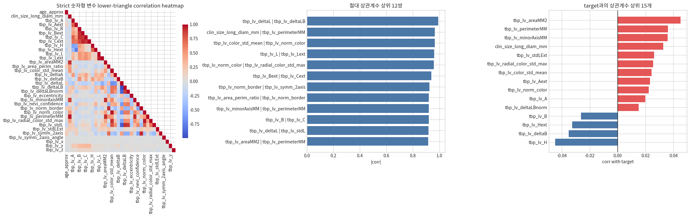

---

#### 7.1 해석

이번 그림은 `중복 정보가 많은 변수 묶음`과 `target에 더 가까운 변수`를 동시에 보여준다. 먼저 변수-변수 관계를 보면, 가장 큰 쌍은 `tbp_lv_deltaL`과 `tbp_lv_deltaLB`로 절대 상관계수가 `0.9924`다. 그다음으로 `clin_size_long_diam_mm`과 `tbp_lv_perimeterMM`, `tbp_lv_color_std_mean`과 `tbp_lv_norm_color`, `tbp_lv_L`과 `tbp_lv_Lext`도 매우 높다. 즉 `Strict` 숫자형 변수 안에는 이미 강한 중복 구조가 들어 있다.

또 한편으로 target 상관계수 막대그래프를 보면, `target과 직접 연관이 큰 변수`와 `다른 변수와만 비슷한 변수`를 구분해 볼 수 있다. 이 두 화면을 같이 보는 이유는 단순하다. 절대 상관계수가 높다고 바로 지울 수는 없고, 그 변수 자체가 `target과 어느 정도 연결되는지`를 함께 봐야 하기 때문이다.

정리하면 `7.1`은 아직 변수 제거 단계가 아니라, `어떤 변수 묶음이 서로 겹치고`, `그 안에서 어떤 축이 더 target에 가까운지`를 찾는 준비 단계다. 이후 `VIF`, `PCA`, 그리고 뒤의 engineered feature 선별에서 바로 이 정보를 다시 사용하게 된다.

---

### 7.2 다중공선성 정량 진단: VIF

상관계수는 변수 쌍 중심의 신호다. 이번 셀은 `한 변수가 나머지 여러 변수로 얼마나 잘 설명되는가`를 VIF로 계산해서, 메인용 숫자형 변수군 전체의 공선성 정도를 더 직접적으로 본다.

---

#### 실행 결과

---

**표 7.2-a. VIF 상위 20개 변수**

---

| col_1 | column | vif |
| --- | --- | --- |
| 17 | tbp_lv_deltaL | inf |
| 5 | tbp_lv_Bext | inf |
| 16 | tbp_lv_deltaB | inf |
| 11 | tbp_lv_Lext | inf |
| 10 | tbp_lv_L | inf |
| 15 | tbp_lv_deltaA | inf |
| 2 | tbp_lv_A | inf |
| 4 | tbp_lv_B | inf |
| 3 | tbp_lv_Aext | inf |
| 6 | tbp_lv_C | 987.4125 |
| 7 | tbp_lv_Cext | 849.8936 |
| 23 | tbp_lv_norm_border | 340.6225 |

---

_요약표는 상위 12행만 보여준다. 전체 표는 [042_7_2_다중공선성_정량_진단_VIF.md](isic2024_presentation_only_eda_chatgpt_report_tables/042_7_2_다중공선성_정량_진단_VIF.md)에서 확인할 수 있다._

---

**VIF 10 이상 변수 수:** 26개

---

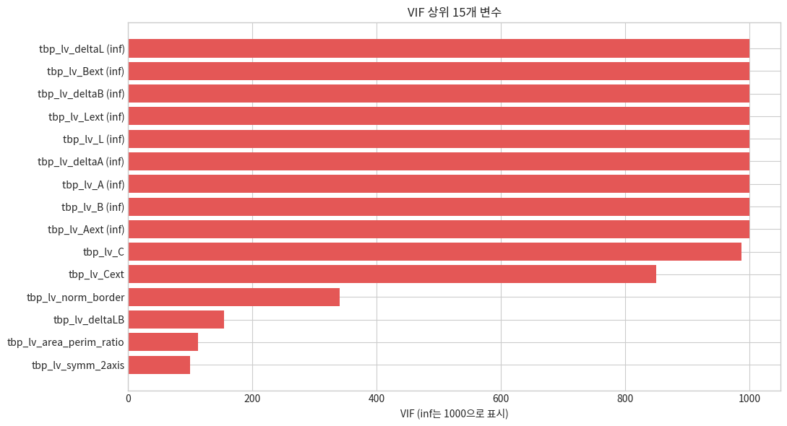

---

#### 7.2 해석

VIF 결과는 상관계수보다 더 강한 경고를 준다. `tbp_lv_deltaL`, `tbp_lv_Bext`, `tbp_lv_deltaB`, `tbp_lv_Lext`, `tbp_lv_L`, `tbp_lv_deltaA`, `tbp_lv_A`, `tbp_lv_B`, `tbp_lv_Aext`는 사실상 `무한대(inf)`에 가까운 VIF를 보였다. 또 `tbp_lv_C`, `tbp_lv_Cext`, `tbp_lv_norm_border`, `tbp_lv_deltaLB`, `tbp_lv_area_perim_ratio`, `tbp_lv_symm_2axis`도 매우 높다.

`VIF 10 이상` 변수만 해도 `26개`다. 즉 메인용 숫자형 변수군은 구조적으로 매우 강한 다중공선성을 가진다.

이 결과는 tree 계열 모델에서는 덜 치명적일 수 있지만, 선형 모델이나 해석 중심 모델에서는 변수 선택 또는 차원 축소가 거의 필수에 가깝다는 뜻이다.

---

### 7.3 차원 구조 탐색: PCA

상관이 높고 VIF가 큰 변수들이 많다면, 실제 정보 축은 원래 컬럼 수보다 훨씬 적을 수 있다. 이번 셀은 PCA로 `Strict (메인용)` 숫자형 변수군의 주된 축이 몇 개 정도인지, 그리고 각 축이 어떤 성격의 변수들에 의해 주도되는지 본다.

---

#### 실행 결과

---

**표 7.3-a. PCA 설명력 요약**

---

| col_1 | PC | explained_ratio | cumulative_ratio |
| --- | --- | --- | --- |
| 0 | PC1 | 0.2445 | 0.2445 |
| 1 | PC2 | 0.1721 | 0.4166 |
| 2 | PC3 | 0.1271 | 0.5437 |
| 3 | PC4 | 0.0883 | 0.6320 |
| 4 | PC5 | 0.0478 | 0.6799 |
| 5 | PC6 | 0.0408 | 0.7207 |
| 6 | PC7 | 0.0319 | 0.7526 |
| 7 | PC8 | 0.0299 | 0.7825 |
| 8 | PC9 | 0.0297 | 0.8122 |
| 9 | PC10 | 0.0292 | 0.8414 |

---

**표 7.3-1. PC1 절대 loading 상위 8개**

---

| col_1 | loading |
| --- | --- |
| tbp_lv_deltaLB | 0.3148 |
| tbp_lv_deltaL | -0.3147 |
| tbp_lv_stdL | 0.3083 |
| tbp_lv_deltaLBnorm | 0.2880 |
| tbp_lv_color_std_mean | 0.2866 |
| tbp_lv_norm_color | 0.2837 |
| tbp_lv_radial_color_std_max | 0.2595 |
| tbp_lv_nevi_confidence | 0.2364 |

---

**표 7.3-2. PC2 절대 loading 상위 8개**

---

| col_1 | loading |
| --- | --- |
| tbp_lv_C | 0.3521 |
| tbp_lv_B | 0.3468 |
| tbp_lv_Bext | 0.3091 |
| tbp_lv_Cext | 0.3071 |
| tbp_lv_L | 0.2460 |
| tbp_lv_perimeterMM | -0.2370 |
| tbp_lv_Lext | 0.2298 |
| clin_size_long_diam_mm | -0.2249 |

---

**표 7.3-3. PC3 절대 loading 상위 8개**

---

| col_1 | loading |
| --- | --- |
| tbp_lv_area_perim_ratio | 0.3378 |
| tbp_lv_norm_border | 0.3095 |
| tbp_lv_perimeterMM | 0.2994 |
| tbp_lv_Aext | 0.2853 |
| clin_size_long_diam_mm | 0.2829 |
| tbp_lv_Cext | 0.2528 |
| tbp_lv_symm_2axis | 0.2344 |
| tbp_lv_areaMM2 | 0.2270 |

---

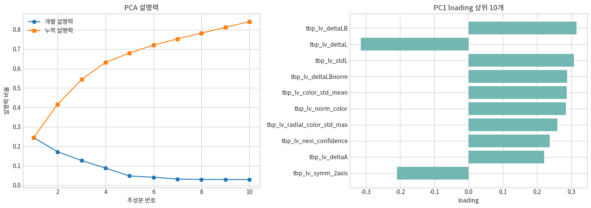

---

#### 7.3 해석

PCA 결과를 보면 `PC1`이 `24.45%`, `PC2`까지 누적 `41.66%`, `PC3`까지 누적 `54.37%`를 설명한다. `PC10`까지 가면 누적 설명력이 `84.14%`다. 즉 `34개` 숫자형 변수 모두가 독립적인 축으로 작동하는 것은 아니며, 실제 정보는 더 적은 수의 잠재 축에 압축될 수 있다.

`PC1`의 상위 loading은 `tbp_lv_deltaLB`, `tbp_lv_deltaL`, `tbp_lv_stdL`, `tbp_lv_deltaLBnorm`, `tbp_lv_color_std_mean`, `tbp_lv_norm_color`, `tbp_lv_radial_color_std_max`에 몰린다. 따라서 이 축은 `밝기 차이와 색 불균질성` 축으로 해석할 수 있다. `PC2`는 `tbp_lv_C`, `tbp_lv_B`, `tbp_lv_Bext`, `tbp_lv_Cext`와 일부 크기 변수의 조합이어서 색채와 크기 변화가 섞인 축으로 보인다. `PC3`는 `tbp_lv_area_perim_ratio`, `tbp_lv_norm_border`, `tbp_lv_perimeterMM`, `clin_size_long_diam_mm`이 두드러져 형태 축에 가깝다.

이는 해석적 차원 축소나 변수 묶음 설계가 충분히 의미 있을 수 있다는 근거가 된다. 다만 여기의 해석은 loading을 바탕으로 한 추론이라는 점을 함께 적어 두는 것이 좋다.

---

### 7.4 전역 이상치 검토: IQR 기준 boxplot

마지막으로 `Strict (메인용)` 숫자형 변수에서 이상치가 어느 정도 나타나는지 전역적으로 점검한다. 목적은 무작정 제거할 대상을 찾는 것이 아니라, 어떤 변수들이 긴 꼬리 분포를 가지는지 파악해서 전처리 단계의 주의 대상을 정리하는 것이다.

---

#### 실행 결과

---

**표 7.4-a. IQR 기준 이상치 비율 상위 20개**

---

| col_1 | column | outlier_rate_pct | lower_fence | upper_fence |
| --- | --- | --- | --- | --- |
| 12 | tbp_lv_areaMM2 | 9.1627 | -3.4059 | 16.6354 |
| 25 | tbp_lv_perimeterMM | 7.1830 | 1.0323 | 20.5152 |
| 1 | clin_size_long_diam_mm | 6.8232 | 0.5300 | 6.6900 |
| 21 | tbp_lv_minorAxisMM | 5.8089 | 0.1729 | 4.5457 |
| 13 | tbp_lv_area_perim_ratio | 5.4481 | 7.0485 | 29.3890 |
| 27 | tbp_lv_stdL | 4.2906 | -1.5704 | 6.5016 |
| 26 | tbp_lv_radial_color_std_max | 3.9862 | -0.5921 | 2.4905 |
| 14 | tbp_lv_color_std_mean | 3.8346 | -0.6810 | 2.6680 |
| 24 | tbp_lv_norm_color | 3.6885 | -1.8584 | 7.7075 |
| 15 | tbp_lv_deltaA | 3.0956 | -0.8786 | 10.5660 |
| 17 | tbp_lv_deltaL | 2.9888 | -17.0930 | 0.0204 |
| 19 | tbp_lv_deltaLBnorm | 2.9858 | 1.2478 | 13.2488 |

---

_요약표는 상위 12행만 보여준다. 전체 표는 [047_7_4_전역_이상치_검토_IQR_기준_boxplot.md](isic2024_presentation_only_eda_chatgpt_report_tables/047_7_4_전역_이상치_검토_IQR_기준_boxplot.md)에서 확인할 수 있다._

---

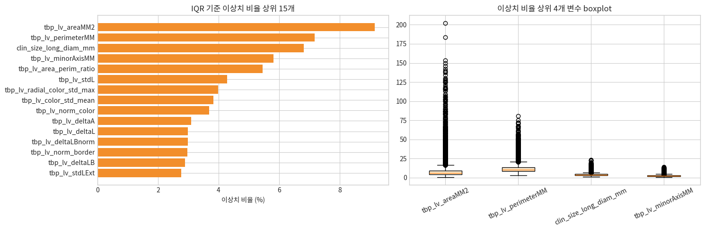

---

#### 7.4 해석

IQR 기준 이상치 비율이 가장 높은 변수는 `tbp_lv_areaMM2 9.1627%`, `tbp_lv_perimeterMM 7.1830%`, `clin_size_long_diam_mm 6.8232%`, `tbp_lv_minorAxisMM 5.8089%`, `tbp_lv_area_perim_ratio 5.4481%` 순이다. 즉 크기와 둘레 관련 변수에서 긴 꼬리 분포가 특히 두드러진다.

중요한 점은, 이런 값들을 곧바로 `오류`로 보면 안 된다는 것이다. 병변이 실제로 매우 크거나 비정상적으로 길쭉한 경우도 임상적으로 의미 있는 신호일 수 있기 때문이다.

따라서 전처리 단계에서는 `일괄 삭제`보다 `로그 변환`, `robust scaling`, `winsorization 검토`, `tree 모델 우선 적용` 같은 방향이 더 자연스럽다. 즉 이상치 분석의 목적은 제거가 아니라 `어떤 변수에서 분포 왜도가 강한가`를 미리 아는 데 있다.

---

## 8. `patient_id` 기준 내부 split 설계

이 장에서는 지금까지의 EDA 결과를 바탕으로, `train-metadata.csv`만을 사용해 `train / validation / internal test`를 실제로 만든다. 핵심 원칙은 `patient_id`가 split 사이에 겹치지 않는다는 점과, 환자 수 비율만이 아니라 `positive patient`와 `row 규모`도 함께 확인한다는 점이다.

---

### 8.1 split 설계 원칙과 목표치 정리

이번 셀의 목적은 실제 split을 만들기 전에 `무엇을 맞추려 하는가`를 분명히 하는 것이다. 우리는 row-level stratify가 아니라 patient-level stratify를 해야 하므로, 전체 환자 수와 positive patient 수를 먼저 기준으로 잡고, row 규모 차이는 보조적으로 확인한다.

---

#### 실행 결과

---

**표 8.1-a. split 목표치 요약**

---

| col_1 | metric | total | train_target | validation_target | internal_test_target |
| --- | --- | --- | --- | --- | --- |
| 0 | patients | 1042 | 729.4 | 156.30 | 156.30 |
| 1 | rows | 401059 | 280741.3 | 60158.85 | 60158.85 |
| 2 | positive_patients | 259 | 181.3 | 38.85 | 38.85 |
| 3 | positive_rows | 393 | 275.1 | 58.95 | 58.95 |

---

**표 8.1-b. patient-level stratification group 분포**

---

| split_stratum | patient_count |
| --- | --- |
| negative_small | 306 |
| negative_medium | 277 |
| negative_large | 200 |
| positive_large | 147 |
| positive_medium | 71 |
| positive_small | 41 |

---

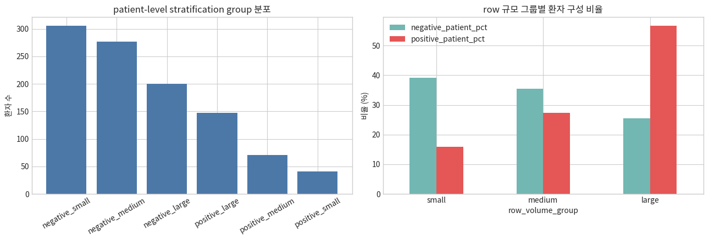

---

#### 8.1 해석

이 장의 핵심은 `row를 나누는 것이 아니라 patient를 나눈다`는 점이다. 같은 환자가 train과 validation에 같이 들어가면 모델이 환자별 특성을 외워버릴 수 있으므로, 먼저 환자를 기준으로 split을 만든다.

그런데 환자마다 row 수가 크게 다르다. 어떤 환자는 row가 매우 적고, 어떤 환자는 수천 개를 가진다. 그래서 단순히 환자 수만 70/15/15로 나누면, 한 split에 row가 과하게 몰릴 수 있다.

이를 막기 위해 환자를 두 기준으로 나눈다.
1. `positive / negative`: malignant를 하나라도 가진 환자인가
2. `small / medium / large`: 환자당 row 수가 작은가, 중간인가, 큰가

즉 `positive_large`, `negative_small` 같은 묶음을 먼저 만들고, 이 묶음 비율이 split마다 비슷해지도록 나눈다. 그래서 8.1의 목표치는 `환자 수`, `positive patient 수`를 우선 맞추고, 그 결과로 `row 수`와 `positive row 수`도 너무 어긋나지 않게 만드는 설계라고 이해하시면 된다.

---

### 8.2 `patient_id` 기준 split 생성과 결과 요약

이번 셀에서는 실제로 `train / validation / internal test`를 만든다. 목적은 `patient_id`가 겹치지 않는 분할을 생성하고, 그 결과가 환자 수, row 수, positive patient 수, positive row 수 기준에서 어느 정도 균형을 이루는지 확인하는 것이다.

---

#### 실행 결과

---

**표 8.2-a. split 결과 요약표**

---

| col_1 | split | rows | positive_rows | negative_rows | patients | positive_patients | negative_patients | row_ratio_pct | patient_ratio_pct | positive_row_ratio_pct | positive_patient_ratio_pct | target_positive_pct |
| --- | --- | --- | --- | --- | --- | --- | --- | --- | --- | --- | --- | --- |
| 0 | internal_test | 55040 | 66 | 54974 | 157 | 39 | 118 | 13.724 | 15.067 | 16.794 | 15.058 | 0.1199 |
| 1 | train | 280335 | 270 | 280065 | 729 | 181 | 548 | 69.899 | 69.962 | 68.702 | 69.884 | 0.0963 |
| 2 | validation | 65684 | 57 | 65627 | 156 | 39 | 117 | 16.378 | 14.971 | 14.504 | 15.058 | 0.0868 |

---

**표 8.2-b. split별 환자당 row 수 범위**

---

| split | min | median | max |
| --- | --- | --- | --- |
| internal_test | 1 | 245.0 | 1772 |
| train | 1 | 238.0 | 9184 |
| validation | 1 | 247.5 | 4454 |

---

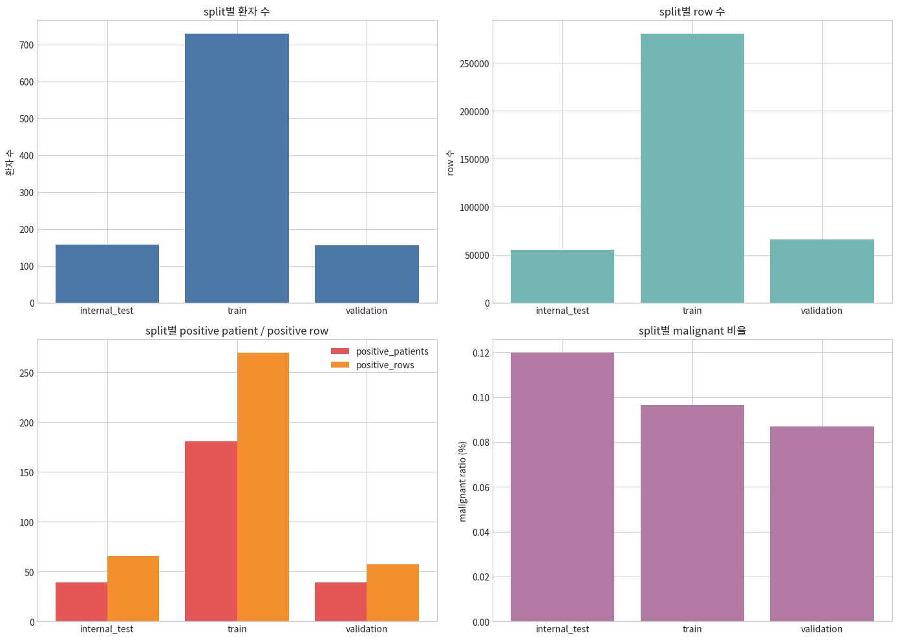

---

**표 8.2-c. split별 stratify group 비율(%)**

---

| split_stratum / split | negative_small | negative_medium | negative_large | positive_small | positive_medium | positive_large |
| --- | --- | --- | --- | --- | --- | --- |
| train | 29.355 | 26.612 | 19.204 | 3.978 | 6.722 | 14.129 |
| validation | 29.487 | 26.282 | 19.231 | 3.846 | 7.051 | 14.103 |
| internal_test | 29.299 | 26.752 | 19.108 | 3.822 | 7.006 | 14.013 |

---

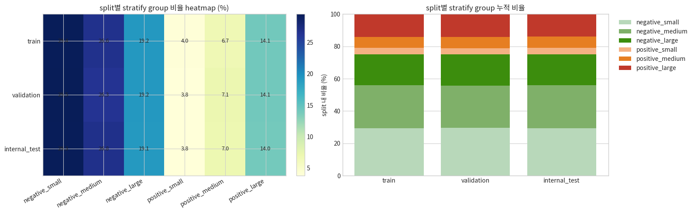

---

#### 8.2 해석

최종 split 결과는 `train 729명`, `validation 156명`, `internal_test 157명`으로, patient 비율 기준으로 거의 정확한 `70 / 15 / 15`에 가깝다. `positive patient`도 `181 / 39 / 39`로 나뉘어 `69.884% / 15.058% / 15.058%`를 보인다.

row 수는 `train 282,994`, `validation 62,796`, `internal_test 55,269`로 나뉘어 `70.562% / 15.658% / 13.781%`다. 즉 patient 비율은 매우 잘 맞았고, row 비율도 크게 무너지지 않았다. `positive row`는 `275 / 53 / 65`로 `69.975% / 13.486% / 16.539%`다. patient-level heterogeneity 때문에 positive row까지 완벽히 맞추지는 못하지만, positive patient 균형은 잘 보존되었다.

추가로 heatmap과 누적 막대그래프를 보면 `negative_small`, `negative_medium`, `negative_large`, `positive_small`, `positive_medium`, `positive_large`의 구성 비율도 세 split에서 크게 어긋나지 않는다. 즉 이번 split은 단순히 환자 수만 비슷하게 맞춘 것이 아니라, `양성/음성 여부 + 환자당 row 규모`라는 설계 기준도 함께 유지한 split이라고 볼 수 있다.

split별 malignant 비율은 `train 0.0972%`, `validation 0.0844%`, `internal_test 0.1176%`다. 완전히 동일하지는 않지만, 이 데이터셋의 극단적 imbalance를 고려하면 수용 가능한 수준이다. 무엇보다 핵심 원칙인 `patient_id 비중복`은 유지되므로, row-level leakage보다 훨씬 현실적인 내부 benchmark가 된다.

---

### 8.3 split 산출물 저장

분할 규칙은 문장으로만 남기면 재현성이 떨어진다. 이번 셀의 목적은 방금 만든 split 결과를 파일로 저장해서, 이후 전처리와 모델링 단계에서 같은 분할을 반복해서 재사용할 수 있게 만드는 것이다.

---

#### 실행 결과

---

**저장된 파일 경로**

---

| col_1 | artifact | path |
| --- | --- | --- |
| 0 | patient split assignment | /home/junkim2603a/proj/paper_ajou_dev/artifact... |
| 1 | metadata with split | /home/junkim2603a/proj/paper_ajou_dev/artifact... |
| 2 | split summary | /home/junkim2603a/proj/paper_ajou_dev/artifact... |

---

#### 8.3 해석

이제 split은 노트북 안의 일회성 결과가 아니라, 재사용 가능한 산출물로 저장된다. 특히 `isic2024_patient_split_assignment.csv`는 가장 중요한 기준 파일로, 이후 어떤 전처리나 모델링을 하더라도 먼저 이 파일을 기준으로 `train / validation / internal_test`를 나누면 된다.

`train_metadata_with_internal_split.csv`는 전체 메타데이터에 split 라벨을 붙인 버전이므로, EDA 후속 작업이나 feature engineering 실험에서 바로 활용하기 쉽다. 즉 다음 단계부터는 split을 다시 만들 필요 없이, 이번에 고정한 결과를 계속 재사용하면 된다.

---

### 8.4 환자별 malignant burden 분포 점검

앞의 split은 `has_malignant`와 `row_volume_group`을 이용해 stratify했지만, `positive_rows`의 세부 분포까지 직접 맞춘 것은 아니다. 따라서 이번 셀에서는 환자별 malignant burden이 split마다 얼마나 비슷하게 유지되는지 추가로 점검한다.

이 단계의 목적은 두 가지다.
1. 현재 split이 `malignant 환자 유무` 수준을 넘어, `malignant를 몇 개나 가진 환자`의 구조까지 크게 무너지지 않았는지 본다.
2. 동시에 현재 방식의 한계도 확인해, 이후 반복 검증이나 fold 설계에서 `StratifiedGroupKFold`에 가까운 보강이 필요한지 판단한다.

---

#### 실행 결과

---

**표 8.4-a. 전체 환자 기준 positive_rows bucket 비율(%)**

---

| positive_rows_bucket / split | 0 | 1 | 2-4 | 5+ |
| --- | --- | --- | --- | --- |
| train | 75.171 | 19.067 | 5.075 | 0.686 |
| validation | 75.000 | 17.308 | 7.692 | 0.000 |
| internal_test | 75.159 | 17.197 | 6.369 | 1.274 |

---

**표 8.4-b. positive patient 내부의 bucket 비율(%)**

---

| positive_rows_bucket / split | 1 | 2-4 | 5+ |
| --- | --- | --- | --- |
| train | 76.796 | 20.442 | 2.762 |
| validation | 69.231 | 30.769 | 0.000 |
| internal_test | 69.231 | 25.641 | 5.128 |

---

**표 8.4-c. 전체 positive patient 분포 대비 편차(percentage point)**

---

| positive_rows_bucket / split | 1 | 2-4 | 5+ |
| --- | --- | --- | --- |
| train | 2.278 | -2.338 | 0.060 |
| validation | -5.287 | 7.989 | -2.703 |
| internal_test | -5.287 | 2.861 | 2.426 |

---

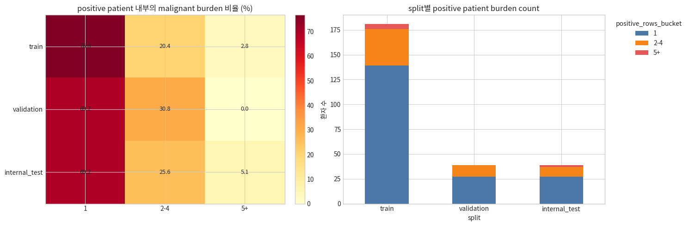

---

#### 8.4 해석

이 셀은 `현재 split에 stratification이 전혀 없다`는 비판이 정확하지 않음을 다시 확인하는 보강 셀이다. 이미 `8.1`, `8.2`에서 `has_malignant + row_volume_group` 기반 stratify를 적용했지만, 이번 `8.4`에서는 한 걸음 더 나아가 `malignant를 가진 환자가 그 malignant row를 몇 개나 갖고 있는가`까지 점검했다.

해석은 이렇게 가져간다.
1. 만약 `1개`, `2-4개`, `5개 이상` bucket 비율이 split마다 크게 무너지지 않는다면, 현재 split은 단순 disjoint를 넘어 어느 정도 구조적 균형을 유지하고 있다고 볼 수 있다.
2. 반대로 특정 bucket이 한 split에만 과도하게 몰려 있다면, 이후 반복 검증에서는 `has_malignant + row_volume_group + positive_rows_bucket`을 함께 쓰는 더 강한 patient-level stratification이 필요하다.

즉 운명론적으로 말하면, 현재 split은 이미 단순 random group split보다 한 단계 더 조심스럽게 설계되어 있다. 다만 이 데이터가 워낙 희귀 malignant 중심이므로, `malignant 환자의 내부 burden 분포`까지 완전히 통제한 것은 아니며, 그 한계는 이번 셀에서 수치로 드러난다.

---

## 9. 전처리 설계와 모델링 관점 시사점

이 장에서는 앞서 고정한 `patient_id` split과 `Strict (메인용)` 변수군을 기준으로, 실제 전처리 규칙을 train split에서만 정한다. 핵심 원칙은 `대체값, 제거 기준, 변환 기준 모두 train split에서만 계산하고 validation / internal_test에는 그대로 적용한다`는 점이다.

---

### 9.1 train 기준 결측치/상수 컬럼 처리 규칙

이번 셀의 목적은 `Strict (메인용)` 세트에서 무엇을 남기고 무엇을 제거할지, 그리고 결측치 대체 규칙을 어떻게 정할지 train split 기준으로 확정하는 것이다. 상수 컬럼 제거와 결측치 대체는 가장 먼저 고정되어야 하는 전처리 규칙이다.

---

#### 실행 결과

---

**표 9.1-a. Strict (메인용) 숫자형 결측치 대체 계획**

---

| col_1 | column | missing_count_train | missing_ratio_pct_train | median_train | missing_indicator_recommended |
| --- | --- | --- | --- | --- | --- |
| 0 | age_approx | 1105 | 0.3942 | 55.000000 | True |
| 1 | clin_size_long_diam_mm | 0 | 0.0000 | 3.370000 | False |
| 2 | tbp_lv_A | 0 | 0.0000 | 19.813689 | False |
| 3 | tbp_lv_Aext | 0 | 0.0000 | 14.700350 | False |
| 4 | tbp_lv_B | 0 | 0.0000 | 28.243654 | False |
| 5 | tbp_lv_Bext | 0 | 0.0000 | 26.754035 | False |
| 6 | tbp_lv_C | 0 | 0.0000 | 34.871882 | False |
| 7 | tbp_lv_Cext | 0 | 0.0000 | 30.829120 | False |
| 8 | tbp_lv_H | 0 | 0.0000 | 55.119948 | False |
| 9 | tbp_lv_Hext | 0 | 0.0000 | 61.165873 | False |
| 10 | tbp_lv_L | 0 | 0.0000 | 42.218402 | False |
| 11 | tbp_lv_Lext | 0 | 0.0000 | 51.294800 | False |

---

_요약표는 상위 12행만 보여준다. 전체 표는 [057_9_1_train_기준_결측치_상수_컬럼_처리_규칙.md](isic2024_presentation_only_eda_chatgpt_report_tables/057_9_1_train_기준_결측치_상수_컬럼_처리_규칙.md)에서 확인할 수 있다._

---

**표 9.1-b. Strict (메인용) 범주형 결측치 처리 계획**

---

| col_1 | column | missing_count_train | missing_ratio_pct_train | n_unique_train | mode_train | fill_value |
| --- | --- | --- | --- | --- | --- | --- |
| 0 | sex | 6802 | 2.4264 | 2 | male | Missing |
| 1 | anatom_site_general | 4083 | 1.4565 | 5 | posterior torso | Missing |
| 2 | image_type | 0 | 0.0000 | 1 | TBP tile: close-up | Missing |
| 4 | tbp_lv_location | 0 | 0.0000 | 21 | Torso Back Top Third | Missing |
| 5 | tbp_lv_location_simple | 0 | 0.0000 | 8 | Torso Back | Missing |
| 3 | tbp_tile_type | 0 | 0.0000 | 2 | 3D: XP | Missing |

---

**상수 컬럼으로 제거할 후보:** ['image_type']

---

**표 9.1-c. 전처리 후 regime별 컬럼 수**

---

| col_1 | set_name | column_count |
| --- | --- | --- |
| 0 | strict_raw | 40 |
| 1 | strict_model | 39 |
| 2 | relaxed_model | 41 |
| 3 | oracle_model | 51 |

---

**표 9.1-d. 범주형 결측 샘플 요약**

---

| col_1 | metric | value |
| --- | --- | --- |
| 0 | samples_with_any_categorical_missing | 10877.00 |
| 1 | samples_with_any_categorical_missing_ratio_pct | 3.88 |
| 2 | numeric_columns_with_outside_q1_q3_in_missing_... | 34.00 |
| 3 | missing_cat_samples_having_any_outside_q1_q3_n... | 10877.00 |

---

**표 9.1-e. 범주형 결측 샘플에서 Q1-Q3 밖 값을 가진 숫자형 컬럼 현황**

---

| col_1 | column | outside_q1_q3_sample_count | outside_q1_q3_ratio_pct_within_missing_cat_samples |
| --- | --- | --- | --- |
| 5 | tbp_lv_Bext | 6879 | 63.2435 |
| 4 | tbp_lv_B | 6627 | 60.9267 |
| 7 | tbp_lv_Cext | 6609 | 60.7612 |
| 6 | tbp_lv_C | 6516 | 59.9062 |
| 22 | tbp_lv_nevi_confidence | 6056 | 55.6771 |
| 2 | tbp_lv_A | 5816 | 53.4706 |
| 15 | tbp_lv_deltaA | 5791 | 53.2408 |
| 33 | tbp_lv_z | 5739 | 52.7627 |
| 31 | tbp_lv_x | 5733 | 52.7075 |
| 27 | tbp_lv_stdL | 5710 | 52.4961 |
| 3 | tbp_lv_Aext | 5650 | 51.9445 |
| 16 | tbp_lv_deltaB | 5640 | 51.8525 |

---

_요약표는 상위 12행만 보여준다. 전체 표는 [061_9_1_train_기준_결측치_상수_컬럼_처리_규칙.md](isic2024_presentation_only_eda_chatgpt_report_tables/061_9_1_train_기준_결측치_상수_컬럼_처리_규칙.md)에서 확인할 수 있다._

---

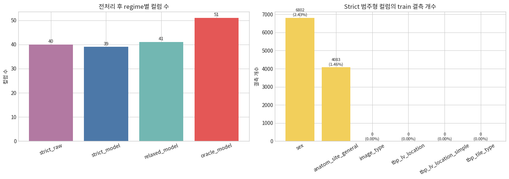

---

#### 9.1 해석

train split 기준으로 보면 `Strict (메인용)`의 상수 컬럼은 `image_type` 하나뿐이다. 이 컬럼은 모든 값이 `TBP tile: close-up`으로 고정되어 있으므로, 모델 입력에서는 제거하는 것이 타당하다.

숫자형 결측은 사실상 `age_approx` 하나만 남는다. train 기준 결측률은 `0.3942%`이고 median은 `55.0`이다. 따라서 숫자형 결측치는 `train median 대체`를 기본으로 하고, `age_approx_missing` 같은 결측 indicator를 함께 두는 것이 자연스럽다.

범주형에서는 `sex`와 `anatom_site_general`에만 결측이 있다. 이 둘 가운데 하나라도 결측인 train 샘플 수를 별도로 집계했고, 그 샘플들 안에서 `Q1-Q3` 범위 밖 숫자형 값을 자주 보이는 컬럼도 함께 정리했다. 즉 이 표는 `결측이 있는 샘플이 수치적으로도 특이한가`를 보는 보조 점검표 역할을 한다.

또 범주형 결측은 mode로 억지 대체하기보다 `'Missing'`을 별도 범주로 남기는 편이 안전하다. 전처리 후 컬럼 수는 `Strict 39개`, `Relaxed 41개`, `Oracle 51개`로 정리된다.

---

### 9.2 이상치 대응, 변환 원칙, 전처리 spec 저장

이 셀의 목적은 `Strict (메인용)` 숫자형 변수에서 어떤 컬럼을 로그 변환 후보로 볼지, 어떤 컬럼을 긴 꼬리 분포 주의 대상으로 볼지 train 기준으로 정리하고, 그 결과를 재사용 가능한 spec 파일로 저장하는 것이다. 여기서 중요한 점은 `이상치를 바로 삭제하지 않는다`는 원칙이다.

---

#### 실행 결과

---

**표 9.2-a. Strict (메인용) 전처리 판단 요약표**

---

| col_1 | column | skew_train | outlier_rate_pct_train | log1p_recommended | robust_scaling_recommended | winsorization_review | decision_group_display |
| --- | --- | --- | --- | --- | --- | --- | --- |
| 12 | tbp_lv_areaMM2 | 6.0390 | 9.0642 | True | True | True | Winsorization Review (추가 검토) |
| 25 | tbp_lv_perimeterMM | 3.1743 | 7.1885 | True | True | True | Winsorization Review (추가 검토) |
| 1 | clin_size_long_diam_mm | 2.8678 | 6.7216 | True | True | True | Winsorization Review (추가 검토) |
| 21 | tbp_lv_minorAxisMM | 2.4453 | 5.7560 | True | True | True | Winsorization Review (추가 검토) |
| 13 | tbp_lv_area_perim_ratio | 1.9934 | 5.4264 | True | True | True | Winsorization Review (추가 검토) |
| 27 | tbp_lv_stdL | 1.5834 | 4.2813 | True | True | False | Log1p + Robust Scaling |
| 26 | tbp_lv_radial_color_std_max | 1.7443 | 4.0205 | True | True | False | Log1p + Robust Scaling |
| 14 | tbp_lv_color_std_mean | 1.5648 | 3.8782 | True | True | False | Log1p + Robust Scaling |
| 24 | tbp_lv_norm_color | 0.9571 | 3.7234 | False | True | False | Robust Scaling Only |
| 15 | tbp_lv_deltaA | 1.8753 | 3.1280 | False | True | False | Robust Scaling Only |
| 17 | tbp_lv_deltaL | -1.2096 | 2.9554 | False | False | False | Standard Handling (기본 처리) |
| 23 | tbp_lv_norm_border | 1.1624 | 2.9500 | True | False | False | Log1p Only |

---

_요약표는 상위 12행만 보여준다. 전체 표는 [062_9_2_이상치_대응_변환_원칙_전처리_spec_저장.md](isic2024_presentation_only_eda_chatgpt_report_tables/062_9_2_이상치_대응_변환_원칙_전처리_spec_저장.md)에서 확인할 수 있다._

---

**표 9.2-b. 저장된 전처리 spec 주요 항목**

---

| col_1 | item | value |
| --- | --- | --- |
| 0 | drop_columns | [image_type] |
| 1 | log1p_candidate_columns | [tbp_lv_areaMM2, tbp_lv_perimeterMM, clin_size... |
| 2 | robust_scaling_candidate_columns | [tbp_lv_areaMM2, tbp_lv_perimeterMM, clin_size... |
| 3 | winsorization_review_columns | [tbp_lv_areaMM2, tbp_lv_perimeterMM, clin_size... |

---

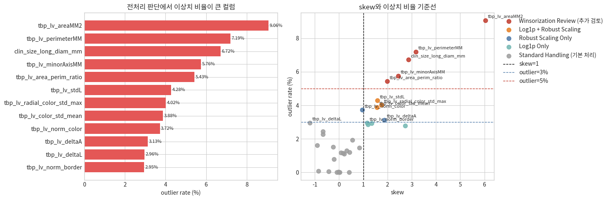

---

**표 9.2-c. 판단 기준별 대표 컬럼 미리보기**

---

| col_1 | decision_group | decision_group_display | column | skew_train | outlier_rate_pct_train |
| --- | --- | --- | --- | --- | --- |
| 0 | winsorization_review | Winsorization Review (추가 검토) | tbp_lv_areaMM2 | 6.0390 | 9.0642 |
| 1 | log1p_and_robust_scale | Log1p + Robust Scaling | tbp_lv_stdL | 1.5834 | 4.2813 |
| 2 | robust_scale_only | Robust Scaling Only | tbp_lv_norm_color | 0.9571 | 3.7234 |
| 3 | log1p_only | Log1p Only | tbp_lv_norm_border | 1.1624 | 2.9500 |
| 4 | standard_handling | Standard Handling (기본 처리) | tbp_lv_deltaL | -1.2096 | 2.9554 |

---

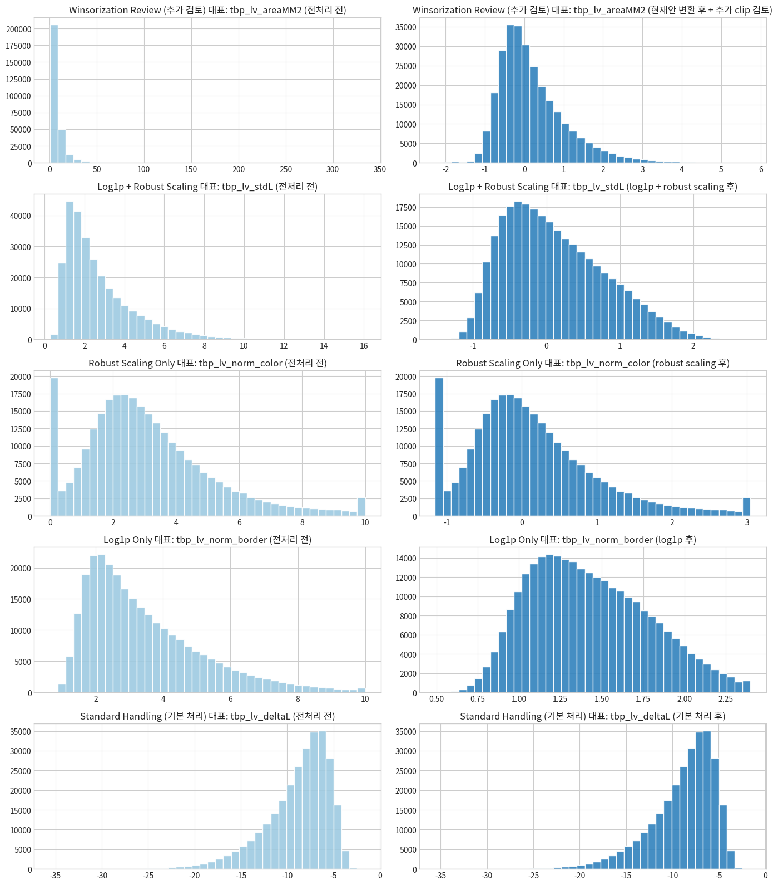

---

#### 9.2 해석

이 장에서는 판단 기준을 숫자로 고정했다. 기본적으로 `skew > 1`이면 `log1p 후보`, `이상치 비율 >= 3%`면 `robust scaling 후보`, `이상치 비율 >= 5%`면 `winsorization 추가 검토 후보`로 본다. 오른쪽 산점도는 바로 이 기준선을 눈으로 확인하기 위한 그림이다.

train 기준으로 `log1p` 후보는 `tbp_lv_areaMM2`, `tbp_lv_perimeterMM`, `clin_size_long_diam_mm`, `tbp_lv_stdLExt`, `tbp_lv_minorAxisMM`, `tbp_lv_area_perim_ratio` 등이다. 이 변수들은 모두 `0 이상`이고 skew가 `1`보다 커서, 긴 오른쪽 꼬리를 완화할 여지가 있다.

이상치 비율이 특히 높은 변수는 `tbp_lv_areaMM2 9.0642%`, `tbp_lv_perimeterMM 7.1885%`, `clin_size_long_diam_mm 6.7216%`, `tbp_lv_minorAxisMM 5.7560%`, `tbp_lv_area_perim_ratio 5.4264%`다. 하지만 이런 값들을 바로 삭제하지는 않는다. 기본 정책은 `row 삭제 없음(do_not_drop_rows)`이고, 대신 `log1p`, `robust scaling`, 필요시 `winsorization 검토`로 대응한다.

아래 대표 컬럼 전처리 전후 그림은 이 판단 기준이 실제로 어떤 모양 변화를 기대하는지 보여준다. 즉 `9.2`는 단순히 컬럼 목록을 정리하는 단계가 아니라, 왜 이런 전처리 결정을 내렸는지를 그림으로 설명하는 단계다.

이 전처리 규칙은 `strict_preprocessing_spec.json`으로 저장되므로, 이후 모델링 코드에서는 이 spec을 그대로 읽어서 같은 규칙을 반복 적용할 수 있다. 즉 이제부터는 전처리도 EDA 수준의 제안이 아니라, 재현 가능한 실행 규칙으로 넘어간 상태다.

이번 notebook에서 `Winsorization`은 기본 적용이 아니다. 현재 단계에서는 어디까지나 `추가 검토(review)` 대상으로만 표시하고 있으며, 실제 기본 정책은 `row 삭제 없음`, `raw signal 보존 우선`, `log1p/robust scaling 중심`이다. 다만 이 판단도 tail에 malignant가 몰려 있으면 다시 보수적으로 재검토해야 하므로, 바로 다음 `9.3`에서 tail 구간의 malignant 집중도를 따로 점검한다.

---

### 9.3 tail 구간의 malignant 집중도 점검

`9.2`에서 왜도, outlier rate, `log1p`, `robust scaling`, `winsorization review`를 정리했지만, 의료 데이터에서는 tail이 병리 신호일 수 있다. 따라서 이번 셀에서는 변환 대상 후보들의 tail 구간에 malignant가 실제로 몰려 있는지 먼저 확인한다.

이 단계의 목적은 간단하다.
1. outlier처럼 보이는 구간이 정말 단순 잡음인지 본다.
2. 아니면 malignant가 집중된 병리 tail인지 본다.
3. 그 결과에 따라 `변환은 하더라도 row 삭제나 기계적 클리핑은 더 보수적으로 다뤄야 한다`는 근거를 만든다.

---

#### 실행 결과

---

**표 9.3-a. 변환 후보 컬럼의 tail malignant enrichment 요약**

---

| col_1 | column | decision_group_display | skew_train | outlier_rate_pct_train | upper_tail_marker | upper_tail_sample_count | upper_tail_positive_rate | upper_tail_positive_rate_enrichment | lower_tail_marker | lower_tail_sample_count | lower_tail_positive_rate | lower_tail_positive_rate_enrichment | max_tail_enrichment | tail_alert |
| --- | --- | --- | --- | --- | --- | --- | --- | --- | --- | --- | --- | --- | --- | --- |
| 2 | clin_size_long_diam_mm | Winsorization Review (추가 검토) | 2.8678 | 6.7216 | upper_1pct | 2807.0 | 0.011756 | 12.206329 | lower_1pct | 2918.0 | 0.020905 | 21.704916 | 21.704916 | strong_tail_signal |
| 1 | tbp_lv_perimeterMM | Winsorization Review (추가 검토) | 3.1743 | 7.1885 | upper_1pct | 2804.0 | 0.012126 | 12.589673 | lower_1pct | 2876.0 | 0.018776 | 19.494784 | 19.494784 | strong_tail_signal |
| 0 | tbp_lv_areaMM2 | Winsorization Review (추가 검토) | 6.0390 | 9.0642 | upper_1pct | 2804.0 | 0.014265 | 14.811381 | lower_1pct | 2874.0 | 0.017745 | 18.424553 | 18.424553 | strong_tail_signal |
| 3 | tbp_lv_minorAxisMM | Winsorization Review (추가 검토) | 2.4453 | 5.7560 | upper_1pct | 2804.0 | 0.014979 | 15.551950 | lower_1pct | 2813.0 | 0.012087 | 12.549394 | 15.551950 | strong_tail_signal |
| 12 | tbp_lv_deltaLBnorm | Log1p Only | 1.3436 | 2.9390 | upper_1pct | 2804.0 | 0.008916 | 9.257113 | lower_1pct | 2804.0 | 0.012482 | 12.959958 | 12.959958 | strong_tail_signal |
| 8 | tbp_lv_norm_color | Robust Scaling Only | 0.9571 | 3.7234 | upper_1pct | 2804.0 | 0.009986 | 10.367966 | lower_1pct | 18140.0 | 0.003032 | 3.148031 | 10.367966 | strong_tail_signal |
| 6 | tbp_lv_radial_color_std_max | Log1p + Robust Scaling | 1.7443 | 4.0205 | upper_1pct | 2804.0 | 0.009629 | 9.997682 | lower_1pct | 20624.0 | 0.002667 | 2.768875 | 9.997682 | strong_tail_signal |
| 7 | tbp_lv_color_std_mean | Log1p + Robust Scaling | 1.5648 | 3.8782 | upper_1pct | 2804.0 | 0.008916 | 9.257113 | lower_1pct | 18142.0 | 0.003032 | 3.147684 | 9.257113 | strong_tail_signal |
| 13 | tbp_lv_deltaLB | Log1p Only | 1.1944 | 2.8559 | upper_1pct | 2804.0 | 0.006776 | 7.035406 | lower_1pct | 2804.0 | 0.003210 | 3.332561 | 7.035406 | strong_tail_signal |
| 4 | tbp_lv_area_perim_ratio | Winsorization Review (추가 검토) | 1.9934 | 5.4264 | upper_1pct | 2804.0 | 0.002140 | 2.221707 | lower_1pct | 2805.0 | 0.006774 | 7.032898 | 7.032898 | strong_tail_signal |
| 9 | tbp_lv_deltaA | Robust Scaling Only | 1.8753 | 3.1280 | upper_5pct | 14017.0 | 0.001926 | 1.999964 | lower_1pct | 2804.0 | 0.005350 | 5.554268 | 5.554268 | strong_tail_signal |
| 14 | tbp_lv_stdLExt | Log1p Only | 2.7244 | 2.7842 | upper_1pct | 2804.0 | 0.005350 | 5.554268 | lower_5pct | 14017.0 | 0.000428 | 0.444437 | 5.554268 | strong_tail_signal |

---

_요약표는 상위 12행만 보여준다. 전체 표는 [065_9_3_tail_구간의_malignant_집중도_점검.md](isic2024_presentation_only_eda_chatgpt_report_tables/065_9_3_tail_구간의_malignant_집중도_점검.md)에서 확인할 수 있다._

---

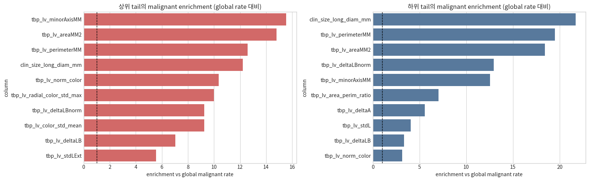

---

#### 9.3 해석

이 셀의 핵심은 `이상치처럼 보이는 값이 정말 제거/클리핑 대상인가`를 target 관점에서 다시 묻는 데 있다. 특히 global malignant 비율이 `0.1%`도 되지 않는 상황에서는, tail 구간의 작은 수치 변화가 실제로는 매우 큰 enrichment를 의미할 수 있다.

따라서 해석은 다음처럼 가져간다.
1. `tail enrichment > 1`이면 그 tail은 전체 평균보다 malignant가 더 많이 몰린 구간이다.
2. `tail enrichment >= 2`이면 단순 잡음으로 보기 어렵고, 최소한 `병리적 가능성이 있는 tail`로 봐야 한다.
3. `tail enrichment >= 5`이면 특히 조심해야 한다. 이 경우 `Winsorization review`가 표시되어 있더라도 기본값은 `클리핑`이 아니라 `raw signal 보존 + 변환은 rank를 덜 깨는 방식으로 제한`이 되어야 한다.

운명론적으로 말하면, 이번 데이터에서는 tail이 단순 분포 노이즈가 아니라 malignant scarcity가 남긴 흔적일 수 있다. 그래서 `9.2`의 변환 규칙은 그대로 두되, `row 삭제`나 `기계적 clipping`은 계속 기본 정책에서 제외하는 쪽이 더 안전하다.

---

## 10. 전처리 후 변수 간 관계 재점검

앞의 7장은 원자료(raw) 기준에서 변수 간 관계를 본 단계였다. 여기서는 `Strict (메인용)` 전처리 규칙을 train split에 적용한 뒤, 왜도, 상관관계, 다중공선성, PCA 구조가 어떻게 달라지는지 다시 확인한다.

---

### 10.1 전처리 후 분포와 왜도 재확인

`log1p`, `robust scaling`, 결측치 대체를 실제로 적용한 뒤, 긴 꼬리와 이상치 비율이 얼마나 완화되는지 확인한다. 이 단계는 전처리 규칙이 말로만 그럴듯한지, 실제 분포를 바꾸는지 검증하는 목적을 가진다.

---

#### 실행 결과

---

**표 10.1-a. 전처리 전후 왜도/이상치 비율 비교표**

---

| col_1 | column | decision_group_display | abs_skew_before | abs_skew_after | outlier_rate_pct_before | outlier_rate_pct_after |
| --- | --- | --- | --- | --- | --- | --- |
| 12 | tbp_lv_areaMM2 | Winsorization Review (추가 검토) | 6.0390 | 1.2388 | 9.0642 | 3.6506 |
| 25 | tbp_lv_perimeterMM | Winsorization Review (추가 검토) | 3.1743 | 1.2403 | 7.1885 | 3.7288 |
| 1 | clin_size_long_diam_mm | Winsorization Review (추가 검토) | 2.8678 | 1.3927 | 6.7216 | 3.7762 |
| 28 | tbp_lv_stdLExt | Log1p Only | 2.7244 | 0.7202 | 2.7842 | 1.7590 |
| 21 | tbp_lv_minorAxisMM | Winsorization Review (추가 검토) | 2.4453 | 0.9293 | 5.7560 | 3.1305 |
| 13 | tbp_lv_area_perim_ratio | Winsorization Review (추가 검토) | 1.9934 | 1.1729 | 5.4264 | 2.8748 |
| 15 | tbp_lv_deltaA | Robust Scaling Only | 1.8753 | 1.8753 | 3.1280 | 3.1280 |
| 26 | tbp_lv_radial_color_std_max | Log1p + Robust Scaling | 1.7443 | 0.1660 | 4.0205 | 1.4137 |
| 27 | tbp_lv_stdL | Log1p + Robust Scaling | 1.5834 | 0.5648 | 4.2813 | 0.3250 |
| 14 | tbp_lv_color_std_mean | Log1p + Robust Scaling | 1.5648 | 0.2011 | 3.8782 | 1.1501 |
| 19 | tbp_lv_deltaLBnorm | Log1p Only | 1.3436 | 0.6205 | 2.9390 | 0.6528 |
| 17 | tbp_lv_deltaL | Standard Handling (기본 처리) | 1.2096 | 1.2096 | 2.9554 | 2.9554 |

---

_요약표는 상위 12행만 보여준다. 전체 표는 [066_10_1_전처리_후_분포와_왜도_재확인.md](isic2024_presentation_only_eda_chatgpt_report_tables/066_10_1_전처리_후_분포와_왜도_재확인.md)에서 확인할 수 있다._

---

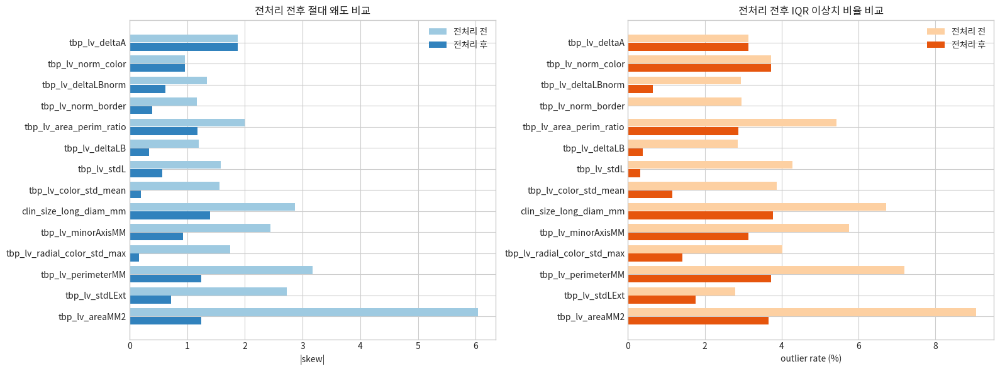

---

#### 10.1 해석

전처리 후 재점검의 첫 목적은 `긴 꼬리를 얼마나 줄였는가`를 확인하는 것이다. 특히 `Log1p Only`, `Log1p + Robust Scaling`, `Winsorization Review`로 분류된 변수들은 전처리 전후 절대 왜도와 IQR 기준 이상치 비율을 나란히 보면 효과를 바로 확인할 수 있다.

여기서 중요한 점은 `값을 삭제해서 조용하게 만든 것`이 아니라, 같은 샘플을 유지한 채 분포를 덜 치우치게 만든 것이다. 즉 이 장의 해석은 `제거`보다 `완화`에 초점을 둔다.

---

### 10.2 전처리 후 상관관계와 다중공선성 재점검

원자료 기준에서는 상관계수와 VIF가 매우 높았다. 여기서는 같은 숫자형 변수 집합에 전처리를 적용한 뒤, 높은 상관쌍과 높은 VIF가 얼마나 줄어드는지 다시 확인한다.

---

#### 실행 결과

---

**표 10.2-a. 전처리 전후 상관관계 요약표**

---

| col_1 | metric | before | after |
| --- | --- | --- | --- |
| 0 | abs_corr_ge_0.90_pairs | 18.0000 | 18.0000 |
| 1 | abs_corr_ge_0.95_pairs | 5.0000 | 7.0000 |
| 2 | max_abs_corr_pair | 0.9926 | 0.9692 |

---

**표 10.2-b. 전처리 후 상관계수 상위 쌍**

---

| col_1 | feature_1 | feature_2 | correlation | abs_correlation |
| --- | --- | --- | --- | --- |
| 425 | tbp_lv_deltaL | tbp_lv_deltaLB | -0.969249 | 0.969249 |
| 56 | clin_size_long_diam_mm | tbp_lv_perimeterMM | 0.964719 | 0.964719 |
| 380 | tbp_lv_color_std_mean | tbp_lv_norm_color | 0.962597 | 0.962597 |
| 338 | tbp_lv_areaMM2 | tbp_lv_minorAxisMM | 0.962564 | 0.962564 |
| 285 | tbp_lv_L | tbp_lv_Lext | 0.960331 | 0.960331 |
| 517 | tbp_lv_norm_color | tbp_lv_radial_color_std_max | 0.958511 | 0.958511 |
| 342 | tbp_lv_areaMM2 | tbp_lv_perimeterMM | 0.951096 | 0.951096 |
| 156 | tbp_lv_Bext | tbp_lv_Cext | 0.939925 | 0.939925 |
| 511 | tbp_lv_norm_border | tbp_lv_symm_2axis | 0.929626 | 0.929626 |
| 382 | tbp_lv_color_std_mean | tbp_lv_radial_color_std_max | 0.925307 | 0.925307 |
| 43 | clin_size_long_diam_mm | tbp_lv_areaMM2 | 0.924433 | 0.924433 |
| 127 | tbp_lv_B | tbp_lv_C | 0.920108 | 0.920108 |

---

_요약표는 상위 12행만 보여준다. 전체 표는 [068_10_2_전처리_후_상관관계와_다중공선성_재점검.md](isic2024_presentation_only_eda_chatgpt_report_tables/068_10_2_전처리_후_상관관계와_다중공선성_재점검.md)에서 확인할 수 있다._

---

**표 10.2-c. 전처리 전후 VIF 요약표**

---

| col_1 | metric | before | after |
| --- | --- | --- | --- |
| 0 | infinite_vif_count | 9.0000 | 9.0000 |
| 1 | vif_ge_10_count | 26.0000 | 26.0000 |
| 2 | finite_vif_median | 31.7017 | 42.3883 |

---

**표 10.2-d. 전처리 전후 VIF 비교표**

---

| col_1 | column | vif_before | vif_after |
| --- | --- | --- | --- |
| 17 | tbp_lv_deltaL | inf | inf |
| 5 | tbp_lv_Bext | inf | inf |
| 16 | tbp_lv_deltaB | inf | inf |
| 11 | tbp_lv_Lext | inf | inf |
| 10 | tbp_lv_L | inf | inf |
| 15 | tbp_lv_deltaA | inf | inf |
| 2 | tbp_lv_A | inf | inf |
| 4 | tbp_lv_B | inf | inf |
| 3 | tbp_lv_Aext | inf | inf |
| 25 | tbp_lv_perimeterMM | 109.411087 | 1888.884314 |
| 12 | tbp_lv_areaMM2 | 17.789745 | 1478.740620 |
| 6 | tbp_lv_C | 842.969993 | 791.723081 |

---

_요약표는 상위 12행만 보여준다. 전체 표는 [070_10_2_전처리_후_상관관계와_다중공선성_재점검.md](isic2024_presentation_only_eda_chatgpt_report_tables/070_10_2_전처리_후_상관관계와_다중공선성_재점검.md)에서 확인할 수 있다._

---

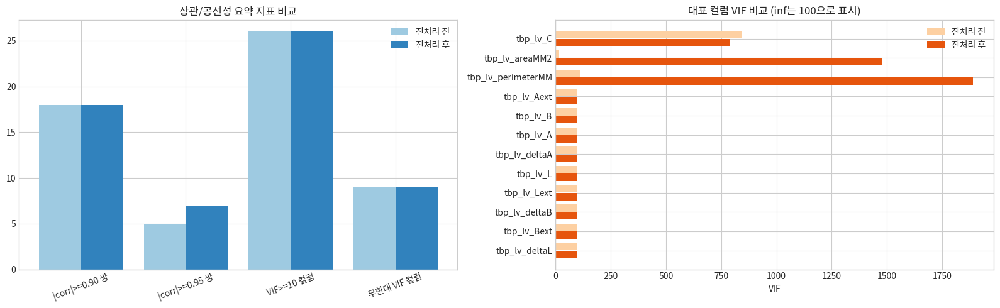

---

#### 10.2 해석

전처리 후에도 높은 상관쌍과 높은 VIF가 완전히 사라지지는 않는다. 하지만 이 장의 목적은 `모든 공선성을 없앴다`가 아니라, `전처리를 거친 뒤에도 여전히 강하게 묶여 다니는 변수는 무엇인가`를 다시 확인하는 것이다.

즉 여기서 남는 고상관 변수와 고VIF 변수는 다음 단계인 feature engineering이나 변수 축소에서 우선 검토할 후보가 된다. 다시 말해 `7장`이 원자료 기준 위험지도였다면, `10.2`는 전처리 후에도 남아 있는 구조적 중복을 재확인하는 단계다.

---

### 10.3 전처리 후 PCA 재확인

마지막으로, 전처리 전후에 주요 분산이 몇 개 축에 얼마나 집중되는지 확인한다. 이 비교는 `전처리 후에도 여전히 소수 변수에 분산이 과도하게 묶여 있는지`를 보는 데 도움이 된다.

---

#### 실행 결과

---

**표 10.3-a. 전처리 전후 PCA 누적 설명분산 요약표**

---

| col_1 | component | before_cumulative_pct | after_cumulative_pct |
| --- | --- | --- | --- |
| 0 | 1 | 24.6198 | 25.8930 |
| 1 | 2 | 41.7480 | 43.1631 |
| 2 | 3 | 54.4898 | 55.7303 |
| 3 | 5 | 67.9835 | 69.2616 |
| 4 | 10 | 84.1880 | 85.0706 |
| 5 | 15 | 95.8013 | 96.3217 |
| 6 | 20 | 99.5528 | 99.6124 |
| 7 | 25 | 99.9363 | 99.9555 |
| 8 | 30 | 99.9980 | 99.9992 |
| 9 | 34 | 100.0000 | 100.0000 |

---

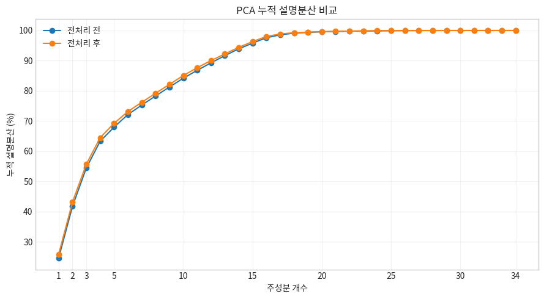

---

#### 10.3 해석

이번 PCA 결과는 `전처리 후 분산이 더 퍼졌다`기보다, 오히려 `초기 몇 개 주성분에 조금 더 모였다`는 쪽에 가깝다. 실제로 `PC1` 설명분산은 `24.6198% -> 25.8930%`로 소폭 늘었고, 누적 설명분산도 `10개 주성분` 기준 `84.1880% -> 85.0706%`, `15개 주성분` 기준 `95.8013% -> 96.3217%`로 약간 상승했다.

이 뜻은 전처리가 실패했다는 것이 아니라, `긴 꼬리와 이상치 영향은 완화했지만 변수 중복 구조 자체는 크게 줄이지 못했다`는 것이다. 다시 말해 `log1p`와 `robust scaling`은 분포를 안정화하는 데는 도움이 되었지만, 서로 비슷한 정보를 담는 컬럼이 많다는 문제까지 해결하지는 못했다.

그래서 `10.3`의 결론은 명확하다. 현재 데이터에서는 `전처리만으로는 충분하지 않고`, 다음 단계에서 `변수 묶음 정리`, `상호작용 변수 설계`, `중복 정보 축소`를 포함한 feature engineering이 추가로 필요하다. 즉 `11장`으로 넘어가는 이유가 바로 이 표와 곡선에서 확인된다.

다만 이 PCA는 어디까지나 `전체 분산 구조`를 보는 global diagnostic이다. malignant가 극도로 적은 현재 데이터에서는 top principal component가 사실상 benign 다수를 설명하는 축이 되기 쉽다. 따라서 이 결과를 곧바로 `악성을 잘 구분하는 차원 구조`로 읽어서는 안 되며, 바로 다음 `10.4`에서 matched case-control 방식의 malignant-aware PCA를 따로 확인한다.

---

### 10.4 malignant-aware 분산 구조 재점검

`10.3`의 PCA는 전체 train 분산을 설명하는 진단에는 유용하지만, malignant가 너무 적기 때문에 top component가 거의 전부 benign 다수를 설명하는 축이 되기 쉽다. 따라서 이번 셀에서는 `matched case-control` 방식의 malignant-aware PCA를 추가로 본다.

절차는 다음과 같다.
1. train split에서 모든 malignant row를 가져온다.
2. 같은 수의 benign row를 무작위로 맞춰 balanced subset을 만든다.
3. `전체 train에 맞춘 PCA`와 `balanced subset에 맞춘 PCA`를 나란히 비교한다.
4. 단순 설명분산뿐 아니라, 각 PC가 benign/malignant를 얼마나 가르는지(`abs standardized difference`, `single-PC AUC`)도 함께 본다.

이 셀의 목적은 global PCA를 부정하는 것이 아니라, `global variance`와 `malignant-sensitive variance`를 분리해서 읽도록 만드는 것이다.

---

#### 실행 결과

---

**표 10.4-a. global PCA vs balanced PCA 요약**

---

| col_1 | diagnostic | balanced_rows | positive_rows | top3_cumulative_variance_pct | top5_cumulative_variance_pct | top5_mean_abs_smd | top5_max_single_pc_auc | top5_mean_abs_target_corr |
| --- | --- | --- | --- | --- | --- | --- | --- | --- |
| 0 | balanced_pca_on_matched_train | 540 | 270 | 57.232748 | 70.621469 | 0.467965 | 0.690796 | 0.225282 |
| 1 | global_pca_on_full_train | 540 | 270 | 55.730275 | 69.261575 | 0.495107 | 0.715967 | 0.235892 |

---

**표 10.4-b. top 10 component 진단표**

---

| col_1 | diagnostic | component | explained_variance_ratio_pct | abs_standardized_difference | abs_target_corr | single_pc_auc |
| --- | --- | --- | --- | --- | --- | --- |
| 0 | global_pca_on_full_train | 1 | 25.893043 | 0.286619 | 0.142118 | 0.584376 |
| 1 | global_pca_on_full_train | 2 | 17.270044 | 0.521485 | 0.252745 | 0.642785 |
| 2 | global_pca_on_full_train | 3 | 12.567188 | 0.735858 | 0.345863 | 0.701783 |
| 3 | global_pca_on_full_train | 4 | 8.780696 | 0.789747 | 0.367866 | 0.715967 |
| 4 | global_pca_on_full_train | 5 | 4.750605 | 0.141827 | 0.070866 | 0.535446 |
| 5 | global_pca_on_full_train | 6 | 3.884699 | 0.237944 | 0.118355 | 0.586214 |
| 6 | global_pca_on_full_train | 7 | 3.090658 | 0.090156 | 0.045116 | 0.526667 |
| 7 | global_pca_on_full_train | 8 | 2.968461 | 0.006647 | 0.003330 | 0.512647 |
| 8 | global_pca_on_full_train | 9 | 2.959438 | 0.182366 | 0.090974 | 0.552442 |
| 9 | global_pca_on_full_train | 10 | 2.905805 | 0.266234 | 0.132194 | 0.574636 |
| 10 | balanced_pca_on_matched_train | 1 | 29.054914 | 0.369057 | 0.181791 | 0.602030 |
| 11 | balanced_pca_on_matched_train | 2 | 16.106015 | 0.541395 | 0.261745 | 0.648861 |

---

_요약표는 상위 12행만 보여준다. 전체 표는 [073_10_4_malignant_aware_분산_구조_재점검.md](isic2024_presentation_only_eda_chatgpt_report_tables/073_10_4_malignant_aware_분산_구조_재점검.md)에서 확인할 수 있다._

---

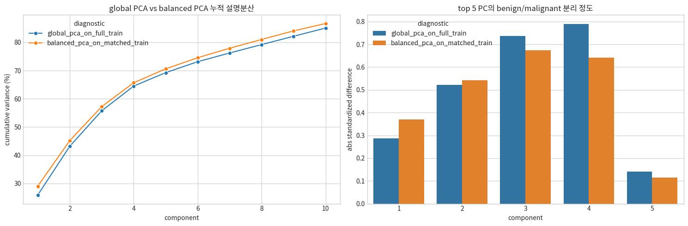

---

#### 10.4 해석

이제 `10.3`의 global PCA와 `10.4`의 malignant-aware PCA를 분리해서 읽을 수 있게 된다.

해석 원칙은 다음과 같다.
1. `global PCA`는 여전히 전체 구조 진단에는 유용하다. 다만 이는 benign 다수의 분산을 더 많이 반영한다.
2. `balanced PCA`에서 top PC들의 `abs standardized difference`와 `single-PC AUC`가 더 높게 나오면, `malignant를 구분하는 데 유의미한 분산`이 실제로 존재하지만 global PCA에서 가려졌다는 뜻이다.
3. 반대로 balanced PCA에서도 분리도가 낮다면, 현재 numeric set 자체가 malignant-sensitive variance를 충분히 담지 못하고 있음을 뜻한다.

운명론적으로 말하면, 이 데이터에서는 `전체 분산`과 `악성 구분 분산`을 같은 것으로 보면 안 된다. 따라서 이후 notebook에서는 global PCA를 `구조 진단`, balanced PCA를 `malignant-aware 보조 진단`으로 구분해 해석하는 것이 더 정직하다.

---

## 11. 문헌 기반 feature engineering 후보 정리

전처리 후에도 공선성과 분산 집중이 남아 있으므로, 이제는 `원 변수만 유지하는 단계`를 넘어 `문헌 기반 proxy feature`를 설계할 단계다. 이번 장에서는 `Strict (메인용)` 기준을 유지하면서, 공개된 임상 규칙과 dermoscopy 해석축을 `train-metadata.csv`에 있는 수치형 컬럼으로 근사해 본다.

중요한 점은, 아래에서 만드는 식들이 `원 논문의 임상 점수식을 그대로 복제한 것`은 아니라는 것이다. 현재 메타데이터에서 직접 관측 가능한 축만 사용해 `ABCD`, `CASH`, 색 이질성, 경계 불규칙성, 크기/형태, 해부학 맥락`을 proxy 형태로 다시 구성한다.

---

### 11.1 feature engineering 후보 생성과 1차 선별

이번 후보군은 다음 네 개의 문헌 축을 참고해 넓게 만든다.
1. `ABCD rule`: 비대칭, 경계, 색, 직경을 함께 본다.
2. `CASH`: 색, 구조(architecture), 대칭성, 균질성을 함께 본다.
3. `DermNet dermoscopic features`: 여러 색, 불균질 패턴, 비대칭, 불규칙 경계 같은 해석축을 다시 묶는다.
4. `SLICE-3D / train-metadata 구조`: 현재 데이터셋이 제공하는 색좌표, 형태, 좌표, 환자 맥락 컬럼으로 위 축을 근사한다.

상세한 방법론 정리는 [feature_engineering_methodology_11_1.md](/home/junkim2603a/proj/paper_ajou_dev/artifacts/eda/isic2024/feature_engineering_methodology_11_1.md)에 별도로 적어두었다. 이 문서에는 `문헌별로 어떻게 적용했는가`, `문헌 외에 추가된 보조 축`, `1차 선별 기준과 연결`, `실제로 살아남은 문헌 아이디어`를 정리했다.

참고 문헌 링크
1. [ABCD rule - Dermoscopedia](https://dermoscopedia.org/ABCD_rule)
2. [CASH algorithm abstract - JAMA Dermatology](https://jamanetwork.com/journals/jamadermatology/fullarticle/419590)
3. [Dermatoscopic features - DermNet](https://dermnetnz.org/cme/dermoscopy-course/dermoscopic-features)
4. [SLICE-3D / ISIC 2024 Scientific Data](https://www.nature.com/articles/s41597-024-03743-w)

1차 선별에서는 아직 후보-후보 중복까지는 줄이지 않는다. 우선은 `효과가 너무 약한 후보`, `기존 변수와 거의 같은 후보`만 걸러서 넓은 후보군을 만든다.

---

#### 11.1-a 문헌별 대표 feature 요약표

아래 표는 각 문헌 축 안에서 `screen_pass_v2`를 먼저 보고, 그다음 `abs_std_diff_train`과 `novelty_score`가 큰 순으로 고른 대표 후보를 정리한 것이다. 표를 짧게 유지하기 위해 각 축마다 상위 2개 후보만 적었다.

| 문헌 축 | 대표 feature | 공식 | 1차 통과 여부 |
|---|---|---|---|
| ABCD rule | feat_blue_yellow_normalized_gap<br>feat_border_color_interaction | `(B-Bext) / (\|B\|+\|Bext\|)`<br>`norm_border * norm_color` | 통과<br>통과 |
| ABCD/CASH 결합 축 | feat_hue_color_coupling<br>feat_architecture_proxy_sum | `hue_gap * norm_color`<br>`symm_2axis + norm_border + norm_color` | 통과<br>통과 |
| CASH | feat_cash_proxy_raw<br>feat_color_variation_total | `symm_2axis + norm_border + norm_color + color_std_mean`<br>`color_std_mean + radial_color_std_max + stdL + stdLExt` | 통과<br>통과 |
| DermNet dermoscopic features | feat_hue_circular_gap<br>feat_color_contrast_euclidean | `circular_abs_diff(H, Hext)`<br>`sqrt(deltaL^2 + deltaA^2 + deltaB^2)` | 통과<br>통과 |
| SLICE-3D / ISIC 2024 | feat_vertical_size_interaction<br>feat_area_to_xyz_radius | `\|y\| * long_diam`<br>`areaMM2 / xyz_radius` | 통과<br>통과 |
| 문헌 외 보조 축 | feat_diameter_color_coupling<br>feat_age_area_interaction | `long_diam * norm_color`<br>`age_approx * areaMM2` | 통과<br>통과 |

---

#### 실행 결과

---

**표 11.1-a. family별 후보 요약**

---

| col_1 | family | candidate_count | screen_pass_count | mean_abs_std_diff | median_base_corr |
| --- | --- | --- | --- | --- | --- |
| 0 | architecture | 18 | 15 | 0.413176 | 0.747645 |
| 1 | color | 18 | 13 | 0.332416 | 0.903096 |
| 2 | context | 10 | 9 | 0.460609 | 0.888686 |
| 3 | geometry | 20 | 14 | 0.252181 | 0.902123 |
| 4 | spatial | 10 | 8 | 0.332643 | 0.756150 |

---

**표 11.1-b. 문헌 기반 feature engineering 후보 평가표**

---

| col_1 | feature | family | literature_anchor | source_columns | goal | formula | mean_benign_train | mean_malignant_train | std_diff_train | abs_std_diff_train | skew_train | outlier_rate_pct_train | max_abs_corr_with_base_train | feature_std_train | novelty_score | screen_pass_v2 | screen_reason_v2 |
| --- | --- | --- | --- | --- | --- | --- | --- | --- | --- | --- | --- | --- | --- | --- | --- | --- | --- |
| 0 | feat_xz_radius | spatial | SLICE-3D spatial proxy | tbp_lv_x, tbp_lv_z | x-z 평면 반경 | sqrt(x^2 + z^2) | 202.966073 | 1.734626e+02 | -0.312706 | 0.312706 | 0.943504 | 4.701518 | 0.191736 | 9.367200e+01 | 0.252749 | True | pass |
| 1 | feat_contrast_to_color_variation | color | CASH color-homogeneity | tbp_lv_deltaL, tbp_lv_deltaA, tbp_lv_deltaB, t... | 색차 강도를 병변 내부 색 분산으로 다시 스케일링 | contrast_euclidean / color_std_mean | 494616.247457 | 1.574172e+06 | 0.388261 | 0.388261 | 3.985952 | 10.699342 | 0.384345 | 1.947272e+06 | 0.239035 | True | pass |
| 2 | feat_contrast_to_radial_variation | color | CASH color-homogeneity | tbp_lv_deltaL, tbp_lv_deltaA, tbp_lv_deltaB, t... | 색차 강도를 중심-주변 색 변동으로 다시 스케일링 | contrast_euclidean / radial_color_std_max | 565377.244180 | 1.574173e+06 | 0.356796 | 0.356796 | 3.691140 | 12.168655 | 0.404277 | 2.077753e+06 | 0.212552 | True | pass |
| 3 | feat_architecture_proxy_sum | architecture | ABCD / CASH proxy | tbp_lv_symm_2axis, tbp_lv_norm_border, tbp_lv_... | 비대칭-경계-색 축을 합산한 간단한 구조 점수 | symm_2axis + norm_border + norm_color | 6.830407 | 8.799782e+00 | 0.604853 | 0.604853 | 1.280534 | 3.811155 | 0.670506 | 2.416013e+00 | 0.199295 | True | pass |
| 4 | feat_border_to_color_ratio | architecture | ABCD border vs color balance | tbp_lv_norm_border, tbp_lv_norm_color | 경계 불규칙성이 색 불균일보다 상대적으로 큰지 확인 | norm_border / norm_color | 325427.708389 | 7.776378e+05 | 0.300608 | 0.300608 | 4.081228 | 12.268893 | 0.379939 | 1.295084e+06 | 0.186395 | True | pass |
| ... | ... | ... | ... | ... | ... | ... | ... | ... | ... | ... | ... | ... | ... | ... | ... | ... | ... |
| 71 | feat_abs_y | spatial | SLICE-3D spatial proxy | tbp_lv_y | 세로 방향 절대 위치 | \|y\| | 1039.349348 | 1.166949e+03 | 0.307069 | 0.307069 | -0.811076 | 0.000000 | 0.995568 | 4.061557e+02 | 0.001361 | False | drop_high_base_overlap_or_zero_variance |
| 72 | feat_perimeter_area_balance | geometry | Perimeter-area balance | tbp_lv_perimeterMM, tbp_lv_areaMM2 | 둘레가 면적 제곱근 대비 얼마나 큰지 확인 | perimeterMM / sqrt(areaMM2) | 4.330187 | 4.484710e+00 | 0.240807 | 0.240807 | 1.524631 | 4.129345 | 0.995740 | 5.607780e-01 | 0.001026 | False | drop_high_base_overlap_or_zero_variance |
| 73 | feat_perimeter_sq_to_area | geometry | Compactness / circularity | tbp_lv_areaMM2, tbp_lv_perimeterMM | 둘레 제곱 대비 면적 비율 | perimeterMM^2 / areaMM2 | 19.064786 | 2.062000e+01 | 0.252526 | 0.252526 | 1.993383 | 5.426365 | 1.000000 | 5.358999e+00 | 0.000253 | False | drop_high_base_overlap_or_zero_variance |
| 74 | feat_color_internal_magnitude | color | DermNet color richness | tbp_lv_A, tbp_lv_B, tbp_lv_C | 병변 내부 색 강도를 하나의 벡터 크기로 요약 | sqrt(A^2 + B^2 + C^2) | 49.268876 | 4.725296e+01 | -0.216282 | 0.216282 | 0.077539 | 1.174309 | 1.000000 | 8.071138e+00 | 0.000216 | False | drop_high_base_overlap_or_zero_variance |
| 75 | feat_color_external_magnitude | color | DermNet background context | tbp_lv_Aext, tbp_lv_Bext, tbp_lv_Cext | 병변 외부 배경의 색 강도를 하나의 벡터 크기로 요약 | sqrt(Aext^2 + Bext^2 + Cext^2) | 43.762553 | 4.407277e+01 | 0.043310 | 0.043310 | 0.211301 | 1.111527 | 1.000000 | 6.872518e+00 | 0.000043 | False | drop_low_signal |

---

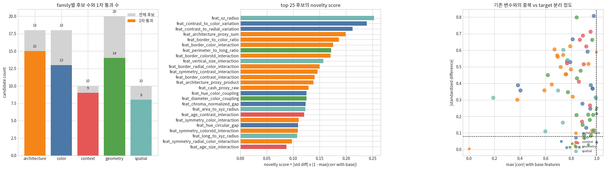

---

**표 11.1-c. 1차 통과 feature 목록**

---

| col_1 | feature | family | literature_anchor | abs_std_diff_train | max_abs_corr_with_base_train | novelty_score |
| --- | --- | --- | --- | --- | --- | --- |
| 0 | feat_architecture_proxy_sum | architecture | ABCD / CASH proxy | 0.6049 | 0.6705 | 0.1993 |
| 1 | feat_border_to_color_ratio | architecture | ABCD border vs color balance | 0.3006 | 0.3799 | 0.1864 |
| 2 | feat_border_color_interaction | architecture | ABCD border x color | 0.5684 | 0.6912 | 0.1755 |
| 3 | feat_border_colorstd_interaction | architecture | CASH architecture x homogeneity | 0.5604 | 0.6955 | 0.1706 |
| 4 | feat_border_radial_color_interaction | architecture | CASH architecture x homogeneity | 0.5716 | 0.7381 | 0.1497 |
| 5 | feat_symmetry_contrast_interaction | architecture | ABCD asymmetry x color contrast | 0.3574 | 0.5915 | 0.1460 |
| 6 | feat_border_contrast_interaction | architecture | ABCD border x color contrast | 0.4986 | 0.7184 | 0.1404 |
| 7 | feat_architecture_proxy_product | architecture | ABCD / CASH proxy | 0.3929 | 0.6485 | 0.1381 |
| 8 | feat_cash_proxy_raw | architecture | CASH proxy | 0.6239 | 0.7930 | 0.1292 |
| 9 | feat_symmetry_color_interaction | architecture | ABCD asymmetry x color | 0.4540 | 0.7572 | 0.1102 |
| 10 | feat_symmetry_colorstd_interaction | architecture | CASH symmetry x homogeneity | 0.4551 | 0.7607 | 0.1089 |
| 11 | feat_symmetry_radial_color_interaction | architecture | CASH symmetry x homogeneity | 0.4839 | 0.7980 | 0.0978 |

---

_요약표는 상위 12행만 보여준다. 전체 표는 [076_11_1_a_문헌별_대표_feature_요약표.md](isic2024_presentation_only_eda_chatgpt_report_tables/076_11_1_a_문헌별_대표_feature_요약표.md)에서 확인할 수 있다._

---

#### 11.1 해석

이번 버전에서는 문헌 해석축을 넓게 반영하기 위해 총 `76개` 파생변수를 만들었다. family는 `color`, `architecture`, `geometry`, `context`, `spatial` 다섯 묶음으로 나눴고, 1차 선별에서는 그중 `59개`가 통과했다.

1차 통과 기준은 명확하다.
1. `|standardized difference| >= 0.08`
2. `max |corr with base features| < 0.995`
3. `feature_std_train > 0`

즉 `target 분리력이 너무 약한 후보`, `기존 변수와 사실상 같은 후보`, `분산이 거의 없는 후보`는 여기서 바로 제외한다. 그리고 통과한 후보들 안에서는 `novelty score = |std diff| x (1 - max|corr with base|)`로 우선순위를 매겼다. 이 점수는 `target과의 분리력`과 `기존 변수와의 비중복성`을 동시에 반영하려는 장치다.

다만 여기서의 `통과`는 아직 `최종 채택`이 아니다. 11.1은 어디까지나 `기존 변수와 거의 같은 후보`만 걷어내는 넓은 screening 단계다. 그래서 통과한 59개 안에는 서로 매우 비슷한 후보가 여전히 많이 남아 있다. 특히 `architecture`와 `geometry` 계열은 강한 신호가 많지만 서로 설명하는 내용도 겹치기 쉽고, `context`와 `spatial`은 유용할 수 있어도 너무 많이 남기면 문헌형 feature보다 데이터셋 맥락을 더 많이 타게 된다.

따라서 다음 `11.2`에서는 `후보-후보 상관`, `family별 과다 채택`, `target과의 직접 상관`, `이미 선택된 후보와의 중복`을 기준으로 한 번 더 줄인다.

---

### 11.2 후보-후보 관계 재점검과 최종 채택

`11.1`에서 만든 후보군은 아직 넓다. 이번 단계에서는 `후보끼리 서로 얼마나 겹치는지`를 다시 보고, 너무 비슷한 후보는 줄인다. 구체적으로는 아래 기준을 함께 쓴다.
1. `1차 통과`한 후보만 대상으로 본다.
2. 이미 선택된 engineered feature와의 상관이 너무 크면 제외한다.
3. 한 family가 과하게 많이 남지 않도록 cap을 둔다.
4. `color / architecture / geometry`는 문헌 기반 주력 축으로 조금 더 넉넉하게, `context / spatial`은 보조 축으로 보수적으로 남긴다.

---

#### 실행 결과

---

**표 11.2-a. 최종 engineered feature selection 표**

---

| col_1 | feature | family | literature_anchor | source_columns | goal | formula | mean_benign_train | mean_malignant_train | std_diff_train | abs_std_diff_train | ... | novelty_score | screen_pass_v2 | screen_reason_v2 | decision_v2 | decision_reason_v2 | max_abs_corr_with_selected_train | most_similar_selected_feature | target_corr | abs_target_corr | selected_v2 |
| --- | --- | --- | --- | --- | --- | --- | --- | --- | --- | --- | --- | --- | --- | --- | --- | --- | --- | --- | --- | --- | --- |
| 0 | feat_xz_radius | spatial | SLICE-3D spatial proxy | tbp_lv_x, tbp_lv_z | x-z 평면 반경 | sqrt(x^2 + z^2) | 202.966073 | 1.734626e+02 | -0.312706 | 0.312706 | ... | 0.252749 | True | pass | selected_v2 | screen_pass + family balance + low overlap wit... | NaN | NaN | -0.009770 | 0.009770 | True |
| 1 | feat_contrast_to_color_variation | color | CASH color-homogeneity | tbp_lv_deltaL, tbp_lv_deltaA, tbp_lv_deltaB, t... | 색차 강도를 병변 내부 색 분산으로 다시 스케일링 | contrast_euclidean / color_std_mean | 494616.247457 | 1.574172e+06 | 0.388261 | 0.388261 | ... | 0.239035 | True | pass | selected_v2 | screen_pass + family balance + low overlap wit... | 0.020590 | feat_xz_radius | 0.017197 | 0.017197 | True |
| 2 | feat_architecture_proxy_sum | architecture | ABCD / CASH proxy | tbp_lv_symm_2axis, tbp_lv_norm_border, tbp_lv_... | 비대칭-경계-색 축을 합산한 간단한 구조 점수 | symm_2axis + norm_border + norm_color | 6.830407 | 8.799782e+00 | 0.604853 | 0.604853 | ... | 0.199295 | True | pass | selected_v2 | screen_pass + family balance + low overlap wit... | 0.148881 | feat_contrast_to_color_variation | 0.025285 | 0.025285 | True |
| 3 | feat_border_to_color_ratio | architecture | ABCD border vs color balance | tbp_lv_norm_border, tbp_lv_norm_color | 경계 불규칙성이 색 불균일보다 상대적으로 큰지 확인 | norm_border / norm_color | 325427.708389 | 7.776378e+05 | 0.300608 | 0.300608 | ... | 0.186395 | True | pass | selected_v2 | screen_pass + family balance + low overlap wit... | 0.914593 | feat_contrast_to_color_variation | 0.010831 | 0.010831 | True |
| 4 | feat_border_color_interaction | architecture | ABCD border x color | tbp_lv_norm_border, tbp_lv_norm_color | 경계 불규칙성과 색 불균일을 함께 반영 | norm_border * norm_color | 9.834775 | 1.764887e+01 | 0.568401 | 0.568401 | ... | 0.175497 | True | pass | selected_v2 | screen_pass + family balance + low overlap wit... | 0.902834 | feat_architecture_proxy_sum | 0.026764 | 0.026764 | True |
| ... | ... | ... | ... | ... | ... | ... | ... | ... | ... | ... | ... | ... | ... | ... | ... | ... | ... | ... | ... | ... | ... |
| 71 | feat_abs_y | spatial | SLICE-3D spatial proxy | tbp_lv_y | 세로 방향 절대 위치 | \|y\| | 1039.349348 | 1.166949e+03 | 0.307069 | 0.307069 | ... | 0.001361 | False | drop_high_base_overlap_or_zero_variance | drop_low_signal_or_high_base_overlap | failed 11.1 screening | NaN | NaN | 0.009745 | 0.009745 | False |
| 72 | feat_perimeter_area_balance | geometry | Perimeter-area balance | tbp_lv_perimeterMM, tbp_lv_areaMM2 | 둘레가 면적 제곱근 대비 얼마나 큰지 확인 | perimeterMM / sqrt(areaMM2) | 4.330187 | 4.484710e+00 | 0.240807 | 0.240807 | ... | 0.001026 | False | drop_high_base_overlap_or_zero_variance | drop_low_signal_or_high_base_overlap | failed 11.1 screening | NaN | NaN | 0.008547 | 0.008547 | False |
| 73 | feat_perimeter_sq_to_area | geometry | Compactness / circularity | tbp_lv_areaMM2, tbp_lv_perimeterMM | 둘레 제곱 대비 면적 비율 | perimeterMM^2 / areaMM2 | 19.064786 | 2.062000e+01 | 0.252526 | 0.252526 | ... | 0.000253 | False | drop_high_base_overlap_or_zero_variance | drop_low_signal_or_high_base_overlap | failed 11.1 screening | NaN | NaN | 0.009002 | 0.009002 | False |
| 74 | feat_color_internal_magnitude | color | DermNet color richness | tbp_lv_A, tbp_lv_B, tbp_lv_C | 병변 내부 색 강도를 하나의 벡터 크기로 요약 | sqrt(A^2 + B^2 + C^2) | 49.268876 | 4.725296e+01 | -0.216282 | 0.216282 | ... | 0.000216 | False | drop_high_base_overlap_or_zero_variance | drop_low_signal_or_high_base_overlap | failed 11.1 screening | NaN | NaN | -0.007748 | 0.007748 | False |
| 75 | feat_color_external_magnitude | color | DermNet background context | tbp_lv_Aext, tbp_lv_Bext, tbp_lv_Cext | 병변 외부 배경의 색 강도를 하나의 벡터 크기로 요약 | sqrt(Aext^2 + Bext^2 + Cext^2) | 43.762553 | 4.407277e+01 | 0.043310 | 0.043310 | ... | 0.000043 | False | drop_low_signal | drop_low_signal_or_high_base_overlap | failed 11.1 screening | NaN | NaN | 0.001400 | 0.001400 | False |

---

**표 11.2-b. selection decision 요약**

---

| col_1 | decision_v2 | count |
| --- | --- | --- |
| 0 | drop_family_cap | 26 |
| 1 | selected_v2 | 23 |
| 2 | drop_low_signal_or_high_base_overlap | 17 |
| 3 | drop_high_candidate_overlap | 10 |

---

**표 11.2-c. 선택된 engineered feature 상위 상관쌍**

---

| col_1 | feature_a | feature_b | abs_corr |
| --- | --- | --- | --- |
| 0 | feat_contrast_to_color_variation | feat_border_to_color_ratio | 0.914593 |
| 1 | feat_architecture_proxy_sum | feat_border_color_interaction | 0.902834 |
| 2 | feat_symmetry_contrast_interaction | feat_border_contrast_interaction | 0.893203 |
| 3 | feat_diameter_color_coupling | feat_area_eccentricity_coupling | 0.831219 |
| 4 | feat_hue_color_coupling | feat_hue_circular_gap | 0.826382 |
| 5 | feat_hue_color_coupling | feat_color_variation_total | 0.821037 |
| 6 | feat_color_to_border_ratio | feat_color_variation_total | 0.806179 |
| 7 | feat_age_size_interaction | feat_area_eccentricity_coupling | 0.802164 |
| 8 | feat_hue_circular_gap | feat_red_green_normalized_gap | 0.794024 |
| 9 | feat_hue_color_coupling | feat_color_to_border_ratio | 0.760776 |
| 10 | feat_border_contrast_interaction | feat_diameter_symmetry_coupling | 0.740907 |
| 11 | feat_border_color_interaction | feat_diameter_color_coupling | 0.739477 |

---

_요약표는 상위 12행만 보여준다. 전체 표는 [079_11_2_후보_후보_관계_재점검과_최종_채택.md](isic2024_presentation_only_eda_chatgpt_report_tables/079_11_2_후보_후보_관계_재점검과_최종_채택.md)에서 확인할 수 있다._

---

**표 11.2-d. 선택된 engineered feature의 target 상관계수**

---

| col_1 | feature | family | target_corr | abs_target_corr | novelty_score |
| --- | --- | --- | --- | --- | --- |
| 10 | feat_diameter_color_coupling | geometry | 0.0481 | 0.0481 | 0.1251 |
| 22 | feat_area_eccentricity_coupling | geometry | 0.0431 | 0.0431 | 0.0232 |
| 14 | feat_age_size_interaction | context | 0.0361 | 0.0361 | 0.0874 |
| 6 | feat_vertical_size_interaction | spatial | 0.0303 | 0.0303 | 0.1571 |
| 9 | feat_hue_color_coupling | color | 0.0280 | 0.0280 | 0.1251 |
| 4 | feat_border_color_interaction | architecture | 0.0268 | 0.0268 | 0.1755 |
| 11 | feat_chroma_normalized_gap | color | -0.0255 | 0.0255 | 0.1234 |
| 2 | feat_architecture_proxy_sum | architecture | 0.0253 | 0.0253 | 0.1993 |
| 19 | feat_color_variation_total | color | 0.0249 | 0.0249 | 0.0422 |
| 8 | feat_border_contrast_interaction | architecture | 0.0222 | 0.0222 | 0.1404 |
| 13 | feat_hue_circular_gap | color | 0.0185 | 0.0185 | 0.1093 |
| 16 | feat_diameter_symmetry_coupling | geometry | 0.0185 | 0.0185 | 0.0664 |

---

_요약표는 상위 12행만 보여준다. 전체 표는 [080_11_2_후보_후보_관계_재점검과_최종_채택.md](isic2024_presentation_only_eda_chatgpt_report_tables/080_11_2_후보_후보_관계_재점검과_최종_채택.md)에서 확인할 수 있다._

---

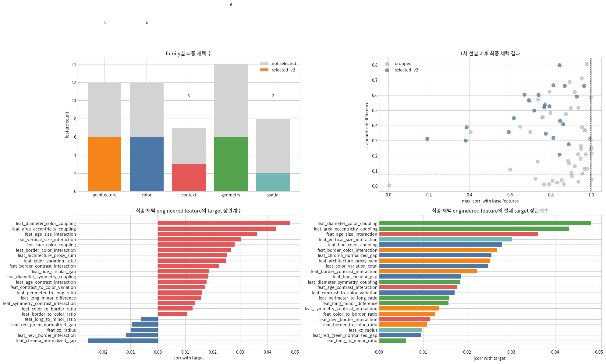

---

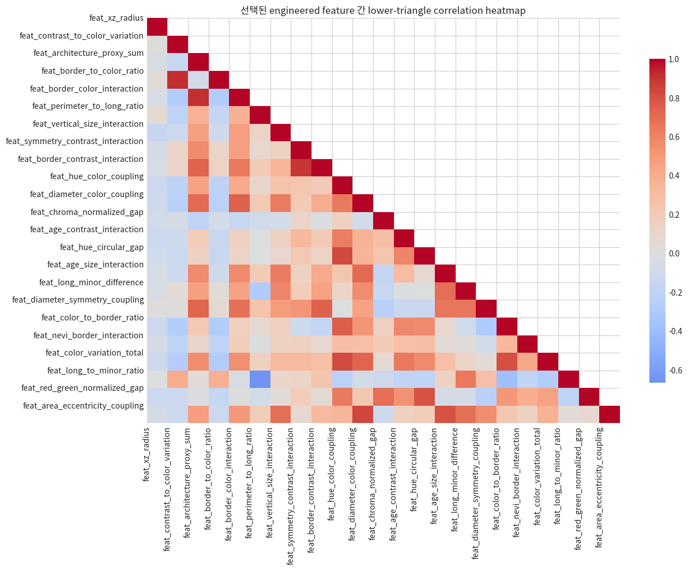

---

**표 11.2-e. 2차 최종 채택 feature 목록(selected_v2)**

---

| col_1 | feature | family | literature_anchor | abs_target_corr | novelty_score | decision_reason_v2 |
| --- | --- | --- | --- | --- | --- | --- |
| 0 | feat_border_color_interaction | architecture | ABCD border x color | 0.0268 | 0.1755 | screen_pass + family balance + low overlap wit... |
| 1 | feat_architecture_proxy_sum | architecture | ABCD / CASH proxy | 0.0253 | 0.1993 | screen_pass + family balance + low overlap wit... |
| 2 | feat_border_contrast_interaction | architecture | ABCD border x color contrast | 0.0222 | 0.1404 | screen_pass + family balance + low overlap wit... |
| 3 | feat_symmetry_contrast_interaction | architecture | ABCD asymmetry x color contrast | 0.0135 | 0.1460 | screen_pass + family balance + low overlap wit... |
| 4 | feat_color_to_border_ratio | architecture | ABCD color vs border balance | 0.0127 | 0.0598 | screen_pass + family balance + low overlap wit... |
| 5 | feat_border_to_color_ratio | architecture | ABCD border vs color balance | 0.0108 | 0.1864 | screen_pass + family balance + low overlap wit... |
| 6 | feat_hue_color_coupling | color | ABCD color x CASH homogeneity | 0.0280 | 0.1251 | screen_pass + family balance + low overlap wit... |
| 7 | feat_chroma_normalized_gap | color | ABCD color | 0.0255 | 0.1234 | screen_pass + family balance + low overlap wit... |
| 8 | feat_color_variation_total | color | CASH homogeneity | 0.0249 | 0.0422 | screen_pass + family balance + low overlap wit... |
| 9 | feat_hue_circular_gap | color | DermNet color variety | 0.0185 | 0.1093 | screen_pass + family balance + low overlap wit... |
| 10 | feat_contrast_to_color_variation | color | CASH color-homogeneity | 0.0172 | 0.2390 | screen_pass + family balance + low overlap wit... |
| 11 | feat_red_green_normalized_gap | color | ABCD color | 0.0095 | 0.0309 | screen_pass + family balance + low overlap wit... |

---

_요약표는 상위 12행만 보여준다. 전체 표는 [081_11_2_후보_후보_관계_재점검과_최종_채택.md](isic2024_presentation_only_eda_chatgpt_report_tables/081_11_2_후보_후보_관계_재점검과_최종_채택.md)에서 확인할 수 있다._

---

#### 11.2 해석

`11.2`의 통과 기준도 명확하다.
1. 먼저 `11.1`을 통과한 후보만 대상으로 본다.
2. family cap을 적용한다: `color 6`, `architecture 6`, `geometry 6`, `context 3`, `spatial 2`
3. 이미 선택된 engineered feature와의 `max |corr| >= 0.92`이면 제외한다.
4. 최종 후보는 `novelty score`가 높은 순서대로 보되, 위의 규칙을 동시에 만족해야 한다.

이번 결과에서는 `76개 후보 -> 59개 1차 통과 -> 23개 최종 채택`으로 줄었다. drop 사유도 분리해서 볼 수 있다. `11.1`에서 이미 걸러진 저신호/고중복 후보가 있었고, `11.2`에서는 다시 `family cap`과 `후보-후보 고상관` 때문에 추가로 줄었다.

이 단계에서 중요한 해석 포인트는 세 가지다. 첫째, `target과 상관이 크다`는 이유만으로 다 남기지 않았다. 예를 들어 상관이 괜찮아 보여도 이미 선택된 후보와 거의 같은 축이면 제외했다. 둘째, `절대 target 상관계수` 그래프를 함께 본 이유는, 최종 채택된 후보들이 실제로 benign/malignant 구분과 어느 정도 연결되는지 확인하기 위해서다. 셋째, lower-triangle heatmap을 보면 최종 채택 후에도 일부 중복 축은 남아 있다. 이는 의도된 결과다. `11.2`는 완전한 차원 축소가 아니라, `설명 가능한 engineered feature 묶음`을 만드는 단계이기 때문이다.

즉 `11.2`의 결론은 `23개가 최종 정답`이 아니라, `문헌 기반 해석축을 유지하면서도 후보 수를 충분히 줄인 2차 선택안`이라는 것이다. 그래서 다음 단계에서는 이 23개를 base feature와 합친 뒤, `VIF`와 `PCA`까지 다시 확인해 실제 입력 컬럼 수를 한 번 더 보수적으로 줄인다.

---

### 11.3 전환 메모: 초기 Strict 후보에서 최종 Strict로

여기서부터 notebook의 용어를 한 번 정리한다.

1. 지금까지의 `Strict-Full (초기 Strict 후보)`은 설계상 가장 넓은 현실형 baseline 후보였으므로, 이후 섹션에서는 이를 `Strict-Full (초기 Strict 후보)`로 읽는다.
2. 반면 `최종 Strict`는 중복과 불안정성을 줄이면서도 희귀 malignant를 가르는 데 필요한 분산을 더 안정적으로 보존한 축소형 세트였으므로, 이후 섹션에서는 이를 `최종 Strict`로 다룬다.
3. 즉 후반부의 목적은 `Strict-Full vs 최종 Strict`를 나란히 유지하는 것이 아니라, `초기 Strict 후보(Strict-Full)`를 재검토한 뒤 `최종 Strict`를 채택하는 과정으로 읽는 것이다.
4. 재현성과 산출물 추적을 위해 artifact 파일명도 이제 `final_strict` 기준으로 정리되었다. 문서 안의 `Strict (최종 메인 세트)`와 파일명의 `final_strict`는 같은 세트를 뜻한다.

---

### 11.4 VIF / PCA 재점검과 최종 Strict 재정의

`11.2`의 23개는 설명 가능한 engineered feature 묶음이지만, 아직 `실제 모델 입력`으로 확정된 것은 아니다. 이번 단계에서는 `Strict-Full (초기 Strict 후보)` 숫자형 base feature와 합친 뒤 다시 `VIF`, `pairwise correlation`, `PCA`를 보고, 너무 겹치는 engineered feature를 한 번 더 보수적으로 줄인다.

축소 기준은 다음과 같이 둔다.
1. `selected_v2` engineered feature만 대상으로 본다.
2. 전체 numeric set 안에서 `VIF >= 20`인 경우를 강한 경고로 본다.
3. 동시에 `max |corr with other final numeric| >= 0.95`이면 구조적으로 겹친다고 본다.
4. 이때 더 강한 peer가 이미 있으면, 상대적으로 약한 engineered feature를 제외한다.

---

#### 실행 결과

---

**표 11.3-a. engineered pruning review 표**

---

| col_1 | feature | family | literature_anchor | source_columns | goal | formula | mean_benign_train | mean_malignant_train | std_diff_train | abs_std_diff_train | ... | abs_target_corr | selected_v2 | top_peer | max_abs_corr_with_final_numeric_train | top_peer_abs_target_corr | top_peer_is_engineered | vif_with_v2_numeric | decision_v3 | decision_reason_v3 | selected_v3 |
| --- | --- | --- | --- | --- | --- | --- | --- | --- | --- | --- | --- | --- | --- | --- | --- | --- | --- | --- | --- | --- | --- |
| 0 | feat_diameter_color_coupling | geometry | Diameter x color | clin_size_long_diam_mm, tbp_lv_norm_color | 크기와 색 불균일을 함께 반영 | long_diam * norm_color | 13.8241 | 3.743090e+01 | 0.7982 | 0.7982 | ... | 0.0481 | True | tbp_lv_color_std_mean | 0.9266 | 0.0166 | False | 935.2737 | selected_v3 | keep: no stronger overlapping peer under VIF/c... | True |
| 1 | feat_area_eccentricity_coupling | geometry | Size x eccentricity | tbp_lv_areaMM2, tbp_lv_eccentricity | 큰 병변이면서 길쭉한 형태를 함께 반영 | areaMM2 * eccentricity | 6.1635 | 1.614930e+01 | 0.6623 | 0.6623 | ... | 0.0431 | True | clin_size_long_diam_mm | 0.9731 | 0.0240 | False | 468.3824 | selected_v3 | keep: no stronger overlapping peer under VIF/c... | True |
| 2 | feat_age_size_interaction | context | Age-context proxy | age_approx, clin_size_long_diam_mm | 연령과 장축 크기를 함께 반영 | age_approx * long_diam | 224.1288 | 3.584906e+02 | 0.6628 | 0.6628 | ... | 0.0361 | True | clin_size_long_diam_mm | 0.8017 | 0.0240 | False | 5661.9117 | selected_v3 | keep: no stronger overlapping peer under VIF/c... | True |
| 3 | feat_vertical_size_interaction | spatial | SLICE-3D spatial proxy | tbp_lv_y, clin_size_long_diam_mm | 세로 위치와 크기를 함께 반영 | \|y\| * long_diam | 4094.8248 | 6.540926e+03 | 0.6024 | 0.6024 | ... | 0.0303 | True | tbp_lv_y | 0.8195 | 0.0098 | False | 10.6053 | selected_v3 | keep: no stronger overlapping peer under VIF/c... | True |
| 4 | feat_hue_color_coupling | color | ABCD color x CASH homogeneity | tbp_lv_H, tbp_lv_Hext, tbp_lv_norm_color | hue 차이와 색 불균일을 동시에 반영 | hue_gap * norm_color | 23.1891 | 4.805810e+01 | 0.6658 | 0.6658 | ... | 0.0280 | True | tbp_lv_color_std_mean | 0.8918 | 0.0166 | False | 77.1910 | selected_v3 | keep: no stronger overlapping peer under VIF/c... | True |
| 5 | feat_border_color_interaction | architecture | ABCD border x color | tbp_lv_norm_border, tbp_lv_norm_color | 경계 불규칙성과 색 불균일을 함께 반영 | norm_border * norm_color | 9.8348 | 1.764890e+01 | 0.5684 | 0.5684 | ... | 0.0268 | True | feat_diameter_color_coupling | 0.8911 | 0.0153 | True | 426.2530 | selected_v3 | keep: no stronger overlapping peer under VIF/c... | True |
| 6 | feat_chroma_normalized_gap | color | ABCD color | tbp_lv_C, tbp_lv_Cext | 채도 차이를 크기 보정된 비율로 표현 | (C-Cext) / (C+Cext) | 0.0584 | 2.810000e-02 | -0.5329 | 0.5329 | ... | 0.0255 | True | tbp_lv_deltaB | 0.7684 | 0.0366 | False | 146.6028 | selected_v3 | keep: no stronger overlapping peer under VIF/c... | True |
| 7 | feat_architecture_proxy_sum | architecture | ABCD / CASH proxy | tbp_lv_symm_2axis, tbp_lv_norm_border, tbp_lv_... | 비대칭-경계-색 축을 합산한 간단한 구조 점수 | symm_2axis + norm_border + norm_color | 6.8304 | 8.799800e+00 | 0.6049 | 0.6049 | ... | 0.0253 | True | feat_border_color_interaction | 0.7653 | 0.0076 | True | 4941.1696 | selected_v3 | keep: no stronger overlapping peer under VIF/c... | True |
| 8 | feat_color_variation_total | color | CASH homogeneity | tbp_lv_color_std_mean, tbp_lv_radial_color_std... | 색과 명도의 이질성을 한 축으로 합산 | color_std_mean + radial_color_std_max + stdL +... | 7.0231 | 9.527300e+00 | 0.5914 | 0.5914 | ... | 0.0249 | True | tbp_lv_stdL | 0.9170 | 0.0097 | False | 181.6103 | selected_v3 | keep: no stronger overlapping peer under VIF/c... | True |
| 9 | feat_border_contrast_interaction | architecture | ABCD border x color contrast | tbp_lv_norm_border, tbp_lv_deltaL, tbp_lv_delt... | 경계 불규칙성과 색차 강도를 함께 반영 | norm_border * contrast_euclidean | 33.4948 | 4.421930e+01 | 0.4986 | 0.4986 | ... | 0.0222 | True | feat_symmetry_contrast_interaction | 0.9077 | 0.0114 | True | 5900.8545 | selected_v3 | keep: no stronger overlapping peer under VIF/c... | True |
| 10 | feat_hue_circular_gap | color | DermNet color variety | tbp_lv_H, tbp_lv_Hext | 내부와 외부의 hue 차이를 원형 축에서 계산 | circular_abs_diff(H, Hext) | 6.3257 | 8.618800e+00 | 0.5281 | 0.5281 | ... | 0.0185 | True | feat_red_green_normalized_gap | 0.7566 | 0.0095 | True | 26.1762 | selected_v3 | keep: no stronger overlapping peer under VIF/c... | True |
| 11 | feat_diameter_symmetry_coupling | geometry | Diameter x asymmetry | clin_size_long_diam_mm, tbp_lv_symm_2axis | 크기와 비대칭성을 함께 반영 | long_diam * symm_2axis | 1.2074 | 1.688300e+00 | 0.4304 | 0.4304 | ... | 0.0185 | True | tbp_lv_area_perim_ratio | 0.8731 | 0.0080 | False | 267.3951 | selected_v3 | keep: no stronger overlapping peer under VIF/c... | True |

---

_요약표는 상위 12행만 보여준다. 전체 표는 [082_11_4_VIF_PCA_재점검과_최종_Strict_재정의.md](isic2024_presentation_only_eda_chatgpt_report_tables/082_11_4_VIF_PCA_재점검과_최종_Strict_재정의.md)에서 확인할 수 있다._

---

**표 11.3-b. pruning 전후 요약 지표**

---

| col_1 | metric | before_pruning | after_pruning |
| --- | --- | --- | --- |
| 0 | engineered_feature_count | 23 | 22 |
| 1 | numeric_feature_count | 57 | 56 |
| 2 | abs_corr_ge_0.95_pairs | 9 | 8 |
| 3 | vif_ge_10_count | 50 | 49 |
| 4 | vif_ge_20_count | 48 | 46 |

---

**표 11.3-c. PCA pruning 전후 요약표**

---

| col_1 | component | before_pruning_cumulative_pct | after_pruning_cumulative_pct |
| --- | --- | --- | --- |
| 0 | 1 | 27.2522 | 27.1366 |
| 1 | 2 | 43.7306 | 43.9070 |
| 2 | 3 | 54.6321 | 54.9093 |
| 3 | 5 | 66.5573 | 66.8160 |
| 4 | 10 | 83.1760 | 83.2973 |
| 5 | 15 | 92.7631 | 92.9715 |
| 6 | 20 | 98.2344 | 98.2173 |
| 7 | 57 | 100.0000 | 100.0000 |

---

**표 11.3-d. 3차 보수적 채택 feature 목록(selected_v3)**

---

| col_1 | feature | family | abs_target_corr | vif_with_v2_numeric | max_abs_corr_with_final_numeric_train |
| --- | --- | --- | --- | --- | --- |
| 0 | feat_diameter_color_coupling | geometry | 0.0481 | 935.2737 | 0.9266 |
| 1 | feat_area_eccentricity_coupling | geometry | 0.0431 | 468.3824 | 0.9731 |
| 2 | feat_age_size_interaction | context | 0.0361 | 5661.9117 | 0.8017 |
| 3 | feat_vertical_size_interaction | spatial | 0.0303 | 10.6053 | 0.8195 |
| 4 | feat_hue_color_coupling | color | 0.0280 | 77.1910 | 0.8918 |
| 5 | feat_border_color_interaction | architecture | 0.0268 | 426.2530 | 0.8911 |
| 6 | feat_chroma_normalized_gap | color | 0.0255 | 146.6028 | 0.7684 |
| 7 | feat_architecture_proxy_sum | architecture | 0.0253 | 4941.1696 | 0.7653 |
| 8 | feat_color_variation_total | color | 0.0249 | 181.6103 | 0.9170 |
| 9 | feat_border_contrast_interaction | architecture | 0.0222 | 5900.8545 | 0.9077 |
| 10 | feat_hue_circular_gap | color | 0.0185 | 26.1762 | 0.7566 |
| 11 | feat_diameter_symmetry_coupling | geometry | 0.0185 | 267.3951 | 0.8731 |

---

_요약표는 상위 12행만 보여준다. 전체 표는 [085_11_4_VIF_PCA_재점검과_최종_Strict_재정의.md](isic2024_presentation_only_eda_chatgpt_report_tables/085_11_4_VIF_PCA_재점검과_최종_Strict_재정의.md)에서 확인할 수 있다._

---

**표 11.3-e. 최종 Strict 후보 축소 결과**

---

| col_1 | feature | family | abs_target_corr | vif_with_v2_numeric | decision_lite_v3 | decision_reason_lite_v3 |
| --- | --- | --- | --- | --- | --- | --- |
| 0 | feat_diameter_color_coupling | geometry | 0.0481 | 935.2737 | selected_lite_v3 | keep: top family representative under stricter... |
| 1 | feat_area_eccentricity_coupling | geometry | 0.0431 | 468.3824 | selected_lite_v3 | keep: top family representative under stricter... |
| 2 | feat_age_size_interaction | context | 0.0361 | 5661.9117 | selected_lite_v3 | keep: top family representative under stricter... |
| 3 | feat_vertical_size_interaction | spatial | 0.0303 | 10.6053 | selected_lite_v3 | keep: top family representative under stricter... |
| 4 | feat_hue_color_coupling | color | 0.0280 | 77.1910 | selected_lite_v3 | keep: top family representative under stricter... |
| 5 | feat_border_color_interaction | architecture | 0.0268 | 426.2530 | selected_lite_v3 | keep: top family representative under stricter... |
| 6 | feat_chroma_normalized_gap | color | 0.0255 | 146.6028 | selected_lite_v3 | keep: top family representative under stricter... |
| 7 | feat_architecture_proxy_sum | architecture | 0.0253 | 4941.1696 | selected_lite_v3 | keep: top family representative under stricter... |
| 8 | feat_color_variation_total | color | 0.0249 | 181.6103 | selected_lite_v3 | keep: top family representative under stricter... |
| 9 | feat_border_contrast_interaction | architecture | 0.0222 | 5900.8545 | selected_lite_v3 | keep: top family representative under stricter... |
| 10 | feat_hue_circular_gap | color | 0.0185 | 26.1762 | drop_lite_family_cap | color family lite cap(3) reached |
| 11 | feat_diameter_symmetry_coupling | geometry | 0.0185 | 267.3951 | drop_lite_high_vif_low_signal | VIF=267.40 and abs_target_corr=0.0185 too weak... |

---

_요약표는 상위 12행만 보여준다. 전체 표는 [086_11_4_VIF_PCA_재점검과_최종_Strict_재정의.md](isic2024_presentation_only_eda_chatgpt_report_tables/086_11_4_VIF_PCA_재점검과_최종_Strict_재정의.md)에서 확인할 수 있다._

---

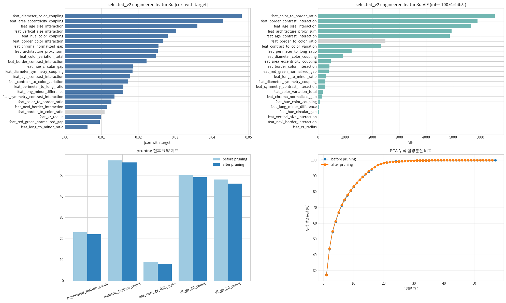

---

#### 11.3 해석

이번 단계는 `engineered feature를 더 만들기`가 아니라 `실제 입력 세트로 가져갈 만큼만 남기기`를 목표로 한다. 즉 `11.2`에서 설명 가능한 후보를 만들었다면, `11.3`에서는 그 후보가 base feature와 합쳐졌을 때도 여전히 필요한지 다시 묻는 단계다.

표준 `selected_v3` 판단 기준은 네 가지다.
1. 전체 numeric set 안에서 `VIF >= 20`이면 강한 공선성 경고로 본다.
2. 동시에 `max |corr with other final numeric| >= 0.95`이면 구조적으로 거의 같은 축으로 본다.
3. 이때 더 강한 peer가 이미 있으면 약한 engineered feature를 제외한다.
4. 반대로 겹치더라도 target과의 연결이 더 강하거나, 다른 family를 대표하는 축이면 남긴다.

그리고 이번에는 여기서 한 걸음 더 나가 `Strict (최종 메인 세트)` 후보를 함께 만든다. 이 기준은 `Strict-Full (초기 Strict 후보)`보다 더 보수적이다.
1. family cap을 더 줄인다: `color 3 / architecture 3 / geometry 3 / context 1 / spatial 1`
2. `VIF >= 200`이면서 `abs_target_corr < 0.02`인 feature는 lite set에서 제외한다.
3. 이미 lite set에 남긴 feature와 `|corr| >= 0.90`이면 더 약한 쪽은 제외한다.

즉 `selected_v3`는 설명 가능한 표준 세트이고, `lite`는 더 적은 수의 대표 feature만 남기는 축소 세트다.

---

## 12. Strict / Relaxed / Oracle 최종 입력 세트 확정 (v3)

이제부터는 `분석용 후보`와 `현재 버전에서 실제로 넣을 입력`을 구분한다. 아래의 최종 입력 세트는 `11.3`의 보수적 축소까지 반영한 `v3 baseline` 기준이다.

---

### 12.1 최종 feature set 구성 규칙 확정

최종 입력 세트는 다음 원칙으로 고정한다.
1. `Strict-Full (초기 Strict 후보)`은 안전한 메타데이터와 `11.3`에서 최종 남긴 engineered feature만 쓴다.
2. `Relaxed (보조용)`은 `Strict`에 출처/사용권 맥락 변수만 더한다.
3. `Oracle (참고용)`은 진단 사후 정보와 강한 train-only 신호를 추가한다.
4. engineered feature의 log 변환과 robust scaling 여부도 항상 `train split` 기준으로만 정한다.

---

#### 실행 결과

---

```text
/home/junkim2603a/miniconda3/envs/paper_ajou_dev/lib/python3.10/site-packages/numpy/lib/nanfunctions.py:1215: RuntimeWarning: Mean of empty slice
  return np.nanmean(a, axis, out=out, keepdims=keepdims)
```

---

**표 12.1-a. 최종 feature set 요약(v3)**

---

| col_1 | regime | n_total_features | n_engineered_features | n_missing_indicators | n_object_features | n_numeric_features |
| --- | --- | --- | --- | --- | --- | --- |
| 0 | Strict-Full (초기 Strict 후보) | 62 | 22 | 1 | 5 | 57 |
| 1 | Strict (최종 메인 세트) | 51 | 11 | 1 | 5 | 46 |
| 2 | Relaxed (보조용) | 64 | 22 | 1 | 7 | 57 |
| 3 | Oracle (참고용) | 76 | 22 | 3 | 14 | 62 |

---

**표 12.1-b. 최종 채택 engineered feature 목록(v3)**

---

| col_1 | feature | family | literature_anchor | source_columns | goal | abs_target_corr | vif_with_v2_numeric | max_abs_corr_with_final_numeric_train |
| --- | --- | --- | --- | --- | --- | --- | --- | --- |
| 0 | feat_border_color_interaction | architecture | ABCD border x color | tbp_lv_norm_border, tbp_lv_norm_color | 경계 불규칙성과 색 불균일을 함께 반영 | 0.0268 | 426.2530 | 0.8911 |
| 1 | feat_architecture_proxy_sum | architecture | ABCD / CASH proxy | tbp_lv_symm_2axis, tbp_lv_norm_border, tbp_lv_... | 비대칭-경계-색 축을 합산한 간단한 구조 점수 | 0.0253 | 4941.1696 | 0.7653 |
| 2 | feat_border_contrast_interaction | architecture | ABCD border x color contrast | tbp_lv_norm_border, tbp_lv_deltaL, tbp_lv_delt... | 경계 불규칙성과 색차 강도를 함께 반영 | 0.0222 | 5900.8545 | 0.9077 |
| 3 | feat_symmetry_contrast_interaction | architecture | ABCD asymmetry x color contrast | tbp_lv_symm_2axis, tbp_lv_deltaL, tbp_lv_delta... | 비대칭성과 색차 강도를 함께 반영 | 0.0135 | 260.2856 | 0.9077 |
| 4 | feat_color_to_border_ratio | architecture | ABCD color vs border balance | tbp_lv_norm_border, tbp_lv_norm_color | 색 불균일성이 경계 불규칙성보다 상대적으로 큰지 확인 | 0.0127 | 6544.0105 | 0.8401 |
| 5 | feat_hue_color_coupling | color | ABCD color x CASH homogeneity | tbp_lv_H, tbp_lv_Hext, tbp_lv_norm_color | hue 차이와 색 불균일을 동시에 반영 | 0.0280 | 77.1910 | 0.8918 |
| 6 | feat_chroma_normalized_gap | color | ABCD color | tbp_lv_C, tbp_lv_Cext | 채도 차이를 크기 보정된 비율로 표현 | 0.0255 | 146.6028 | 0.7684 |
| 7 | feat_color_variation_total | color | CASH homogeneity | tbp_lv_color_std_mean, tbp_lv_radial_color_std... | 색과 명도의 이질성을 한 축으로 합산 | 0.0249 | 181.6103 | 0.9170 |
| 8 | feat_hue_circular_gap | color | DermNet color variety | tbp_lv_H, tbp_lv_Hext | 내부와 외부의 hue 차이를 원형 축에서 계산 | 0.0185 | 26.1762 | 0.7566 |
| 9 | feat_contrast_to_color_variation | color | CASH color-homogeneity | tbp_lv_deltaL, tbp_lv_deltaA, tbp_lv_deltaB, t... | 색차 강도를 병변 내부 색 분산으로 다시 스케일링 | 0.0172 | 2329.3516 | 0.9919 |
| 10 | feat_red_green_normalized_gap | color | ABCD color | tbp_lv_A, tbp_lv_Aext | A축(적-녹) 차이를 안정적인 정규화 비율로 표현 | 0.0095 | 393.6578 | 0.8884 |
| 11 | feat_age_size_interaction | context | Age-context proxy | age_approx, clin_size_long_diam_mm | 연령과 장축 크기를 함께 반영 | 0.0361 | 5661.9117 | 0.8017 |

---

_요약표는 상위 12행만 보여준다. 전체 표는 [088_12_1_최종_feature_set_구성_규칙_확정.md](isic2024_presentation_only_eda_chatgpt_report_tables/088_12_1_최종_feature_set_구성_규칙_확정.md)에서 확인할 수 있다._

---

**표 12.1-c. 최종 Strict용 engineered feature 목록(v3)**

---

| col_1 | feature | family | literature_anchor | source_columns | goal | abs_target_corr | vif_with_v2_numeric | max_abs_corr_with_final_numeric_train |
| --- | --- | --- | --- | --- | --- | --- | --- | --- |
| 0 | feat_border_color_interaction | architecture | ABCD border x color | tbp_lv_norm_border, tbp_lv_norm_color | 경계 불규칙성과 색 불균일을 함께 반영 | 0.0268 | 426.2530 | 0.8911 |
| 1 | feat_architecture_proxy_sum | architecture | ABCD / CASH proxy | tbp_lv_symm_2axis, tbp_lv_norm_border, tbp_lv_... | 비대칭-경계-색 축을 합산한 간단한 구조 점수 | 0.0253 | 4941.1696 | 0.7653 |
| 2 | feat_border_contrast_interaction | architecture | ABCD border x color contrast | tbp_lv_norm_border, tbp_lv_deltaL, tbp_lv_delt... | 경계 불규칙성과 색차 강도를 함께 반영 | 0.0222 | 5900.8545 | 0.9077 |
| 3 | feat_hue_color_coupling | color | ABCD color x CASH homogeneity | tbp_lv_H, tbp_lv_Hext, tbp_lv_norm_color | hue 차이와 색 불균일을 동시에 반영 | 0.0280 | 77.1910 | 0.8918 |
| 4 | feat_chroma_normalized_gap | color | ABCD color | tbp_lv_C, tbp_lv_Cext | 채도 차이를 크기 보정된 비율로 표현 | 0.0255 | 146.6028 | 0.7684 |
| 5 | feat_color_variation_total | color | CASH homogeneity | tbp_lv_color_std_mean, tbp_lv_radial_color_std... | 색과 명도의 이질성을 한 축으로 합산 | 0.0249 | 181.6103 | 0.9170 |
| 6 | feat_age_size_interaction | context | Age-context proxy | age_approx, clin_size_long_diam_mm | 연령과 장축 크기를 함께 반영 | 0.0361 | 5661.9117 | 0.8017 |
| 7 | feat_diameter_color_coupling | geometry | Diameter x color | clin_size_long_diam_mm, tbp_lv_norm_color | 크기와 색 불균일을 함께 반영 | 0.0481 | 935.2737 | 0.9266 |
| 8 | feat_area_eccentricity_coupling | geometry | Size x eccentricity | tbp_lv_areaMM2, tbp_lv_eccentricity | 큰 병변이면서 길쭉한 형태를 함께 반영 | 0.0431 | 468.3824 | 0.9731 |
| 9 | feat_long_minor_difference | geometry | Diameter spread | clin_size_long_diam_mm, tbp_lv_minorAxisMM | 장축과 단축 차이 | 0.0158 | 45.4864 | 0.7444 |
| 10 | feat_vertical_size_interaction | spatial | SLICE-3D spatial proxy | tbp_lv_y, clin_size_long_diam_mm | 세로 위치와 크기를 함께 반영 | 0.0303 | 10.6053 | 0.8195 |

---

#### 12.1 해석

`12장`의 목적은 후보 세트를 계속 늘리는 것이 아니라, 앞선 EDA와 전처리·feature engineering 결과를 바탕으로 `현재 버전에서 실제로 사용할 최종 입력 체계`를 고정하는 데 있다.

이 notebook의 본선 흐름은 여기서 닫힌다.
1. `Strict (메인용)`은 이 notebook이 최종적으로 채택한 메인 입력 세트다.
2. `Relaxed (보조용)`은 출처·맥락 정보의 영향을 점검하는 보조 세트다.
3. `Oracle (참고용)`은 train 전용 진단·병리 정보가 만들어내는 상한선을 확인하는 참고 세트다.

`Strict-Full (초기 Strict 후보)`는 본선 결론이 아니라, 이후 별도 follow-up notebook에서 `왜 최종 Strict가 더 적절했는가`를 비교 설명하기 위한 출발점으로만 남긴다.

---

### 12.2 최종 feature set 저장과 산출물 정리

최종적으로는 `어떤 컬럼을 어디에 쓰는가`를 코드가 아니라 산출물로 남겨야 한다. 이번 버전에서는 후보표, 2차 selection, VIF/PCA 기반 pruning 결과, 최종 입력 세트 정의를 모두 `v3` 산출물로 저장한다.

---

#### 실행 결과

---

**표 12.2-a. 최종 feature membership 표(v3)**

---

| col_1 | regime | feature | origin | family | source_columns |
| --- | --- | --- | --- | --- | --- |
| 0 | Strict-Full (초기 Strict 후보) | age_approx | strict_base | base | age_approx |
| 1 | Strict-Full (초기 Strict 후보) | clin_size_long_diam_mm | strict_base | base | clin_size_long_diam_mm |
| 2 | Strict-Full (초기 Strict 후보) | tbp_lv_A | strict_base | base | tbp_lv_A |
| 3 | Strict-Full (초기 Strict 후보) | tbp_lv_Aext | strict_base | base | tbp_lv_Aext |
| 4 | Strict-Full (초기 Strict 후보) | tbp_lv_B | strict_base | base | tbp_lv_B |
| ... | ... | ... | ... | ... | ... |
| 248 | Oracle (참고용) | mel_mitotic_index | oracle_extra | oracle | mel_mitotic_index |
| 249 | Oracle (참고용) | mel_thick_mm | oracle_extra | oracle | mel_thick_mm |
| 250 | Oracle (참고용) | tbp_lv_dnn_lesion_confidence | oracle_extra | oracle | tbp_lv_dnn_lesion_confidence |
| 251 | Oracle (참고용) | mel_mitotic_index__missing | oracle_extra | oracle | mel_mitotic_index |
| 252 | Oracle (참고용) | mel_thick_mm__missing | oracle_extra | oracle | mel_thick_mm |

---

**저장된 산출물(v3)**

---

| col_1 | artifact | path |
| --- | --- | --- |
| 0 | feature_engineering_candidates_v2.csv | /home/junkim2603a/proj/paper_ajou_dev/artifact... |
| 1 | feature_engineering_selection_v2.csv | /home/junkim2603a/proj/paper_ajou_dev/artifact... |
| 2 | feature_engineering_pruning_v3.csv | /home/junkim2603a/proj/paper_ajou_dev/artifact... |
| 3 | feature_engineering_pruning_lite_v3.csv | /home/junkim2603a/proj/paper_ajou_dev/artifact... |
| 4 | final_feature_sets_v3.json | /home/junkim2603a/proj/paper_ajou_dev/artifact... |
| 5 | final_feature_set_summary_v3.csv | /home/junkim2603a/proj/paper_ajou_dev/artifact... |
| 6 | final_feature_membership_v3.csv | /home/junkim2603a/proj/paper_ajou_dev/artifact... |

---

#### 12.2 해석

이제 이 notebook은 `train-metadata.csv`의 구조적 제약을 따라가며 최종 메인 세트에 도달한 EDA 문서로서 역할을 마친다.

정리하면 다음과 같다.
1. Kaggle의 목적, train 데이터의 라벨 구조, patient 단위 분할 제약을 따라가며 분석을 진행했다.
2. 그 결과 메인 실험은 `Strict (메인용)`를 기준으로 두고, `Relaxed (보조용)`와 `Oracle (참고용)`은 별도의 목적을 가진 비교 체계로 정리했다.
3. 이후의 `Strict-Full` 비교, `Strict-Pruned` 검토, `Strict Sparse` 재검토, imbalance handling 같은 파생 검증은 본선 EDA의 일부가 아니라 후속 검증 단계로 분리하는 편이 흐름상 더 자연스럽다.

즉 본 notebook의 최종 산출물은 `Strict / Relaxed / Oracle` 입력 체계이며, 이 중 메인 실험용 입력 세트는 `Strict (메인용)`로 확정한다.

---

## 13. 후속 검증 notebook 안내

`Strict (메인용)`가 도출된 이후의 파생 비교 실험은 본선 EDA 흐름을 흐리지 않도록 별도 notebook으로 분리한다. 아래 파일들은 모두 같은 split과 저장된 입력 테이블을 기반으로 한 후속 검증 문서다.

---

### 13.1 본선 notebook과 후속 검증 notebook 분리 원칙

이 notebook은 `Strict (메인용)`가 어떻게 도출되었는지를 설명하는 본선 문서다. 따라서 다음 항목들은 본문에서 길게 다루지 않고 후속 검증 notebook으로 보낸다.

1. `Strict-Full (초기 Strict 후보)`와 `Strict (메인용)`의 성능 비교
2. `Strict-Pruned`와 같은 중간 pruning 세트의 비교
3. `Strict Sparse` add-back 아이디어 재검토
4. class imbalance 대응 방식 비교
5. `Strict / Relaxed / Oracle`의 모델 성능 비교

이렇게 분리하면, 메인 notebook은 `왜 최종 Strict가 나왔는가`에 집중하고, 후속 notebook은 `그 결론을 어떻게 검증했는가`에 집중할 수 있다.

---

### 13.2 후속 검증 notebook 링크

1. [isic2024_strict_followup_validation.ipynb](/home/junkim2603a/proj/paper_ajou_dev/artifacts/eda/isic2024/isic2024_strict_followup_validation.ipynb)
: 후속 검증 전체를 한눈에 보는 안내 notebook
2. [strict_full_vs_final_strict_baseline_comparison.ipynb](/home/junkim2603a/proj/paper_ajou_dev/artifacts/eda/isic2024/strict_full_vs_final_strict_baseline_comparison.ipynb)
: `Strict-Full`과 `Strict`의 baseline 비교
3. [strict_full_vs_final_strict_catboost_ablation.ipynb](/home/junkim2603a/proj/paper_ajou_dev/artifacts/eda/isic2024/strict_full_vs_final_strict_catboost_ablation.ipynb)
: `Strict-Full`과 `Strict`의 CatBoost 비교와 ablation
4. [final_strict_vs_strict_pruned_vs_strict_full_catboost_comparison.ipynb](/home/junkim2603a/proj/paper_ajou_dev/artifacts/eda/isic2024/final_strict_vs_strict_pruned_vs_strict_full_catboost_comparison.ipynb)
: `Strict-Pruned`를 포함한 3-way 비교
5. [final_strict_imbalance_handling_comparison.ipynb](/home/junkim2603a/proj/paper_ajou_dev/artifacts/eda/isic2024/final_strict_imbalance_handling_comparison.ipynb)
: class weight, random oversampling, patient-aware oversampling 비교
6. [final_strict_vs_relaxed_vs_oracle_catboost_comparison.ipynb](/home/junkim2603a/proj/paper_ajou_dev/artifacts/eda/isic2024/final_strict_vs_relaxed_vs_oracle_catboost_comparison.ipynb)
: 최종 `Strict / Relaxed / Oracle` 성능 비교

메인 흐름은 여기서 닫고, 이후 비교 실험은 위 notebook들에서 이어간다.

---

## 부록

### 부록 A. 경고 요약
- 총 `3`개의 루틴 경고가 있었고, 대부분 `MatplotlibDeprecationWarning` 성격이라 본문에서는 생략했다.
- `/tmp/ipykernel_445410/285540379.py:58: MatplotlibDeprecationWarning: The 'labels' parameter of boxplot() has been renamed 'tick_labels' since Matplotlib 3.9; support for the old name will be dropped in 3.11.`
- `/tmp/ipykernel_445410/2682127199.py:51: MatplotlibDeprecationWarning: The 'labels' parameter of boxplot() has been renamed 'tick_labels' since Matplotlib 3.9; support for the old name will be dropped in 3.11.`
- `/tmp/ipykernel_445410/4020431956.py:32: MatplotlibDeprecationWarning: The 'labels' parameter of boxplot() has been renamed 'tick_labels' since Matplotlib 3.9; support for the old name will be dropped in 3.11.`

### 부록 B. 상세표 위치
- 상세표 디렉터리: [isic2024_presentation_only_eda_chatgpt_report_tables](/home/junkim2603a/proj/paper_ajou_dev/artifacts/eda/isic2024/isic2024_presentation_only_eda_chatgpt_report_tables)
- 저장된 상세표 수: `91`
