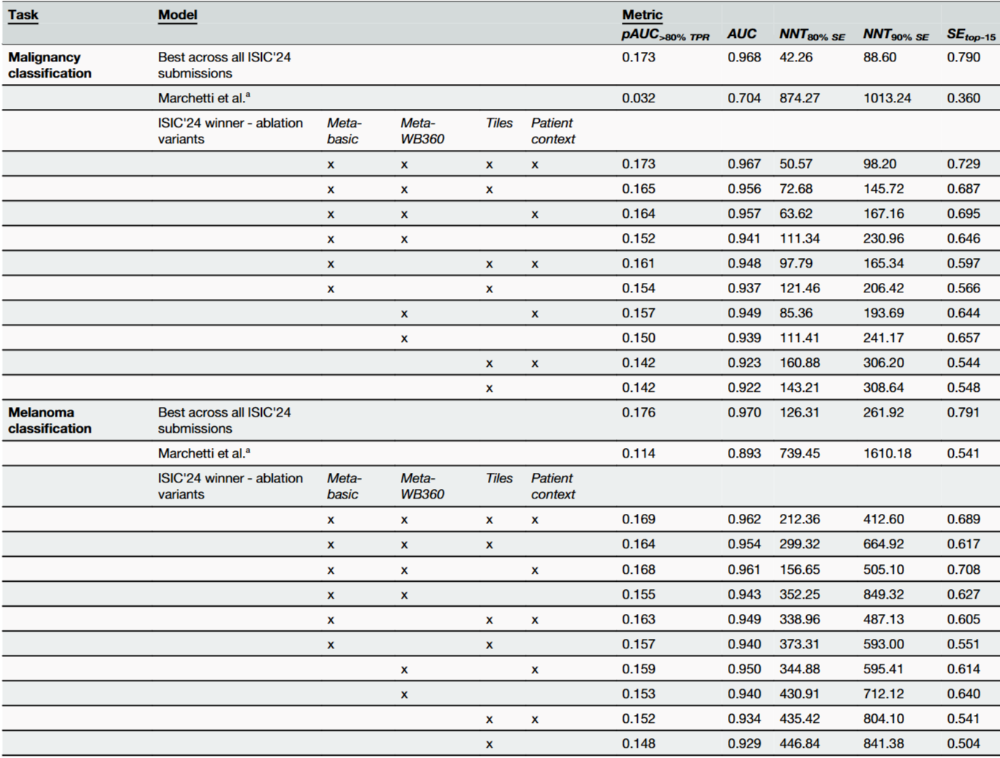
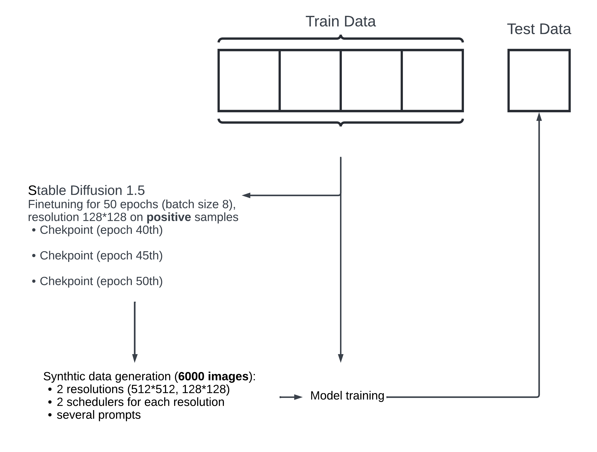

# Automated Triage of Cancer-Suspicious Skin Lesions with 3D Total-Body Photography

## 출처/링크

출처: npj Digital Medicine, 2025  
링크: https://www.nature.com/articles/s41746-025-02070-7
PDF: [`s41746-025-02070-7.pdf`](../paper/s41746-025-02070-7.pdf)

## 우리 연구에서의 위치

지표: ISIC 2024 challenge metric
ablation study: metadata/patient-context ablation
fusion: image score와 tabular feature late fusion
> **imbalance: stable diffusion 생성이미지 활용**

---

## 논문 요약

이 논문은 ISIC 2024 Kaggle Challenge의 공식 결과와 private leaderboard set 기반 분석을 정리한 논문이다. 3D-TBP lesion tile, basic metadata, WB360 appearance metadata, patient-context feature가 skin cancer triage 성능에 어떻게 기여하는지 winning solution과 ablation study로 보여준다.

## 주요 Figure

**Figure 2. Lesion risk scores stratified by patient**

patient-context, ugly duckling sign, 환자 내 outlier lesion 개념을 설명하는 데 가장 중요한 그림이다.
> - patient-context feature: 빨간 점이 boxplot 대비 얼마나 위에 있는지를 통해 ugly duckling sign 확인

**Figure 3. Association of lesion characteristics and ML-modelled risk**

WB360 metadata 중 어떤 feature가 모델 risk score와 관련되는지 보여준다. 
> - 양의 상관관계: 병변의 크기가 클수록, 색상 다양성과 비대칭성이 클수록 위험 
>   - Size: min diameter (최소 직경): 약 0.38
>   - Size: lesion area (병변 면적): 약 0.35
>   - Size: perimeter (병변 둘레): 약 0.35
>   - Color: variation (색상 다양성): 약 0.34
>   - Color: asymmetry (색상 비대칭성): 약 0.34
>   - Size: max diameter (최대 직경): 약 0.31
> - 음의 상관관계: 병변 내부/외부 색조가 높을수록 덜 위험. 병변이 주변보다 어두울수록(L* 감소), 노란기가 없으며(b* 감소) 푸른/회색조를 띌수록 위험
>   - Color: Hue inside lesion (병변 내부 색상의 색조): 약 -0.55
>   - Color: b* contrast (색상: b* 대비): 약 -0.47
>   - Color: Hue outside lesion (병변 외부 색상의 색조): 약 -0.31
>   - Color: b* inside lesion (병변 내부 색상의 b* 값): 약 -0.27
>   - Color: L* contrast (색상: L* 대비): 약 -0.23
> - **BORE(Bayesian initialization and Oracle Residual Estimation)** 고려

**Figure 4. Winning model diagram**

image-only model output과 metadata/patient-context feature를 boosting model로 결합한 late fusion 구조를 보여준다.

1. 입력: 병변 이미지(Tile Images) 와 메타데이터(Tabular Data)
2. 이미지 특징 추출
* 각 모델이 melanoma, BKL, nevus 등의 예측 확률을 생성함
* fold 평균, 환자 단위 정규화 등을 거쳐 **image-derived features** 만듦
3. 표 데이터 특징 생성
* tabular data는 범주형 특징과 수치형 특징으로 나눠 처리함
* feature engineering을 통해 기존 특징, 새 수치 특징, 범주형 특징을 확장함
* 환자 내부에서 특정 병변이 얼마나 튀는지 나타내는 **patient outlier factor** 도 생성함
4. GBT 기반 최종 예측
* 이미지 특징과 tabular 특징을 합쳐 CatBoost, XGBoost, LightGBM에 입력함
* 세 모델이 각각 melanoma risk를 예측함
* 즉, 최종 분류기는 딥러닝 모델이 아니라 GBT 계열 앙상블임
5. 최종 출력
* CatBoost, XGBoost, LightGBM 예측값을 rank 변환함
* rank 예측값들을 평균냄
* 최종적으로 병변별 **output risk score** 산출함

## Dataset 정보
- Dataset: ISIC 2024 Challenge dataset
- Task: malignant/benign binary classification
- Modality: 3D-TBP lesion tile + metadata + patient-context feature

## Imbalance 처리
- class 조절: binary target 유지, class 수 축소/재정의 없음
- 데이터 조작: 핵심 방법으로 oversampling/undersampling을 제안하지 않음

## Tabular model
- CatBoost, XGBoost, LightGBM 3개 GBT 모델 사용
- image-derived feature + tabular-derived feature를 같이 입력받는 최종 단계 모델임
- 출력들을 aggregate 해서 lesion risk estimate 함

## Image model
- EVA 모델: 외부 데르모스코피(dermoscopy) 데이터셋을 사용하여 사전 학습
- EdgeNext 모델 및 두 번째 EVA 모델: 이 두 모델은 ISIC'24 대회의 타일(tile) 이미지에만 국한하여 독립적으로 학습

## Fusion 방식
- image model ensemble의 neural network output vector와 metadata/patient-context feature를 결합한 뒤, 3개 그래디언트 부스팅 트리(Gradient Boosting Tree, GBT) 모델에 넣고 GBT output을 aggregate하는 late fusion 구조

## 평가 지표
- 우선순위 지표: `pAUC > 80% TPR`. `TPR >= 0.8`인 ROC 구간의 partial AUC이며, score range는 `[0, 0.2]`이다.
- 보조 지표: AUC.

## 평가 결과
- 우선순위 지표: `pAUC 0.1726/0.2`
- 보조 지표: full AUC `0.9668`
- ablation: patient-context 제외 시 AUC가 0.967에서 0.956으로 감소
- 추가 결과: WB360 appearance metadata-only 변형이 tile-only 변형보다 높은 AUC 기록: `0.939` vs `0.922`, `p=0.016`

## ISIC2024 multimodal 연구에 주는 시사점
- 핵심 해석: ISIC 2024 winning solution의 ablation에서 tile-only 변형보다 WB360 appearance metadata-only 변형의 성능이 높았음.
- 의미: 현재 사용된 vision branch가 표준화된 lesion tile에서 크기, 색, 경계, 대비 같은 외형 정보를 WB360 측정치만큼 효율적으로 추출하지 못했을 가능성.
- 주의: vision model 자체가 낮거나 무의미하다는 결론은 아님. image-only 변형도 WB360/patient-context를 사용할 수 없는 smartphone 또는 close-up clinical photo 설정에서는 강한 baseline 후보.
- 연구 설계: image-only, tabular-only, image + tabular late fusion, WB360 포함/제외, patient-context 포함/제외 ablation의 분리 보고 필요.
- 누수 관리: patient-context feature 사용 시 patient-level split, fold-local feature 계산

## 추가 논의/생각해볼 점
- patient-context feature는 강력하지만, patient-level split을 잘못 잡으면 leakage로 과대평가될 수 있다.
- [kaggle 1st solution](https://www.kaggle.com/competitions/isic-2024-challenge/writeups/ilya-novoselskiy-1st-place-solution) 에서는 stable diffusion 으로 합성 데이터를 생성하는데 대부분의 시간을 소요했고 더 나은 결과를 나타냈지만, 최종 앙상블을 개선하지 못해 최종 해법에 포함되지 못했음.

    - image-only augmentation으로 사용 추정
    -  유사 접근법 [Derm-T2IM](https://arxiv.org/html/2401.05159v1) 모델

---

[메인 문서로 돌아가기](../2026-05-12_isic2024_multimodal_literature_review.md#3-주요-논문별-상세-분석)
