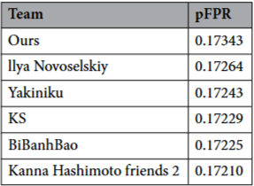

# Wang et al.: Explainable Multimodal AI for Skin Lesion Risk Prediction via 3D Imaging and Clinical Data

## 출처/링크

출처: Scientific Reports, 2025  
링크: https://www.nature.com/articles/s41598-025-33536-z  
PDF: [`s41598-025-33536-z-1.pdf`](../paper/s41598-025-33536-z-1.pdf)

## 우리 연구에서의 위치

fusion: 3D-TBP image-derived prediction vector와 clinical feature를 XGBoost로 결합하는 late fusion 
xAI: SHAP/CAM 기반 설명 가능성 설계의 근거

---

## 주요 Figure

**Figure 1. Explainable multimodal AI framework**

3D TBP 병변 이미지와 임상 메타데이터를 결합해 XGBoost로 병변 위험도를 예측하고, SHAP·CAM·Nomogram으로 예측 근거를 설명하는 멀티모달 XAI 프레임워크임.
> 1. 데이터 준비 (Data Preparation)
> - ISIC 2024 데이터셋을 사용했고, 총 1,075명 환자, 41개 clinical/lesion-specific feature를 분석 (ISIC 2024 dataset 의 subset 사용 추정)
> 2. 모델 만들기 (Model Development)
> - 영상만 쓰는 모델 (Image-only model):
>   - HAM10000 dermoscopic image로 CNN pre-training
>   - ISIC 2024 3D TBP image로 transfer learning
>   - 6개 피부 병변 class 분류
> - 임상 정보만 쓰는 모델 (Clinical model): 
>   - 모델들 중 XGBoost가 가장 좋은 성능 보였음
> - 영상 + 임상 정보 융합 모델 (Fusion):
>   - late fusion: concatenation + 표준화(Standardization)
> 3. 모델 성능 평가 및 설명 (Model Analysis)
> - 성능 평가 (Performance)
>   - Confusion Matrix:	병변 class별 오분류 패턴 확인
>   - ROC Curve: class별 분류 성능 확인
> - 설명 가능성 (Explanation)
>   - 노모그램: 어떤 정보가 예측에 얼마나 중요한지 시각적으로 보여주는 그래프입니다.
>   - SHAP 시각화: AI가 각 환자의 어떤 정보(특징) 때문에 그런 예측을 했는지 수치로 분석하여 보여줍니다.
>   - CAM: AI가 영상의 어느 부분을 보고 판단했는지 영상 위에 색깔로 표시해 줍니다.

**Figure 2. Multimodal fusion workflow**

CNN-derived six-class probability vector와 clinical feature vector를 결합해 XGBoost에 입력하는 **late fusion** 구조

**Figure 3. Performance and interpretability**

CNN에서 파생된 3D TBP 임베딩과 clinical metadata feature을 통합한 다중 모달 특징 세트는 5겹 교차 검증 하에서 6가지 피부 병변 범주를 분류하는 데 탁월한 성능을 보였음
가장 영향력 있는 예측 변수들은 비대칭성, 경계 불규칙성, 색소 침착 변화를 포함하여 확립된 피부과 진단 기준과 밀접하게 일치

## 목표와 기여
ISIC 2024 기반 3D-TBP image와 structured clinical/lesion feature를 결합해 6개 skin lesion type을 분류하고, SHAP, CAM, nomogram으로 모델 판단을 설명하는 explainable multimodal AI framework를 제안 
기존 ISIC 2024 competition 분석 논문이 leaderboard와 patient-context 효과를 강조했다면, 이 논문은 multimodal fusion 결과를 clinician-friendly scoring system과 XAI로 설명하는 데 초점
> 기존 저의 논문 방향과 유사

## Dataset 정보
- Dataset: 논문은 `ISIC 2024 dataset`이라고 표현하지만, 숫자와 label 구성상 Kaggle/SLICE-3D public train 전체가 아니라 선별된 subset 또는 재구성된 6-class subset으로 추정
- Patient 수: 1,075명
- Feature 수: 41 clinical 및 lesion-specific feature
- Class setting: 6-class lesion risk prediction
- Class 구성: invasive melanoma 157, basal cell carcinoma 163, squamous cell carcinoma 73, nevus 443, benign NOS 200, solar/actinic keratosis 39
- Modality: 3D TBP image + clinical/lesion metadata

### Dataset 해석 주의

- 공식 ISIC 2024 Kaggle/SLICE-3D train dataset은 401,059개 lesion tile과 binary malignant target을 제공하는 challenge dataset이다.
- Wang et al.의 6-class 구성은 총 1,075개 case로, Kaggle public train 전체 401,059개 lesion tile과 규모가 맞지 않는다.
- 특히 invasive melanoma 157 + basal cell carcinoma 163 + squamous cell carcinoma 73 = 393으로 공식 train의 malignant positive 수와 일치하지만, benign 쪽은 400,666개 전체가 아니라 nevus/benign NOS/solar-or-actinic keratosis 일부 682개만 사용한 형태이다.
- 따라서 이 논문은 ISIC 2024 전체 binary benchmark와 직접 동일한 데이터셋 실험이 아니라, ISIC 2024에서 granular diagnosis가 있는 일부 case를 6-class risk prediction으로 재구성한 related experiment로 해석하는 것이 안전하다.

## Imbalance 처리
- 불균형 정도: nevus 443개 vs solar/actinic keratosis 39개, 약 11.4:1
- class 조절: 6-class setting 유지
- 데이터 조작: nevus를 제외한 모든 lesion type에 targeted augmentation 적용
- augmentation 종류: random rotation, horizontal flip, color variation
- 이미지 데이터에 대해 데이터 증강 기법을 적용했지만, 논문에는 이 기법으로 전이학습을 진행했는지, tabular data 와 sample 로 사용했는지에 대한 정보는 없음

## Tabular model
- 여러 모델을 비교했을 때, XGBoost가 가장 정확하고 robust한 모델이었음.

## Image model
- image branch는 HAM10000으로 pretraining한 CNN을 3D-TBP image에 transfer learning한 구조
- CNN은 3개 convolutional block을 기반으로 하며, 3D-TBP fine-tuning을 위해 Conv2D layer 2개를 추가 

## Fusion 방식
- late fusion 구조: CNN이 만든 six-class probability vector를 structured visual feature로 사용하고, clinical feature vector와 concat 및 standardization 후 XGBoost classifier에 입력

## xAI
- SHAP으로 feature contribution을 설명
- CAM으로 image region contribution을 시각화
- 다항 로지스틱 회귀모델: VIF 로 다중 공선성이 높은 특징 제외한 후, 다항 로지스틱 회귀 모델로 6개 범주에 대해 점수 계산

## 평가 지표
- 우선순위 지표: multiclass AUC, recall, F1
- ISIC benchmark 지표: 6-class prediction을 benign/malignant로 collapse한 pFPR
- 설명 가능성 지표/도구: SHAP feature importance, CAM, nomogram, VIF

## 평가 결과
- Clinical-only XGBoost: overall accuracy `0.6837`, recall `0.4090`, F1 `0.4582`
- Clinical-only class result: BCC `78.6%`, nevus `72.6%`, melanoma invasive `43.8%`, actinic keratosis `12.5%`, SCC `16.7%`
- 3D-TBP image-only CNN: nevus `87.10%`, benign NOS `75.34%`, invasive melanoma `71.88%`, BCC `54.05%`, SCC `60.32%`, actinic/solar keratosis `65.62%`
- Multimodal fusion: class별 AUC `> 0.95`, nevus 및 actinic keratosis AUC `0.98`
- Multimodal fusion: recall 및 F1 score `> 95%`
- **ISIC 2024 binary benchmark: pFPR `0.17343`, top 5 team range `0.17210-0.17264`**

Table3. Comparison with the top 5 teams.

## ISIC2024 multimodal 연구에 주는 시사점
- late fusion이 unimodal model보다 강하다는 근거를 제공
- SHAP, CAM, nomogram을 통해 성능 결과를 설명 가능하게 제시하므로, 작성 할 논문에서 단순 pAUC 개선뿐 아니라 어떤 metadata와 image region이 malignant risk에 기여했는지 설명하는 XAI section의 핵심 선행연구

---

[메인 문서로 돌아가기](../2026-05-12_isic2024_multimodal_literature_review.md#3-주요-논문별-상세-분석)
