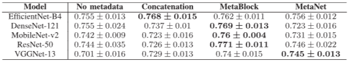
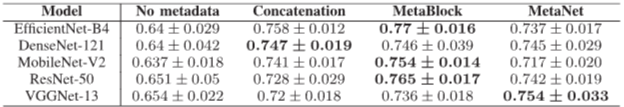

# MetaBlock: An Attention-Based Mechanism to Combine Images and Metadata

## 출처/링크

출처: IEEE Journal of Biomedical and Health Informatics, 2021  
링크: https://doi.org/10.1109/JBHI.2021.3062002
코드: https://github.com/paaatcha/MetaBlock
PDF: [`An_Attention-Based_Mechanism_to_Combine_Images_and_Metadata_in_Deep_Learning_Models_Applied_to_Skin_Cancer_Classification.pdf`](../paper/An_Attention-Based_Mechanism_to_Combine_Images_and_Metadata_in_Deep_Learning_Models_Applied_to_Skin_Cancer_Classification.pdf)

## 우리 연구에서의 위치

fusion: metadata가 image feature map을 modulation하는 중간 fusion 구조. 단순 concatenation을 넘어선 fusion baseline 후보

---

## 주요 Figure

**Figure 1. MetaBlock 핵심 개념도**

MetaBlock은 metadata가 image feature를 “가이드”하도록 만들어, 이미지 특징 중 분류에 더 중요한 feature map은 강조하고 덜 중요한 feature map은 약화하는 feature-level fusion 모듈임.


**Figure 2. MetaBlock 내부 구조**

MetaBlock은 metadata를 이용해 CNN feature map에 scale과 shift를 적용하고, tanh/sigmoid gate를 통해 중요한 이미지 feature는 통과시키고 덜 중요한 feature는 억제하는 구조임.

$$
\begin{aligned}
\tilde{x}_{\text{img}} &= \psi_{\text{img}}(x_{\text{img}}), \\
\tilde{x}_{\text{meta}} &= \psi_{\text{meta}}(x_{\text{meta}}), \\
f_b(\tilde{x}_{\text{meta}}) &= W_f^{T}\tilde{x}_{\text{meta}} + w_f^0, \\
g_b(\tilde{x}_{\text{meta}}) &= W_g^{T}\tilde{x}_{\text{meta}} + w_g^0, \\
T_{\text{gate}} &= \tanh\left(f_b(\tilde{x}_{\text{meta}}) \odot \tilde{x}_{\text{img}}\right), \\
S_{\text{gate}} &= \sigma\left(T_{\text{gate}} + g_b(\tilde{x}_{\text{meta}})\right), \\
\tilde{x} &= S_{\text{gate}}, \\
\hat{y} &= \operatorname{classifier}(\tilde{x})
\end{aligned}
$$

- `x_img_tilde`: CNN에서 추출한 last feature maps
- `x_meta_tilde`: metadata feature extractor가 만든 metadata feature
- `f_b`, `g_b`: metadata feature에서 modifier coefficient를 만드는 single-layer neural network
- `T_gate`: hyperbolic tangent gate
- `S_gate`: sigmoid gate이자 MetaBlock output feature
- `x_tilde`: `x_img_tilde`와 같은 shape를 유지하는 MetaBlock output


**Figure 3. CNN에 삽입된 MetaBlock layer**

metadata가 CNN의 feature map을 직접 조절하여, 이미지 특징 중 진단에 더 중요한 부분을 강조하게 만드는 feature-level fusion 구조임.


## 목표와 기여
skin lesion classification에서 image feature와 patient metadata를 단순 concat하지 않고, metadata feature가 CNN의 last feature maps를 scale/shift/gating하도록 하는 Metadata Processing Block(MetaBlock)을 제안

## Dataset 정보
- Dataset 1: PAD-UFES-20
- PAD-UFES-20 구성: 6-class clinical image + metadata
- Dataset 2: ISIC 2019
- ISIC 2019 구성: 8-class dermoscopy image + metadata

## Imbalance 처리
- 불균형 정도: PAD-UFES-20은 MEL 52개 vs BCC 845개, 약 16:1
- 불균형 정도: ISIC 2019는 DF 239개 vs NV 12,875개, 약 54:1
- class 조절: class 수 조절 없음
- 데이터 조작: common image augmentation 사용, 5-fold CV는 label frequency 기준 stratified
- common image augmentation : 수평 및 수직 뒤집기, 밝기, 대비, 채도 조정, 이미지 스케일링, 무작위 노이즈 
- 학습 조작: class frequency 기반 weighted cross-entropy 사용

## Tabular model
- metadata는 feature extractor 를 거쳐 MetaBlock 내부의 `f_b`와 `g_b` 에 사용되어, image feature map을 조절
- `f_b(x_meta_tilde)`: Scale 조절값 생성 (metadata를 이용해 image feature map을 곱셈으로 키우거나 줄임)
- `g_b(x_meta_tilde)`: Shift/bias 조절값 생성 (metadata를 이용해 feature map에 더해지는 보정값을 만듦)

## Image model
- CNN backbone: 피부 병변 이미지를 처리하여 특징을 추출
- 모델 평가를 위해 EfficientNet-B4, DenseNet-121, MobileNet-v2, ResNet-50, VGG-13 등 CNN backbone 사용

## Fusion 방식
- intermediate fusion: metadata가 CNN feature extraction 과정 중간에 개입해 중요한 visual feature를 강화

## 평가 지표
- 우선순위 지표: balanced accuracy(BACC)
- 의미: multiclass BACC는 class별 recall의 평균

```text
BACC = (recall_1 + recall_2 + ... + recall_K) / K
```

- binary case: `BACC = (Sensitivity + Specificity) / 2`

## 평가 결과
- 비교: CNN-only, concatenation, MetaNet과 비교했으며 10개 실험 중 6개에서 가장 좋은 BACC 보고
  - MetaNet: 메타데이터에 대한 1D 컨볼루션 시퀀스를 사용하여 생성한 계수를, CNN image feature에 곱해, 환자/임상 정보에 따라 이미지 특징의 중요도를 조절하는 곱셈 기반 feature-level fusion 방법임.
- ISIC 2019: MetaBlock은 5개 CNN 중 3개에서 최고 BACC를 보였고, Friedman/Wilcoxon test에서도 차이를 보고

- PAD-UFES-20: MetaBlock은 5개 CNN 중 3개에서 최고 BACC를 보였고, 평균적으로 metadata를 쓰지 않는 baseline보다 높은 성능을 보임
- 

## ISIC2024 multimodal 연구에 주는 시사점
"simple concat vs metadata modulation" 비교 실험의 근거로 적합

## 추가 논의/생각해볼 점
- MetaBlock은 불균형 자체를 해결하는 논문이라기보다 metadata-conditioned fusion 논문
- ISIC 2024처럼 1020:1 수준의 binary imbalance에서는 MetaBlock만으로는 부족
- ISIC 2024 적용 시 balanced sampler, focal/class-balanced loss, pAUC/AUPRC 평가를 함께 설계 필요

---

[메인 문서로 돌아가기](../2026-05-12_isic2024_multimodal_literature_review.md#3-주요-논문별-상세-분석)
