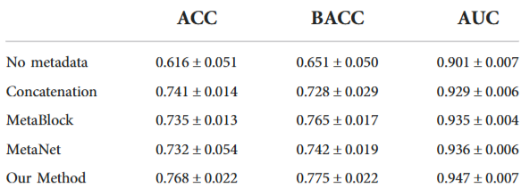

# MMF-Net: Deep Learning Based Multimodal Fusion Using Smartphone Images and Metadata

## 출처/링크

출처: Frontiers in Surgery, 2022  
링크: https://www.frontiersin.org/articles/10.3389/fsurg.2022.1029991/full
PDF: [`fsurg-09-1029991.pdf`](../paper/fsurg-09-1029991.pdf)

## 우리 연구에서의 위치

fusion: image branch와 metadata branch 사이의 self-attention 및 cross-attention fusion을 비교 대상으로 설계할 때 사용할 수 있는 선행 연구

---

## 주요 Figure

**Figure 1. Overall network architecture**

image와 metadata를 각각 CNN과 MLP로 feature화한 뒤, attention 기반 multimodal fusion module로 결합하여 6개 피부 병변 class를 예측하는 전체 구조

**Figure 2. Multimodal fusion module**

self-attention과 cross-attention을 이용해 image feature와 metadata feature를 양방향으로 결합하는 구조
- Intra-modality Self-Attention: image와 metadata를 서로 섞기 전에, 각자 내부에서 중요한 정보에 집중하고 덜 중요한 정보(예: 이미지의 배경)를 제거하는 필터 역할
- Inter-modality Cross-Attention:  image와 metadata가 서로를 참고해, 각 modality 안에서 분류에 더 중요한 feature를 강조하고 덜 중요한 feature를 억제하는 양방향 fusion 구조

## 목표와 기여
smartphone으로 수집된 clinical image와 metadata를 결합하여 skin lesion type을 분류하는 multimodal fusion network를 제안

## Dataset 정보
- Dataset: PAD-UFES-20
- Class setting: 6-class skin lesion classification
- Modality: smartphone clinical image + metadata
- Metadata: numeric/categorical metadata 제공

## Imbalance 처리
- class 조절: 6-class 설정 유지
- 데이터 조작: image augmentation 사용 (수평 및 수직 뒤집기, 색상 지터링, 가우시안 노이즈, 무작위 대비)
- split: stratified 5-fold cross-validation
- sampling: 명시적 oversampling/undersampling 없음

## Tabular model
- numeric feature: 그대로 사용
- categorical feature: one-hot encoding 후 MLP encoder를 통과해서 특징 추출

## Image model
- ResNet-50을 image encoder로 사용

## Fusion 방식
- Intra-modality Self-Attention: image와 metadata를 서로 섞기 전에, 각자 내부에서 중요한 정보에 집중하고 덜 중요한 정보(예: 이미지의 배경)를 제거하는 필터 역할
- Inter-modality Cross-Attention:  image와 metadata가 서로를 참고해, 각 modality 안에서 분류에 더 중요한 feature를 강조하고 덜 중요한 feature를 억제하는 양방향 fusion 구조

## 평가 지표
- 우선순위 지표: BACC, aggregated AUC
- BACC: sensitivity와 specificity의 산술평균으로 설명
- aggregated AUC: 6-class 문제에서 class pair별 AUC를 평균한 값

## 평가 결과
- BACC: `0.775 ± 0.022` (가장높은 결과)
- aggregated AUC: `0.947 ± 0.007` (가장높은 결과)
- ACC: `0.768 ± 0.022` (가장높은 결과)

  - [MetaBlock](3_4_metablock_metadata_modulation.md): 3_4_metablock_metadata_modulation.md
  - MetaNet: 메타데이터에 대한 1D 컨볼루션 시퀀스를 사용하여 생성한 계수를, CNN image feature에 곱해, 환자/임상 정보에 따라 이미지 특징의 중요도를 조절하는 곱셈 기반 feature-level fusion 방법임. 

## ISIC2024 multimodal 연구에 주는 시사점
- metadata 포함이 image-only보다 성능을 유의미하게 개선
- 양방향 크로스 어텐션은 두 양식이 서로를 보완하고 더 깊은 관계를 파악하도록 도와서, 단방향 방식보다 더 우수한 성능을 이끌어 냈음

## 추가 논의/생각해볼 점
- intra-modality self-attention 과 inter-modality cross-attention 에 대한 abaltion study 필요
- late fusion baseline과 비교해 cross-attention의 실제 pAUC 개선폭을 검증해야 함

---

[메인 문서로 돌아가기](../2026-05-12_isic2024_multimodal_literature_review.md#3-주요-논문별-상세-분석)
