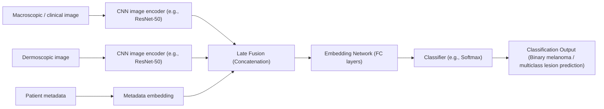
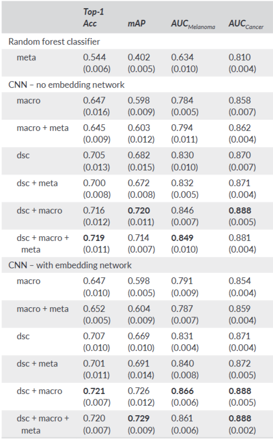

# Yap et al.: Multimodal Skin Lesion Classification Using Deep Learning

## 출처/링크

출처: Experimental Dermatology, 2018  
링크: https://doi.org/10.1111/exd.13777
PDF: [`Experimental Dermatology - 2018 - Yap - Multimodal skin lesion classification using deep learning.pdf`](../paper/Experimental%20Dermatology%20-%202018%20-%20Yap%20-%20Multimodal%20skin%20lesion%20classification%20using%20deep%20learning.pdf)

## 우리 연구에서의 위치

dermoscopy, clinical image, patient metadata 결합이 image-only보다 나은 성능을 보인 초기 multimodal skin lesion classification 근거

---

## 주요 Figure

**Figure 1. Diagram of network architecture for multimodal
classification**

dermoscopy 이미지, 일반 임상 이미지, metadata를 각각 feature로 추출한 뒤 concatenate하여 FC layer와 softmax로 5개 피부 병변을 분류하는 late-fusion 멀티모달 모델 구조임.

**Figure 2. melanoma vs non-melanoma 구분 ROC curve**

흑색종 탐지에서 일반 임상 이미지보다 dermoscopy가 더 강력하고, dermoscopy와 macro image를 함께 쓰는 조합이 가장 좋은 melanoma ROC 성능을 보였다는 것을 보여줌.

**Figure 3. melanoma vs non-melanoma 구분 ROC curve**

흑색종 탐지에서 일반 임상 이미지보다 dermoscopy가 더 강력하고, dermoscopy와 macro image를 함께 쓰는 조합이 가장 좋은 melanoma ROC 성능을 보였다는 것을 보여줌.

**자체 Figure. Multiple image modalities + metadata fusion**

핵심 해석:

- 일 macroscopic image만 사용하는 것보다 진단용 확대경(dermoscopy) 이미지와 일반 확대(macroscopic) 이미지를 함께 사용했을 때 성능이 향상되었으며, 환자 메타데이터를 추가하면 더욱 개선될 수 있음을 보여줌.
- 본 논문은 여러 소스(진단용 확대경 이미지, 일반 확대 이미지, 환자 메타데이터)의 정보를 결합하는 것이 단일 이미지 기반 방법론보다 성능이 우수하다는 점을 입증하는 선행 근거

## 목표와 기여
- 단일 macroscopic image만을 활용하는 기존 방식에서 벗어나, 진단용 확대경 이미지, 일반 확대 이미지, 그리고 환자 메타데이터를 통합하는 다중 양식(multimodal) 분류기를 제안하고 그 성능을 평가함.

## Dataset 정보
- Dataset: 자체 수집한 dataset
- Sample 수: 2917 cases
- Modality:  진단용 확대경 이미지, 일반 확대 이미지, 환자 메타데이터
- Task: binary melanoma detection(이진 분류(흑색종 vs 비흑색종)), 5-class classification

## Imbalance 처리
- class 조절: binary task와 5-class task를 별도 평가
- 데이터 조작: imbalance-specific sampling은 핵심 기여로 보고되지 않음
- 학습 조작: imbalance-specific loss는 핵심 기여로 보고되지 않음
- 평가 기반 대응: AUC, mAP 중심 평가

## Tabular model
- 메타데이터 처리 과정을 상세히 설명하고 있지는 않지만, 일반적으로는 범주형 변수(성별, 위치 등)는 원-핫 인코딩(one-hot encoding) 등을 거치거나, 수치형 변수(나이)와 함께 벡터화

## Image model
- ResNet-50 아키텍처를 기반으로 이미지 특징 추출
- ResNet-50 모델들의 초기 가중치는 전이 학습(Transfer Learning)을 통해 초기화 (ImageNet(ILSVRC 2015) 데이터셋 가중치 사용)
- 
## Fusion 방식
- 개별적으로 추출된 이미지 특징 벡터(예: 2048차원) 와 준비된 메타데이터 특징 벡터가 연결(concatenated)하여 "임베딩 네트워크" 에 입력
- 임베딩 네트워크: 두 개의 1024차원 완전 연결(fully connected) 계층과 ReLU 활성화 함수

## 평가 지표
- 우선순위 지표: binary melanoma detection의 AUC
- 우선순위 지표: multiclass classification의 mAP
- mAP: class별 precision-recall curve의 average precision을 계산한 뒤 평균한 값

## 평가 결과
- Binary melanoma detection: multimodal classifier `AUC 0.866`
- Binary baseline: single macroscopic image `AUC 0.784`
- Multiclass classification: multimodal classifier `mAP 0.729`
- Multiclass baseline: `mAP 0.598`

## ISIC2024 multimodal 연구에 주는 시사점
피부 병변 진단에서 image + metadata 결합이 image-only보다 우수하다는 초기 근거 논문

## 추가 논의/생각해볼 점
> - source 여러 개로 성능향상이 가능할까? stable diffusion 생성이미지를 source 로 함께 사용하면 성능향상이 될까?
 
---

[메인 문서로 돌아가기](../2026-05-12_isic2024_multimodal_literature_review.md#3-주요-논문별-상세-분석)
