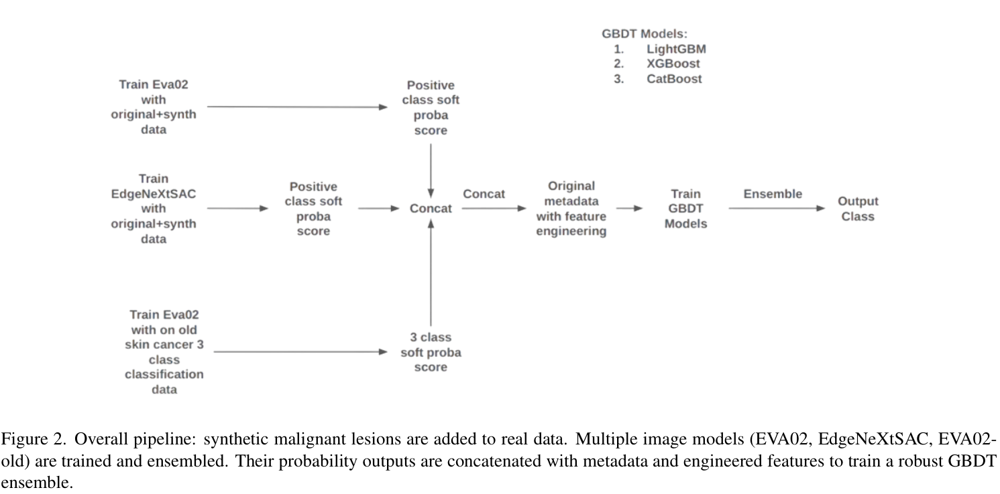
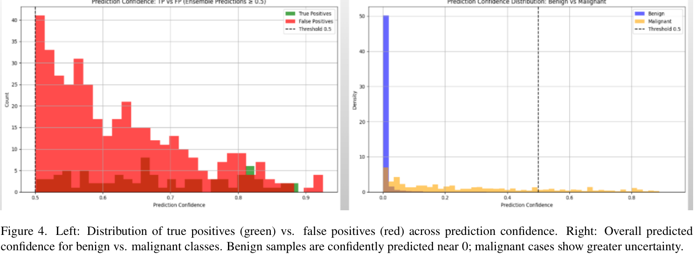
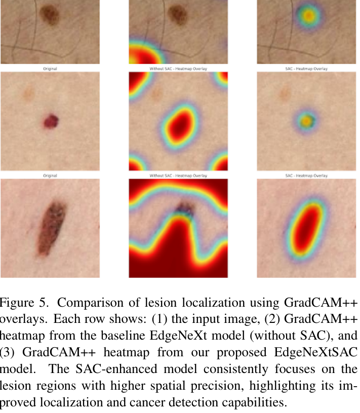

# ISIC 2024 비더모스코피 3D-TBP 이미지 기반 Segmentation-Assisted Classification + GBDT 하이브리드 앙상블

- 원문 PDF: `2506.03420v1.pdf`
- 구성 원칙: PDF 원문을 논문 섹션 구조에 맞춰 재배치하고, 수식은 LaTeX로 별도 복원했다.

노스 텍사스의 무함마드 주바이르 하산대학

주베라하산@my.unt.edu

arXiv:2506.03420v1[eess.IV] 3 Jun 2025

## 초록

피부암은 전 세계적으로 가장 흔하고 생명을 위협하는 질병 중 하나이며, 이 작업은 3D 총 신체 사진(TBP)으로부터 추출된 401,059개의 크롭된 병변 이미지를 포함하는 ISIC 2024의 SLICE-3D 데이터세트를 사용하여 악성 및 양성 피부 병변을 분류하기 위한 하이브리드 기계

클래스 불균형을 해결하고 일반화를 개선하기 위해, 우리는 안정적인 확산 생성 합성 병변으로 악성 사례를 증강하고 평가 메트릭으로서 80% 참 양성 비율(TPR) 이상의 부분 AUC(pAUC)를 사용하여 모든 구성 중 가장 높은 0.1755의 pAUC를 달성한다. 이러한 결과는 원격

## 서론

ISIC 2024의 엔지니어링된 메타데이터 및 합성 병변이 있는 피부 암 검출을 위한 세그멘테이션-보조 분류 및 GBDT의 하이브리드 앙상블 비-모스코픽 3D-TBP 이미지

노스 텍사스의 파미다 야스민 리파트 대학교

파미다야스민리파트@my.unt.edu

소비되지만 특히 미묘하거나 비정형적인 프레젠테이션을 포함하는 경우[5, 20] 임상 판단의 변동성이 있다. 이러한 한계는 증가하는 환자 부하와 결합되어 자동화 및 보조 진단 시스템의 개발에 힘을 실어왔다.

더 깊은 특징 학습 및 공간 모델링을 해결하기 위해, 주의 메커니즘 및 캡슐 네트워크가 CNN 파이프라인[2, 12]에 통합되었다. 또한, 연구자들은 다양한 이미징 프로토콜 및 피부 톤 다양성으로 인한 데이터세트 이동에 대응하기 위해 도메인 적응[18] 및 비지도 대비 학습[4

병변 유형 간의 유사성과 이질적인 집단에 걸친 일반화 가능성의 결여[9]. 설명 가능한 AI(XAI) 기술의 개발은 또한 임상의의 신뢰를 높이고 책임 있는 임상 통합을 보장하는 데 매우 중요하다. 본 연구에서 우리의 기여는 다음과 같다.

본 발명은 이미지 기반 모델에 대한 암 검출에서 병변 경계 검출을 강화하고 전반적인 정확도를 향상시키기 위한 세그먼테이션 보조 분류 전략을 소개한다. 본 발명의 주요 기여는 그래프트 부스팅 결정 트리(GBDT)와 이미지 기반 딥러닝 모델(예: EVA02, EdgeNeXt

본 발명은 외부 및 합성 데이터 증강을 활용하여, 제한된 양성 예하에서 등급 불균형을 완화하고 일반화를 개선한다. 또한, 본 발명에서는 표준화된 진단 매핑을 사용하여 외부 데이터셋을 단순화된 3등급 셋업(모반, 흑색종, bkl)으로 라벨링

## 데이터셋

메타데이터는 환자 인구통계학, 병변 진단 정보, 병소 위치, 병소의 크기 & 기하, 병동의 모양 & 대칭, 병소가 위치 좌표 및 병소 색 정보와 같이 분류된 다양한 유형의 정보를 캡처한다. 데이터 세트는 여러 유형으로 구조화된다. 각 유형은

주요 구성 요소: • SLICE-3D 데이터세트: 진단 악성 주석을 포함한 3D TBP로부터의 크롭된 병변 이미지의 완전한 수집. • 이미지 및 메타데이터: 메타데이터를 갖는 이미지의 레이블링된 서브세트: 원본 데이터세트에 내재된 심각한 등급 불균형을 해결하기 위해

데이터 세트를 예시하기 위해, 우리는 훈련에 사용되는 피부 병변 이미지의 샘플 시각화를 제시한다. 다음 그림은 데이터 세트로부터의 예를 보여준다:

그림 1. SLICE-3D 데이터 세트의 샘플 이미지. 이러한 크롭 병변 이미지는 비피부경 조건을 모방하여 3D TBP에서 추출된다.

> 그림 내부 텍스트 번역:
> - OCR로 분리 가능한 텍스트가 없거나 그림이 순수 이미지로 판독되었다.

## 우리의 접근 방식

피부 병변 분류에 대한 우리의 접근 방식은 특히 불균형 및 실제 시나리오에서 강건성과 일반화를 향상시키기 위해 원시 이미지, 수공예 특징 및 외부 모델 예측과 같은 여러 수준의 정보를 통합한다. 전체 파이프라인은 그림 2에 요약되어 있다.

## 이미지 기반 분류

우리는 소프트 예측을 생성하기 위해 두 개의 컨볼루션 아키텍처를 훈련시킨다: EVA02[6] 및 우리의 에지NeXt[14]는 에지의NeX tSAC에 영감을 주었다.

EVA02. 우리는 피부 병변 분류를 위한 고용량 이미지 인코더로서 EVA2-소형 비전 변환기 아키텍처를 사용한다. 이미지넷22k에서 사전 훈련되고 이미지넷-1k에서 미세 조정된 이 모델은 양성 및 비양성을 구별하는 이진 분류 작업에 추가로 적응되었다.

그림 2. 전체 파이프라인: 합성 악성 병변이 실제 데이터에 추가된다. 다중 이미지 모델(EVA02, EdgeNeXtSAC, EVA02old)이 훈련되고 앙상블된다. 이들의 확률 출력은 메타데이터 및 엔지니어링된 특징과 연결되어 견고한 GBDT 앙상블을 훈련한다

> 그림 내부 텍스트 번역:
> - OCR로 분리 가능한 텍스트가 없거나 그림이 순수 이미지로 판독되었다.

그림 3. 세그멘테이션-보조 분류 아키텍처(EdgeNeXtSAC). 백본 (EdgeNXt)은 다중 스케일 피처들을 주목(CBAM)을 갖는 경량 디코더 블록으로 공급합니다. BCE 및 Dice 손실 모두 병변

> 그림 내부 텍스트 번역:
> - OCR로 분리 가능한 텍스트가 없거나 그림이 순수 이미지로 판독되었다.

환자 간 강력한 평가를 보장하고 악성 병변 및 악성 병변을 방지하기 위해 3중 계층화 그룹 K-폴드 교차 검증 전략을 사용한다. 각 접힘은 훈련과 검증 세트 사이의 환자 수준 분리 파티션을 시행하면서 악성 등급 비율을 보존한다. 이 설정은 동일한 환자의 이미지가 훈련 및 검증 접힘 모두에서

샘플링 전략은 각각의 트레이닝 배치가 균형 잡힌 수의 양성 및 음성 샘플을 포함하도록 보장하여 악성 병변에 대한 보다 안정적인 수렴 및 향상된 민감도를 가능하게 한다. 모델은 과적합을 피하기 위해 검증 성능에 기초하여 조기 중단과 함께 이진 교차 엔트로피 손실 함수를 사용하여 트레이닝되었다.

이진 분류기 외에도 이전 ISIC 대회에서 큐레이팅된 외부 데이터를 사용하여 3분류 분류기(흑색종/모반/각화세포 병변)로 두 번째 EVA02 모델을 훈련했다. 일관성을 보장하고 라벨 노이즈를 줄이기 위해 원래 진단 라벨을 임상적으로 의미 있는 세 가지 범주로 재

원래 데이터 세트의 심각한 클래스 불균형을 완화하기 위해 양성 샘플과 악성 샘플 사이의 1:1 샘플링 비율을 사용하여 훈련 배치가 형성되었다. 이러한 과잉 샘플링은 양성 샘플의 샘플링 비율에 기초하여, 양성 샘플에 대한 양성 샘플링의 비율보다 더 낮은 샘플링 비율이다.

표 1. GBDT 모델에서 사용하는 그룹을 특징으로 한다.

특징 그룹 카운트 예시 특징 특징

원숫자 34 clin 크기의 긴 디암 mm, tbp lv H 원 범주형 (1hot) 6 성, 해부학적 부위 일반 원-핫 범주형 47개의 특징.

공학적 특징 43 병변 형상 지수, 경계 복잡도 환자 정규화 특징 76 tbp lv H 환자 규범, 병변 크기 비율 환자 규범 환자-집합 메트릭 환자당 3 카운트, tbplv 영역MM2 bp 외부 모델 예측 5 예측 eva, 예측 ed

총 214 -

흑색종 클래스에 서명된 반면 모반으로 표시된 것은 모반 클래스에 유지된다. 기저 세포 암종, 지루성 각화증, 태양 흑색 및 흑색 NOS를 포함한 케라티노사이트 관련 병변은 또한 통합된 bkl(양성 각질 세포 병변)

이 리라벨링 전략은 다중-라벨 진단 공간을 임상 기대와 정렬된 의미론적 의미 있는 범주로 통합한다. 또한 이진 트레이닝에서 다르게 과소 표시되는 경계선 병변에 대한 중간 진단 신호를 제공한다. EVA02의 두 버전(이진 및 3분류 분류기)은

두 모델 모두에 의해 출력된 소프트 클래스 확률은 각 병변에 대해 추출되었고 후속적으로 GBDT 앙상블에 대한 입력 특징으로 포함되었다. 이 설계는 다운스트림 표형 모델이 강력한 비전 변환기로부터 학습된 높은 수준의 시각적 단서를 통합하여 보다 정보 풍부하고 판별적인 병변 분류에 기여할 수

에지NeXtSAC. 병변 국소화를 강화하고 분류 성능을 향상시키기 위해, 우리는 이중-헤드 프레임워크로 에지에네Xt 아키텍처를 확장함으로써 세그멘테이션-보조 분류기(EdgeNeX tSAC)를 설계했다. 전체 아키텍

각 디코더 블록(그림 3 참조)은 2×업샘플에 이어 3×3 컨볼루션, 배치 정규화 및 ReLU 활성화의 동작 시퀀스를 사용하여 입력의 공간 해상도를 두 배로 증가시키는 업샘플링 모듈로 시작한다. 이 후 스킵-연결 융합

$$
L_{\mathrm{total}}=L_{\mathrm{cls}}+L_{\mathrm{cam}}+L_{\mathrm{seg}}\tag{4}
$$

$$
L_{\mathrm{cls}}=-\left[y\log(\hat{y})+(1-y)\log(1-\hat{y})\right]\tag{1}
$$

y 0, 1는 진정한 클래스 라벨이고 y는 병변이 악성일 예측 확률이다. 2. CAM 손실(Dice): 분류 헤드로부터 클래스 활성화 맵(CAM)을 접지-진실 분할 마스크와 정렬시키는 약하게 지도되는 분할 손실: C

Lcam = 1  2 P 맥암 · Mgt P 맥 암 + P Mg t +  (2)

여기서 맥암은 정규화된 CAM이고 Mgt는 이진 CAM이다.

접지-트러스 마스크. 이것은 분류 네트워크가 관련 병변 영역을 통해 활성화되도록 장려한다. 3. 세그멘테이션 로스(BCE + Dice): 최종 세그먼테이션 출력은 픽셀-wise 이진 크로스 엔트로피와 Dice 로스를 조합하는 복합 로스를 사용하여 감독된다.

$$
L_{\mathrm{seg}}=L_{\mathrm{mask}}^{\mathrm{BCE}}+L_{\mathrm{mask}}^{\mathrm{Dice}}\tag{3}
$$

4. 총 손실: 3개의 손실을 합산하여 전체 훈련 목표를 구성한다.

$$
L_{\mathrm{cam}}=1-\frac{2\sum M_{\mathrm{cam}}\cdot M_{\mathrm{gt}}}{\sum M_{\mathrm{cam}}+\sum M_{\mathrm{gt}}+\epsilon}\tag{2}
$$

## 특징 공학

메타데이터의 표현력을 향상시키고 분류 성능을 향상시키기 위해, 우리는 174개의 풍부한 조작된 특징 세트를 가진 오리지널 메타데이터를 확장하여, 이미지 데이터에 대해 훈련된 딥 러닝 모델의 통찰력을 통합하는 동시에 병변 레벨 정보 및 더 넓은 환자 레벨 컨텍스트를 캡처하도록 설계되었다. 먼저, 우리는 병

다음으로, 대상 간 변동성을 완화하고 병변 비교를 표준화하기 위해, 우리는 각 환자에 걸쳐 병변 크기 또는 색조와 같은 값을 취합한 다음 개별 병변에 대한 상대적 편차를 계산함으로써 환자-정규화된 특징을 계산했다. 이 접근법은 또한 특정 환자에 대해 비정형인 병

메타데이터로부터 도출된 조작된 특징 외에도, 우리는 이미지 기반 딥 러닝 모델(EVA02 및 EdgeNeXt-SAC)로부터의 예측을 GBDT 모델에 대한 입력 특징으로 내장했다. 이러한 정형 및 비정형 데이터의 융합은, 이미지 기반 딥러닝 모델들에서의 예측

학습된 시각적 표현을 풍부하게 하기 위해 표준화된 진단 매핑으로 외부 데이터세트에 훈련된 3분류 분류기(모반/흑색종/bkl)를 사용했다. 이 출력은 병변 특성화에 대한 추가적인 관점을 제공하여 경계선 사례에 대한 모델 민감도를 향상시킨다. GB

## 그래디언트 부스팅 결정 트리(GBDT)

컨볼루션 신경망(CNN)이 병변 이미지에서 공간 단서를 효과적으로 포착하는 동안, 우리는 해석 가능성과 확률적 교정을 향상시키기 위해 풍부한 조작된 특징 세트로 훈련된 그레이디언트 부스팅된 결정 트리(GBDT) 모델(LightGBM, XGBoost, CatBoost

## 평가 지표

제안된 모델의 성능은 80% 참 양성률(TPR) 이상의 ROC 곡선 아래 부분 영역(pAUC)을 사용하여 평가된다. 이 메트릭은 높은 민감도가 중요한 ROC 커브의 임상적으로 관련된 영역에 초점을 맞추도록 특별히 설계되었다.

### Receiver Operating Characteristic (ROC)
Curve

ROC 곡선은 다양한 분류 임계값들에서 참 양성률(TPR)과 거짓 양성율(FPR) 사이의 트레이드 오프를 예시한다. 분류기의 성능은 일반적으로 ROC 커브(AUC) 아래의 영역을 사용하여 요약되며, 여기서 더 높은 값은 더 나은 구별을 나타낸다

악성 병변과 양성 병변 사이에 있다.

## 80% TPR 이상 부분 AUC

전체 ROC 곡선을 고려하는 전통적인 AUC와 달리, ISIC 2024 대회는 TPR이 80% 이상인 영역에서 부분 AUC(pAUC)에 초점을 맞춘다. 이것은 악성 병변을 놓치면 심각한 결과를 초래할 수 있는 의료 적용에 중요한 높은 민감도를 모델이 우선시하는 것을 보장한다. pAUC는

$$
\mathrm{pAUC}=\int_{0.8}^{1.0}\mathrm{ROC}(t)\,dt\tag{5}
$$

### ROC(t) dt
(5)

여기서 ROC(t)는 ROC 곡선 함수를 나타내고 적분은 80% 이상의 TPR 값에 해당하는 FPR 범위에 걸쳐 계산된다.

## 점수 범위

pAUC 점수는 [0.0, 0.2]의 범위로 정규화되며, 여기서 더 높은 값은 임상적으로 관련된 고감도 영역에서 더 나은 모델 성능을 나타낸다.

## 임상적 관련성

이 평가 메트릭은 높은 진정한 양성률이 조기 암 검출에 필수적인 실제 진단 요구와 일치한다. 고감도 영역에서의 성능을 강조함으로써, 이 메트릭이 원격 의료 및 비전문 환경에서의 트리징 애플리케이션에 적합한 모델의 개발을 장려한다.

4. 실험결과 및 결과

우리는 여러 구성 하에서 제안된 파이프라인을 평가하고 부분 AUC(pAUC), 모델 앙상블, 해석 가능성 도구 및 세그먼테이션 지원 시각화를 사용하여 결과를 분해한다.

## 모델 성능과 앙상블 향상

표 2는 합성 증강이 있거나 없는 개별 이미지 기반 분류기 및 그 앙상블의 부분 AUC(pAUC) 점수를 제시한다. EVA02 변압기 기반 모델은 오리지널 데이터에만 훈련될 때 pAUC를 0.1516으로 크게 증가시킨다. 그러나, 합성적으로 생성된 악성 병변을

합성 악성 샘플이 포함될 때 0.1576에 도달한다. 이것은 분할 보조 학습이 모델이 임계 병변 영역을 더 효과적으로 국소화하는 데 도움이 되고 합성 데이터가 국경선 또는 과소 표시된 악성 사례에서 더 잘 일반화하도록 결정 경계를 확장한다는 것을 확인한다.

표 2. 합성 데이터 유무에 따른 이미지 모델의 성능(pAUC).

모델 pAUC

EVA02(실제만) 0.1516 EVA2+신분 0.1633 에지NeXt(실제에서만) 0.1401 에이지NeX tSAC(실제에만) 0.1439 에지의NeXTSAC+신분의 0.1576 에

표 3. 특징 공학 및 이미지 모델 융합 유무 GBDT 앙상블 성능.

구성 pAUC

GBDT 앙상블 (원) 0.1500 + 피처 엔지니어링 0.1644 + 이미지 모델 확률 0.1755+

## 예측 신뢰도 분석

그림 4는 양성 대 악성 병변에 대한 앙상블 모델의 예측 신뢰도에 대한 2 부분 분석을 제공한다. 왼쪽 패널에서, 우리는 예측 점수 0.5를 조건으로 하여 예측 신뢰도 범위에 걸쳐 진정 양성(TP)과 거짓 양성(FP)이 어떻게 분포하는지를 조사한다. 이것은 모델이 악성을 예측

> 그림 내부 텍스트 번역:
> - OCR로 분리 가능한 텍스트가 없거나 그림이 순수 이미지로 판독되었다.

그림 4. 왼쪽: 예측 신뢰도에 걸친 참 양성(녹색) 대 거짓 양성(붉은색)의 분포. 오른쪽: 양성 대 악성 클래스에 대한 전체 예측 신뢰도. 양성 샘플은 0 근처에서 자신 있게 예측되며 악성 사례는 더 큰 불확실성을 보여준다.

> 그림 내부 텍스트 번역:
> - OCR로 분리 가능한 텍스트가 없거나 그림이 순수 이미지로 판독되었다.

0.5에서의 결정 임계값. 이 패턴은 대부분의 분류 오류가 낮은 신뢰도 영역에서 발생한다는 것을 나타내며, 이는 높은 신뢰도에서의 희박한 수의 FP는 모델이 강한 확실성으로 양성 병변을 거의 잘못 분류할 수 있는 "소프트 오류"임을 더욱 강화시킨다. 오른쪽 패널은 양성 및 악성

그러나 악성 예측(오렌지)은 악성 병변을 검출하는 것의 모호성과 어려움을 반영하여 0에서 1까지의 완전 신뢰 범위에 걸쳐 더 균일하게 확산된다. 많은 악성 샘플은 판정 임계값 0.5 미만의 신뢰도로 예측되어 일부 거짓 음성을 설명한다. 악성 사례의 일부만 높은 신뢰도

## 분할 보조 분류 시각화

그림 5는 GradCAM++ 어텐션 오버레이를 사용하여 기준선 에지NeXt 모델과 제안된 EADNXtSAC 모델 사이의 시각적 비교를 제시한다. 각 행은 원래의 입력 이미지를 표시하고, 이어서 바닐라 에이지Next 모델에서

> 그림 내부 텍스트 번역:
> - OCR로 분리 가능한 텍스트가 없거나 그림이 순수 이미지로 판독되었다.

그림 5. GradCAM++ 오버레이를 사용하여 병변 국소화를 비교한다. 각 행은 (1) 입력 이미지, (2) 기준 에지NeXt 모델 (SAC 없는)의 Grad CAM++ 히트맵, (3) 제안된 EADNXtSAC 모델의 Grad

## 오류 분석: 어려운 오분류 사례

그림 6은 분할 보조 분류기(EdgeNeXtSAC)에 의한 거짓 양성(FP) 및 거짓 음성(FN) 예측의 대표적인 예와 그에 상응하는 주의 오버레이를 보여준다. 왼쪽 패널에서 양성 병변이 악성으로 잘못 분류된 3개의 거짓 양성 사례를 조사한다.

분류기를 오도하는 악성 패턴과 유사한 불규칙한 경계, 어두운 색소 침착 또는 구조적 복잡성이 여러 개의 작은 모반의 존재가 모델을 혼동한 것으로 보이며, 이는 중앙 병변에 높은 주의를 부여하고 실수로 악성 점수를 상승시킨다. 오른쪽 패널에서, 우리는 악성 병변이 양성으로 해석되는 크러스트

일부 경우, 모델이 병변을 정확하게 국부화(SAC 오버레이에서 볼 수 있듯이)하지만, 낮은 콘트라스트 및 불분명한 특징은 특히 그러한 패턴이 훈련 데이터에 과소 표현될 때, 미묘한 악성 종양을 검출하는 어려움을 더욱 강화시킨다. 하나의 이미지에서, 병변은 인간 눈에

그림 6. 실패 사례: 병변을 국소화함에도 불구하고 모델은 악성 종양을 과대 예측하고 2차 병변을 놓치는 경우이다. 이것은 다중 병변 프레임과 시각적으로 기만적인 양성 샘플을 다루는 데 있어 한계를 보여준다.

## 특징 중요도

모든 GBDT 모델에 걸친 평균 특징 중요도의 분석은 상위 예측 변수 중 몇 개가 우리의 특징 공학 전략의 효과를 검증하는 우리의 공학화된 특징 세트로부터 유래한다는 것을 보여준다. 특히, 특징 공학 전략과 같은 특징들은 특징 공학에 의해 생성된 특징들의 특성들의 특성들에 기초한다. 특징 공학

전반적으로 최고 기여자들 사이에서 조작된 특징과 교차 모달 특징의 우위는 통합된 앙상블 프레임워크에서 구조화된 사전과 학습된 표상을 결합하는 가치를 긍정한다.

## 결론

## 참고문헌

본 발명은 다등급 피부 병변의 진단을 위한 경량 사전 훈련된 컨볼루션 신경망에 관한 것이다. 진단, 13(3):385, 2023. 1[2] K. 베하라, E. 브헤로, J. T. 에이제. 활성 윤곽을 갖는 하이브리드 접근법

광안워, 파하드 샤바즈 칸. 흑색종 검출의 발전: 2022년 모바일 비전 애플리케이션을 위한 효율적인 변환기 아키텍처에 대한 포괄적인 검토. 1[16] 엔사프 후세인 모하메드와 웨삼 H. 엘-베이디. 딥 컨볼루션 네트워크를 이용한 향상된

가르크 아-데-라 푸엔테, 미겔 로페즈-페레즈, 라 에티티아 라우네, 발레리 나란조. 비지도 암 검출을 위한 도메인 적응증. 메디컬 이미지 컴퓨팅 및 컴퓨터 보조 개입 - MICCAI 2024, 페이지

1 [21] 무하마드 타히르, 아델 나임, 하룬 말리크, 주니어 탄베어, 루미나 A 나크비, 이상웅. Dscc 넷: 피부경 영상을 이용한 피부암 진단용 다중 분류 딥러닝 모델. 1 [22] 암 15

뱀 모델 및 경량 주의 유도 캡슐 네트워크. 진단(Basel, 스위스), 14(6:636, 2024. 1[4] 로코 델 아모르, 아드리안 콜로머, 산드라 모랄레스, 크리스티안 풀가르-오스피나, 리리아 테라

디지털 헬스, 9: 20552076237197, 2023. 1[6] 유신 팡,  선, 싱강 왕, 티준 황, 사프란, 및 D. 체. 멀티리수넷: 멀티모달 생체의학 이미지 세그먼트화를 위한 u-

본 발명은 정확한 피부암 인식 및 모바일 적용을 위한 딥 러닝 방법에 관한 것이다. 본 발명의 실시예에 따른 전자 제품 11(9:1294)은 니컬러스 쿠르탄스키, 브라이언 M. 데스앙드로, 마우라 E. 세르미나라, 라파엘 가르시아, 파

본 발명은 피부암 검출을 위해 3d tbp로부터 추출된 40만 개의 피부 병변 이미지 작물을 포함하는 슬라이스-3d 데이터세트에 관한 것이다. 본 발명의 일 실시예에 따른 캡슐 네트워크에 기초한 신규한 피부암 진단 방법은 cbam. 2023. 1[13]
