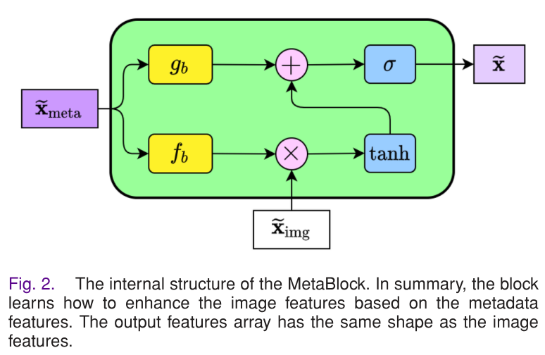
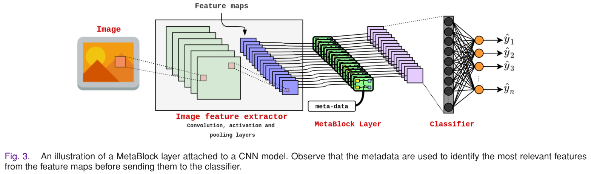
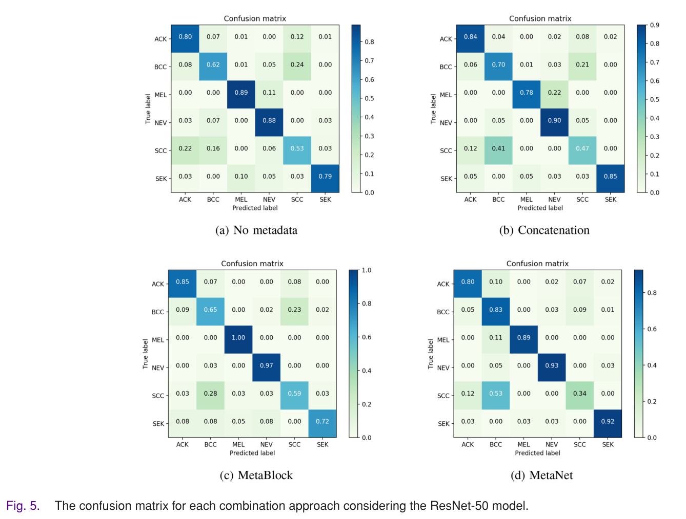

# 이미지와 메타데이터를 결합하기 위한 어텐션 기반 메커니즘

- 원문 PDF: `An_Attention-Based_Mechanism_to_Combine_Images_and_Metadata_in_Deep_Learning_Models_Applied_to_Skin_Cancer_Classification.pdf`
- 구성 원칙: PDF 원문을 논문 섹션 구조에 맞춰 재배치하고, 수식은 LaTeX로 별도 복원했다.

## IEEE JOURNAL OF BIOMEDICAL AND HEALTH INFORMATICS, VOL. 25, NO. 9, SEPTEMBER 2021

안드레 G. C. 파체코와 레나토 A. 크로링.

딥 뉴럴 네트워크로 구축된 추상-컴퓨터 지원 피부암 분류 시스템은 일반적으로 피부 병변의 이미지만을 기반으로 예측을 산출한다. 유망한 결과를 제시함에도 불구하고, 인간 전문가가 피부병변 스크리닝 동안 고려하는 중요한 단서인 환자 인구통계를 고려하여 더 높은 성능을 달성할 수 있다. 이 글에서

우리는 제안된 방법을 메타넷과 특징 연결에 기초한 하나의 다른 조합 접근법과 비교했다. 두 개의 다른 피부 병변 데이터 세트에 대해 얻은 결과는 우리의 방법이 모든 테스트 모델에 대한 분류를 개선하고 10개의 시나리오 중 6개 시나리오에서 다른 조합 접근 방식보다 더 나은 성능을 발휘한다는 것을 보여준다.

인덱스 용어 - 컨볼루션 신경망, 데이터 집계, 딥러닝, 피부암 분류.

## INTRODUCTION
A

원고는 2020년 10월 27일, 2021년 1월 15일 및 2021년 2월 21일에 수정된 CAPES(Coordenao de Desenvolvimento Científico e Tecnológico) - 금융 코드 001, 2021

안드레 지 C 파체코는 브라질 에스피리토 산토 29075-910(비토리아 에스피리오 산토 연방대학 컴퓨터과학대학원(PPGI)에 재학 중이다(e메일: agcpacheco@inf.ufes.br).

레나토 A. 크로링은 브라질 에스피리토 산토 29075-910(비토리아 에스피리오 산토 연방대학 생산공학과)와 컴퓨터과학대학원(PPGI)을 운영하고 있다.

디지털 객체 식별자 10.1109/JBHI.2021.3062002

딥러닝 모델에서 이미지와 메타데이터를 결합하기 위한 주의 기반 메커니즘

피부암 분류에 적용됩니다

본 연구에서는 딥러닝 모델을 이용하여 이미지와 메타데이터를 결합하는 문제를 다루며, 메타데이터 프로세싱 블록(MetaBlock)이라는 접근법을 제안하며, 여기서는 메타데이터 처리 블록(MetaBlock, Metadata Processing Block)이라는 개념에 기초한다.

2168-2194 © 2021 IEEE. 개인 사용은 허용되나, 공화/재분배는 I EEE 허가를 필요로 한다.

자세한 내용은 https://www.ieee.org/publications/rights/index.html를 참조하세요.

메타데이터를 사용하여 이미지에서 추출된 가장 관련된 특징을 강화하여 데이터 분류를 지원하는 구조이다. 메타블록은 마이너CNN을 처리하도록 설계되었으며 모델의 아키텍처에 무반응이다. 제안된 접근법을 평가하기 위해, 우리는 이를 적용하여 두 개의 상이한 피부 병변 데이터셋 - ISIC

본 논문의 나머지 내용은 다음과 같이 정리되는데, II절에서는 이미지와 메타데이터 조합 과제에 대한 개요를 제공하고, III절에서는 메타블록에 대한 제안된 접근 방식을 설명하고, IV절에서는 실험 결과와 이에 대한 논의를 제시하고, 마지막으로 결론을 도출한다.

## 이미지와 메타데이터 특징 결합

이는 이미지 처리를 수반하는 멀티미디어 분석에 적용되는 오프-더-셰이프 방식이다.

질병 분류, 얼굴 인식, 이미지 검색 및 객체 식별과 같은 많은 이미지 처리 작업은 이미지의 시각적 패턴의 차이가 매우 작기 때문에 어렵다. 이것은 노이즈, 시점 및 데이터 분산[24]과 같은 상이한 요인에 의해 야기될 수 있다. 이러한 작업을 처리하는 방법의 성능을 향상시키고 강건성을 증가시키기 위해

컨볼루션 뉴럴 네트워크(CNN)로부터 추출된 이미지 특징과 수공예된 특징, 즉 전통적인 이미지 처리 알고리즘을 사용하여 추출된 특징을 결합하여 형태, 색상 또는 질감을 추출하는 것, 또는 음악 장르 분류를 위한 Nanni et al. [32], 얼굴 검출을 위한 N

상이한 CNN 아키텍처로부터 추출된 이미지 특징들의 조합. 두 경우 모두에서, 추출된 특징들을 결합하는 가장 일반적인 방법은 특징 연결[32], [36] 및 [37]을 통한 것이다. 기본적으로, 이 방법의 주요 아이디어는 동일한 구조 내에서 추출된 모든 특징들을 부착하고 다른

약간 다른 문제는 이미지에서 추출된 특징을 다른 데이터 소스에서 얻은 다른 특징과 결합하는 것이다. 예를 들어, 의료 질병 검출에서, 이미지는 정보의 주요 원천이고, 일반적으로 메타데이터로 명명된 추가 데이터는 문제에 대한 추가 정보를 제공하는 간단한 결합이 또한 가장 일반적인 접근법이다. 예를 들면, 카라즈

[40]은 또한 연결을 사용하여 두 개의 CNN 아키텍처를 사용하여 추출된 이미지 특징을 텍스트 메타데이터와 결합하여 사용자 성별 예측을 수행했다.

일반적으로 이미지는 고차원 데이터이므로, 이미지로부터 추출된 특징의 수가 메타데이터로부터 추출되는 특징보다 훨씬 더 많다. 이러한 맥락에서, 상이한 작업들은 먼저 이미지 특징들을 선택/축소함으로써, 특징들의 두 세트 내의 패턴이 예를 들어 분류기에 의해 더 용이하게 식별될 수 있다고 가정한다.

이에 의해, 연결보다 더 나은 집성 접근법을 제공함으로써 성능을 향상시킬 수 있다.

III. METADATA PROCESSING BLOCK: ATTENTION-BASED MECHANISM TO COMBINE MULTI-SOURCE

## FEATURES

본 절에서는 이미지로부터 추출된 특징 맵을 향상시키기 위해 메타데이터를 사용하는 주의 기반 메커니즘 접근법[43], [44]을 메타블록(MetaBlock)에 제시한다. 제안된 접근법의 구축 블록은 기본 구성 요소인 Long Short-Term Memory(LSTM

각 샘플이 이미지(ximg), 컨텍스트 정보(xmeta)를 나타내는 메타데이터 그룹(metadata group), 및 레이블 y 1,.. Nlab로 구성되는 분류 문제를 고려한다. 우리는 이 문제를 튜플Ximg, X

그림 1. 제안된 조합 접근법의 주요 아이디어를 나타내는 모식도이다. 이미지 특징은 메타데이터에 따라 선택된다. 결국 메타데이터는 이미지 특징을 안내한다.

> 그림 내부 텍스트 번역:
> - `文img` → 文img
> - `Xmeta` → Xmeta
> - `MetaBlock` → 메타블록
> - `Fig. 1. A schematic diagram illustrating the main idea of the proposed` → 그림 1. 제안된 아이디어의 주요 아이디어를 나타낸 모식도.
> - `combination approach. The image features are selected according to` → 조합 접근법. 이미지 특징은 이미지 특징에 따라 선택된다.
> - `the metadata. In the end, the metadata guide the image features.` → 메타데이터. 결국 메타데이터는 이미지 특징을 안내한다.

특징 추출기 를 정의해야 한다. 본 논문에서, 우리는 최종 특징 맵을 이미지 특징으로 추출하는 컨볼루션 뉴럴 네트워크 (CNN)를 img = gcnn(ximg)으로 정의한다. 메타데이터와 관련하여, 추출기 (meta)는

$$
\tilde{x}_{\mathrm{img}}=\psi_{\mathrm{img}}(x_{\mathrm{img}}),\quad \tilde{x}_{\mathrm{meta}}=\psi_{\mathrm{meta}}(x_{\mathrm{meta}})\tag{1}
$$

여기서 ximg Rkimg×mimg×nimg (kimg 및 mimg × nimg은 각각 특징 맵의 개수 및 순서) 및 xmeta  Rdmeta이다.

마지막으로, 우리의 목표는 이미지와 메타데이터가 주어진 클래스 c 1, nlab를 가정하는 y의 확률을 추정하는 방법을 제안하는 것이다.

y = p(y = c | ximg, xmeta) (2)

메타블록은 컨텍스트 정보에 따라 이미지를 안내하는 것을 목표로 한다. 즉, 메타블록의 목표는 메타데이터 특징 xmeta에 따라 특징 맵 ximg을 안내하는 것이다. 그림 1에서, 출력 특징 x가 동일한 형상을 가질 것이라는 것을 관찰한다. 그러나, 메타 데이터 특징 x

본질적으로, 우리는 메타블록이 주의 메커니즘과 유사하게 작동하기를 원한다. 메타데이터 지식을 이미지 특징 맵에 통합함으로써 모델이 더 중요한 특징에 집중하도록 도와야 한다. 이 목표를 달성하기 위해, 우리는 배치 정규화 알고리즘 [46]에 의해 사용되는 것과 유사한 메타블록 방정식을 정의한다. 즉,

x = [tanh[fb(xmeta) ximg] + gb(Xmeta]] (3)

는 원소별 곱이고, (·) 및 tanh(··)는 각각 시그모이드 및 쌍곡 접선이며, LSTM 게이트로서 작동하도록 설계된다. 블록은 2개의 함수 fb(xmeta) 및 gb(Xmeta

딥러닝 파이프라인에 비선형 함수를 부착하는 것은 간단한 방법이기 때문에 우리는 두 함수를 단일층 신경망으로 모델링한다. 그에 의해, fb(xmeta)와 gb (xmeeta)는 다음과 같이 정의된다.

$$
f_b(\tilde{x}_{\mathrm{meta}})=W_f^{T}\tilde{x}_{\mathrm{meta}}+w_{0f}\tag{4}
$$

f xmeta + w0f(4)

$$
g_b(\tilde{x}_{\mathrm{meta}})=W_g^{T}\tilde{x}_{\mathrm{meta}}+w_{0g}\tag{5}
$$

g xmeta + w0g (5)

가중치 Wf, WgRdmeta×kimg 및 바이어스 w0f, w0g Rkimg의 두 행렬 모두는 kimg가 이미지에서 추출된 특징 맵의 수임을 회상한다. 따라서, 각 함수는 수정자를 명명

수정자 계수를 사용하여 특징 맵을 수정한 후 쌍곡 접선과 시그모이드 함수 게이트를 사용하여 가장 관련된 특징을 선택한다. 다시 말해, 이 게이트는 어떤 특징을 통과해야 하는지, 어떤 특징은 통과하지 말아야 하는지 결정한다. 3으로부터, 우리는 두 게이트를 다음과 같이 설명한다: r 쌍

메타블록 및 4:1의 이 부분에 의해 정의된다.

$$
\tilde{x}=\sigma\left(\tanh\left(f_b(\tilde{x}_{\mathrm{meta}})\odot \tilde{x}_{\mathrm{img}}\right)+g_b(\tilde{x}_{\mathrm{meta}})\right)\tag{3}
$$

본 게이트는 -1 내지 1의 값을 출력하는 비선형성(non-linearity)을 추가함으로써 스케일링 연산자의 값을 제어한다. 필연적으로, 1이 가장 관련성이 있고 -1이 반대인 [-1,1]의 범위로 그 값을 수정함으로써 각 특징의 관련성을 증가시키거나 감소

이전 게이트(Tgate)의 출력을 이용하여 다음과 같이 동작한다.

Sgate =  [Tgate + gb(xmeta)](7)

이 게이트는 이전 게이트의 값을 시프트하고 0에서 1 범위의 값을 출력한다. 즉, 이 게이트가 이전 게이트와 유사하게 작동하지만, 가장 관련된 특징을 출력하는 힘이 있다. 간단히 말해서, 우리는 메타데이터가 gb와 fb 함수에 전송되고, 그 출력은 쌍곡

그림 3에는 메타블록이 메타데이터와 특징 맵을 결합하는 데 사용되는 CNN 도식이 설명되어 있다. 메타블록 계층의 출력이 분류 계층에 공급하기 위해 사용된다는 것을 관찰한다. 그러나, 이 방법은 분류기에 보내기 전에 임의의 유형의 계층에 공급하는 데 사용될 수 있다. 또한, 이

그림 2. 메타블록의 내부 구조. 요약하면, 블록은 메타데이터 특징에 기초하여 이미지 특징을 향상시키는 방법을 학습한다. 출력 특징 어레이는 이미지 특징과 동일한 형태를 갖는다.

> 그림 내부 텍스트 번역:
> - `Xmeta` → Xmeta
> - `fb` → fb
> - `tanh` → tanhh.
> - `Ximg` → .
> - `Fig. 2. The internal structure of the MetaBlock. In summary, the block` → 그림 2. MetaBlock의 내부 구조. 요약하면, 블록은 내부 구조에 의해 형성된다.
> - `learns how to enhance the image features based on the metadata` → 메타데이터에 기초하여 이미지 특징을 강화하는 방법을 학습합니다.
> - `features. The output features array has the same shape as the image` → 특징. 출력 특징 어레이는 이미지와 동일한 형상을 갖는다.
> - `features.` → 기능.

앞에서 설명한 바와 같이, 함수 fb와 gb는 단층 신경망이다. CNN은 종단간 역전파 알고리즘을 사용하여 훈련되기 때문에, 우리는 CNN의 훈련 파라미터 내에 각 함수의 가중치를 포함하고 표준 훈련 단계를 수행한다. 또한, 우리는 배치 정규화를 적용하여 두 함수를 정규화

## 실험 및 결과

본 절에서는 메타블록의 성능을 평가하기 위한 실험을 수행한다. 우리는 ISIC 2019 [20] 및 PAD-UFES-20 [21]의 두 가지 다른 피부 병변 데이터세트에 훈련된 5개의 다른 CNN 아키텍처를 사용한다. 우리는 데이터세트와 CNN을 포함한 실험의 설정을

A. 실험의 설정.

마이너(meaBlock)는 다음의 CNN 아키텍처: EfficientNetB4[47], DenseNet-121[48], MobileNet-v2[49], ResNet50[50] 및 VGG-13[51]의 마지막 특징

공공 및 8238 개인 피부경 이미지, 연령, 성별 및 해부학적 영역의 세 가지 환자 임상 특징: 멜라닌종(MEL), 멜라노시틱 모반(NEV), 기저 세포 암종(BCC), 액틴성 케라토시스(ACK), 양성 케

스마트폰 장치에서 수집된 2298개의 임상 이미지, 연령, 성별, 해부학적 영역, 암 이력, 피부 광형, 가족 배경 등과 같은 21개의 환자 임상 특징 및 6개의 피부 병변: 기저 세포 암종 (BCC), 편평 세포 암 종 (SCC), 광선

1코드는 https://github.com/paaatcha/MetaBlock에서 사용할 수 있습니다.

임상적 특징. 본질적으로, 피부경 이미지는 피부 표면에 대한 더 많은 세부 사항을 제공하며 임상적 이미지에 비해 조명 또는 카메라 해상도의 영향을 받지 않는다.

메타데이터, 베이스라인 연결 방법[3] 및 메타넷[19]을 사용하지 않고 모델들과 결합하는 모든 방법들이 이 실험에 사용된다. 모든 모델들은 토치비전 API로부터 수집된 가중치로 이미지넷[52] 마이너에서 사전 트레이닝되었고, SGD 최적화기를 사용하여 150개의

데이터세트가 불균형, 즉 샘플이 라벨들 사이에서 동등하게 표현되지 않음에 따라 가중치가 결정되는 손실 함수로 가중 교차 엔트로피를 적용했다. 모든 이미지는 224 × 224로 리사이징되었고, 수평 및 수직 플립, 밝기, 콘트라스트 및 채도의 조정

간단히 말해서, 방법은 각 행이 그룹 내의 알고리즘을 나타내며 주어진 메트릭의 평균 및 표준 편차로 구성된 행렬을 입력으로 사용한다. 유사도 메트릭을 통해, 방법은 각각의 알고리즘에 대한 점수를 결정하여 그들을 순위화한다.

B. 메타데이터 사전 절차

두 데이터 세트의 경우 이미지 분류를 지원하기 위해 메타데이터로서 환자 임상 특징(인구학적)을 사용한다. 앞서 언급한 바와 같이, ISIC 2019 데이터 세트는 세 가지 임상 특징만을 포함하고, PAD-UFES-20은 21을 포함한다. 두 경우 모두에서, 우리는 수, 예를 들어

수(정수 또는 플로트)는 변환을 적용하지 않고 그대로 사용한다. 사실, 우리는 [0,1] 사이의 이러한 특징들을 정규화하려고 노력했지만 최종 결과에서 어떠한 변화도 제시하지 않는다. 부울형 특징: 이러한 유형의 특징들에 대해, 우리는 단지 재반복할 뿐이다.

True는 1로, False는 0으로 보냈다.

r 스트링/카테고리형 특징: 특징이 재생될 때

문자열에 의해 전송된, 알려진 수의 옵션을 갖는다. 예를 들어, 젠더 속성은 남성 또는 여성이라는 두 가지 값을 가정할 수 있다. 이러한 특징을 메타데이터로 사용하기 위해, 우리는 특징 추출기 메타를 적용하여 범주형 데이터를 스칼라 번호로 변환할 필요가 있다. 이에

C. 실험 결과 - ISIC 2019 데이터셋

이제 우리는 메타데이터를 고려하지 않고 ISIC 2019 데이터세트에 대해 얻은 결과를 제시한다. 표 I에서는 메타 데이터를 사용하지 않은 각 CNN 모델, 연결 접근법을 사용한 모델, 메타넷 및 메타블록을 사용한 모델에 대해 평균 및 표준 편차 측면에서 결과를 제시하였다. 시각화를 용이하게 하기 위해 표 II에서는

표 I 및 II에서 알 수 있듯이, 이미지 분류를 지원하기 위한 환자 임상 특징의 사용은 BACC 측면에서 공정한 성능 개선을 제공하며, 특히 MetaBlock 접근법을 적용할 때, 이는 이미지 분류의 정확도를 향상시켰다.

그림 3. CNN 모델에 부착된 메타블록 계층의 예시. 메타데이터가 분류기에 보내기 전에 특징 맵으로부터 가장 관련된 특징을 식별하는 데 사용된다는 것을 관찰한다.

> 그림 내부 텍스트 번역:
> - `Feature maps` → 지도가 특징입니다
> - `Image` → 이미지.
> - `meta-data` → 메타 데이터.
> - `Image feature extractor` → 이미지 특징 추출기
> - `MetaBlock Layer` → 메타블록 계층.
> - `convolution,activation and` → 컨볼루션, 활성화 및
> - `classifier` → 분류기
> - `pooling layers` → 풀링 레이어
> - `Fig. 3. An illustration of a MetaBlock layer attached to a CNN model. Observe that the metadata are used to identify the most relevant features` → 그림 3. CNN 모델에 부착된 메타블록 계층의 예시. 메타데이터가 가장 관련된 특징을 식별하는 데 사용된다는 것을 관찰한다.
> - `from thefeature maps before sending themto the classifier.` → 분류기에 보내기 전에 특징 지도에서.

## TABLE I
PERFORMANCE OF THE CNN MODELS FOR THE ISIC 2019 DATASET WITH

## AND WITHOUT CONSIDERING THE METADATA

## TABLE II
COMPARING THE PERFORMANCE OF THE ALL METHODOLOGIES IN TERMS

## OF BACC FOR THE ISIC 2019 DATASET. IN BOLD IS HIGHLIGHTED THE

## HIGHEST AVERAGE FOR EACH MODEL

그림 4. ISIC 2019 데이터 세트에서 ResNet-50 성능을 고려한 메타데이터, 연결, 메타블록 및 메타넷 접근법에 대한 매크로 평균 (a) 및 흑색종 ROC (b) 곡선. (c)는 각 접근법에 대해 A-TOPSIS 순위를 나타낸다.

> 그림 내부 텍스트 번역:
> - `1.0` → 1.0
> - `1.0 -` → 1.0 -
> - `0.8` → 0.8
> - `True Positive Rate` → 진짜 긍정금리.
> - `0.6` → 0.6
> - `0.4` → 0.4
> - `No meta: 0.97` → 메타 없음: 0.97
> - `No meta: 0.94` → 메타 없음: 0.94
> - `0.2` → 0.2
> - `Concat: 0.96` → Concat: 0.96
> - `Concat: 0.90` → Concat: 0.90
> - `MetaBlock: 0.98` → 메타블록: 0.98
> - `MetaBlock: 0.95` → 메타블록: 0.95
> - `MetaNet: 0.97` → 메타넷: 0.97
> - `MetaNet: 0.92` → 메타넷: 0.92
> - `0.0` → 0.0
> - `No meta-data` → 메타 데이터가 없습니다
> - `Concatenation` → 연결.
> - `MetaNet` → 메타넷.
> - `MetaBlock` → 메타블록
> - `False Positive Rate` → 거짓 양성률.
> - `(a) Macro average` → (a) 매크로 평균
> - `(b) Melanoma` → (b) 흑색종
> - `(c) A-TOPSIS` → (c) A-TOPSIS
> - `Fig. 4. The Macro average (a) and melanoma ROc (b) curves for no metadata, concatenation, MetaBlock, and MetaNet approaches considering` → 그림 4. 메타데이터, 연결, 메타블록 및 메타넷 접근법이 없는 경우의 매크로 평균(a) 및 흑색종 ROc(b) 곡선을 고려하여 그래프로 나타내었다.
> - `the ResNet-50 performance on ISIC 2019 dataset. In (c) is depicted the A-TOPSiS rank for each approach.` → ISIC 2019 데이터세트 상의 ResNet-50 성능. (c)에는 각 접근법에 대한 A-TOPSiS 순위가 묘사되어 있다.

## TABLE III
THE RESULT OF THE WILCOXON PAIRWISE TEST FOR ALL METHODS

## PERFORMED FOR ISIC 2019 DATASET

## TABLE IV
PERFORMANCE OF EACH COMBINATION APPROACH USING THE RESNET-50

## MODEL FOR THE ISIC 2019 PRIVATE TEST SET

세 가지 방법을 순위화한다. 순위는 그림 4(c)에 제시되어 있으며 통계 검정에 따라, 즉 메타블록 접근법은 순위 점수가 더 높고 나머지 세 가지 방법은 상당히 유사한 값을 달성한다.

AUC 메트릭의 요지를 얻기 위해 그림 4에는 메타데이터가 없는 ResNet-50 모델, 2, 연결, MetaNet 및 가장 치명적인 피부암 유형인 매크로 평균 및 흑색종을 고려한 MetaBlock 접근법을 고려한 ROC 곡선이 표시되어 있다. 우리가 볼 수 있듯이 Met

이 실험을 마무리하기 위해, 우리는 ISIC 2019의 비공개 테스트 파티션을 사용하여 조합 접근법을 평가한다.

이 플랫폼은 주당 제출 횟수를 제한하므로 ResNet-50 모델을 사용하여 각 방법을 수행했습니다. 표IV에서 플랫폼이 제공하는 3가지 성능 측정을 나타내었다.

2 10개의 ROC 곡선을 가질 것이기 때문에, 우리는 ResNet-50에 대해서만 이러한 플롯을 제시하기로 결정했는데, 이는 피부암 분류를 포함한 딥러닝에서 빠르고 꽤 일반적인 모델이고, 우리의 실험에 공정한 성능을 나타내기 때문이다.

3https://challenge2019.isic-archive.com/

BACC는 제출물을 순위화하는 데 사용되는 BACC이다. 우리가 볼 수 있듯이, 메타블록 접근법은 나머지 메트릭이 상당히 가깝지만 가장 높은 BACC를 달성한다. 메타넷은 메타데이터를 사용하지 않고 모델보다 약간 우수하며, 연결은 약간 더 나쁘다. 또한, 이 파티션은

D. 실험 결과 - PAD-UFES-20 데이터 세트

실험의 이 부분에서는 PAD-UFES-20 데이터세트 [21]에 대한 메타데이터를 고려하지 않고 딥러닝 모델의 성능을 비교한다. 표 V에서는 각 방법에 대한 BACC 측면에서만 성능을 요약한다. 시각화를 용이하게 하기 위해 표 VI에서는 메타데이터가 분류 과정에 포함될 때 모든 메트릭

ISIC 2019 데이터세트와 유사하게, MetaBlock은 연결 및 MetaNet에 비해 더 안정적인 성능을 나타낸다. 그러나, 이러한 차이를 조사하기 위해 PAD-UFES20을 사용하여 동일한 실험을 반복했지만, BACC 측면에서 각각의 조합 접근법에 대해 동일한 3개의 메타데이터를 사용했기

## TABLE V
PERFORMANCE OF THE CNN MODELS FOR THE PAD-UFES-20 DATASET

## WITH AND WITHOUT CONSIDERING THE METADATA

BOLD VI 는 -UFES-20 DATASET에 대한 치료법을 위한 BACC의 TERMS에 대한 MODELS의 목적을 충족합니다. BOLD 은  - UFES 20 DATA SET의 ERMS 에 대한 옵션을 제공합니다

## HIGHEST AVERAGE BACC FOR EACH MODEL

BCC의 장기 보관에 대한 MOU의 목적은 오직 SAME에 있는 PAD-UFES-20 DATASET를 위한 것이다.

## THREE FEATURES AVAILABLE IN ISIC 2019. IN BOLD IS HIGHLIGHTED THE

이 실험에서 우리는 또한 추가 분석을 위해 ResNet-50을 선택했다. 그림 5는 선택된 모델을 고려한 각 조합 접근법에 대한 혼동 행렬을 보여준다. 그러나, 혼동 행렬은 일반적으로 SCC와 BCC 사이의 미스 분류를 증가시킨다. 이것은 그림 6에 묘사된 t-SNE [57]

## TABLE VIII
THE RESULT OF THE WILCOXON PAIRWISE TEST FOR ALL METHODS

그럼에도 불구하고 이 혼동은 문제가 되지 않는다. 둘 다 피부암이고 생체검사가 필요하기 때문이다. 실제 문제는 수술 과정 없이 치료되는 경미한 피부 질환인 ACK로 혼동하는 것이다. 피부암의 가장 치명적인 사례인 MEL의 경우 메타블록 접근법은 최대 성능을 달성하고, 결합과 메타넷은

우리는 또한 방법의 성능을 비교하기 위해 BACC 메트릭을 고려하여 Friedman 및 Wilcoxon 테스트를 수행했다. 프리드먼 테스트는 p값 5 × 1011을 반환했다. 따라서, 우리는 p값이 MetaNet 및 Concatenation 접근법을 제외한 모든 쌍별 비교에 대해 p

E. 토론.

이전 섹션에서 제시된 결과는 메타데이터와 환자 인구통계를 결합하면 피부암 분류를 위한 CNN 모델의 성능을 향상시킬 수 있음을 나타낸다. 그러나 결과는 또한 결합 방법에 따라 달라진다. ISIC 2019 데이터세트의 경우 통계 테스트는 결합을 나타내며 메타넷 접근법은 메타데이터를 사용하지 않고 모델과 차이를 나타내지

PAD-UFES-20 데이터세트를 고려할 때, 세 가지 조합 방법 모두 메타데이터를 사용하지 않고 모델보다 높은 성능을 나타낸다. ISIC 2019 데이터세트와 유사하게, 메타블록 접근법은 5개 모델 중 3개 모델에 대해 BACC 측면에서 최상의 성능을 달성하였다. 통계 테스트는 제안된 방법이

Fig. 5. ResNet-50 모형을 고려한 조합별 혼동 행렬을 접근한다.

> 그림 내부 텍스트 번역:
> - `Confusion matrix` → 혼란 매트릭스
> - `0.9` → 0.9
> - `0.04` → 0.04
> - `0.02` → 0.02
> - `0.07` → 0.07
> - `0.01` → 0.01
> - `0.12` → 0.12
> - `0.00` → 0.00
> - `0.08` → 0.08
> - `0.80` → 0.80
> - `0.84` → 0.84
> - `ACK-` → ACK-
> - `ACK -` → ACK -
> - `0.8` → 0.8
> - `0.7` → 0.7
> - `0.70` → 0.70
> - `0.21` → 0.21
> - `0.62` → 0.62
> - `0.05` → 0.05
> - `0.06` → 0.06
> - `0.24` → 0.24
> - `0.03` → 0.03
> - `BCC-` → BCC-
> - `0.6` → 0.6
> - `0.89` → 0.89
> - `0.11` → 0.11
> - `0.78` → 0.78
> - `0.22` → 0.22
> - `MEL` → MEL
> - `True label` → 진정한 라벨.
> - `0.5` → 0.5
> - `0.4` → 0.4
> - `0.90` → 0.90
> - `0.88` → 0.88
> - `NEV-` → NEV-
> - `NEV` → NEV.
> - `0.3` → 0.3
> - `0.16` → 0.16
> - `0.41` → 0.41
> - `0.53` → 0.53

Fig. 6. ResNet-50 모델을 고려한 조합별 t-SNE 시각화 방법.

> 그림 내부 텍스트 번역:
> - `BCC` → BCC
> - `ACK` → ACK.
> - `SEK` → SEK.
> - `SCC` → SCC
> - `20` → 20
> - `MEL` → MEL
> - `NEV` → NEV.
> - `10` → 10
> - `15` → 15
> - `-10` → -10
> - `-5` → -5
> - `30` → 30
> - `(a) No metadata` → (a) 메타데이터 없음
> - `(b) Concatenation` → (b) 연결.
> - `(c) MetaBlock` → (c) 메타블록
> - `(d) MetaNet` → (d) 메타넷
> - `Fig. 6.` → Fig. 6.
> - `The t-SNE visualization for each combination approach considering the ResNet-5o model.` → 각각의 조합에 대한 t-SNE 시각화는 ResNet-5o 모델을 고려하여 접근한다.

그림 7. A-TOPSIS는 PAD-UFES-20 데이터 세트에 대한 BACC 메트릭을 고려한 각 접근법에 대한 순위이다.

> 그림 내부 텍스트 번역:
> - `A-TOPSIS for PAD-UFES-20O dataset` → PAD-UFES-20O 데이터 세트에 대한 A-TOPSIS
> - `1.0` → 1.0
> - `0.6` → 0.6
> - `Scores` → 점수.
> - `0.4` → 0.4
> - `0.2` → 0.2
> - `0.0` → 0.0
> - `No meta-data` → 메타 데이터가 없습니다
> - `Concatenation` → 연결.
> - `MetaNet` → 메타넷.
> - `MetaBlock` → 메타블록
> - `Fig. 7. The A-TOPSIS rank for each approach considering the BACC` → 그림 7. A-TOPSIS는 BACC를 고려한 각 접근법에 대한 순위이다.
> - `metric for the PAD-UFES-20 dataset.` → PAD-UFES-20 데이터 세트에 대한 메트릭.

흑색종 분류는 모든 피부암 CAD 시스템에 매우 필요하다.

비교 테이블 II 및 VI로부터, BACC 측면에서 가장 낮은 성능은 VGG-13 아키텍쳐에 의해 달성된다. 나머지 아키텍처와 비교하여, VgG-13은 더 많은 수의 특징 맵(512 × 7 ×7)을 출력하는 것이다. 이는 네트워크가 이미지를 더

각 데이터세트에 대한 결과를 관찰하면, 메타데이터가 ISIC 2019 데이터세트보다 PAD-UFES-20에 대해 훨씬 더 높은 성능을 제공했음을 알 수 있다. 또한, 결합 접근법이 ISIC에 대해 잘 작동하지 않는다. 실험에서 보여주듯이, 우리는 결합 접근 방식이 이 문제를 제대로 처리할

Li et al. [19]는 메타넷을 레이블에 대한 회상 측면에서만 분석했으며, 이는 흑색종 분류에 대한 낮은 성능을 보여준다. 또한, 저자들은 그들의 방법을 메타데이터 및 연결 접근법과 추가로 비교하기 위해 통계 테스트 또는 다른 방법을 제공하지 않는다. 이 실험에서, 우리는 메타넷

결론적으로, 우리가 메타블록을 CNN 모델에 부착할 때, 그것은 모델의 크기를 증가시키지만 거의 미미하다. 메타데이터가 더 많고 결과적으로 퓨즈할 데이터가 더 많은 PAD-UFES-20에 대해 수행된 실험을 고려할 때, 가장 큰 영향을 받은 모델은 VGG-13이다. 우리는 훈련 가능한

## 결론

본 절에서는 주의 집중을 이용한 주의 집중 기반 메커니즘 접근법인 메타데이터 처리 블록(MetaBlock)을 제시한다.

데이터 분류를 개선하기 위해 이미지에서 추출된 특징 맵을 향상시키기 위해 메타데이터를 적용하였다. 메타블록 성능을 평가하기 위해, 우리는 이를 2개의 상이한 피부 병변 데이터세트: ISIC 2019 및 PAD-UFES-20에 대해 훈련된 5개의 상이한 컨볼루션 뉴럴

## 참고문헌

[1] WHO, "UV 방사선과 피부암, 세계 보건"

세계보건기구(WHO), 2020년, 2019년 8월 22일. [온라인] 이용 가능: https://www.who.int/news-room/q-a-detail/ultraviolet-(uv)-radiation and-skin-cancer[2] R. L

암 J. 클린, vol. 69, 1번, pp. 7–34, 2019 [3] A. G. Pacheco 및 R. A. 크로링, "환자 임상 임상적 인포메이션의 영향"

컴퓨터 Biol. Med., vol. 116, 2020, Art. No. 103545. [4] C. Sinz et al. "비돼지성 피부암의 진단을 위한 피부경 검사의 정확성"

J. Amer. Acad. Dermatol., vol. 77, 제6호, pp. 1100 내지 1109, 2017 [5] P. Tschandl et al. "인간 독자의 정확도 대 피부의 정확도 비교"

색소성 피부 병변 분류를 위한 기계 학습 알고리즘: 열린 웹 기반 국제 진단 연구" 랜싯 온콜, vol. 20, 7번, pp. 938–947, 2019 [6] A. G. 파체코, C. S. 사스트리, T. 트라펜

"심부 신경 피부암 분류기를 사용한 분포 외 검출 알고리즘에 관한" 논문 IEEE Conf. Comput. Vis. Pattern Recognit. 워크숍 2020, pp. 732–733. [7] G. Argenziano et al. 색소 피부 병변의

J. Amer. Acad. Dermatol., vol. 48, 5번, pp. 679–693, 2003. [8] M. E. Celebi, N. Codella, A. Halpern, "Dermoscopy 이미지 분석 분석

IEEE J. Biomed. Health Informat., Vol. 23, No. 2, pp. 474–478, 2019 [9] T. J. Brinker 등 "컨볼루션 신경계를 이용한 피부암 분류".

네트워크: "체계적 검토" J. Med. 인터넷 Res., vol. 20, No. 10, 2018 예술. e11936. [10] A. G. Pacheco 및 R. A. 크로일링, "최근 딥러닝의 발전"

네이처, vol. 542, No. 7639, pp. 115–118, 2017 [12] N. Codella 등, "심층 신경망에서 흑색종 인식을 위한 심층 학습 앙상블"

"피부경 영상" IBM J. Res. Dev., vol. 61, 4번, pp. 5–1, 2017 [13] Z. Yu 등 "집합된 혈관을 통한 피부경 영상의 흑색종 인식"

IEEE Trans. Biomed. Eng., vol. 66, 4번, pp. 1006–1016, 2019년 4월 [14] N. 게스터트, M. 닐슨,M. 샤이크, R. 베르너, A. 슐라퍼,

메타 데이터가 있는 다중 해상도 효율넷의 앙상블을 이용한 병변 분류 방법 X, pp. 1~8, 2020. [15] H. A. Haenssle et al. "기계에 대항하는 인간: 병변의 진단 성능"

머리부터 머리까지의 피부경 흑색종 영상 분류 과제에서 "Aur. J. 암, vol. 113, pp. 47-54, 2019[17] P. Kharazmi, S. Kalia, H. Lui, Z. Wang, T. Lee"는

본 발명은 "데이터 기반 특징 학습 및 환자 프로파일을 통한 기저 세포 암종 검출용 템"(Skin Res. Technol., vol. 24, No. 2, pp. 256 내지 264, 2018] Y. Liu 등, "피부의 감별

네이처메드, vol. 26, 6번, pp. 1–9, 2020. [19] W. Li, J. Zhuang, R. Wang,J. Zhang, W. S. Z정, "메타데이터 융합".

피부 질환 진단을 위한 피부경 및 피부경 이미지"는 프로그레스 IEEE Int. Symp. Biomed. Imag., 2020, pp. 1996–2000에서 설명된다.

[20] ISIC, "흑색종 검출을 향한 피부 병변 분석", 피부 이마그.

2019년 협업. 2020년 3월 10일. [온라인] 이용 가능: https: //www.isic-archive.com. [21] A. G. Pacheco et al., "PAD-UFES-20: 피부 병변 데이터 세트", A.

스마트폰에서 수집된 환자 데이터 및 임상 영상 데이터 브리프, vol. 32, pp. 1 내지 10, 2020. [22] P. K. 아테이리, M. A. 호사인, A. 엘 사디크, 및 M. S. 칸칸할리, "멀티

멀티미디어 분석을 위한 모달 융합: A 조사, 멀티미디어 시스트, vol. 16, 6번, pp. 345-379, 2010. [23] J. D. 오르테가, M. 세누사오의, E. 그랜저(Granger), M. 페

L. Koerich, 2019 arXiv:1907.03196. [24] T.-Y. Lin, A. RoyChowdhury, S. Maji, "Ai-Bi-Ci-Di-Pi-Ti-Fi-Ai

본 논문에서는 "세립형 시각 인식"에 관한 것으로서, 2015년 1월 1일부터 3월 1일까지의 임상 시험에서, pp. 1449 내지 1457. [25] D. Ardila 등, 3차원 입체적 시야를 갖는 폐암 최종 검진에 관한 것이다.

네이처메드, vol. 25, 6번, pp. 954–961, 2019 [26] F. Perronnin, J. Sánchez, T. Mensink, "저선량 흉부 컴퓨터 단층촬영에 대한 딥 러닝".

"대형 이미지 분류"는 프록시 에르. 컨프. 컴퓨트. Vis. 2010 pp. 143-156. [27] D. G. Lowe, "국소 스케일 불변 특징으로부터의 객체 인식", 로브, "지역 스케일 비변 특징

프록시 IEEE Conf. 컴퓨트. Vis. Pattern Recognit., vol. 2, 1999, pp. 1150 내지 1157. [28] H. Bay, A. Ess, T. Tuytelaar, L. Van Goall

(SURF) 컴퓨트 비스 이미지 이해, 전압 110, 3번, pp. 346 내지 359, 2008. [29] H. Jégou, M. Douze, C. Schmid 및 P. Pérez, 국부적 디스크립

그림 IEEE Conf. Comput. Vis. Pattern Recognit., 2010 pp. 3304 내지 3311. [30] J. L. G. Arroyo와 B.G. Zapirain, "각각의 이미지에서 안료 네트워크의 검출"

지도형 기계학습 및 구조분석을 이용한 피부경 영상", 컴퓨터 Biol. Med., vol. 44, pp. 144-157, 2014 [31] T. 마스트너, S. Yildirim-Yayilgan, J. Y. Hardeberg,

본 논문에서는 "피부 병변 분류를 위한 학습 및 수작업 특징"에 관한 논문으로, 그림 1~6. [32] L. Nanni, Y. M. Costa, A. Lumini, M. Y. Kim, S. R. 백은 "피부병변 분류와 수

"음악 장르 분류를 위한 시각 및 음향 특징" 전문가 시스트가 2016 [33] D.T. 응우옌, T.D. 팜, N.R. 백, K. R. 박, "깊은 음악 장르 구분을 위한 시각적, 음향적 특징"

가시광 카메라 센서를 사용하는 얼굴 인식 시스템에서 프레젠테이션 공격 감지를 위한 센서, 전압 18, 3번, p. 699, 2018 [34] R. Arroyo, P. F. Alcantarilla, L. M. Bergasa 및 E. 로메라,

논문 IEEE Int. Conf. Inf. Fusion 2017 pp. 1–7. [36] K. Pogorelov 등 "컨볼루션 신경망 기반 딥 러닝 및 수공예 특징 기반 Ap-P-P(Deep Learning and Handcrafted Feature)

논문 IEEE Int. Conf. Biomed. Health Inform. 2018 pp. 365–368. [37] C. Li, X. Wu, N. Zhao,X. Cao, J. Tang은 "2스트림 콘택트렌즈를 융합하여 혈관

RGB-T 객체 추적을 위한 volutional neural network", Neurocomputing, vol. 281, pp. 78-85, 2018 [38] F. Rodrigues, I. Markou, F. C. Pereira, "시계열 및 시계열적

이벤트 지역의 택시 수요 예측을 위한 텍스트 데이터: 딥 러닝 접근법", Inf. Fusion, vol. 49, pp. 120-129, 2019.

[39] L. Zhang, Y. Xie, L. Xiidao, X. Zhang "멀티소스 이질적"

논문 IEEE Int. Conf. Artif. Intell. Big Data 2018 pp. 47-51. [40] S. 시에라와 F. A. 곤잘레스는 "문언과 시각적 표상을 결합하는 것"을 다음과 같이 명시하고 있다.

멀티모달 저자 프로파일링을 위한 tions, CLEF의 작업 노트 논문, vol. 2125, pp. 219-228, 2018 [41] H. Abdi와 L. J. 윌리엄스, "원소 성분 분석" 컴퓨트.

통계학자, vol. 2, 4번, pp. 433–459, 2010. [42] S. E. 비슈와트, P. 티와리, G. Lee, A. 마다부시, 알츠하이머병.

뉴로이미징 이니셔티브 등. BMC Med. Imag., vol. 17, 1, p. 2, 2017 [43] H. 라로첼과 G. E. Hinton, "영상 및 비영상 생체의학 데이터를 위한 차원성 감소 기반 융합 접근법: 개념

제3차 볼트즈만 기계를 사용한 "프로크. 애드브. 뉴럴 인프. 프로세스. 시스트. 2010 pp. 1243 내지 1251. [44] D. 바야나우, K. 조, Y. 벤지오에 따르면, 제2차 볼트츠만 기계

논문 IEEE Conf. Comput. Vis. Pattern Recognit., 2015 pp. 1~15. [45] S. Hochreiter와 J. Schmidhuber, "장기 단기 기억, 신경 신경망, 신경망"에서 "정렬 및 번역을 공동으로

컴퓨터, vol. 9, No. 8, pp. 1735–1780, 1997. [46] S. Ioffe와 C. Szegedy, "배치 정규화: 심층 네트워크 가속".

"내적 공변량 시프트를 감소시켜 훈련"이라는 논문은 2015년 FFF 마하 학습에서 pp. 448-456.[47] M. Tan과 Q. V. Le에서 "효율적 네트워크: 공변량을 위한 재사고 모델 스케일링"에 관한 것이다

본 논문의 "volutional neural network"은 2019년 pp. 6105–6114. [48] G. 황, Z. Liu, L. Van Der Maaten, K. Q. Weinberger, "Densely Densely Neural Networks", "

본 발명은 프로그레스 IEEE 컨퓨트 컴퓨터 비스 패턴 인식, 2017 pp. 4700-4708. [49] M. 샌들러, A. 하워드, M. 주, a. Zhmoginov, L. C. 첸, "Mo-Mo-V

프록시 IEEE Conf. Comput. Vis. Pattern Pecognition, 2018 pp. 4510-4520. [50] K. He, X. Zhang, S. Ren 및 J. Sun은 "이미지에 대한 딥 레지듀얼 학습(Deep

프로그레스 IEEE Conf. Comput. Vis. Pattern Recognit. 2016 pp. 770 내지 778. [51] K. 시몬얀과 A. 지스만 "매우 깊은 컨볼루션 네트워크"

"대규모 이미지 인식을 위한" Int. Conf. Mach. Learning, 2014 arXiv:1409.1556. [52] J. Deng, W. Dong, R. Socher, L. J. Li, K. Li 및 L. Fei-Fei, "

본 발명은 "대규모 계층적 이미지 데이터베이스"에 관한 것이다. 본 발명에 따른 프로크 IEEE Conf. Comput. Vis. Pattern Recognit., 2009 pp. 248 내지 255. [53] A. G. Pacheco, A. R.

2019년 arXiv:1909.04525. [54] J. Derrac, S. García, D. Molina, F. Herrera, "이상치 샘플을 검출하기 위한 딥러닝과 엔트로피를 기반으로 한 실제 튜토리얼"

"진화 알고리즘 순위를 매기기 위한 TOPSIS" 프로시지 컴퓨트 Sci., vol. 55, pp. 308-317, 2015 [56] A. Géron, Scikit-Learn과 함께 핸즈 온 머신 러닝, 케라스, 및

텐서플로우: 지능형 시스템을 구축하기 위한 개념, 도구 및 기술. 미국 캘리포니아: 오Reilly Media, 2019 [57] L. V. D. 마테온과 G. Hinton, "t-SNE를 사용하여 데이터를 시각화", J. Mach.

학습. RES., vol. 9, pp. 2579–2605, 2008.

## 수식 복원

분류 확률:

$$
\hat{y}=p\left(y=c\mid \tilde{x}_{\mathrm{img}},\tilde{x}_{\mathrm{meta}}\right)\tag{2}
$$

쌍곡탄젠트 게이트:

$$
T_{\mathrm{gate}}=\tanh\left(f_b(\tilde{x}_{\mathrm{meta}})\odot \tilde{x}_{\mathrm{img}}\right)\tag{6}
$$

시그모이드 게이트:

$$
S_{\mathrm{gate}}=\sigma\left(T_{\mathrm{gate}}+g_b(\tilde{x}_{\mathrm{meta}})\right)\tag{7}
$$
