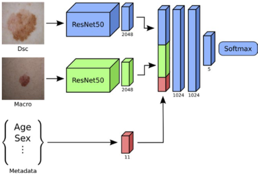
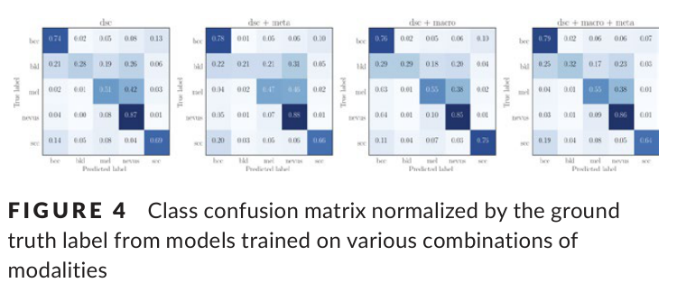

# 딥러닝을 이용한 멀티모달 피부 병변 분류

- 원문 PDF: `Experimental Dermatology - 2018 - Yap - Multimodal skin lesion classification using deep learning.pdf`
- 구성 원칙: PDF 원문을 논문 섹션 구조에 맞춰 재배치하고, 수식은 LaTeX로 별도 복원했다.

접수 : 2018년 6월 6일→변경 : 2018년도 7월 20일→접수 :2018년 8월 30일.

DOI: 10.1111/exd.13777

## O R I G I N A L A R T I C L E

딥러닝을 이용한 멀티모달 피부 병변 분류

조던 1 | 윌리엄 단1 | 필립 슈칸들2,3.

## 초록

2 컴퓨터 과학과, 사이먼 프레이저 대학교, 버나비, 브리티시 컬럼비아, 캐나다.

## K E Y W O R D S

## 서론

피부경 검사는 최첨단 기술로 간주됩니다.

보다 높은 진단 견뢰도를 제공하는 피부암 검진

안구 미착용안보다 리어시.[1,2] 디프에 대한 민감도를 증가시킨다.

흑색종 발견은 흑색종을 조기에 발견하는 것이 핵심이다.

사망률을 감소시킬 수 있다.[3] 비록 사망률은 감소하지만, 사망률은 증가하지 않는다.

흑색종이 증가하고 있으며, [4] 편평상피와 같은 각질세포암이 증가하고 있다.

세포암(활성각화증 및 보웬병 포함)

[5] 기저 세포 암종과 기저세포 암종은 훨씬 더 흔하다.

질병은 흑색종에 비해 치명적인 결과를 초래하는 경우가 거의 없다.

경제적 부담이 가장 높은 것 중 하나로 나타났다.

메디케어 환자.[6] 특히 기저세포암의 경우 비용이 증가한다.

합병증으로 인해 진행성 단계에서 치료를 받아야 하는 경우 유의하게요.

진단 지연. [7]

컨볼루션 신경망(CNN)이 피부에 성공적으로 적용된 가운데

병변 분류, 이전 연구에서는 일반적으로 단일 임상/임상 분류만을 고려하였다.

거시적인 이미지와 이진 결정을 출력합니다. 이 작업에서 우리는 이진 결정을 제시했습니다.

## method which combines multiple imaging modalities together with patient metadata

자동화된 피부 병변 진단의 성능을 향상시키기 위해. 우리는 우리의 평가를 평가했다.

## method on a binary classification task for comparison with previous studies as well as

실제 임상 시나리오를 대표하는 5개 클래스 분류 과제.

우리의 멀티모달 분류기가 기준선 분류기를 능가한다는 것을 보여주었습니다.

이진 흑색종 검출 (AUC 0.866 대 0.784) 모두에서 단일 거시 이미지.

멀티 클래스 분류 (mAP 0.729 대 0.598). 또한, 우리는 정량적 분류를 가지고 있다.

피부경 영상을 이용하여 피부 병변의 자동 진단을 효과적으로 보여주었다.

거시 이미지를 사용하는 것에 비해 더 높은 성능을 얻을 수 있습니다. 우리는 개별 이미지에서 더 높은 성능의 이미지를 얻습니다.

2917개의 케이스들의 새로운 데이터 세트에 대한 실험을 형성했는데, 각각의 케이스는 하나의 데이터 세트를 포함한다.

피부경 영상, 거시 영상 및 환자 메타데이터.

체내시경 검사는 정확한 것으로 나타났으며, [8] 환자의 부담을 감소시킨다.

의료 시스템과 필요한 피부 대기 시간을 줄입니다.

암 수술. [9] 자동화된 분류 시스템은 하나의 도구가 될 수 있다.

많은 수의 환자를 신속하게 선별하고 환자를 식별하는 데 도움이 됩니다.

대부분의 위험이 있습니다. 이것은 불필요한 진료소 방문을 줄이는 데 도움이 될 수 있습니다.

피부암이 아직 초기 단계인 동안 발견할 수 있도록 합니다.

피부경 영상의 자동화된 분석, 특히 피부경 영상을 이용한 분석

신경망은 수년 동안 연구되어 왔으나 최근에 연구되었다.

상대와 비교했을 때 유망한 결과로 주목을 받았다.

의사.[11] 임상적 근접(거시적) 이미지도 사용할 수 있다.

피부 진단을 위한 신경망에 의한 평가에 활용됩니다.

그러나, 이 기술은 암을 제공하는 것으로 입증되었다.

다중 질병 클래스를 예측할 때 더 낮은 정확도를 제공합니다. [12] 여러 질병 클래스의 예측에서.

양식이지만 오히려 한 번 이상의 방문에 걸쳐 환자를 직접 본다.

따라서 의사는 피부경 검사와 피부경 검사를 결합할 수 있습니다.

임상적 관점 및 환자 정보(예를 들어, 발병 시점, 환자의 변화)

병변, 약 연령, 성별 및 질병의 위치)

각 병변의 분석. 다중 특징 소스의 가용성은 다양한 특징 소스에 의해 분석될 수 있다.

대부분의 텔레피부경 평가에서도 동일하게 적용된다. [9]

이 연구의 초점은 더스트-레그의 중요성을 탐구하는 것이다.

특히 그 방법과 함께, 현미경 영상 촬영 양식.

자동화된 병변 진단 진단 작업을 위한 거시적인 상대방

언니. 우리는 또한 데이터를 활용하는 이전 연구와의 비교를 포함한다.

이와 같은 환자 수준의 메타데이터는 진단 성능을 향상시키는 것으로 나타났다.

정확도. [13] 우리의 네트워크 아키텍처는 그림 1과 같이 선택된다.

전체적인 심-탐색(sim-search)을 유지하려고 노력하면서 격자 탐색(Grid-Sesearch) 기법을 사용한다.

가능한 경우. 우리는 두 개의 ResNet-50[14] 컨볼루션을 사용한다.

뉴럴 네트워크(CNN) 아키텍처는 후발 융합 기술-데이터 네트워크 아키텍처를 이어받았다.

특징을 결합하기 위한 토크. 우리는 실험을 통해 특징을 결합하는 것을 보여준다.

의사가 풍부한 데이터를 통합할 수 있는 것처럼, 의사도 충분히 많은 데이터가 통합될 수 있습니다.

진단을 내리는 것은 네트워크가 데이터를 통합하는 데 도움이 됩니다.

여러 가지 양식에서 나왔습니다.

## 관련 연구

### Macroscopic image analysis

거시적 이미지를 분류하는 데 있어서의 획기적인 것들이 최근 들어 발견되고 있다.

두 가지 연구에 의해 만들어졌다. 첫 번째는 Esteva et al[12]에 의해 수집되었다.

미공개 온라인 데이터베이스 및 온라인 데이터베이스에서 100만 개의 거시 이미지

스탠퍼드대 메디컬 센터. 이로부터 그들은 미세 조정했습니다.

다양한 피부를 구별하기 위한 인셉션-V3 네트워크

조건. 평평한 클래스 분할 방식을 사용하는 대신

분류학 트리를 이용한 계층적 분할 알고리즘을 채용하였다.

달리 불균형한 데이터 세트의 균형을 맞추기 위해, 알고리즘은 선택된다.

집합된 자손이 있는 나무의 노드에서 나온 클래스 라벨.

훈련할 수 있는 충분한 이미지를 가지고 있습니다. 그들의 분류 분류 트리가 있기 때문에

우리는 그들의 작업과 비교할 수 없었다.

일단 훈련되면, 그들의 네트워크는 보드 인증을 받은 보드와 동등한 수준으로 수행된다.

각질세포암을 발견하거나 흑색종을 발견하는 의사

이진 분류 설정에서.

두 번째로, 그리고 더 최근의 연구는 한 et al[15]에 의해 재연구되었다.

커버하는 20만 개 이상의 거시 이미지 컬렉션에 포팅됩니다.

자체 독점 데이터 세트의 12개의 질병 클래스1뿐만 아니라

공개된 데이터 세트입니다. 그들은 컴퓨터에서 미세 조정을 사용했습니다.

딥 레이어를 사용하여 사전 훈련된 모델(초기 층을 냉동하는 동안)

수동으로 크롭된 이미지들에 대해 훈련된 ResNet-152[14] 아키텍처.

Esteva 등과 유사하게, 그들은 분류 정확도를 달성했습니다.

훈련된 의사들과 경쟁적이었고, Top-1 정확도 범위는 10°C 이상이었다.

다른 부분 집합에 걸쳐 55%에서 57.3% 사이입니다.

인간 수행과 관련하여, 신즈(Sinz)의 최근 연구.

et al[2]는 두 가지 모두를 보는 의사의 정확도가 증가했다고 보고했다.

2018년 16000625, 11, https://onlinelibrary.wiley.com/doi/10.1111/exd.13777, Wiley Online Library의 [07/05/2026]에서 다운로드되었습니다. 이용 규칙을 위해 Wiley 온라인 Library의 약관(https://on

1262 | YAP 등.

도 G U R E 1 멀티모달 분류를 위한 네트워크 아키텍처 다이어그램

칼 혈관에 있는 동일한 병변의 피부경 및 거시 영상

색소 침착되지 않은 사례의 렌즈링 데이터 세트입니다. 이것은 이전 사례를 지원합니다.

의사에게 더 높은 진단 정확도를 보고하는 연구 결과

보조 안구만을 사용하는 것이 아니라 피부경 검사를 사용한다. [16]

### Dermatoscopic image analysis

신경망을 피부경 검사에 적용하기 위한 초기 노력이 있었다.

피부 병변 분류[10] 그러나 이후 몇 년 동안은 피부병변 분류 [10]에 초점을 맞추었다.

주로 이미지 처리 기술[17–19] 및  처리 기술에 관한 기술에 관한 것이다.

ture 추출.[20~22] 최근 몇 년 동안, 시프트 백(shift back)이 있었다.

뉴럴 네트워크의 종단 간 적용을 향해. [11-13,15,23]

이는 GPU 컴퓨팅의 기하급수적인 증가 덕분이다.

역량은 물론, 그 효과의 전반적인 향상.

컨볼루션 신경망(둘 다 중요한 연구를 통해)

네트워크 설계[14,24,25] 및 대규모 데이터 세트와 같은 큐레이션

이미지넷[26]]. 이러한 관심은 이 회사의 노력에 의해 더욱 촉진되었다.

국제 피부 영상 협력체(ISIC)가 흡착력을 가지고 있다.

수천 개의 고품질 이미지를 대중에게 지속적으로 공개했습니다.

ISIC-archive2 이미지를 통해 이미지와 함께 공개됩니다.

진단, 메타데이터 및 분할 마스크. 가장 최근의 ISIC에서.

과제[11] 가장 Ac-C-C인 여러 개의 앙상블 모델을 결합하는 앙상블 모델.

2진 분류 과제. [23]

### Modality fusion

이전 연구들은 신경망이 레버-조절하는 능력을 보여준다.

여러 양식을 일반적인 양식에 통합하여 연령 추가 데이터를 저장합니다.

프레임워크.[11,27,28] 또한, 각 모달리티에는 프레임워크를 사용할 필요가 없습니다.

동일한 영역에 속하며, 융합은 다양한 영역에 걸쳐 탐구되었다.

이미지 도메인들[28]뿐만 아니라 텍스트 도메인들 전반에 걸쳐 이미지 도메인들을 나타낸다.

시맨틱 정보[29] 및 메타데이터[11,13] 이들 데이터의 통합.

모달리티들은 파이프라인에서 파이프라인에 따라 다른 단계에서 발생할 수 있다.

본 발명은 픽셀 레벨 이미지 융합 1Actinic Keratosis, 기저 세포 암종, 피부 섬유종, 혈관종, 상피내 암종(즉, 보웬병), 안면 홍반, 흑색종, 모반, 화농성 육아종, 편평 세포암, 지루

| 1263 YAP 등.

상이한 신호들을 포함하는 이미지들은 인-인-인(in-in)되기 전에 조합된다.

모델을 소개합니다.[30,31] 후기 스테이지 특징 융합 기법

이중선형-게이팅[32]과 같은 것은 더 기본적인 것에 비해 약간의 개선을 보인다.

맥스풀링과 같은 기술이 있습니다.

## 방법

### Data set

집합은 많은 미세한 계층에 걸쳐 있었고 집합으로 집합되었다.

피부과 전문의의 수동 검사를 통한 상급 질병 등급

메타데이터, 거시적 이미지, der-column 이미지를 포함하는 경우만 포함됩니다.

특히, 데이터 세트에서 발견된 사례는 본질적으로 어렵다.

조영술, 절제술은 혈관을 형성하기 위해 필요한 것으로 여겨졌다.

확실한 진단. 모든 이미지의 반복적인 수동 스크리닝을 통해,

우리는 이미지가 충분한 품질과 충분한 품질을 가진 경우만을 선택했습니다.

식별 가능한 특징(즉, 눈, 다수의 얼굴 랜드마크, 얼굴 랜드마크)이 없는 경우

보석이나 의복의 일부). 우리는 이것을 재생산하기 위해 시도했습니다.

데이터 세트로부터 임의의 가능한 바이어스들을 이동시키는 것; 예를 들어, 기초 바이어스들;

세포암(BCC)은 코에서 더 흔하게 발견될 수 있다.

따라서 네트워크는 코가 비스-위치인 경우 BCC를 예측하는 것을 학습할 수 있다.

가능한. 최종 데이터 세트는 5개의 클래스에서 2917개의 케이스로 구성된다.

(나브루스, 흑색종, 기저 세포 암종, 편평 세포암종, 암종)

착색된 양성 각화제(bkl)는 부록 S1을 참조하세요.

이러한 수업에 포함된 진단에 대한 형성.

### Network architecture

이미지 특징을 얻기 위해 우리는 수정된 ResNet-50 아카테크를 사용했다.

네트워크의 끝에서 제거되었고 평탄화된 출력이 제거되었다.

평균 풀링 레이어에서 2048차원으로 사용되었습니다.

이미지 특징 벡터. 우리는 이것을 우리의 이미지 특징 외각 벡터를 참조한다.

tion 네트워크. 전이 학습은 일반적인 확률 학습을 퇴치하는 데 사용되었다.

과적합과 같은 lems는 상대적으로 높은 적합성과 함께 제공됩니다.

뉴럴 네트워크를 훈련시킬 작은 데이터 세트. 우리는 초기화되었다.

모델로부터 이미지 특징 추출 네트워크의 가중치는

1000방향 분류의 과제에 대해 사전 훈련된 것이다.

ILSVRC 2015[33] 서로 다른 양식의 데이터를 활용하기 위해

우리는 임베딩 네트워크 컴-퓨전을 사용하여 후기 융합을 수행하기로 결정했다.

ReLU로 2개의 1024차원 완전히 연결된 레이어로 포즈를 취한다.

레이어의 깊이와 폭을 결정하는 것에 대한 자세한 내용을 위해

임베딩 네트워크 및 네트워크 트레이닝에 사용되는 파라미터.

네트워크 아키텍처는 네트워크 구조에 따라 약간 변경되었습니다.

사용 중인 양식. 네트워크의 일부가 주어진 경우 생략되었다.

실험에서는 모달리티가 사용되지 않고 있었다. 그림 1은 실험에 사용된 모디티를 보여준다.

2018년 16000625, 11, https://onlinelibrary.wiley.com/doi/10.1111/exd.13777, Wiley Online Library의 [07/05/2026]에서 다운로드되었습니다. 이용 규칙을 위해 Wiley 온라인 Library의 약관(https://on

모든 모달-어셈블리가 사용될 때 사용되는 완전한 네트워크 아키텍처의 다이어그램.

이젤이 있었습니다.

### 전체 멀티모달 분류

세 가지 양식(거시적 이미지, 피부경적 이미지)을 모두 사용할 때

메타데이터)와 함께 우리는 네트워크로 구성된 네트워크를 만들었다.

이미지 특징 추출 네트워크의 2개의 타워 중 하나는 이미지 특징을 추출하기 위한 것입니다.

피부경 영상 및 거시 영상용 영상. 당사의 이전 모델에서, 피부경 이미지는 피부경 이미지와 거시 이미지 중 하나입니다.

주변물, 우리는 각 타워가 자신의 집합을 학습하도록 하는 것을 관찰했다.

파라미터들 사이의 가중치를 공유하는 것과 반대로 파라미터의 공유는 파라미터들의 일치로 이어졌다.

더 나은 성능. 멀티모달리티 분류를 수행하기 위해, 우리는 멀티 모달리티를 사용한다.

우리의 네트워크에서 늦은 융합 기법[34]: 각 이미지가 전송된 후

각각의 특징 추출 타워를 통해 이미지 특징

메타데이터 특징 벡터와 함께 벡터를 연결하였다.

토어 및 임베딩 네트워크를 통해 전송됩니다.

### 부분 멀티모달 분류

하나의 영상모달리티(피부경 또는 피부경 이외의 것)만 있는 경우.

거시적) 및 메타 데이터는 우리가 생략하는 분류를 위해 존재했다.

전체 네트워크에서 다른 타워를 사용했습니다. 따라서 우리는 계산했습니다.

단 하나의 이미지 특징 벡터만이 그것을 이미지 특징과 연결시켰다.

임베딩을 통해 전송하기 전에 메타데이터 특징 벡터를 전송합니다.

네트워크.

### 단일 영상 분류

하나의 이미지 모달리티만 존재하는 경우-와 함께 분류를 위해

메타데이터를 빼고, 그 이미지는 단순히 우리의 이미지를 통과했습니다.

그런 다음 ture 추출 네트워크와 이미지 특징 벡터를 전송했다.

임베딩 네트워크를 통해. 우리의 실험에서, 우리는 그 네트워크를 통해 그 네트워크가 확장된다는 것을 발견했다.

단일 이미지 분류를 위한 임베딩 네트워크의 추가

표준 ResNet-50 네트워크와 비교하여 유사한 결과를 달성하였다.

### 평가 지표

모든 클래스에서 높은 분류 성능을 달성하는 것이 바람직합니다.

가능하지만 모든 피부 악성 종양, 특히 종양을 정확하게 예측할 수 있습니다.

높은 사망률(즉, 흑색종)을 갖는 것은 훨씬 더 중요하다.

양성 병변을 잘못 예측하는 것보다.

우리가 보고하는 두 패러다임 모두 평균 정밀도(mAP), Top-1(Top-1)을 의미한다.

정확도(Top-1 Acc)는 물론, 탈 정확도를 위한 ROC 곡선 아래의 면적도 포함한다.

흑색종(AUC 멜라닌종) 또는 모든 종류의 피부암(AUCCancer)을 예방한다.

## 결과

### Metadata only classification

이미지 인-데이터 없이 메타데이터의 성능을 평가한다.

형성 우리는 임의의 숲 분류기를 훈련시켜 다이-밸류를 예측하였다.

연령, 성별 및 신체 위치에 따른 단일 병변의 진단.

우리는 계산의 바람직한 속성을 위해 무작위 숲을 선택했습니다.

TA B LE 1 보류된 테스트 세트에서 다른 모달리티 조합의 성능. 값은 5배 교차 검증에서 평균(표준 편차)을 나타낸다. 굵은 값은 모든 네트워크 및 메트릭에 대해 최상의 모달리 티 조합을 보여준다.

탑-1 Acc mAP AUC 멜라노마 AUCCancer

랜덤 포레스트 분류기

메타 0.544(0.006) 0.402(0.005) 0.634(0.010) 0.810(0.004) 0.004(0.003) 0.005(0.005) 0.05(0.002) 0.02(0.050) 0.04(0.008) 0.002(0.001) 0.03

CNN - 임베딩 네트워크가 없습니다

매크로 0.647(0.016) 0.598(0.009) 0.784(0.005) 0.858(0.007) 0.74(0.008) 0.75(0.007) 0.78(0.006) 0.79(0.005) 0.78 (0.008), 0.58(0.06) 0.59(0.0

매크로+메타 0.645(0.009), 0.603(0.012), 0.794(0.011), 0.862(0.004)(0.004)(0.002)(0.005)(0.015)(0.115)(0.022)(0.014)(0.02)0.864(0.00

dsc 0.705(0.013), 0.682(0.015), 0.830(0.010) 0.870(0.007), 0.007(0.007).

dsc + meta 0.700 (0.008) 0.672 (0.0028) 0.832 (0.005) 0.871 (0.004) 0.05 (0.006) 0.02 (0.002) 0.03 (0.004) 0.005 (0.002) 0.012 (0.005) 0.04 (

dsc + 매크로 0.716(0.012) 0.720(0.011) 0.846(0.007) 0.888(0.005) 0.88(0.005) 0.005(0.006) 0.015(0.015) 0.710(0.025) 0.715(0.002) 0.712(0.021

dsc+ 매크로+메타 0.719(0.011) 0.714(0.007) 0.849(0.010) 0.881(0.004) 0.004(0.005) 0.002(0.005) 0.005(0.002) 0.003(0.003) 0.007(0.007) 0.05

CNN - 임베딩 네트워크

매크로 0.647(0.010) 0.598(0.005) 0.791(0.009) 0.854(0.004) 0.84(0.004) 0.75(0.005) 0.79(0.008) 0.78(0.006) 0.77(0.007) 0.715(0.002) 0.714(0.002)

매크로+메타 0.652(0.005) 0.604(0.009) 0.787(0.007) 0.859(0.004) 0.75(0.005) 0.77(0.007) 0.858(0.004) 0.65 (0.005) 0.55(0.05) 0.05(0.002) 0.65(

dsc 0.707(0.010) 0.669 (0.010) 0.831 (0.004) 0.871 (0.004) 0.004.

dsc + meta 0.701 (0.011) 0.691 (0.014) 0.840 (0.008) 0.872 (0.005) 0.005 (0.007).

dsc + 매크로 0.721(0.007) 0.726(0.012) 0.866(0.006) 0.888(0.005) 0.78(0.005) 0.72(0.002) 0.76(0.008) 0.75(0.007) 0.77(0.002) 0.73(0.003) 0.76

dsc+ 매크로+메타 0.720(0.007) 0.729(0.009) 0.861(0.006) 0.888(0.002) 0.72(0.003) 0.79(0.008) 0.78(0.002) 0.75(0.007) 0.79 (0.009), 0.88 (0.008

특징 중요도. 최적의 파라미터를 검색한 후.

광범위한 5중 교차 검증 격자 검색, 무작위 숲

모델은 0.402의 테스트 세트에서 mAP를 생성했다. 특징 중요도.

검사 결과 연령과 머리/목/얼굴 위치가 일치하였다.

메타데이터 전용 예측에서 가장 영향력 있는 특징입니다. 또한 우리는 또한 메타데이터만을 예측합니다.

메타데이터 분류를 위해 임베딩 네트워크만을 사용하여 시도하였다.

그러나 0.391의 약간 낮은 mAP를 얻었다.

단일 이미지 타워 모델이 유사한 천공 구조를 갖는지 확인하기 위해

기존 최첨단 모델에 대한 맨싱을 ISIC에서 미세 조정했습니다.

2017년 분류 챌린지 훈련 데이터. 우리는 그 결과를 훈련 데이터와 비교한다.

"ISIC 2017 파트 3: 병변 분류 - 최종 시험 제출" 리더.

보드.3 교육 후 평균 AUC 0.858에 도달하여 BBB에 배치되었다.

ISIC 2017의 상위 30% 중 기본 모델은 상위 30%의 순위를 차지하였다.

2018년 16000625, 11, https://onlinelibrary.wiley.com/doi/10.1111/exd.13777, Wiley Online Library의 [07/05/2026]에서 다운로드되었습니다. 이용 규칙을 위해 Wiley 온라인 Library의 약관(https://on

1264 | YAP 등.

제출물.[11] 이로부터 우리는 단일 이미지 성능이 단일 이미지 성능에 부합한다고 추론한다.

다음 실험에서 데이터 세트에 대해 훈련된 네트워크의 네트워크.

자동화된 피부경 검사에서 경쟁력 있는 성능을 반영합니다.

병변 분류. 그러나, 우리는 이 논문의 초점이 병변의 분류에 초점을 맞추고 있다는 점에 주목한다.

가능한 최상의 단일 이미지 분류를 달성하기 위한 것이 아니었다.

퍼포먼스.

임베딩 층들의 추가가 적어도 하나의 층을 갖는 것을 보장하기 위해.

전체적으로 성능에 해로운 영향은 없었고, 우리는 전 과정을 반복했습니다.

모든 모달리티 조합에 대한 주변 장치는 직접 분류를 통해 분류됩니다.

임베딩 네트워크를 사용하지 않고 이미지를 저장합니다. 이것은 동등합니다.

5-방향 클라스 구동을 위해 수정된 표준 ResNet-50 아키텍처에 사용됩니다.

단일 이미지에 대한 시화. 표 1의 결과는 일관되게 나타났다.

임베딩 시 거의 모든 메트릭에 걸쳐 더 높은 성능을 제공합니다.

네트워크가 사용됩니다.

### Multimodal network performance

## Results show that combining dermatoscopic with macroscopic im-

연령은 피부 병변 분류의 정확도를 높일 수 있다.

<표 1>에 나타난 실험 결과를 요약하면 다음과 같다.

임베딩 네트워크 결과는 흑색종과 흑색종을 구별한다.

비 흑색종(AUC 멜라닌종)은 0.831(dsc)에서 0.866(dc)로 개선된다.

(dsc + 매크로, 그림 2). 그러나 1회당 감소율이 소폭이다.

메타데이터가 0.861 (dsc + 매크로 + 메타)에 추가되면 폼턴스가 추가되었다.

피부경 영상과 거시 영상을 결합하면 또한 개선됩니다.

mAP 증가와 함께 멀티 클래스 분류를 위한 성능

0.669(dsc)에서 0.726(dc + 매크로, 그림 3 참조)까지의 추가 값.

메타데이터는 mAP를 0.729(dsc + 매크로 + 메타)로 약간 상승시켰다.

그림 4에 나타난 혼란 행렬은 덧셈이 더해지는 것을 보여준다.

거시적 양식(dsc + macro)은 주로 거시적인 양식을 분류하는 데 도움이 된다.

편평 세포 암종. 메타데이터가 추가된 두 경우 모두

(dsc + 메타, dsc + 매크로 + 메타) 우리는 그것이 메타를 분류하는 데 도움이 된다는 것을 알 수 있다.

기저 세포 암종이지만 또한 더 편평한 암종을 잘못 분류하기 시작합니다.

세포암은 기저 세포암이다.

## 논의

멀티모달 이미지 분석은 모든 분야에서 사용되는 일반적인 기법이다.

등록된 특성 덕분에 채널별 융합 기술입니다.

그 이미지들. 대조적으로, 우리의 양식들은 우리의 양식들이 다른 양식들과 구별될 정도로 구별된다.

이미지 등록이 쉽게 존재하지 않으므로 결합을 선택합니다.

어떤 공통의 잠재 공간에 있는 양식들.

이전에, Binder et al[35]는 나이, 신체 부위, 네비우스를 결합했다.

수, 이형성 모반의 비율, 개인력 및 가족력

신경망 기반 분류기를 사용한 흑색종의 이력. 신경망 기반의 분류기에 의해 흑색종에 대한 이력.

이 메타데이터를 사용하여 그들은 식별을 위해 AUC를 증가시켰다.

흑색종의 모반은 0.942에서 0.968까지이다. 우리의 실험에서, 흑색종은 흑색종에서 유래했다.

메타데이터 필드의 연령, 위치 및 성별의 포함은 시그-시그되지 않았다.

색소성 피부 병변에 대한 정확도를 획기적으로 향상시킨다(그림 4).

따라서, 우리는 알려진 다른 임상적 속성을 추론한다.

더 높은 흑색종 위험(나브루스 수, 3https://chareenge.kitware.com/#phase/584b0afccad3a51cc66c8e38의 비율)을 나타낸다.

| 1265 YAP 등.

ROC(흑색종)

### 1.0

### 0.8

참 양성률.

### 0.6

### 0.4

매크로 매크로+메타 dsc dsc + 메타 dsc+ 매크로 dsc 플러스 매크로 + 메타 + 메타 다sc + 매크로 + 메타다스 + 매크로+ 메타 다스+ 매크로 + 매크로.

### 0.2

### 0.0

### 0.2
0.4
0.6
0.8
1.0
False positive rate

임베딩 네트워크를 사용하여 테스트 세트 상의 흑색종과 비 흑색종을 구별하기 위한 모든 이미지 모달리티 조합에 대한 도 G U R E 2 ROC 곡선.

도 G U R E 3 모든 5개의 질병 클래스에 대한 상이한 양식 조합의 평균 평균 정밀도(mAP). 박스 플롯은 동일한 보류된 테스트 세트에서 평가된 각 트레이닝된 모델과의 5배 교차 검증 결과를 포함한다.

FI G U R E 4 클래스 혼동 행렬은 다양한 모달리티 조합에 대해 훈련된 모델로부터 지상 진리 레이블에 의해 정규화된다.

비정형 모반과 흑색종의 병력)이 흑색종에 더 유익하다.

모반과 흑색종을 구별하는 데 도움이 됩니다. 이 임상 정보로서

우리가 사용할 수 있는 데이터 세트에서 찾을 수 없었고, 우리는 추정할 수 없었다.

진단의 구별을 돕는 데 가치가 있는지 여부.

다중 클래스 문제입니다.

2018년 16000625, 11, https://onlinelibrary.wiley.com/doi/10.1111/exd.13777, Wiley Online Library의 [07/05/2026]에서 다운로드되었습니다. 이용 규칙을 위해 Wiley 온라인 Library의 약관(https://on

카라즈미 et al[13]에는 병변뿐만 아니라 나이, 성별, 위치가 추가되었다.

희소 오토인코더에서 추출한 특징에 대한 크기와 고도

이진 bcc 대 비-bcc 분류 과제에서, 디-bc 분류의 정확도.

tecting bcc는 0.847에서 0.911로 개선되었으며, 임상 메타 데이터.

단독으로 0.756의 정확도를 달성하였다. 위치 메타데이터 값은 0.756이다.

"머리/목/얼굴"과 "나이"는 태양에 손상된 피부를 나타내는 마커입니다.

이항 결정을 해결하려고 할 때 중요한 요소인 것 같다.

"bcc 대 양성 비bcc 진단"의 더 어려운 진단을 위해

5방향 분류는 덜 유익한 것으로 의심됩니다.

Ref.[13]의 저자들은 그들의 융합 단계를 임상의 통합으로 설명한다.

이것은 특징 벡터의 단순한 연결이 되는 것이며, 이 방법은 다음과 같다.

완전히 연결된 임베디드를 추가하지 않은 설정과 유사합니다.

딩 레이어(그림 S1의 "임베딩 없음"에 해당).

우리는 우리의 시스템을 직접 비교할 수 없으며, 표 S2는 결과를 보여준다.

테스트 데이터 세트를 제한할 때 제안된 아키텍처의 설정을 제한합니다.

Ref.[13]에서 언급한 진단에 대한 예측 및 예측.

흥미롭게도 임상적 메타데이터만을 사용하여 진단하면 매우 좋은 결과를 얻을 수 있다.

비슷한 성능입니다. 그러나 피부경 단일 수술이 있기 때문에

모달리티 네트워크는 그들의 희박한 오토인코더보다 더 나은 성능을 발휘합니다.

우리는 임상 메타 데이터를 추가하여 증가시키는 것이 거의 없다고 의심한다.

정확도를 더 높였습니다.

마지막으로 Ge et al[36]은 임상 분석의 자동화된 분석에 대해 설명했다.

두 개의 격막 영상의 평균 출력을 사용하여 피부경 및 피부경 영상을 촬영한다.

레이트 네트워크, 샴 네트워크, 또는 제3 네트워크의 트레이닝.

융합된 특징 맵. 그들은 한 번에 최대 8%의 정확도 증가를 달성했습니다.

멀티 태스크 문제, 데이터 세트에 전문가 라벨이 포함되어 있습니다.

특징 맵은 어떤 네트워크 아키텍처를 사용했는지에서 비롯됩니다.

어떻게 정확히 융합이 이루어졌는지, 그리고 독점 데이터 im-융합의 활용이 어떻게 이루어졌는지.

페드는 그들의 결과와 직접 비교합니다.

단일 이미지 분류의 경우 테스트 세트 예측은 단일 이미지의 분류에 대한 예측을 보여주는 것으로 나타났다.

피부경 영상의 자동화된 분류는 컨택트 이미지를 생성했다.

거시적인 것과 비교할 때 지속적으로 더 높은 성능을 제공합니다.

이미지; 이전 작업에서 알려진 것과 유사합니다.

이펀트.[2,16] 임상 적용에 더욱 중요한 피부경 검사.

이미지는 거시 이미지보다 더 적은 변동성을 포함할 수 있기 때문에 거시 이미지를 통합할 수 있다.

크기, 조명 및 거리는 일반적으로 하드웨어 레벨에서 제한된다.

clin-clin-colin-Clin-Colin을 사용한 다른 연구와의 비교를 위해 주목할 필요가 있다.

이미지, 수동으로 이미지를 자르지 않았습니다.

데이터 세트를 생성합니다. 데이터 세트에 사용된 이미지는 캡처되었습니다.

병변을 중심으로 하기 때문에 대신 우리는 병변을 자동으로 잘라내기로 결정했다.

이미지의 중심에서 가장 큰 사각형입니다. 이전 작업에서

Han et al[15]는 또한 그들이 모든 이미지를 수동으로 잘라냈다고 보고합니다.

문제의 병변이 병변의 중심에 있는지 확인하기 위해 그들의 데이터 세트.

이미지. 그들의 공개 모델(https://modelderm.com/)은 또한 엄격한 기준을 제공합니다.

병변이 침범해야 하는 피복 면적의 양에 대한 정의.

이미지에서 유리하고 이미지까지 제안된 이미징 거리를 제공합니다.

병변. 우리는 임상 영상, 특히 임상 영상을 사용할 때 병변이 병변에 감염될 수 있다고 가정한다.

작은 데이터 세트의 맥락 내에서 이미지 구성은 반드시 적합해야 합니다.

신경망이 신경망에 적용되기 위해서는 엄격한 요건에 따라야 한다.

분석. 따라서 우리는 현재 기술 모델의 상태를 결론지을 수 있다.

제한된 이미지 사양에 크게 의존하며, 제한적 이미지 사양을 사용할 수 있다.

임상에서 사용할 때 불안정합니다. 더욱 그렇다면 선택적으로 사용할 수 있습니다.

데이터 세트들은 특정 패턴들(예를 들어, im-비-데이터 패턴들)에 대한 원치 않는 바이어스들을 포함할 수 있다.

BCC의 연령은 일반적으로 코에서 발생하므로 네트워크가 있다.

코가 보이는 경우 BCC를 예측하는 법을 배울 수 있다). 이러한 증명을 통해 코가 보일 수 있다.

문제를 해결하고 해결하는 것은 장래의 업무의 범위에 속한다.

그림 4에 표시된 혼동 행렬로부터 우리는 가설을 설정한다.

편평 세포 카시-아크릴레이트를 분류하는 성능의 증가는 매우 중요하다.

거시적 영상이 피부경 영상과 결합되었을 때 결종이 생긴다.

이러한 종양이 비늘이나 각질 플러그를 보이는 것으로 설명할 수 있다.

표면-더-피쳐를 사용하여 덜 보이도록 렌더링될 수 있는 특징들.

침지 유체를 이용한 전신경 검사(관통적으로 사용되는 일반적인 기법)

우리 데이터 세트). 거시적 이미지를 추가하는 긍정적인 효과.

기저 세포 암종 및 흑색종에 대해 덜 명확했으며, 아마도 기저세포 암종과 흑색종의 경우 더 명확하지 않을 수 있다.

이러한 종양은 이미 독특한 피부경적 p-p-c를 보이기 때문이다.

다른 영상 양식이 시그-아크릴을 추가할 수 없는 절제.

엄청난 정보. 거시적 이미지의 추가는 약간이다.

지루성 각화증(bkl)의 정확도를 높였지만 정확도는 낮았다.

이 그룹의 표본 크기는 매우 작아서 이 그룹에 대한 최종 결론을 도출한다.

이 그룹은 불가능합니다.

## 한계

양성 그룹 (nevi 및 bkl) 모두에 대한 결과는 상호 연관되어야 한다.

주의를 요합니다. 모반의 약 15%가 모반으로 거짓 표시되었습니다.

dsc + 매크로 모델에 의한 악성 등급은 외형적으로 악성 등급을 시사합니다.

무수히 많은 불필요한 절제술. 그러나 실제로는 100% 절제술이 불필요합니다.

양성 사례는 충분한 흡기 억제로 인해 임상 실습에서 절제되었다.

전문 의사의 이온입니다.

이로써, 우리의 연구는 또한 일반적인 검증 편향으로 고통받는다.

견고한. 이러한 신뢰할 수 있는 라벨을 갖는 것은 기계에 부분적으로 필요하다.

학습하지만, 결과적인 모든 모델은 이 사례 분포에 편향되게 만든다.

따라서 일상적인 실습에서 이러한 모델은 양성 병변에만 실패할 수 없습니다.

현재 훈련 세트에는 없지만 우리는 또한 그것을 알지 못합니다.

사건을 잘못 해석하고 있을 때. 우리는 또한 아마도 사건을 미리 선택할 수 없을 것이다.

훈련 데이터의 더 대표적인 사례들을 살펴보면, 왜냐하면 우리가 훈련 데이터를 사용한다면,

우리는 결국 결정 지원이 필요하지 않을 것입니다.

우리는 향후 연구에서 더 양성적인 연구를 통합할 필요가 있다고 제안한다.

지루성 각화증, 모반, 안면 안면 홍반을 포함한 비절제 피부 병변

혈관종 및 피부 섬유종, 그리고 더 나아가 혈관종을 기반으로 계층화한다.

그러나 의심스럽지만, 이에 대한 사용 가능한 데이터는 아직 부족합니다.

이 정보를 문서화하려는 의사의 유인은 상대적으로 낮다.

## CONFLICT OF INTEREST

조던 과 윌리엄 닐랜드는 메타옵티마의 직원입니다.

Philipp Tschandl에게 1년 동안 포스트닥 펠-펠-펠을 실시하기 위해 보조금을 지급하였다.

사이먼 프레이저 대학의 로우십.

2018년 16000625, 11, https://onlinelibrary.wiley.com/doi/10.1111/exd.13777, Wiley Online Library의 [07/05/2026]에서 다운로드되었습니다. 이용 규칙을 위해 Wiley 온라인 Library의 약관(https://on

1266 | YAP 등.

## 저자 기여

JY, WY 및 PT는 각각 실험적 탈핵에 실질적으로 기여하였다.

부호, 결과 분석 및 원고 작성입니다.

## ORCID

조던  http://orcid.org/0000-0001-6391-5302

## 참고문헌

[1] H. Kittler, Arch. Dermatol. 2008. 144, 533. [2] C. C. Cresson, P. Tschandl, C. Lallas, J. K. Rabinovitz, A. W. Lains, C

더마톨. 2003, 48, 425. [7] M. 미그덴, J. 자이, 제이 제이 제이 웨이, W. 오클리, 제이 요하네슨백만, A. 알덴베어, M. 다니엘슨, 엠. 힐스테트, C. 샌드

할펜, 흑색종 검출을 향한 피부 병변 분석은 2016년 6월 국제 피부 영상 연구(IEIC)가 주최하는 국제 생체 영상(isbi) 심포지엄에서의 도전이다. [15] A. 에스테바, B. 쿠퍼, R. A. 노보아,

H. 모스, 컴퓨터 메드 이미징 그래프 2007, 31, 362.[18] B. Shrestha, J. Bishop, K. Kam, X. Chen, R. H. Moss, W. V. 스토커, M. E. Celebi, A.

2018년 16000625, 11, https://onlinelibrary.wiley.com/doi/10.1111/exd.13777, Wiley Online Library의 [07/05/2026]에서 다운로드되었습니다. 이용 규칙을 위해 Wiley 온라인 Library의 약관(https://on

| 1267 YAP 등.

[21] M. 사데기, M. 라즈마라, P. 스탠리, W. V. 스토커, K. 캘카라, J. 쉬, B. 슈레스타, L. 티라, E. Valle, 딥 컨볼루션 신경

2014년 CVPR09에서 Xu, H. Zhang, X. Huang, S. Wang, W. Lin, L. J. Li, K. L. Lu, D. N. Metaxas, NeuroImage 2015, 51, 114. [28] J. C.

Berg, L. Fei-Fei, Int. J. Comput. Vis. 2015, 115, 211. [34] D. Ramachandram, G. W. Taylor, IEEE 신호 프로세스. 마가즈 2017, 34(6), 96. [35]

(Eds: M Descoteaux, L Maier-Hein, A Franz, P Jannin, DL Collins, S Duchesne), Springer International Publishing, Cham 2017 Ch.250-258.

## SUPPORTING INFORMATION

추가 지원 정보는 온라인에서 찾을 수 있습니다.

기사 끝에 있는 정보 지원 섹션.

그림 S1 최종 유효값을 갖는 임베딩 치수의 그리드 검색

결과 모델의 션 손실 및 mAP. 포인트 및 위스--포인트.

kers는 모든 5배 교차 오차의 평균과 95% 신뢰 구간을 나타낸다.

유효성 검증 결과(5배 교차 검증을 실시하였다.

그런 다음 모달리티 조합을 평균하여 dsc + 메타, dsc+ 메타.

매크로와 dsc + 매크로 + 메타)입니다.

표 S1 데이터 세트 진단 분포. SCC - 편평 세포

암종, KA - 케라토아칸토마, LPLK - 리첸 플랑쿠스 유사 암종.

각화증(회귀에서 지루성 각화증이거나 태양광선증).

표 S2 공동 분석에서 우리의 방법의 BCC 검출에 대한 진단 값

카라즈미 등에 대한 패리슨.[13]

부록 S1 네트워크 불순물을 포함하는 부록 정보

멘션 및 데이터 세트 세부 사항입니다.

이 글을 인용하는 방법: Yap J, Yolland W, Tschandl P.

딥러닝을 이용한 멀티모달 피부 병변 분류.

더마톨. 2018;27:1261–1267. https://doi.org/10.1111/2018.

exd.13777

## 원문 그림 및 내부 텍스트

> 그림 내부 텍스트 번역:
> - `ResNet50` → ResNet50
> - `2048` → 2048
> - `DsC` → DsC.
> - `Softmax` → 소프트맥스.
> - `10241` → 10241
> - `1024` → 1024
> - `Macro` → 거시적인 거시.
> - `Age` → 나이.
> - `Sex` → 섹스.
> - `Metadata` → 메타데이터
> - `FIGURE 1` → 도 1
> - `Diagram of network architecture for multimodal` → 멀티모달을 위한 네트워크 아키텍처 다이어그램
> - `classification` → 분류.

> 그림 내부 텍스트 번역:
> - `ROC (melanoma` → ROC(흑색종)
> - `1.0` → 1.0
> - `0.8` → 0.8
> - `True positive rate` → 참 양성률.
> - `0.6` → 0.6
> - `0.4` → 0.4
> - `macro` → 매크로.
> - `macro + meta` → 매크로 + 메타.
> - `dsc` → dsc.
> - `0.2` → 0.2
> - `dsc + meta` → dsc + 메타
> - `dsc + macro` → dsc + 매크로
> - `dsc +-macro + meta` → dsc +-macro + meta
> - `0.0` → 0.0
> - `False positive rate` → 거짓 양성률.
> - `FIGURE 2 ROC curves for all image modality combinations for` → 도 2는 모든 이미지 모달리티 조합에 대한 ROC 곡선이다.
> - `distinguishing melanoma from non-melanoma on the test set using` → 검사 세트를 사용하여 흑색종과 비흑색종을 구별합니다.
> - `embedding network` → 임베딩 네트워크

> 그림 내부 텍스트 번역:
> - `Classifierperformancecomparison` → 분류기 성능 비교
> - `macro` → 매크로.
> - `macro + meta` → 매크로 + 메타.
> - `dsc` → dsc.
> - `dsc + meta` → dsc + 메타
> - `dsc +macro` → dsc +macro
> - `dsc +macro +meta` → dsc +macro +meta
> - `0.65` → 0.65
> - `0.70` → 0.70
> - `0.60` → 0.60
> - `0.75` → 0.75
> - `mAP` → mAP
> - `FIGURE 3 Mean average precision (mAP) of different modality` → 도 3 상이한 모달리티의 평균 평균 정밀도(mAP)
> - `combinations for allfive disease classes.Box plots include results of` → 5개의 모든 질병 클래스에 대한 조합. 복스 플롯에는 5개의 질병 클래스의 결과가 포함됩니다.
> - `fivefold cross-validation with each trained model evaluated on the` → 각 학습된 모델과 5배 교차 검증으로 평가됩니다.
> - `same held-out test set` → 동일한 보류 테스트 세트

> 그림 내부 텍스트 번역:
> - `dse + meta` → dse + meta
> - `dse + macro` → dse + 매크로
> - `de+ mcro + meta` → de+mcro + meta
> - `6.02` → 6.02
> - `0.05` → 0.05
> - `0.08` → 0.08
> - `0.13` → 0.13
> - `0.78` → 0.78
> - `100` → 100
> - `0.06` → 0.06
> - `0.10` → 0.10
> - `0.02` → 0.02
> - `0.79` → 0.79
> - `006` → 006
> - `074` → 074
> - `ber` → 베리.
> - `bec` → 비스듬히.
> - `0.07` → 0.07
> - `6.28` → 6.28
> - `0.19` → 0.19
> - `0.22` → 0.22
> - `0.21` → 0.21
> - `0.29` → 0.29
> - `0.18` → 0.18
> - `0.2)` → 0.2)
> - `0.25` → 0.25
> - `021` → 021
> - `0.04` → 0.04
> - `0.32` → 0.32
> - `0.17` → 0.17
> - `023` → 023
> - `bkd` → bkd.
> - `bad` → 악.
> - `PP[ UL` → PP[UL]
> - `6.0)` → 6.0)
> - `0.42` → 0.42
> - `055` → 055
> - `0.01` → 0.01
> - `0.03` → 0.03
> - `002` → 002
