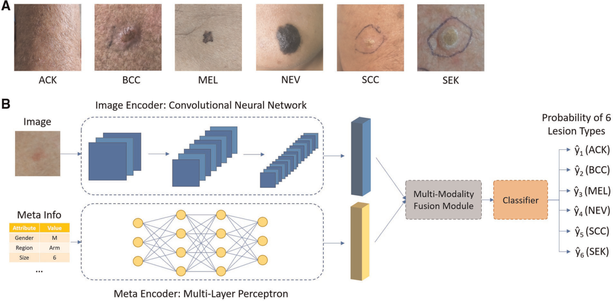
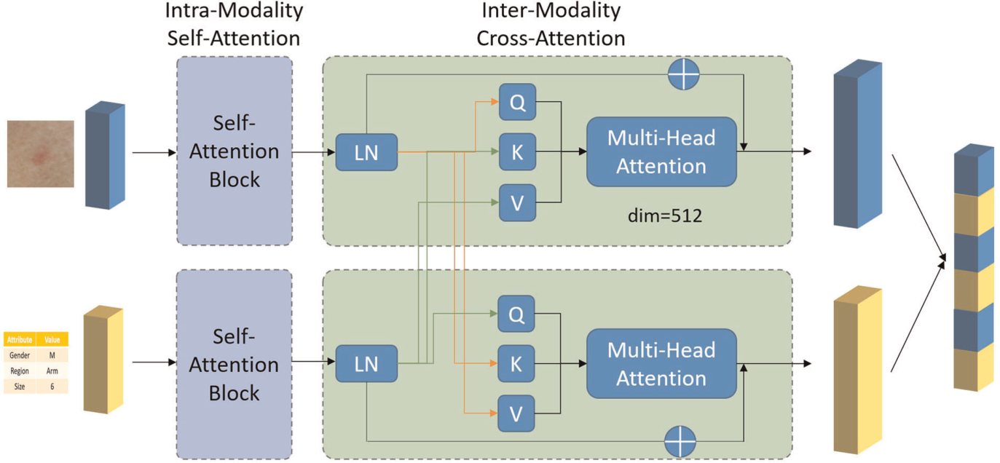
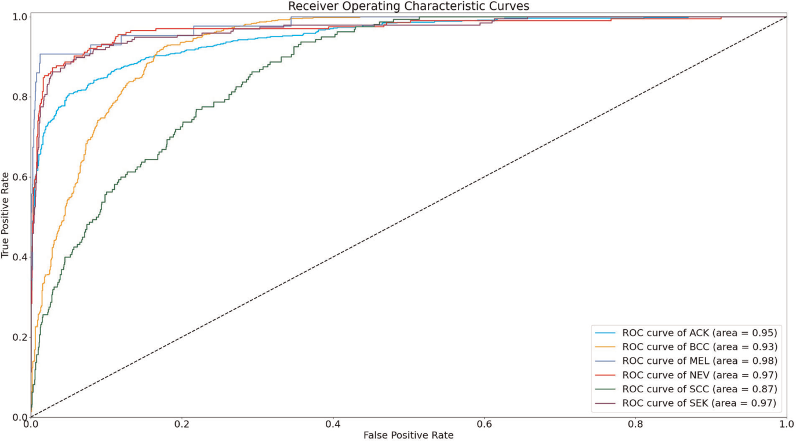
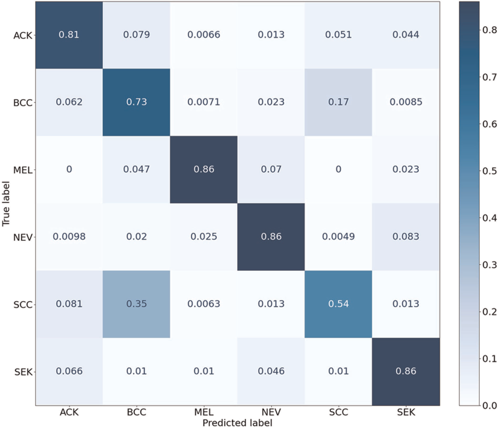

# 스마트폰 임상 이미지와 메타데이터를 이용한 피부 병변 진단용 딥러닝 기반 멀티모달 융합 모델

- 원문 PDF: `fsurg-09-1029991.pdf`
- 구성 원칙: PDF 원문을 논문 섹션 구조에 맞춰 재배치하고, 수식은 LaTeX로 별도 복원했다.

TYPE 오리지널 리서치 PUBLISHED 04 2022년 10월 | DOI 10.3389/fsurg.2022.1029991

스마트폰을 이용한 피부 병변 진단을 위한 딥러닝 기반 멀티모달 융합 모델은 수집된 임상 영상과 메타데이터를 수집하였다.

중국 중앙남대 건중 교수.

시진핑, 필립 헬스케어, 중국 페이원민, 중일 친선 병원, 중국 중국, 중국, 일본, 중국·중국·중국, 중국 등 4개국, 중국 및 중국·일본·중국과 중국·미국·중국 등 3개국, 일본·일본, 중국(중국), 중국, 미국, 중국

추빈오우 1,2, 시통주3, 룽화양4, 웨이일장2, 하오양허2, 원준간5, 웬타오천5, 신치진5, 웨이뤄1*, 샤오빙피3*, 지화리3

*CORRESPONDENCE Jiehua Li jiehuali_fs@163.com Xiaobing Pi pxbingice@163).com Wei Luo luowei_421@163입니다.com

이 작가들은 이 작업에 똑같이 기여했습니다.

SPECIALTY SECTION 이 기사는 수술의 프런티어 저널의 섹션인 재건 및 성형 수술에 제출되었다.

소개: 피부암은 가장 흔한 암 유형 중 하나이다. 대중에 대한 접근 가능한 도구는 악성 병변을 선별하는 데 도움이 될 수 있다. 방법: 이미지 데이터와 메타데이터로부터 정보를 추출하기 위한 2개의 인코더로 심층 신경망을 개발하였다. 이미지 특징과 메타 특징을 효과적으로 결합하기 위해

우리의 모델은 수신기 작동 특성 곡선 아래 정확도, 균형 잡힌 정확도 및 면적 측면에서 다른 메타데이터 융합 방법을 능가했으며, 평균값은 0.768 ± 0.022, 0.775 ± 0.0122 및 0.947 ± 0.007이다. 결론: 피부 병변 진단을 위한 스마트폰 수집 이미지와 메타데이터를 사용한

RECEIVED 28 2022년 8월

2022년 9월 15일에 개시된다.

PUBLISH 04 2022년 10월

CITATION Ou C, Zhou S, 양 R, 장 W, He H, 간 W, Chen W, Qin X, Luo W, Pi X 및 Li J(2022) 스마트폰을 이용한 피부 병변 진단을 위한 딥러닝 기반 멀티모달 융합 모델. 전면. 수표 9:10

COPYRIGHT © 2022 Ou, Zhou, Yang, Jang, He, 간, Chen, Qin, Luo, Pi 및 Li. 이것은 Creative Commons Attribution License(CC BY)의 조건으로 배포된 공개 액세스 기사이다. 본 논문의 원본 출판

## 키워드

딥 러닝 - 인공 신경망, 멀티모달 융합, 메타데이터, 피부암, 주의력, 신경망.

## 서론

피부암은 암의 가장 흔한 종류 중 하나로, 2020년(1월) 전 세계에서 진단된 피부암의 수는 120만 건에 달하며, 피부 암은 피부 세포가 손상되거나 피부 세포의 비정상적인 성장에 의해 발생하며, 이는 자외선, 화학 발암 물질, 방사능에 과도하게 노출되는 것과 밀접한 관련이

임상 피부 이미지를 환자 임상 데이터와 효과적으로 융합하기 위한 데이터 융합 전략에 기초한 멀티모달 데이터 융합 진단 네트워크(MDFNet) 프레임워크. Yap et al.(15)는 자동화된 피부 병변 진단의 성능을 향상시키기 위해 메타데이터에 대한 1D 컨볼루션의 시퀀스를

우리는 메타데이터가 이미지의 해석을 안내할 수 있는 추가 정보를 제공한다고 주장했다. 유사하게, 이미지 특징들은 또한 메타데이터의 이해를 유도할 수 있는 고유한 정보를 포함한다. 두 데이터 양식은 질병 분류와 가장 관련된 특징을 더 잘 밝히기 위해 서로를 용이하게 할 수 있다. 따라서 우리는 피부 병변 진단을 위한

병변 이미지를 암과 비암의 두 범주로 나눈 유전자 알고리즘(GA) 및 신경망 알고리즘에 기초한 피부암 검출 방법을 제안했다. 카루체(8)는 피부 질환의 분류를 위해 사전 훈련된 심층 CNN 아키텍처 VGG-16으로부터 심층 특징을 추출하고 78%의 정확도를 달성

## 방법

## 모델 개발

의료 진단에서 임상의는 일반적으로 다수의 정보 소스에 직면하게 된다. 그러한 정보는 일반적으로 의료 이미지 및 메타데이터(이미지의 형태가 아닌 임상 또는 인구통계학적 지원 정보)를 포함한다. 다양한 정보 소스로부터 정보를 결합하는 가장 간단한 방법은 채널 결합이다. 그러나, 이미징 데이터는 일반적으로 메타데이터보다

## 실험 설명

본 연구에서는 PAD-UPES-20에서 제공된 이미지와 메타 정보를 실험 데이터(17)로 사용했다. 데이터는 에스피리토 산토 연방대학(UFES)의 피부과 및 수술 지원 프로그램에서 얻었으며 모든 샘플은 환자의 피부 병변을 대표하며 이미지와 메타 데이터로 구성되었다. 데이터

다양한 유형의 피부 병변이 제공된다. 각 이미지는 또한 연령, 병변 위치, 피츠패트릭 피부 유형 및 병변 직경을 포함하여 최대 21개의 임상 특성을 포함한다. 데이터 세트에서, 2,298건의 사례 중 730건은 활성각화증(ACK), 845건은 기저

## 모델 구성

피부 병변 유형을 분류하기 위해, 각 샘플에는 ximg로 표시되는 스마트폰 사진 및 그에 수반되는 메타 정보가 제공된다. ResNet-50과 같은 컨볼루션 신경망이 스마트폰 이미지에서 특징을 추출하기 위해 사용된다. 메타데이터는 다음과 같이 전처리된다: 수치 특징들은 동일하게 유지

TABLE 1 메타 정보 속 속성에 대한 설명.

메타변수 Description P 값

흡연 <0.001.

음주 0.476.

아버지 나라 환자의 아버지는 <0.001>에서 온 나라.

모국 환자의 어머니는 0.012에서 어느 나라입니까?

나이 <0.001.

성별 0.032

암 병력 환자 또는 가족 중 누군가가 과거 0.821년 동안 모든 유형의 암 병력이 있는 경우

피부암 과거력 환자 또는 가족 중 누군가가 과거 피부암의 과거력이 있는 경우 0.067.

농약 환자가 0.001 미만의 농약을 사용하는 경우

오수 시스템 환자가 집에서 오수 시스템에 액세스할 수 있는 경우 0.019

파이프 워터 환자가 집에서 파이프 워터 액세스를 했다면 0.029.

프랙트릭 피부 타입 <0.001>에 적합합니다.

지역 생활 영역 0.598

직경 1 병변의 수평 직경 <0.001.

직경 2 병변의 수직 직경 <0.001.

병변이 0.001 미만이면 가려움.

병변이 최근에 성장했다면 <0.001>

병변이 0.001 미만 아플 경우 따끔합니다.

병변이 최근에 변경되면 <0.001>

출혈 병변이 0.001 미만을 피었다면

승강 병변의 승강이 0.001 미만이면

본 발명은 누락된 정보를 추출하기 위해 xmeta로 표시되는 메타 정보로부터 다층 퍼셉트론을 적용하였다. 본 발명의 목적은 입력된 이미지와 메타 정보를 통해 기저 세포 암종(BCC), 편평 세포암(SCC), 광선각화증(ACK), 지루

$$
\hat{y}=p\left(y=c\mid x_{\mathrm{img}},x_{\mathrm{meta}}\right)\tag{1}
$$

네트워크의 전체 설계는 그림 1에 나와 있다. 이미지 인코더와 메타 인코드는 각각 이미지와 메타 정보로부터 특징을 추출한다. 추출된 특징은 멀티모달 융합 모듈에 의해 함께 융합되고 완전히 연결된 레이어로 구성된 분류기 모듈로 전달된다. 그러나 이미지 및 메타 정보를 결합하는 가장 간단한

두 양식 사이의 이러한 고유 연결을 이용하기 위해, 주의 기반 다중 양식 융합 모듈이 제안된다. 기본적으로, 주의 메커니즘은 다른 특징에 다른 가중치를 할당하는 것이다. 가중치가 더 큰 특징은 진단 프로세스에서 더 중요하다고 간주된다. 이러한 정보가 메타 데이터로서 이용될 때, 다른 관련 없는 질병의 예측

모달리티 내 자기 주의

각각의 모달리티(예를 들어, 이미지 내의 이미지 배경)에는 관련 없는 정보가 존재할 수 있다. 신경망을 혼동하기 위해 관련 없는 정보를 피하고, 네트워크가 키 특징에 초점을 맞추도록 더 잘 안내하기 위해, 다중-헤드 자기 주의 모듈이 두 특징에 각각 적용된다. 전형적인 주의 모듈

도 1 (A) 서로 다른 유형의 피부 병변의 전형적인 이미지; (B) 제안된 네트워크의 전체 네트워크 아키텍처.

> 그림 내부 텍스트 번역:
> - `NEV` → NEV.
> - `ACK` → ACK.
> - `BCC` → BCC
> - `MEL` → MEL
> - `SCC` → SCC
> - `SEK` → SEK.
> - `Image Encoder:Convolutional Neural Network` → 이미지 인코더: 컨볼루션 신경망
> - `Image` → 이미지.
> - `Probabilityof 6` → 6의 확률.
> - `LesionTypes` → 병변형상.
> - `1 (ACK)` → 1(ACK)
> - `2 (BCC)` → 2(BCC)
> - `Multi-Modality` → 멀티 모달리티
> - `y3 (MEL)` → y3(MEL)
> - `Classifier` → 분류기
> - `FusionModule` → 퓨전 모듈
> - `+y4 (NEV)` → +y4(NEV)
> - `MetaInfo` → 메타인포
> - `Attribute` → 속성.
> - `Value` → 가치.
> - `ys (SCC)` → ys(SCC)
> - `Gender` → 성별.
> - `Region` → 지역.
> - `Arm` → 팔.
> - `ye(SEK)` → 예(SEK)
> - `Size` → 사이즈.
> - `Meta Encoder:Multi-LayerPerceptron` → 메타 인코더: 다중-레이어 퍼셉트론

가중된 특징 x'를 구하기 위해 Q와 K의 점-생성물로부터 얻은 가중치는 다음과 같다.

$$
Q=W_qx,\quad K=W_kx,\quad V=W_vx\tag{2}
$$

자가 주의 모듈을 통과한 후, 우리는 암 관련 정보에 높은 가중치를 부여하고 관련 없는 정보에 낮은 가중치를 부여하는 가중치 ximg와 xmeta를 얻었다.

모달리티 간 교차 주목

이 모듈은 두 개의 경로를 포함한다. 하나의 경로는 이미지 특징으로부터 대부분의 관련 정보의 선택을 안내하기 위해 메타 정보를 사용하도록 설계된다. 다른 경로는 메타 데이터로부터 대부분의 관련 정보 선택을 안내하도록 이미지 특징을 사용하도록 다른 방식으로 설계된다: 첫 번째 경로에 대해, 교차 관심 모듈은 다음과 같이 표시된

$$
Q_1=W_{q1}x'_{\mathrm{img}},\quad K_1=W_{k1}x'_{\mathrm{meta}},\quad V_1=W_{v1}x'_{\mathrm{img}}\tag{4}
$$

두 번째 파트의 경우 xmeta 프로젝션의 입력 벡터 Query와 Value, ximg의 Key로 교차 주의 모듈을 설계하여 아래와 같이 나타내었다.

$$
Q_2=W_{q2}x'_{\mathrm{meta}},\quad K_2=W_{k2}x'_{\mathrm{img}},\quad V_2=W_{v2}x'_{\mathrm{meta}}\tag{6}
$$

## 학습 및 평가 절차

다른 방법과의 공정한 비교를 보장하기 위해, 우리는 안드레의 작업(14)과 같은 실험 설정을 따랐다. 우리는 정확도(ACC), 균형 정확도(BACC) 및 곡선 아래의 집합 면적(AUC)을 포함한 다음의 메트릭을 계산함으로써 다른 방법의 성능을 측정했다. 균형 정확도는

도 2 제안된 멀티모달 융합 모듈의 네트워크 아키텍처.

> 그림 내부 텍스트 번역:
> - `Intra-Modality` → 인트라 모디티.
> - `Inter-Modality` → 모디티간.
> - `Self-Attention` → 자기 주의.
> - `Cross-Attention` → 교차 관심.
> - `Self-` → 자기 자기.
> - `Multi-Head` → 멀티 헤드.
> - `Attention` → 주목.
> - `LN` → LN
> - `Block` → 차단.
> - `dim=512` → dim=512
> - `Attribute` → 속성.
> - `Value` → 가치.
> - `Gender` → 성별.
> - `Region` → 지역.
> - `Arm` → 팔.
> - `Size` → 사이즈.

데이터의 불균형한 클래스 분포에 의해 편향된 각 경쟁 방법, 즉 베이스라인 특징 연결, 메타넷, 메타블록 및 제안된 방법에 대해 라벨의 빈도로 계층화된 5배 교차 검증이 적용되었다. 각 분할에서, 전체 데이터 세트는 5개의 폴드로 분할된다. 각 폴드

학습 중에 수평 및 수직 플립핑, 컬러 지터링, 가우스 노이즈 및 랜덤 콘트라스트와 같은 데이터 증강이 실시간으로 적용되었다. 모든 코드는 Python 3.6.10으로 작성되었다. PyTorch 프레임워크(v1.7.0)는 신경망을 구성하여

## 통계 분석

메타데이터 속성은 일변량 분석에 의해 조사되었다. 연속 변수는 정상적으로 분포되는지 여부를 결정하기 위해 먼저 샤피로-윌크 검정에 의해 조사된다. 학생 t 검정(정규 분포 파라미터에 대한) 또는 Mann-Whitney U 검정(비정규 분포 매개변수에 대해)

TABLE 2 서로 다른 방법의 성능 비교.

## ACC
BACC
AUC

메타데이터 0.616 ± 0.6051 ± 0.651 ± 0.050 0.901 ± 0.007

연결 0.741 ± 0.014 0.728 ± 0.029 ± 0.929 ± 0.006

메타블록 0.735 ± 0.013 0.765 ± 0.017 0.935 ± 0.004.

메타넷 0.732 ± 0.054 ± 0.742 ± 0.019 0.936 ± 0.006

우리의 방법 0.768 ± 0.022 ± 0.775 ±0.022 0.947 ± 0.007

TABLE 3 서로 다른 방법에 대한 Wilcoxon 쌍 테스트의 결과.

P값 짝짓기.

메타데이터가 없습니다 - 우리의 방법 <0.001>

메타블록 - 우리의 방법 0.028

메타넷 - 우리의 방법 0.035

파라메트릭 프리드먼 테스트와 Wilcoxon 테스트가 사용되었다. P < 0.05는 통계적으로 유의한 것으로 간주된다. 통계 분석은 SPSS(IBM, 버전 26)로 수행되었다.

## 결과

상이한 병변 유형들 사이의 메타데이터 속성들의 차이의 통계적 유의성은 표 1에 나타나 있다. 대부분의 메타 데이터 속성들은 상이한 유형의 피부 병변들과 유의하게 상관된다. 각 방법들의 평균 5배 교차 검증 성능은 표 2에 제시된다. 우리의 제안된 방법은 최상의 성능을 달성하였다.

도 3 다양한 유형의 피부 병변에 대한 수신기 작동 특성 곡선.

> 그림 내부 텍스트 번역:
> - `ReceiverOperatingCharacteristicCurves` → 리시버(ReceiverOperatingCharacteristicCurves)
> - `1.0` → 1.0
> - `0.8` → 0.8
> - `00.6` → 00.6
> - `Rat` → 쥐.
> - `True Positive` → 트루 포지티브.
> - `0.4` → 0.4
> - `0.2` → 0.2
> - `ROC curve ofACK (area=0.95)` → ROC curve ofACK (area=0.95)
> - `ROC curve ofBCC (area =0.93)` → ROC curve ofBCC (area =0.93)
> - `ROCcurveofMEL(area=0.98)` → ROCcurveofMEL(area=0.98)
> - `ROCcurveofNEV (area=0.97)` → ROCcurveofNEV (area=0.97)
> - `ROCcurveofSCC(area=0.87)` → ROCcurveofSCC(area=0.87)
> - `ROCcurveofSEK(area=0.97)` → ROCcurveofSEK(area=0.97)
> - `8.0` → 8.0
> - `0.6` → 0.6
> - `FalsePositiveRate` → 위양성률.

## 논의

실패한 사례를 추가로 조사했다. 그림 4는 평균 혼동 행렬을 보여주며, 이는 SCC가 종종 BCC로 오진되기 때문에 정확도가 가장 낮다는 것을 알 수 있다. 임상적으로, SCC는 스마트폰에서 수집되기 때문에 이해 가능하다. 더모스코피를 사용하면 진단 정확도를 향상시킬 수 있다(22).

우리는 스마트폰에서 얻은 임상 이미지와 메타 데이터를 사용하여 피부 병변을 진단하기 위한 딥러닝 모델을 개발했다. 우리는 이미지 및 메타데이터를 더 잘 융합하기 위해 모달리티 내 자체 주의력과 모달리 티 간 교차 주의력의 조합을 사용하는 새로운 모듈을 제안했다. 우리는 메타데이터 융합에 대한 이전 작업(M

둘째, 주의가 일방향(메타데이터 특징 이미지 특징)인 이전 작업과 달리, 주의 메커니즘은 양방향으로 작동한다. 메타데이터 특징은 이미지 특징에 대한 주의를 안내하는 데 사용되며, 그 반대의 경우 이미지 특징도 메타데이터 특징의 주의를 유도하는 데 사용된다. 이는 인공지능을 피부

도 4 다양한 유형의 피부 병변의 혼란 매트릭스.

> 그림 내부 텍스트 번역:
> - `0.8` → 0.8
> - `0.81` → 0.81
> - `0.0066` → 0.0066
> - `0.013` → 0.013
> - `ACK` → ACK.
> - `0.079` → 0.079
> - `0.051` → 0.051
> - `0.044` → 0.044
> - `0.7` → 0.7
> - `0.73` → 0.73
> - `0.062` → 0.062
> - `0.0071` → 0.0071
> - `0.023` → 0.023
> - `0.17` → 0.17
> - `BCC` → BCC
> - `0.0085` → 0.0085
> - `0.6` → 0.6
> - `0.047` → 0.047
> - `0.86` → 0.86
> - `0.07` → 0.07
> - `MEL` → MEL
> - `0.5` → 0.5
> - `label` → 라벨.
> - `Truel` → 트루엘.
> - `0.4` → 0.4
> - `0.02` → 0.02
> - `0.025` → 0.025
> - `0.0098` → 0.0098
> - `0.0049` → 0.0049
> - `NEV` → NEV.
> - `0.083` → 0.083
> - `0.3` → 0.3
> - `0.35` → 0.35
> - `0.0063` → 0.0063
> - `0.54` → 0.54
> - `0.081` → 0.081
> - `SCC-` → SCC-
> - `0.2` → 0.2
> - `0.1` → 0.1
> - `0.01` → 0.01

TABLE 4 제안된 방법의 절제 연구.

피부 병변 진단을 위한 유망한 모델을 개발했지만, 우리 연구에 몇 가지 제한 사항이 있다.

w/o 자기 주의 0.757 ± 0.026 ± 0.765 ± ±0.025 0.938 ± 0.008

w/o 교차 주의 0.743 ± 0.021 ± 0.759 ± ±0.021 0.936 ± 0.006

풀 모듈 0.768 ± 0.022 ± 0.775 ± ±0.022 0.947 ± 0.007

스마트폰은 많은 환자에게 더 접근하기 쉬운 도구이다. 또한, 많은 환자들은 피부를 질환의 초기에 클리닉 방문을 예약하는 대신 온라인으로 조언을 구하는 경향이 있어 치료를 지연시키고 좋지 않은 예후를 초래할 수 있다. 현재 연구에서 개발된 모델은 스마트폰 기반 자동 선별 앱에 통합될 수 있으며, 이는 고위험 병변을 식별하고

포함된 피부 병변 유형의 수는 실제 시나리오에 비해 상대적으로 적다. 이는 향후 더 많은 질병의 데이터를 수집함으로써 개선될 수 있다. 모델이 임상 실습에 투입되기 전에 다른 부위에서 수집된 데이터를 이용한 외부 검증이 필요하다.

## 결론

우리는 스마트폰에서 얻은 임상 이미지와 메타 정보를 사용하여 피부 병변을 진단하기 위한 딥러닝 모델을 개발했다. 이미지 데이터와 메타데이터를 더 잘 융합하기 위해 모달리티 내 자체 주의와 모달리 티 간 교차 주의로 구성된 새로운 모듈이 제안되며 다른 최첨단 방법을 능가하는 것으로 나타났다. 제안된 모델은 피부

## Data availability statement

연구에 제시된 원본 기여는 기사/보충 자료에 포함되어 있으며 추가 문의는 해당 저자/에게 의뢰할 수 있다.

## 저자 기여

CO, SZ, RY는 연구의 개념과 설계에 기여했습니다. CO, HH, WJ는 코드와 분석을 완료했습니다. SZ와 RY가 통계 분석을 수행했다. CO와 HH는 첫 번째 데이터를 작성했습니다.

## 참고문헌

1. Ferlay J, Colombet M, Soerjomataram I, Parkin DM, Piñeros M, Znaor A 등 2020년 암 통계: 개요. Int J 암(2021) 149 (4):778–89. Doi: 10.

2. Khan IU, Aslam N, Anwar T, Aljameel SS, Ullah M, Khan R 등. efcientnet 및 극한 구배 부스팅을 사용한 피부암에 대한 원격 진단 및 트리징 모델. 복잡성. (2021) 2021:55916

3. 딜다르 M, 아크람 S, 이르판 M, 칸 HU, 람잔 M, 마흐무드 AR 등 피부암 검출: 딥러닝 기술을 이용한 검토. (2021) 18(10):5479. Doi: 10.3390/이저프18105479

4. 쿠에바 WF, 무노즈 F, 바스케스 G, 델가도 G. 컴퓨터 비전을 통한 피부암 "흑색종" 검출. 2017년 IEEE XXIV 페루 쿠스코에서 개최된 전자, 전기 공학 및 컴퓨팅(INTERCON), 2017년 8월

5. Nachbar F, Stolz W, Merkle T, Cognetta AB, Vogt T, Landthaler M 등. 피부경 검사의 ABCD 규칙: 의심스러운 멜라닌 세포 피부 병변의 진단에서 높은 전향적 가치. J Am Acad Dermat

원고 초안. SZ, RY, WG, WC 및 XQ는 원고의 섹션을 작성했습니다. WL, XP 및 JL은 연구를 감독했습니다. 모든 저자들은 기사에 기여하고 제출된 버전을 승인했다.

자금 지원

이번 연구는 중국 국립자연과학재단(82002913), 광둥기초·응용기초연구재단(2021A1515011453, 2022A151515012160, 2021B1515120036, 2022 A15150120245), 광둥성 의학과학연구재단(A2022293)

이해상충.

저자들은 잠재적 이해 상충으로 해석될 수 있는 어떠한 상업적 또는 재정적 관계가 없는 상태에서 연구가 진행되었다고 선언한다.

출판사의 메모.

이 글에서 표현된 모든 청구는 전적으로 저자의 것이고 반드시 소속 기관의 청구 또는 발행인, 편집자 및 리뷰어의 청구를 대변하는 것은 아니다. 이 글에서 평가할 수 있는 제품 또는 그 제조자가 할 수 있는 청구는 발행인이 보증하거나 보증하지 않는다.

7. 마흐보드 A, 셰퍼 G, 왕 C, Ecker R, Ellinge I. 하이브리드 심층 신경망을 이용한 피부 병변 분류. 오디오, 스피치 및 신호 처리에 관한 ICASSP 2019-2019 IEEE 국제회의의 진행: 영국 블론 2019-17 2019년 5

8. 칼루체 S. 비전 기반 피부암 분류는 딥러닝을 사용하여(2016). https://www.semanticscholar.org/paper/Vision 기반 피부-암 사용-Kalouche/b57ba909756462d812dc20fca157

9. Mengistu AD, Alemayehu DM. RBF 및 SOM을 이용한 피부암 진단 및 인식을 위한 컴퓨터 비전. Int J Image Process.(2015) 9:311–9. Doi: 10.1007/s00432-022-04180-1

10. Bisla D, Choromanska A, Stein JA, Polsky D, Berman R. 딥러닝을 통한 자동화된 흑색종 검출: 데이터 정제 및 증강. arXiv.(2019) 2720 내지 28. doi: 10.48550/arXiv

11. 압델할림 ISA, 모하메드 MF, 마흐디 YB. 자기 주의 기반 점진적 생성 적대적 네트워크를 사용하여 피부 병변에 대한 데이터 증강. 응용 프로그램을 가진 전문가 시스템. (2021) 165:113922. Doi: 10.48550/arXiv.

12. Cai G, Zhu Y, Wu Y, Jang X, 예 J, Yang D. 피부 질환 분류를 위한 이미지 및 메타데이터를 융합하는 멀티모달 변압기. Vis Comput. (2022): 1 내지 13. Doi: 10.1007/s00

13. Chen Q, Li M, Chen C, Zhou P, Lv X, ChenC. MDFNet: 피부 영상 및 임상 데이터를 기반으로 한 멀티모달 융합 방법을 피부암에 적용한다.

분류. J 암 Res Clin Oncol.(2022) 1 내지 13.doi: 10.1007/s00432-02204180-1,2,3,4,7,4-m2,5-m3,7-m4,8-m9

14. Pacheco AG, Krohling RA. 피부암 분류에 적용되는 딥러닝 모델에서 이미지와 메타데이터를 결합하는 주의 기반 메커니즘. IEEE J 바이오메드 건강 정보(2021) 25(9):3554-63. DOI: 10.1109/ JBHI.202

15. Yap J, Yolland W, Tschandl P. 딥러닝을 이용한 멀티모달 피부 병변 분류. Exp Dermatol. (2018) 27(11) : 1261-7. Doi: 10.1111/exd.13777.

16. Li W, Zhuang J, Wang R, Zhang J, Z정 W-S. 피부 질환 진단을 위한 메타데이터 및 피부경 영상을 융합한다. 2020 IEEE 17차 생체 의학 영상에 관한 국제 심포지엄 (ISBI)에서. I EEE (2020). pp.

17. Pacheco AG, 리마 GR, Salomo AS, 크로링 B, Biral IP, de Angelo GG, et al. PAD-UFES-20: 스마트폰에서 수집된 환자 데이터 및 임상 이미지로 구성된 피부 병변 데이터세트. 데이터 브리프(2020

19. 두아르테 AF, 수사-핀토 B, 하네케 E, 코레리아 O. 과거 피부암 병력이 있는 환자의 새로운 피부 신생물의 발병 위험 인자: 생존 분석. Sci Rep.(2018) 8(1):1-6. DOI: 10.1038/

20. 카라즈미 P, 칼리아 S, 루이 H, 왕 Z, 리 T. 데이터 기반 특징 학습 및 환자 프로파일을 통한 기저 세포 암종 검출을 위한 특징 융합 시스템. 스킨 레스 테크놀 (2018) 24(2):256-64. 도리: 10.

22. 류TH, 계H, 최JE, 안HH, 계YC, 서 SH. 임상 진단에서 기저 세포 암종과 편평 세포 암종 사이의 혼동을 일으키는 특징이 있다. Ann Dermatol. (2018) 30(1):64-70. Doi: 10.

## 수식 복원

Scaled dot-product attention:

$$
x'=\mathrm{softmax}\left(\frac{QK^{T}}{\sqrt{d}}\right)V\tag{3}
$$

영상 경로 출력:

$$
x''_{\mathrm{img}}=\mathrm{softmax}\left(\frac{Q_1K_1^{T}}{\sqrt{d}}\right)V_1\tag{5}
$$

메타데이터 경로 출력:

$$
x''_{\mathrm{meta}}=\mathrm{softmax}\left(\frac{Q_2K_2^{T}}{\sqrt{d}}\right)V_2\tag{7}
$$
