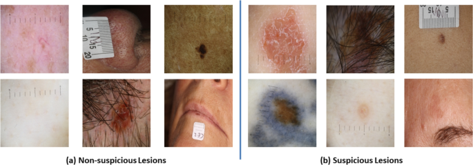
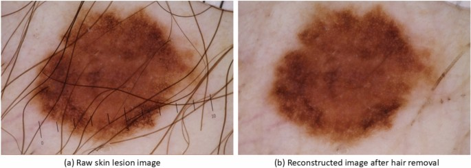
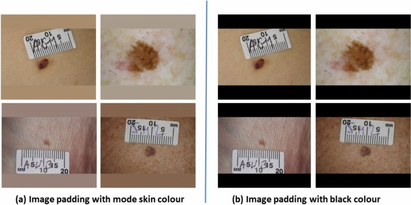
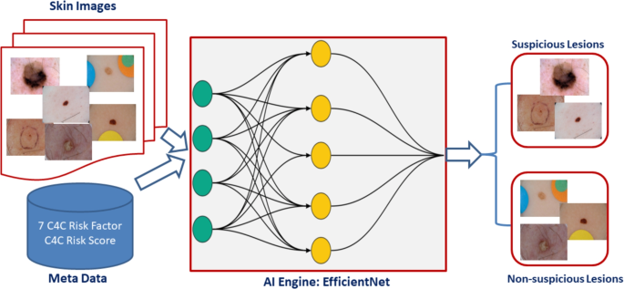
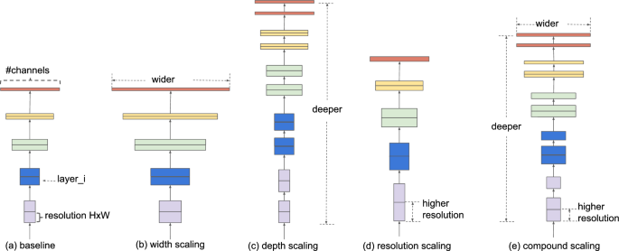
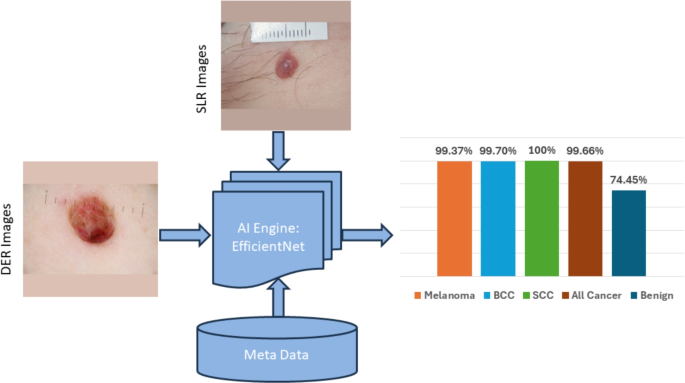

# 환자 메타데이터와 피부 병변 영상의 융합 및 딥러닝을 통한 피부암 탐지 고도화

- 원문 PDF: `s41598-025-26392-4.pdf`
- 구성 원칙: PDF 원문을 논문 섹션 구조에 맞춰 재배치하고, 수식은 LaTeX로 별도 복원했다.

환자 메타데이터와 피부 병변 영상의 딥러닝 및 융합을 통해 피부암 검출을 향상시킵니다.

## OPEN

샤피컬 이슬람1,2, 고든 C. 위스하트1,3, 조셉 월스1,4, 퍼홀1,5, 알바 G. 세코 데 헤르레라6, 존 Q. 간2 & 하이더 라자2, ,

제안된 접근법을 평가하기 위해, 우리는 영국 전역의 민간 피부암 진단 센터 네트워크에 참석한 19,295명의 환자로부터 병변 크기, 병변 색상, 병변을 형상화한 모양, 환자 연령 및 성별과 같은 22개의 메타 특성을 가진 79,246개의 피부 병변 이미지를 수집했다.

개발된 AI 모델의 결정은 다수의 투표 기법을 통해 융합되었으며, 이는 99.50 ± 1.18%의 민감도와 82.72 ± 1.64%의 특이성을 달성하여 이미지 데이터에만 의존하는 최첨단 방법을 크게 능가한다. 또한, 개발된 AI 프레임워크는 의심스러운 피부 병변의 검출에 대한 매우 큰 잠재력을

약칭 NHS 국민 건강 서비스 AI 인공 지능 NMSC 비 흑색종 피부암 BCC 기저 세포 암종 7PCL 7점 체크리스트 ML 머신 러닝 KNN K-근처 SVM 지원 벡터 DL 딥러닝 CNN 컨볼루션 신경망 ISIC 국제

1Check4Cancer Ltd., 영국 케임브리지, 에식스 대학교, 콜체스터, 컴퓨터 과학 및 전자 공학 2School of Computer Science and Electronic Engineering, 영국 캠브리지, 앤글리아 루스킨 대학교, 4Fitzwilliam Hospital, 영국 피터버러, 5

DSLR 디지털 단일 렌즈 반사 카메라 DER 더모스스코픽 카메라 그레이드-CAM 그레이드 클래스 활성화 맵 ACC 균형 잡힌 정확도 AUC 영역 곡선 HCP 건강 관리 전문가 X-AI 설명 가능한 AI DINO 자체 증류, 라벨이 없다.

2000년대 초반에, 피부암은 종종 중간 성능(감도 73.3%, 특이도 57.1%)을 보이는 7PCL과 같은 기존 기술을 사용하여 진단되었다. 이 연구들과 같은 연구들은 피부경 피부 병변 이미지를 분석하는 데 집중했고, 처음에는 병변을 분할한 다음 수작업 특징을 추출했으며, 이는 기본

또 다른 연구15는 ISIC 2016 데이터세트에 VGGNet을 사용했다. 그들은 미세 조정 방법으로 81%의 정확도를 달성했다. 위에 따르면, 16은 상이한 유형의 병변 사이의 클래스 내 변화 및 클래스 간 유사성을 강조하여 데이터세트의 크기를 증가시켰다. 그들은 또한 여러 이미지 증강 기술을 구현

최근 몇 년 동안, 연구자들은 또한 피부암 검출을 위해 ViT를 사용하여 최첨단 성능(19,20)을 달성했다. 그러나, 제한된 데이터 세트에 대한 ViT 트레이닝은 여전히 진행 중인 과제로 남아 있다.

최근 연구21은 피부경 이미지를 사용하는 대신 사내 개발된 모바일 앱을 통해 스마트폰을 통해 촬영한 피부 병변 이미지를 사용하여 환자 연령, 신체의 병변 위치, 병변 가려움증, 출혈, 통증, 최근 성장, 패턴 변화, 상승 등 8가지 임상 특징을 수집했다. 구글넷, ResNet,

비교 분석을 위해 추출된 특징들을 임상 정보와 결합하고 추론을 위해 ML 분류기에 공급했다. 그들은 임상 정보가 분석에 포함될 때 균형 잡힌 정확도가 전반적으로 7% 증가하는 것을 관찰했다. 마찬가지로, 22년 연구는 두 가지 흑색종 및 다중 등급 암 검출에 대한 피부경, 거시 및 임상 메타

이 데이터 세트에는 환자의 연령, 체질량 지수(BMI), 민족성 및 45만 명 이상의 환자의 피부 병변에서 나온 여러 병변 특성과 같은 환자 세부 정보가 포함된다. 그들은 이진 암 상태 분류를 위한 기본 피드 포워드 신경망을 사용하여 검증 세트에서 86.2% 민감도와 62.7% 특이성을

이전 연구24에서, 우리는 피부암 검출에서 환자 메타데이터의 가능성을 조사했다. 우리는 5개의 AI 모델의 앙상블을 통해 모든 피부암 아형(흑색종, SCC, BCC)의 개발을 담당하는 22개의 메타피처 풀에서 "Check4Cancer(C4C) 위험

"C4C 위험 점수"만 사용하면 의심과 의심이 없는 피부 병변을 분류하는 데 68.90%의 균형 잡힌 정확도와 76.09%의 민감도를 달성할 수 있어 기존 7PCL7 위험 점수보다 상당히 높다.

또한 "C4C 위험 인자"를 7PCL 및 윌리엄스 위험 인자와 융합하여 균형 잡힌 정확도 73.18% 및 민감도 85.24%로 최고 성능을 달성하는 최상의 특징 조합을 찾았다. 본 연구에서는 DL 모델을 사용하여 새롭게 확인된 피부 위험 인자 및 가중 위험 점수와 병변 이미지의 융합을 조사

더모스코픽 이미지는 이제 피부암 검출에 널리 사용된다. AI 기반 초기 피부암 감지는 연구의 활발한 영역이며 최첨단 성능27을 달성했다. 문헌에서, 대부분의 이전 피부암 분류 연구는 DL 모델과 함께 이미지 데이터에만 초점을 맞추고 환자 메타데이터와 이미지 데이터의 융합을 통해 피부암

언급된 연구 공백을 메우고 환자 메타데이터와 이미지 데이터를 함께 활용하여 피부암 검출 성능을 더욱 향상시키기 위해 융합된 메타데이터 및 피부 병변 이미지를 의심 또는 의심되지 않는 범주로 분류하기 위한 AI 프레임워크를 고안했다. 이 연구 작업은 다음과 같은 주요 기여를 했다.

1. 전국 19,295명의 환자로부터 79,246개의 피부 병변 영상 및 메타데이터 수집 및 평가

영국 민간 피부 진단 클리닉의 네트워크. 각 병변에 대해 DER 이미지와 DSLR 이미지를 사용하여 22개의 메타 특징과 2가지 유형의 이미지를 수집했다. 이러한 요인은 흑색종뿐만 아니라 모든 유형의 피부암에 해당합니다. 2. 환자 메타데이터와 피부 병변 이미지를 결합한 다중 모달 AI 프레임

피부 병변의 분류에 관한 3가지 유형의 AI 모델이 입력 데이터 유형을 변경하여 개발되었다. 궁극적으로 메타데이터와 이미지를 모두 사용한 모델은 99.66 ± 0.28%의 민감도와 74.45 ± 0.80%의 특이도를 달성하여 이미지 데이터만을 사용하는 AI 모델 성능(99.72 ±

피부 병변의 열 지도를 생성하여 의사 결정 투명성을 향상시키기 위해 노력하며, 의료 전문가를 의사 결정 과정에서 지원하기 위해 중요한 AI 설명 능력을 제공한다.

방법 데이터 수집 2015년부터 2022년까지 C4C의 영국 민간 피부암 진단 클리닉 네트워크에 참석한 19,295명의 환자에 속한 39,623개의 피부 병변에서 79,246개의 이미지를 수집했다. 각 피부병변에 대해, 우리는 두 가지 유형의 이미지를 수집했는데, 하나는 피부

의심 및 의심되지 않는 범주에 속하는 피부 병변 이미지의 스냅샷은 그림 1에 표시된 반면, 이전 연구24에 기재된 추가 세부 사항과 함께 22개의 메타 특징을 수집했다. 우리의 데이터 세트에는 28년 영국 기반 유사 연구에서 언급된 바와 같이 Fitzpatrick 피부 유형 I-IV

환자로부터 사전 동의를 얻었다. 모든 실험 프로토콜은 2023년 2월 8일(제1호: ETH2223-0619)에 에식스 대학 연구 윤리 위원회의 승인을 받았다. C4C는 피부암 환자의 암 검진 및 진단 서비스를 제공하는 영국에 등록된 민간 헬스케어 회사이다.

그러나 기존 모델과 공정한 비교를 위해 개발된 AI 모델을 평가하기 위해 조직검사에서 입증된 암 사례만을 고려했습니다.

환자의 아니. 병변의 아니. 영상의 의심 없는 의심 시간 기간

19,295
39,623
79,246
11,258
67,988
2015–2022

표 1. 피부 병변 영상 데이터 수집 요약.

그림 1. 수집된 피부 병변 이미지: (a) 의심되지 않는 병변 및 (b) 의심스러운 병변.

> 그림 내부 텍스트 번역:
> - `15` → 15
> - `(a)Non-suspiciousLesions` → (a) 의심의 여지가 없는 사람들
> - `(b)Suspicious Lesions` → (b) 의심스러운 병변

그림 2. 두 가지 유형의 카메라(피모스코픽 및 DSLR 카메라)는 의심 및 의심되지 않는 피부 병변의 이미지를 캡처하는 데 사용된다. 총 79,246개의 피부병변 이미지와 해당 환자 메타데이터가 의심 및 비 의심 범주로 피부 병변을 분류하기 위해 본 연구에서

> 그림 내부 텍스트 번역:
> - `CapturedwithDSLRCamera` → DSLRCamera로 캡쳐.
> - `CapturedwithDermoscopicCamera` → 더모스코픽 카메라로 캡처된 카메라
> - `15` → 15
> - `Non-suspiciousLesion` → 의심의 여지가 없는 고의.
> - `SuspiciousLesion` → 의심스러운 사생활.

1546개의 흑색종 사례, 4420개의 BCC 사례, 530개의 SCC 사례 및 4762개의 의심 범주에 속하는 기타 의심 사례. 반대로, 몰로 보고된 하위 범주를 가진 상당히 높은 수의 이미지(4만 3,987)는 의심되지 않는 그룹에 속한다. 다른

포괄적인 AI 모델을 구축하는 데 도움이 되도록 다양한 병변 위치에서 수집된 7만 6988개의 의심 이미지(79,246개 중)와 11,258개의 의심 이미지가 있다. 피부경 카메라는 DSLR 카메라보다 확대되고 더 나은 품질 이미지를 제공하지만, 두 카메라 이미지 모두 실제 애플리케이션에서

데이터 전처리 피부 병변 이미지(그림 1과 같이)에는 모발과 자와 같은 인공물이 존재하며, 이는 잠재적으로 AI 모델의 성능을 감소시킬 수 있다고 생각합니다. 이를 해결하기 위해 바르두 등이 사용하는 제모 방법을 구현했습니다. 이 방법은 피부병변 이미지에서 모발을 효과적으로 제거하지만, 시각적

그림 3. 제모 후 피부 병변 영상 재구성.

> 그림 내부 텍스트 번역:
> - `(a)Rawskinlesionimage` → (a) Rawskinlesionimage
> - `(b)Reconstructedimageafterhairremoval` → (b) 모발 제거 후 재구성된 이미지

그림 4. 피부 병변 이미지의 재구성. 원시 이미지 크기: 3.39MB, 해상도: 2848 × 4273 픽셀, 전처리 이미지 크기 : 187KB, 해상도 : 1024 × 1024 픽셀. 육안 검사를 통해 병변 모양이 리사이징 후 왜곡되었을 것으로 예상

> 그림 내부 텍스트 번역:
> - `Pre-processed image` → 전처리된 이미지
> - `Rawimage` → 원본 이미지

제모 후 전처리된 피부 병변 이미지의 예는 그림 3에 제시되어 있다. 육안 검사로 모발이 제거되고 재구성된 이미지는 병변 영역 선명도가 더 우수하여 병변을 의심스러운 범주 또는 의심스럽지 않은 범주로 올바르게 분류하는 데 도움이 되었다.

수집된 원시 피부 병변 이미지의 평균 크기는 3000 × 4000 픽셀의 해상도로 약 5MB이다. AI 모델을 구축하기 위해 이미지를 리사이징하고 1024 × 1024 픽셀의 고해상도로 정사각형 모양으로 변환한다. 이러한 방식으로 이미지를 리샤핑하면 원시 이미지를 단독으로 사용하는 것보다

그러나 이 과정은 병변의 원래 모양을 왜곡하여 그림 4에서 강조된 것처럼 병변을 의심하거나 의심하지 않는 범주로 정확하게 분류하는 데 중요한 특징입니다. 따라서, 우리는 그림 5a와 같이 두 가지 다른 이미지 재구성 접근법을 적응하고 테스트했으며, 여기서 패딩 위치의 픽셀 값은 해당 이미지의 모드

AI 모델 개발 의심 피부 병변 분류를 위한 제안된 멀티 모달 AI 프레임워크의 개요는 그림 6에 요약되어 있다. 모델 개발 동안, 원시 이미지는 1024×1024 픽셀로 재형상되도록 전처리되었고 메타데이터는 문자열에서 명목으로 변환되도록 인코딩

그림 5. 패딩 접근법은 이미지 재구성을 위해 테스트되었다.

> 그림 내부 텍스트 번역:
> - `02` → 02
> - `20` → 20
> - `(a)Imagepaddingwithmodeskincolour` → (a) Imagepaddingwithmodeskincolour.
> - `(b) Imagepadding withblack colour` → (b) 블랙 색상의 이미지 패딩

그림 6. 메타데이터(C4C 위험 인자 및 C4C 위험도 점수) 및 이미지를 기반으로 피부 병변 분류를 의심 그룹 대 의심 그룹으로 분류하기 위한 제안된 AI 프레임워크.

> 그림 내부 텍스트 번역:
> - `SkinImages` → 피부 이미지.
> - `SuspiciousLesions` → 의심스러운 사람들
> - `7C4CRiskFactor` → 7C4CRiskFactor
> - `C4CRiskScore` → C4CRiskScore
> - `MetaData` → 메타데이터.
> - `Al Engine:EfficientNet` → Al 엔진:효율적인 네트워크
> - `Non-suspiciousLesions` → 의심의 여지가 없는 사람들

AI 엔진 이펙트넷-B2는 복합 스케일링 방법을 사용하여 다른 모델을 능가하는 최신 모델 성능을 제공하는 더 효율적인 방법으로 구글31에 의해 개발된 백본 AI 모델 아키텍처로 사용되었다. 이펙트Net은 Fig. 7a와 같이 다른 이미지 크기를 수용하여 더 나은 성능을 얻을 수 있으며,

메타데이터와 이미지는 훈련(80%)과 테스트(20%) 세트로 나뉘었다. 훈련은 AI 모델을 구축하고 최적의 가중치를 찾는 데 사용되었다. 그런 다음 개발된 모델은 테스트 데이터에 대해 평가되었다. 우리의 파이프라인에서, 우리는 트랜스포즈, 플립, 로테이트, 랜덤브라이트니스,

Fig. 7. EfficientNet의 화합물 스케일링은 더 나은 성능을 얻기 위해 상이한 이미지 크기를 수용할 수 있다: (a)는 베이스라인 네트워크 예이고; (b-d)는 네트워크 폭, 깊이 또는 해상도의 한 차원만을 증가시키는 기존의 스케일링이다. (e

> 그림 내부 텍스트 번역:
> - `#channels` → #채널.
> - `wider` → 더 넓어.
> - `deeper` → 더 깊습니다.
> - `layer_i` → 레이어_i.
> - `higher` → 더 높죠.
> - `resolution` → 해상도.
> - `resolution HxW` → 해상도 HxW
> - `...resolution` → ...해결.
> - `(b) width scaling` → (b) 폭 스케일링
> - `(c) depth scaling` → (c) 깊이 스케일링
> - `(d) resolution scaling` → (d) 해상도 스케일링
> - `(a)baseline` → (a) 기준선
> - `(e) compound scaling` → (e) 복합 스케일링

그림 8. AI 프레임워크 구축을 위한 메타데이터와 이미지 데이터의 융합.

> 그림 내부 텍스트 번역:
> - `DER Image` → DER Image
> - `SLR Image` → SLR 이미지
> - `EfficientNet` → 효율적인Net
> - `Non-suspicious` → 의심스럽지 않습니다.
> - `Concatenation` → 연결.
> - `C4C Risk Factor:` → C4C 위험 인자:
> - `Suspicious` → 의심스러운.
> - `Lesion Colour` → 병변 색.
> - `Lesion Shape` → 병변 모양
> - `Lesion Size` → 병변 크기
> - `Meta data` → 메타 데이터.
> - `Linear(8, 512)` → 선형(8, 512)
> - `Linear(512,128)` → 선형(512,128)
> - `Lesion Inflamed` → 병변 염증.
> - `Batchnorm` → 배치 노름
> - `Swish` → 스위핑.
> - `Hair Colour` → 헤어컬러.
> - `Lesion Age` → 병변의 나이.
> - `Dropout (o.3)` → 드롭아웃(o.3)
> - `Lesion Pink` → 병변 핑크
> - `Risk Score:` → 위험 점수:
> - `C4C Risk Score` → C4C 위험 점수

선반에서 사용할 수 있고 객체 분류 및 검출을 포함한 상이한 컴퓨터 비전 작업에 대한 성능을 위해 최적화되는 풍부한 다양한 이미지 변환 동작을 효율적으로 구현한다.

훈련 일정을 위해, 우리는 1 에폭 동안 지속되는 워밍업 단계를 갖는 코사인 어닐링을 사용했다. AI 모델은 총 50 에포크 동안 훈련되었다. 코사인 사이클에 대한 초기 학습률은 1e-4에서 3e-4까지의 각 모델에 대해 조정되었다. 워밍 업 에

AI 모델 개발에 사용한 연산기는 RAM(128GB), CPU(Intel®CoreTM i9 18 Core Processor, 3.0GHz), GPU(24GB NVIDIA GEFORCE RTX 4090)를 가지고 있으며, AI 모델을 개발하기 위해 NVIDia CUDA CUDNN, 파이썬

멀티 모달 데이터 융합 피부 병변 분류를 위한 AI 모델을 개발하기 위한 접근법의 주요 이점은 7개의 C4C 위험 인자 및 전체 C4 C 위험 점수를 포함하는 8개의 메타 데이터를 포함하고, 이는 모델 성능을 향상시키기 위해 이미지 출력과 통합될 수 있다. 우리는 이전 연구24에서 7개의

'Swish'는 활성화 함수34이고, 'concat'는 이미지 벡터와 메타데이터 벡터를 연결하거나 융합한 다음, 0.5의 비율을 가진 선형 드롭아웃 레이어를 사용하여 최종 특징 맵을 획득하여 입력이 의심스러운 카테고리에 속하는지 의심스럽지 않은 카테고리에

AI 모델 결정 융합 결정 융합을 위해 Fig. 9와 같이 입력 데이터의 상이한 조합을 사용하여 6개의 AI 기반 EfficientNet–B2 모델을 개조했다. 우리는 기본 EffricientNet-B2 모델의 동일한 구성을 사용했지만 입력 데이터만 변화시켰다. 융합된 6개의 모델은

본 발명은 이 AI 모델을 개발하기 위한 입력으로서 수집된 DER 이미지를 사용하였다. 본 발명의 실시예에 따르면, 본 발명에 따른 AI 모델의 개발에서는, 수집된 SLR 이미지를 입력으로서 이용하였다. 또한, 이 AI 모델 개발 시에는, 입력으로서 이용할 메타데이터와 함께 DER

테스트 데이터에 대한 이러한 AI 모델의 결과는 테스트 입력이 의심 범주에 속하는지 아닌지를 최종 결정하기 위해 다수결에 기초하여 융합되었다.

데이터 분할 및 평가 메트릭 79,246개의 피부 병변 이미지는 트레이닝 및 테스트 데이터세트로 분할되었으며, 80%는 트레이닝에 할당되고 20%는 테스트에 할당되었다. 데이터는 무작위로 트레이닝 및 테스트를 위해 분할되었다. 각 환자에 대한 모든 데이터(이미지 및 대응하는 메타데이터 포함)

$$
\mathrm{Sensitivity}=\frac{TP}{TP+FN}\tag{1}
$$

그림 9. 의심스러운 피부 병변을 분류하기 위해 환자 메타데이터와 피부 병변 이미지를 결합하는 멀티 모달 AI 프레임워크의 개발. 총 6개의 AI 모델이 (a) DER, (b) SLR, (c) DER+metadata, (d) SER+

> 그림 내부 텍스트 번역:
> - `a) DER Model` → a) DER 모델
> - `b) SLR Model` → b) SLR 모델
> - `Non-suspicious` → 의심스럽지 않습니다.
> - `SLR Images` → SLR 이미지
> - `Al Engine:` → 알 엔진:
> - `EfficientNet` → 효율적인Net
> - `Suspicious` → 의심스러운.
> - `c) DER-Meta Model` → c) DER-Meta 모델
> - `d) SLR-Meta Model` → d) SLR-Meta 모델
> - `SUR Images` → SUR 이미지
> - `salewl 830` → 팔걸 830
> - `Meta Data` → 메타 데이터.
> - `e) DER-SLR Model` → e) DER-SLR 모델
> - `e) DER-SLR-Meta Model` → e) DER-SLR-Meta 모델.
> - `Al Engine` → 알 엔진
> - `salew830` → Salew830
> - `EtficientNet` → 에티즌넷

1. 병변색, 2.병변모양, 3.병소사이즈, 4.병변을 염증, 5.모발색, 6.병동연령, 7.병장핑크색, 7

7개의 C4C 위험 인자

1. 병변 크기, 2. 관절 색, 3. 관절 모양, 4. 관절 >7mm, 5. 관절 염증, 6. 관절 오잉, 7. 관절 가려움증, 8. 관절 핑크, 9. 관절 연령, 10. 환자 연령, 11. 환자 성별, 12.

융합: 7 C4C 위험 인자 11 외부 특징

그림 10. 이미지 데이터만을 이용한 AI 기반 모델의 성능.

> 그림 내부 텍스트 번역:
> - `SLR Images` → SLR 이미지
> - `99.36% 99.80%` → 99.36% 99.80%
> - `100%` → 100%
> - `99.72%` → 99.72%
> - `63.22%` → 63.22%
> - `DERImages` → 디스지.
> - `Al Engine:` → 알 엔진:
> - `EfficientNet` → 효율적인Net
> - `Melanoma` → 흑색종
> - `BCC` → BCC
> - `All Cancer` → 모든 암
> - `Benign` → 양성.

$$
\mathrm{ACC}=\frac{\mathrm{SEN}+\mathrm{SPC}}{2}\tag{3}
$$

## Method
Risk factor
Sensitivity
Specificity
ACC
AUC

### 80.46%
62.09%
71.27%
70.13%

### 85.24%
61.12%
73.18%
74.15%

표 2. 메타데이터만을 이용한 AI 기반 모델의 성능. 유의한 값은 [볼드]에 있다.

$$
\mathrm{Specificity}=\frac{TN}{FP+TN}\tag{2}
$$

2

(3)

$$
\mathrm{AUC}=P\left(\mathrm{Score}(TP)>\mathrm{Score}(TN)\right)\tag{4}
$$

TP, TN, FP, FN이 각각 참 양성( 의심스러운 것으로 분류됨), 참 음성( 의심스럽지 않은 것으로 분류 됨), 거짓 양성( 의심을 받지 않은 것으로 오분류됨), 거짓 음성( 의심할 만한 것으로 오 분류됨) 인스턴스를 지칭한다. 분류기의 AUC는

메타데이터 단독을 사용한 결과 및 논의 우리는 병변 분홍, 병변 크기, 병변을 염색한 병변 모양,병변 연령 및 자연 모발 색상을 포함한 "C4C 위험 인자"라고 불리는 7가지 주요 위험 인자의 새로운 세트를 식별했다. 이전 메타데이터 기반 연구24에서 우리는

또한 C4C 위험 인자와 11개의 외부 위험 인자를 융합하여 민감도 85.24 ± 2.20%, 특이도 61.12 ± 0.90%로 최고의 성능을 달성했다.

이미지 데이터만 사용하여 전체 피부암 검출을 위한 AI 모델 성능은 99.72 ± 1.35%이며, 흑색종(99.36 ± 0.72%), 편평 세포 암종-SCC(100 ± 0%), 기저 세포암-BCC(999 ± 0.30%), 양성(비악

그림 11. 환자 메타데이터와 이미지를 융합하여 AI 기반 모델의 성능.

> 그림 내부 텍스트 번역:
> - `SLR Images` → SLR 이미지
> - `99.37%` → 99.37%
> - `99.70%` → 99.70%
> - `100%` → 100%
> - `99.66%` → 99.66%
> - `74.45%` → 74.45%
> - `DERImages` → 디스지.
> - `Al Engine:` → 알 엔진:
> - `EfficientNet` → 효율적인Net
> - `Melanoma` → 흑색종
> - `BCC` → BCC
> - `All Cancer` → 모든 암
> - `Benign` → 양성.
> - `Meta Data` → 메타 데이터.

민감도 특정에 대해 테스트된 모델 ACC AUC

효율적인Net-B2-DER DER 이미지는 99.50% 63.06% 81.28% 89.43%이다.

효율적인Net-B2-SLR SLR 이미지 95.48% 63.51% 79.50% 87.91%.

효율넷-B2-DER-Meta DER 이미지+메타데이터 99.50% 74.73% 87.15% 92.20%.

효율적인Net–B2–SLR–Meta SLR 이미지+metadata 99.33% 72.25% 85.79% 91.41%.

효율적인Net-B2-DER-SLR DER 이미지는 99.83% 69.95% 84.89% 90.53%.

효율적인Net-B2-DER-SLR SLR 이미지는 99.67% 57.25% 78.46% 87.06%.

효율적인Net–B2–DER–SLR–Meta DER 이미지+metadata 99.83% 77.71% 88.77% 92.98%.

효율적인Net–B2–DER–SLR–Meta SLR 이미지+metadata 99.50% 71.20% 85.35% 91.19%.

표 3. 서로 다른 데이터 조합을 기반으로 개발 및 평가된 개별 모델의 성능 비교. 유의한 값은 [볼드]에 있다.

또한 AI 모델의 강건성을 높이기 위해 학습 데이터를 달리하여 모델이 보이지 않는 테스트 데이터에 대해 잘 수행하도록 5배 교차 검증을 수행했다. 5배 크로스 검증의 세부 결과는 보충 문서 섹션 5의 보충 표 1에 요약된 80/20 학습/테스트 분할에서 얻은 결과와 일치한다.

AI 결정 융합 표 3은 다양한 데이터 조합을 사용하여 개발 및 평가된 개별 모델의 성능을 요약한다. EfficientNet-B2-DER 모델은 SLR 이미지에서 테스트될 때 99.50 ± 1.18%의 민감도, 63.06 ± 2.80%, 81.28 ± 2.44%

전반적으로, DER 이미지와 SLR 이미지 모두에 메타데이터를 통합한 모델은 SLR 이미지에 비해 DER 이미지에 더 잘 수행되었다.

융합: 효율성Net–B2–DER–SLR 효율성Net-B2-DER –SLR-메타.

융합: 효율성Net–B2–DER–SLR–Meta 효율성Net-B2-DER-SLR 효율성Net –B2 –DER– SLR 효율성넷–B 2–DER –SLR효율성Net– B2–ER–SR 효율성Net -B2 -DER–

SLR 이미지들 DER 이미지들 (DER 이미지+메타데이터)

융합: 효율Net–B2–DER–Meta EfficientNet-B2-DER–SLR-Meta EnfficsientNet -B2 –DER –SLR 효율Net - B2–ER–SR 효율Net –B2 -DER – SLR 효율성Net

DER 이미지+메트로데이터 SLR 이미지+메타데이터 DER이미지 DER 영상+메트라데이터 NES 이미지+Mea데이터 DU 이미지+MMA 이미지 DER 이미지를 포함하는 DER 이미지와 MMA 이미지.

융합: 효율성Net–B2–SLR–메타 효율성Net-B2-DER–Meta EfficientNet– B2–DER-SLR-메타 효율Net–b2–ER–SRS–Mata EfficsientNet- B2-ER–

SLR 이미지+메타데이터 DER 이미지+metadataSLR 이미지 +메타 데이터 DER이미지 DER 영상+metatata SLR이미지+metarata DER영상+Meatata ER이미지+Matadata SMR 이미지+Mateata DR이미지

HCP35,36 (80% 고정 특정성) 피부 분석38 C4C (우리)

병변 유형

흑색종 – 95% 99.37% 98.10%

## BCC
–
98%
99.50%
98.79%

## SCC
–
97%
100%
100%

모든 피부암 96% 97% 99.66% 98.75%

양성 80% 73% 74.45% 80.37%

## AUC
–
–
85.61%
89.12%

민감도 특정에 대해 테스트된 모델 ACC AUC

효율적인Net–B2–DER–SLR–Meta DER 이미지+metadata 99.83% 77.71% 88.77% 92.98%.

SLR 이미지 DER 이미지+메타데이터 99.50% 82.72% 91.11% 94.06%

### 100.00%
75.38%
87.69%
92.40%

### 99.66%
80.12%
89.89%
93.55%

### 99.83%
75.88%
87.86%
92.55%

<표 4>. AI 모델 결과 결정 융합의 성능 비교, 최고의 개별 모델. 유의한 값은 [볼드]에 있다.

C4C (우리) (80% 고정 특정)

표 5. 피부 분석 모델 및 인공 지능 데이터베이스 체계적 검토로 벤치마킹하여 제안된 AI 모델의 성능 평가. 유의한 값은 [볼드]에 있다.

표 4는 최고의 개별 모델 결과와 함께 결과 결정 융합을 사용한 AI 모델 성능 비교를 제시한다. 테스트 샘플이 의심되거나 의심되지 않는 범주에 속하는지 여부를 결정하기 위해 다수 투표 전략이 적용되었다. EfficientNet–B2–DER–SLR 및 EffricientNet-B2

두 번째로 좋은 융합은 99.66 ± 0.28%의 민감도, 80.12 ± 2.10%의 특이도 및 89.89 ± 2.28%의 균형 잡힌 정확도를 제공한다. 이펙트Net–B2–DER–SLR–Meta, 이펙트넷–B2'–DER-

벤치마크 AI 모델의 민감도를 HCP 평가의 민감도와 비교하기 위해 두 개의 Cochrane Database Systematic Reviews35,36의 벤치마크 데이터를 사용했다. 이 리뷰는 피부암 진단 경로와 밀접하게 일치하여 절제가 필요한 피부 병변을 검출하기 위한 시각적 검사를 위한 비교 테이블을 제공

연구37은 스마트폰을 사용하여 캡처된 2298개의 임상 이미지와 함께 21개의 메타 특징: 연령, 성별, 해부학적 영역, 암 이력, 피부 광형, 가족 배경을 포함하는 CNN 기반 메타데이터 처리 블록(Metablock)을 제안했으며 특징 연결 기반 방법 메타넷(균형 정확도, 66.

피부경 영상만을 분석하는 SA 모델과 달리, 우리의 멀티 모달 AI 모델은 표 5에 제시된 것처럼 흑색종, BCC, SCC를 검출하고 양성 병변을 올바르게 분류하는 데 탁월한 정확도를 보여주었다.

AI 의사 결정 X-AI의 설명 가능성은 HCP40에 투명한 의사 결정 과정을 설명할 수 있는 잠재력을 가지고 있다. 우리는 AI 모델의 마지막 층의 열 지도를 생성하기 위해 Grad-CAM41을 사용하여 AI 모델이 의사 결정 중에 올바른 병변 영역에 초점을 맞추고 있는지 여부를 조사하고자 했다. 우리는 그림 12

따라서 AI 모델을 올바른 병변 부위에 초점을 맞추도록 안내하기 위한 소프트 어텐션 모듈의 채택이 중요하다. 이 문제를 해결하기 위해, 우리는 페이스북 AI 연구팀39가 제안한 비전 변압기 모델인 DINO 모델에서 영감을 받은 소프트어텐션 메커니즘을 적용하여 AI 모델이 이 어텐셜 메커니즘을

우리는 재구성된 이미지 품질이 이미지 크기, 해상도 및 시각적 외관 측면에서 원래의 원시 이미지와 다르다는 것을 관찰했다. 우리의 향후 연구에서, 우리는 복원된 이미지가 병변 특성으로부터 중요한 정보를 잃지 않도록 품질 검사 모니터를 적응시키는 것을 목표로 한다.

AI 모델 성능을 더욱 향상시키기 위해, 우리는 Hu 모멘트, Zernike모멘트, Haralick 특징, 이진 및 컬러 히스토그램, ABCD 특징 등 6가지 기존의 특징 추출 기법을 채택했다. 특징 추출의 목표는 추출된 특징을 AI의 이미지 해석과 통합하는 것이었다. 추출된 기존 특징을

영상 데이터와 함께 환자 메타데이터를 융합하면 AI 모델 성능이 영상 데이터에 비해 크게 향상되었다.

그림 12. 그레이드-CAM을 사용하여 모델이 올바른 병변 영역에 집중되었는지 여부를 확인하기 위해 효율Net-B2의 마지막 계층에서 히트맵 생성을 수행했다.

> 그림 내부 텍스트 번역:
> - `h10152` → h10152
> - `Grad-CAM` → Grad-CAM
> - `Image A` → 이미지 A
> - `Image B` → 이미지 B
> - `True Class: Suspicious` → 참수업 : 의심스러운.
> - `Al Decision:Suspicious` → Al Decision: 의심스러운 결정
> - `Al Decision:Non-Suspicious` → 알 결정: 의심의 여지가 없는.

그림 13. AI 모델이 올바른 병변 부위에 초점을 맞추고 자와 같은 인공물을 무시하도록 하기 위해 연구39에서 언급된 스케일된 점 제품 주의의 채택.

> 그림 내부 텍스트 번역:
> - OCR로 분리 가능한 텍스트가 없거나 그림이 순수 이미지로 판독되었다.

이미지 데이터를 단독으로 사용하는 것에 AI 모델이 피부 병변이 의심스러운 범주에 속하는지 아닌지를 결정하기 위해 의사 결정 동안 AI 모델이 어디에 초점을 맞추는지 보여주는 히트맵을 생성하는 그래픽-CAM을 사용하여 AI 결정을 설명하려고 시도했습니다. 향후 연구에서는 AI 모델이 병변 부위에만 초점을 맞추고 이미지에 존재하는 자

데이터 가용성 본 연구에서 AI 모델을 개발하고 평가하는 데 사용되는 데이터세트는 데이터 거버넌스 정책과 보류 중인 특허 출원(UK IPO Ref: 2415479.1)에 포함되기 때문에 공개되지 않는다. 그러나, 암호화된 데이터는 체크4Cancer와의 공식적인 데이터 공유 계약에 따라 비상업 복제 목적으로 엄격한 학술

수령 : 2024년 12월 4일; 수령 : 2025년 10월 28일

참조 1. 아놀드, M. 등. 2020년 피부 흑색종의 글로벌 부담 및 2040년까지의 전망. JAMA Derm. 158, 495-503 (2022). 2. 시우룰레테, A.-R., 스테탄, 에이. E.,

본 발명은 임상 매개변수에 관한 것이다. 본 발명의 연구에서는 피부암 통계에 관한 것으로서, 본 발명에 따른 피부암의 분석은, 피부암 환자에서 피부암을 치료하기 위한 약제학적 조성물에 관한 것으로, 특히 피부암 환자의 피부암에 대한 치료학적 조성물의

2024년 5월. 4. 비흑색종 피부암 통계. h t t p s : / / w w w. c a n c e r r e e s e r c u k. p r o f e e c s s i o n c c

Clin. 39, 619–625(2021). 7. 월터, F. M. 등. 일반 실무에서 색소성 피부 병변의 진단 보조제로 7점 체크리스트를 사용하는 경우: 진단 보조제.

검증 연구. Br. J. Gen. Pract. 63, e345–e353(2013). 8. 간스터, H. 등. 자동 흑색종 인식. IEEE 트랜스 메드. 이미징 20, 233–239(2001). 9.

세그멘테이션 문제. 신경 컴퓨터. Appl. 33, 10685–10718(2021).

11. 블린커, T. J. 등 컨볼루션 신경망을 이용한 피부암 분류: 체계적 검토 J. Med. 인터넷 목록 20, 20, 40, 40. 웹 목록 20. R1, R2, R3, R4, R5, R8, R9,

분류 과제. J.J.암 113, 47-54(2019). 14. Gutman, D. 등 흑색종 검출을 향한 피부 병변 분석: 생물의학 관련 국제 심포지엄에서의 과제.

국제 피부 이미징 협업(isic)이 주최하는 이미징(isbi) 2016. arXiv:1605.01397 15. 로페스, A.R., Giro-i Nieto, X., Burdick, J. & Marques, O. 피부

본 발명은 2017년 제13차 IASTED International Conference on Biomedical Engineering(BioMed)에서 49-54(IEEE, 2017). 16. Zhang, J., Xe, Y., Zia, Y & Shen, C. 피부 병변 분류에 대한

2103(2019). 17. 코델라, N. C. 등 흑색종 검출을 향한 피부 병변 분석: 2017년 국제 심포지엄에서의 도전.

국제 피부 영상 협력(isic)이 주최하는 생체 의료 영상(isbi). 2018 IEEE 15차 국제 생체 영상 심포지엄(ISBI 2018) 168~172(IEEE, 2018). 18. 자야프리야, K. & 제이콥, I. J. 하이브리드 완전 컨

깊은 특징. J. 이미징 시스트. 테크놀. 30, 348-357 (2020). 19. 샤지몬, G. M., 우푸마카, I. & 라자, H. 피부암 분류를 위한 개선된 시력-변환기 네트워크. 2023 IE

바이오정보학 및 바이오의약품에 관한 국제회의(BIBM, 2213~2216). 20. 히어로자, R.I., 간, J.Q. & Raza, H. 피부 병변 분류 강화: 시력 변압기와의 자기 주의 융합 접근 방식.

의료 영상 이해 및 분석에 관한 연례 컨퍼런스에서 309-322(Springer, 2024). 21. Pacheco, A. G. & Krohling, R. A. 자동화된 피부암 검출에 대한 환자 임상 정보의 영향. 컴퓨터 Biol.

메드 116, 103545(2020). 22., J., 요란드, W. & Tschandl, P. 멀티모달 피부 병변 분류. 23. Exp. Derm. 27, 1261 내지 1267(2018). Roffman, D

신경망. Sci. Rep. 8, 1701(2018). 24. 이슬람, S. 등. 피부암 검출을 위한 새로운 위험 점수를 개발하기 위해 ai와 환자 메타데이터를 활용한다. 28. Ms. 14, 20842(2024). 25. Williams, L. H.

병변 평가 및 시판 후 감시에 대한 제안. 전방. 메드 10, 1264846(2023). 29. 바두, D., 부아지즈, H., Lv, L. & Zhang, T. 변이 자동 인코더를 사용한 피부경 이미지에서 모발

28, 445-454 (2022). 30. 시몬얀, K. 대규모 이미지 인식을 위한 매우 깊은 컨볼루션 네트워크. (2014). arXiv:1409.1556 31. Tan, M. & Le, Q. 이펙티엔트네트: 컨볼

학습, 6105-6114(PMLR, 2019). 32. Buslaev, A. 등의 앨범화: 빠르고 유연한 이미지 증강. 정보 11, 125(2020). 33. Ha, Q., Liu, B. & Liu, F. 효율적인 넷 앙상블을 사용하여 흑색종

분류 챌린지. (2020). arXiv:2010.05351 34. Ramachandran, P., Zoph, B. & Le, Q. V. 활성화 기능 검색. (2017). ArXiv:1710.05941 35. Dinnes, J. 등

체계적인 검토(2018). 36. Dinnes, J. 등 성인의 각질세포 피부암을 진단하기 위한 시각적 검사와 피부경 검사가 단독으로 또는 복합적으로 수행된다.

체계적 검토의 코크란 데이터베이스(2018). 37. Pacheco, A. G. & Krohling, R. A. 적용 딥러닝 모델에서 이미지와 메타데이터를 결합하는 주의 기반 메커니즘.

피부암 분류에 대한 IEEE J. Biomed. 건강 정보 25, 3554-3563 (2021). 38. 피부 성능-피부 분석. h t t p s : / / s k i n a l y c c c m/ a i - p a t

앱. 소프트 컴퓨트 159, 111624(2024). 41. 셀바라주, R. R. 등. 그라드 캠: 그라디언트 기반 국소화를 통해 딥 네트워크로부터의 시각적 설명. IEEE의 진행에서, 그라디언트는 그라디언트를 기반으로 한 위치

컴퓨터 비전에 관한 국제회의, 618-626(2017).

인정 이 연구 작업은 지식 이전 파트너십 혁신 영국 교부금 10029141호에 의해 지원됩니다.

저자 기여서 S.I.는 아이디어를 구상하고 실험을 수행했고, J.W.와 P.H.는 데이터 수집에 관여했고, G.W, A.G., J, H.R.은 아이디어를 구상하여 결과를 분석했으며, 모든 저자들은 원고를 검토했다.

선언.

경쟁적 이해관계 의사 이슬람 박사는 이전에 에섹스 대학에서 2022년 10월부터 2024년 10월까지 근무했으며 현재 체크4캔서 Limited에 고용되어 있다. 위스하트 교수는 최고의료책임자이자 체크4칸서 Limited의 주주이다. 월스 박사는 체크4 캔서 Limited 직원으로 연구 중 주식

추가 정보 보충 정보 온라인 버전에는 h t t p s : // d o i. o r g / 1 0. 1 0 3 8 / s 4 1 5 9 8 - 0 2 5 - 2 6 9 2 - 4에서 사용할 수 있는 보충 자료가 포함되어 있다.

서신 및 자료 요청은 S.I로 연락해야 합니다.

재인쇄 및 허가 정보는 www.nature.com/reprints에서 확인할 수 있습니다.

출판사의 노트 스프링어 네이처는 출판된 지도와 기관 소속의 관할권과 관련하여 중립을 유지하고 있다.

공개 액세스 이 기사는 크리에이티브 커먼즈 귀속 4.0 국제 라이선스에 따라 라이선스되며, 이는 원본 저자(들)와 출처에 적절한 신용을 부여하고 크리에이티브 커 먼즈 라이선스에 대한 링크를 제공하고 변경이 이루어졌는지 여부를 표시한다. 이 기사의 이미지 또는 기타 제3자 자료는 해당 자료에 대한 신용

이 라이선스 사본을 보려면 http://creativecommons.org/면허/by/4.0/를 방문하세요.

©The Author(들) 2025.
