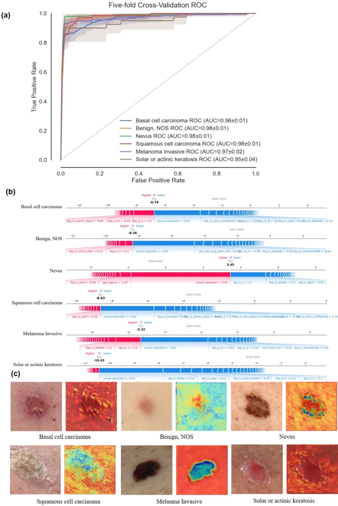
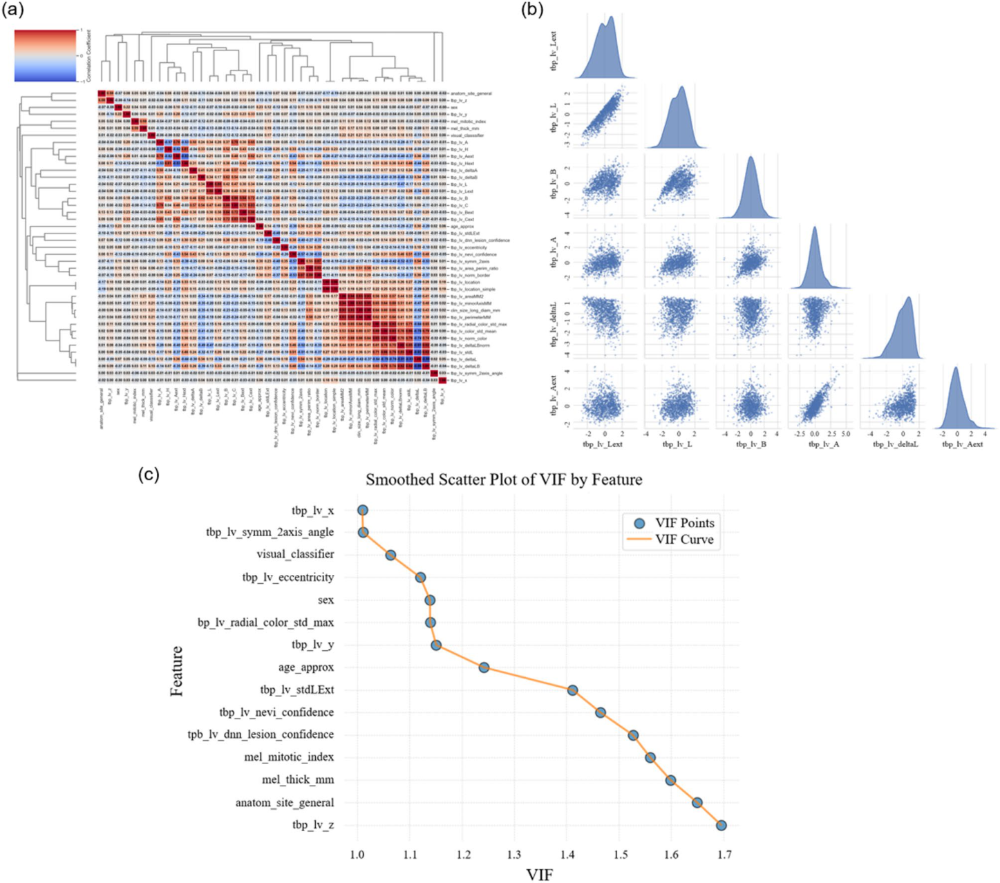
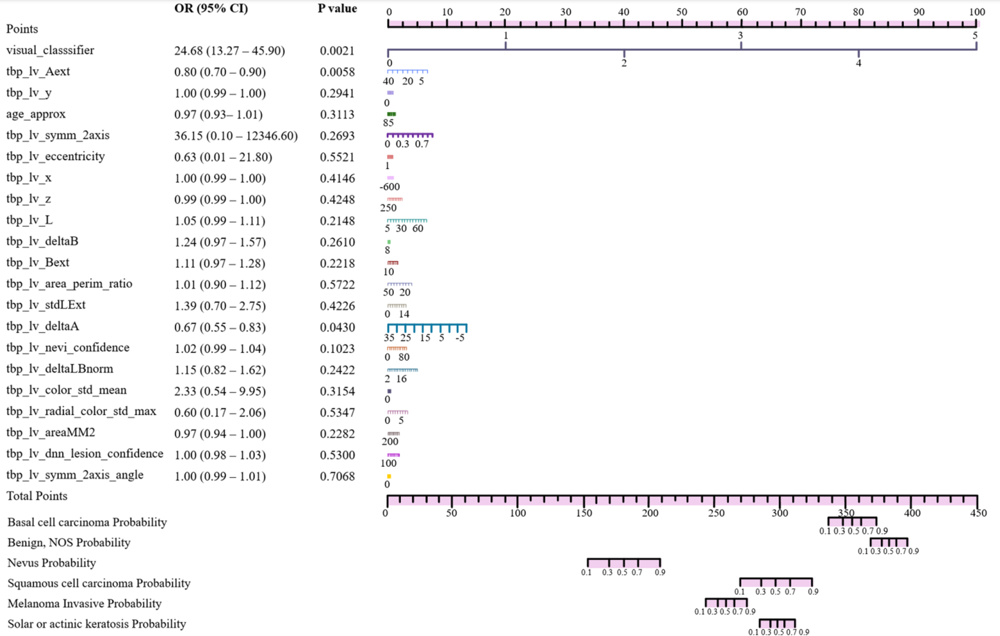

# 3D 영상과 임상 데이터를 통한 피부 병변 위험 예측을 위한 설명 가능한 멀티모달 AI

- 원문 PDF: `s41598-025-33536-z-1.pdf`
- 구성 원칙: PDF 원문을 논문 섹션 구조에 맞춰 재배치하고, 수식은 LaTeX로 별도 복원했다.

3D 영상 및 임상 데이터를 통한 피부 병변 위험 예측을 위한 설명 가능한 멀티모달 AI

## OPEN

정왕1,2,6, 멍난타이1, 2, 6, 후이후1, 하오위안1, 총왕2, 홍양푸2,3 & 장린장2,4,5

$$
y=\mathrm{XGBoost}\left(\mathrm{Concatenate}(f_{\mathrm{image}},f_{\mathrm{clinical}})\right)\tag{2}
$$

키워드 피부 병변 위험 예측, 3D 전신 사진, 멀티모달 융합, 설명 가능한 AI, 딥러닝.

반사율 공초점 현미경(RCM) 및 광학 간섭 단층 촬영(OCT)과 같은 영상 양식이 병변 시각화를 강화하지만, 광범위한 임상 채택은 높은 비용, 제한된 해상도 및 작동 복잡성(14-16)에 의해 제한된다.

이메일 : fuhongyang2024@outlook.com; zhang.jianglin@szhospital.com

데이터 획득 방법 본 연구에 사용된 피부 병변 데이터는 2015년부터 202431,33년 사이에 3D TBP를 받은 환자의 기록을 포함하는 ISIC 2024 데이터세트로부터 획득되었다. 이 국제 데이터세트는 메모리얼 슬론 케터링 암 센터(미국), 바르셀로나 클리닉 병원(스페인), 퀸즐랜드

전체 연구 작업 흐름은 그림 1에 나와 있다.

멀티모달 융합 전략 이미지-유래 및 임상 정보를 통합된 예측 모델(그림 2)에 통합하도록 설계된 멀티 모달 융합 프레임워크를 개발하였다. 먼저, 3D 총체 사진(TBP) 이미지에 대해 훈련된 딥러닝 네트워크는 구조화된 시각적 특징 벡터 역할을 하는 6

이 후기 융합 전략은 컨볼루션 신경망(CNN)에 의해 추출된 시각적 표상을 보완 임상 변수와 합성하여 표현형 및 인구 통계학적 데이터가 의사 결정을 공동으로 알릴 수 있게 한다. 예측 과정은 형식적으로 다음과 같이 표현된다.

$$
f_{\mathrm{image}}=\mathrm{CNN}_{\mathrm{image}}(I),\quad f_{\mathrm{clinical}}=[x_1,x_2,\ldots,x_n]\tag{1}
$$

그림 1. 제안된 설명 가능한 멀티모달 AI 프레임워크의 개요. ROC, 수신기 작동 특성, SHAP, 샤플리 추가 설명, CAM, 클래스 활성화 맵, XGBoost, 극한 구배 부스팅, CatBoost, 범주형 부스팅 및 SVM, 지원

> 그림 내부 텍스트 번역:
> - `age_approx` → Age_approx.
> - `tbp_iv_areaMM2` → tbp_iv_영역MM2
> - `tbp_lv_norm_color` → tbp_lv_norm_color_color
> - `5ex` → 5ex
> - `tbp_lv_area_perim_ratio` → tbp_lv_영역_perim_ratio.
> - `Data Preparation` → 자료 준비
> - `tbp_lv_perimeterMM` → tbp_lv_perimeterMM
> - `anatom_site_general` → 해부학_site_general.
> - `tbp_lv_color_std_mean` → tbp_lv_color_std_mean
> - `tbp_lv_radial_color_std_max` → tbp_lv_radial_color_std_max_radiial_stds_max.
> - `clinsize_long_diam_mm` → 클라이언트_long_diam_mm.
> - `tbp_iv_deltaA` → tbp_iv_deltaA
> - `tbp_lv_stdL` → tbp_lv_stdL
> - `tbp_lv_A` → tbp_lv_A
> - `tbp_iv_deltaB` → tbp_iv_deltaB
> - `tbp_lv_stdLExt` → tbp_lv_stdLExt
> - `tbp_lv_Aext` → tbp_lv_Aext
> - `tbp_iv_deltaL` → tbp_iv_deltaL
> - `tbp_lv_symm_2axis` → tbp_lv_symm_2축
> - `tbp_lv_B` → tbp_lv_B.
> - `tbp_lv_deltaLB` → tbp_lv_deltaLB
> - `tbp_lv_symm_2axis_angle` → tbp_lv_symm_2축_각.
> - `tbp_lv_Bext` → tbp_lv_Bext
> - `tbp_iv_deltaLBnom` → tbp_iv_deltaLBnom
> - `tbp_lv_c` → tbp_lv_c
> - `tbp_lv_eccentricity` → tbp_lv_ 편심.
> - `tbp_v_y` → tbp_v_y
> - `tbp_lv_Cext` → tbp_lv_Cext
> - `tbp_lv_location` → tbp_lv_location
> - `tbp_lv_z` → tbp_lv_z
> - `tbp_lv_H` → tbp_lv_H.
> - `tbp_lv_location_simple` → tbp_lv_location_simple_
> - `mel_mitotic_index` → 멜_미토틱_인덱스
> - `tbp_lv_Hext` → tbp_lv_Hext
> - `tbp_lv_minorAxisMM` → tbp_lv_minorAxisMM
> - `mel_thick_mm` → 멜_두께_mm
> - `tbp_Iv_L` → tbp_Iv_L.
> - `tbp_lv_nevi_confidence` → tbp_lv_nevi_신뢰
> - `tbp_lv_dnn_lesion_confidence` → tbp_lv_dnn_병변_신뢰
> - `tbp_lv_Lext` → tbp_lv_Lext

VIF 값이 10을 초과하는 특징은 계수 추정의 불안정성을 방지하기 위해 높은 공선성으로 간주되었고 제외되었다. 나머지 특징 중 최소 다중 공선성 가정하에서 임계값 k에서 클래스 가입 확률에 대한 누적 로지스틱 함수는 다음과 같이 후속적으로 정의되었다.

그림 2. 멀티모달 융합 워크플로우.

> 그림 내부 텍스트 번역:
> - `labelo` → 라벨로.
> - `Basal cellcarcinoma` → 기저 세포암
> - `labell` → 라벨.
> - `Benign,NOS` → 양성, NOS
> - `label2` → 라벨2.
> - `Nevus` → 모반.
> - `label3` → 라벨3.
> - `Squamouscell carcinoma` → 편평세포암
> - `labels` → 라벨.
> - `Melanoma Invasive` → 흑색종 침습적 침습성
> - `Solaroractinickeratosis` → 솔라노락티니케라타증
> - `Clinical MetadataFeature` → 임상 메타데이터 특징
> - `concatenation` → 연접.
> - `age_approx` → Age_approx.
> - `sex` → 섹스.
> - `anatom_site_general` → 해부학_site_general.
> - `clin_size_long_diam` → clin_size_long_diam
> - `mm` → mm
> - `tbp_lv_A` → tbp_lv_A
> - `tbp_lv_Aext` → tbp_lv_Aext
> - `Age` → 나이.
> - `Anatom` → 해부학.
> - `Visual` → 비주얼.
> - `tbp_Iv_B` → tbp_Iv_B.
> - `Site general` → 사이트 일반
> - `xoudde` → 우드드드.
> - `Clasifier` → 클레이퍼.
> - `tbp_lv_Bext` → tbp_lv_Bext
> - `XGBoost` → XGBoost
> - `60` → 60
> - `male` → 수컷.
> - `back` → 뒤로.
> - `tbp_lv_C` → tbp_lv_C.
> - `tbp_lv_Cext` → tbp_lv_Cext
> - `50` → 50
> - `female` → 여자.

로짓(P(Y k | X)) =  0.05 0 0.05   1.10  0.1  0.2  0.01  0.3  0.5  0.4  0.7  0.6  1.0

(

)

(k) · Xi(3)

n i = 1 i

로짓(P(Y k | X))이 카테고리 k에 대한 누적 로지스틱 함수를 나타내고,  0(k)은 카테고리 k의 절편항이며,   i(k), Xi는 카테고리 k에서 i번째 피처에 대한 회귀계수

0 = + 1 · X1 + 2 · X2 + · · · + n · Xn (4)

이 모델링 접근법은 예측 성능과 해석 가능성 사이의 균형을 제공하여 여러 범주에 걸친 특징 중요도의 상세한 분석을 가능하게 한다. 추정된 계수 및 그들의 분류별 효과는 분류 결과에 대한 개별 특징의 영향을 포착하는 모델의 능력을 강조한다.

모델 학습 및 구현 모델은 멀티 클래스 분류에 적용된 교차 엔트로피 손실을 사용하여 CUDA 가속을 사용하여 200 에포크에 대해 학습되었다. 모든 실험은 컴퓨팅 효율을 향상시키기 위해 CUDA 가속도를 사용하여 NVIDIA RTX 4070 GPU(8GB RAM)에 대해 수행되었다. 토치비전 변환

모델은 데이터 처리, 시각화 및 성능 평가를 위해 토치, 저피, 판다, 필로우, 매트플립, 디본, 스키킷 러닝을 포함한 핵심 라이브러리를 활용하여 PyTorch 프레임워크에서 구현되었다.

통계 분석 본 연구에서는 피부 병변 아형에 걸친 병변 특이적 영상 및 질감 특징과 함께 임상 및 인구통계학적 특성(연령, 성별)을 분석하였다. 통계적 유의성은 p-값을 통해 평가되었다. 임상 파라미터와 3D 영상 특징을 결합한 멀티모달 융합 모델이 개발되었으며,

모델 Acc Pre Rec F1 PR

로지스틱 회귀 0.5813 0.5734 0.3556 0.4161 0.5142.

결정 트리 0.5953 0.4148 0.4061 0.4083 0.3096 0.4093 0.4043 0.4084 0.4082 0.4081 0.4042 0.4041 0.4053 0.4052 0.4051 0.4023 0.4022 0.4021 0.4032 0.4012 0.4

랜덤 포레스트 0.6697 0.5636 0.3759 0.4381 0.5572.

기울기 부스팅 0.6744 0.6166 0.4070 0.4629 0.5735.

## SVM
0.6139
0.5786
0.3116
0.3753
0.5479

CatBoost 0.6697 0.5632 0.3807 0.4382 0.5715.

XGBoost 0.6837 0.5425 0.4090 0.4582 0.5848.

표 1. 임상 데이터에 대한 모델의 비교.

피부 병변 첫째, 둘째, 셋째, 넷째, 다섯째.

기저 세포 암종 0.99 0.95 0.96 0.96 0.86 0.98 0.96.

양성, NOS 0.980.960.990.980.99.

모반 0.99 1.00 0.97 0.99 0.98

편평 세포 암종 0.97 0.98 0.95 1.00 0.99 1.07 0.99.

흑색종 침습적 0.97 0.98 0.99 0.93 0.98 0.73 0.99 0.78 0.79 0.75 0.75.

태양성 또는 광선성 각화증 0.92 0.95 1.00 0.99 0.89 0.88

표 2. 멀티모달 데이터에 대한 5가지 교차 검증.

임상 전용 모델을 사용한 진단 정확도 (표 1) BCC 사례의 10.7%가 모반으로 잘못 분류되어 지연 치료의 위험이 있었지만 XGBoost 모델은 BCC에 대해 78.6%의 정확도를 달성했다. 모반 분류 정확도는 72.6%, 모반이 BCC로 잘못 표시되어 잠재적으로 불필요한

활동성 각화증과 SCC는 각각 12.5%와 16.7%의 사례에서만 정확하게 확인되었으며, SCC 병변의 75.0%가 BCC로 오진되어 고위험 종양 검출에 대한 모델의 제한된 민감도를 강조한다.

Acc, 정확도, Pre, 정밀도, Rec, 리콜, PR, 정밀 및 리콜. XGBoost, 익스트림 그래디언트 부스팅, CatBoost, Categorical Boosting, SVM, 서포트 벡터 머신.

해석 가능성을 높이기 위해 SHapley Additive Explanation(SHAP) 및 클래스 활성화 매핑(CAM)을 사용하여 주요 예측 변수를 식별하고 임상 관련성을 시각화했다(그림 3b-c). SHAP 요약 그림은 전체 신체 사진(TBP)에서 파생된 수치

그림 3. 멀티모달 융합 모델의 성능 및 해석성. (a) XGBoost 분류기를 사용한 5배 교차 검증 ROC 곡선; (b) 멀티 모달 데이터에 대한 SHAP 특징 중요도; (c) 대표적인 피부 병변 이미지의 CAM 시각화. ROC, 수신

> 그림 내부 텍스트 번역:
> - `Five-foldCross-ValidationROC` → 5foldCross-ValidationROC
> - `(a)` → (a)
> - `1.0` → 1.0
> - `0.8` → 0.8
> - `True PositiveRate` → 트루 포지티브 레이트.
> - `0.6` → 0.6
> - `0.4` → 0.4
> - `BasalcellcarcinomaROC(AUC=0.96±0.01)` → BasalcellcarcinomaROC(AUC=0.96±0.01)
> - `0.2` → 0.2
> - `Benign,NOSROC(AUC=0.98±0.01)` → Benign,NOSROC(AUC=0.98±0.01)
> - `NevusROC(AUC=0.98±0.01)` → NevusROC(AUC=0.98±0.01)
> - `SquamouscellcarcinomaROC(AUC=0.98±0.01)` → SquamouscellcarcinomaROC(AUC=0.98±0.01)
> - `MelanomaInvasiveROC(AUC=0.97±0.02)` → MelanomaInvasiveROC(AUC=0.97±0.02)
> - `0.0` → 0.0
> - `SolaroractinickeratosisROC(AUC=0.95±0.04)` → SolaroractinickeratosisROC(AUC=0.95±0.04)
> - `FalsePositiveRate` → 위양성률.
> - `(b)` → (b)
> - `higher lower` → 더 높고.
> - `f(x)` → f(x)
> - `base value` → 기준값
> - `-6.74` → -6.74
> - `Basal cell carcinoma` → 기저 세포 암종
> - `-10` → -10
> - `-12` → -12
> - `-2` → -2
> - `tbp_iv_symm_2axis =-0.94` → tbp_iv_symm_2axis =-0.94
> - `tbp_v_nevi_confidence=tha3v_y=o.16tbp_lv_B` → tbp_v_nevi_confidence=tha3v_y=o.16tbp_lv_B
> - `tbp_lv_H=-0.43` → tbp_lv_H=-0.43
> - `tbp_lv_z=1.9` → tbp_lv_z=1.9
> - `visualclasssifier=-0.03` → visualclasssifier=-0.03
> - `-0.1tbp_iv_Aext=d.2tbp_v_deltaLB=0.15` → -0.1tbp_iv_Aext=d.2tbp_v_deltaLB=0.15
> - `higher` → 더 높죠.
> - `lower` → 더 낮게.
> - `f[x)` → f[x)
> - `10` → 10
> - `9E'8-` → 9E'8-
> - `Benign, NOS` → 양성, NOS
> - `tbp_iv_norm_color=0.22` → tbp_iv_norm_color=0.22
> - `tbp_iv_C=0.1` → tbp_iv_C=0.1
> - `visual classsifier =-0.03` → visual classsifier =-0.03

Fig. 4. 융합 모델의 성능 평가. (a) 융합 데이터의 ROC 곡선; (b) 전체 모델 성능을 나타내는 레이더 차트.

> 그림 내부 텍스트 번역:
> - `ROCCurve` → ROCCurve
> - `(a)` → (a)
> - `(q)` → (q)
> - `Recall(Sensitivity)` → 회상(감응성)
> - `1.0` → 1.0
> - `Precision` → 정밀한.
> - `0.8` → 0.8
> - `True Positive Rate` → 진짜 긍정금리.
> - `2.8` → 2.8
> - `0.6` → 0.6
> - `0.4` → 0.4
> - `0.2` → 0.2
> - `Specificity` → 특이함.
> - `Accuracy` → 정확도.
> - `0.0` → 0.0
> - `AUC=0.973` → AUC=0.973
> - `F1 Score` → F1 스코어.
> - `AUC` → AUC
> - `FalsePositiveRate` → 위양성률.

팀 pFPR

우리 거 0.17343.

ELya Novoselskiy 0.17264

야키니쿠 0.17243

## KS
0.17229

BiBanhBao 0.17225

칸나 하시모토 친구 2 0.17210

<표 3>. 상위 5개 팀과의 비교.

델타B는 병변 코어와 주변부 사이의 색 포화도와 밝기의 미묘한 차이를 정량화하여 대칭적이고 고르게 착색된 패턴과 정렬했다.

그림 5. 모형 특징의 다중 공선성 분석. (a) 계층적 클러스터링을 갖는 상관 행렬; (b) 주요 상관 특징의 쌍별 산점도; (c) 고도로 공선적인 변수를 제거한 후 분산 팽창 인자(VIF) 분포.

> 그림 내부 텍스트 번역:
> - `(a)` → (a)
> - `(b)` → (b)
> - `tbp_Iv_deltaL` → tbp_Iv_deltaL
> - `-2.5 0.0 2.5 5.0` → -2.5 0.0 2.5 5.0
> - `024` → 024
> - `tbp_Iv_L` → tbp_Iv_L.
> - `tbp_lv_B` → tbp_lv_B.
> - `tbp_lv_A` → tbp_lv_A
> - `tbp_lv_Lext` → tbp_lv_Lext
> - `tbp_lv_Aext` → tbp_lv_Aext
> - `(c)` → (c)
> - `Smoothed Scatter Plot of VIF by Feature` → 특징별 VIF의 매끄러운 산란 그림
> - `tbp_lv_x` → tbp_lv_x
> - `VIF Points` → VIF 포인트.
> - `tbp_lv_symm_2axis_angle` → tbp_lv_symm_2축_각.
> - `VIF Curve` → VIF 곡선
> - `visual_classifier` → 비주얼_분류기
> - `tbp_lv_eccentricity` → tbp_lv_ 편심.
> - `sex` → 섹스.
> - `bp_lv_radial_color_std_max` → bp_lv_radial_color_std_max_max.
> - `Feature` → 특징.
> - `tbp_lv_y` → tbp_lv_y.
> - `age_approx` → Age_approx.
> - `tbp_lv_stdLExt` → tbp_lv_stdLExt
> - `tbp_lv_nevi_confidence` → tbp_lv_nevi_신뢰
> - `tpb_lv_dnn_lesion_confidence` → tpb_lv_dnn_병변_신뢰
> - `melmitotic_index` → 멜미토틱_인덱스
> - `mel_thick_mm` → 멜_두께_mm
> - `anatom_site_general` → 해부학_site_general.
> - `tbp_lv_z` → tbp_lv_z
> - `1.2` → 1.2
> - `1.3` → 1.3
> - `1.1` → 1.1
> - `1.4` → 1.4
> - `1.5` → 1.5
> - `1.0` → 1.0
> - `1.6` → 1.6
> - `1.7` → 1.7
> - `VIF` → VIF.

선택된 이미지-유래 및 임상 특징에 기초하여 흑색종 및 태양 또는 광선 각화증에 대한 각 변수는 총 점수를 생성하고 클래스 멤버십 확률에 매핑되는 대응하는 점수를 나타낸다. 예측 변수 중 시각_분류기( = 3.503, OR = 24.68, 95%

그림 6. 피부 병변 진단을 위한 노모그램 기반 점수 시스템.

> 그림 내부 텍스트 번역:
> - `OR (95% CI)` → OR (95% CI)
> - `P value` → P값.
> - `20` → 20
> - `30` → 30
> - `50` → 50
> - `40` → 40
> - `60` → 60
> - `10` → 10
> - `80` → 80
> - `90` → 90
> - `100` → 100
> - `Points` → 포인트.
> - `51` → 51
> - `visual_classsifier` → 시각_분류기
> - `24.68 (13.27-45.90)` → 24.68 (13.27-45.90)
> - `0.0021` → 0.0021
> - `T2` → T2
> - `tbp_lv_Aext` → tbp_lv_Aext
> - `0.80 (0.700.90)` → 0.80 (0.700.90)
> - `0.0058` → 0.0058
> - `40 20 5` → 40 20 5
> - `tbp_lv_y` → tbp_lv_y.
> - `0.2941` → 0.2941
> - `1.00 (0.99-1.00)` → 1.00 (0.99-1.00)
> - `0.3113` → 0.3113
> - `0.97 (0.93-1.01)` → 0.97 (0.93-1.01)
> - `age_approx` → Age_approx.
> - `tbp_lv_symm_2axis` → tbp_lv_symm_2축
> - `0.2693` → 0.2693
> - `36.15 (0.1012346.60)` → 36.15 (0.1012346.60)
> - `003 07` → 003 07
> - `tbp_lv_eccentricity` → tbp_lv_ 편심.
> - `0.63 (0.01 -21.80)` → 0.63 (0.01 -21.80)
> - `0.5521` → 0.5521
> - `tbp_lv_x` → tbp_lv_x
> - `1.00 (0.99 - 1.00)` → 1.00 (0.99 - 1.00)
> - `0.4146` → 0.4146
> - `-600` → -600
> - `tbp_lv_z` → tbp_lv_z
> - `0.99 (0.99 - 1.00)` → 0.99 (0.99 - 1.00)

본 연구는 ISIC 2024 데이터세트에 대한 배타적 의존성에 내재된 한계를 갖는다. 데이터세트는 광범위하지만, 제어된 임상 시험으로부터 도출되지 않은 데이터의 전형적인 선택 및 획득 편향을 포함한다. 또한, 참여 기관들에 걸친 영상 하드웨어, 조명 및 카메라 각도의 변화는 이미지 품질 및 병변 표현에

이러한 문제를 해결하기 위해, 향후 연구는 더 크고 표준화되고 균형 잡힌 멀티센터 데이터 세트를 통합해야 한다.

또한, 현재 모델은 실제 전신 사진(TBP) 또는 독립적인 외부 코호트를 사용하여 검증되지 않았다. 이러한 접근 방식을 임상 실습으로 번역하는 것은 예측 정확도에 영향을 미칠 수 있는 환자 위치 결정, 배경 복잡성 및 조명 이질성과 관련된 문제를 제시한다. 따라서, 다양한 의료 센터, 장치 및 환자

데이터 가용성 현재 연구 동안 생성 및/또는 분석된 데이터 세트는 ISIC 저장소에서 사용할 수 있으며, h t t p s : / / c h a l l e n g e 2 0 2 4. i s i c - r c h i v e. c o

승인: 2025년 9월 22일, 승인:2025년 12월 19일

참조 1. Hay, R. J. et al. 2010년 피부 질환의 전 세계적인 부담: 피부 상태의 유병률과 영향에 대한 분석 J. Invest.

77(5), 938–945(2017). 4. Lee, E. H., Kishwer, S., Nehal & Joseph, J. Disa. 양성 및 악성 피부 병변. Plast. Reconstr. Surg. 125(5), 188e–198

9. 루빈, A. I. & 엘버트, H. 첸 및 데시ré Ratner. 기저 세포 암종. N. Engl. J. Med. 353, 2262–2269(2005). 10. Alam, M. & Désiré, R

컴퓨터. 방법 프로그램 Biomed. 226, 107166 (2022). 12. Hammoud, S. 등. 간호대학생들 사이에서 시뮬레이션 기반 교육도구로 3D 피부모델의 사용을 평가하는 것: 3D피부모델에 대한 준-차원적 접근방법.

실험 연구. 간호사 교육. 오늘 146, 106519(2024). 13. 나베드, A. 등 PCA: 피부 병변 진단을 위한 점진적인 계층별 주의. Eng. Appl. Artif. Intell. 127, 107417(2024), 14. 카탈도

235, 114911(2024). 15. 룬드버그, S. M. 등. 수술 중 저산소혈증 예방을 위한 설명 가능한 기계 학습 예측. Nat. 생의학.

Eng. 2(10), 749–760(2018). 16. Kurtansky, N. R. 등. SLICE-3D 데이터세트: 피부 병변 검출을 위해 3D TBP에서 추출된 40만 개의 피부 병소 이미지 작물.

Sci. Data. 11(1), 884(2024). 17. Chyad, M. 등. 다중 컬러 채널 피부 검출 애플리케이션에서 융합을 위한 적대적 딥 러닝을 탐색한다. 정보. 융합.

(2024). 20. Fayyad, J., Alijani, S. & Homayun, N. 신뢰할 수 있는 피부 병변 분류에 대한 적합성 예측의 경험적 검증.

컴퓨터. 방법 프로그램 바이오메드 253, 108231(2024). 21. 미르, A. N. 및 덴마크 라자 리즈비. 향상된 의료 이미지를 위한 딥러닝 및 설명 가능한 인공 지능의 발전.

종합적인 해석 방법과 설명 품질 평가를 통한 접근 방법. Eng. Appl. Artif. Intell. 149, 110519(2025). 23. Mir, A., 나치르, D. R., Rizvi & Iqra Nissar. 자기 부스팅 멀티모달

건강 정보. Sci. Syst. 13 (1), 58 (2025). 24. 마르케티, M. A. 등 자동 흑색종 검출을 위한 3D 전신 피부 이미징. J. 을. 아사드. 더마톨. Venereol. 37 (5),

945-950(2023). 25. 조던, M. I., 톰, M~미첼 머신 러닝: 트렌드, 관점 및 전망. 사이언스 349, 255-260(2015). 26. 장, L. & 리, J. 노인학에서 인공 지능의 적용

(2025). 27. Chen, K., Li, J. & Li, L. 질병 X에 대한 인공 지능: 진행 및 도전. J. 번역 인턴. med. 12 (6), 534-536, 535-6, 534-6, 636, 637, 6

(2025). 28. 프라바, A. 등. 하이브리드 특징 선택 기반 XGBoost 분류기를 사용한 지능형 당뇨병 감지 시스템의 설계.

컴퓨터 Biol. Med. 136, 104664(2021). 29. Volinsky-Fremond, S. 등. 멀티모달 딥 러닝을 통한 자궁내막암의 재발 위험 예측. Nat.  Med. 30(7). S. 7, 7, 8, 9,

192-1973(2024). 30. 치유, C. F. 등. 피부 병변의 임상 진단의 정확성. Br. J. Dermatol. 159(3), 661-668(2008). 31. Liu 등. N. Med. 26, 900–908(2020

도전 과제 및 향후 방향. 정보. 융합. 91, 424-444(2023).

33. Gellrich, F. 등. 3D 전신 사진을 이용한 피부 검사의 효능을 임상 및 피부경 검사와 비교한다.

검사. EJC 피부. 병변. 2, 100264(2024). 34. 다미안, F. 등. 모반 및 흑색종 분류를 위한 비피모스코픽 피부 병변 이미지의 선택이 특징입니다. 계산 8.2.

: 41. (2020). 35. 알마라즈-다미안 등. 수공예 및 딥러닝을 이용한 흑색종 및 모반 피부 병변 분류는 상호 작용을 통한 융합을 특징으로 한다.

정보 측정. 엔트로피 22(4, 484). 36. 건닝, D. 등 XAI-설명 가능한 인공 지능. Sci. Rob. 4, 37(2019). 37. Premaladha, J. & Ravichandran, K. S. 감독 및 심층 분석을 통해

학습 알고리즘 J. Med. Syst. 40, 1-12(2016). 38. Dascalu, A. & David, E. O. 피부 병변 검출 딥러닝 및 사운드 분석 알고리즘에 의한 피부병변 검출에 대한 예비 임상 연구

초등 피부경. EBioMedicine 43: 107~113.(2019).

인정 후난성 3D 장면 시각화 및 지능화 교육 연구소(지명 제 2023TP1038호)와 신시대 교사 교육 혁신 개발 연구소의 지원을 감사하게 생각합니다.

선언.

## Competing interests
The authors declare no competing interests

추가 정보 보충 정보 온라인 버전은 h t t p s : // d o i. o r g / 1 0. 1 0 3 8 / s 4 1 5 9 8 - 0 2 5 - 3 3 3 6 - z에서 사용할 수 있는 보충 재료를 포함한다.

서신 및 자료 요청은 H.F. 또는 J.Z로 연락해야 합니다.

재인쇄 및 허가 정보는 www.nature.com/reprints에서 확인할 수 있습니다.

출판사의 노트 스프링어 네이처는 출판된 지도와 기관 소속의 관할권과 관련하여 중립을 유지하고 있다.

공개 액세스 이 기사는 크리에이티브 커먼즈 귀속-비상업-비생산물 4.0 국제 라이선스에 따라 라이선스되며, 이는 원래의 저자(들)와 출처에 적절한 크레딧을 부여하고, Creative Commons 라이선스에 링크를 제공하고, 라이선스된 자료를 수정한 경우 이를 표시한다. 당신은 이 기사 또는

재료가 기사의 크리에이티브 커먼즈 라이선스에 포함되어 있지 않고 의도된 사용이 법정 규정에 의해 허용되지 않거나 허용된 사용을 초과하면 저작권자로부터 직접 허가를 받아야 합니다. 이 라이선스의 사본을 보기 위해 h t t p : // c r e a t i v e c o m o n s

©The Author(들) 2025.

## 수식 복원

누적 로짓:

$$
\mathrm{logit}\left(P(Y\leq k\mid X)\right)=\beta_0^{(k)}+\sum_{i=1}^{n}\beta_i^{(k)}X_i\tag{3}
$$

선형 점수:

$$
\beta_0+\beta_1X_1+\beta_2X_2+\cdots+\beta_nX_n\tag{4}
$$
