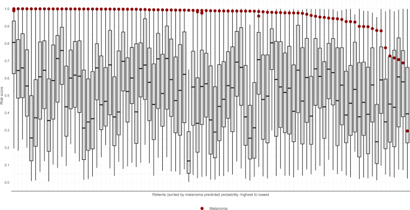
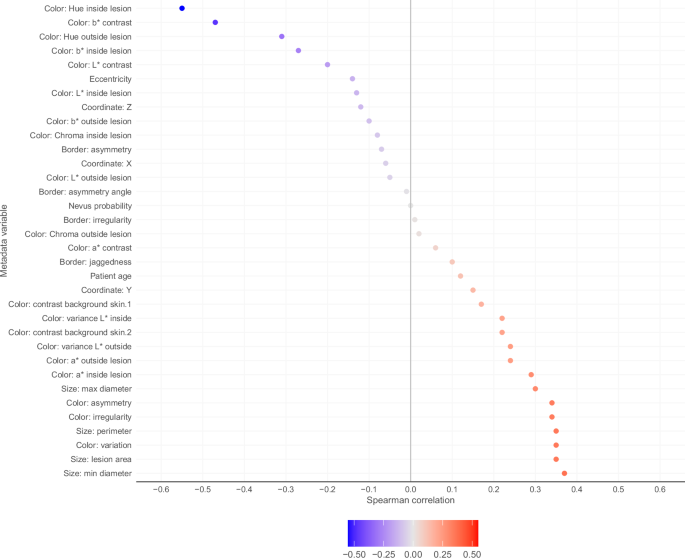

# 3D 전신 사진 기반 암 의심 피부 병변의 자동 분류

- 원문 PDF: `s41746-025-02070-7.pdf`
- 구성 원칙: PDF 원문을 논문 섹션 구조에 맞춰 재배치하고, 수식은 LaTeX로 별도 복원했다.

npj | 디지털 의학 기사

분당서울대병원과 제휴하여 출간되었습니다.

업데이트를 확인하세요

니콜라스 R. 쿠탄스키1, 마우라 C. 길리스1, 노엘 C. F. 코델라2, 브라이언 M. 알렉산드로3, 폰위안 게4,5, 파스케일 기테라6,7,8, 콘스탄티노스 리포피리스12

1234567890():,;

1234567890():,;

다중 기관 및 글로벌 프로젝트는 머신러닝의 온라인 대 도전을 위해 3D 총 신체 사진에서 90만 개 이상의 병변 작물을 수집했다. 여기서 우리는 경쟁 결과인 'ISIC 2024 - 3D-TBP를 사용한 피부암 검출'을 요약하고, 이전에 발표된 접근법에 비해 환자 내 맥락을 사용한

1피부과 서비스, 의학과, 메모리얼 슬론 커터링 암 센터, 미국 뉴욕, 뉴욕, 웨스트, 호주, 모나쉬 대학, 멜버른, VIC, 3Canfield Scientific, 미국 호주, 시드니, 뉴사우스웨일스, 호주. 6Melanoma Institute Australia,

11Centro de Investigación Biomédica en Red de Enfermedades Raras (CIBER ER), 스페인 바르셀로나의 Salud Carlos III 연구소, 그리스 아테네 의과대학 12대학. 13Victorian Melanoma Service, Alfred Health, 호주 멜버른의 Monash

고성능 피부경 기반 ML 모델을 개발하는 데 사용되는 주목할 만한 데이터 세트는 일반적으로 임상 실습의 피부경 이미지로 구성되며, 이는 임상의가 임상 검사 결정 동안 조언하는 것과 같은 진단 보조를 건설적으로 제공할 수 있지만, 결과 모델은 임상 및 피부경 평가 전에 비정형 병변 식별과 같은 분류 작업에

Vectra WB360 시스템은 환자의 방해받지 않는 병변(21,22)을 식별할 수 있는 독점적인 ML 모델을 갖추고 있으며, 최소한의 사전 선택으로 환자 샘플로부터 병변 타일로 구성된 데이터세트는 개별 이미지(이하 타일)23으로 출력될 수 있다. 우선, 타

따라서 잠재적인 병변 선택 편향을 완화하면서 빠른 데이터 수집을 용이하게 한다. 마지막으로, 타일의 픽셀 해상도는 비전문가 임상 실습(예를 들어, 일차 진료)에서 널리 사용되는 임상 개요 사진 및 스마트폰 영상을 시뮬레이션하고, 더 포괄적인 ML 모델을 훈련하는 데 도움이 될 수

표 1 | 입력 특징 클래스에 대한 설명

4개의 정보 클래스

타일 기초 "인구학" 메타데이터 WB360 "출현" 메타 데이터 환자 상황 정보

이미지 파일. 병변은 Vectra WB360 사진에서 잘라내고 jpeg 형식으로 저장됩니다.

ISIC는 광범위한 데이터 세트를 발표하고 컴퓨터 비전 전문가가 피부암 검출 및 분류 28-30과 관련된 작업을 수행하는 ML 모델 개발에 참여하도록 대회를 조직했다. ISIC 2024 대회(이하 ISIC 24)는 이전에 보고된 모델(이하 마르케티 등)27에 대한 ISIC24의 결과를 분석하여

본 연구는 3D TBP에 대한 ML의 적용에 관한 세 가지 주요 목적을 가지고 있었다: (1) 자동화된 병변 선택이 전신 피부 검사를 정확하게 지원할 수 있는지 평가하기 위한 것이다. (2) ML 기반 3DTBP 알고리즘 중 위험 인식을 설명하는 특성을 식별하기 위한 것. (3) 마지막으로 진단 성능에

총 2739명의 참가 팀이 공식 점수를 위해 4998개의 제출물에 들어갔다. 임상 환경에서 요구되는 리더보드 점수의 주요 지표는 80% 민감도(pAUC>80% TPR [0,0.2]) 이상의 수신기 작동 특성(ROC) 곡선 아래 부분 영역이었다. 상위

환자 상의 다른 사람들의 맥락에서 병변을 기술하는 임의의 조작된 데이터 요소를 포함하도록 광범위하게 정의된다. 예를 들어, ● 전체 병변 수 ● 주어진 환자의 평균으로 정규화된 병변 영역 이들 계산 각각은 '환자_id' 속성을 사용하여 환자의 다른 병변에 대한 지식을 포함한다.

Vectra WB360 툴링을 통해 도출된 이미지 메타데이터. 예를 들어, ●영역 영역 ●컬러 콘트라스트 ●배위 불규칙성 ●조명 양식 전체 용어 목록을 위해 Kurtansky et al.23에 의해 출판된 전체 데이터 디스크립터를 참조하라.

<표 2> | 훈련 및 시험 집합 분포 비교

훈련 공용 LB 서브세트 개인 LB 부분세트

총 환자 1042 100% 342 100% 935 100%

환자당 타일 이미지

<100
221
21.2%
89
26.0%
213
22.8%

100–199
225
21.6%
58
17.0%
177
18.9%

200–299
157
15.1%
44
12.9%
143
15.3%

300–399
112
10.7%
35
10.2%
102
10.9%

400+
327
31.4%
116
33.9%
300
32.1%

환자당 악성 라벨

없음 783 75.1% 245 71.6% 698 74.7% 758 74.7%.

정확히 1193 18.5% 74 21.6% 183 19.6%

하나 이상 66 6.3% 23 6.7% 54 5.8%

출처별 환자

호주.

## ACEMID MIA
44
4.2%
13
3.8%
34
3.6%

FNQH 케언스 0 0.0% 74 21.6% 177 18.9%

모나쉬 대학교와 알프레드 헬스 0 0.0% 11 3.2% 30 3.2%

퀸즐랜드 대학교 176 16.9% 50 14.6% 134 14.3%

유럽.

바르셀로나 병원 클리닉 163 15.6% 47 13.7% 135 14.4%

빈 의과대학 15 1.4% 4 1.2% 12 1.3%

바젤 대학 병원 230 22.1% 51 14.9% 203 21.7%

아테네 대학교 16 1.5% 3 0.9% 11 1.2%

아메리카.

메모리얼 슬론 커터링 암 센터 398 38.2% 89 26.0% 199 21.3%

총 병변-이미지 401,059 100% 140,770 100% 370,704 100% 100.

라벨 클래스

악성 393 0.1% 138 0.1% 342 0.1%

양성/불확실성 400,666 99.9% 140,632 99.9% 370,36299.9% 40,664 99.9% 4,667 99.9% 14,632 99.9% 3,624 99.9% 7,616 99.9% 99.9% 2,6362 99.9

라벨 서브 클래스

악성.

흑색종 157 0.0% 46 0.0% 99 0.0%

기저 세포 암종 163 0.0% 190 0.1% 190 0.1%

편평 세포암 73 0.0% 53 0.0%53 0.0%.

양성/불확실성, 생체검사.

모반 443 0.1% 116 0.1% 357 0.1%

활동성 각화증 39 0.0% 15 0.0% 35 0.0%

미확정 멜라닌 세포 75 0.0% 15 0.0% 57 0.0%

기타 118 0.0% 53 0.0% 125 0.0%

양성/불확실성, 생체검사가 아닙니다.

## NOS
399,991
99.7%
140,433
99.8%
369,788
99.8%

접근 방법, 흑색종의 18%가 가장 높았고 36%가 상위 99 백분위수에 속했으며 32%가 환자의 병변의 95 백분위 수 아래에 있었다.

병변 특성과 ML 모델 인지 위험의 연관성 특정 색상 측정값은 상위 500 ISIC 24 모델 중 평균 상승 순위 순서 위험 점수와 완만한 상관 관계가 있었다.

a)
b)

### 0.20

개인 리더보드 pAUC > 80% TPR

### 0.15

### 0.10

### 0.05

### 0.00

### 0.05
0.10
0.15
0.20
Public leaderboard pAUC>80% TPR

분할된 병변 내의 가장 강한 연관성( = 0.55) 및 더 붉은 색조를 갖는 병변-타일에서 더 높은 위험이 추정된 경향이 있었다. 유사하게, 병변과 외부 피부 사이의 더 높은 평균 청황색 (b*) 대비(=0.47), 병변을 둘러싼

반대로, 경계 불규칙성( = 0.18)과 비대칭성 ( = 0.07)은 위험 점수와 좋지 않은 상관관계를 보였다. 그림 3은 ML 모델링된 위험 점수 및 각 연속형 메타데이터 요소 사이의 연관성 정도를 나타낸다.

이러한 발견은 피부 감시에 대한 새로운 3D TBP 기반 접근법에 대한 개념 증명을 제공하며, 이는 전문 클리닉의 작업 흐름을 간소화하거나 위험 개인의 추천을 개선하는 데 도움이 될 수 있다. 많은 참가자는 리더보드에서 가장 좋은 점수를 향한 높은 분포 밀도로 나타나는 우승자와 유사한 성능을 달성하는 모델을 제출했습니다.

1500

카운트.

1000

500

0

### 0.02
0.04
0.06
0.08
0.10
0.12
0.14
0.16
0.18
0.20
Private leaderboard pAUC>80% TPR

c)

2000

1500

카운트.

1000

500

0

### 0.02
0.04
0.06
0.08
0.10
0.12
0.14
0.16
0.18
0.20
Public leaderboard pAUC>80% TPR

완벽한 일치의 선으로부터의 이탈은 일부 과적합이 발생했음을 시사한다. b는 개인 리더보드에 점수의 히스토그램을 제시한다. c는 공적 리더보드에서 점수에 대한 히스토gram을 제시한다는 것이다.

알고리즘을 반복적으로 최적화하기 위한 즉각적인 피드백을 위해 공공 리더보드에 수백 개의 제출을 제공하는 이 방법은 제출 점수 사이의 더 높은 변동성을 생성하는 제한된 수의 질병 분류 사례를 사용할 수 있다. 또한, 선행 ISIC'24 모델은 이미지 및 메타데이터를 모두 사용했다. 제공된 WB360 측정이 독점적 V

따라서 이 모델은 한 번에 단일 병변을 분석하는 데 직접 적용될 수 없다. 이러한 측면에서, 절제 연구는 입력 특징 클래스의 상이한 조합에 의존하는 당첨 모델의 버전을 조사하기 위해 수행되었다. 이 연구는 네 가지 정보 클래스 - 타일, 기본 "인구학적" 메타데이터(즉, 환자의 연령 및 성별, 병

실험 변수로서 환자 컨텍스트 및 WB360 "출현" 메타데이터 클래스의 처리는 단일 병변 분석 모델의 타당성 평가뿐만 아니라 독점 도구로부터 WB 360 측정에 액세스할 수 없는 애플리케이션을 가능하게 했다. 당첨 알고리즘에 의해 사용된 이미지 전용 모델은 원래 메타데이터 또는 환자-컨텍

이미지 모델이 다른 특징과 독립적으로 훈련된다는 점을 감안할 때, 각각의 절제 변이체에 대해 그들을 재교육하는 것은 불필요하다고 간주되었다. 반대로, 부스팅 모델은 이미지, 메타데이터 및 환자-맥락 특징 클래스의 각 변이체의 조합에 대해 재교육되었고, 절제 연구는 이러한 업데이트된 부

표 3 | ISIC의 24개 민간 리더보드 평가 데이터 세트를 통한 다양한 자동화된 접근 방식에 걸친 진단 효과 측정

악성 분류 모든 ISIC의 24개 제출물에서 가장 좋은 0.173 0.968 42.26 88.60 0.790.

ISIC'24 우승자 - 절제 변이체 메타바시믹 메타WB360 타일 환자 맥락

흑색종 분류 모든 ISIC'24 제출품에 걸쳐 가장 좋은 0.176 0.970 126.31 261.92 0.791.31

ISIC'24 우승자 - 절제 변이체 메타바시믹 메타WB360 타일 환자 맥락

a 두 연구에 모두 포함된 한 환자에서 209개의 병변을 제외했다.

절제 연구는 순수하게 시각 기반 모델의 한계를 강조한다. 이미지 전용 모델은 표준화된 병변 타일로부터 병변 외관과 관련된 정보를 추출할 수 있어야 하며, WB360 측정 특징을 추출하기 위한 별도의 모델이 불필요하다. 그러나, 이러한 정보 클래스는 시각 모델에서 블랙박스 특징 추출이 타일에서만 훈련된 변형

임상적으로 수집된 정보가 ML 모델에 어떻게 의미 있게 기여할 수 있는지를 강화하는 기본 "인구학적" 메타데이터 특징 클래스푸르더 개선 진단 정확도 결과. 다중 모달 데이터의 값은 4개의 입력 특징 클래스를 모두 사용하여 훈련된 모델 변수의 우위성을 통해 가장 잘 증명된다는 것이다. 환자 클러스터

Task Model Metric pAUC > 80% TPR AUC NNT80% SE NNT90% SE SEtop-15

마케티 et al.a 0.032 0.704 874.27 1013.24 0.360

x x x X 0.173 0.967 50.57 98.20 0.729 0.729.

x x x 0.165 0.956 72.68 145.72 0.687 0.687

x x x 0.164 0.957 63.62 167.16 0.695 x x 0.0264 0.0664 0.695.

x
x
0.152
0.941
111.34
230.96
0.646

x x x 0.161 0.948 97.79 165.34 0.597 0.597

x
x
0.154
0.937
121.46
206.42
0.566

x
x
0.157
0.949
85.36
193.69
0.644

x
0.150
0.939
111.41
241.17
0.657

x
x
0.142
0.923
160.88
306.20
0.544

x
0.142
0.922
143.21
308.64
0.548

마케티 등 0.114 0.893 739.45 1610.18 0.541 0.541

x x x X 0.169 0.962 212.36 412.60 0.689 x x 0.169 x 0.167 x 0.168 x 0.165 x 0.06 x 0.189.

x x x 0.164 0.954 299.32 664.92 0.617.

x x x 0.168 0.961 156.65 505.10 0.708

x
x
0.155
0.943
352.25
849.32
0.627

x x x 0.163 0.949 338.96 487.13 0.605.05

x
x
0.157
0.940
373.31
593.00
0.551

x
x
0.159
0.950
344.88
595.41
0.614

x
0.153
0.940
430.91
712.12
0.640

x
x
0.152
0.934
435.42
804.10
0.541

x
0.148
0.929
446.84
841.38
0.504

각각의 메트릭, 보고된 모든 4998ISIC'24 제출에 대한 높은 점수가 요약된다. 절제 연구에서 수행된 모든 모델 변이체는 4개의 특징 클래스를 모두 사용한 ISIC의 승리 모델을 포함하여 요약되어 있다. 포함된 특징 클래스는 각 모델 변형에 대해 "x"로 표시

임상적 우려가 높아진 병변에 대한 환자 맥락의 효용성을 효과적으로 입증하는 데 실패했다. 절제 연구의 한 목표는 환자 맥락이 당첨 모델의 진단 성능에 어떻게 영향을 미치는지 조사하는 것이었다. 그러나 환자 맥락 특징을 통합한 절제 변이체는 환자 규범을 고려하는 것의 중요성을 강화하는 피부암 판별(

메타데이터 특징 클래스를 사용한 다른 모델과 마찬가지로 수행되지 않았지만, 이미지 전용 모델 변이체는 마르케티 등에 의한 파일럿 흑색종 검출 모델을 능가했다(pAUC>80%).

### 1.0

### 0.9

### 0.8

### 0.7

### 0.6

위험 점수

### 0.5

### 0.4

### 0.3

### 0.2

### 0.1

### 0.0

ISIC'24에서 생성된 모델은 마르케티 등이 시연한 파일럿 접근법에 비해 상당한 개선을 보였다.27

당첨 모델 및 각각의 절제 변형은 모든 정의된 메트릭에 걸쳐 파일럿 모델보다 더 잘 수행되었다. 이는 부분적으로 더 큰 훈련 세트의 영향을 반영할 수 있지만, 또한 비정형 피부 병변을 분류하기 위한 일반화된 선형 모델보다 고용량 ML 모델의 가능성을 강조한다. 또한, 파일럿 모델에서

병변 크기 및 색상 변동의 측정은 ABCD 체크리스트36 및 7-Point 체크리스트37,38과 같은 흑색종을 식별하기 위해 임상 피부과에서 가르치는 실용적인 도구와 일치하지만, 경계 불규칙성 및 비대칭 형상은 일반적으로 높은 임상 우려와 관련이 있는 특징이지만, 두 가지 모두 위험 점수(

환자(흑색종으로 분류)는 확률을 가장 높거나 가장 낮을 것으로 예측했다.

흑색종

각 환자(x축). 환자는 가장 높은 점수를 받은 흑색종으로 분류된다. y축에서 1에 가까운 병변 점수는 더 높은 모델 추정 위험을 나타내고 y축에서는 0에 가까운 병이 더 낮은 모델 추정 위험도를 나타낸다.

또한, 모델의 성능은 Vectra WB360의 독점 알고리즘에서 파생된 특정 병변 외관 특징에 의존하여 다양한 이미징 시스템에 적용 가능성을 복잡하게 한다. 또한, 모델 효율성은 또 다른 중요한 요소이다. 예를 들어, 당첨 모델의 예비 시험은 3D TBP 캡처당 GPU에서 70초

따라서 3D TBP 기반 트리징 애플리케이션의 전반적인 임상적 유용성은 엄격한 테스트를 거쳐야 한다.

색상: 내부 병변 후

색상: b* 대비

색상: 외측 병변 후

색상: b* 병변 내부

색상: L* 대비

편심.

색상: L* 병변 내부

좌표: Z

색상: b* 외부 병변

색상: 병변 내부의 크로마

경계: 비대칭

좌표: X

색상: L* 외부 병변

경계: 비대칭각

모반확률

메타데이터 변수

국경: 불규칙성

색상: 병변 외부의 크로마

색상: a* 대비

경계: 들쭉날쭉.

환자 연령

좌표: Y

색상: 대비 배경 피부.1

색상: 내부 분산 L*

색상: 대비 배경 피부.2

색상: 외부 분산 L*

색상: a* 외부 병변

색상: a* 병변 내부

크기: 최대 직경

색상: 비대칭

색상: 불규칙함

크기: 둘레

색상: 변주색

크기: 병변 부위

크기: 직경

0.6 0.5 0.4 0.3 0.2 0.1 0.0 0.1 0.1 0.2 0.3 0.4 0.5 0.6 스피어만 상관관계.

−0.50 −0.25
0.00
0.25
0.50

그림 3 | 병변 특성과 ML 모델링된 위험의 연관성. 폭포 그래프는 ISIC'24의 상위 500개 제출물에서 각 연속 메타데이터 특징과 평균 병변 위험 점수 순위(상승 순서) 사이의 상관관계를 나타낸다.

> 그림 내부 텍스트 번역:
> - `b)` → b)
> - `0.20` → 0.20
> - `1500` → 1500
> - `Private leaderboard pAUCse0% TPR` → 개인 리더보드 pAUCse0% TPR
> - `0.15` → 0.15
> - `500` → 500
> - `0.00` → 0.00
> - `0.02` → 0.02
> - `0.04` → 0.04
> - `0.06` → 0.06
> - `0.08` → 0.08
> - `0.10` → 0.10
> - `0.18` → 0.18
> - `0.12` → 0.12
> - `0.14` → 0.14
> - `0.16` → 0.16
> - `Private leaderboard pAUC>8% TPR` → 개인 리더보드 pAUC > 8% TPR
> - `2000` → 2000
> - `0.05` → 0.05
> - `1000` → 1000
> - `00°0` → 00°0
> - `Public leaderboard pAUC,` → 공개 리더보드 pAUC,
> - `Public leaderboard pAUC>% TpR` → 공공 리더보드 pAUC>% TpR

커트난스키 et al.23에 의해 설명된 바와 같은 "기본 메타데이터", "WB360 측정" 및 진단 라벨을 포함한 메타데이터가 제공되었다. 기본 메타데이터는 이미지로부터 직접 획득되지 않는 크기, 색상 및 경계 불규칙성과 같은 병변 외관을 특징으로 하며, 독점적인 V

테스트 데이터는 1200명 이상의 환자로부터 약 50만 개의 병변 타일을 구성하였다.본원 데이터 구성요소는 실제 양성 비율(질병 양성 vs 질병 음성)을 포함하여 진단 특성이 배제되는 것을 제외하고 8만 달러의 상금을 획득했다. 1차 점수 메트릭은 80% 실제 양성률(pAUC

대신, 참가자들은 카글 플랫폼에서 실행될 카글 노트의 포맷으로 코드 솔루션을 제출했으며, 여기서 그들은 숨겨진 테스트 세트에 액세스하고 내부적으로 저장되어 채점에 사용되는 예측 출력을 산출했다. 노트는 12시간 이내에 실행을 완료해야 했다. 테스트 데이터 세트는 공공 리더보드 서브세트로 추가 분할

Fig. 4 | ML 모델 다이어그램. 절제 연구 대상인 ISIC'24 대회의 우승 모델의 도표.

> 그림 내부 텍스트 번역:
> - `1.0` → 1.0
> - `0.6` → 0.6
> - `0.4` → 0.4
> - `0.3` → 0.3
> - `0.2` → 0.2
> - `0.1` → 0.1
> - `0.0` → 0.0
> - `Pstients (sorted by meisnoms predicted probability: highest to lowest` → 요인(메인스놈에 의해 분류된)은 확률을 예측했다: 가장 높은 확률에서 가장 낮은 확률.

최종 제출 마감 후 공개된 개인 리더보드의 공식 점수. 수상자는 모델 훈련과 예측을 위한 코드와 문서를 제출해야 했다. 참가자들은 연구 및 출판을 위한 제출을 허용하는 카글 경쟁 규칙에 동의했다. 이미지 데이터 세트의 접근과 사용은 ISIC 아카이브의 약관을 준수했다. 알프레드

정보에 의한 동의로 취득한 데이터. 바젤 대학 병원의 데이터는 스위스 지역 윤리 위원회(2020-02482)에서 승인된 재판의 일환으로 데이터의 출판 및 이전을 위한 서면 동의로 취득되었으며(NCT04605822), 임상 데이터 gov(NC T0460 5822)에

ML 모델 평가 TBP 기반 ML 모델의 진단 성능을 추가로 연구하기 위해 공식 점수화된 ISIC의 24개의 제출 출력을 획득하였다. ML 모델에 대한 측정은 TBP 기반의 ML 모델을 평가하기 위해 수행된다.

진단 판별에는 pAUC > 80% TPR 및 전체 ROC 곡선(AUC) 아래 영역이 포함되었다. 이론적 분류 시나리오에서 성능을 측정하기 위해 SEtop-15 및 NNTx% SE의 두 가지 추가 메트릭이 정의되었다. SETop-15는 각 환자에 대한 가장 높은 위험

먼저 500개의 가장 높은 위치 제출물을 개인 리더보드 세트로 필터링했다. 출력 분포의 변동으로 인해 각 제출물은 순위(오름차순) 변환을 통해 정규화되었다. 각 타일에 대한 평균 순위가 계산되어 모델 추정 병변 위험에 대한 요약 점수를 산출했다. 연속적인 특징을 가진

독립적인 예측 인자로 WB360 측정(즉, 병변 부위, 경계 들뜸, 병변을 포함한 피부와 배경 피부 사이의 광선 대조, WB 360 정의 색 대조, 최소 병변 직경, 색 변화, 색 비대칭, 배경 피부의 광선 분산, 비대칭 각도) 및 5개의

선택된 유의 수준은 0.05.Python을 사용하여 실험한 결과(버전 3.8.20)였다. 통계 분석은 R 통계 소프트웨어(버전 4.0.3)를 사용하여 수행되었다.

데이터 가용성 ISIC'24에서 사용되는 훈련 데이터세트23은 ISIC 아카이브 및 [https://doi.org/10.34970/2024-slice-3d](https://dui.gov/10,34970 /2024slice--3d)에서 사용할

코드 가용성 우승 모델의 설명은 https://www.kaggle.com/competitions/isic2024-challenge/discus/533196의 Kaggle31의 경쟁 페이지에서 공개되고 소스 코드는 https://github.com / alanovo

절제 연구 진단 성능에 대한 주요 특징의 영향을 평가하기 위한 사후 절제 연구를 위해 ISIC'24에 1번째로 배치된 솔루션이 선택되었다. 이 실험은 이미지 및 메타데이터 특징(Table 1)을 모두 통합한 3개의 신경망 분류 모델의 앙상블을 포함한다. 제1 EVA 모델은 외부

집합은 각각의 각각의 모델의 5개의 폴드들에 걸쳐 발생한다. 메타데이터 프로세싱 분기는 또한 동일한 환자를 포함하는 다른 예들로부터 유도된 상호작용 용어들 및 "환자-맥락적" 용어들을 이용한다. 일부 환자-멕락적 특징들은 정규화된 용어들(예컨대, 환자의 평균

ISIC'24 당첨 모델은 현지 환경에서 재현되어 절제 연구의 원본 솔루션의 유효성과 타당성을 확인했다. 입력 특징 요소는 (1) 타일, (2) 기본 "인구학적" 메타데이터(즉, 환자 연령 및 성별, 병변 해부학적 부위 및 병원), (3) WB360 "출현"

수취 : 2025년 7월 2일, 수취: 2025년 10월 7일

2018년 흑색종 검출을 향한 피부 병변 분석은 국제 피부 영상 협력(ISIC)이 주최하는 챌린지이다. ARIEE 15차 국제 생체 영상 연구(ISBI 2018) 168~172(IEEE, 2018). https://iiexplore.ie.org/do

환자 치료에서 피부경 흑색종 진단을 개선하기 위해 인공 지능을 이용한 전향적 다기관 연구. Commun. Med. 4, 177(2024).

32. 스코프, A 등. 아치 더마톨 144, 58-64(2008). 33. 그루브, J. J. 마퀘스트, C. 등. 흑색종 선별의 주요 요인으로서 개체에서 모반의 공통 특성을 식별하는 "못난 오리" 기호. 35.

라투시니, V., 고버, M. D., Hick, R., J. F., 신, T. W. & Etzkorn,J. T. 피부 편평 세포 암종의 병리 및 모델링. J. Clin. 조사 122,

83, 780-787 (2020). 46. 팡, Y. 등. EVA-02: 네온 제네시스에 대한 시각적 표현. 이미지 비스. 컴퓨팅. 149, 105171 (2024). 47. 마자스, M. 등의. 에지네

8. 정, H. K., 박, C., 헤나오, R. & Kheterpal, M. 피부과 딥 러닝: 현재 접근법, 결과 및 제한에 대한 체계적인 검토. 10. 할리, E. A., 켈리, J. W., Shp

Venereol. 37, 945–950(2023). 28. Tschandl, P., Rosendahl, C. & Kittler, H. 임상적 맥락을 사용하여 흑색종을 식별하기 위한 HAM10000 데이터세트. Sci. Data. 8, 34

인증 이 작업을 위한 자금은 NIH/NCI U24-CA285296 및 U24CA264369, 미국 국방부 지원금 HT94252410552, NI H/ NCI 암 센터 지원 지원금 P30 CA008748에 의해 제공되었다.

경쟁 이익 B. D. 알레산드로는 캔필드 사이언스의 직원이고, N. 코델라는 마이크로소프트의 직원이며, 기술 및 헬스케어 부문에 대한 다양한 투자를 보유하고 있다. P. Guitera는 이 원고에 영향을 미치지 않은 별도의 연구에서 캔필드 과학의 자문 위원회에 참여했으며,

로템버그는 인디벳 브랜드(Inhabit Brands, Inc.)와 아트리아 연구소의 컨설턴트로, 카글과 AWS로부터 현물 지원을 받고 있으며, 다른 저자들은 경쟁적 이익을 선언하지 않는다.

추가 정보 서신 및 자료 요청은 Nicholas R. Kurtansky에게 전달되어야 합니다.

재인쇄 및 허가 정보는 http://www.nature.com/reprints에서 확인할 수 있다.

출판사의 노트 스프링어 네이처는 출판된 지도와 기관 소속에서 정치적 주장에 대해 중립적인 입장을 유지하고 있다.

공개 액세스 이 기사는 크리에이티브 커먼즈 귀속 4.0 국제 라이선스에 따라 라이선스되며, 이는 원본 저자(들)와 출처에 적절한 신용을 부여하고 크리에이티브 커 먼즈 라이선스에 대한 링크를 제공하고 변경이 이루어졌는지 여부를 표시한다. 이 기사의 이미지 또는 기타 제3자 자료는 해당 자료의 신용

©The Author(들) 2025.

## 원문 그림 및 내부 텍스트

> 그림 내부 텍스트 번역:
> - `Color: Hue inside lesion` → 색상: 내부 병변 후
> - `Color: b* contrast` → 색상: b* 대비
> - `Color: Hue outside lesion` → 색상: 외측 병변 후
> - `Color: b* inside lesion` → 색상: b* 병변 내부
> - `Color: L* contrast` → 색상: L* 대비
> - `Eccentricity` → 편심.
> - `Color: L* inside lesion` → 색상: L* 병변 내부
> - `Coordinate: Z` → 좌표: Z
> - `Color: b* outside lesion` → 색상: b* 외부 병변
> - `Color: Chroma inside lesion` → 색상: 병변 내부의 크로마
> - `Border: asymmetry` → 경계: 비대칭
> - `Coordinate: X` → 좌표: X
> - `Color: L* outside lesion` → 색상: L* 외부 병변
> - `Border: asymmetry angle` → 경계: 비대칭각
> - `Nevus probablity` → 친모반.
> - `Border: irregularity` → 국경: 불규칙성
> - `Color: Chroma outside lesion` → 색상: 병변 외부의 크로마
> - `Color: a* contrast` → 색상: a* 대비
> - `Border: jaggedness` → 경계: 들쭉날쭉.
> - `Patient age` → 환자 연령
> - `Coordinate: Y` → 좌표: Y
> - `Color: contrast background skin.1` → 색상: 대비 배경 피부.1
> - `Color: variance L* inside` → 색상: 내부 분산 L*
> - `Color: contrast background skin.2` → 색상: 대비 배경 피부.2
> - `Color: variance L* outside` → 색상: 외부 분산 L*
> - `Color: a* outside lesion` → 색상: a* 외부 병변
> - `Color: a* inside lesion` → 색상: a* 병변 내부
> - `Size: mex diameter` → 크기:  직경
> - `Color: asymmetry` → 색상: 비대칭
> - `Color: irregularity` → 색상: 불규칙함
> - `Size: perimeter` → 크기: 둘레
> - `Color: variation` → 색상: 변주색
> - `Size: lesion area` → 크기: 병변 부위
> - `Size: min diameter` → 크기: 직경
> - `0.6` → 0.6
> - `0.5` → 0.5
> - `0.4` → 0.4
> - `0.3` → 0.3
> - `0.2` → 0.2
> - `0.1` → 0.1

> 그림 내부 텍스트 번역:
> - `nput` → .
> - `Tabular Data` → 납작한 데이터.
> - `Hybrid` → 하이브리드.
> - `Vision Transformer` → 비전 트랜스포머
> - `Transformer-CNN` → 트랜스포머-CNN
> - `Trsnsformer (EVA02` → Trsnsformer(EVA02)
> - `Vision` → 비전.
> - `Pretrsined on Externa` → 엑터나에 프리스팅된 제품
> - `(EdgeNext) Traind` → (EdgeNext) 훈련된.
> - `Dermovcopy` → 더모프코피.
> - `Smalp Trained on` → 이 훈련된.
> - `On SLICE-3D` → SLICE-3D에서
> - `Datasets` → 데이터 세트
> - `Engineering` → 엔지니어링.
> - `Feature` → 특징.
> - `Average` → 평균.
> - `Normalize` → 정규화.
> - `Awerage` → 수도꼭지
> - `Nevus.` → 모반.
> - `Predictions` → 예측.
> - `BKL` → BKL
> - `Predctions` → 양념.
> - `Melanoma` → 흑색종
> - `(Probabiity)` → (프로바비티)
> - `Probability/` → 확률/
> - `Across` → 건너편.
> - `Per.` → 퍼.
> - `Acro55` → 아크로55
> - `Per` → 퍼.
> - `Folds` → 폴드.
> - `Patient.` → 환자.
> - `Patient` → 환자.
> - `Absolute Lesion` → 절대 병변
> - `Patient Relative` → 환자 상대적인 환자
> - `Festures` → 축제.
> - `Lesion Features` → 병변 특징
> - `Patiert` → 피티에르.
> - `Patient Cutier` → 환자 더 큐어.
> - `EVA02` → EVA02
> - `Normallzed` → 노멀즈드.
