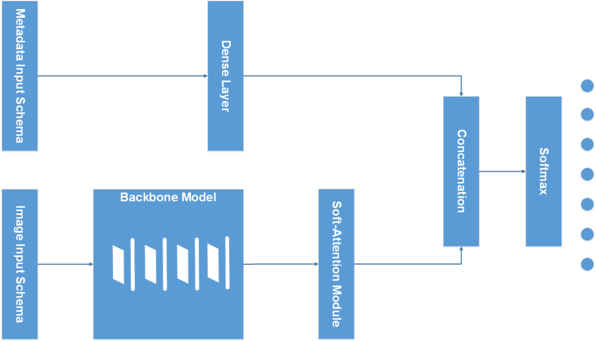
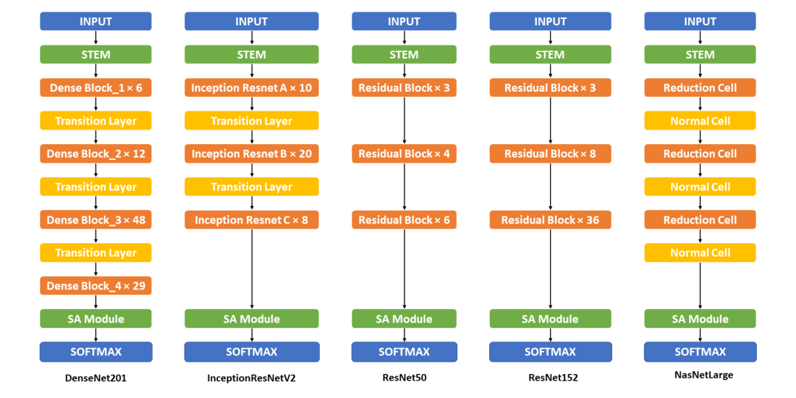
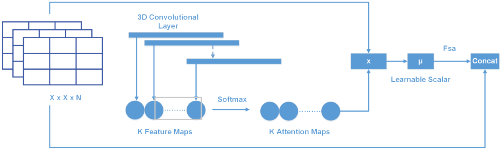
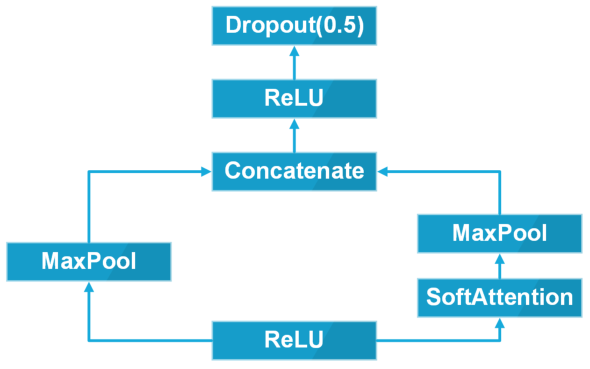
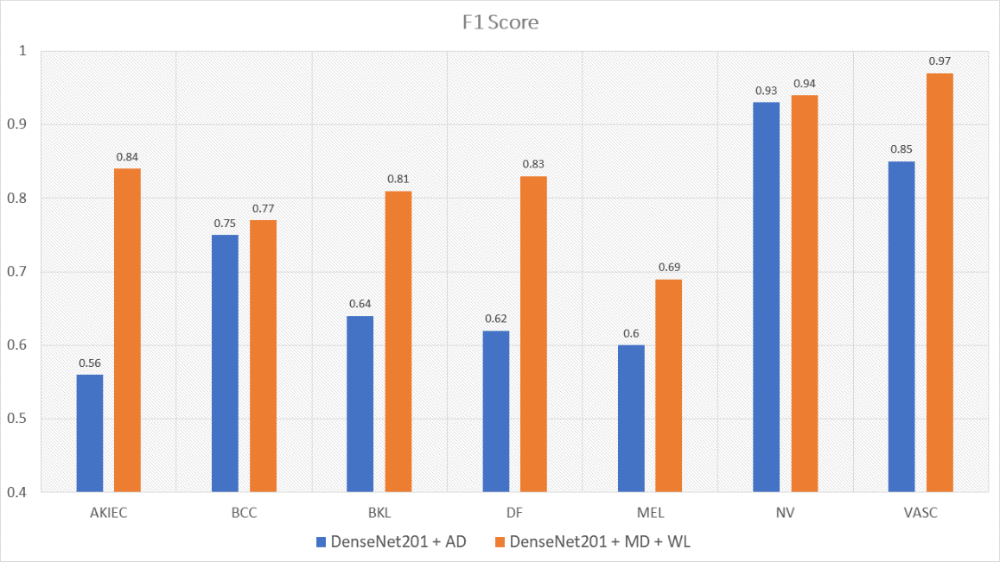
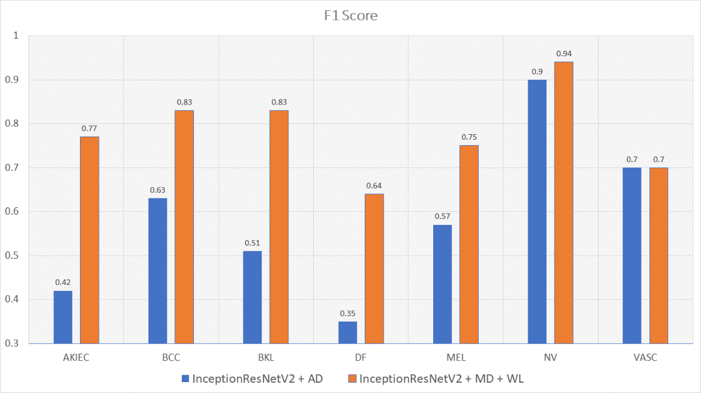
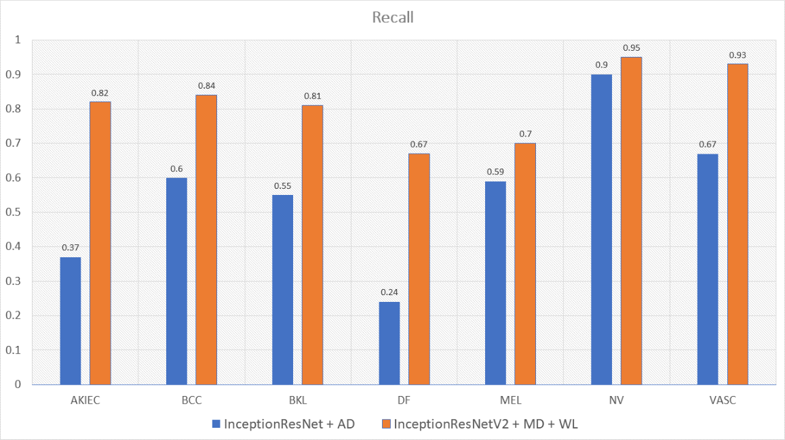
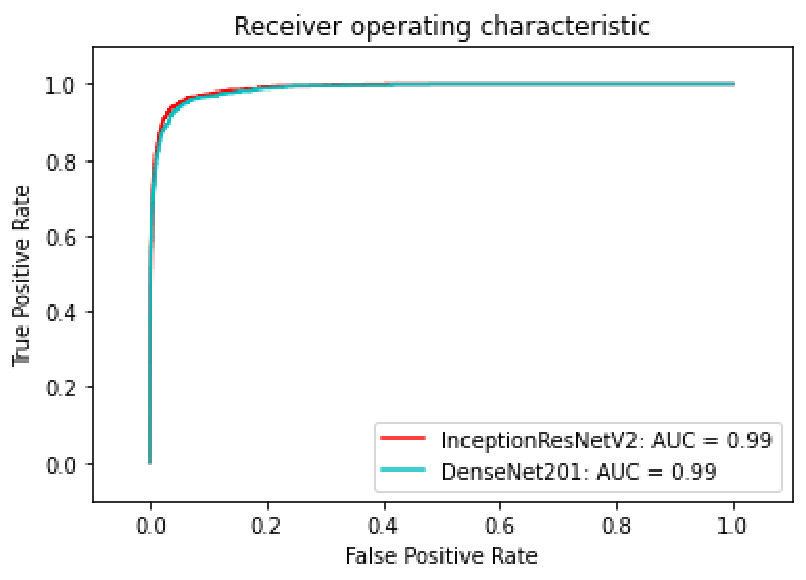

# Soft-Attention을 이용한 불균형 데이터 기반 피부 병변 분류

- 원문 PDF: `sensors-22-07530-v4.pdf`
- 구성 원칙: PDF 원문을 논문 섹션 구조에 맞춰 재배치하고, 수식은 LaTeX로 별도 복원했다.

센서.

딥 러닝을 이용한 불균형 데이터에 대한 피부 병변 분류 소프트 에셔닝을 이용한 딥 러닝.

비엣 둥 응우옌 1,*,, 응옥 둥 부이 2,* 및 호앙 커이 도 1,

본 논문에서는 주요 피부 병변의 열맵을 비지도 추출하는 소프트-어텐션과 하나의 딥러닝 모델(DenseNet, InceptionNet, ResNet 등)의 조합을 제안한다. 또한, 연령과 성별을 포함한 개인 정보도 사용한다. 데이터의 불균형을 고려한 새로운 손실

또한 소프트-어텐션과 새로운 손실함수가 결합된 모바일넷V3Large를 사용하면 파라미터 수가 11배 적고 은닉층 수가 4배 적음에도 불구하고 0.86의 정확도와 인셉션리스넷V2보다 30배 빠른 진단을 달성한다.

응우옌, 기원전, 부이, 기원전.

Do, H.K. 피부 병변 분류

딥 딥을 이용한 불균형 데이터에 대한

부드러운 주의력으로 학습합니다. 센서

2022, 22, 7530. https://doi.org/

키워드: 피부 병변, 분류, 딥러닝, 부드러운 주의력, 불균형.

### 10.3390/s22197530

학술 편집자: 아흐메드 부르다네.

수령 : 2022년 8월 30일

## Introduction
1.1. Problem Statement

승인 : 2022년 9월 23일

출간: 2022년 10월 4일자

피부암은 전 세계적으로 사망에 이르는 가장 흔한 암 중 하나이다. 매일 9500명 이상이 피부암으로 진단되고, 그렇지 않으면 매년 360만 명이 기저세포 피부암 진단을 받는다. 피부암 재단에 따르면, 전 세계적으로 피부암의 발병률은 계속 증가하고 있다. 반면에, 2019년 미국에서는 192

최근, 특히 피부 질환 진단 작업에서 다양한 작업에서 우수한 성능을 달성하기 위해 특히 일반 알고리즘에서 딥러닝 및 기계 학습이 등장했습니다. AI 지원 컴퓨터 지원 진단(CAD)[3]은 진단, 예후 및 의료 치료의 세 가지 주요 범주에 대한 솔루션을 가지고 있습니다. AI를 포함한 의료 영상은

출판사의 노트 MDPI는 중립을 유지합니다

관할권 청구와 관련하여

출판된 지도와 제도적 비호감.

아이션.

저작권 : 저자들의 © 2022입니다.

라이센스 MDPI, 스위스 바젤.

이 기사는 오픈 액세스 기사입니다.

약관에 따라 배포하고

크리에이티브 커먼즈의 조건

귀속(CC BY) 라이센스(https://)

크리에이티브 컴몬스.org/면허/by/by.

### 4.0/)

센서 2022, 22, 7530. https://doi.org/10.3390/s22197530 https://www.mdpi.com/journal/sensor.

센서 2022, 22, 7530 2 24중

초음파, 컴퓨터 단층 촬영, 자기 공명 영상 및 X선 영상은 임상 실습에서 광범위하게 사용된다. 진단에서는 의사의 진단 결과가 고려되기 전에 진행 실행을 절약하기 위해 질병 검출에 AI 알고리즘이 적용된다. 예후에서는 AI 모델이 특정 질병에 대한 솔루션을 구축하는 데 적용됩니다. 의학 혁명은 예시이다

피부암 사례의 증가에 적응하기 위해 지난 10년 동안 AI 알고리즘은 큰 성능을 가지고 있다. 언급할 수 있는 대표적인 모델은 DenseNet[4], EfficientNet[5], Inception[6,7], MobileNets[5,8,9], X

## 관련 연구

피부 병변 분류는 최근 몇 년 동안 구축된 훌륭한 성능 모델이 많기 때문에 새로운 영역이 아니다. 피부 분류 접근법은 두 가지 주요 접근법, 즉 딥 러닝과 머신 러닝(표 1과 같다)으로 나눌 수 있다. 두 접근법 모두 훌륭한 성능을 얻는다. 데이터 증강 및 특징 추출기는 모델을 더

<표 1>. 관련 작품 정리.

작업 딥러닝 기계 학습 데이터 증강 기능 추출기 데이터 세트 결과

[1] x HAM10000 0.93(ACC) 분류

[14] 분류 x x HAM10000 0.9(ACC)

[15] 분류 x HAM10000, PH2.

[16] x HAM10000 0.88(ACC)을 분류한다.

[17] x HAM10000 0.86(ACC) 분류

[18] x x HAM10000, BCN-20000, MSK 0.85(ACC)를 분류한다.

[19] x HAM10000 0.85(ACC)를 분류한다.

[20] x HAM10000 0.92(AUC)를 분류한다.

[21] x HAM10000 0.92(AUC)를 분류한다.

[22] x HAM10000 0.74(리콜)를 분류한다.

[23] x x HAM10000 분류.

[24] x HAM10000 0.92(ACC)를 분류한다.

[25] 세그 HAM10000 0.99 (ACC)

[26] 세그 HAM10000 0.97 (ACC)

## 딥러닝 접근법

센서 2022, 22, 7530 3 24중

수미약 등의 제안 방법은 높은 성능을 얻었고 또한 0.93의 정확도와 0.92의 정확도로 다른 많은 연구를 능가했다. 그러나, 위의 백본을 사용하여 클래스에 대해 하위 분류 분류를 얻었고, 따라서 그들의 모델은 각각 0.71 및 0.75의 리콜 및 F1-점수를 얻었다

히스토그램 등화는 랜덤 포레스트, XGBoost 및 지원 벡터 머신을 포함한 기계 학습 알고리즘에 공급되기 전에 피부 병변의 콘트라스트를 증가시키는 데에도 사용된다. 히스토gram 등화는 또한 동일한 값 픽셀의 발생 횟수로 주요 특징을 취하는 히트 맵으로 간주될 수

그렇지 않으면 Rishu Garg 등의 제안 방법은 또한 F1-점수와 회수율이 각각 0.77과 0.74인 불균형 데이터 세트로 인한 불균형 분류의 문제에 직면했다. Abayomi-alli 등은 전체 불균형 데이터 세트를 사용하는 대신, 데이터 세트를 두 개의 하위 세트로 분리하기로 결정했다. SMOTE

본 연구에서는 데이터셋 HAM10000과 PH2를 결합하여 8등급 데이터셋을 생성한다. 딥 CNN 모델에 공급되기 전에, 흑색종 및 기저 세포 암종에 대한 최적의 AUC 값은 0.94(ResNet152)와 0.93(DenseNet201)

이 접근법은 0.88의 정확도를 얻었지만, 이 방법은 피부 병변 분야에서 오버랩된 구멍을 생성할 수 있기 때문에 컷아웃 방법으로 인해 편향될 수 있다. 그렇지 않으면, Ref. [17]은 데이터-증강 프로세스로 인해 정확도가 낮습니다. Ref, 펭야

이 접근법은 데이터 불균형 문제를 해결했지만, 낮은 정확도를 얻은 결과는 RandArgument에 기인할 수 있다. 이미지의 피부 병변 부분이 상당히 크거나 작으면, 크로핑된 이미지는 피부를 포함할 수 있거나 또는 병변이 전체 이미지에서 퍼지게 된다. 또 다른 최첨단 방법은 Gra

센서 2022, 22, 7530 4 24중

모델들에 공급되고, 이미지들은 질량 중심을 찾기 위해 매우 낮은 임계값으로 이진화에 의해 전처리된다. 한편, 학생- 및-교사 모델은 또한 2021 [19]에 도입된 고성능 모델이며, 이는 다른 모델과 기억을 공유하는 두 모델의 조합으로 생성된다. 따라서, 모델들은 다른 사람들이

본 발명은 각각 이미지의 형상이 (450, 600)에서 (600 및 600)로 증가하도록 이미지를 패드하는 방법에 관한 것이다. SkinLinkNet에서, 이미지는 대신 (448, 448)로 리사이징된다. 이 방법은 Nil Gessert 등에 의해 [22]

누락된 데이터 문제를 극복하기 위해, 연구 연구는 그룹에 원-핫 인코딩을 적용했지만, 초기 검증은 수치 인코드를 적용할 때 성능이 좋지 않은 결과를 초래했다. 메타데이터는 두 개의 블록 네트워크로 공급되며, 각각의 블록 네트워크는 밀도 레이어, 배치 정규화, 암 ReLU

그들의 제안된 방법은 Unet 모델이지만 DenseNet77을 골격으로 사용했으며 모든 잔여 블록은 Convolution 및 Average Pooling의 시퀀스를 포함하는 밀집 블록으로 변경되었다. 이 흑색종 세그먼테이션 접근법은 0.99의 정확도를 얻었다. Kadry 등은 스킵 연결

## 기계학습 접근법

머신 러닝에는 많은 접근법이 있다. 이미지의 데이터가 머신 학습 알고리즘에 대해 상당히 복잡하기 때문에 랜덤 포레스트, XGBoost 및 지원 벡터 기계는 머신러닝 알고리즘에 직접 공급되고 유망한 결과를 보여주지 않기 때문에 리슈 가그 등은 사용된 머신학습 알고리즘의 결과를

딥 격리 포레스트에서, 이미지의 주요 패턴을 학습하기 위해 CNN을 사용하여 특징 추출기를 적용한다. 그 후, 특징 맵은 백깅 알고리즘을 사용하여 K 격리포레스트 추정기에 공급된다. 그러나, AUC는 0.9의 정확도 및 0.86의 신뢰도를 획득한다. 또한, 매트릭스 변환은

센서 2022, 22, 7530 5 24중

그런 다음 특징 벡터를 생성하기 위해 글로벌 평균 풀링에 공급됩니다. 이 특징벡터는 CNN-1D에 의해 추출되고 소프트-맥스 계층으로 진행하기 전에 필터로서 이산 푸리에 변환(DFT)에 의해 변환됩니다.

## 제안 방법

본 연구에서는 다음과 같은 조합으로부터 새로운 모형을 구성한다.

- DenseNet201, InceptionResNetV2, ResNet50/152, NasNetLarge, NasNetMobile 및 MobileNetV2(V2/V3)를 포함하는 백본 모델; - 연령, 성별, 지역화를 포함하는 메타데이터를 모델의 다른 입력

2. 재료 및 방법 2.1. 재료 2.1.1. 이미지 데이터

본 논문에서 사용된 데이터 세트는 하바르드 대학 데이터버스[32]에 의해 발표된 HAM10000 데이터 세트이다. 이 데이터 세트에는 액틴성 각화증 및 상피내 암종 또는 보웬병(AKIEC), 기저 세포 암종(BCC), 양성 각

표 2. HAM10000에서의 데이터 분포.

클래스 AKIEC BCC BKL DF MEL NV VASC Total

No. 샘플 327 514 1099 115 1113 6705 142 10,015.

그림 1. 각 클래스의 예시 이미지.

> 그림 내부 텍스트 번역:
> - `AKIEC` → 아키에이.
> - `BCC` → BCC
> - `BKL` → BKL
> - `DF` → DF
> - `NV` → NV
> - `MEL` → MEL
> - `VASC` → VASC

## 메타데이터

HAM10000 데이터 세트[32]는 또한 표 3에 도시된 바와 같이 성별, 연령 및 캡처 위치를 포함한 각 환자의 메타 데이터를 포함한다.

표 3. 데이터 세트의 메타데이터 예.

ID Age Gender Local

ISIC-00001 15 수컷 백

ISIC-00002 85 여자 팔꿈치

센서 2022, 22, 7530 6 24중

모델의 전체 아키텍처는 그림 2에 표현된다. 모델은 이미지 데이터와 메타데이터를 포함한 두 개의 입력을 취한다. 메타데이터 분기는 그렇지 않으면 조밀한 층으로 공급되기 전에 전처리된 다음 소프트-감수층의 출력과 연결된다.

그림 2. 전체 모델 아키텍처.

> 그림 내부 텍스트 번역:
> - `Metadata Input Schema` → 메타데이터 입력 체계
> - `Dense Layer` → 밀도 높은 레이어.
> - `Concatenation` → 연결.
> - `Softmax` → 소프트맥스.
> - `BackboneModel` → 백본모형.
> - `Image Input Schema` → 이미지 입력 도식
> - `Soft-Attention Module` → 소프트-감지 모듈
> - `三三三` → 三三三

그림 3은 본 연구에서 사용되는 백본 모델과 소프트-어텐션의 조합의 전반적인 구조를 보여준다. 구체적으로, DenseNet201과 소프트 -어텐셜의 조합은 마지막 3개(DenseBlock, Global Average Pooling, Full connected layer)를 소프트-Attention

> 그림 내부 텍스트 번역:
> - `INPUT` → 아이펀트.
> - `STEM` → STEM.
> - `Dense Block_1 × 6` → 밀도 블록_1 × 6
> - `Residual Block × 3` → 잔차 블록 × 3
> - `Inception Resnet A × 10` → 인셉션 Resnet A × 10
> - `Reduction Cell` → 감속 셀.
> - `Transition Layer` → 전환 계층
> - `Normal Cell` → 일반 셀
> - `Inception Resnet B × 20` → 인셉션 Resnet B × 20
> - `Dense Block_2×12` → 밀도 블록_2×12
> - `Residual Block × 4` → 잔차 블록 × 4
> - `Residual Block× 8` → 잔차 블록×8
> - `Dense Block_3 × 48` → 밀도 블록_3 × 48
> - `Residual Block × 6` → 잔차 블록 × 6
> - `Residual Block×36` → 잔차 블록×36
> - `Inception Resnet C × 8` → 인셉션 Resnet C × 8
> - `Dense Block_4 × 29` → 밀도 블록_4 × 29
> - `SA Module` → SA 모듈
> - `SOFTMAX` → SOFTMAX
> - `DenseNet201` → DenseNet201
> - `ResNet50` → ResNet50
> - `InceptionResNetV2` → 인셉션ResNetV2
> - `ResNet152` → ResNet152
> - `NasNetLarge` → NasNetLarge

그림 3. 제안된 백본 모델 아키텍처. 이 그림은 DenseNet201, InceptionResNetV2, ResNet50, ReSNet152, NasNetLarge를 포함하는 백본모델(비모바일 기반 모델)의 전반적인 구조를 보여준다. 자세한

> 그림 내부 텍스트 번역:
> - `INPUT` → 아이펀트.
> - `Bottleneck 3 × 3 SE` → 병목 3 × 3 SE
> - `Bottleneck` → 병목.
> - `Bottleneck 3 × 3 3` → 병목 3 × 3 3
> - `Reduction Cell` → 감속 셀.
> - `repeated` → 반복.
> - `Bottleneck × 2` → 병목 × 2
> - `Bottleneck 3 × 3` → 병목 3 × 3
> - `Bottleneck5×5SE` → 병목5×5SE
> - `Normal Cell` → 일반 셀
> - `3 repeated` → 3번 반복.
> - `Bottleneck×3` → 병목×3
> - `8repeated` → 8번 반복.
> - `Bottleneck3 ×3 4` → 보틀넥3 ×3 4
> - `Bottleneck × 4` → 병목 × 4
> - `Bottleneck3×3SE` → 보틀넥3×3SE
> - `Bottleneck × 3` → 병목 × 3
> - `2 repeated` → 2번 반복.
> - `SA Module` → SA 모듈
> - `SOFTMAX` → SOFTMAX
> - `MobileNetV2` → 모바일넷V2
> - `MobileNetV3Large` → MobileNetV3Large
> - `MobileNetV3Small` → 모바일넷V3Small
> - `NasNetMobile` → NasNetMobile

센서 2022, 22, 7530 7 24중

한편, 그림 4는 모바일 기반 모바일의 세부 구조와 소프트-어텐션과의 결합을 보여준다. 모든 모바일넷 버전은 마지막 2개의 컨볼루션 레이어 1×1을 소프트-애텐션 모듈로 대체하여 소프트-아텐션모듈과 결합한다. 그렇지 않으면 NasNetMobile

> 그림 내부 텍스트 번역:
> - `Age` → 나이.
> - `Normalization` → 정상화.
> - `Category` → 카테고리.
> - `Gender` → 성별.
> - `String Lookup` → 스트링 룩업.
> - `Concatenate` → 당신과 함께요.
> - `Dense Layer` → 밀도 높은 레이어.
> - `Encoding` → 인코딩
> - `Capture` → 캡처.
> - `position` → 위치.

그림 4. 모바일 기반 백본 모델 아키텍처. 이 그림은 모바일NetV2, 모바일NetVi3Small, MobileNetV3Large, NasNetMobile을 포함한 모바일 기반백본 모델의 전반적인 구조를 보여준다. 자세한 구조와 정보는 부록 B의 표 A2에서 확인할 수

> 그림 내부 텍스트 번역:
> - `3D Convolutional` → 3D 컨볼루션
> - `Layer` → 층.
> - `Fsa` → 에프사.
> - `Concat` → 컨카운팅.
> - `Learnable Scalar` → 학습 가능한 Scalar
> - `XxXXN` → XxXXN.
> - `Softmax` → 소프트맥스.
> - `KFeature Maps` → KFeature Maps
> - `KAttentionMaps` → KAttentionMaps

## 입력 스키마

이미지 전처리는 이미지의 주요 패턴을 추출하는 능력 때문에 훈련 프로세스의 필수적인 부분입니다. 이 단계에서 이미지 검색은 이미지의 주된 특징을 나타내는 벡터를 다른 색상 채널로 변경할 수 있습니다. 이러한 이미지 검색 기술은 에너지 압축, 원시 패턴 단위 등을 포함할 수 있다. Shervan Fekri-E

본 연구에서, 이미지 데이터는 모든 클래스에 대해 증강되고, 이미지의 수는 18,015 이미지로 증가하며, 원본 형태를 유지한다. 백본 모델에 공급하기 전에, 이미지는 RGB에서 BGR로 스케일링되고, 각각의 채널은 이미지 네트워크 데이터 세트에 대해 정규화된다. 반면,

센서 2022, 22, 7530 24 중 8

본 연구에서는 미지의 것을 메타데이터 섹션에서 논의된 것과 같은 유형으로 유지한다. 성별, 해부학적 부위 및 연령도 각각 카테고리 인코딩되고 수치적으로 정규화된다. 처리 후, 메타데이터는 4096개의 뉴런의 조밀한 층으로 연결되고 공급된다. 마지막으로, 이

그림 5. 입력 스키마.

> 그림 내부 텍스트 번역:
> - `Dropout(0.5)` → 드롭아웃(0.5)
> - `ReLU` → 리루.
> - `Concatenate` → 당신과 함께요.
> - `MaxPool` → 맥스풀.
> - `SoftAttention` → Soft Attention

### Backbone Model

본 논문에서 사용되는 백본 모델은 DenseNet201[4], Inception[6], MobileNets[5,8,9], ResNet[11,12] 및 NasNet[13]이다. 그렇지 않으면 Resnet50은 더 많은 파라미터와 깊이

표 4. 본 논문에서 사용한 백본 모형의 크기, 파라미터 및 깊이.

모델 사이즈(MB) No. 학습 가능한 파라미터 깊이

Resnet50 98 25,583,592 107 107

Resnet152 232 60,268,520 311

DenseNet201 80 20,013,928 402

인셉션ResNetV2 215 55,813,192 4494.

모바일넷V2 14 3,504,872 105 105

모바일넷V3Small Unknown 2,542,856 8888

모바일넷V3Large Unknown 5,483,032 118.

나스넷모바일 23 5,289,978 308

NasnetLarge 343 88,753,150 533.

### Soft-Attention Module

Soft-Attention은 [35] 또는 핸드라이팅 검증 [36]과 같은 이미지 캡션 생성과 같은 다양한 응용 분야에서 사용되어 왔다. 소프트-어텐션은 해당 특징 맵에 낮은 가중치를 곱함으로써 이미지의 관련 없는 영역을 무시할 수 있다. 소프트(Soft) 어텐

fsa = t K  k = 1이므로 f tmax(Wk  t) (1)

센서 2022, 22, 7530 24중 9

그림 6. 소프트-어텐션 레이어.

> 그림 내부 텍스트 번역:
> - `trueclass` → 진정한 클래스
> - `total` → 총.
> - `True Positives` → 진짜 긍정.
> - `False Positives` → 거짓 양성.
> - `predicted` → 예측.
> - `predicted class` → 예측된 등급
> - `(TP)` → (TP)
> - `(FP)` → (FP)
> - `False Negatives` → 거짓 네거티브.
> - `True Negatives` → 진짜 네거티브.
> - `(FN)` → (FN)
> - `(TN)` → (TN)
> - `true` → 진짜.

그림 7. 소프트-어텐션 모듈.

> 그림 내부 텍스트 번역:
> - `0.8` → 0.8
> - `True Positive Rate (Sensitivity)` → 진심 양성률(감응도)
> - `0.6` → 0.6
> - `0.4` → 0.4
> - `0.2` → 0.2
> - `Area Under the Curve (AUC)` → 곡선 아래 영역(AUC)
> - `False Positive Rate (1 - Specificity)` → 거짓 양성률(1 - 특정)

## 손실 함수

그림 6은 소프트-어텐션을 적용하는 두 가지 주요 단계를 보여준다. 먼저, 입력 텐서는 고해상도 이미지로부터 격자 기반 특징 추출에 투입되고, 여기서 h, w, d는 컨볼루션 뉴럴 네트워크(CNN)에 의해 생성된 텐서의 형상이다. 이 컨볼

> 그림 내부 텍스트 번역:
> - `akiec` → 아키크.
> - `20` → 20
> - `-600` → -600
> - `bcc` → bcc.
> - `-500` → -500
> - `-400` → -400
> - `-300` → -300
> - `mel` → 멜리.
> - `74` → 74
> - `31` → 31
> - `-200` → -200
> - `12` → 12
> - `16` → 16
> - `630` → 630
> - `-100` → -100
> - `vasc` → 바스켓.
> - `13` → 13
> - `-0` → -0
> - `bkl` → bkl.
> - `nv` → nv

마지막으로, 소프트-어텐션 함수 fsa의 출력은 시작 특징 텐서 t와 스케일링된 어텐션 맵들의 연결이다.

본 연구에서는 [1]에서와 동일하게 소프트-감지층을 적용하였으며, Soft Attention 모듈은 [그림 7]에 기술하였다.

ReLU 함수 층에 공급된 후, 열 특징 맵은 2개의 경로로 처리된다. 첫 번째 경로는 2차원 맥스 풀링이다. 두 번째 경로에서는 다른 한편으로 특징 맵이 2차원 Max 풀링 전에 소프트-어텐션 층에 공급된다. 결국, 이 두 경로는

본 논문에서 사용된 손실 함수는 범주형 교차 엔트로피[38]이다. X = [x1, x2,..., xn]을 입력 피쳐로 하고,  = [1, -2, -, -n], N 및 C를 각각 훈련 예제 수

N  n=1 Wc × yc n × log(yc n) (2)

L(, xn) = 1

## N

yc i가 모델의 출력이고 yc i는 모델이 반환해야 하는 대상이며 Wc는 클래스 c의 가중치이다. 데이터 세트가 불균형 문제에 직면하기 때문에 손실에 대한 클래스 가중치를 적용한다. 본 연구에서는 원래의 가중치와 새로운 가중치를 모두 적용한다.

센서 2022, 22, 7530 24중 10

## Results
3.1. Experimental Setup
3.1.1. Training

### Tools

### 평가 지표

원래는 각 클래스가 차지하는 백분율의 역수를 취하여 가중치를 계산한다. 새로운 가중치 공식은 식 (3) 및 (4)에 설명되어 있다. 이 가중치 공식에는 원래의 가중치에 데이터 세트의 클래스 수의 역수가 곱해져 훈련이 더 균형 잡힌다. 게리 킹 등이 제안한 '균형

$$
W=N\odot D\tag{3}
$$

$$
D=\left[\frac{1}{C N_1},\frac{1}{C N_2},\ldots,\frac{1}{C N_n}\right]\tag{4}
$$

C  h 1 N1 1 N2.. 1 Nn

i
(4)

여기서 N은 훈련 샘플의 개수이고, C는 클래스의 개수이며, Ni는 각 클래스 i에서의 샘플 개수이다. D는 C × Ni의 역수를 포함하는 행렬이다.

트레이닝 전에, 데이터 세트는 트레이닝(90%) 및 검증(10%)을 위해 두 개의 서브세트로 분할된다. 그렇지 않으면 테스트 세트는 HAM10000 데이터 세트에 의해 제공되며, 857개의 이미지를 포함한다. 모델에 대한 증강 데이터의 영향을 분석하기 위해, 트레이닝 전에 이미지 데이터는 다음과 같은 기술에

- 회전 범위: 180 각도 범위에서 이미지를 회전한다. - 폭 및 높이 이동 범위: 각각 0.1 범위의 범위로 이미지를 수평 및 수직으로 시프트합니다. - 줌 범위: 이미지를 0.1 범위로 줌 인 또는 줌 아웃하여 새로운 이미지를 생성합니다. 수직 및 수평 플립링: 이미지를 가로 및

그렇지 않으면, 모든 모델은 0.1×106의 최소 학습률에 0.2배 감소된 0.001의 학습률로 아담 최적화기[40]로 학습되고, 실론은 0.1로 설정된다. 초기 에폭은 250에폭으로 설정되며, 25에폭 이후 검증 세트의

텐서플로우(TensorFlow)와 케라스(Keras)는 딥러닝 모델을 구축하기 위해 가장 인기 있는 두 프레임워크 중 하나이다. 본 연구에서, 텐서 플로우 기반의 케라스는 이미지-넷 데이터 세트로 사전 트레이닝된 백본 모델을 구축하고 클론하기 위해

모형은 혼동 행렬 및 관련 메트릭을 사용하여 평가된다. 그림 8은 클래스 2에 사용되는 2 × 2 혼동 행렬의 제시를 나타낸다. C개의 클래스 수를 갖는 혼동 행렬 A를 고려한다. Ai와 Aj를 각각 A 행과 열의 집합으로 하고, Ai k는

a11 a12. a1j a21 a22... a2j...... ai1 ai2.... ai3 ai4.









센서 2022, 22, 7530 24 중 11

그림 8. 혼란 행렬.

> 그림 내부 텍스트 번역:
> - `600` → 600
> - `akiec` → 아키크.
> - `bcc` → bcc.
> - `43` → 43
> - `500` → 500
> - `88` → 88
> - `11` → 11
> - `400` → 400
> - `-300` → -300
> - `mel` → 멜리.
> - `79` → 79
> - `25` → 25
> - `-200` → -200
> - `13` → 13
> - `20` → 20
> - `620` → 620
> - `-100` → -100
> - `vasc` → 바스켓.
> - `-0` → -0
> - `bkl` → bkl.
> - `nv` → nv

#

$$
TN_c=\sum_{i=1}^{C}\sum_{j=1}^{C}a_{ij}-TP_c-FP_c-FN_c\tag{7}
$$

이 경우의 모든 클래스의 트루 포지티브(TP)는 행렬 A의 주요 대각선이다. 다음의 방법들이 모든 클래스들의 위수(FP), 위수 음수(FN) 및 트루 네거티브(TN)를 계산하는데 사용된다.

$$
FP_c=\sum_{i=1}^{C}a_{ic}-TP_c\tag{5}
$$

$$
FN_c=\sum_{j=1}^{C}a_{cj}-TP_c\tag{6}
$$

그런 다음 다음 모델을 다음 지표로 평가합니다.

$$
\mathrm{Sensitivity}=\frac{TP}{TP+FN}\tag{8}
$$

$$
\mathrm{Specificity}=\frac{TN}{TN+FP}\tag{9}
$$

민감도(식 (8))와 특이도( 식 (9))는 조건의 유무를 식별하는 검사의 정확도를 수학적으로 설명한다. 참 양성률로도 알려진 민감도는 검사가 참 양성으로 귀결될 가능성인 반면, 참 음성률이라고도 알려진 특이도는 검사 결과가 참 음성으로 귀결

$$
\mathrm{Precision}=\frac{TP}{TP+FP}\tag{10}
$$

$$
F1=\frac{2TP}{2TP+FP+FN}\tag{11}
$$

정밀도(식(10)) 또는 양성 예측값(PPV)은 양성 또는 음성 양자를 조건으로 한 양성 검사의 확률을 의미하는 반면, F1-점수(식(11))는 정밀도와 회상도의 조화 평균을 의미하며, 또한 다중 클래스 문제로 인해 정밀도의 기대값

$$
\mathrm{Accuracy}=\frac{TP+TN}{TP+FP+FN+TN}\tag{12}
$$

센서 2022, 22, 7530 12 24중

2
(13)

마지막 메트릭은 TP의 확률 대 FP의 확률을 나타내는 수신기 작동 곡선(ROC)인 곡선 아래 영역에 대한 AUC(그림 9와 같이) 점수이다.

그림 9. 곡선 아래 영역.

> 그림 내부 텍스트 번역:
> - `F1Score` → F1Score
> - `0.97` → 0.97
> - `0.93` → 0.93
> - `0.94` → 0.94
> - `0.9` → 0.9
> - `0.84` → 0.84
> - `0.85` → 0.85
> - `0.83` → 0.83
> - `0.81` → 0.81
> - `0.8` → 0.8
> - `0.77` → 0.77
> - `0.75` → 0.75
> - `0.7` → 0.7
> - `0.69` → 0.69
> - `0.64` → 0.64
> - `0.62` → 0.62
> - `0.6` → 0.6
> - `0.56` → 0.56
> - `0.5` → 0.5
> - `0.4` → 0.4
> - `AKIEC` → 아키에이.
> - `BKL` → BKL
> - `DF` → DF
> - `MEL` → MEL
> - `NV` → NV
> - `BCC` → BCC
> - `VASC` → VASC
> - `DenseNet201+AD` → DenseNet201+AD
> - `DenseNet201+MD+WL` → DenseNet201+MD+WL

## 논의

표 5에 따르면, 메타데이터로 학습된 모델은 증강 데이터로만 학습된 모델보다 높은 정확도를 갖는 것이 분명하다. 인셉션ResNetV2와 DenseNet201은 각각 0.79 및 0.84의 정확도를 가지지만, 메타 데이터로 학습되는 Resnet50은 증강

표 5. 모든 모델의 정확도. ACC는 정확도를 나타낸다. AD는 증강 데이터를 나타낸다. MD는 메타데이터를 나타내며, 이는 모델이 메타데이터로 훈련됨을 나타낸다. 굵은 숫자는 가장 높은 성능을 강조한다. 이러한 결과는 혼동 행렬로부터 계산되며, 두 개의 가장 높은 모델 혼동 행렬은 DenseNet

모델 ACC(AD) ACC(MD)

인셉션ResNetV2 0.79 0.90

밀도넷201 0.84 0.89

ResNet50 0.76 0.70

ResNet152 0.81 0.57

NasNetLarge 0.56 0.84

모바일넷V2 0.83 0.81

모바일넷V3Small 0.83 0.78

모바일넷V3Large 0.85 0.86

NasNetMobile 0.84 0.86

센서 2022, 22, 7530 13 24중

더욱이, 증강 데이터로 학습된 모델은 정확도가 낮을 뿐만 아니라 F1-점수 및 회상도 그림 12 내지 그림 15에 따라 불균형이다. 그 결과, 메타데이터에 의해 학습된 InceptionResNetV2는 클래스 df에서 F1 -점수를 가지며, 아키

메타데이터를 사용하는 것은 여전히 모델의 편향을 초래하지만, 모델의 성능 향상에 기여한다.

그림 10. DenseNet201 혼동 행렬.

> 그림 내부 텍스트 번역:
> - `F1Score` → F1Score
> - `0.94` → 0.94
> - `0.9` → 0.9
> - `0.83` → 0.83
> - `0.8` → 0.8
> - `0.77` → 0.77
> - `0.75` → 0.75
> - `0.7` → 0.7
> - `0.63` → 0.63
> - `0.64` → 0.64
> - `0.6` → 0.6
> - `0.57` → 0.57
> - `0.51` → 0.51
> - `0.5` → 0.5
> - `0.42` → 0.42
> - `0.4` → 0.4
> - `0.35` → 0.35
> - `0.3` → 0.3
> - `BKL` → BKL
> - `AKIEC` → 아키에이.
> - `BCC` → BCC
> - `DF` → DF
> - `MEL` → MEL
> - `NV` → NV
> - `VASC` → VASC
> - `InceptionResNetV2+AD` → 인셉션ResNetV2+AD
> - `InceptionResNetV2+MD+WL` → 인셉션ResNetV2+MD+WL

그림 11. 인셉션ResNetV2 혼동 행렬.

> 그림 내부 텍스트 번역:
> - `Recall` → 재연.
> - `0.96` → 0.96
> - `0.95` → 0.95
> - `0.93` → 0.93
> - `0.9` → 0.9
> - `0.85` → 0.85
> - `0.83` → 0.83
> - `0.8` → 0.8
> - `0.78` → 0.78
> - `0.75` → 0.75
> - `0.7` → 0.7
> - `0.65` → 0.65
> - `0.63` → 0.63
> - `0.6` → 0.6
> - `0.59` → 0.59
> - `0.55` → 0.55
> - `0.54` → 0.54
> - `0.53` → 0.53
> - `0.5` → 0.5
> - `BKL` → BKL
> - `AKIEC` → 아키에이.
> - `BCC` → BCC
> - `DF` → DF
> - `MEL` → MEL
> - `NV` → NV
> - `VASC` → VASC
> - `DenseNet201+AD` → DenseNet201+AD
> - `DenseNet201+MD+WL` → DenseNet201+MD+WL

센서 2022, 22, 7530 24중 14

그림 12. 증강 데이터로 학습된 DenseNet201의 F1-점수와 메타데이터 및 체중 감소로 학습된 것의 비교.

> 그림 내부 텍스트 번역:
> - `Recall` → 재연.
> - `0.95` → 0.95
> - `0.93` → 0.93
> - `0.9` → 0.9
> - `0.84` → 0.84
> - `0.82` → 0.82
> - `0.81` → 0.81
> - `0.8` → 0.8
> - `0.7` → 0.7
> - `0.67` → 0.67
> - `0.6` → 0.6
> - `0.55` → 0.55
> - `0.5` → 0.5
> - `0.4` → 0.4
> - `0.37` → 0.37
> - `0.3` → 0.3
> - `0.24` → 0.24
> - `0.2` → 0.2
> - `0.1` → 0.1
> - `AKIEC` → 아키에이.
> - `BKL` → BKL
> - `MEL` → MEL
> - `BCC` → BCC
> - `DF` → DF
> - `NV` → NV
> - `VASC` → VASC
> - `InceptionResNet+AD` → 인셉션ResNet+AD
> - `InceptionResNetV2+MD+WL` → 인셉션ResNetV2+MD+WL

그림 13. 증강 데이터로 학습된 InceptionResNetV2의 F1-점수와 메타데이터 및 체중 감소로 학습된 것을 비교한다.

> 그림 내부 텍스트 번역:
> - `Receiver operating characteristic` → 수신기 작동 특성
> - `10` → 10
> - `0.8` → 0.8
> - `Tue Positive Rate` → Tue Positive Rate
> - `0.6` → 0.6
> - `0.4` → 0.4
> - `0.2` → 0.2
> - `InceptionResNetv2:AUC = 0.99` → InceptionResNetv2:AUC = 0.99
> - `0.0` → 0.0
> - `DenseNet20l:AUC = 0.99` → DenseNet20l:AUC = 0.99
> - `False Positive Rate` → 거짓 양성률.

이러한 문제는 그림 14 및 그림 15에 따른 리콜에서도 마찬가지이다. 증강 데이터로 학습된 DenseNet201과 InceptionResNetV2는 각각 0.56 및 0.69의 예상 리콜값을 갖는 반면, Densenet201, Metadata 및 새로운 가중치 손실 함수의 조합

새로운 가중 손실 함수로 훈련된 DenseNet201과 InceptionResNetV2는 가중 손실함수가 없는 akiec에서의 훈련과 반대로 각각 0.85와 0.82의 Akiec의 리콜을 갖는다: 0.65 및 0.37.

센서 2022, 22, 7530 24중 15

그림 14. 증강 데이터로 트레이닝된 DenseNet201의 리콜과 메타데이터로 트레이닝 된 것과 체중 감소 사이의 비교.

> 그림 내부 텍스트 번역:
> - `Predicted` → 예측.
> - `Label` → 라벨.
> - `Melanoma` → 흑색종
> - `Nevus` → 모반.

그림 15. 증강 데이터로 훈련된 인셉션ResNetV2의 회상과 메타데이터 및 체중 감량으로 훈련된 것을 비교한다.

실험 동안 발견된 또 다른 흥미로운 점은 모바일넷V2, 모바일넷브이3, 나스넷모바일이 파라미터 수와 깊이가 적지만 상대적으로 성능이 우수하다는 것이다. 모바일넷v3Large, MobileNetV3Small, NasNetVarge 및 NasNetMobile은

구체적으로, 파라미터 수가 550만인 모바일넷V3Large는 각각 DenseNet201과 InceptionResNetV2보다 4배, 10배 적은 파라미터를 가지고 있다. 한편, 모바일넷v3Larsge의 깊이는 Densenet201, In

센서 2022, 22, 7530 24중 16

모바일NetV3Larege는 0.86의 정확도를 얻을 뿐, 예측에 필요한 시간은 다른 상대보다 10배, 30배 적은데, 더 나은 결과를 얻기 위해서는 더 까다로운 파라미터 하이퍼 튜닝 과정이 필요하기 때문에 이 또한 본 연구의 미래 목표이다.

표 6. 모바일NetV3Large와 DenseNet201과 InceptionResNetV2의 비교.

모델 모바일NetV3Large DenseNet201InceptionResnetV2

제1호. 학습 가능한 파라미터 5,490,039 17,382,935 47,599,671,236,237,238,335 4,549,672,336,438,239,439,339,

깊이 118 402 449

정확도 0.86 0.89 0.90

훈련 시간(초/초) 116 1000 3500 3500

시간(초) 0.13 1.16 4.08을 추론한다.

표 7은 증강 데이터 또는 메타데이터만으로 학습되는 세 가지 모델(InceptionResNetV2, DenseNet201, ResNet50)의 AUC를 나타낸다. 반면, 증강 데이터로 학습된 Resnet50은 메타데이터로 학습되는 AUC가 0.97

반면에 다른 모델들은 대략 동일한 AUC를 가지고 있다.

표 7. 모든 모델의 AUC. AD는 증강 데이터를 의미하며, 이는 모델이 증강 데이터로 훈련됨을 나타낸다. MD는 메타데이터를 의미하며 이는 모델이 메타데이터로 훈련되었음을 나타낸다. 두꺼운 숫자는 가장 높은 성능을 강조한다.

모델 AUC(AD) AUC (MD)

인셉션ResNetV2 0.971 0.99

밀도넷201 0.93 0.99

ResNet50 0.95 0.93

ResNet152 0.97 0.87

NasNetLarge 0.74 0.96

모바일넷V2 0.95 0.97

모바일넷V3Small 0.67 0.96

모바일넷V3Large 0.96 0.97

NasNetMobile 0.96 0.97

센서 2022, 22, 7530 24중 17

그림 16. DenseNet201과 InceptionResNetV2의 ROC.

각 클래스 모델의 표본 백분율로 계산된 원래의 체중 감소와 새로운 체중 감소 기반 모델의 비교와 더불어, 인셉션ResNetV2, DenseNet201 및 MobileNetV3을 포함한 3개의 가장 우수한 모델의 비교도 수행된다. 실험 후, 모델의 성능은 표 8에

본 연구에서 사용된 이 모델들은 또한 오름차순으로 정렬된 SOTA 모델들이다. 표에서 본 연구의 인셉션ResNetV2와 소프트-감수, 메타데이터 및 가중치 감소의 조합의 정확도는 각각 0.93에 비해 0.90이다. 그러나, 수

<표 8>. 손실 기반 모델 정확도 비교.

모델 무중량 오리지널 손실 정확도 신규 손실 정확도

인셉션레즈넷V2 0.74 0.79 0.90 DenseNet201 0.81 0.84 0.89 MobileNetV3Large 0.79 0.78 0.80 0.86 0.70 N.90 N.80 N.60 N.10 N.20 N.2

센서 2022, 22, 7530 24중 18

표 9. 비교 분석. 두꺼운 숫자는 가장 높은 성능을 강조합니다.

접근 정확도 정밀 F1-점수 리콜 AUC

인셉션ResNetV2 [1] 0.93 0.89 0.75 0.71 0.97.

[14]
-
0.88
0.77
0.74
-

[16]
0.88
-
-
-
-

[17]
0.86
-
-
-
-

GradCam과 Kernel SHAP [18] 0.88 - - ---

학생과 교사[19] 0.85 0.76 0.76 - - -

제안 방법 0.9 0.86 0.86 0.91 0.99

그러나, 인셉션ResNetV2는 흑색종과 모반을 잘 분류할 수 없다는 모델의 일부 단점이 있다. 그림 17에 따르면, 모델은 흑백 모반을 서로 같은 색 때문에 흑색종으로 분류할 수도 있다. 그러나, 이러한 문제는 단단한 흑색 또는 큰 흑색 모반이나 붉은 흑

그림 17. 흑색종과 모반을 분류하는 모델 능력.

## Conclusions

본 연구에서는 하나의 백본 모델과 소프트-어텐션(Soft-Attention)의 조합으로 형성된 모델을 제안하였다. 또한, 이미지 데이터와 메타데이터를 포함하여 두 개의 입력을 취한다. 마지막으로, 데이터 불균형 문제를 파악하기 위해 새로운 가중치 감소 함수를 적용한다. 모델의 정확도와 정밀도가 각각

그렇지 않으면 실험 중에 모바일NetV3, 소프트-어텐션 및 메타데이터의 조합은 수 파라미터와 깊이가 더 적음에도 불구하고 인셉션ResNetV2와 거의 동일한 0.86의 정확도를 달성한다. 따라서 추론 시간은 인셉테이션ResnetV2보다 훨씬 적다.

센서 2022, 22, 7530 24중 19

자금: 이 연구는 외부 자금을 지원받지 못했다.

기관 심사 위원회 성명 : 적용 불가.

고지된 동의서 : 적용 불가.

데이터 이용 가능성 진술 코드 및 데이터 분석 보고서는 https://github.com/KhoiDOO/피부-질병-검출-HAM100000.git(2022년 8월 29일 액세스)에서 확인할 수 있다.

인정: 우리는 빈그룹 혁신 재단(VINIF) 프로젝트 코드 VINIF.2021.DA00192가 작업에 대한 계산 리소스를 제공한 것에 감사드립니다.

이해상충: 저자들은 이익상충을 선언하지 않는다.

약어.

이 원고에는 다음과 같은 약어가 사용됩니다.

센서 2022, 22, 7530 24중 20

부록 A. 세부 모형 구조

표 A1. 모바일 모델을 제외한 모델의 상세 구조. SA는 소프트-어텐션을 의미하고, SA 모듈은 해당 모델이 소프트-애텐션 모듈을 사용하는지 여부를 나타낸다. GAP는 글로벌 평균 풀링을 의미하며, FC는 완전 연결 계층을 의미한다.

덴스넷-201 덴스Net-201 + SA 인셉션레즈넷V2 인셉템프레즈NetV2 + SA ResNet-50 Resnet-50 + SAResNet-152 ResNET-152+ SA NasNet-Large NasNet -L

컨v2D 7 × 7 컨v 2D 7 x 7 STEM STEM 컨v(2D 7× 7 Conv2d 7  7 ConV2D7 ×7 Conv2'D 7 + 7 Con V2D 3 × 3 Conv 2d 3  3

풀링 3 × 3 풀링 삼 × 삼 풀링 셋 × 셋 풀링 세 × 세 풀링 넷 ×3 풀링 ×삼 풀링.

디센스블록 × 6 디센스블럭 ×6 인셉션 레즈넷 A × 10 의 ×10 의 잔차 블록 ×3 의 3 잔차 × 3 환원 셀 × 2 환원 셀.

Conv2D 1 × 1 Conv 2D 1 x 1 환원 환원 정상 세포 × N 정상 세포 x N 정상세포 × n 정상 세포.

평균 풀 2 × 2 평균 풀2 ×2

디센스블록 × 12 디센스블럭 ×12 인셉션 레즈넷 B ×20 인셉케이션 레즈Net B 20 레지듀얼 블록 ×4 레지 듀얼 블록 x4 레 지듀얼 ×8 리듀얼 셀 감소 셀 ×10

Conv2D 1 × 1 Conv 2D 1 x 1 환원 B 환원 B 정상 세포 × N 정상 세포 x N 정상세포 × n 정상 세포.

평균 풀 2 × 2 평균 풀2 ×2

디센스블록 × 48 디센스블럭 × 12 인셉션 레즈넷 C × 5 레지듀얼 블록 × × 6 레지 듀얼 블록, × 36 리듀얼 ×36 리듀언트 셀 리듀 언트 셀.

Conv2D 1 × 1 Conv2'D 1 x 1 정상 세포 × N 정상 세포 x N-2 N2D × 4 정상 세포.

평균 풀 2 × 2 평균 풀2 ×2

디센스블록 × 29 디센스블럭 ×29 잔차 블록 ×3잔차 블록 x 3잔차 ×4잔차블록

DenseBlock × 3 SA 모듈 SA Module SA Modsule SAModuleSA Modul SA Moddule SA module S Modile SA Moedule SA Mdule .

GAP 7×7 평균 풀 GAP7×7GAP7x7 GAP8×7.

FC 1000D 드롭아웃(0.8) FC 1000 D FC 1000d 드롭아웃 (0.8)

소프트맥스 소프트맥스 SoftMax SoftMAX Softmax Soft Max softMax  softMax soft Max  softmax softmax  soft Max Soft 맥스 Soft맥스 softMAX  softMAX soft 맥스 soft맥스  소프트 맥스 소프트 맥스, 소프트 맥스  소프트맥스

센서 2022, 22, 7530 21 24중

부록 B. 자세한 모바일 기반 모델 구조

표 A2. 모바일 기반 모델의 상세 구조. SA는 소프트-어텐션을 의미하고, SA 모듈은 해당 모델이 소프트-애텐션 모듈을 사용하는지 여부를 나타낸다. SE는 스퀴즈 앤 엑스사이트를 의미하며, 해당 블록에 스퀴즈 앤드 엑스사이트가 있는지 여부를 보여준다.

모바일넷V2+SA모바일넷V3 스몰 모바일넷 V3 스몰 + SA모바일넷v3 라지 모바일넷v 3 라지 + SA나스넷 모바일 나스넷 LTE+ SA 모바일NetV3 라 지 + SA 나스Net 모바일 NsNet LTE + SA 모바일 넷V

콘v2D 콘v 2D 3 × 3 콘 v2D 3 x 3 콘 V2D 삼 × 삼 일반 세포 일반 세포.

병목 병목병목 3 × 3 SE 병목3 ×3 SE 병목을 3 3 반복 병목 3×3 3 반복 감소 셀 감소 셀 3 3.

병목현상 2 반복 병목현상이 3 × 3 병목이 3  3 병 목이 5 × 5 SE 3 반복 병목을 5  5 SE3 반복 정상 세포 정상 세포.

병목현상 3 반복 병목 현상 5 × 5 SE 8 반복 병목을 반복 병 목 3 × 3 4 반복 감속 셀 감속 세포.

병목근 4 반복 병목근이 반복 3 × 3 SE 2 반복 병목을 반복 3× 3SE 2 반복 일반 셀 4 반복

병목현상 3 반복 병목 현상 3 반복병목 현상 5 × 5 SE 3 반복병이목 현상(5 ×5 SE 3) 반복병목을 현상 3 × 4 SE 3.

병목현상 3 병목현상이 반복되었다.

병목현상

컨v2D 1 × 1 컨v2'D 1 x 1 SE 컨v2(D 1× 1 SE Conv2d 1 x1 E 컨v 2D 1 X 1 E Conv2'd 1×1 E E E 1 X1 E 1 E ×1 CV2D

AP 7×7 풀 7× 7 풀 7 × 7풀 7× 일곱 풀 7 x 일곱 풀7 × 일곱풀 7 x 7 풀7 x 7풀7 x 일곱풀7×7풀7.

Conv2D 1 × 1 SA 모듈 Conv 2D 1 x 1 2 반복 SA 모듈 conv 2d 1  x 1 (2) 반복 SA Module SA 모듈.

소프트맥스 소프트맥스 Softmax SoftMax SoftMAX Soft맥스 softmax 소프트맥스소프트맥스 소프트 맥스 소프트맥스, 소프트 맥스 Soft Max 소프트맥스 퍼펙트맥스 소프트맥스  소프트 맥스 퍼펙트 맥스 소프트 맥스 펀더맥스 퓨터맥스 퍼스널 펀

센서 2022, 22, 7530 24 중 22

부록 C. 세부 모델 성능

부록 C.1. F1-점수 모델 성능

표 A3. 각 클래스의 F1-점수: akiec, bcc, bkl, df, mel, nv 및 vasc는 축약어로 표시된다. 마지막 열은 각 모델에서 F1 점수의 기대값을 나타낸다. “Augmented Data”

모델 akiec bcc bkl df mel nv vasc 평균

증강 데이터가 있는 DenseNet201 0.56 0.75 0.64 0.62 0.60 0.93 0.85 0.70

증강 데이터가 있는 인셉션 레즈NetV2 0.42 0.63 0.51 0.35 0.57 0.9 0.7 0.58 0.7 0.7 0.35 0.7 0.7 0.7 0.65 0.7 0.33 0.7 0.7 0.56 0.7 0.7 0.45 0.7 0.55 0.7 0.67 0.7 0.7 0.15 0.55 0.42 0.7 0.7

증강 데이터가 있는 Resnet50 0.39 0.59 0.42 0.6 0.42 0.88 0.79 0.58 0.76 0.79 0.78 0.75 0.79 0.48 0.78 0.49 0.49 0.79 0.68 0.45 0.49 0.65 0.45 0.65 0.69 0.45 0.75 0.4

증강 데이터가 있는 VGG16 0.35 0.62 0.42 0.32 0.47 0.89 0.77 0.54 0.35 0.35 0.44 0.45 0.45 0.75 0.74 0.75 0.54 0.44 0.32 0.33 0.42 0.43 0.47 0.79 0.79 0.54 0.74

메타데이터 및 가중치로스 0.84 0.77 0.81 0.83 0.69 0.94 0.97 0.83 DenseNet201.

Metadata와 WeightLoss가 있는 InceptionResNetV2 0.77 0.83 0.83 0.64 0.75 0.94 0.71 0.72 0.75 0.74 0.73 0.71.

메타데이터 및 가중치 로즈를 갖는 Resnet50 0.49 0.59 0.55 0.36 0.45 0.83 0.88 0.58 0.45 0.45 0.55 0.46 0.46 0.55 0.56 0.44 0.45 0.35 0.44 0.55 0.75 0.47 0.45 0.65 0.4

메타데이터 및 가중치 로스가 있는 Resnet152 0.42 0.38 0.41 0.15 0.4 0.75 0.75 0.46 0.42 0.45 0.45 0.35 0.44 0.44.

메타데이터와 가중치를 가진 NasNetLarge 0.79 0.79 0.84 0.65 0.92 0.92 0.80.

메타데이터와 가중치로스가 있는 모바일넷V2 0.68 0.79 0.66 0.78 0.54 0.9 0.9 0.75 0.75.

메타데이터 및 가중치 로즈를 가진 모바일넷V3Large 0.72 0.76 0.75 0.92 0.58 0.92 0.92 0.79 0.75 0.78 0.72 0.99 0.79.

모바일넷V3Small with Metadata와 WeightLoss 0.6 0.72 0.61 0.75 0.47 0.89 0.89 0.70.

메타데이터 및 가중치 로스가 있는 NasNetMobile 0.76 0.74 0.78 0.73 0.63 0.93 0.73 0.78.

부록 C.2. 회상 모델 성능

<표 A4>. 각 클래스의 리콜과 각 모델로부터의 리콜의 기대값.

모델 akiec bcc bkl df mel nv vasc 평균

증강 데이터가 있는 DenseNet201 0.65 0.75 0.59 0.53 0.54 0.93 0.85 0.69 0.69 0.75 0.73 0.74 0.75 0.65 0.85 0.79 0.65 0.55 0.76 0.75 0.95 0.93 0.93 0.75 0.89 0.95 0.7

증강 데이터가 있는 인셉션ResNetV2 0.37 0.60 0.55 0.24 0.59 0.9 0.67 0.56 0.67 0.66 0.9 0.77 0.65 0.55 0.75 0.65 0.66 0.75 0.78 0.65 0.9 0.9 0.66 0.65 0.76 0.77 0.75

증강 데이터가 있는 Resnet50 0.33 0.56 0.38 0.53 0.40 0.92 0.81 0.56 0.02 0.72 0.56 0.76 0.33 0.38 0.38 0.03 0.04 0.08 0.06 0.05 0.10 0.07 0.

증강 데이터가 있는 VGG16 0.31 0.66 0.37 0.24 0.40 0.94 0.71 0.51 0.52 0.35 0.34 0.34 0.74 0.51 0.74 0.75 0.51 0.35 0.45 0.36 0.36 0.24 0.35 0.25 0.04 0.35 0.7

Metadata와 WeightLoss가 있는 DenseNet201 0.85 0.75 0.78 0.83 0.63 0.96 1 0.82 0.001

Metadata와 WeightLoss가 있는 InceptionResNetV2 0.82 0.84 0.81 0.67 0.7 0.95 0.93 0.81 0.75 0.73 0.82 0.77 0.75 0.95 0.81.

메타데이터 및 가중치로즈를 갖는 Resnet50 0.67 0.63 0.54 0.83 0.63 0.74 0.86 0.70

메타데이터 및 가중치로스 0.51 0.49 0.35 0.76 0.47 0.63 0.48 0.52 Resnet152.

메타데이터 및 가중치로즈를 갖는 NasNetLarge 0.73 0.71 0.83 0.92 0.59 0.93 0.81 0.92 0.93 0.91 0.81 0.72 0.73 0.82 0.75 0.71 0.74 0.73 0.93 0.72 0.95 0.95 0.75 0.99 0.9

메타데이터 및 가중치로스가 있는 모바일NetV2 0.7 0.86 0.72 0.75 0.58 0.86 1 0.78 1 0.75 0.75 1 0.76 0.78 0.75.

메타데이터 및 가중치 로즈를 가진 모바일넷V3Large 0.72 0.76 0.75 0.92 0.58 0.92 0.92 0.80

모바일넷V3Small with Metadata와 WeightLoss 0.76 0.84 0.68 1 0.52 0.82 0.93 0.79 0.76 0.76 1 0.53 0.89 0.79 1 0.55 0.84 0.78 1 0.72 0.74 0.75 1 0.54 0.74 1

메타데이터와 가중치가 있는 NasNetMobile 0.82 0.73 0.82 0.92 0.53 0.93 0.9 3 0.81 0.82 0.83 0.73 0.92 0.93 0.81.

센서 2022, 22, 7530 23 24중

부록 C.3. 세부 모바일 모델 성능

표 A5. 모바일 모델의 보다 심화된 분석. 이 표는 모바일NetV2, 모바일넷V3Small, 모바일네트V3Large 및 NasNetMobile을 포함한 4개의 모바일 기반 모델의 다른 지표를 보여준다. 지표는 정확도, 균형 정확도, 정밀도, F1-점수

모델 [8] [9] 소형[9] 대형[13] 모바일

정확도(avg) 0.81 0.78 0.86 0.86

균형 정확도(avg) 0.86 0.87 0.87 0.78.

정밀도(avg) 0.71 0.63 0.75 0.73.

F1-점수(avg) 0.75 0.70 0.79 0.78.

민감도(avg) 0.78 0.79 0.80 0.81

특정도(avg) 0.95 0.95 0.85 0.96.

AUC(avg) 0.96 0.95 0.960.97 0.97.

## 참고문헌

2017년 IEEE 컴퓨터 비전 및 패턴 인식(CVPR) 컨퍼런스의 진행에서, 2017년 7월 21∼26일, 미국 보스턴 MA, 2015년 6월 7∼12일, 컴퓨터 비전에 대한 인셉션 아키텍처에 대한 연구에서, ArXiv 2017년,

2018년 6월 18~22일, 미국 UT의 솔트레이크시티에서 열린 IEEE/CVF 컴퓨터 비전 및 패턴 인식 컨퍼런스의 진행에서 9. 하워드, A., Chu, G., Chen, L.; Chen, B.; Wang, Y.; Pang,

컴퓨터 비전 및 패턴 인식에 관한 IEEE 회의의 진행에서 2015년 6월 7-12일, 미국 보스턴 MA, 2016년 7월 21-26일, 스위스 호놀룰루, 스프링어: 챔, 13. 조이프, B., 바수드반, V., 슈

24중 센서 2022, 22, 7530 24

19. Xing, X.; Hou, Y.; Li, H.; Y., TH.; Yang, G.; Ecker, R.; Ellinger, I. 피부 병변 세그먼트화가 피부경 영상 분류의 성능에 미치는 영향. 컴퓨터 프로그램 바이오메드

컨볼루션 신경망에서의 학습 가능한 스펙트럼 초기화 가능한 매트릭스 변환. 2020년 제25차 국제 패턴 인식 회의(ICPR)의 10-15년 1월 24일. 터키 J. 전자 통신기(EC) 컴퓨터(Cci. Sci. 29, 2600-26

Kadry, S.; Taniar, D.; Damaevicius, R.; 라지니칸스, V.; Lawal, I.A. VGG-SegNet을 사용하여 더모스코피 이미지로부터 비정상적인 피부 병변을 추출한다.

컷아웃이 있는 컨볼루션 신경망의 향상된 정규화. 국제 의료 영상 연구 워크숍에서, 스프링어: 스위스 참, 2020. 32. Tsch, L.P. Li, X. Lu, Y. Desrosiers, C. Liu, X. HAM10000

실제 세계 중량 교차 엔트로피 손실 기능: 미스라벨링 비용을 모델링한다. IEEE 액세스 2020, 8, 4806-4813. [CrossRef] 39. 킹, G.; 젠, L. 희귀 사건 데이터에서의 로지스틱 회귀. [

## 수식 복원

Soft-Attention:

$$
f_{\mathrm{sa}}=\gamma^{t}\sum_{k=1}^{K}\mathrm{softmax}(W_k*t)\tag{1}
$$

가중 범주형 교차엔트로피:

$$
L(\theta,x_n)=-\frac{1}{N}\sum_{n=1}^{N}\sum_{c=1}^{C}W_c\,y_n^c\log(\hat{y}_n^c)\tag{2}
$$
