# Artificial Intelligence in the Non-Invasive Detection of Melanoma

## 출처/링크

출처: Life, 2024  
DOI: `10.3390/life14121602`  
Google Scholar 인용: 15회 (조회일: 2026-05-26, `Artificial Intelligence in the Non-Invasive Detection of Melanoma` 제목/DOI 기준)  
PDF: [life-14-01602-v2.pdf](../paper/life-14-01602-v2.pdf)

## 주요 Figure 및 Table

원문 PDF의 본문 Figure/Table을 번호 단위로 추출해 로컬 asset으로 저장했다. Caption은 길게 옮기지 않고, 각 항목이 보여주는 내용과 ISIC2024 연구 관점의 의미를 한국어로 의역해 정리했다.

**Figure 1. 논문 주장에 필요한 핵심 시각 자료**

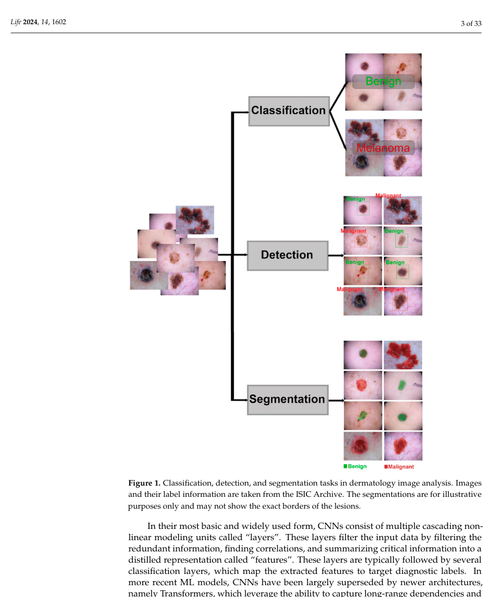

해석: 이 Figure는 논문 주장에 필요한 핵심 시각 자료 범주를 시각적으로 보여준다. 원문 맥락에서는 해당 논문의 핵심 근거를 보강하는 자료이며, 특히 non-invasive melanoma AI review의 clinical/dermoscopy/RCM modality별 알고리즘과 성능 비교 관련 내용을 이해하는 데 도움이 된다. ISIC2024 연구에서는 dermoscopy 중심 연구와 3D-TBP/clinical image 연구의 modality 차이를 설명할 때 참고할 수 있다.

**Table 1. 비교 항목과 핵심 수치 요약**

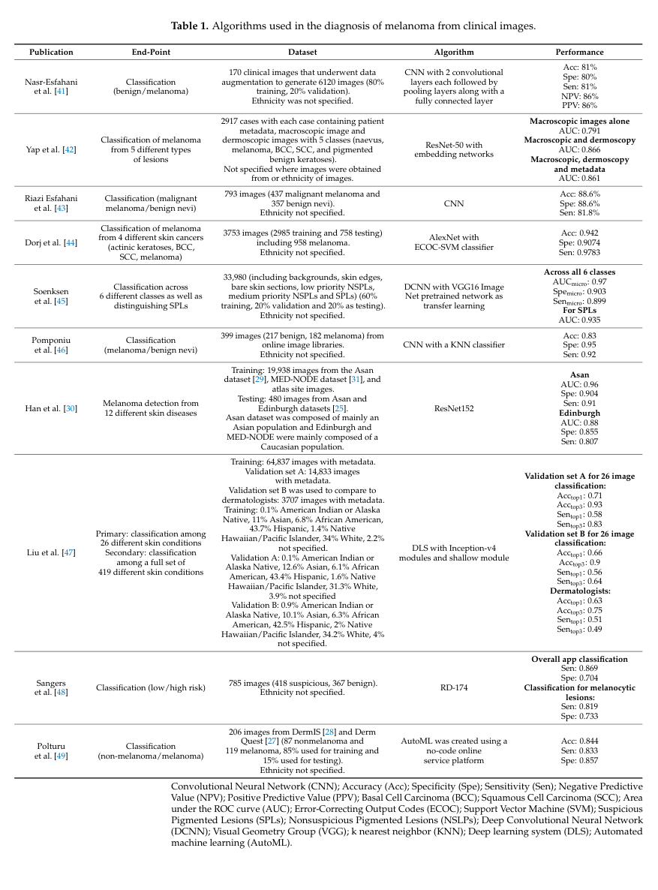

해석: 이 Table은 비교 항목과 핵심 수치 범주의 정보를 표 형태로 정리한다. 비교 축과 수치는 해당 논문의 핵심 근거를 보강하며, 특히 non-invasive melanoma AI review의 clinical/dermoscopy/RCM modality별 알고리즘과 성능 비교 관련 내용을 비교해 읽는 기준이 된다. ISIC2024 연구에서는 dermoscopy 중심 연구와 3D-TBP/clinical image 연구의 modality 차이를 설명할 때 참고할 수 있다.

**Table 2. 비교 항목과 핵심 수치 요약**

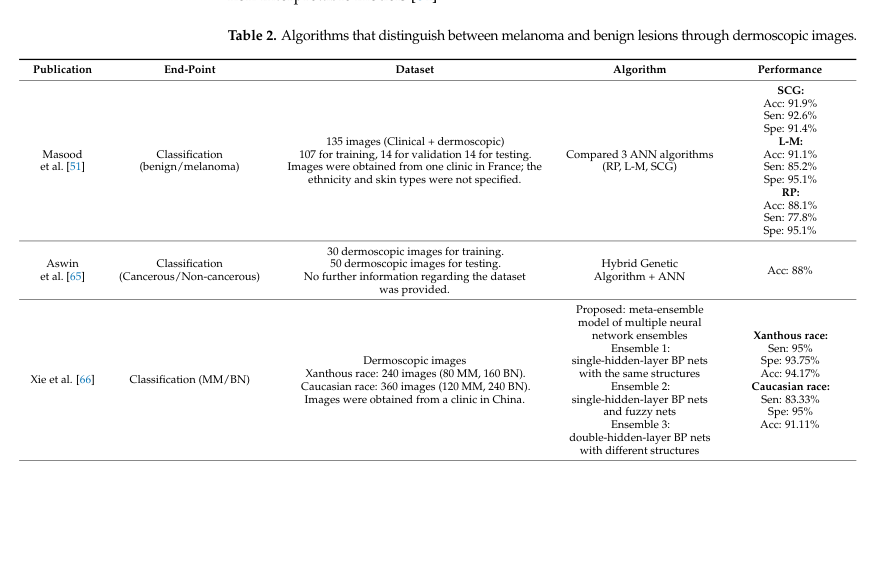

해석: 이 Table은 비교 항목과 핵심 수치 범주의 정보를 표 형태로 정리한다. 비교 축과 수치는 해당 논문의 핵심 근거를 보강하며, 특히 non-invasive melanoma AI review의 clinical/dermoscopy/RCM modality별 알고리즘과 성능 비교 관련 내용을 비교해 읽는 기준이 된다. ISIC2024 연구에서는 dermoscopy 중심 연구와 3D-TBP/clinical image 연구의 modality 차이를 설명할 때 참고할 수 있다.

**Table 2. 비교 항목과 핵심 수치 요약**

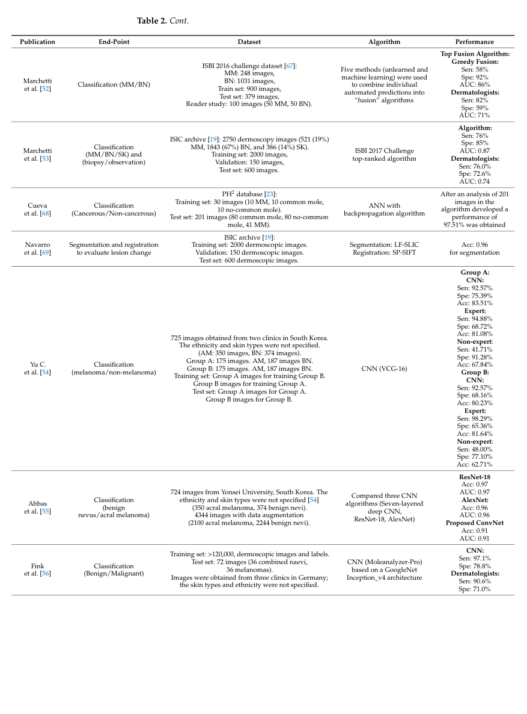

해석: 이 Table은 비교 항목과 핵심 수치 범주의 정보를 표 형태로 정리한다. 비교 축과 수치는 해당 논문의 핵심 근거를 보강하며, 특히 non-invasive melanoma AI review의 clinical/dermoscopy/RCM modality별 알고리즘과 성능 비교 관련 내용을 비교해 읽는 기준이 된다. ISIC2024 연구에서는 dermoscopy 중심 연구와 3D-TBP/clinical image 연구의 modality 차이를 설명할 때 참고할 수 있다.

**Table 2. 비교 항목과 핵심 수치 요약**

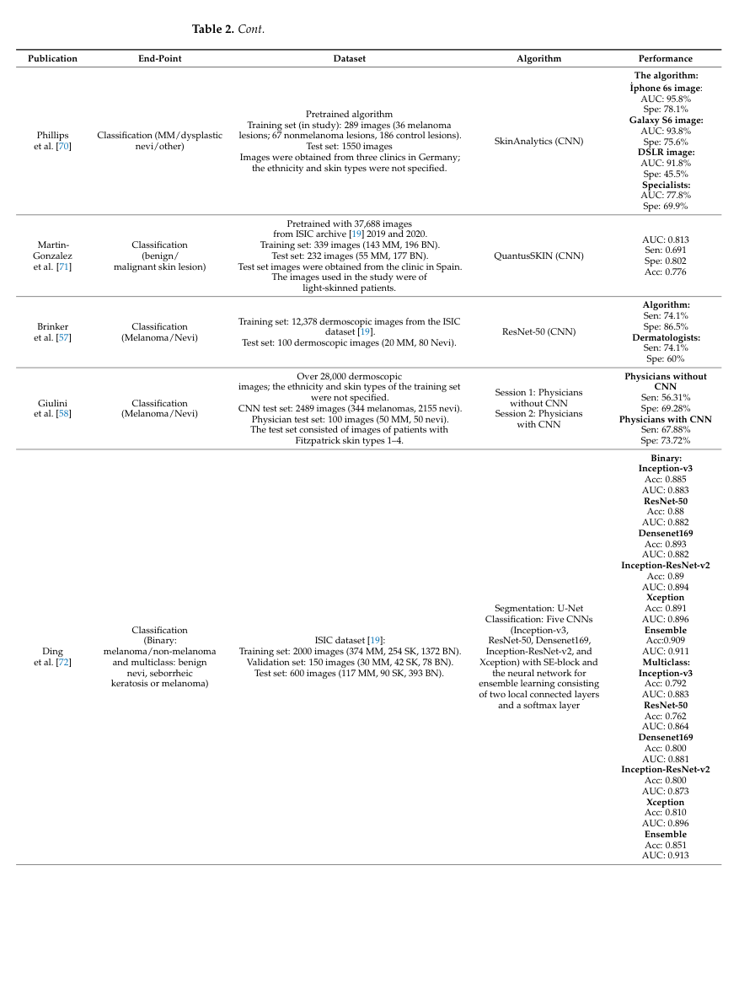

해석: 이 Table은 비교 항목과 핵심 수치 범주의 정보를 표 형태로 정리한다. 비교 축과 수치는 해당 논문의 핵심 근거를 보강하며, 특히 non-invasive melanoma AI review의 clinical/dermoscopy/RCM modality별 알고리즘과 성능 비교 관련 내용을 비교해 읽는 기준이 된다. ISIC2024 연구에서는 dermoscopy 중심 연구와 3D-TBP/clinical image 연구의 modality 차이를 설명할 때 참고할 수 있다.

**Table 2. 비교 항목과 핵심 수치 요약**

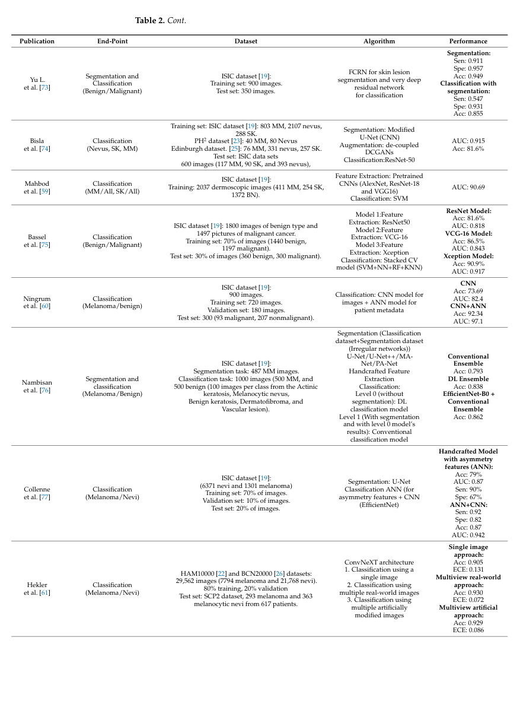

해석: 이 Table은 비교 항목과 핵심 수치 범주의 정보를 표 형태로 정리한다. 비교 축과 수치는 해당 논문의 핵심 근거를 보강하며, 특히 non-invasive melanoma AI review의 clinical/dermoscopy/RCM modality별 알고리즘과 성능 비교 관련 내용을 비교해 읽는 기준이 된다. ISIC2024 연구에서는 dermoscopy 중심 연구와 3D-TBP/clinical image 연구의 modality 차이를 설명할 때 참고할 수 있다.

**Table 2. 비교 항목과 핵심 수치 요약**

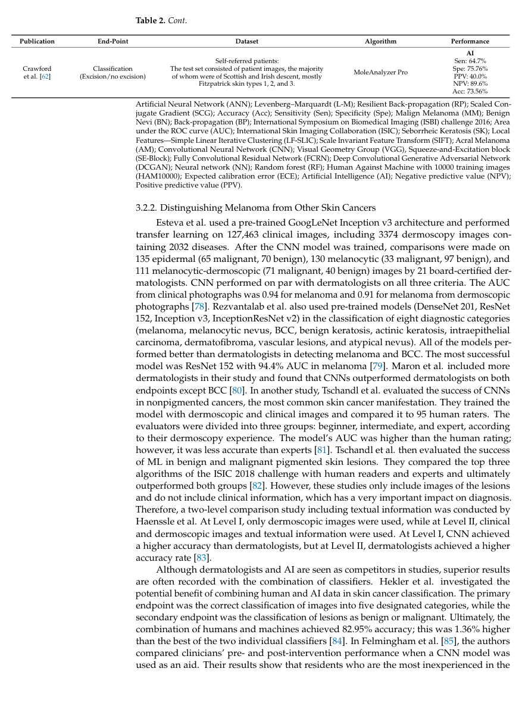

해석: 이 Table은 비교 항목과 핵심 수치 범주의 정보를 표 형태로 정리한다. 비교 축과 수치는 해당 논문의 핵심 근거를 보강하며, 특히 non-invasive melanoma AI review의 clinical/dermoscopy/RCM modality별 알고리즘과 성능 비교 관련 내용을 비교해 읽는 기준이 된다. ISIC2024 연구에서는 dermoscopy 중심 연구와 3D-TBP/clinical image 연구의 modality 차이를 설명할 때 참고할 수 있다.

**Table 3. 비교 항목과 핵심 수치 요약**

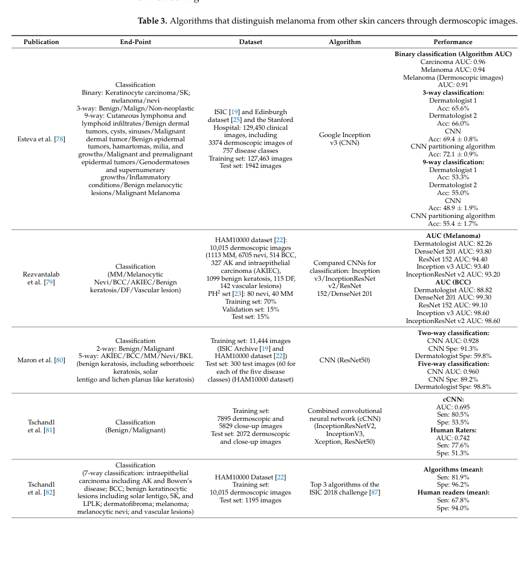

해석: 이 Table은 비교 항목과 핵심 수치 범주의 정보를 표 형태로 정리한다. 비교 축과 수치는 해당 논문의 핵심 근거를 보강하며, 특히 non-invasive melanoma AI review의 clinical/dermoscopy/RCM modality별 알고리즘과 성능 비교 관련 내용을 비교해 읽는 기준이 된다. ISIC2024 연구에서는 dermoscopy 중심 연구와 3D-TBP/clinical image 연구의 modality 차이를 설명할 때 참고할 수 있다.

**Table 3. 비교 항목과 핵심 수치 요약**

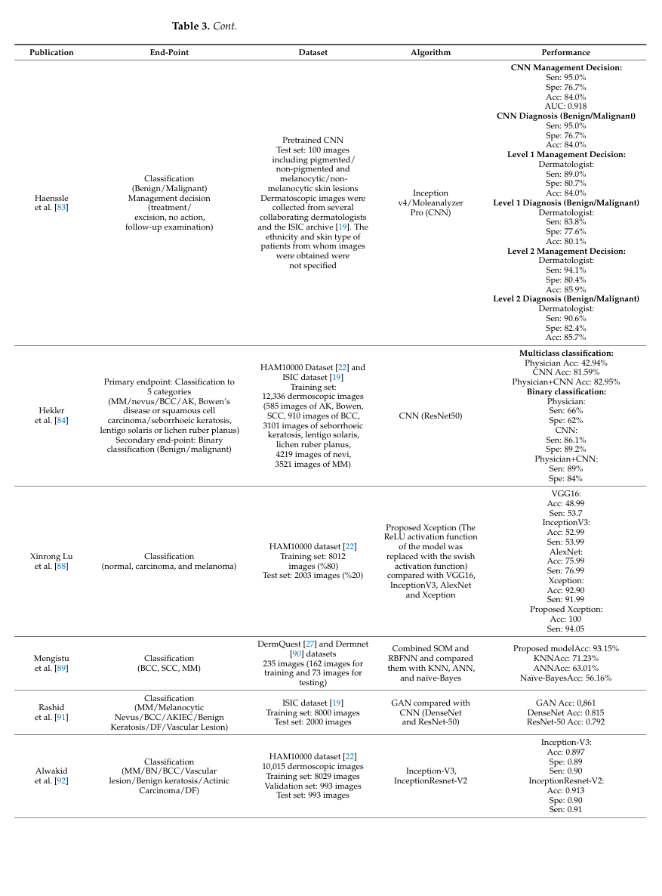

해석: 이 Table은 비교 항목과 핵심 수치 범주의 정보를 표 형태로 정리한다. 비교 축과 수치는 해당 논문의 핵심 근거를 보강하며, 특히 non-invasive melanoma AI review의 clinical/dermoscopy/RCM modality별 알고리즘과 성능 비교 관련 내용을 비교해 읽는 기준이 된다. ISIC2024 연구에서는 dermoscopy 중심 연구와 3D-TBP/clinical image 연구의 modality 차이를 설명할 때 참고할 수 있다.

**Table 3. 비교 항목과 핵심 수치 요약**

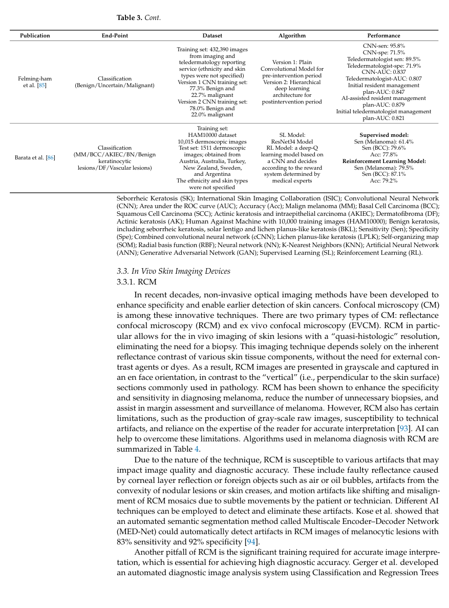

해석: 이 Table은 비교 항목과 핵심 수치 범주의 정보를 표 형태로 정리한다. 비교 축과 수치는 해당 논문의 핵심 근거를 보강하며, 특히 non-invasive melanoma AI review의 clinical/dermoscopy/RCM modality별 알고리즘과 성능 비교 관련 내용을 비교해 읽는 기준이 된다. ISIC2024 연구에서는 dermoscopy 중심 연구와 3D-TBP/clinical image 연구의 modality 차이를 설명할 때 참고할 수 있다.

**Table 4. 비교 항목과 핵심 수치 요약**

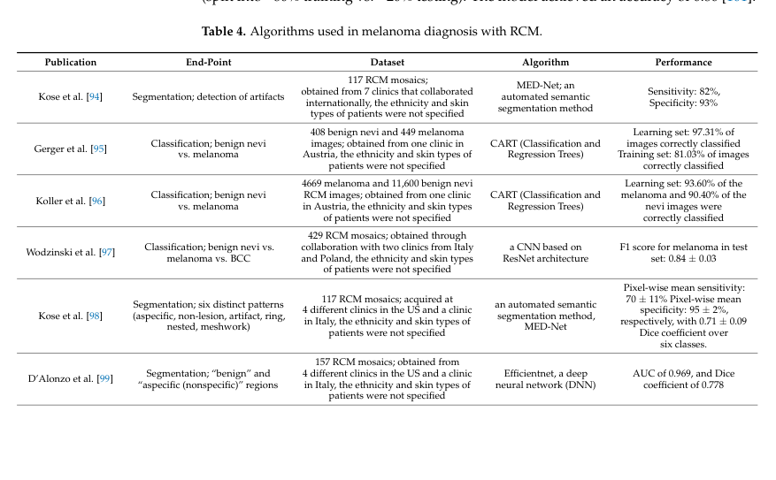

해석: 이 Table은 비교 항목과 핵심 수치 범주의 정보를 표 형태로 정리한다. 비교 축과 수치는 해당 논문의 핵심 근거를 보강하며, 특히 non-invasive melanoma AI review의 clinical/dermoscopy/RCM modality별 알고리즘과 성능 비교 관련 내용을 비교해 읽는 기준이 된다. ISIC2024 연구에서는 dermoscopy 중심 연구와 3D-TBP/clinical image 연구의 modality 차이를 설명할 때 참고할 수 있다.

**Table 4. 비교 항목과 핵심 수치 요약**

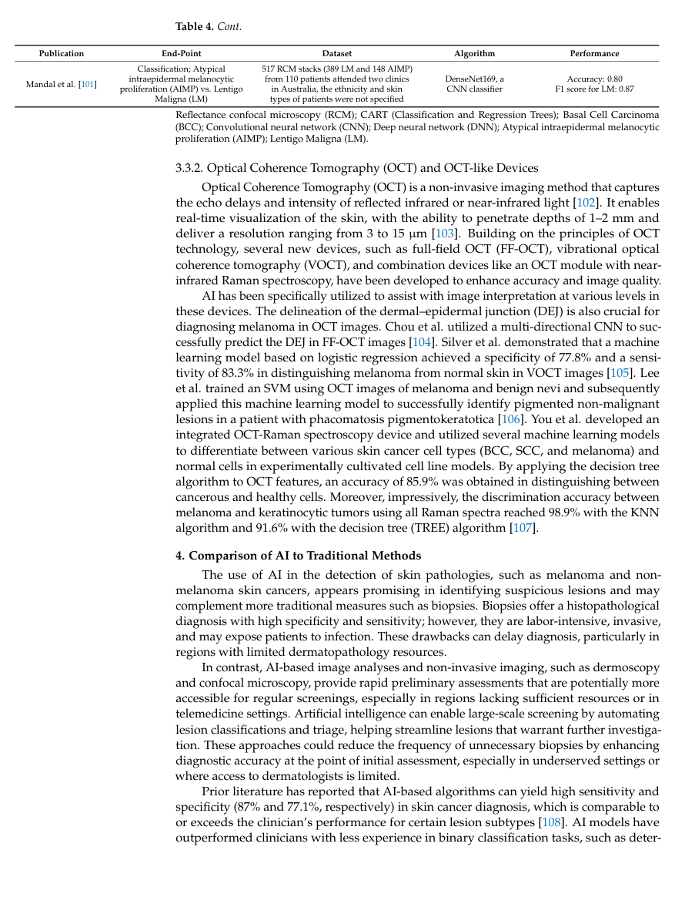

해석: 이 Table은 비교 항목과 핵심 수치 범주의 정보를 표 형태로 정리한다. 비교 축과 수치는 해당 논문의 핵심 근거를 보강하며, 특히 non-invasive melanoma AI review의 clinical/dermoscopy/RCM modality별 알고리즘과 성능 비교 관련 내용을 비교해 읽는 기준이 된다. ISIC2024 연구에서는 dermoscopy 중심 연구와 3D-TBP/clinical image 연구의 modality 차이를 설명할 때 참고할 수 있다.

## 우리 연구에서의 위치

melanoma의 비침습 진단에서 clinical image, dermoscopy, RCM/OCT 등 modality별 AI 활용을 정리한 review 논문이다. ISIC 2024가 추구하는 non-invasive triage와 high-sensitivity screening의 임상적 배경을 보강하는 데 쓸 수 있다.

---

## 목표와 기여

melanoma의 비침습 진단에서 AI가 어떤 imaging modality와 clinical scenario에서 활용되는지 정리하고, 실제 임상 배포를 위해 필요한 dataset diversity, validation, bias control 문제를 논의한다.

## Dataset 정보

자체 dataset은 없다. clinical image, dermoscopic image, Fitzpatrick17k, SkinCAP, SLICE-3D 등 다양한 공개 및 문헌 dataset을 소개한다.

## Imbalance 처리

직접 처리 방법은 없다. skin type distribution, malignant/pre-malignant 비율, dataset 다양성 부족을 문헌상 한계로 언급한다.

## Tabular model

해당 없음. tabular metadata가 일부 언급되지만 별도 모델을 제안하지 않는다.

## Image model

CNN, transformer, AutoML, smartphone app, dermoscopy/RCM/OCT 기반 AI 알고리즘을 review한다.

## Fusion 방식

일부 문헌에서 clinical/macroscopic/dermoscopic image와 metadata 조합을 다루지만, 자체 fusion model은 없다.

## 평가 지표

accuracy, sensitivity, specificity, PPV, NPV, AUC 등 문헌별 진단 지표를 표로 비교한다.

## 평가 결과

자체 benchmark 결과는 없다. AI는 melanoma triage와 biopsy 필요성 판단을 보조할 가능성이 크지만, dataset 편향과 임상 검증 부족 때문에 실제 배포에는 주의가 필요하다고 정리한다.

## ISIC2024 연구 시사점

- ISIC 2024의 malignant screening 목적을 melanoma triage 및 non-invasive detection 맥락에 연결할 수 있다.
- accuracy보다 sensitivity/specificity tradeoff를 강조하는 근거로 활용 가능하다.
- skin type distribution과 external validation 부족 문제를 limitation으로 연결하기 좋다.

## 추가 논의/주의점

- review 논문이므로 특정 architecture baseline의 직접 근거는 아니다.
- SLICE-3D가 언급되더라도 ISIC 2024 challenge metric과 동일한 실험 결과를 제공하는 것은 아니다.
- clinical deployment 논의에는 적합하지만 model ablation 설계 근거는 별도 논문이 필요하다.

---

[메인 문서로 돌아가기](../2026-05-18_dermatology_ai_literature_review.md#3-주요-논문별-상세-분석)
