# FoMoSkinNet: A Dual-Stream Deep Learning Model for Non-Dermoscopic Skin Lesions

## 출처/링크

출처: IEEE Access, 2026  
DOI: `10.1109/ACCESS.2026.3674219`  
Google Scholar 인용: 0회 (조회일: 2026-05-26, `FoMoSkinNet: A Dual-Stream Deep Learning Model for Early Detection and Classification of Non-Dermoscopic Skin Lesions via Focal Modulation and Local Feature Integration` 제목 기준)  
PDF: [FoMoSkinNet_A_Dual-Stream_Deep_Learning_Model_for_Early_Detection_and_Classification_of_Non-Dermoscopic_Skin_Lesions_via_Focal_Modulation_and_Local_Feature_Integration.pdf](../paper/FoMoSkinNet_A_Dual-Stream_Deep_Learning_Model_for_Early_Detection_and_Classification_of_Non-Dermoscopic_Skin_Lesions_via_Focal_Modulation_and_Local_Feature_Integration.pdf)

## 주요 Figure 및 Table

원문 PDF의 본문 Figure/Table을 번호 단위로 추출해 로컬 asset으로 저장했다. Caption은 길게 옮기지 않고, 각 항목이 보여주는 내용과 ISIC2024 연구 관점의 의미를 한국어로 의역해 정리했다.

**Figure 1. 논문 주장에 필요한 핵심 시각 자료**

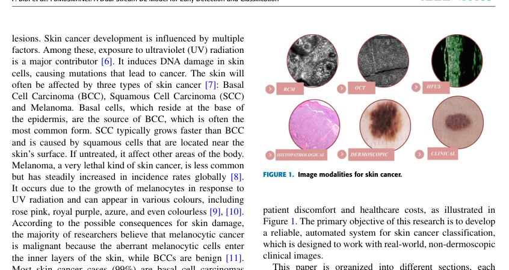

해석: 이 Figure는 논문 주장에 필요한 핵심 시각 자료 범주를 시각적으로 보여준다. 원문 맥락에서는 해당 논문의 핵심 근거를 보강하는 자료이며, 특히 FoMoSkinNet의 dual-stream focal modulation, local feature integration, 다중 dataset 평가 관련 내용을 이해하는 데 도움이 된다. ISIC2024 연구에서는 non-dermoscopic/clinical image classifier와 ISIC 2024 tile classifier의 구조적 유사점과 차이를 비교할 때 참고할 수 있다.

**Figure 2. 데이터 구성, 예시, 분포 특성**

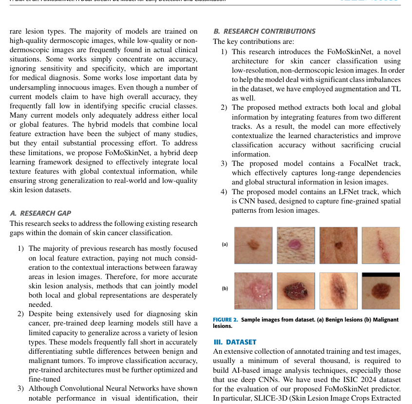

해석: 이 Figure는 데이터 구성, 예시, 분포 특성 범주를 시각적으로 보여준다. 원문 맥락에서는 해당 논문의 핵심 근거를 보강하는 자료이며, 특히 FoMoSkinNet의 dual-stream focal modulation, local feature integration, 다중 dataset 평가 관련 내용을 이해하는 데 도움이 된다. ISIC2024 연구에서는 non-dermoscopic/clinical image classifier와 ISIC 2024 tile classifier의 구조적 유사점과 차이를 비교할 때 참고할 수 있다.

**Figure 3. 연구 설계와 모델/데이터 처리 흐름**

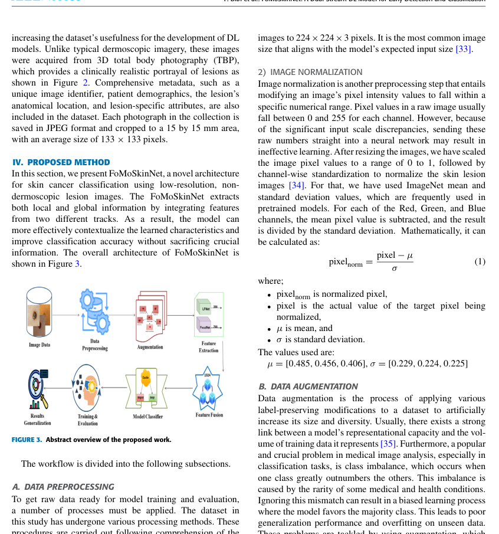

해석: 이 Figure는 연구 설계와 모델/데이터 처리 흐름 범주를 시각적으로 보여준다. 원문 맥락에서는 해당 논문의 핵심 근거를 보강하는 자료이며, 특히 FoMoSkinNet의 dual-stream focal modulation, local feature integration, 다중 dataset 평가 관련 내용을 이해하는 데 도움이 된다. ISIC2024 연구에서는 non-dermoscopic/clinical image classifier와 ISIC 2024 tile classifier의 구조적 유사점과 차이를 비교할 때 참고할 수 있다.

**Figure 5. 데이터 구성, 예시, 분포 특성**

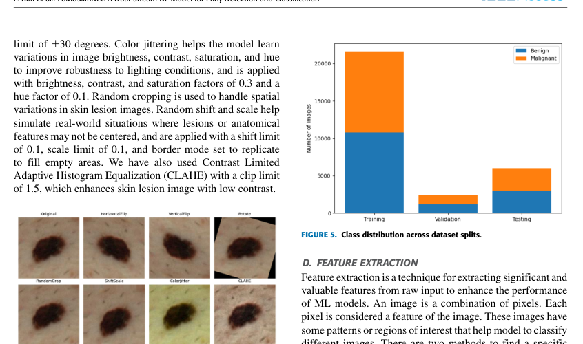

해석: 이 Figure는 데이터 구성, 예시, 분포 특성 범주를 시각적으로 보여준다. 원문 맥락에서는 해당 논문의 핵심 근거를 보강하는 자료이며, 특히 FoMoSkinNet의 dual-stream focal modulation, local feature integration, 다중 dataset 평가 관련 내용을 이해하는 데 도움이 된다. ISIC2024 연구에서는 non-dermoscopic/clinical image classifier와 ISIC 2024 tile classifier의 구조적 유사점과 차이를 비교할 때 참고할 수 있다.

**Figure 4. 데이터 구성, 예시, 분포 특성**

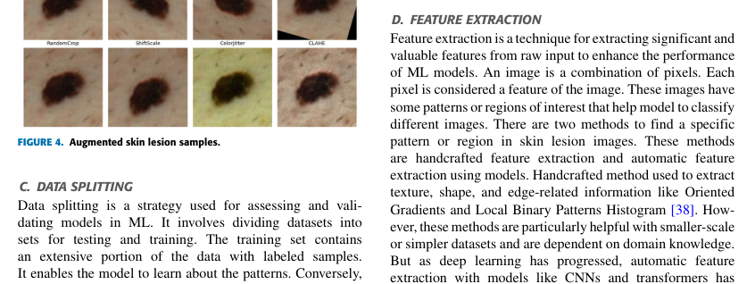

해석: 이 Figure는 데이터 구성, 예시, 분포 특성 범주를 시각적으로 보여준다. 원문 맥락에서는 해당 논문의 핵심 근거를 보강하는 자료이며, 특히 FoMoSkinNet의 dual-stream focal modulation, local feature integration, 다중 dataset 평가 관련 내용을 이해하는 데 도움이 된다. ISIC2024 연구에서는 non-dermoscopic/clinical image classifier와 ISIC 2024 tile classifier의 구조적 유사점과 차이를 비교할 때 참고할 수 있다.

**Table 1. 데이터 구성, 예시, 분포 특성 요약**

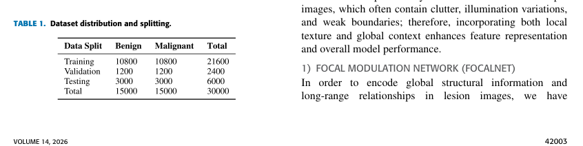

해석: 이 Table은 데이터 구성, 예시, 분포 특성 범주의 정보를 표 형태로 정리한다. 비교 축과 수치는 해당 논문의 핵심 근거를 보강하며, 특히 FoMoSkinNet의 dual-stream focal modulation, local feature integration, 다중 dataset 평가 관련 내용을 비교해 읽는 기준이 된다. ISIC2024 연구에서는 non-dermoscopic/clinical image classifier와 ISIC 2024 tile classifier의 구조적 유사점과 차이를 비교할 때 참고할 수 있다.

**Figure 7. 연구 설계와 모델/데이터 처리 흐름**

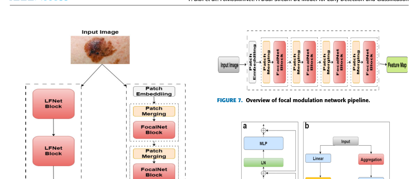

해석: 이 Figure는 연구 설계와 모델/데이터 처리 흐름 범주를 시각적으로 보여준다. 원문 맥락에서는 해당 논문의 핵심 근거를 보강하는 자료이며, 특히 FoMoSkinNet의 dual-stream focal modulation, local feature integration, 다중 dataset 평가 관련 내용을 이해하는 데 도움이 된다. ISIC2024 연구에서는 non-dermoscopic/clinical image classifier와 ISIC 2024 tile classifier의 구조적 유사점과 차이를 비교할 때 참고할 수 있다.

**Figure 8. 논문 주장에 필요한 핵심 시각 자료**

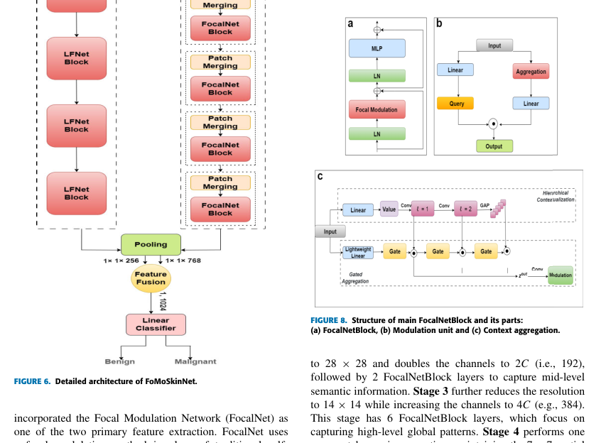

해석: 이 Figure는 논문 주장에 필요한 핵심 시각 자료 범주를 시각적으로 보여준다. 원문 맥락에서는 해당 논문의 핵심 근거를 보강하는 자료이며, 특히 FoMoSkinNet의 dual-stream focal modulation, local feature integration, 다중 dataset 평가 관련 내용을 이해하는 데 도움이 된다. ISIC2024 연구에서는 non-dermoscopic/clinical image classifier와 ISIC 2024 tile classifier의 구조적 유사점과 차이를 비교할 때 참고할 수 있다.

**Figure 6. 연구 설계와 모델/데이터 처리 흐름**

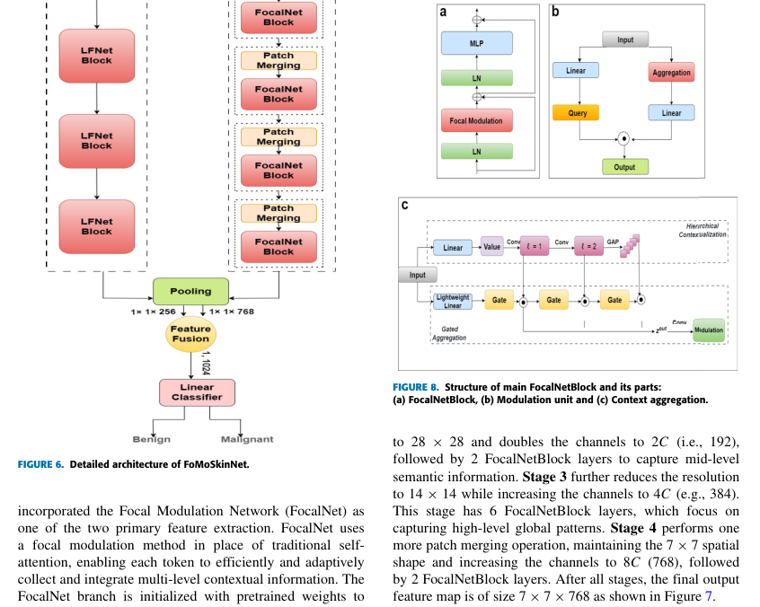

해석: 이 Figure는 연구 설계와 모델/데이터 처리 흐름 범주를 시각적으로 보여준다. 원문 맥락에서는 해당 논문의 핵심 근거를 보강하는 자료이며, 특히 FoMoSkinNet의 dual-stream focal modulation, local feature integration, 다중 dataset 평가 관련 내용을 이해하는 데 도움이 된다. ISIC2024 연구에서는 non-dermoscopic/clinical image classifier와 ISIC 2024 tile classifier의 구조적 유사점과 차이를 비교할 때 참고할 수 있다.

**Table 2. 비교 항목과 핵심 수치 요약**

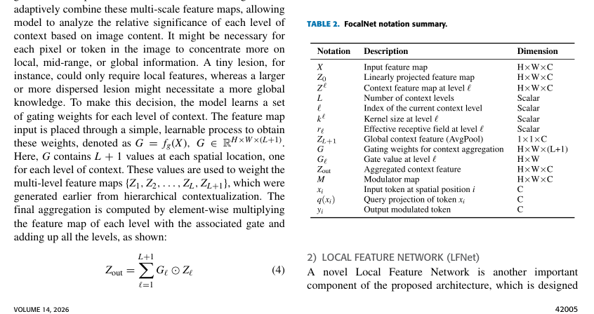

해석: 이 Table은 비교 항목과 핵심 수치 범주의 정보를 표 형태로 정리한다. 비교 축과 수치는 해당 논문의 핵심 근거를 보강하며, 특히 FoMoSkinNet의 dual-stream focal modulation, local feature integration, 다중 dataset 평가 관련 내용을 비교해 읽는 기준이 된다. ISIC2024 연구에서는 non-dermoscopic/clinical image classifier와 ISIC 2024 tile classifier의 구조적 유사점과 차이를 비교할 때 참고할 수 있다.

**Figure 9. 연구 설계와 모델/데이터 처리 흐름**

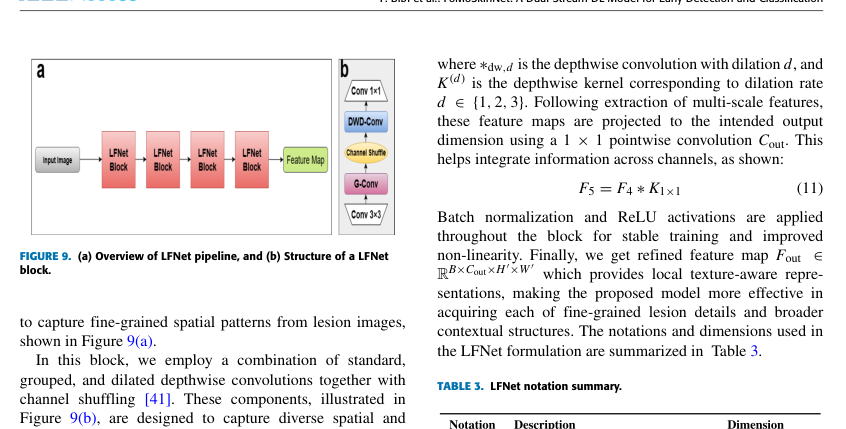

해석: 이 Figure는 연구 설계와 모델/데이터 처리 흐름 범주를 시각적으로 보여준다. 원문 맥락에서는 해당 논문의 핵심 근거를 보강하는 자료이며, 특히 FoMoSkinNet의 dual-stream focal modulation, local feature integration, 다중 dataset 평가 관련 내용을 이해하는 데 도움이 된다. ISIC2024 연구에서는 non-dermoscopic/clinical image classifier와 ISIC 2024 tile classifier의 구조적 유사점과 차이를 비교할 때 참고할 수 있다.

**Table 3. 비교 항목과 핵심 수치 요약**

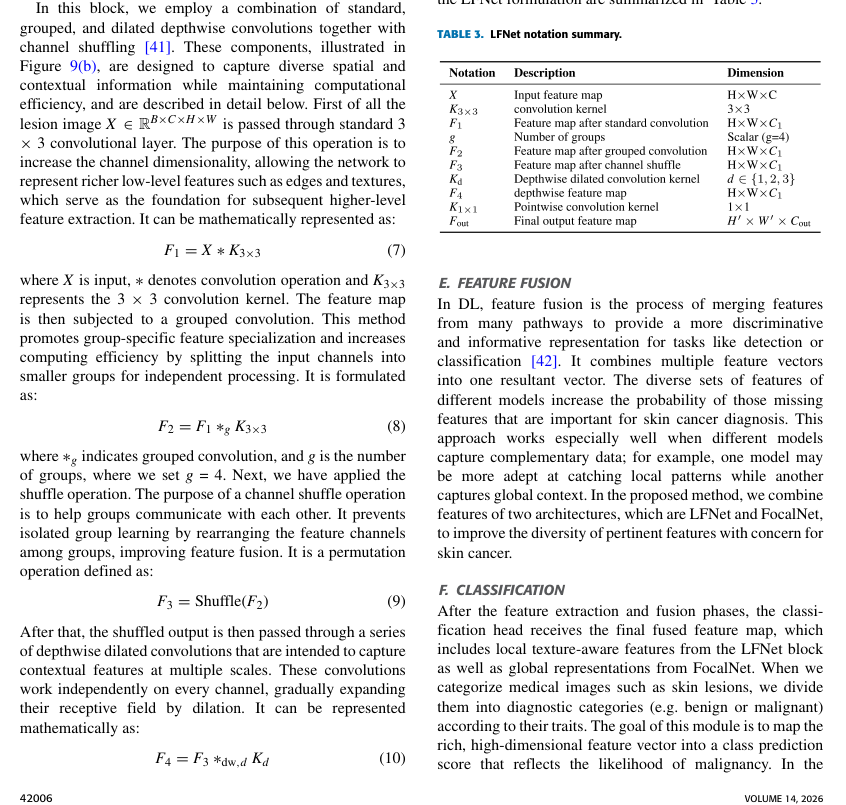

해석: 이 Table은 비교 항목과 핵심 수치 범주의 정보를 표 형태로 정리한다. 비교 축과 수치는 해당 논문의 핵심 근거를 보강하며, 특히 FoMoSkinNet의 dual-stream focal modulation, local feature integration, 다중 dataset 평가 관련 내용을 비교해 읽는 기준이 된다. ISIC2024 연구에서는 non-dermoscopic/clinical image classifier와 ISIC 2024 tile classifier의 구조적 유사점과 차이를 비교할 때 참고할 수 있다.

**Table 4. 비교 항목과 핵심 수치 요약**

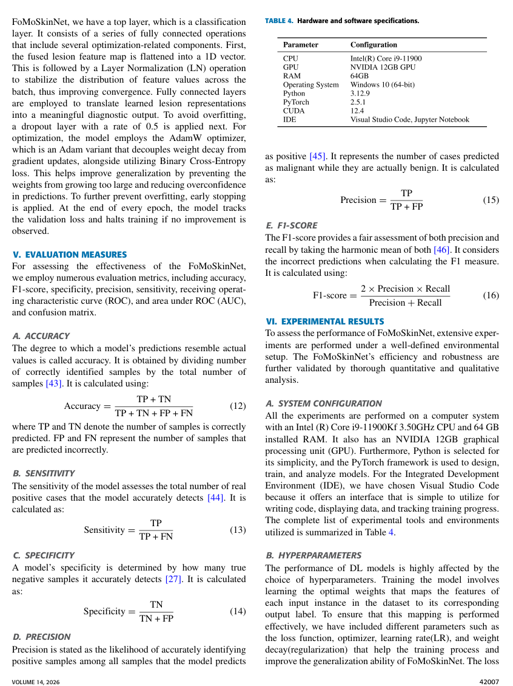

해석: 이 Table은 비교 항목과 핵심 수치 범주의 정보를 표 형태로 정리한다. 비교 축과 수치는 해당 논문의 핵심 근거를 보강하며, 특히 FoMoSkinNet의 dual-stream focal modulation, local feature integration, 다중 dataset 평가 관련 내용을 비교해 읽는 기준이 된다. ISIC2024 연구에서는 non-dermoscopic/clinical image classifier와 ISIC 2024 tile classifier의 구조적 유사점과 차이를 비교할 때 참고할 수 있다.

**Figure 10. 성능 비교와 정량 평가 결과**

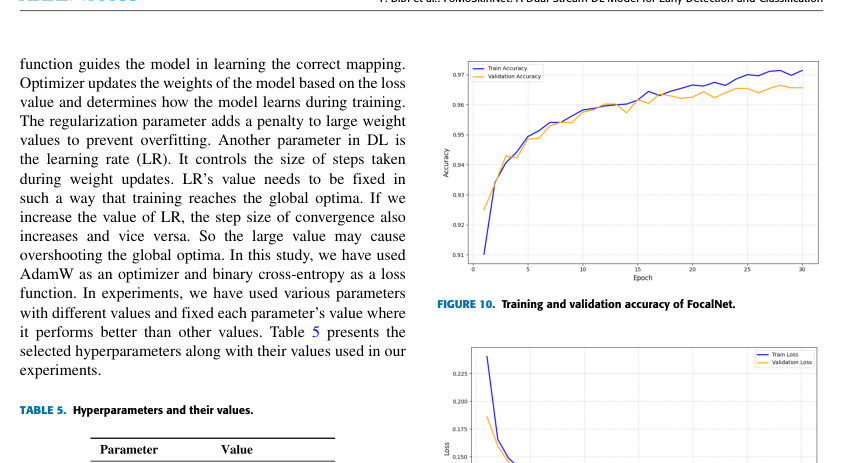

해석: 이 Figure는 성능 비교와 정량 평가 결과 범주를 시각적으로 보여준다. 원문 맥락에서는 해당 논문의 핵심 근거를 보강하는 자료이며, 특히 FoMoSkinNet의 dual-stream focal modulation, local feature integration, 다중 dataset 평가 관련 내용을 이해하는 데 도움이 된다. ISIC2024 연구에서는 non-dermoscopic/clinical image classifier와 ISIC 2024 tile classifier의 구조적 유사점과 차이를 비교할 때 참고할 수 있다.

**Table 5. 비교 항목과 핵심 수치 요약**

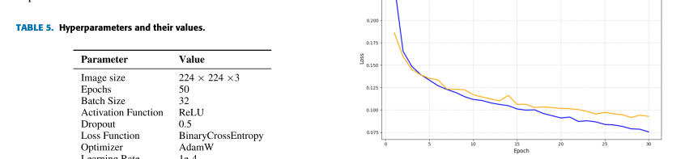

해석: 이 Table은 비교 항목과 핵심 수치 범주의 정보를 표 형태로 정리한다. 비교 축과 수치는 해당 논문의 핵심 근거를 보강하며, 특히 FoMoSkinNet의 dual-stream focal modulation, local feature integration, 다중 dataset 평가 관련 내용을 비교해 읽는 기준이 된다. ISIC2024 연구에서는 non-dermoscopic/clinical image classifier와 ISIC 2024 tile classifier의 구조적 유사점과 차이를 비교할 때 참고할 수 있다.

**Figure 11. 성능 비교와 정량 평가 결과**

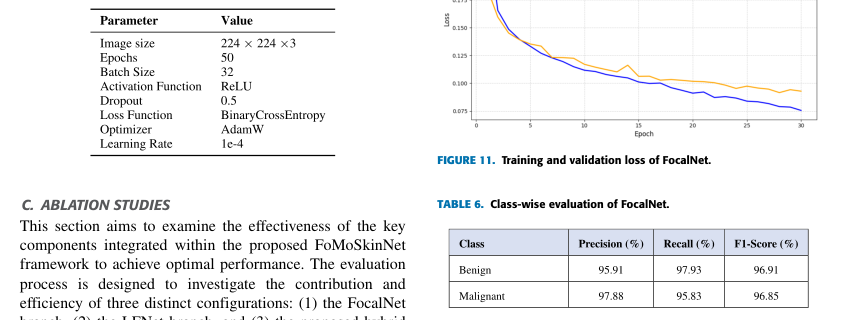

해석: 이 Figure는 성능 비교와 정량 평가 결과 범주를 시각적으로 보여준다. 원문 맥락에서는 해당 논문의 핵심 근거를 보강하는 자료이며, 특히 FoMoSkinNet의 dual-stream focal modulation, local feature integration, 다중 dataset 평가 관련 내용을 이해하는 데 도움이 된다. ISIC2024 연구에서는 non-dermoscopic/clinical image classifier와 ISIC 2024 tile classifier의 구조적 유사점과 차이를 비교할 때 참고할 수 있다.

**Table 6. 비교 항목과 핵심 수치 요약**

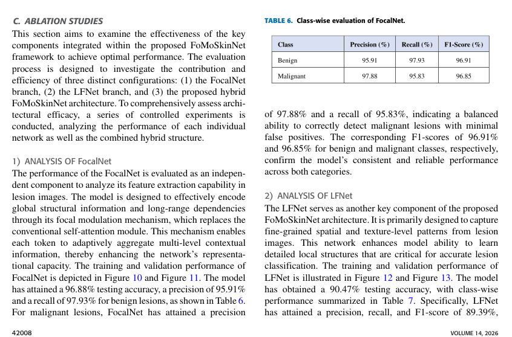

해석: 이 Table은 비교 항목과 핵심 수치 범주의 정보를 표 형태로 정리한다. 비교 축과 수치는 해당 논문의 핵심 근거를 보강하며, 특히 FoMoSkinNet의 dual-stream focal modulation, local feature integration, 다중 dataset 평가 관련 내용을 비교해 읽는 기준이 된다. ISIC2024 연구에서는 non-dermoscopic/clinical image classifier와 ISIC 2024 tile classifier의 구조적 유사점과 차이를 비교할 때 참고할 수 있다.

**Figure 12. 성능 비교와 정량 평가 결과**

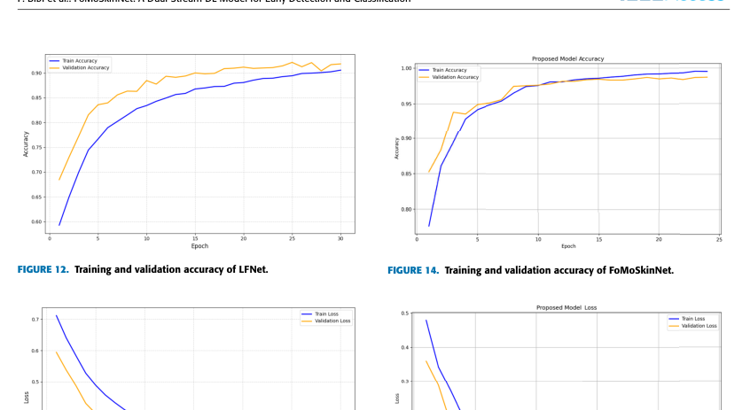

해석: 이 Figure는 성능 비교와 정량 평가 결과 범주를 시각적으로 보여준다. 원문 맥락에서는 해당 논문의 핵심 근거를 보강하는 자료이며, 특히 FoMoSkinNet의 dual-stream focal modulation, local feature integration, 다중 dataset 평가 관련 내용을 이해하는 데 도움이 된다. ISIC2024 연구에서는 non-dermoscopic/clinical image classifier와 ISIC 2024 tile classifier의 구조적 유사점과 차이를 비교할 때 참고할 수 있다.

**Figure 14. 성능 비교와 정량 평가 결과**

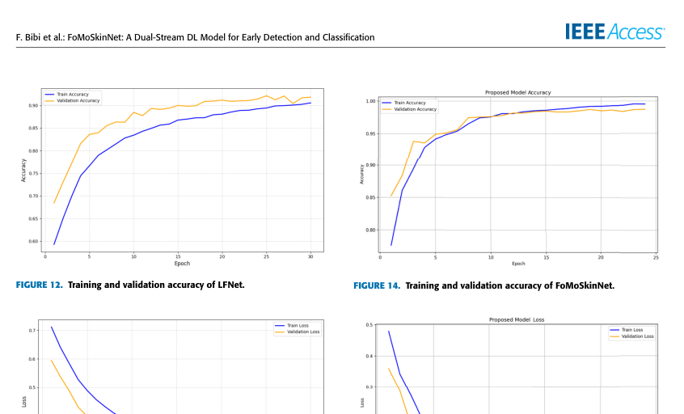

해석: 이 Figure는 성능 비교와 정량 평가 결과 범주를 시각적으로 보여준다. 원문 맥락에서는 해당 논문의 핵심 근거를 보강하는 자료이며, 특히 FoMoSkinNet의 dual-stream focal modulation, local feature integration, 다중 dataset 평가 관련 내용을 이해하는 데 도움이 된다. ISIC2024 연구에서는 non-dermoscopic/clinical image classifier와 ISIC 2024 tile classifier의 구조적 유사점과 차이를 비교할 때 참고할 수 있다.

**Figure 15. 성능 비교와 정량 평가 결과**

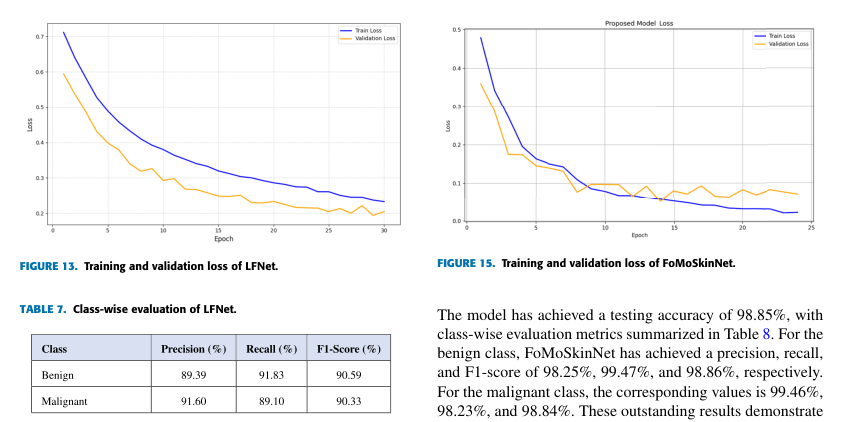

해석: 이 Figure는 성능 비교와 정량 평가 결과 범주를 시각적으로 보여준다. 원문 맥락에서는 해당 논문의 핵심 근거를 보강하는 자료이며, 특히 FoMoSkinNet의 dual-stream focal modulation, local feature integration, 다중 dataset 평가 관련 내용을 이해하는 데 도움이 된다. ISIC2024 연구에서는 non-dermoscopic/clinical image classifier와 ISIC 2024 tile classifier의 구조적 유사점과 차이를 비교할 때 참고할 수 있다.

**Figure 13. 성능 비교와 정량 평가 결과**

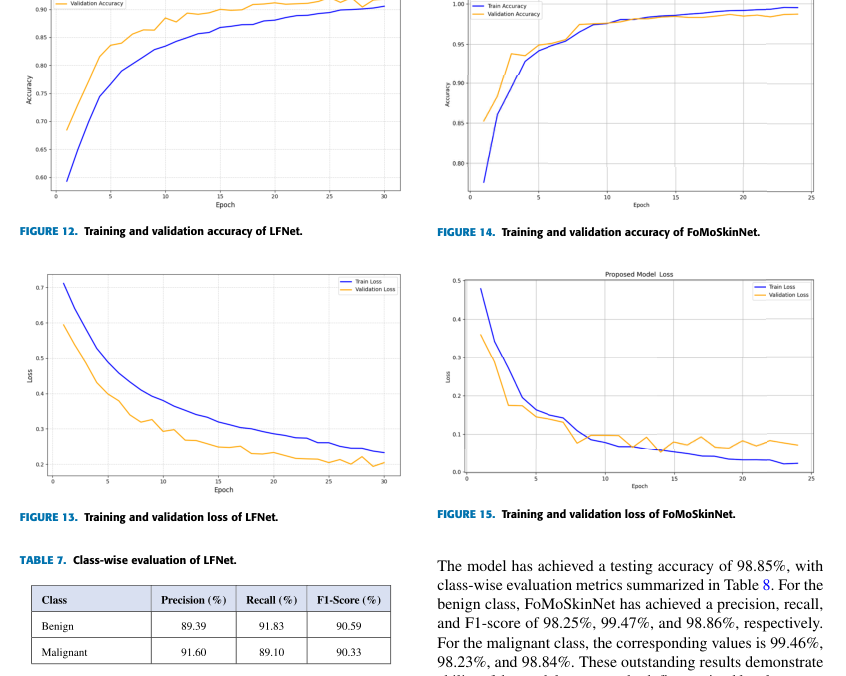

해석: 이 Figure는 성능 비교와 정량 평가 결과 범주를 시각적으로 보여준다. 원문 맥락에서는 해당 논문의 핵심 근거를 보강하는 자료이며, 특히 FoMoSkinNet의 dual-stream focal modulation, local feature integration, 다중 dataset 평가 관련 내용을 이해하는 데 도움이 된다. ISIC2024 연구에서는 non-dermoscopic/clinical image classifier와 ISIC 2024 tile classifier의 구조적 유사점과 차이를 비교할 때 참고할 수 있다.

**Table 7. 비교 항목과 핵심 수치 요약**

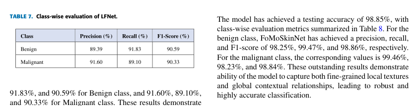

해석: 이 Table은 비교 항목과 핵심 수치 범주의 정보를 표 형태로 정리한다. 비교 축과 수치는 해당 논문의 핵심 근거를 보강하며, 특히 FoMoSkinNet의 dual-stream focal modulation, local feature integration, 다중 dataset 평가 관련 내용을 비교해 읽는 기준이 된다. ISIC2024 연구에서는 non-dermoscopic/clinical image classifier와 ISIC 2024 tile classifier의 구조적 유사점과 차이를 비교할 때 참고할 수 있다.

**Table 8. 비교 항목과 핵심 수치 요약**

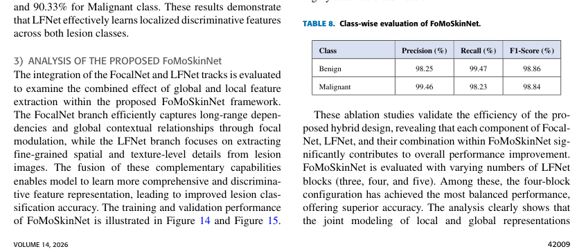

해석: 이 Table은 비교 항목과 핵심 수치 범주의 정보를 표 형태로 정리한다. 비교 축과 수치는 해당 논문의 핵심 근거를 보강하며, 특히 FoMoSkinNet의 dual-stream focal modulation, local feature integration, 다중 dataset 평가 관련 내용을 비교해 읽는 기준이 된다. ISIC2024 연구에서는 non-dermoscopic/clinical image classifier와 ISIC 2024 tile classifier의 구조적 유사점과 차이를 비교할 때 참고할 수 있다.

**Table 9. 비교 항목과 핵심 수치 요약**

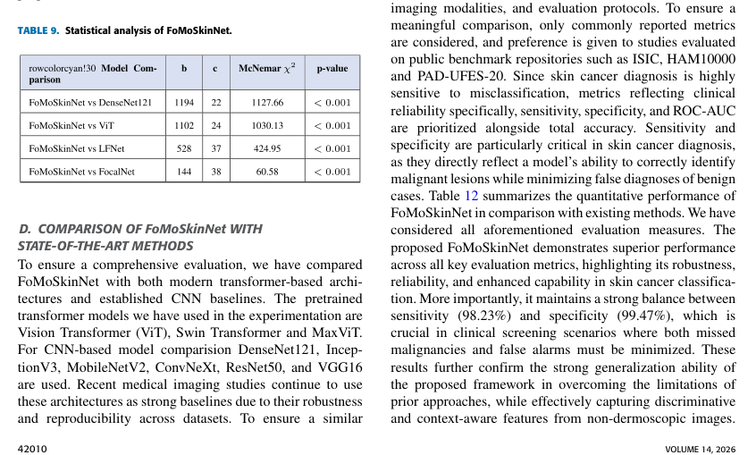

해석: 이 Table은 비교 항목과 핵심 수치 범주의 정보를 표 형태로 정리한다. 비교 축과 수치는 해당 논문의 핵심 근거를 보강하며, 특히 FoMoSkinNet의 dual-stream focal modulation, local feature integration, 다중 dataset 평가 관련 내용을 비교해 읽는 기준이 된다. ISIC2024 연구에서는 non-dermoscopic/clinical image classifier와 ISIC 2024 tile classifier의 구조적 유사점과 차이를 비교할 때 참고할 수 있다.

**Table 10. 성능 비교와 정량 평가 결과 요약**

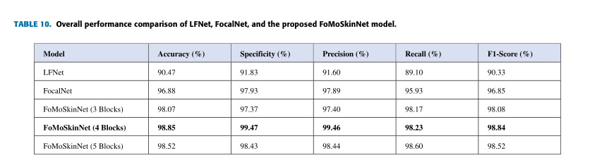

해석: 이 Table은 성능 비교와 정량 평가 결과 범주의 정보를 표 형태로 정리한다. 비교 축과 수치는 해당 논문의 핵심 근거를 보강하며, 특히 FoMoSkinNet의 dual-stream focal modulation, local feature integration, 다중 dataset 평가 관련 내용을 비교해 읽는 기준이 된다. ISIC2024 연구에서는 non-dermoscopic/clinical image classifier와 ISIC 2024 tile classifier의 구조적 유사점과 차이를 비교할 때 참고할 수 있다.

**Table 11. 비교 항목과 핵심 수치 요약**

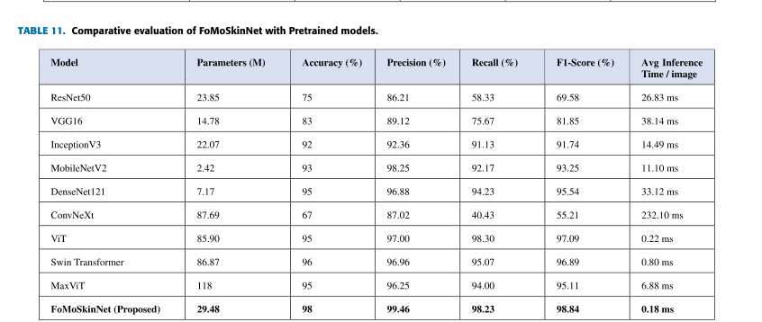

해석: 이 Table은 비교 항목과 핵심 수치 범주의 정보를 표 형태로 정리한다. 비교 축과 수치는 해당 논문의 핵심 근거를 보강하며, 특히 FoMoSkinNet의 dual-stream focal modulation, local feature integration, 다중 dataset 평가 관련 내용을 비교해 읽는 기준이 된다. ISIC2024 연구에서는 non-dermoscopic/clinical image classifier와 ISIC 2024 tile classifier의 구조적 유사점과 차이를 비교할 때 참고할 수 있다.

**Table 12. 성능 비교와 정량 평가 결과 요약**

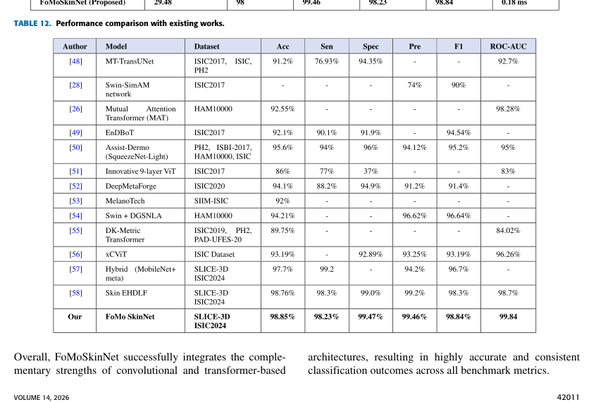

해석: 이 Table은 성능 비교와 정량 평가 결과 범주의 정보를 표 형태로 정리한다. 비교 축과 수치는 해당 논문의 핵심 근거를 보강하며, 특히 FoMoSkinNet의 dual-stream focal modulation, local feature integration, 다중 dataset 평가 관련 내용을 비교해 읽는 기준이 된다. ISIC2024 연구에서는 non-dermoscopic/clinical image classifier와 ISIC 2024 tile classifier의 구조적 유사점과 차이를 비교할 때 참고할 수 있다.

**Figure 16. 데이터 구성, 예시, 분포 특성**

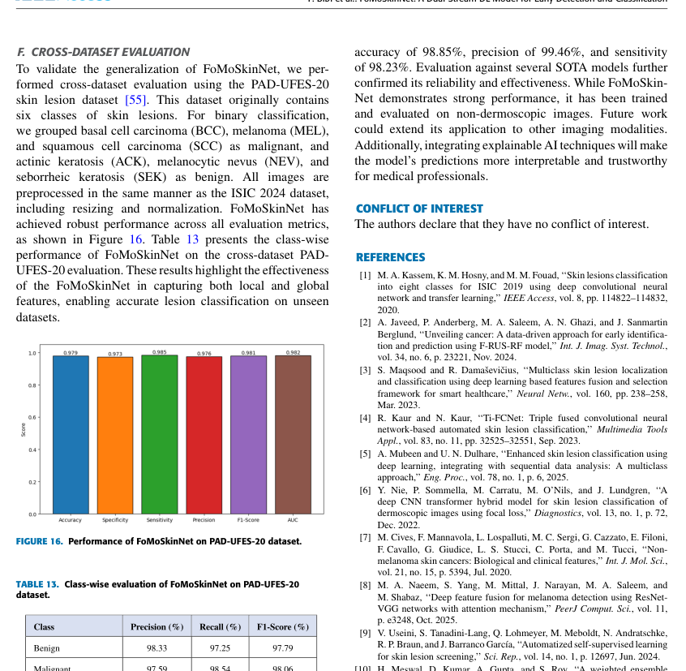

해석: 이 Figure는 데이터 구성, 예시, 분포 특성 범주를 시각적으로 보여준다. 원문 맥락에서는 해당 논문의 핵심 근거를 보강하는 자료이며, 특히 FoMoSkinNet의 dual-stream focal modulation, local feature integration, 다중 dataset 평가 관련 내용을 이해하는 데 도움이 된다. ISIC2024 연구에서는 non-dermoscopic/clinical image classifier와 ISIC 2024 tile classifier의 구조적 유사점과 차이를 비교할 때 참고할 수 있다.

**Table 13. 데이터 구성, 예시, 분포 특성 요약**

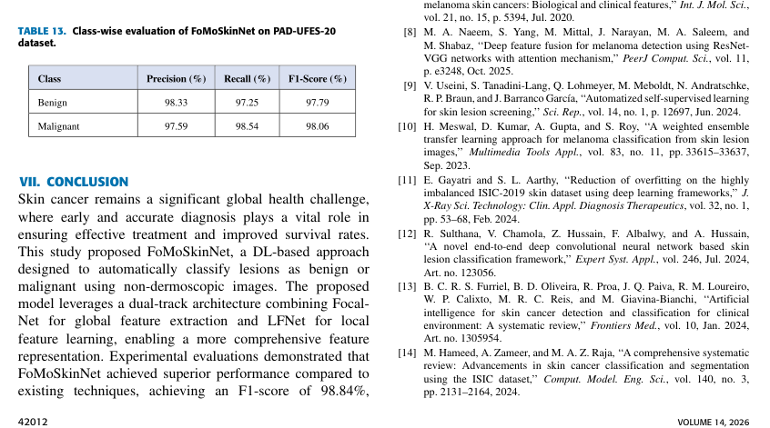

해석: 이 Table은 데이터 구성, 예시, 분포 특성 범주의 정보를 표 형태로 정리한다. 비교 축과 수치는 해당 논문의 핵심 근거를 보강하며, 특히 FoMoSkinNet의 dual-stream focal modulation, local feature integration, 다중 dataset 평가 관련 내용을 비교해 읽는 기준이 된다. ISIC2024 연구에서는 non-dermoscopic/clinical image classifier와 ISIC 2024 tile classifier의 구조적 유사점과 차이를 비교할 때 참고할 수 있다.

## 우리 연구에서의 위치

ISIC 2024 SLICE-3D subset을 사용해 non-dermoscopic lesion image classification을 수행한 최신 dual-stream image model이다. focal modulation과 local feature branch를 결합하므로 image-only baseline 아이디어로 참고할 수 있지만, balanced subset을 사용했다는 점을 원본 challenge setting과 분리해야 한다.

---

## 목표와 기여

low-quality/non-dermoscopic skin lesion image에서 local texture와 global context를 동시에 학습하는 FoMoSkinNet을 제안한다.

## Dataset 정보

- Dataset: ISIC 2024 SLICE-3D subset
- 구성: benign 15,000장, malignant 15,000장
- 총 image 수: 30,000개
- Split: 80% train, 20% test, train의 10% validation

## Imbalance 처리

benign/malignant 15,000:15,000 balanced dataset을 구성해 binary class imbalance를 직접 완화한다. 이는 원본 ISIC 2024의 400,666:393 imbalance를 유지한 setting이 아니다.

## Tabular model

별도 tabular model은 없다.

## Image model

global feature는 FocalNet branch가 담당하고, local feature는 grouped convolution, channel shuffle, multi-scale dilated depthwise convolution을 포함한 LFNet branch가 담당한다.

## Fusion 방식

FocalNet branch와 LFNet branch의 complementary feature를 hybrid feature fusion으로 결합한다. image-image feature fusion이며 metadata fusion은 아니다.

## 평가 지표

accuracy, F1-score, specificity, precision, sensitivity/recall, ROC, AUC, confusion matrix를 사용한다.

## 평가 결과

ISIC 2024 balanced subset에서 accuracy 98.85%, precision 99.46%, recall/sensitivity 98.23%, F1-score 98.84%, specificity 99.47%를 보고한다.

## ISIC2024 연구 시사점

- non-dermoscopic 3D-TBP tile image에서 global/local feature를 분리하는 image branch 설계 참고가 가능하다.
- ISIC 2024를 직접 사용했다는 점은 유용하지만, balanced subset 구성 때문에 Kaggle original distribution과 직접 비교하면 안 된다.
- image-tabular fusion 연구에서는 image-only strong baseline 후보 중 하나로 언급할 수 있다.

## 추가 논의/주의점

- malignant 15,000장을 어떻게 구성했는지 원본 label 수와 비교해 sampling/augmentation 여부를 확인해야 한다.
- pAUC > 80% TPR가 아니라 일반 classification metric 중심이다.
- metadata를 쓰지 않으므로 multimodal fusion의 직접 근거는 아니다.

---

[메인 문서로 돌아가기](../2026-05-18_dermatology_ai_literature_review.md#3-주요-논문별-상세-분석)
