# Medical Video Generation for Disease Progression Simulation

## 출처/링크

출처: arXiv, 2024  
DOI: `10.48550/arXiv.2411.11943`  
Google Scholar 인용: 14회 (조회일: 2026-05-26, `Medical Video Generation for Disease Progression Simulation` 제목 기준)  
PDF: [2411.11943v1.pdf](../paper/2411.11943v1.pdf)

## 주요 Figure 및 Table

원문 PDF의 본문 Figure/Table을 번호 단위로 추출해 로컬 asset으로 저장했다. Caption은 길게 옮기지 않고, 각 항목이 보여주는 내용과 ISIC2024 연구 관점의 의미를 한국어로 의역해 정리했다.

**Figure 1. 데이터 구성, 예시, 분포 특성**

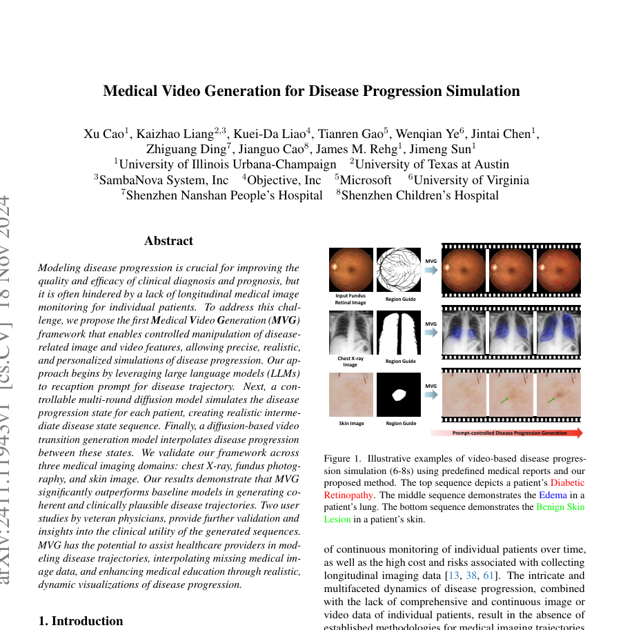

해석: 이 Figure는 데이터 구성, 예시, 분포 특성 범주를 시각적으로 보여준다. 원문 맥락에서는 해당 논문의 핵심 근거를 보강하는 자료이며, 특히 medical video generation의 disease progression simulation, report-conditioned generation, ablation 관련 내용을 이해하는 데 도움이 된다. ISIC2024 연구에서는 피부 병변 분류와 직접 연결하기보다는 longitudinal lesion change simulation의 장기 확장 아이디어로 참고할 수 있다.

**Figure 2. 모델 해석과 시각화 결과**

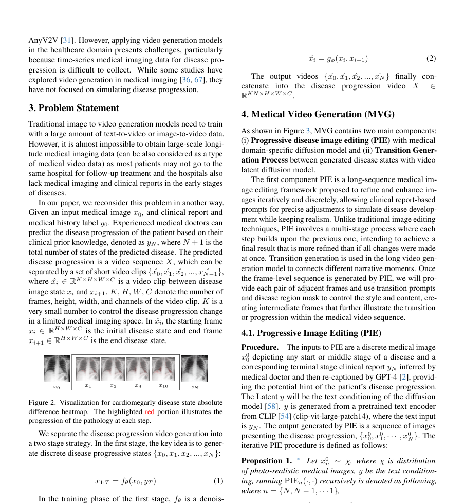

해석: 이 Figure는 모델 해석과 시각화 결과 범주를 시각적으로 보여준다. 원문 맥락에서는 해당 논문의 핵심 근거를 보강하는 자료이며, 특히 medical video generation의 disease progression simulation, report-conditioned generation, ablation 관련 내용을 이해하는 데 도움이 된다. ISIC2024 연구에서는 피부 병변 분류와 직접 연결하기보다는 longitudinal lesion change simulation의 장기 확장 아이디어로 참고할 수 있다.

**Figure 3. 연구 설계와 모델/데이터 처리 흐름**

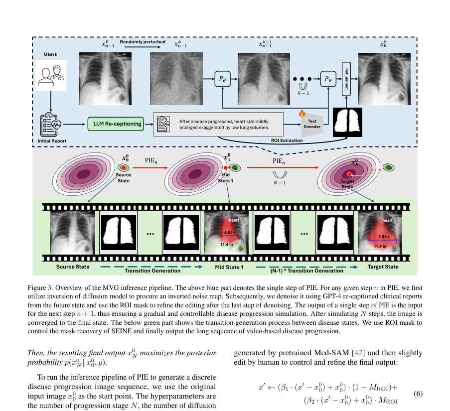

해석: 이 Figure는 연구 설계와 모델/데이터 처리 흐름 범주를 시각적으로 보여준다. 원문 맥락에서는 해당 논문의 핵심 근거를 보강하는 자료이며, 특히 medical video generation의 disease progression simulation, report-conditioned generation, ablation 관련 내용을 이해하는 데 도움이 된다. ISIC2024 연구에서는 피부 병변 분류와 직접 연결하기보다는 longitudinal lesion change simulation의 장기 확장 아이디어로 참고할 수 있다.

**Table 1. 데이터 구성, 예시, 분포 특성 요약**

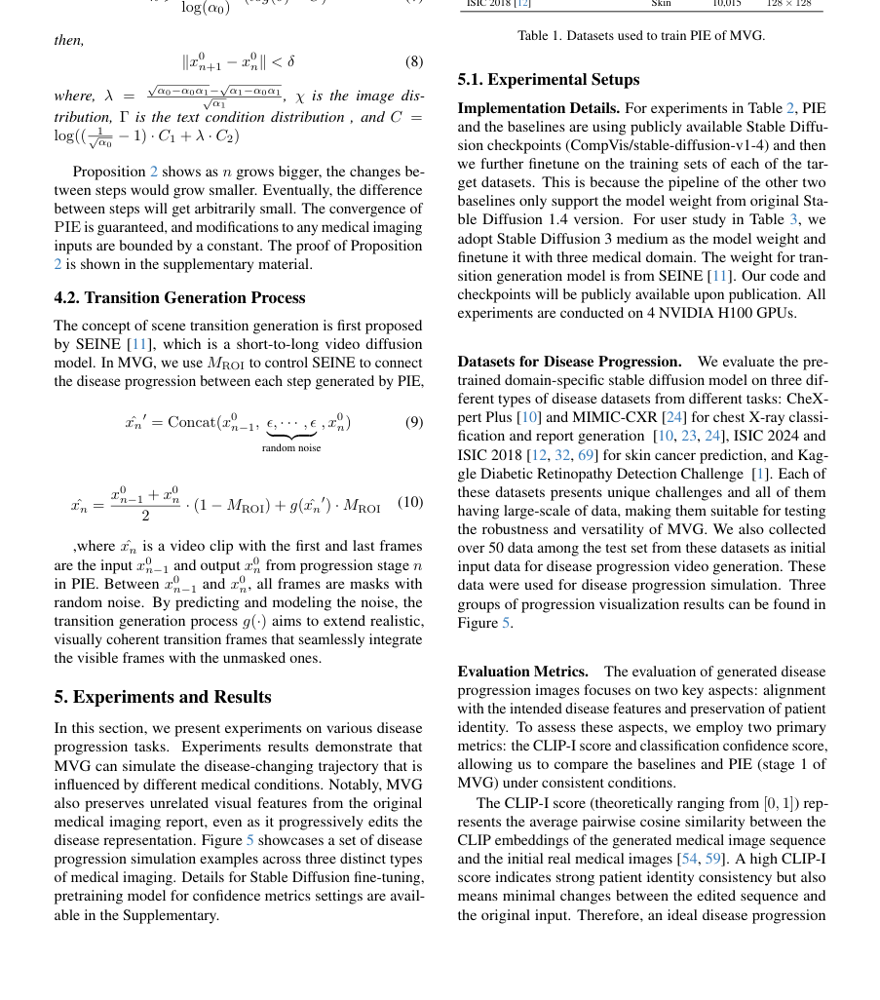

해석: 이 Table은 데이터 구성, 예시, 분포 특성 범주의 정보를 표 형태로 정리한다. 비교 축과 수치는 해당 논문의 핵심 근거를 보강하며, 특히 medical video generation의 disease progression simulation, report-conditioned generation, ablation 관련 내용을 비교해 읽는 기준이 된다. ISIC2024 연구에서는 피부 병변 분류와 직접 연결하기보다는 longitudinal lesion change simulation의 장기 확장 아이디어로 참고할 수 있다.

**Table 2. 데이터 구성, 예시, 분포 특성 요약**

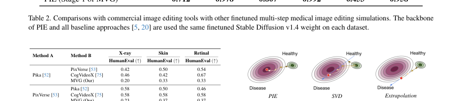

해석: 이 Table은 데이터 구성, 예시, 분포 특성 범주의 정보를 표 형태로 정리한다. 비교 축과 수치는 해당 논문의 핵심 근거를 보강하며, 특히 medical video generation의 disease progression simulation, report-conditioned generation, ablation 관련 내용을 비교해 읽는 기준이 된다. ISIC2024 연구에서는 피부 병변 분류와 직접 연결하기보다는 longitudinal lesion change simulation의 장기 확장 아이디어로 참고할 수 있다.

**Figure 4. 논문 주장에 필요한 핵심 시각 자료**

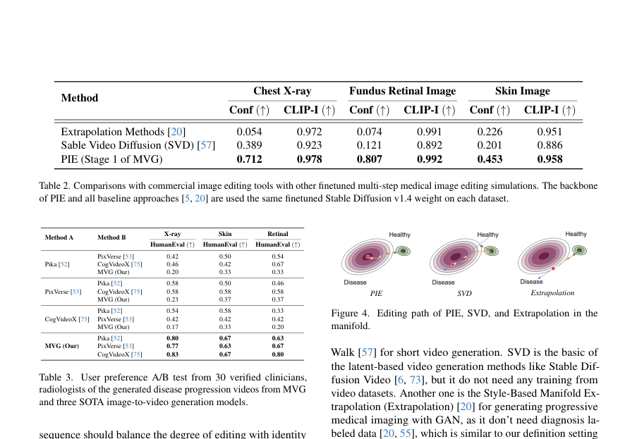

해석: 이 Figure는 논문 주장에 필요한 핵심 시각 자료 범주를 시각적으로 보여준다. 원문 맥락에서는 해당 논문의 핵심 근거를 보강하는 자료이며, 특히 medical video generation의 disease progression simulation, report-conditioned generation, ablation 관련 내용을 이해하는 데 도움이 된다. ISIC2024 연구에서는 피부 병변 분류와 직접 연결하기보다는 longitudinal lesion change simulation의 장기 확장 아이디어로 참고할 수 있다.

**Table 3. 비교 항목과 핵심 수치 요약**

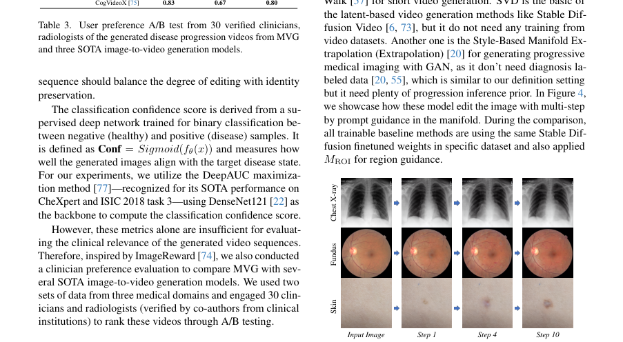

해석: 이 Table은 비교 항목과 핵심 수치 범주의 정보를 표 형태로 정리한다. 비교 축과 수치는 해당 논문의 핵심 근거를 보강하며, 특히 medical video generation의 disease progression simulation, report-conditioned generation, ablation 관련 내용을 비교해 읽는 기준이 된다. ISIC2024 연구에서는 피부 병변 분류와 직접 연결하기보다는 longitudinal lesion change simulation의 장기 확장 아이디어로 참고할 수 있다.

**Figure 5. 논문 주장에 필요한 핵심 시각 자료**

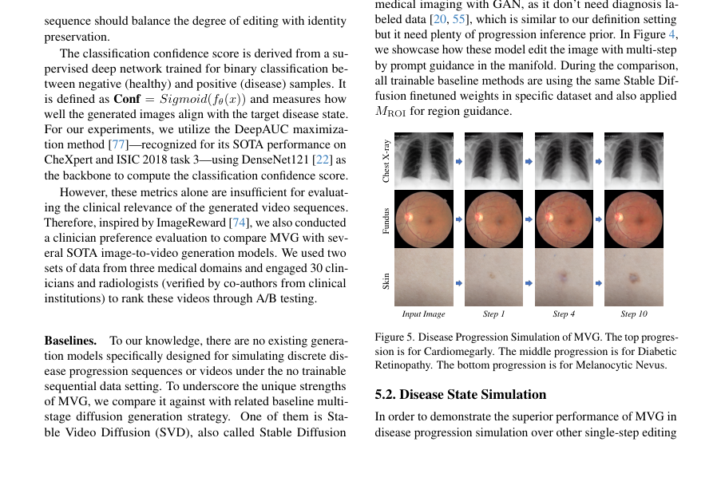

해석: 이 Figure는 논문 주장에 필요한 핵심 시각 자료 범주를 시각적으로 보여준다. 원문 맥락에서는 해당 논문의 핵심 근거를 보강하는 자료이며, 특히 medical video generation의 disease progression simulation, report-conditioned generation, ablation 관련 내용을 이해하는 데 도움이 된다. ISIC2024 연구에서는 피부 병변 분류와 직접 연결하기보다는 longitudinal lesion change simulation의 장기 확장 아이디어로 참고할 수 있다.

**Table 4. 성능 비교와 정량 평가 결과 요약**

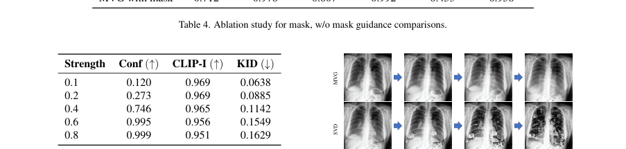

해석: 이 Table은 성능 비교와 정량 평가 결과 범주의 정보를 표 형태로 정리한다. 비교 축과 수치는 해당 논문의 핵심 근거를 보강하며, 특히 medical video generation의 disease progression simulation, report-conditioned generation, ablation 관련 내용을 비교해 읽는 기준이 된다. ISIC2024 연구에서는 피부 병변 분류와 직접 연결하기보다는 longitudinal lesion change simulation의 장기 확장 아이디어로 참고할 수 있다.

**Table 5. 구성요소별 ablation과 민감도 분석 요약**

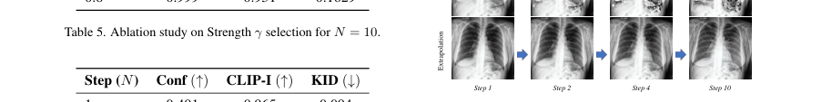

해석: 이 Table은 구성요소별 ablation과 민감도 분석 범주의 정보를 표 형태로 정리한다. 비교 축과 수치는 해당 논문의 핵심 근거를 보강하며, 특히 medical video generation의 disease progression simulation, report-conditioned generation, ablation 관련 내용을 비교해 읽는 기준이 된다. ISIC2024 연구에서는 피부 병변 분류와 직접 연결하기보다는 longitudinal lesion change simulation의 장기 확장 아이디어로 참고할 수 있다.

**Figure 6. 논문 주장에 필요한 핵심 시각 자료**

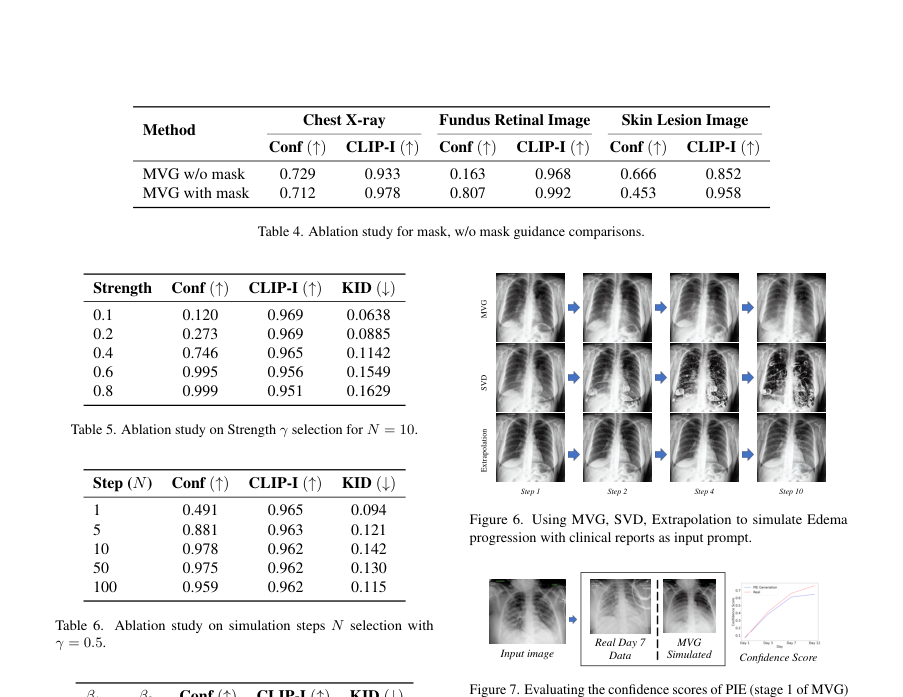

해석: 이 Figure는 논문 주장에 필요한 핵심 시각 자료 범주를 시각적으로 보여준다. 원문 맥락에서는 해당 논문의 핵심 근거를 보강하는 자료이며, 특히 medical video generation의 disease progression simulation, report-conditioned generation, ablation 관련 내용을 이해하는 데 도움이 된다. ISIC2024 연구에서는 피부 병변 분류와 직접 연결하기보다는 longitudinal lesion change simulation의 장기 확장 아이디어로 참고할 수 있다.

**Table 6. 구성요소별 ablation과 민감도 분석 요약**

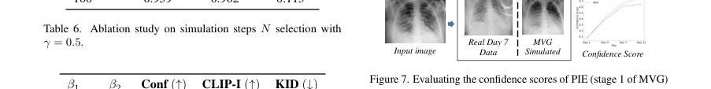

해석: 이 Table은 구성요소별 ablation과 민감도 분석 범주의 정보를 표 형태로 정리한다. 비교 축과 수치는 해당 논문의 핵심 근거를 보강하며, 특히 medical video generation의 disease progression simulation, report-conditioned generation, ablation 관련 내용을 비교해 읽는 기준이 된다. ISIC2024 연구에서는 피부 병변 분류와 직접 연결하기보다는 longitudinal lesion change simulation의 장기 확장 아이디어로 참고할 수 있다.

**Figure 7. 논문 주장에 필요한 핵심 시각 자료**

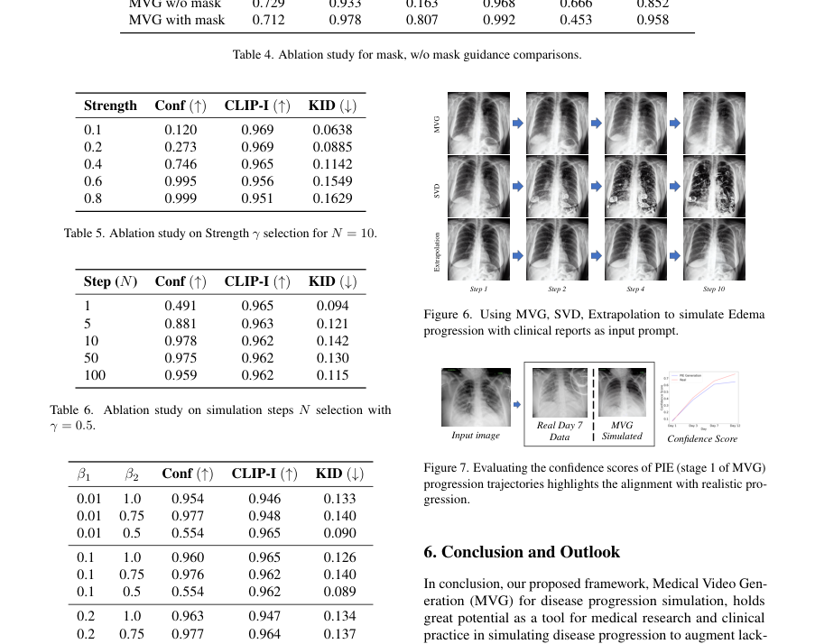

해석: 이 Figure는 논문 주장에 필요한 핵심 시각 자료 범주를 시각적으로 보여준다. 원문 맥락에서는 해당 논문의 핵심 근거를 보강하는 자료이며, 특히 medical video generation의 disease progression simulation, report-conditioned generation, ablation 관련 내용을 이해하는 데 도움이 된다. ISIC2024 연구에서는 피부 병변 분류와 직접 연결하기보다는 longitudinal lesion change simulation의 장기 확장 아이디어로 참고할 수 있다.

**Table 7. 구성요소별 ablation과 민감도 분석 요약**

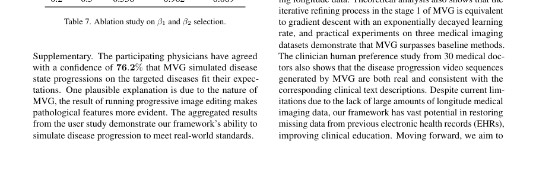

해석: 이 Table은 구성요소별 ablation과 민감도 분석 범주의 정보를 표 형태로 정리한다. 비교 축과 수치는 해당 논문의 핵심 근거를 보강하며, 특히 medical video generation의 disease progression simulation, report-conditioned generation, ablation 관련 내용을 비교해 읽는 기준이 된다. ISIC2024 연구에서는 피부 병변 분류와 직접 연결하기보다는 longitudinal lesion change simulation의 장기 확장 아이디어로 참고할 수 있다.

## 우리 연구에서의 위치

longitudinal medical image 부족 문제를 prompt-controlled video generation으로 보완하려는 보조 참고 논문이다. 피부 이미지는 검증 도메인 중 하나로 포함되지만, ISIC 2024 skin cancer classification 논문의 중심 reference로 쓰기보다는 synthetic progression 또는 longitudinal augmentation 아이디어를 논의할 때 제한적으로 활용한다.

---

## 목표와 기여

disease progression을 prompt-controlled video로 생성하는 Medical Video Generation(MVG) framework를 제안한다. longitudinal medical image가 부족한 상황에서 initial image와 text prompt를 사용해 progression trajectory를 생성하는 것이 핵심이다.

## Dataset 정보

- CheXpert Plus: 223,462장
- MIMIC-CXR: 227,835장
- Diabetic Retinopathy Detection: 35,126장
- ISIC 2024: 401,059장
- ISIC 2018: 10,015장

피부 이미지는 여러 검증 도메인 중 하나이다.

## Imbalance 처리

class imbalance보다 longitudinal progression data 부족 문제를 다룬다. imbalance 보정 기법은 핵심 기여가 아니다.

## Tabular model

별도 tabular model은 없다. clinical report text를 GPT-4로 요약/recaption해 prompt로 사용한다.

## Image model

Stable Diffusion 기반 Progressive Image Editing(PIE), multi-round diffusion, SEINE 기반 video transition generation을 사용한다.

## Fusion 방식

clinical text prompt, region guide mask, initial medical image, diffusion-generated intermediate states를 결합한다.

## 평가 지표

CLIP-I, classification confidence score, clinician preference study, longitudinal image MAE를 사용한다.

## 평가 결과

skin image task에서 PIE는 confidence 0.453과 CLIP-I 0.958로 Extrapolation과 SVD보다 높은 결과를 보인다. 30명 의사 user study를 통해 clinical plausibility도 추가 검증한다.

## ISIC2024 연구 시사점

- ISIC 2024에서 longitudinal data가 부족하다는 논의를 synthetic progression 관점으로 확장할 수 있다.
- diffusion 기반 augmentation을 future work로 언급할 때 참고 가능하다.
- train-only malignant detection의 직접 성능 근거로 쓰기에는 약하다.

## 추가 논의/주의점

- preprint이며 피부 이미지는 여러 도메인 중 하나로만 포함된다.
- generated progression이 실제 melanoma progression을 보장하지 않는다.
- diagnostic classifier training에 사용할 경우 artifact, hallucination, label validity 검증이 필수이다.

---

[메인 문서로 돌아가기](../2026-05-18_dermatology_ai_literature_review.md#3-주요-논문별-상세-분석)
