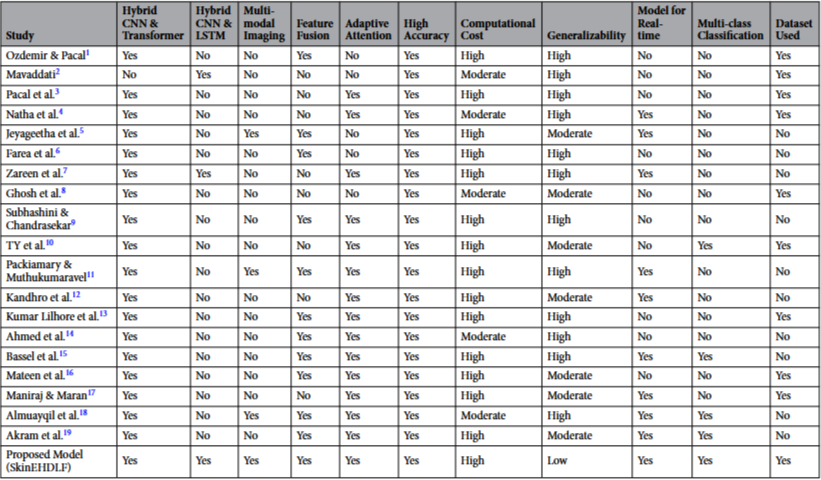
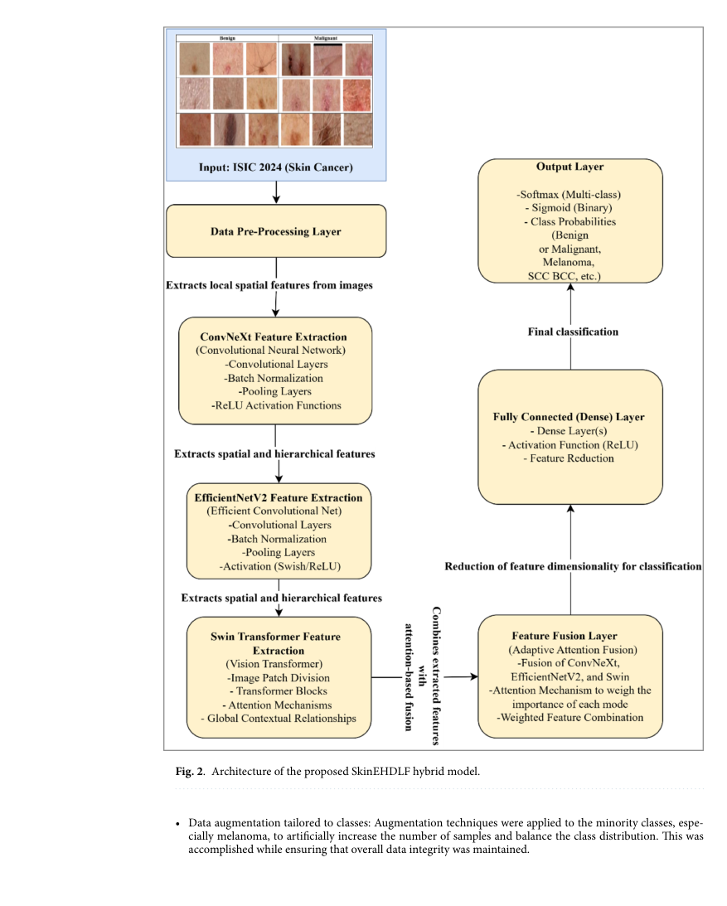
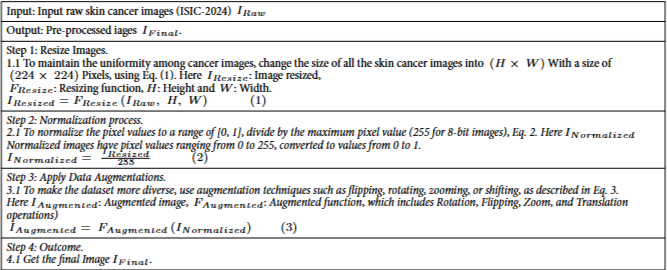
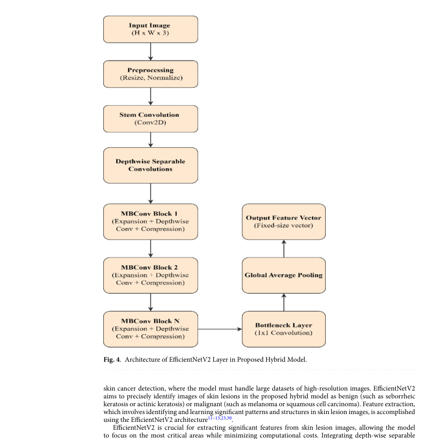
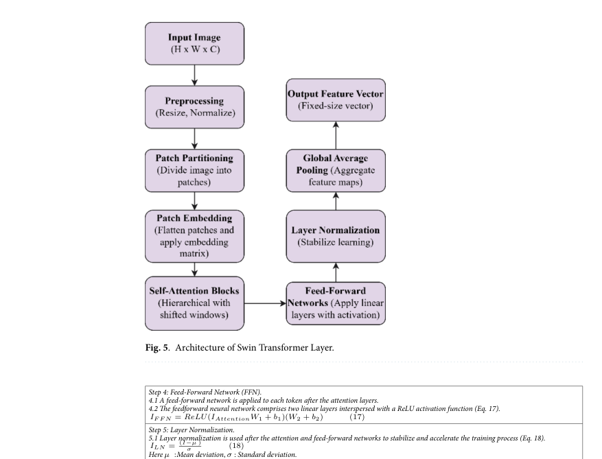
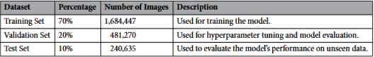
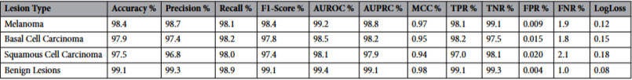
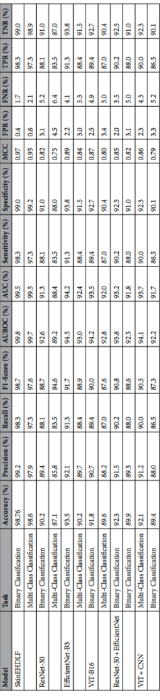

# SkinEHDLF: A Hybrid Deep Learning Approach for Accurate Skin Cancer Classification

## 출처/링크

출처: Scientific Reports, 2025  
DOI: `10.1038/s41598-025-98205-7`  
Google Scholar 인용: 33회 (조회일: 2026-05-20, `SkinEHDLF a hybrid deep learning approach for accurate skin cancer classification in complex systems` 제목 기준)  
PDF: [s41598-025-98205-7.pdf](../paper/s41598-025-98205-7.pdf)

## 주요 Figure 및 Table

**Table 1. 기존 연구 및 제안 모델 비교 분석**

* 일반적으로 다양한 멀티 모달
* 연산비용에서의 차별성
* 

**Table 4. SkinEHDLF 아키텍쳐**

**Figure 2. SkinEHDLF hybrid model 아키텍쳐**

**Table 5. 전처리**

**Figure 3. ConvNeXt Feature Extraction**

**Figure 4. EfficientNetV2 Feature Extraction**

**Figure 5.  Swin Transformer Feature Extraction**

**Table 6. data split**

**Table 8. result: lesion type classification**

**Figure 9. result: binary vs. Multi-class classification results**

---

## 목표와 기여

SkinEHDLF는 ConvNeXt, EfficientNetV2, Swin Transformer를 결합해 피부암 binary 및 multi-class classification 성능을 높이는 hybrid deep learning framework를 제안

## Dataset 정보

- Dataset: ISIC 2024 3D total-body photography 기반 skin lesion image
- Sample 규모: ISIC 2024 전체 401,059개 image를 기반으로 설명
- Task: binary classification 및 multi-class classification

## Imbalance 처리

* Minority class targeted augmentation
    * 회전, 뒤집기, 크기 조절 등을 적용한 결과, 최종적으로 2,406,354개의 이미지가 학습 및 평가에 사용
* Class-weighted loss function
    * underrepresented class, 특히 melanoma에 더 높은 weight 부여
    * overrepresented class에는 낮은 weight 부여

## Tabular model

별도 tabular model은 없음

## Image model

ISIC 2024 데이터셋을 사용하여 전이학습(Transfer Learning) 및 미세 조정(Fine-tuning)을 수행

* ConvNeXt 
    * convolution 기반 feature extractor로 사용 
    * 공간적/질감 특징 벡터 생성
    * 복잡한 이미지에서 피부 병변의 국소적(local pattern)·세밀한 공간적 패턴(texture feature)을 포착하는데 탁월하며, 계층적 특징 추출을 통해 암의 구조적 패턴을 파악
* EfficientNetV2
    * 계산 효율적인 feature extractor로 사용
    * 효율적/식별적 특징 벡터 생성
    * 고해상도 이미지를 처리할 때 발생하는 계산 오버헤드를 최소화하면서도, (병변)식별력 있는 피처를 추출
* Swin Transformer
    * 이미지로부터 CNN이 놓치기 쉬운 전역적 문맥 정보를 뽑아내는 feature extractor로 사용
    * 전역 문맥/장거리 의존성 특징 벡터 생성
    * 기술적 특징: 이미지를 패치로 분할하고 Shifted-window 방식을 통해 국소적 특징과 전역적 의존성을 모두 학습하여, CNN이 놓치기 쉬운 장거리 문맥(Long-range context) 정보를 파악

## Fusion 방식

image-only

* 적응형 어텐션 융합(adaptive attention-based feature fusion) 
    * 세 backbone에서 나온 feature를 병변 복잡성에 따라 특징의 우선순위를 동적으로 지정하는 적응형 특징 융합 메커니즘을 도입하여 모델 성능을 향상
* image-image ensemble fusion 임. ISIC 2024 metadata를 포함한 image-tabular fusion은 아님.

## 평가 지표

pAUC@80% TPR 사용안함

Accuracy, precision, recall, F1-score, AUROC, AUC, sensitivity, specificity, MCC, FPR/FNR을 사용 (Table 9.)

## 평가 결과

* Multi-class Classification (질환별 분류)
    * 흑색종, 기저세포암, 편평세포암 등을 분류하는 더 복잡한 작업에서도 높은 성능을 유지
    * Accuracy: 98.6%
    * AUROC 99.7%
    * Precision: 97.9%
    * Recall: 97.3%
* 질환별 세부 정확도 (Lesion Type Analysis)
    * Melanoma(흑색종)에 대해 매우 높은 탐지 성능을 보임
    * Melanoma: 정확도 98.4%, AUROC 99.2%
    * Benign(양성): 정확도 99.1%, AUROC 99.4%

## ISIC2024 연구 시사점

- image-only hybrid baseline으로 참고할 만함

---

[메인 문서로 돌아가기](../2026-05-18_dermatology_ai_literature_review.md#3-주요-논문별-상세-분석)
