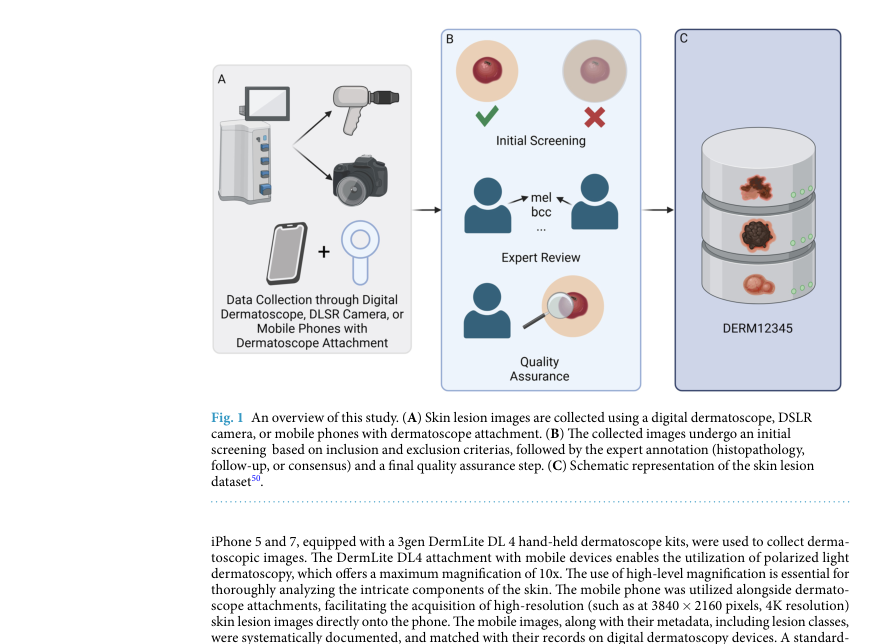
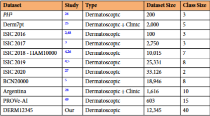
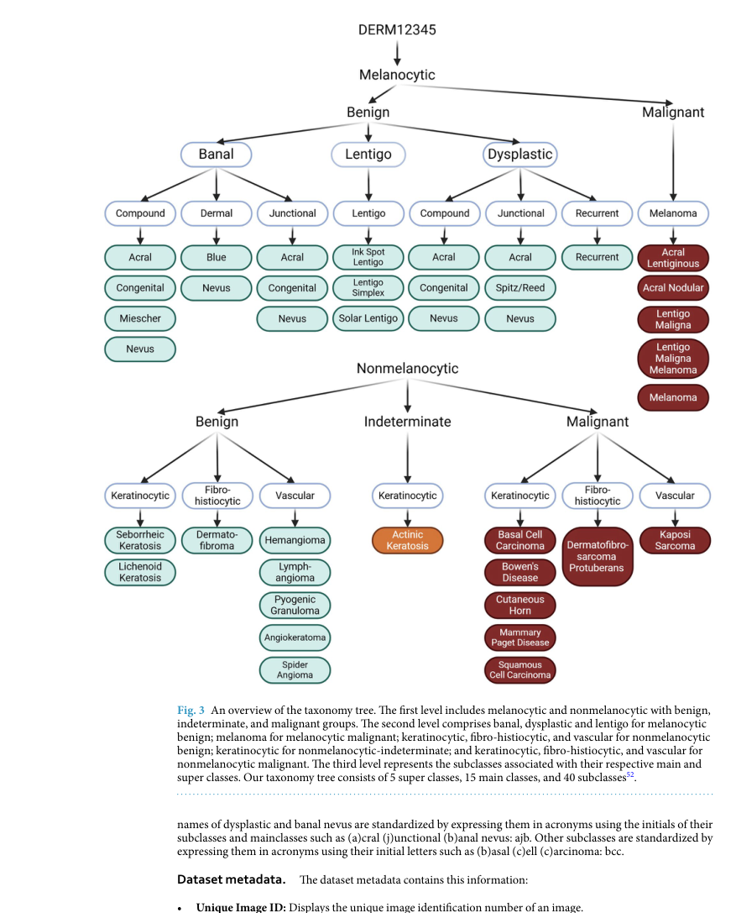
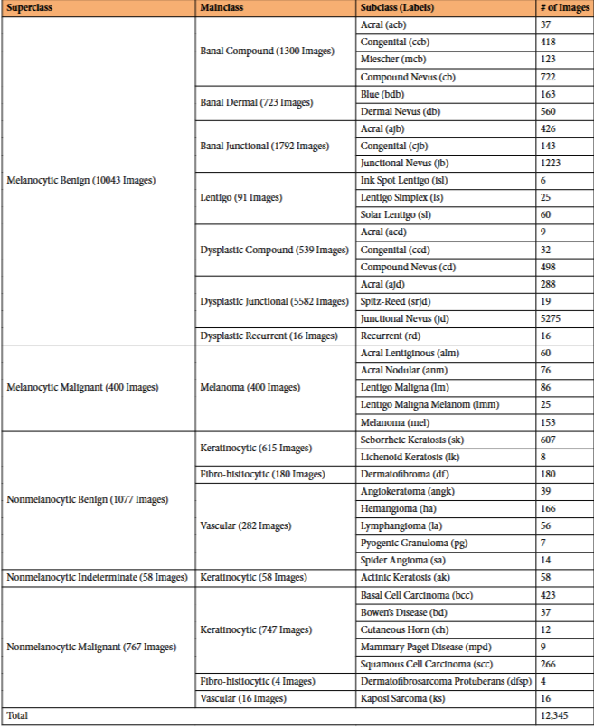

# DERM12345: A Large, Multisource Dermatoscopic Skin Lesion Dataset with 40 Subclasses

## 출처/링크

출처: Scientific Data, 2024  
DOI: `10.1038/s41597-024-04104-3`  
Google Scholar 인용: 33회 (조회일: 2026-05-20, `DERM12345: A Large, Multisource Dermatoscopic Skin Lesion Dataset with 40 Subclasses` 제목 기준)  
PDF: [s41597-024-04104-3.pdf](../paper/s41597-024-04104-3.pdf)

## 주요 Figure 및 Table

**Figure 1. 연구 설계와 모델/데이터 처리 흐름**

A. 데이터 수집: 디지털 피부경 장비, DSLR 카메라, 모바일폰 + 휴대용피부경
B. 데이터 선별 및 검증: 엔지니어 이미지 검토해서 유효하지 않은 이미지 제거, 피부과 전문의 검토, 경력 전문가 검토
C. 최종 데이터셋 구축

**Table 1. 데이터 구성, 예시, 분포 특성 요약**

기존 데이터셋 대비 세분화된 클래스

**Figure 3. 연구 설계와 모델/데이터 처리 흐름**

DERM12345 데이터셋의 분류 체계도 

**Table 2. 데이터 구성, 예시, 분포 특성 요약**

5개의 상위 클래스, 15개의 주요 클래스, 40개의 하위 클래스

---

## 목표와 기여

기존 공개 dermoscopy dataset이 세부 subclass를 충분히 제공하지 못한다는 문제를 보완하기 위해 40개 subclass를 갖는 대규모 dermatoscopic skin lesion dataset을 공개한다.

## Dataset 정보

- 수집 기관: Türkiye 3개 기관
- 기간: 2008-2021년
- 규모: 1,627명 환자, 12,345개의 고해상도 피부경 이미지
- Label 분류체계도: 5개의 상위 클래스, 15개의 주요 클래스, 40개의 하위 클래스(40개의 피부 병변 세부 분류)
- Benign: 11220(90.07%), Indeterminate: 58(0.46%), Malignant: 1167(9.45%)
- 모든 악성 병변은 조직검사로 입증

## Imbalance 처리

환자 기반으로 훈련(9860개 이미지, 80%) 및 테스트(2485개 이미지, 20%) 세트로 분할

## Tabular model

baseline 시험 진행 안했음

## Image model

baseline 시험 진행함

* ImageNet
* pretrained ResNet50
* Xception
* InceptionResNetV2

## Fusion 방식

baseline 시험 진행 안했음

## 평가 지표

모델별 가중 정확도 (Weighted Accuracy)

## 평가 결과

모델별 가중 정확도 (Weighted Accuracy)

* Xception: 0.59 (가장 높은 성능)
* InceptionResNetV2: 0.58
* ResNet50: 0.50

## ISIC2024 연구 시사점

- Dermoscopy image dataset이므로 3D-TBP tile과 image distribution이 다름
- ISIC 2024 dataset 과 dataset 이 겹치지 않아서, 추가 데이터로 사용가능
- 고품질 데이터(악성): 조직검사로 입증된 악성 병변
- baseline accuracy가 낮아서 dataset 난이도 높음 추정

---

[메인 문서로 돌아가기](../2026-05-18_dermatology_ai_literature_review.md#3-주요-논문별-상세-분석)
