# MILK10k: A Hierarchical Multimodal Imaging-Learning Toolkit

## 출처/링크

출처: Journal of Investigative Dermatology, 2026 issue; 2025 online  
DOI: `10.1016/j.jid.2025.06.1594`  
Google Scholar 인용: 13회 (조회일: 2026-05-20, `MILK10k: A Hierarchical Multimodal Imaging-Learning Toolkit for Diagnosing Pigmented and Nonpigmented Skin Cancer and its Simulators` 제목 기준)  
PDF: [1-s2.0-S0022202X25022705-main.pdf](../paper/1-s2.0-S0022202X25022705-main.pdf)

## 주요 Figure 및 Table

원문 PDF의 본문 Figure/Table을 번호 단위로 추출해 로컬 asset으로 저장했다. Caption은 길게 옮기지 않고, 각 항목이 보여주는 내용과 ISIC2024 연구 관점의 의미를 한국어로 의역해 정리했다.

**Figure 1. 데이터 구성, 예시, 분포 특성**

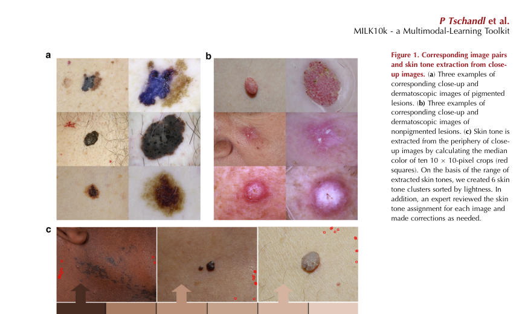

해석: 이 Figure는 데이터 구성, 예시, 분포 특성 범주를 시각적으로 보여준다. 원문 맥락에서는 해당 논문의 핵심 근거를 보강하는 자료이며, 특히 MILK10K의 close-up/dermoscopy image pair, skin tone, visual attribute annotation 구조 관련 내용을 이해하는 데 도움이 된다. ISIC2024 연구에서는 image pair, skin tone, attribute bias, ISIC-DX mapping을 논의할 때 비교 근거로 활용할 수 있다.

**Table 1. 데이터 구성, 예시, 분포 특성 요약**

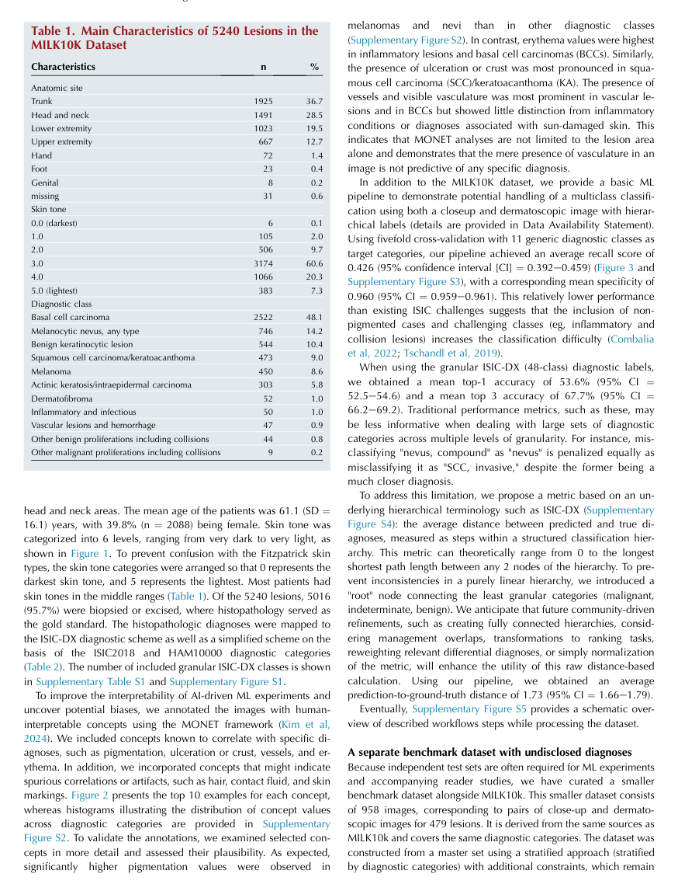

해석: 이 Table은 데이터 구성, 예시, 분포 특성 범주의 정보를 표 형태로 정리한다. 비교 축과 수치는 해당 논문의 핵심 근거를 보강하며, 특히 MILK10K의 close-up/dermoscopy image pair, skin tone, visual attribute annotation 구조 관련 내용을 비교해 읽는 기준이 된다. ISIC2024 연구에서는 image pair, skin tone, attribute bias, ISIC-DX mapping을 논의할 때 비교 근거로 활용할 수 있다.

**Table 2. 비교 항목과 핵심 수치 요약**

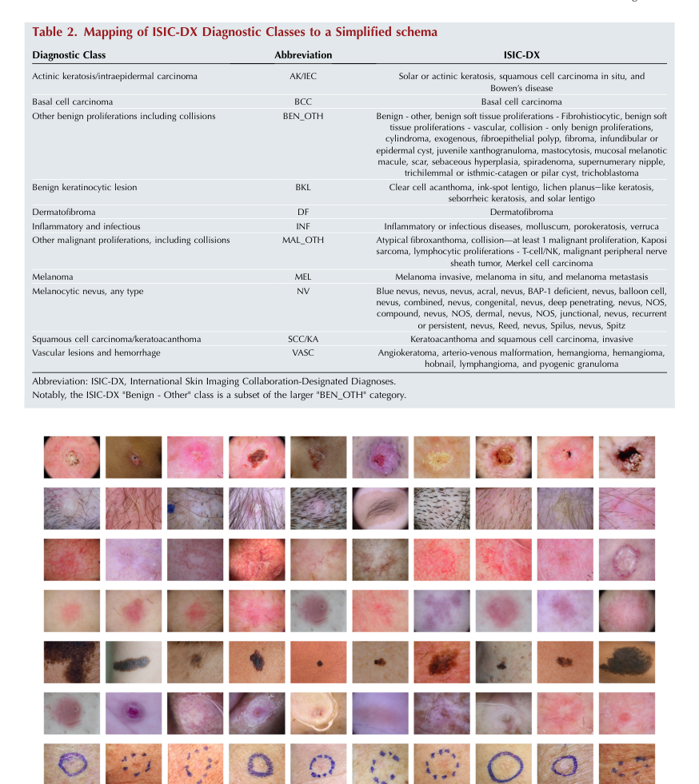

해석: 이 Table은 비교 항목과 핵심 수치 범주의 정보를 표 형태로 정리한다. 비교 축과 수치는 해당 논문의 핵심 근거를 보강하며, 특히 MILK10K의 close-up/dermoscopy image pair, skin tone, visual attribute annotation 구조 관련 내용을 비교해 읽는 기준이 된다. ISIC2024 연구에서는 image pair, skin tone, attribute bias, ISIC-DX mapping을 논의할 때 비교 근거로 활용할 수 있다.

**Figure 2. 연구 설계와 모델/데이터 처리 흐름**

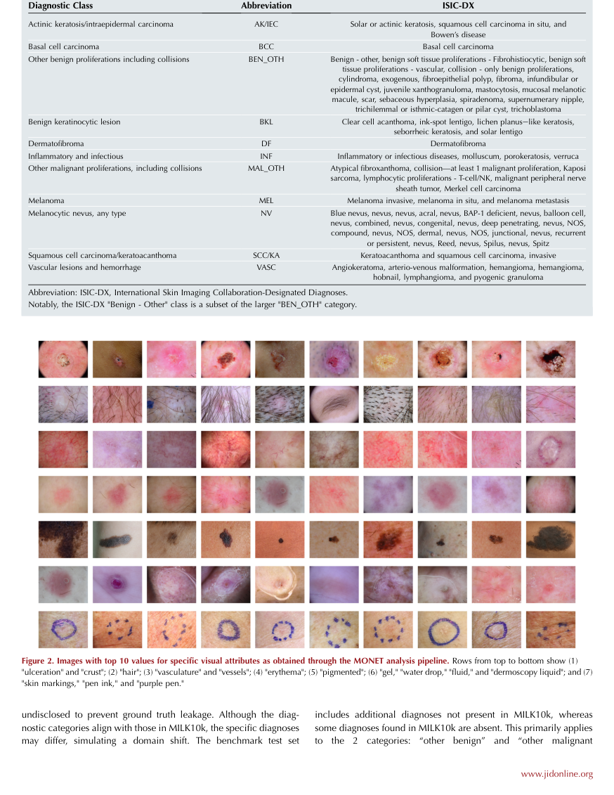

해석: 이 Figure는 연구 설계와 모델/데이터 처리 흐름 범주를 시각적으로 보여준다. 원문 맥락에서는 해당 논문의 핵심 근거를 보강하는 자료이며, 특히 MILK10K의 close-up/dermoscopy image pair, skin tone, visual attribute annotation 구조 관련 내용을 이해하는 데 도움이 된다. ISIC2024 연구에서는 image pair, skin tone, attribute bias, ISIC-DX mapping을 논의할 때 비교 근거로 활용할 수 있다.

**Figure 3. 성능 비교와 정량 평가 결과**

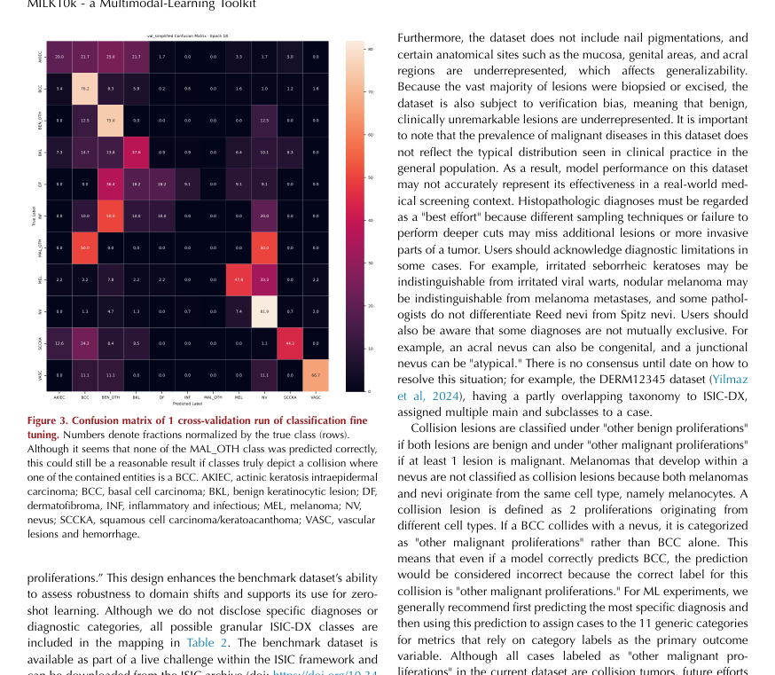

해석: 이 Figure는 성능 비교와 정량 평가 결과 범주를 시각적으로 보여준다. 원문 맥락에서는 해당 논문의 핵심 근거를 보강하는 자료이며, 특히 MILK10K의 close-up/dermoscopy image pair, skin tone, visual attribute annotation 구조 관련 내용을 이해하는 데 도움이 된다. ISIC2024 연구에서는 image pair, skin tone, attribute bias, ISIC-DX mapping을 논의할 때 비교 근거로 활용할 수 있다.

**Supplementary Figure S1. 데이터 구성, 예시, 분포 특성**

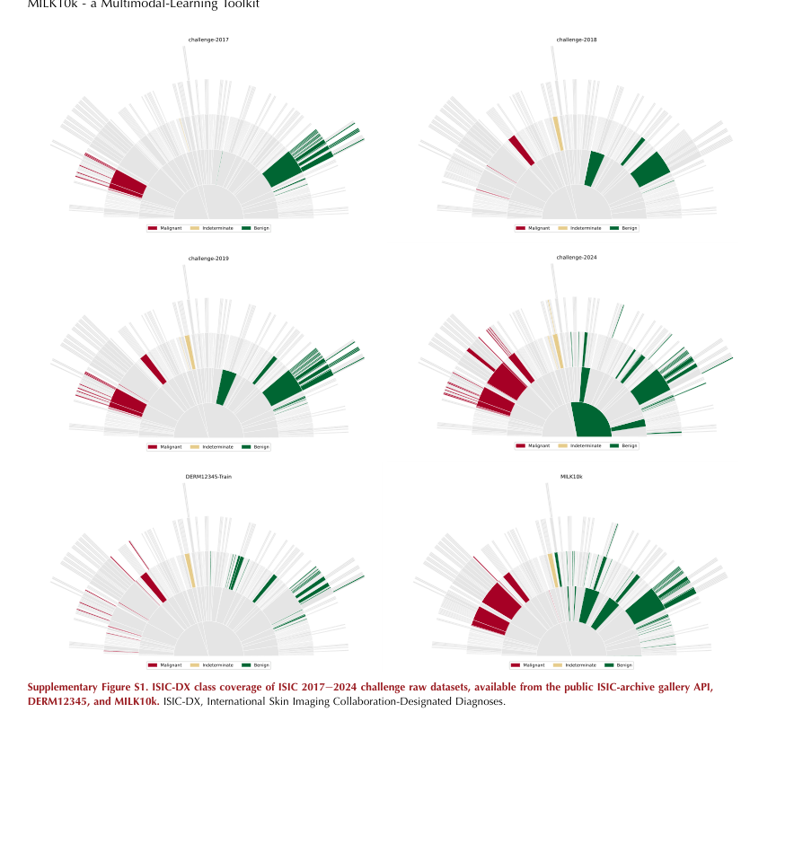

해석: 이 Figure는 데이터 구성, 예시, 분포 특성 범주를 시각적으로 보여준다. 원문 맥락에서는 해당 논문의 핵심 근거를 보강하는 자료이며, 특히 MILK10K의 close-up/dermoscopy image pair, skin tone, visual attribute annotation 구조 관련 내용을 이해하는 데 도움이 된다. ISIC2024 연구에서는 image pair, skin tone, attribute bias, ISIC-DX mapping을 논의할 때 비교 근거로 활용할 수 있다.

**Supplementary Figure S2. 연구 설계와 모델/데이터 처리 흐름**

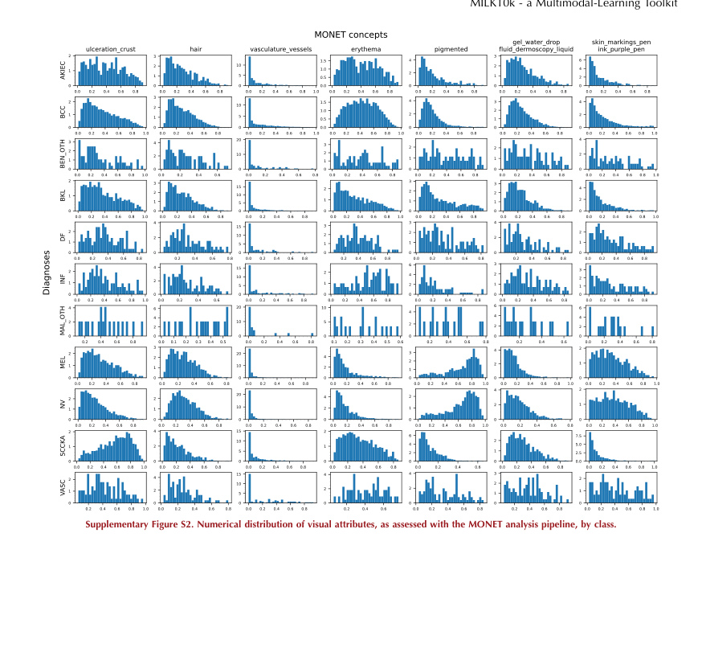

해석: 이 Figure는 연구 설계와 모델/데이터 처리 흐름 범주를 시각적으로 보여준다. 원문 맥락에서는 해당 논문의 핵심 근거를 보강하는 자료이며, 특히 MILK10K의 close-up/dermoscopy image pair, skin tone, visual attribute annotation 구조 관련 내용을 이해하는 데 도움이 된다. ISIC2024 연구에서는 image pair, skin tone, attribute bias, ISIC-DX mapping을 논의할 때 비교 근거로 활용할 수 있다.

**Supplementary Figure S3. 성능 비교와 정량 평가 결과**

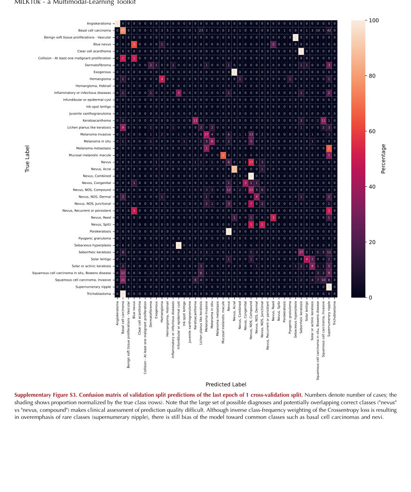

해석: 이 Figure는 성능 비교와 정량 평가 결과 범주를 시각적으로 보여준다. 원문 맥락에서는 해당 논문의 핵심 근거를 보강하는 자료이며, 특히 MILK10K의 close-up/dermoscopy image pair, skin tone, visual attribute annotation 구조 관련 내용을 이해하는 데 도움이 된다. ISIC2024 연구에서는 image pair, skin tone, attribute bias, ISIC-DX mapping을 논의할 때 비교 근거로 활용할 수 있다.

**Supplementary Figure S4. 데이터 구성, 예시, 분포 특성**

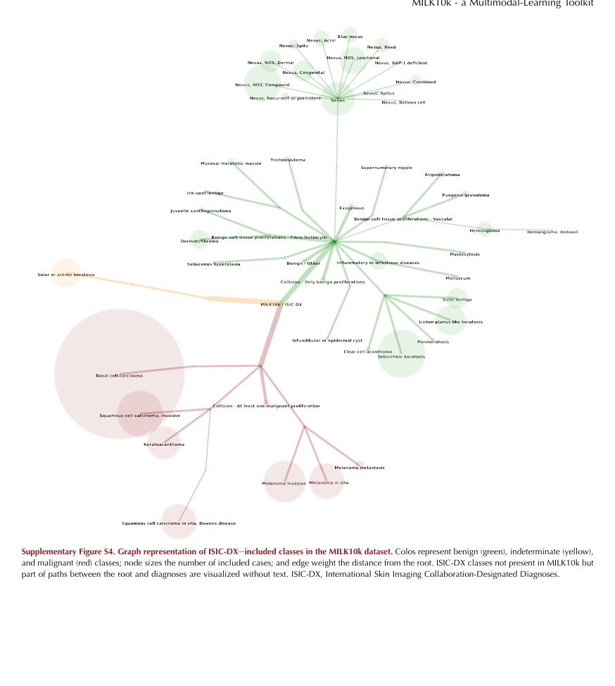

해석: 이 Figure는 데이터 구성, 예시, 분포 특성 범주를 시각적으로 보여준다. 원문 맥락에서는 해당 논문의 핵심 근거를 보강하는 자료이며, 특히 MILK10K의 close-up/dermoscopy image pair, skin tone, visual attribute annotation 구조 관련 내용을 이해하는 데 도움이 된다. ISIC2024 연구에서는 image pair, skin tone, attribute bias, ISIC-DX mapping을 논의할 때 비교 근거로 활용할 수 있다.

**Supplementary Figure S5. 연구 설계와 모델/데이터 처리 흐름**

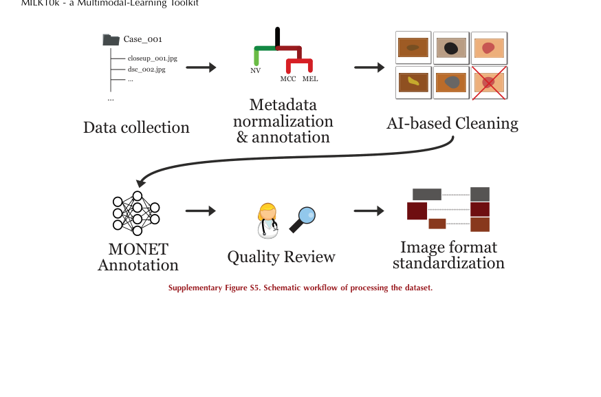

해석: 이 Figure는 연구 설계와 모델/데이터 처리 흐름 범주를 시각적으로 보여준다. 원문 맥락에서는 해당 논문의 핵심 근거를 보강하는 자료이며, 특히 MILK10K의 close-up/dermoscopy image pair, skin tone, visual attribute annotation 구조 관련 내용을 이해하는 데 도움이 된다. ISIC2024 연구에서는 image pair, skin tone, attribute bias, ISIC-DX mapping을 논의할 때 비교 근거로 활용할 수 있다.

**Supplementary Table S1. 비교 항목과 핵심 수치 요약**

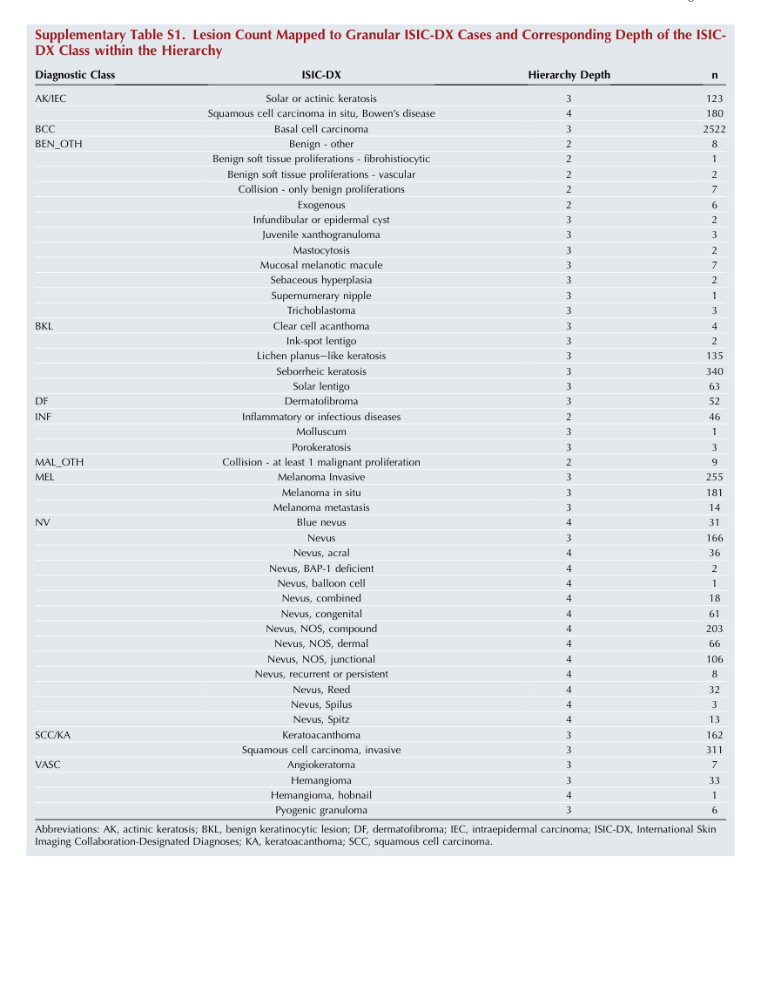

해석: 이 Table은 비교 항목과 핵심 수치 범주의 정보를 표 형태로 정리한다. 비교 축과 수치는 해당 논문의 핵심 근거를 보강하며, 특히 MILK10K의 close-up/dermoscopy image pair, skin tone, visual attribute annotation 구조 관련 내용을 비교해 읽는 기준이 된다. ISIC2024 연구에서는 image pair, skin tone, attribute bias, ISIC-DX mapping을 논의할 때 비교 근거로 활용할 수 있다.

## 우리 연구에서의 위치

MILK10k는 clinical close-up image와 dermoscopy image pair를 함께 제공하는 multimodal imaging benchmark이다. ISIC 2024에는 dermoscopy pair가 없지만, 피부암 진단에서 multi-view/multi-modality image가 중요한 이유를 설명하는 강한 근거가 된다.

---

## 목표와 기여

pigmented/nonpigmented skin cancer와 simulators를 함께 다루는 hierarchical multimodal image dataset과 benchmark tool을 제공한다. 단순 binary classification보다 계층형 diagnosis와 image pair fusion을 강조한다.

## Dataset 정보

- 수집 기관: 5개 센터
- 규모: 5,240개 병변
- Image: clinical close-up + dermoscopy image pair, 총 10,480장
- Label: 48개 ISIC-DX diagnosis
- Ground truth: 95.7% histopathology
- Metadata: age, sex, skin tone, anatomical site 포함

## Imbalance 처리

5-fold stratified split을 사용한다. baseline 학습에서는 CrossEntropyLoss에 inverse class-frequency weighting과 label smoothing 0.01을 적용한다.

## Tabular model

age, sex, skin tone, anatomical site metadata를 제공하지만, baseline model의 핵심은 close-up과 dermoscopy image pair이다. metadata fusion model은 중심 기여가 아니다.

## Image model

ResNet50 backbone의 Siamese neural network로 clinical close-up image와 dermoscopy image의 penultimate feature를 각각 추출한다.

## Fusion 방식

두 image branch의 penultimate feature를 simple concatenation한 뒤 512-dimensional projection과 fully connected classifier로 diagnosis를 예측한다.

## 평가 지표

recall, specificity, top-1/top-3 accuracy, hierarchical diagnosis distance metric을 사용한다.

## 평가 결과

11 generic class에서 average recall 0.426, specificity 0.960을 보고한다. 48-class ISIC-DX task에서는 top-1 accuracy 53.6%, top-3 accuracy 67.7%를 보고한다.

## ISIC2024 연구 시사점

- clinical close-up과 dermoscopy를 함께 볼 때 진단 정보가 보완된다는 점을 보여준다.
- ISIC 2024 tile-only image가 제한적인 visual modality라는 점을 discussion에서 설명할 수 있다.
- metadata가 제공되더라도 baseline은 image pair 중심이므로 image-tabular fusion 근거로 직접 쓰기보다는 multimodal imaging 근거로 쓰는 것이 적절하다.

## 추가 논의/주의점

- ISIC 2024 train dataset에는 dermoscopy image pair가 없으므로 직접 baseline으로 둘 수 없다.
- hierarchical diagnosis metric은 binary pAUC와 성격이 다르다.
- histopathology ground truth 비율이 높아 dataset reliability 근거로 가치가 있다.

---

[메인 문서로 돌아가기](../2026-05-18_dermatology_ai_literature_review.md#3-주요-논문별-상세-분석)
