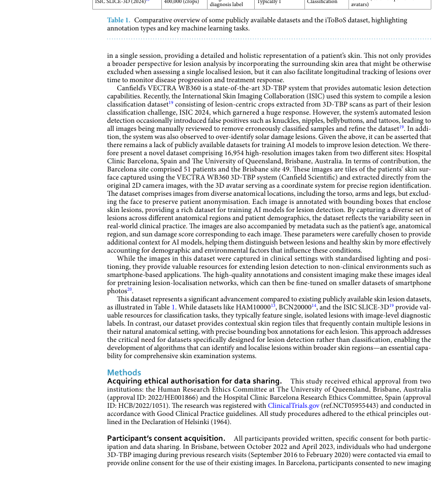
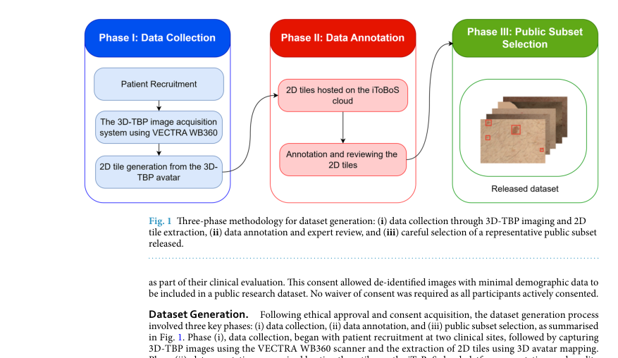
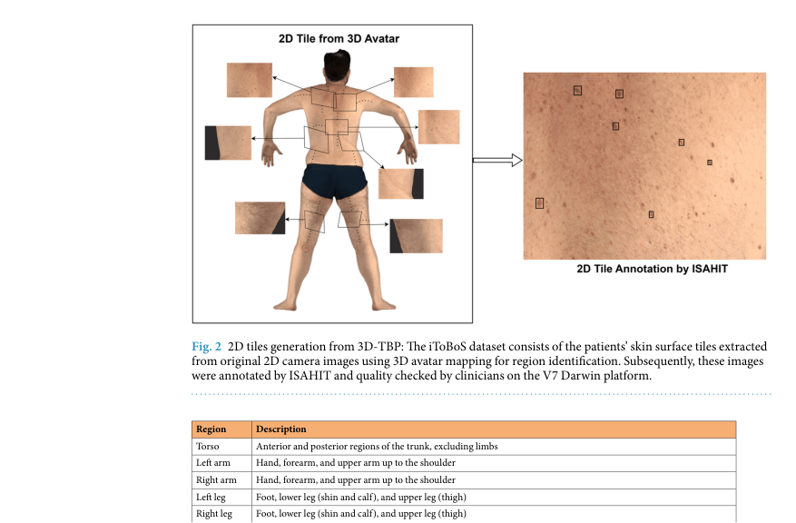
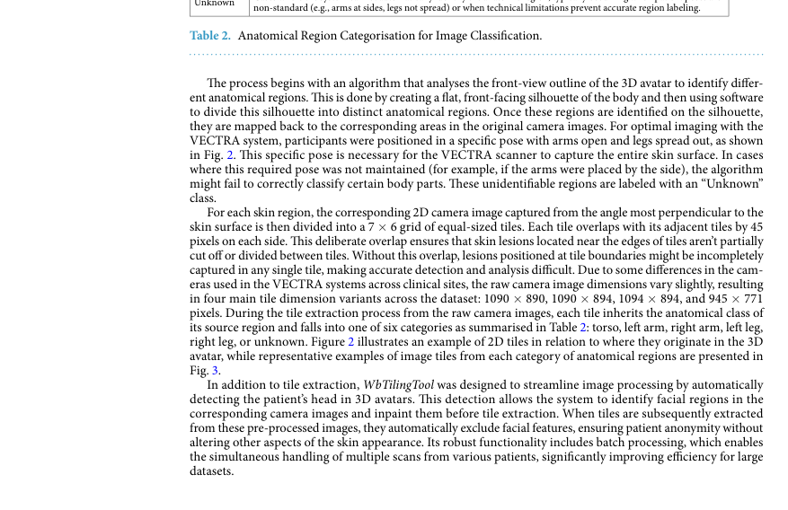
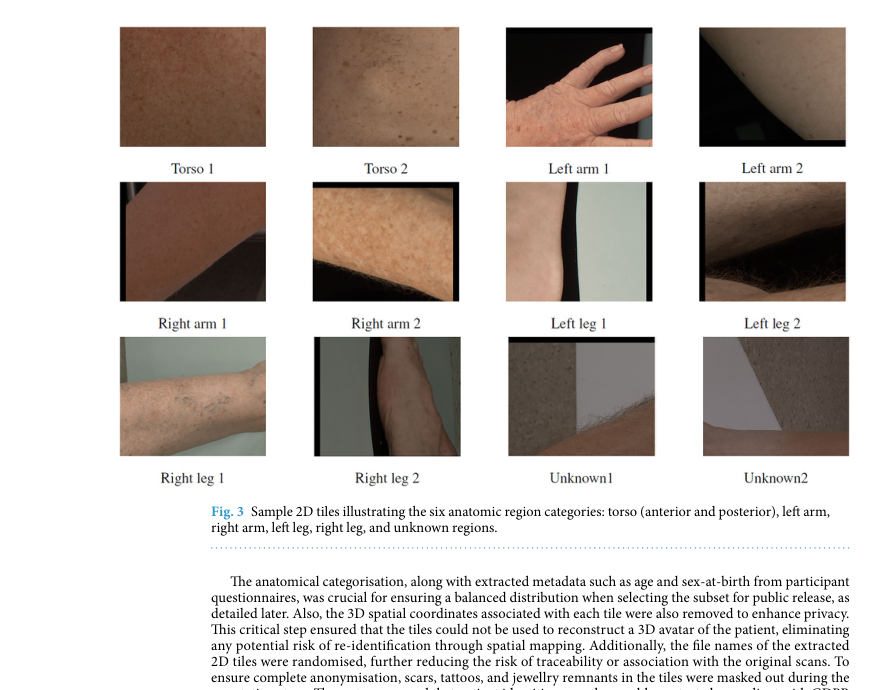
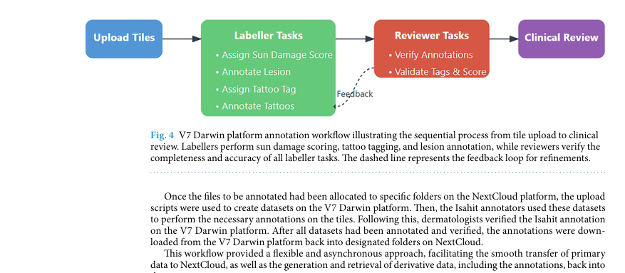
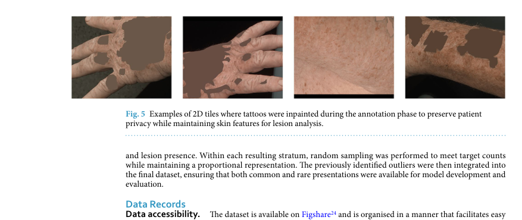
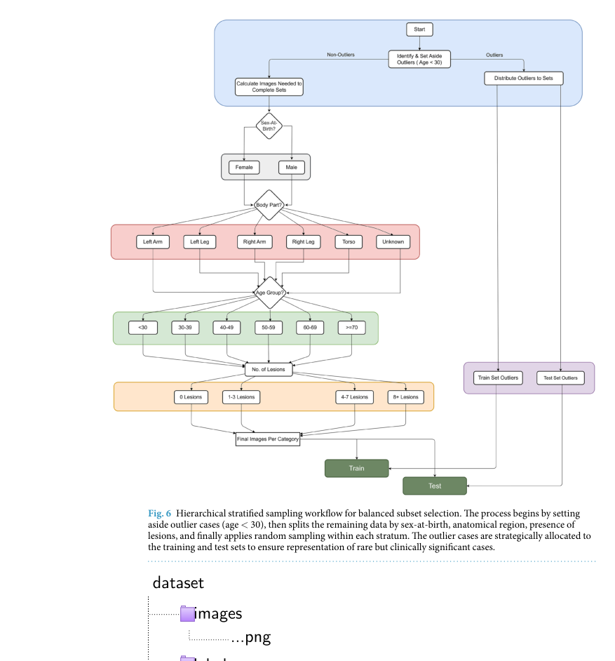
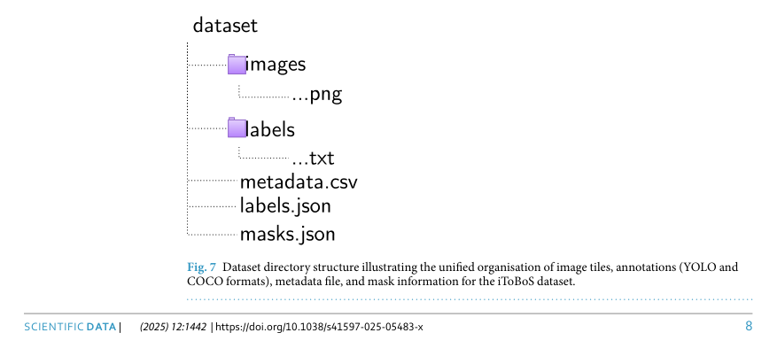
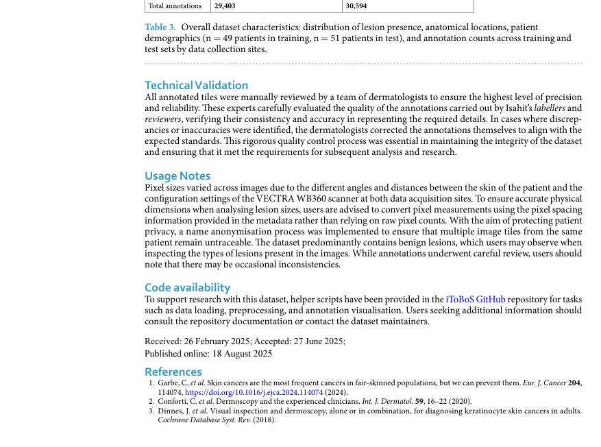

# Skin Region Images Extracted from 3D Total Body Photographs for Lesion Detection

## 출처/링크

출처: Scientific Data, 2025  
DOI: `10.1038/s41597-025-05483-x`  
Google Scholar 인용: 3회 (조회일: 2026-05-26, `Skin Region Images Extracted from 3D Total Body Photographs for Lesion Detection` 제목 기준)  
PDF: [s41597-025-05483-x.pdf](../paper/s41597-025-05483-x.pdf)

## 주요 Figure 및 Table

원문 PDF의 본문 Figure/Table을 번호 단위로 추출해 로컬 asset으로 저장했다. Caption은 길게 옮기지 않고, 각 항목이 보여주는 내용과 ISIC2024 연구 관점의 의미를 한국어로 의역해 정리했다.

**Table 1. 연구 설계와 모델/데이터 처리 흐름 요약**

해석: 이 Table은 연구 설계와 모델/데이터 처리 흐름 범주의 정보를 표 형태로 정리한다. 비교 축과 수치는 해당 논문의 핵심 근거를 보강하며, 특히 3D-TBP 기반 body region tile dataset의 생성, annotation, sampling, directory 구조 관련 내용을 비교해 읽는 기준이 된다. ISIC2024 연구에서는 3D-TBP tile의 anatomical region metadata와 sampling 전략을 설계할 때 참고할 수 있다.

**Figure 1. 데이터 구성, 예시, 분포 특성**

해석: 이 Figure는 데이터 구성, 예시, 분포 특성 범주를 시각적으로 보여준다. 원문 맥락에서는 해당 논문의 핵심 근거를 보강하는 자료이며, 특히 3D-TBP 기반 body region tile dataset의 생성, annotation, sampling, directory 구조 관련 내용을 이해하는 데 도움이 된다. ISIC2024 연구에서는 3D-TBP tile의 anatomical region metadata와 sampling 전략을 설계할 때 참고할 수 있다.

**Figure 2. 데이터 구성, 예시, 분포 특성**

해석: 이 Figure는 데이터 구성, 예시, 분포 특성 범주를 시각적으로 보여준다. 원문 맥락에서는 해당 논문의 핵심 근거를 보강하는 자료이며, 특히 3D-TBP 기반 body region tile dataset의 생성, annotation, sampling, directory 구조 관련 내용을 이해하는 데 도움이 된다. ISIC2024 연구에서는 3D-TBP tile의 anatomical region metadata와 sampling 전략을 설계할 때 참고할 수 있다.

**Table 2. 비교 항목과 핵심 수치 요약**

해석: 이 Table은 비교 항목과 핵심 수치 범주의 정보를 표 형태로 정리한다. 비교 축과 수치는 해당 논문의 핵심 근거를 보강하며, 특히 3D-TBP 기반 body region tile dataset의 생성, annotation, sampling, directory 구조 관련 내용을 비교해 읽는 기준이 된다. ISIC2024 연구에서는 3D-TBP tile의 anatomical region metadata와 sampling 전략을 설계할 때 참고할 수 있다.

**Figure 3. 데이터 구성, 예시, 분포 특성**

해석: 이 Figure는 데이터 구성, 예시, 분포 특성 범주를 시각적으로 보여준다. 원문 맥락에서는 해당 논문의 핵심 근거를 보강하는 자료이며, 특히 3D-TBP 기반 body region tile dataset의 생성, annotation, sampling, directory 구조 관련 내용을 이해하는 데 도움이 된다. ISIC2024 연구에서는 3D-TBP tile의 anatomical region metadata와 sampling 전략을 설계할 때 참고할 수 있다.

**Figure 4. 연구 설계와 모델/데이터 처리 흐름**

해석: 이 Figure는 연구 설계와 모델/데이터 처리 흐름 범주를 시각적으로 보여준다. 원문 맥락에서는 해당 논문의 핵심 근거를 보강하는 자료이며, 특히 3D-TBP 기반 body region tile dataset의 생성, annotation, sampling, directory 구조 관련 내용을 이해하는 데 도움이 된다. ISIC2024 연구에서는 3D-TBP tile의 anatomical region metadata와 sampling 전략을 설계할 때 참고할 수 있다.

**Figure 5. 데이터 구성, 예시, 분포 특성**

해석: 이 Figure는 데이터 구성, 예시, 분포 특성 범주를 시각적으로 보여준다. 원문 맥락에서는 해당 논문의 핵심 근거를 보강하는 자료이며, 특히 3D-TBP 기반 body region tile dataset의 생성, annotation, sampling, directory 구조 관련 내용을 이해하는 데 도움이 된다. ISIC2024 연구에서는 3D-TBP tile의 anatomical region metadata와 sampling 전략을 설계할 때 참고할 수 있다.

**Figure 6. 연구 설계와 모델/데이터 처리 흐름**

해석: 이 Figure는 연구 설계와 모델/데이터 처리 흐름 범주를 시각적으로 보여준다. 원문 맥락에서는 해당 논문의 핵심 근거를 보강하는 자료이며, 특히 3D-TBP 기반 body region tile dataset의 생성, annotation, sampling, directory 구조 관련 내용을 이해하는 데 도움이 된다. ISIC2024 연구에서는 3D-TBP tile의 anatomical region metadata와 sampling 전략을 설계할 때 참고할 수 있다.

**Figure 7. 데이터 구성, 예시, 분포 특성**

해석: 이 Figure는 데이터 구성, 예시, 분포 특성 범주를 시각적으로 보여준다. 원문 맥락에서는 해당 논문의 핵심 근거를 보강하는 자료이며, 특히 3D-TBP 기반 body region tile dataset의 생성, annotation, sampling, directory 구조 관련 내용을 이해하는 데 도움이 된다. ISIC2024 연구에서는 3D-TBP tile의 anatomical region metadata와 sampling 전략을 설계할 때 참고할 수 있다.

**Table 3. 데이터 구성, 예시, 분포 특성 요약**

해석: 이 Table은 데이터 구성, 예시, 분포 특성 범주의 정보를 표 형태로 정리한다. 비교 축과 수치는 해당 논문의 핵심 근거를 보강하며, 특히 3D-TBP 기반 body region tile dataset의 생성, annotation, sampling, directory 구조 관련 내용을 비교해 읽는 기준이 된다. ISIC2024 연구에서는 3D-TBP tile의 anatomical region metadata와 sampling 전략을 설계할 때 참고할 수 있다.

## 우리 연구에서의 위치

이 논문은 병변 중심 crop만이 아니라 주변 피부 context까지 포함한 3D-TBP skin-region tile dataset을 제공한다. ISIC 2024 crop image가 갖는 context 제한을 설명하고, lesion detection/localisation 또는 patient-context feature의 필요성을 주장할 때 유용하다.

---

## 목표와 기여

3D total body photography에서 병변 중심 crop보다 넓은 피부 영역을 포함하는 tile을 추출하고, suspicious lesion bounding box를 제공해 lesion detection/localisation 연구 기반을 마련한다.

## Dataset 정보

- 수집 지역: Barcelona와 Brisbane
- 참여자: 100명
- Image: 16,954개 skin-region tile
- Tile 범위: 약 7 x 9 cm 피부 영역
- Annotation: suspicious lesion bounding box
- Metadata: anatomical location, age group, sun damage score 등

## Imbalance 처리

모델 학습 논문이 아니라 dataset descriptor이므로 imbalance algorithm은 없다. usage note에서 benign lesion predominance와 annotation inconsistency 가능성을 주의점으로 언급한다.

## Tabular model

별도 tabular model은 없다. metadata CSV에는 image별 train/test split, anatomical location, demographics, sun damage score 등이 포함된다.

## Image model

새 classification model은 없다. dataset과 annotation을 제공하는 것이 핵심이며, detection/localisation benchmark로 사용할 수 있다.

## Fusion 방식

모델 fusion은 없다. PNG image tile, YOLO/COCO annotation, metadata를 함께 제공하는 dataset-level multimodal 구성이다.

## 평가 지표

manual dermatologist review와 annotation quality control 중심이다. classifier 성능 지표는 보고하지 않는다.

## 평가 결과

모든 annotated tile을 dermatologist가 검토 및 수정하여 lesion detection benchmark용 공개 dataset으로 검증한다.

## ISIC2024 연구 시사점

- ISIC 2024 lesion crop은 주변 피부와 다른 병변들과의 비교 정보를 많이 잃을 수 있다.
- ugly duckling sign, patient-context feature, lesion-to-region comparison을 future work로 제안할 근거가 된다.
- detection/localisation dataset이므로 binary classification 성능 비교에는 직접 사용하지 않는다.

## 추가 논의/주의점

- Tile 범위가 ISIC 2024 15mm lesion crop보다 넓기 때문에 visual context가 다르다.
- suspicious lesion annotation은 malignant diagnosis label과 동일하지 않다.
- metadata와 annotation을 사용할 때 patient/site split leakage를 고려해야 한다.

---

[메인 문서로 돌아가기](../2026-05-18_dermatology_ai_literature_review.md#3-주요-논문별-상세-분석)
