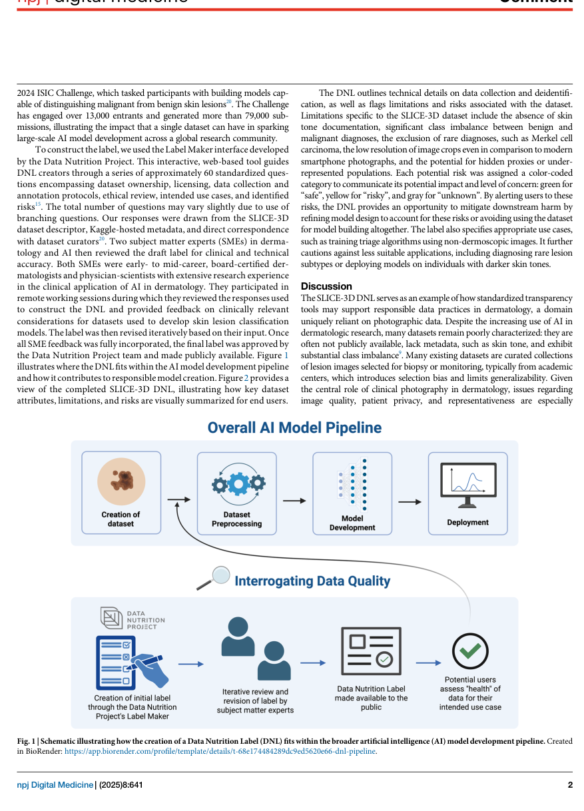
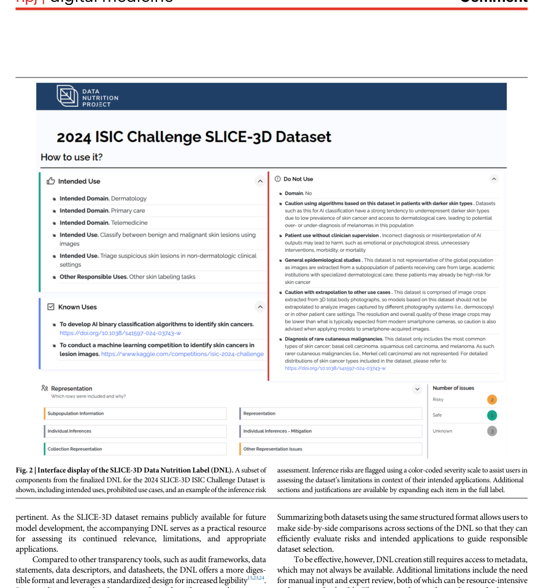

# Improving Dataset Transparency in Dermatologic AI Using a Dataset Nutrition Label

## 출처/링크

출처: npj Digital Medicine, 2025  
DOI: `10.1038/s41746-025-02125-9`  
Google Scholar 인용: 3회 (조회일: 2026-05-26, `Improving dataset transparency in dermatologic Artificial Intelligence using a dataset nutrition label` 제목/DOI 기준)  
PDF: [s41746-025-02125-9.pdf](../paper/s41746-025-02125-9.pdf)

## 주요 Figure 및 Table

원문 PDF의 본문 Figure/Table을 번호 단위로 추출해 로컬 asset으로 저장했다. Caption은 길게 옮기지 않고, 각 항목이 보여주는 내용과 ISIC2024 연구 관점의 의미를 한국어로 의역해 정리했다.

**Figure 1. 연구 설계와 모델/데이터 처리 흐름**

해석: 이 Figure는 연구 설계와 모델/데이터 처리 흐름 범주를 시각적으로 보여준다. 원문 맥락에서는 해당 논문의 핵심 근거를 보강하는 자료이며, 특히 SLICE-3D Data Nutrition Label의 데이터셋 품질, provenance, limitation reporting 체계 관련 내용을 이해하는 데 도움이 된다. ISIC2024 연구에서는 ISIC 2024 데이터셋 설명에서 label noise, metadata, data governance를 구조화할 때 유용하다.

**Figure 2. 데이터 구성, 예시, 분포 특성**

해석: 이 Figure는 데이터 구성, 예시, 분포 특성 범주를 시각적으로 보여준다. 원문 맥락에서는 해당 논문의 핵심 근거를 보강하는 자료이며, 특히 SLICE-3D Data Nutrition Label의 데이터셋 품질, provenance, limitation reporting 체계 관련 내용을 이해하는 데 도움이 된다. ISIC2024 연구에서는 ISIC 2024 데이터셋 설명에서 label noise, metadata, data governance를 구조화할 때 유용하다.

## 우리 연구에서의 위치

이 논문은 SLICE-3D/ISIC 2024를 case study로 삼아 dermatology AI dataset의 bias, limitation, risk를 구조화하는 Dataset Nutrition Label(DNL)을 적용한다. ISIC 2024 연구의 dataset limitation, ethical discussion, external validity 논의를 강화하는 데 매우 중요하다.

---

## 목표와 기여

dermatology AI dataset 사용자가 dataset의 구성, 편향, 제한점, 적합한 use case와 부적합한 use case를 빠르게 판단할 수 있도록 Dataset Nutrition Label framework를 적용한다.

## Dataset 정보

- Case study: SLICE-3D / ISIC 2024 3D-TBP crop dataset
- 활용 자료: dataset descriptor, Kaggle metadata, curator correspondence, subject matter expert review

## Imbalance 처리

class imbalance를 직접 보정하지 않는다. 대신 benign/malignant class imbalance, rare diagnosis exclusion, missing skin tone documentation, low resolution, hidden proxy risk를 dataset risk로 표시한다.

## Tabular model

해당 없음. 모델 개발 논문이 아니라 dataset documentation 및 transparency framework이다.

## Image model

해당 없음. skin lesion classifier를 학습하지 않는다.

## Fusion 방식

모델 fusion은 없다. DNL은 dataset metadata, limitations, risks를 구조화해 시각적으로 요약하는 문서화 도구이다.

## 평가 지표

green/yellow/gray risk category와 dermatology/AI subject matter expert review로 label 정확성과 유용성을 검토한다.

## 평가 결과

SLICE-3D의 적합한 use case와 부적합한 use case를 분리하고, darker skin tone deployment, rare subtype diagnosis, label proxy risk 같은 위험 적용을 경고한다.

## ISIC2024 연구 시사점

- ISIC 2024 dataset section에서 imbalance와 weak label만이 아니라 skin tone, hidden proxy, rare diagnosis coverage를 함께 다뤄야 한다.
- 모델 성능이 높더라도 dataset risk가 clinical deployment risk로 이어질 수 있음을 설명할 수 있다.
- patient metadata와 anatomical/site feature를 사용할 때 proxy leakage 가능성을 논의하는 근거가 된다.

## 추가 논의/주의점

- DNL은 성능 개선 방법이 아니라 documentation framework이다.
- 모델 결과와 함께 reporting checklist처럼 사용하는 것이 적절하다.
- 우리 연구 limitation section에 직접 연결하기 좋은 reference이다.

---

[메인 문서로 돌아가기](../2026-05-18_dermatology_ai_literature_review.md#3-주요-논문별-상세-분석)
