# SkinEHDLF: A Hybrid Deep Learning Approach for Accurate Skin Cancer Classification

## 출처/링크

출처: Scientific Reports, 2025  
DOI: `10.1038/s41598-025-98205-7`  
Google Scholar 인용: 33회 (조회일: 2026-05-20, `SkinEHDLF a hybrid deep learning approach for accurate skin cancer classification in complex systems` 제목 기준)  
PDF: [s41598-025-98205-7.pdf](../paper/s41598-025-98205-7.pdf)

## 주요 Figure 및 Table

원문 PDF의 본문 Figure/Table을 번호 단위로 추출해 로컬 asset으로 저장했다. Caption은 길게 옮기지 않고, 각 항목이 보여주는 내용과 ISIC2024 연구 관점의 의미를 한국어로 의역해 정리했다.

**Table 1. 비교 항목과 핵심 수치 요약**

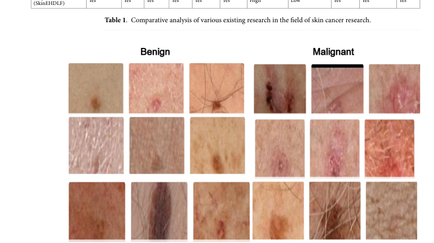

해석: 이 Table은 비교 항목과 핵심 수치 범주의 정보를 표 형태로 정리한다. 비교 축과 수치는 해당 논문의 핵심 근거를 보강하며, 특히 ISIC 2024 기반 hybrid deep learning pipeline과 class imbalance 대응 실험 관련 내용을 비교해 읽는 기준이 된다. ISIC2024 연구에서는 극단적 class imbalance, augmentation, ensemble baseline을 비교할 때 참고할 수 있다.

**Figure 1. 연구 설계와 모델/데이터 처리 흐름**

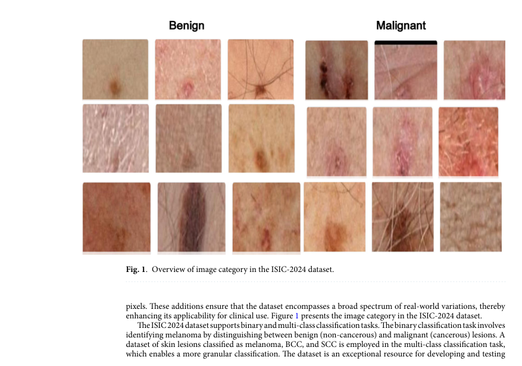

해석: 이 Figure는 연구 설계와 모델/데이터 처리 흐름 범주를 시각적으로 보여준다. 원문 맥락에서는 해당 논문의 핵심 근거를 보강하는 자료이며, 특히 ISIC 2024 기반 hybrid deep learning pipeline과 class imbalance 대응 실험 관련 내용을 이해하는 데 도움이 된다. ISIC2024 연구에서는 극단적 class imbalance, augmentation, ensemble baseline을 비교할 때 참고할 수 있다.

**Table 2. 연구 설계와 모델/데이터 처리 흐름 요약**

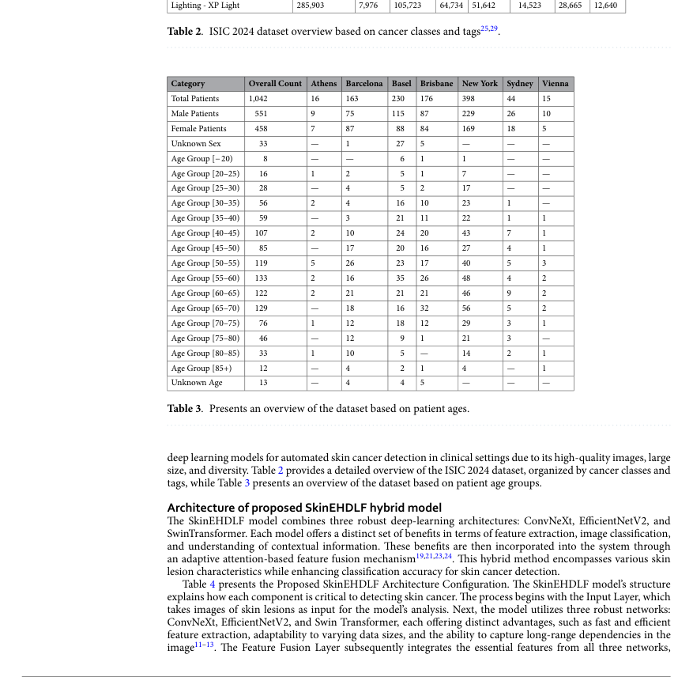

해석: 이 Table은 연구 설계와 모델/데이터 처리 흐름 범주의 정보를 표 형태로 정리한다. 비교 축과 수치는 해당 논문의 핵심 근거를 보강하며, 특히 ISIC 2024 기반 hybrid deep learning pipeline과 class imbalance 대응 실험 관련 내용을 비교해 읽는 기준이 된다. ISIC2024 연구에서는 극단적 class imbalance, augmentation, ensemble baseline을 비교할 때 참고할 수 있다.

**Table 4. 연구 설계와 모델/데이터 처리 흐름 요약**

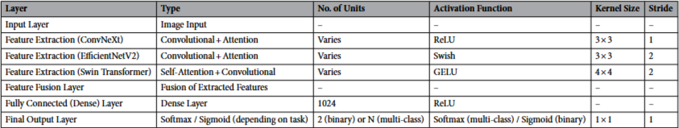

해석: 이 Table은 연구 설계와 모델/데이터 처리 흐름 범주의 정보를 표 형태로 정리한다. 비교 축과 수치는 해당 논문의 핵심 근거를 보강하며, 특히 ISIC 2024 기반 hybrid deep learning pipeline과 class imbalance 대응 실험 관련 내용을 비교해 읽는 기준이 된다. ISIC2024 연구에서는 극단적 class imbalance, augmentation, ensemble baseline을 비교할 때 참고할 수 있다.

**Figure 2. 연구 설계와 모델/데이터 처리 흐름**

해석: 이 Figure는 연구 설계와 모델/데이터 처리 흐름 범주를 시각적으로 보여준다. 원문 맥락에서는 해당 논문의 핵심 근거를 보강하는 자료이며, 특히 ISIC 2024 기반 hybrid deep learning pipeline과 class imbalance 대응 실험 관련 내용을 이해하는 데 도움이 된다. ISIC2024 연구에서는 극단적 class imbalance, augmentation, ensemble baseline을 비교할 때 참고할 수 있다.

**Table 5. 연구 설계와 모델/데이터 처리 흐름 요약**

해석: 이 Table은 연구 설계와 모델/데이터 처리 흐름 범주의 정보를 표 형태로 정리한다. 비교 축과 수치는 해당 논문의 핵심 근거를 보강하며, 특히 ISIC 2024 기반 hybrid deep learning pipeline과 class imbalance 대응 실험 관련 내용을 비교해 읽는 기준이 된다. ISIC2024 연구에서는 극단적 class imbalance, augmentation, ensemble baseline을 비교할 때 참고할 수 있다.

**Figure 3. 연구 설계와 모델/데이터 처리 흐름**

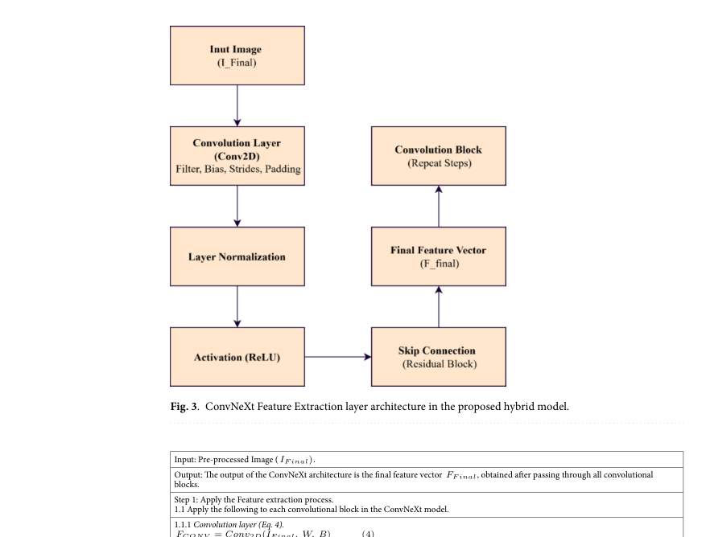

해석: 이 Figure는 연구 설계와 모델/데이터 처리 흐름 범주를 시각적으로 보여준다. 원문 맥락에서는 해당 논문의 핵심 근거를 보강하는 자료이며, 특히 ISIC 2024 기반 hybrid deep learning pipeline과 class imbalance 대응 실험 관련 내용을 이해하는 데 도움이 된다. ISIC2024 연구에서는 극단적 class imbalance, augmentation, ensemble baseline을 비교할 때 참고할 수 있다.

**Figure 4. 연구 설계와 모델/데이터 처리 흐름**

해석: 이 Figure는 연구 설계와 모델/데이터 처리 흐름 범주를 시각적으로 보여준다. 원문 맥락에서는 해당 논문의 핵심 근거를 보강하는 자료이며, 특히 ISIC 2024 기반 hybrid deep learning pipeline과 class imbalance 대응 실험 관련 내용을 이해하는 데 도움이 된다. ISIC2024 연구에서는 극단적 class imbalance, augmentation, ensemble baseline을 비교할 때 참고할 수 있다.

**Figure 5. 연구 설계와 모델/데이터 처리 흐름**

해석: 이 Figure는 연구 설계와 모델/데이터 처리 흐름 범주를 시각적으로 보여준다. 원문 맥락에서는 해당 논문의 핵심 근거를 보강하는 자료이며, 특히 ISIC 2024 기반 hybrid deep learning pipeline과 class imbalance 대응 실험 관련 내용을 이해하는 데 도움이 된다. ISIC2024 연구에서는 극단적 class imbalance, augmentation, ensemble baseline을 비교할 때 참고할 수 있다.

**Table 6. 연구 설계와 모델/데이터 처리 흐름 요약**

해석: 이 Table은 연구 설계와 모델/데이터 처리 흐름 범주의 정보를 표 형태로 정리한다. 비교 축과 수치는 해당 논문의 핵심 근거를 보강하며, 특히 ISIC 2024 기반 hybrid deep learning pipeline과 class imbalance 대응 실험 관련 내용을 비교해 읽는 기준이 된다. ISIC2024 연구에서는 극단적 class imbalance, augmentation, ensemble baseline을 비교할 때 참고할 수 있다.

**Table 7. 비교 항목과 핵심 수치 요약**

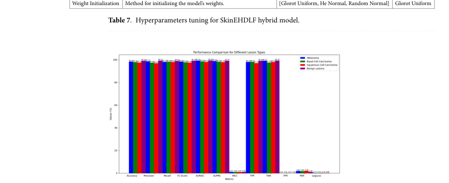

해석: 이 Table은 비교 항목과 핵심 수치 범주의 정보를 표 형태로 정리한다. 비교 축과 수치는 해당 논문의 핵심 근거를 보강하며, 특히 ISIC 2024 기반 hybrid deep learning pipeline과 class imbalance 대응 실험 관련 내용을 비교해 읽는 기준이 된다. ISIC2024 연구에서는 극단적 class imbalance, augmentation, ensemble baseline을 비교할 때 참고할 수 있다.

**Figure 6. 성능 비교와 정량 평가 결과**

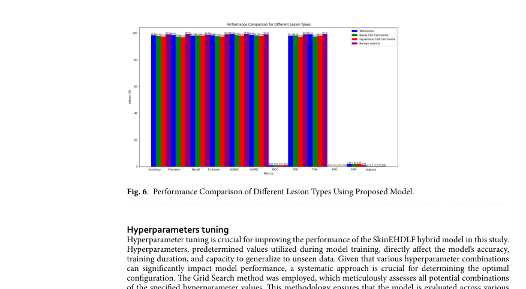

해석: 이 Figure는 성능 비교와 정량 평가 결과 범주를 시각적으로 보여준다. 원문 맥락에서는 해당 논문의 핵심 근거를 보강하는 자료이며, 특히 ISIC 2024 기반 hybrid deep learning pipeline과 class imbalance 대응 실험 관련 내용을 이해하는 데 도움이 된다. ISIC2024 연구에서는 극단적 class imbalance, augmentation, ensemble baseline을 비교할 때 참고할 수 있다.

**Table 8. 성능 비교와 정량 평가 결과 요약**

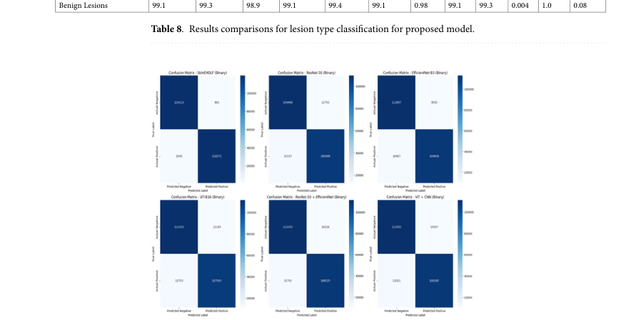

해석: 이 Table은 성능 비교와 정량 평가 결과 범주의 정보를 표 형태로 정리한다. 비교 축과 수치는 해당 논문의 핵심 근거를 보강하며, 특히 ISIC 2024 기반 hybrid deep learning pipeline과 class imbalance 대응 실험 관련 내용을 비교해 읽는 기준이 된다. ISIC2024 연구에서는 극단적 class imbalance, augmentation, ensemble baseline을 비교할 때 참고할 수 있다.

**Figure 7. 데이터 구성, 예시, 분포 특성**

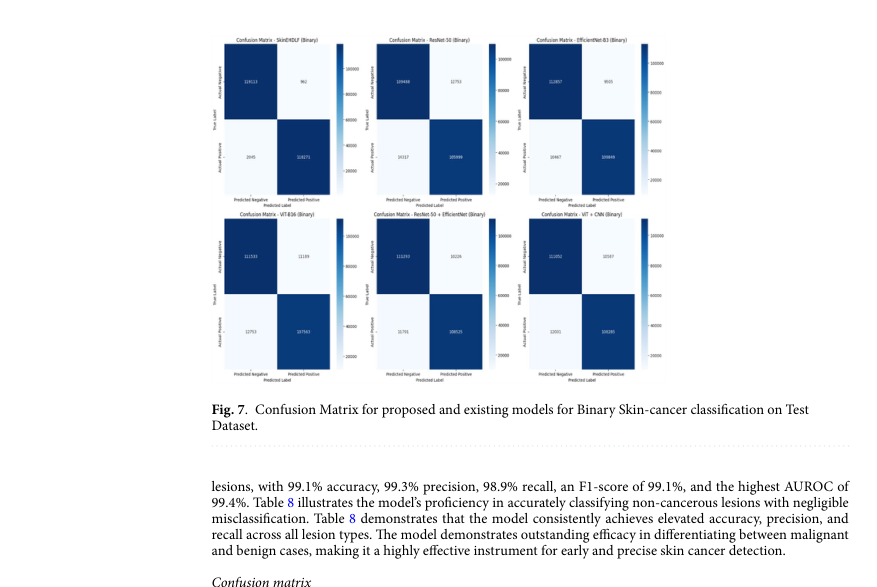

해석: 이 Figure는 데이터 구성, 예시, 분포 특성 범주를 시각적으로 보여준다. 원문 맥락에서는 해당 논문의 핵심 근거를 보강하는 자료이며, 특히 ISIC 2024 기반 hybrid deep learning pipeline과 class imbalance 대응 실험 관련 내용을 이해하는 데 도움이 된다. ISIC2024 연구에서는 극단적 class imbalance, augmentation, ensemble baseline을 비교할 때 참고할 수 있다.

**Table 9. 성능 비교와 정량 평가 결과 요약**

해석: 이 Table은 성능 비교와 정량 평가 결과 범주의 정보를 표 형태로 정리한다. 비교 축과 수치는 해당 논문의 핵심 근거를 보강하며, 특히 ISIC 2024 기반 hybrid deep learning pipeline과 class imbalance 대응 실험 관련 내용을 비교해 읽는 기준이 된다. ISIC2024 연구에서는 극단적 class imbalance, augmentation, ensemble baseline을 비교할 때 참고할 수 있다.

**Figure 8. 성능 비교와 정량 평가 결과**

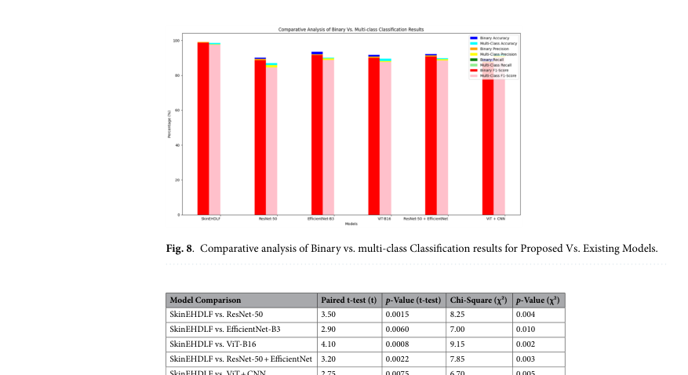

해석: 이 Figure는 성능 비교와 정량 평가 결과 범주를 시각적으로 보여준다. 원문 맥락에서는 해당 논문의 핵심 근거를 보강하는 자료이며, 특히 ISIC 2024 기반 hybrid deep learning pipeline과 class imbalance 대응 실험 관련 내용을 이해하는 데 도움이 된다. ISIC2024 연구에서는 극단적 class imbalance, augmentation, ensemble baseline을 비교할 때 참고할 수 있다.

**Table 10. 성능 비교와 정량 평가 결과 요약**

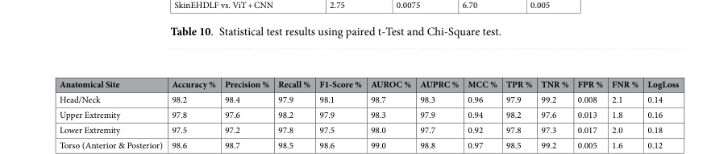

해석: 이 Table은 성능 비교와 정량 평가 결과 범주의 정보를 표 형태로 정리한다. 비교 축과 수치는 해당 논문의 핵심 근거를 보강하며, 특히 ISIC 2024 기반 hybrid deep learning pipeline과 class imbalance 대응 실험 관련 내용을 비교해 읽는 기준이 된다. ISIC2024 연구에서는 극단적 class imbalance, augmentation, ensemble baseline을 비교할 때 참고할 수 있다.

**Table 11. 성능 비교와 정량 평가 결과 요약**

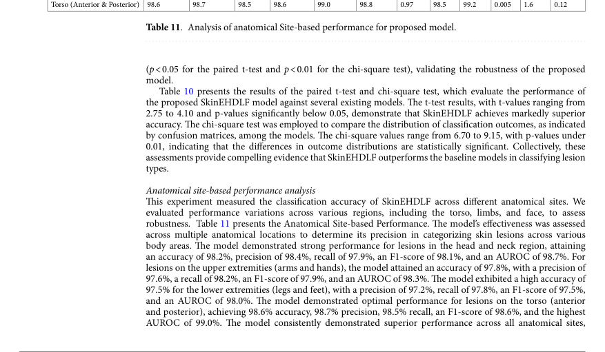

해석: 이 Table은 성능 비교와 정량 평가 결과 범주의 정보를 표 형태로 정리한다. 비교 축과 수치는 해당 논문의 핵심 근거를 보강하며, 특히 ISIC 2024 기반 hybrid deep learning pipeline과 class imbalance 대응 실험 관련 내용을 비교해 읽는 기준이 된다. ISIC2024 연구에서는 극단적 class imbalance, augmentation, ensemble baseline을 비교할 때 참고할 수 있다.

**Table 12. 데이터 구성, 예시, 분포 특성 요약**

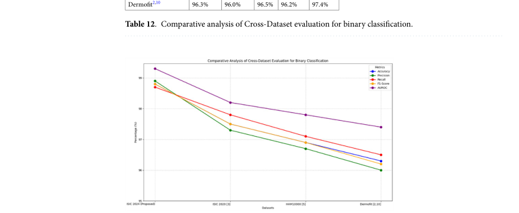

해석: 이 Table은 데이터 구성, 예시, 분포 특성 범주의 정보를 표 형태로 정리한다. 비교 축과 수치는 해당 논문의 핵심 근거를 보강하며, 특히 ISIC 2024 기반 hybrid deep learning pipeline과 class imbalance 대응 실험 관련 내용을 비교해 읽는 기준이 된다. ISIC2024 연구에서는 극단적 class imbalance, augmentation, ensemble baseline을 비교할 때 참고할 수 있다.

**Figure 9. 데이터 구성, 예시, 분포 특성**

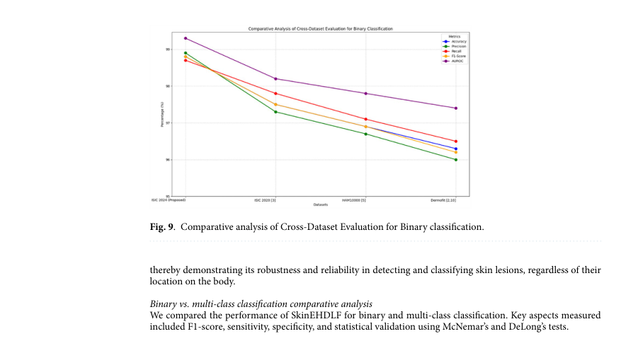

해석: 이 Figure는 데이터 구성, 예시, 분포 특성 범주를 시각적으로 보여준다. 원문 맥락에서는 해당 논문의 핵심 근거를 보강하는 자료이며, 특히 ISIC 2024 기반 hybrid deep learning pipeline과 class imbalance 대응 실험 관련 내용을 이해하는 데 도움이 된다. ISIC2024 연구에서는 극단적 class imbalance, augmentation, ensemble baseline을 비교할 때 참고할 수 있다.

**Table 12. 데이터 구성, 예시, 분포 특성 요약**

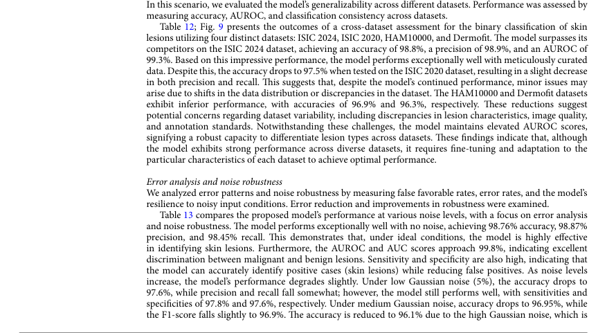

해석: 이 Table은 데이터 구성, 예시, 분포 특성 범주의 정보를 표 형태로 정리한다. 비교 축과 수치는 해당 논문의 핵심 근거를 보강하며, 특히 ISIC 2024 기반 hybrid deep learning pipeline과 class imbalance 대응 실험 관련 내용을 비교해 읽는 기준이 된다. ISIC2024 연구에서는 극단적 class imbalance, augmentation, ensemble baseline을 비교할 때 참고할 수 있다.

**Table 13. 성능 비교와 정량 평가 결과 요약**

해석: 이 Table은 성능 비교와 정량 평가 결과 범주의 정보를 표 형태로 정리한다. 비교 축과 수치는 해당 논문의 핵심 근거를 보강하며, 특히 ISIC 2024 기반 hybrid deep learning pipeline과 class imbalance 대응 실험 관련 내용을 비교해 읽는 기준이 된다. ISIC2024 연구에서는 극단적 class imbalance, augmentation, ensemble baseline을 비교할 때 참고할 수 있다.

**Table 14. 성능 비교와 정량 평가 결과 요약**

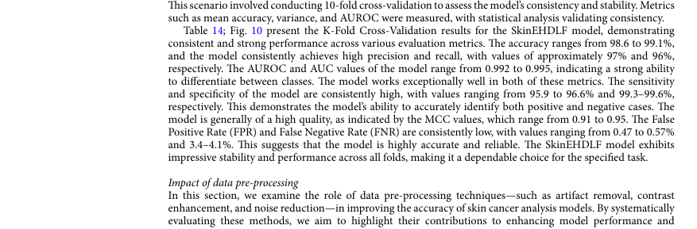

해석: 이 Table은 성능 비교와 정량 평가 결과 범주의 정보를 표 형태로 정리한다. 비교 축과 수치는 해당 논문의 핵심 근거를 보강하며, 특히 ISIC 2024 기반 hybrid deep learning pipeline과 class imbalance 대응 실험 관련 내용을 비교해 읽는 기준이 된다. ISIC2024 연구에서는 극단적 class imbalance, augmentation, ensemble baseline을 비교할 때 참고할 수 있다.

**Table 15. 데이터 구성, 예시, 분포 특성 요약**

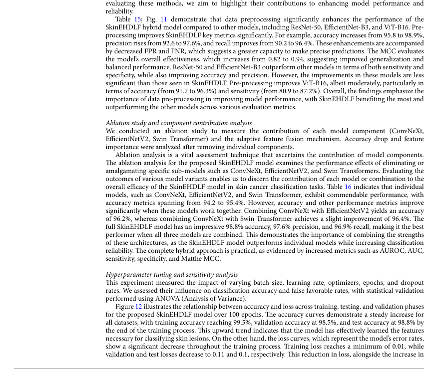

해석: 이 Table은 데이터 구성, 예시, 분포 특성 범주의 정보를 표 형태로 정리한다. 비교 축과 수치는 해당 논문의 핵심 근거를 보강하며, 특히 ISIC 2024 기반 hybrid deep learning pipeline과 class imbalance 대응 실험 관련 내용을 비교해 읽는 기준이 된다. ISIC2024 연구에서는 극단적 class imbalance, augmentation, ensemble baseline을 비교할 때 참고할 수 있다.

**Table 14. 성능 비교와 정량 평가 결과 요약**

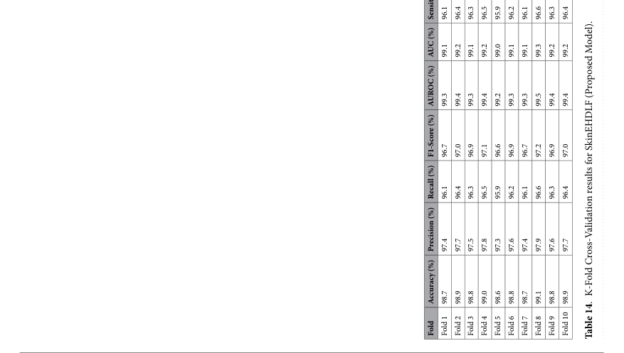

해석: 이 Table은 성능 비교와 정량 평가 결과 범주의 정보를 표 형태로 정리한다. 비교 축과 수치는 해당 논문의 핵심 근거를 보강하며, 특히 ISIC 2024 기반 hybrid deep learning pipeline과 class imbalance 대응 실험 관련 내용을 비교해 읽는 기준이 된다. ISIC2024 연구에서는 극단적 class imbalance, augmentation, ensemble baseline을 비교할 때 참고할 수 있다.

**Figure 10. 성능 비교와 정량 평가 결과**

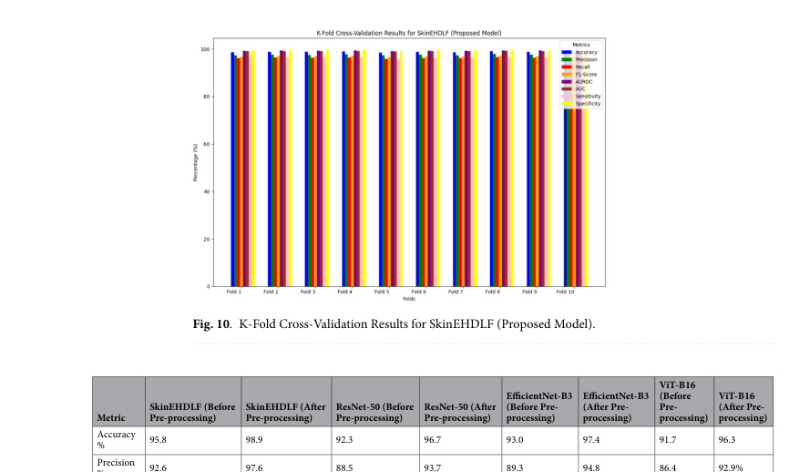

해석: 이 Figure는 성능 비교와 정량 평가 결과 범주를 시각적으로 보여준다. 원문 맥락에서는 해당 논문의 핵심 근거를 보강하는 자료이며, 특히 ISIC 2024 기반 hybrid deep learning pipeline과 class imbalance 대응 실험 관련 내용을 이해하는 데 도움이 된다. ISIC2024 연구에서는 극단적 class imbalance, augmentation, ensemble baseline을 비교할 때 참고할 수 있다.

**Table 15. 데이터 구성, 예시, 분포 특성 요약**

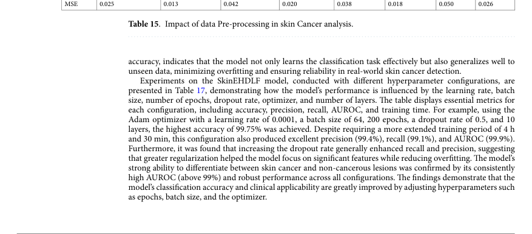

해석: 이 Table은 데이터 구성, 예시, 분포 특성 범주의 정보를 표 형태로 정리한다. 비교 축과 수치는 해당 논문의 핵심 근거를 보강하며, 특히 ISIC 2024 기반 hybrid deep learning pipeline과 class imbalance 대응 실험 관련 내용을 비교해 읽는 기준이 된다. ISIC2024 연구에서는 극단적 class imbalance, augmentation, ensemble baseline을 비교할 때 참고할 수 있다.

**Figure 11. 데이터 구성, 예시, 분포 특성**

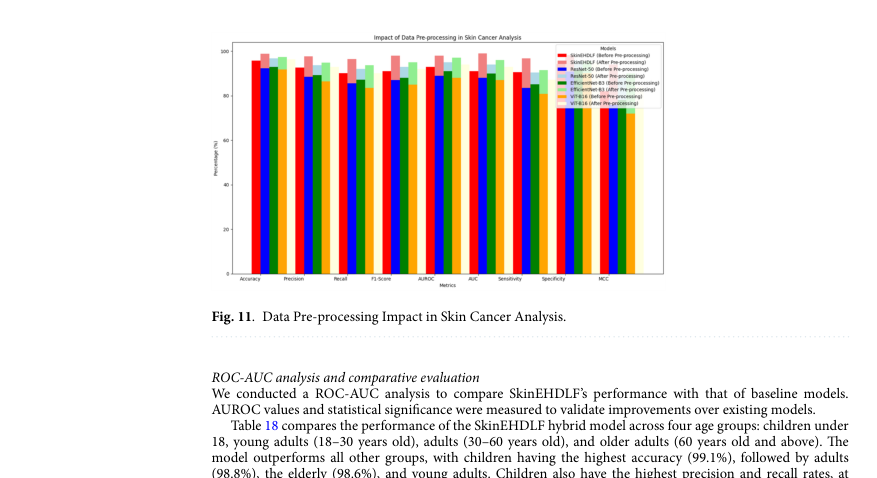

해석: 이 Figure는 데이터 구성, 예시, 분포 특성 범주를 시각적으로 보여준다. 원문 맥락에서는 해당 논문의 핵심 근거를 보강하는 자료이며, 특히 ISIC 2024 기반 hybrid deep learning pipeline과 class imbalance 대응 실험 관련 내용을 이해하는 데 도움이 된다. ISIC2024 연구에서는 극단적 class imbalance, augmentation, ensemble baseline을 비교할 때 참고할 수 있다.

**Table 19. 성능 비교와 정량 평가 결과 요약**

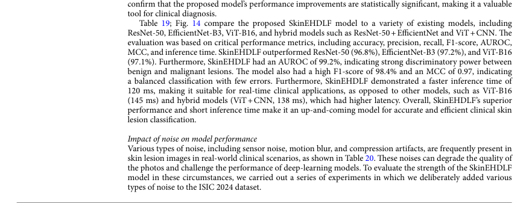

해석: 이 Table은 성능 비교와 정량 평가 결과 범주의 정보를 표 형태로 정리한다. 비교 축과 수치는 해당 논문의 핵심 근거를 보강하며, 특히 ISIC 2024 기반 hybrid deep learning pipeline과 class imbalance 대응 실험 관련 내용을 비교해 읽는 기준이 된다. ISIC2024 연구에서는 극단적 class imbalance, augmentation, ensemble baseline을 비교할 때 참고할 수 있다.

**Table 16. 성능 비교와 정량 평가 결과 요약**

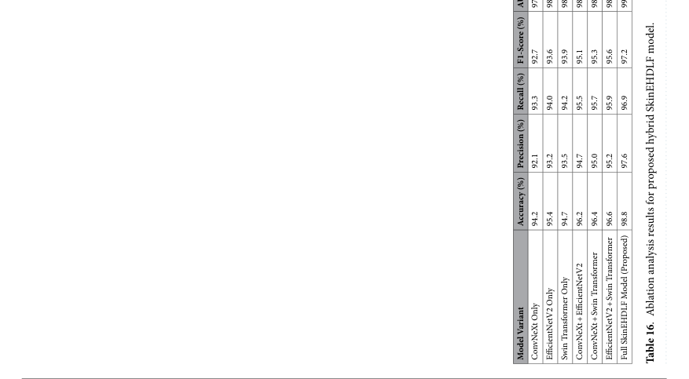

해석: 이 Table은 성능 비교와 정량 평가 결과 범주의 정보를 표 형태로 정리한다. 비교 축과 수치는 해당 논문의 핵심 근거를 보강하며, 특히 ISIC 2024 기반 hybrid deep learning pipeline과 class imbalance 대응 실험 관련 내용을 비교해 읽는 기준이 된다. ISIC2024 연구에서는 극단적 class imbalance, augmentation, ensemble baseline을 비교할 때 참고할 수 있다.

**Figure 12. 성능 비교와 정량 평가 결과**

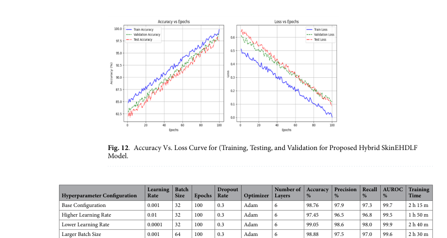

해석: 이 Figure는 성능 비교와 정량 평가 결과 범주를 시각적으로 보여준다. 원문 맥락에서는 해당 논문의 핵심 근거를 보강하는 자료이며, 특히 ISIC 2024 기반 hybrid deep learning pipeline과 class imbalance 대응 실험 관련 내용을 이해하는 데 도움이 된다. ISIC2024 연구에서는 극단적 class imbalance, augmentation, ensemble baseline을 비교할 때 참고할 수 있다.

**Table 17. 성능 비교와 정량 평가 결과 요약**

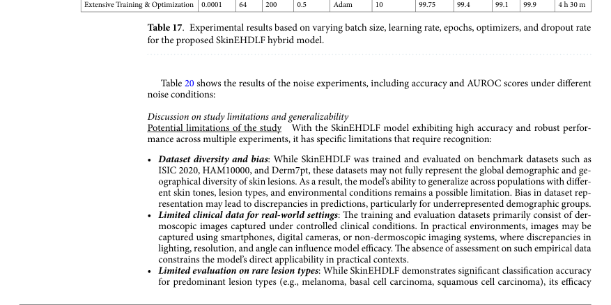

해석: 이 Table은 성능 비교와 정량 평가 결과 범주의 정보를 표 형태로 정리한다. 비교 축과 수치는 해당 논문의 핵심 근거를 보강하며, 특히 ISIC 2024 기반 hybrid deep learning pipeline과 class imbalance 대응 실험 관련 내용을 비교해 읽는 기준이 된다. ISIC2024 연구에서는 극단적 class imbalance, augmentation, ensemble baseline을 비교할 때 참고할 수 있다.

**Table 18. 비교 항목과 핵심 수치 요약**

해석: 이 Table은 비교 항목과 핵심 수치 범주의 정보를 표 형태로 정리한다. 비교 축과 수치는 해당 논문의 핵심 근거를 보강하며, 특히 ISIC 2024 기반 hybrid deep learning pipeline과 class imbalance 대응 실험 관련 내용을 비교해 읽는 기준이 된다. ISIC2024 연구에서는 극단적 class imbalance, augmentation, ensemble baseline을 비교할 때 참고할 수 있다.

**Figure 13. 성능 비교와 정량 평가 결과**

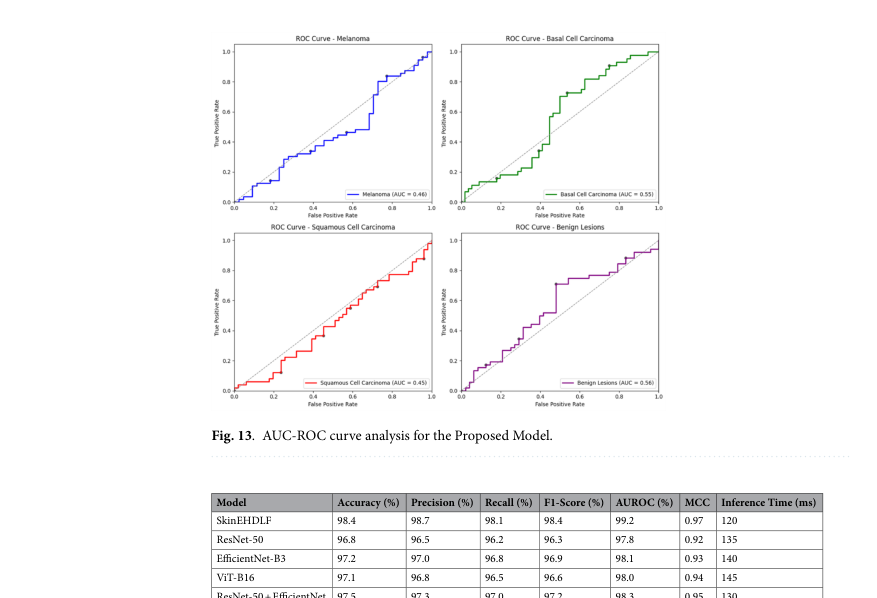

해석: 이 Figure는 성능 비교와 정량 평가 결과 범주를 시각적으로 보여준다. 원문 맥락에서는 해당 논문의 핵심 근거를 보강하는 자료이며, 특히 ISIC 2024 기반 hybrid deep learning pipeline과 class imbalance 대응 실험 관련 내용을 이해하는 데 도움이 된다. ISIC2024 연구에서는 극단적 class imbalance, augmentation, ensemble baseline을 비교할 때 참고할 수 있다.

**Table 19. 성능 비교와 정량 평가 결과 요약**

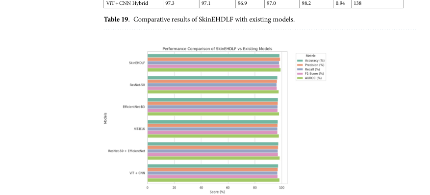

해석: 이 Table은 성능 비교와 정량 평가 결과 범주의 정보를 표 형태로 정리한다. 비교 축과 수치는 해당 논문의 핵심 근거를 보강하며, 특히 ISIC 2024 기반 hybrid deep learning pipeline과 class imbalance 대응 실험 관련 내용을 비교해 읽는 기준이 된다. ISIC2024 연구에서는 극단적 class imbalance, augmentation, ensemble baseline을 비교할 때 참고할 수 있다.

**Figure 14. 성능 비교와 정량 평가 결과**

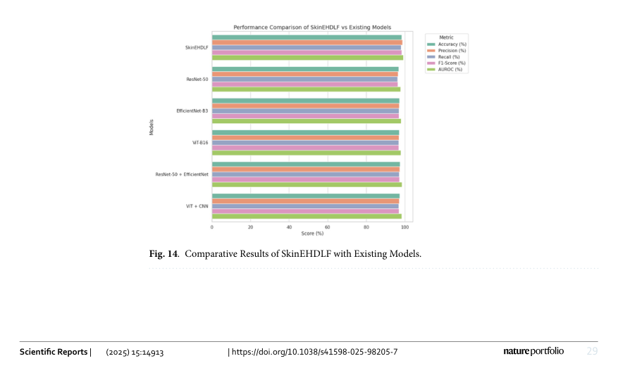

해석: 이 Figure는 성능 비교와 정량 평가 결과 범주를 시각적으로 보여준다. 원문 맥락에서는 해당 논문의 핵심 근거를 보강하는 자료이며, 특히 ISIC 2024 기반 hybrid deep learning pipeline과 class imbalance 대응 실험 관련 내용을 이해하는 데 도움이 된다. ISIC2024 연구에서는 극단적 class imbalance, augmentation, ensemble baseline을 비교할 때 참고할 수 있다.

**Table 20. 성능 비교와 정량 평가 결과 요약**

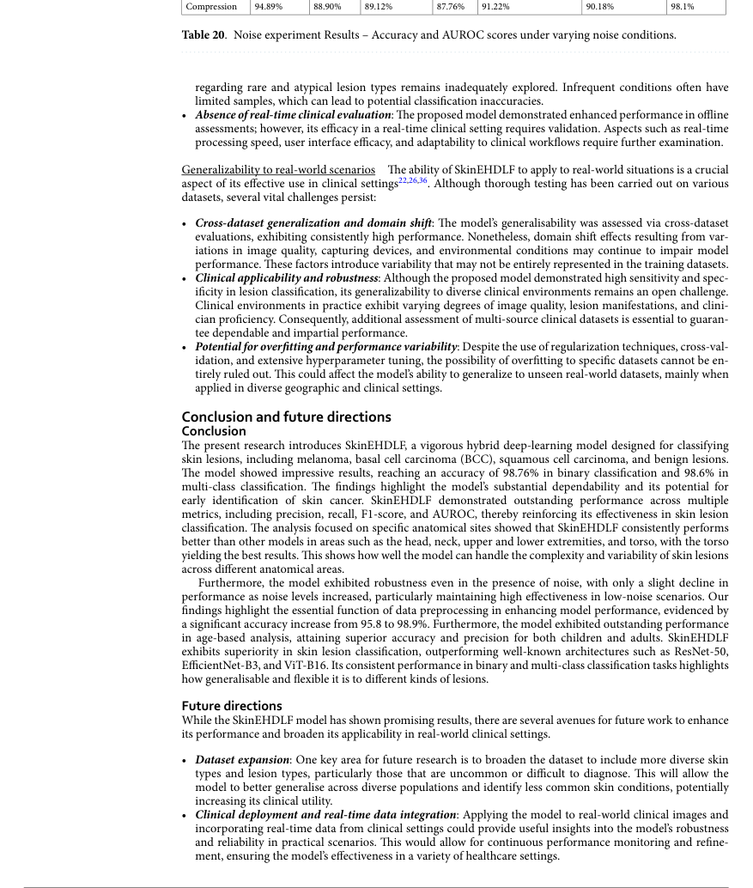

해석: 이 Table은 성능 비교와 정량 평가 결과 범주의 정보를 표 형태로 정리한다. 비교 축과 수치는 해당 논문의 핵심 근거를 보강하며, 특히 ISIC 2024 기반 hybrid deep learning pipeline과 class imbalance 대응 실험 관련 내용을 비교해 읽는 기준이 된다. ISIC2024 연구에서는 극단적 class imbalance, augmentation, ensemble baseline을 비교할 때 참고할 수 있다.

## 우리 연구에서의 위치

ISIC 2024 image 기반 hybrid ensemble 모델의 최신 참고 논문이다. ConvNeXt, EfficientNetV2, Swin Transformer를 결합하고 class-weighted loss를 사용하므로 image branch baseline, ensemble, imbalance handling 논의에 활용할 수 있다.

---

## 목표와 기여

SkinEHDLF는 ConvNeXt, EfficientNetV2, Swin Transformer를 결합해 피부암 binary 및 multi-class classification 성능을 높이는 hybrid deep learning framework를 제안한다. local feature, scalable feature, long-range context를 서로 다른 backbone에서 추출한 뒤 attention-based feature fusion으로 통합하는 것이 핵심이다.

## Dataset 정보

- Dataset: ISIC 2024 3D total-body photography 기반 skin lesion image
- Sample 규모: ISIC 2024 전체 401,059개 image를 기반으로 설명
- Task: binary classification 및 multi-class classification
- Metadata: age, gender, ethnicity 등 dataset 특성은 언급되지만 모델 입력으로 명확히 사용되지는 않는다.

## Imbalance 처리

underrepresented class에 더 큰 weight를 주는 class-weighted loss를 사용한다. rotation, crop, flip, color jitter, Gaussian noise 등 image augmentation도 함께 적용한다.

## Tabular model

별도 tabular model은 없다. 논문에서 demographics가 dataset 특성으로 언급되지만, 모델 구조는 image feature ensemble 중심으로 해석하는 것이 안전하다.

## Image model

- ConvNeXt: local pattern과 texture feature 추출
- EfficientNetV2: scalable image representation 추출
- Swin Transformer: long-range context와 hierarchical representation 학습

## Fusion 방식

세 backbone에서 나온 feature를 adaptive attention-based feature fusion으로 결합한다. 이는 image-image ensemble fusion이지, ISIC 2024 metadata를 포함한 image-tabular fusion은 아니다.

## 평가 지표

accuracy, precision, recall, F1-score, AUROC, AUC, sensitivity, specificity, MCC, FPR/FNR을 사용한다.

## 평가 결과

binary classification에서 AUROC 99.8%, accuracy 98.76%를 보고하고, multi-class classification에서도 매우 높은 accuracy와 AUROC를 보고한다.

## ISIC2024 연구 시사점

- image branch에서 CNN과 transformer를 결합하는 ensemble baseline의 근거로 사용할 수 있다.
- class-weighted loss와 augmentation은 ISIC 2024 imbalance handling의 비교 항목으로 삼을 수 있다.
- metadata fusion 논문은 아니므로 multimodal fusion 근거로는 제한적이다.

## 추가 논의/주의점

- 매우 높은 accuracy 수치는 original ISIC 2024 pAUC challenge setting과 직접 비교하면 안 된다.
- split protocol, patient-level separation, malignant prevalence 유지 여부를 확인해야 한다.
- 우리 연구에서는 high-sensitivity pAUC, recall, specificity tradeoff 중심으로 재해석하는 것이 좋다.

---

[메인 문서로 돌아가기](../2026-05-18_dermatology_ai_literature_review.md#3-주요-논문별-상세-분석)
