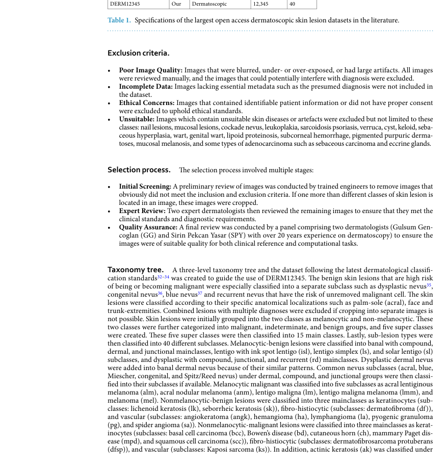
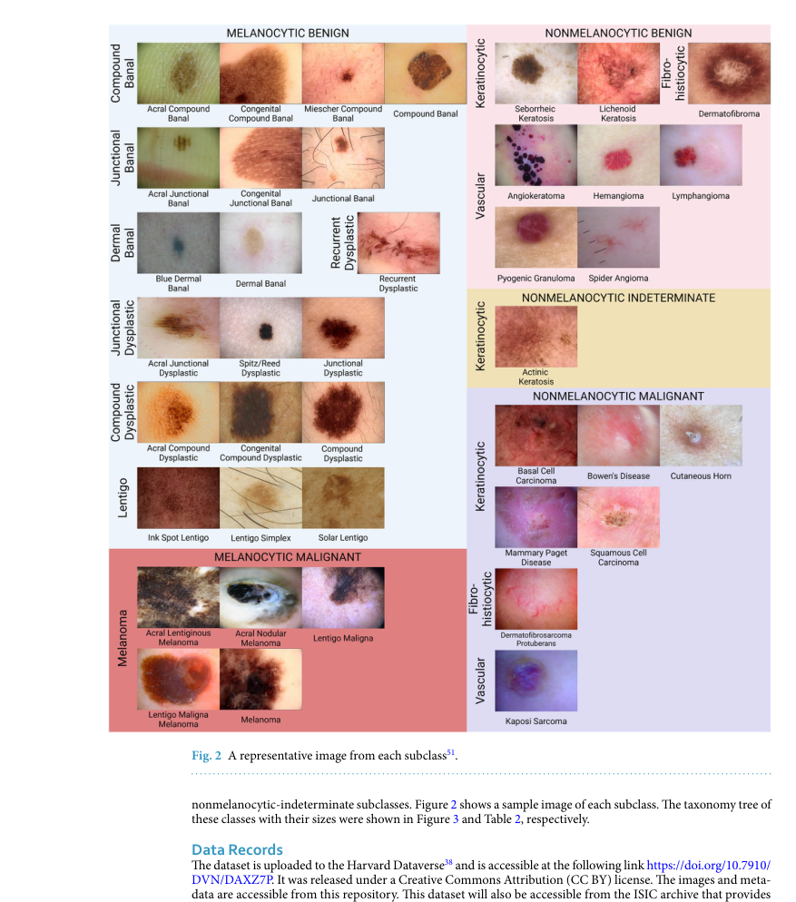
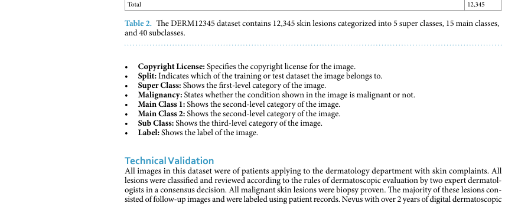

# DERM12345: A Large, Multisource Dermatoscopic Skin Lesion Dataset with 40 Subclasses

## 출처/링크

출처: Scientific Data, 2024  
DOI: `10.1038/s41597-024-04104-3`  
Google Scholar 인용: 33회 (조회일: 2026-05-20, `DERM12345: A Large, Multisource Dermatoscopic Skin Lesion Dataset with 40 Subclasses` 제목 기준)  
PDF: [s41597-024-04104-3.pdf](../paper/s41597-024-04104-3.pdf)

## 주요 Figure 및 Table

원문 PDF의 본문 Figure/Table을 번호 단위로 추출해 로컬 asset으로 저장했다. Caption은 길게 옮기지 않고, 각 항목이 보여주는 내용과 ISIC2024 연구 관점의 의미를 한국어로 의역해 정리했다.

**Figure 1. 연구 설계와 모델/데이터 처리 흐름**

해석: 이 Figure는 연구 설계와 모델/데이터 처리 흐름 범주를 시각적으로 보여준다. 원문 맥락에서는 해당 논문의 핵심 근거를 보강하는 자료이며, 특히 DERM12345의 수집 절차, taxonomy, class 구성과 공개 dermoscopy dataset 특성 관련 내용을 이해하는 데 도움이 된다. ISIC2024 연구에서는 ISIC 계열 데이터와 외부 dermoscopy dataset의 class granularity 차이를 설명할 때 사용할 수 있다.

**Table 1. 데이터 구성, 예시, 분포 특성 요약**

해석: 이 Table은 데이터 구성, 예시, 분포 특성 범주의 정보를 표 형태로 정리한다. 비교 축과 수치는 해당 논문의 핵심 근거를 보강하며, 특히 DERM12345의 수집 절차, taxonomy, class 구성과 공개 dermoscopy dataset 특성 관련 내용을 비교해 읽는 기준이 된다. ISIC2024 연구에서는 ISIC 계열 데이터와 외부 dermoscopy dataset의 class granularity 차이를 설명할 때 사용할 수 있다.

**Figure 2. 논문 주장에 필요한 핵심 시각 자료**

해석: 이 Figure는 논문 주장에 필요한 핵심 시각 자료 범주를 시각적으로 보여준다. 원문 맥락에서는 해당 논문의 핵심 근거를 보강하는 자료이며, 특히 DERM12345의 수집 절차, taxonomy, class 구성과 공개 dermoscopy dataset 특성 관련 내용을 이해하는 데 도움이 된다. ISIC2024 연구에서는 ISIC 계열 데이터와 외부 dermoscopy dataset의 class granularity 차이를 설명할 때 사용할 수 있다.

**Figure 3. 연구 설계와 모델/데이터 처리 흐름**

해석: 이 Figure는 연구 설계와 모델/데이터 처리 흐름 범주를 시각적으로 보여준다. 원문 맥락에서는 해당 논문의 핵심 근거를 보강하는 자료이며, 특히 DERM12345의 수집 절차, taxonomy, class 구성과 공개 dermoscopy dataset 특성 관련 내용을 이해하는 데 도움이 된다. ISIC2024 연구에서는 ISIC 계열 데이터와 외부 dermoscopy dataset의 class granularity 차이를 설명할 때 사용할 수 있다.

**Table 2. 데이터 구성, 예시, 분포 특성 요약**

해석: 이 Table은 데이터 구성, 예시, 분포 특성 범주의 정보를 표 형태로 정리한다. 비교 축과 수치는 해당 논문의 핵심 근거를 보강하며, 특히 DERM12345의 수집 절차, taxonomy, class 구성과 공개 dermoscopy dataset 특성 관련 내용을 비교해 읽는 기준이 된다. ISIC2024 연구에서는 ISIC 계열 데이터와 외부 dermoscopy dataset의 class granularity 차이를 설명할 때 사용할 수 있다.

---

## 목표와 기여

기존 공개 dermoscopy dataset이 세부 subclass를 충분히 제공하지 못한다는 문제를 보완하기 위해 40개 subclass를 갖는 대규모 dermatoscopic skin lesion dataset을 공개한다.

## Dataset 정보

- 수집 기관: Türkiye 3개 기관
- 기간: 2008-2021년
- 규모: 1,627명 환자, 12,345개의 고해상도 피부경 이미지
- Label taxonomy: 5개의 상위 클래스, 15개의 주요 클래스, 40개의 하위 클래스(40개의 피부 병변 세부 분류)

## Imbalance 처리

patient-level 80/20 train/test split과 class balancing 고려를 명시한다. baseline 학습에는 augmentation을 적용한다. 논문의 핵심은 imbalance algorithm보다 세분화된 class taxonomy와 dataset 공개이다.

## Tabular model

별도 tabular model은 없다. file name, lesion class, taxonomic label을 담은 CSV metadata를 제공한다.

## Image model

baseline으로 ImageNet pretrained ResNet50, Xception, InceptionResNetV2를 fine-tuning한다.

## Fusion 방식

단일 dermoscopic image classification dataset이므로 image-tabular fusion 또는 multimodal fusion은 없다.

## 평가 지표

weighted accuracy와 dermatologist consensus/biopsy validation을 중심으로 dataset quality와 baseline difficulty를 제시한다.

## 평가 결과

baseline weighted accuracy는 ResNet50 0.50, Xception 0.59, InceptionResNetV2 0.58로 보고된다. 낮은 baseline 성능은 40 subclass fine-grained classification의 난도를 보여준다.

## ISIC2024 연구 시사점

- ISIC 2024 binary target은 실제 dermatology diagnosis taxonomy를 강하게 축약한다는 점을 설명할 수 있다.
- subtype diversity가 부족하면 malignant/benign 성능만으로 임상 적용 가능성을 판단하기 어렵다.
- external dermoscopy dataset이므로 train-only 실험에는 직접 포함하지 않고 related work 또는 discussion에서 활용하는 것이 적절하다.

## 추가 논의/주의점

- Dermoscopy image dataset이므로 3D-TBP tile과 image distribution이 다르다.
- fine-grained taxonomy는 유용하지만 ISIC 2024의 target label과 직접 매핑되지 않는다.
- baseline accuracy가 낮다는 점을 dataset 난도 근거로 사용할 수 있다.

---

[메인 문서로 돌아가기](../2026-05-18_dermatology_ai_literature_review.md#3-주요-논문별-상세-분석)
