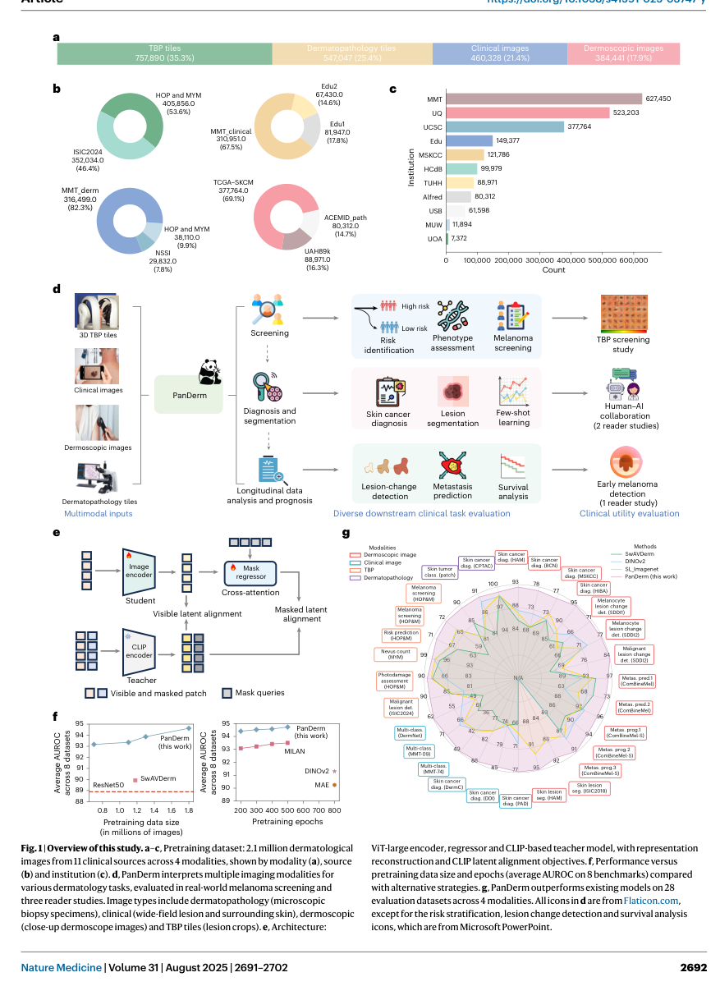
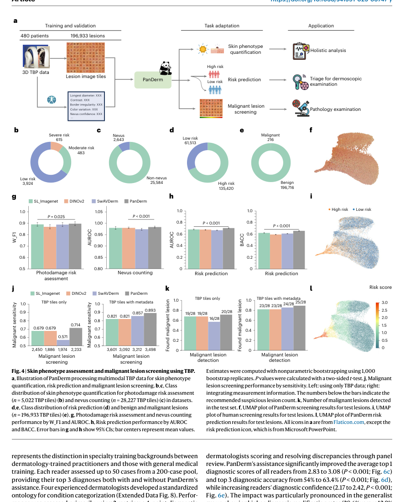
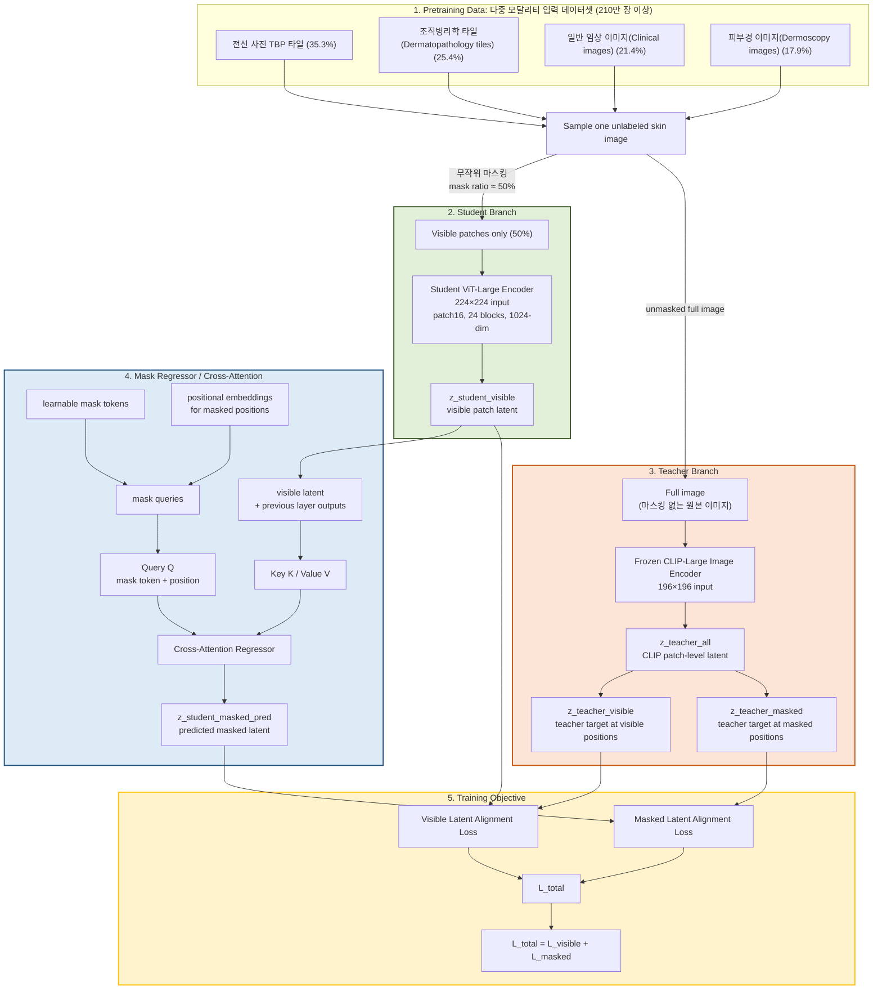
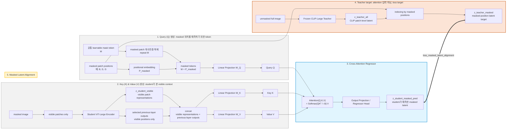

# A Multimodal Vision Foundation Model for Clinical Dermatology

## 출처/링크

우선 인용 버전: Nature Medicine published version, 2025  
Published title: `A multimodal vision foundation model for clinical dermatology`  
Published DOI: `10.1038/s41591-025-03747-y`  
Google Scholar 인용: 140회 (조회일: 2026-05-20, published title 기준)  
Published PDF: [s41591-025-03747-y-1.pdf](../paper/s41591-025-03747-y-1.pdf)  
참고 preprint PDF: [33499_A_General_Purpose_Multim.pdf](../paper/33499_A_General_Purpose_Multim.pdf) (`A General-Purpose Multimodal Foundation Model for Dermatology`, arXiv v1, DOI `10.48550/arXiv.2410.15038`)

## 주요 Figure 및 Table

### Figure 1. PanDerm 전체 개요

* a. Pretraining dataset의 modality 구성
* b. Modality별 세부 dataset 구성
* c. 기관별 데이터 분포
* **d. PanDerm의 downstream clinical task evaluation 개요**
    1. Screening
       - TBP 기반 screening task.
       - 세부 task: Risk identification, Phenotype assessment(형질 평가), Melanoma screening
       - 최종적으로: TBP screening study
* **e. PanDerm pretraining architecture: CLIP semantic latent를 복원하는 masked latent distillation 구조**
* f. Pretraining data size와 epoch에 따른 성능 변화
* **g. PanDerm과 baseline model들의 전체 benchmark 비교: 다양한 modality와 다양한 clinical task에서 전반적으로 강한 성능**



### Figure 4. TBP 기반 피부 phenotype 평가 및 악성 병변 screening

- a. 전체 TBP pipeline
    - 입력: 3D TBP data, lesion image tiles, metadata.
    - PanDerm을 통해 세 가지 task 수행:
    - skin phenotype quantification(피부 표현형 정량화)
    - risk prediction
    - malignant lesion screening
- b~f. dataset 설명
- g~l. 성능
- PanDerm 이 가장 높은 성능. 위험도 구분 가능



---

## 목표와 기여

기여: 피부과를 넘어 다른 의료 분야에서도 "전문화된 파운데이션 모델(Specialty-specific foundation model)"이 어떻게 개발되고 검증되어야 하는지에 대한 표준 프레임워크를 제공
1. 대규모 멀티모달 데이터셋 구축 및 학습
    - 11개 기관에서 수집한 200만 개 이상의 이미지와 4가지 영상 양식(TBP, 임상, 확대경, 병리 사진)을 결합한 규모의 데이터셋 사용
2. [강력한 범용성 및 데이터 효율성 (Label Efficiency) 증명](../paper/assets/3_1_panderm_foundation_model/extended_data_figure_2.png)
    - 레이블이 있는 데이터를 10%만 사용하고도 28개의 벤치마크에서 모두 SOTA 달성
3. [실질적인 임상적 유용성 입증 (Reader Studies)](../paper/assets/3_1_panderm_foundation_model/figure_6.png)
    - 조기 발견: 조기 흑색종 발견 성능에서 임상의를 10.2% 앞지름
    - 협업 효과: 비전문의의 감별 진단 능력을 16.5% 향상
4. [예후 및 생존 예측으로의 확장](../paper/assets/3_1_panderm_foundation_model/figure_3.png)
    - 단순한 현재 상태 진단을 넘어, 이미지 분석만으로 흑색종의 재발 및 전이 위험을 예측하고 생존 분석(Kaplan-Meier, Cox regression)까지 연결하는 새로운 임상적 가능성을 제시

## Dataset 정보

- 사전학습(Pretraining): 11개 기관, 4개 modality, 2,149,706개 unlabeled skin image
- Modality
  - 전신 사진 타일 (TBP tiles): 757,890개 (35.3%) - 3D 전신 촬영 장비(Vectra WB360)에서 추출된 개별 병변 이미지
  - 피부 병리 타일 (Dermatopathology tiles): 537,047개 (25.4%) - 현미경을 통해 촬영된 조직 생검 이미지(WSI)의 패치
  - 임상 사진 (Clinical images): 460,328개 (21.4%) - 일반 카메라나 스마트폰으로 촬영한 병변 및 주변부 사진
  - 확대경 이미지 (Dermoscopic images): 384,441개 (17.9%) - 더모스코프를 사용하여 피부 표면과 하부 구조를 확대한 정밀 이미지
- Downstream 평가: 28개 dataset
- TBP screening 실험
  - malignant 216개와 benign 197,716개를 포함하는 극단적 imbalance setting. 
  - 32가지 features 사용: 
‘A’, ‘Aext’, ‘B’, ‘Bext’, ‘C’, ‘Cext’, ‘H’, ‘Hext’, ‘L’, ‘Lext’, ‘areaMM2’,
‘area_perim_ratio’, ‘color_std_mean’, ‘deltaA’, ‘deltaB’, ‘deltaL’, ‘deltaLB’,
‘deltaLBnorm’, ‘dnn_lesion_confidence’, ‘eccentricity’, ‘location_simple’,
‘majorAxisMM’, ‘minorAxisMM’, ‘nevi_confidence’, ‘norm_border’,
‘norm_color’, ‘perimeterMM’, ‘radial_color_std_max’, ‘stdL’, ‘stdLExt’,
‘symm_2axis’ and ‘symm_2axis_angle’.

## Imbalance 처리

1. 자체 지도 학습 (Self-Supervised Pretraining): 200만 개의 방대한 이미지
2. 멀티모달 정보 결합 (Metadata Fusion): 이미지 정보만으로는 판단이 어려운 희귀 사례나 불균형 문제를 임상 데이터(Metadata)와의 결합으로 보완
3. 손실 함수 및 가중치 조절 (Loss Function):  클래스별 빈도 차이를 보정하기 위해 가중치 기반 무작위 샘플러(Weighted random sampler) 전략을 사용하여 학습 시 소수 클래스(예: 흑색종)가 충분히 노출되도록 함
- TBP screening 실험: data argument including color and geometric transformations.

## Tabular model

Extra Tree Classifier 사용: 악성 여부 직접 예측

## Image model

```text
Unlabeled image
   ├─ Student: masked image → visible patches → ViT-L → z_student_visible
   │                                      └→ mask regressor + mask tokens
   │                                             → z_student_masked_pred
   │
   └─ Teacher: unmasked image → frozen CLIP-Large → z_teacher_all
                                              ├→ z_teacher_visible
                                              └→ z_teacher_masked

Loss =
  align(z_student_visible, z_teacher_visible)
+ align(z_student_masked_pred, z_teacher_masked)
```

- Teacher: CLIP-Large, 원본 이미지 전체를 보고 학생이 따라가야 할 '정답 지표(지도 신호)'를 만드는 역할
  - 입력 (Input): 마스킹되지 않은 원본 이미지 (약간 작은 $196 \times 196$ 픽셀 크기로 리사이즈됨)
  - 출력 (Output): 전체 이미지의 잠재 표현 (CLIP Latent Representations)
    - 이 출력은 패치 위치에 따라 '가시적 패치 영역'과 '마스크된 패치 영역'의 정답지(Supervision signals)로 분할되어 사용 됨
- Student: ViT-Large 시각 인코더, 이미지의 일부분만 보고도 전체를 유추할 수 있도록 훈련되는 핵심 인코더
  - 입력 (Input): 가시적 패치 (Visible Patches)만 입력 ($224 \times 224$ 픽셀 원본 이미지에서 50%의 영역을 가린 후, 남은 50%의 보이는 부분만 입력)
  - 출력 (Output): 가시적 잠재 표현 (Visible Latent Representations)
    - 보이는 부분만 가지고 해석한 특징 벡터(Embedding)입니다. 이 출력은 교사의 가시적 영역 출력과 직접 비교되어 정렬(Alignment) 됨
- Cross-Attention: 마스크 회귀기, 보이는 부분(학생의 출력)을 힌트 삼아, 가려진 부분(마스크)에 무엇이 있었을지 추론하는 연결고리
  - 입력 (Input):
    - 쿼리 (Query): 학습 가능한 마스크 토큰 (Learnable Mask Tokens - 가려진 영역의 위치 정보)
    - 키 & 값 (Key & Value): 가시적 패치 표현(학생의 출력) $+$ 이전 레이어의 출력들을 결합(Concatenation)한 값
  - 출력 (Output):
    - 마스크된 패치의 잠재 표현 예측값 (Predicted Latent Representations of Masked Patches)
    - "주변에 이런 게 보이니, 가려진 미지의 영역($Q$)에는 이런 특징이 있을 것이다"라고 예측한 결과물입니다. 이 출력은 교사의 마스크 영역 출력과 비교되어 손실 함수를 계산합니다.





## Fusion 방식

decision-level late fusion / OR-rule fusion

1. Image branch A: Risk prediction head
   - image: TBP lesion tile 입력
   1. PanDerm encoder fine-tuning
   2. single linear layer
   3. high risk / low risk 분류

2. Image branch B: UD detection head
   - image: 환자 1명의 모든 lesion tiles 입력
   1. PanDerm fine-tuned encoder
   2. lesion features: f1, f2, f3, ..., fn
   3. patient mean feature = mean(f1...fn)
   4. distance(fi, patient mean): 각 lesion feature와 patient-level mean feature 간 거리 계산
   5. IQR method로 outlier lesion 선택

3. Metadata branch: Extra Tree Classifier
   - 3D-TBP machine에서 얻은 lesion-level metadata 사용
   - 32개 measurement 입력
   - pathology label 기준으로 malignancy 직접 예측

4. Final fusion
   - 세 branch 중 하나라도 positive이면, 최종 악성 가능성 있음으로 분류 (최소 기준 적용)
   - lesion-level, patient-level 모두에서 평가

## 평가 지표

- AUROC, AUPR, weighted F1, balanced accuracy, sensitivity, lesion detection count, reader study accuracy를 사용
  - ISIC 2024와 직접 같은 metric은 아니지만 high-sensitivity triage 관점에서 sensitivity와 unnecessary dermoscopy reduction이 중요

## [평가 결과](../paper/assets/3_1_panderm_foundation_model/extended_data_figure_1.png)

- 여러 downstream task에서 SOTA 수준의 성능
- early melanoma reader study에서는 평균 임상의보다 높은 정확도
- human-AI 협업에서 추가 향상
- TBP screening에서는 sensitivity 0.893 으로 2위 모델보다 4.2% 더 뛰어난 성능. 하지만 pAUC > 80% TPR 결과는 없음

## ISIC2024 연구 시사점

- ISIC 2024의 3D-TBP tile은 단일 image classifier보다 foundation representation과 잘 맞는 modality
- [범용 biomedical foundation model보다도 피부과 영상 task에 더 적합한 모델 필요](../paper/assets/3_1_panderm_foundation_model/extended_data_table_1.png)

---

[메인 문서로 돌아가기](../2026-05-18_dermatology_ai_literature_review.md#3-주요-논문별-상세-분석)
