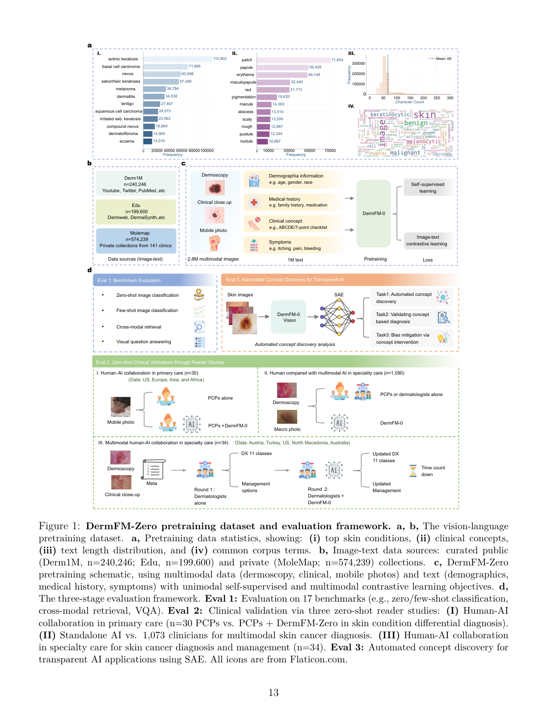
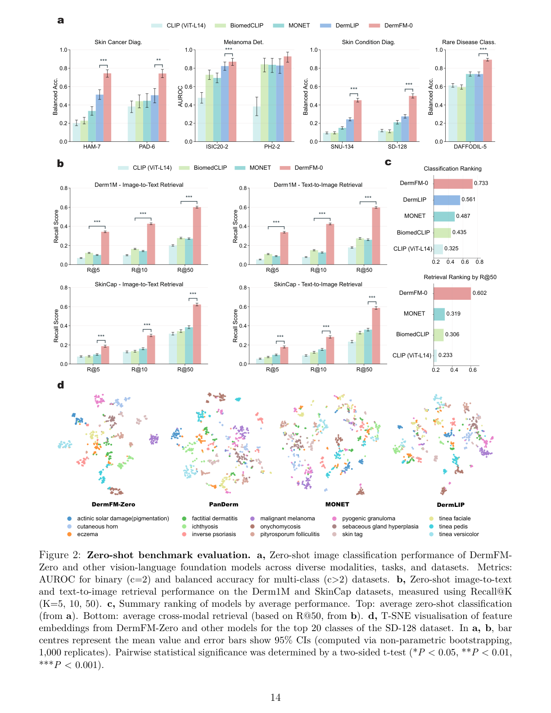
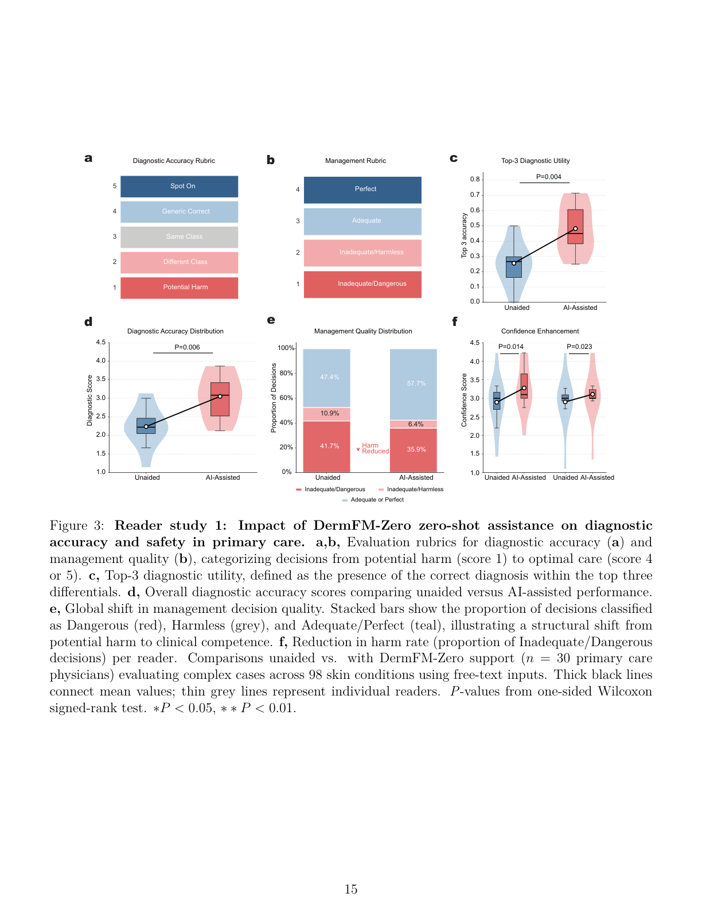
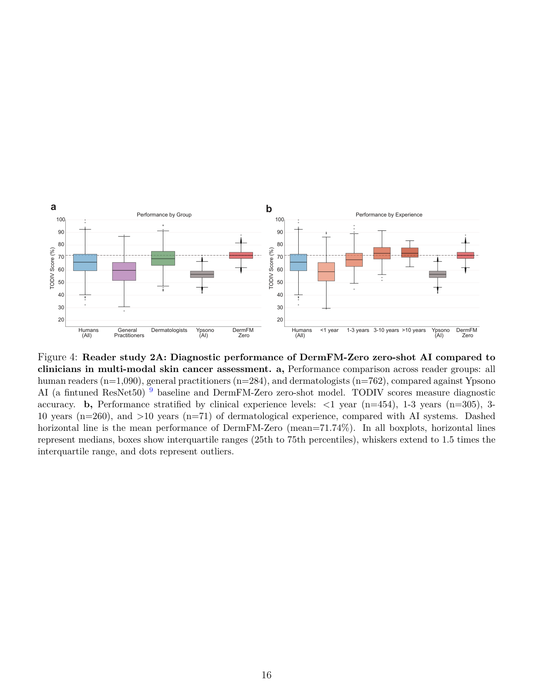
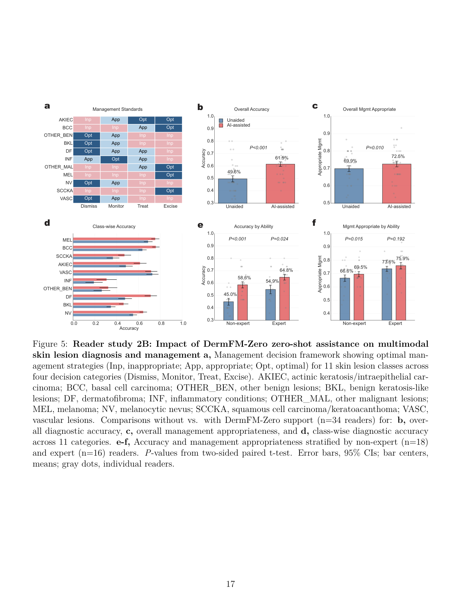
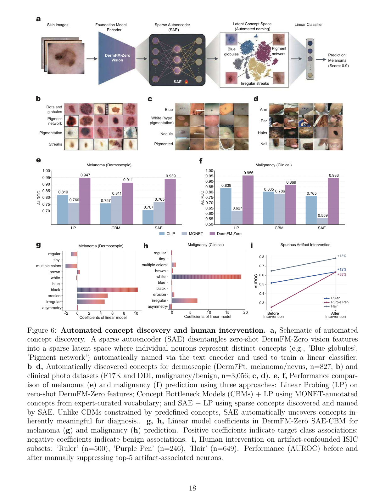
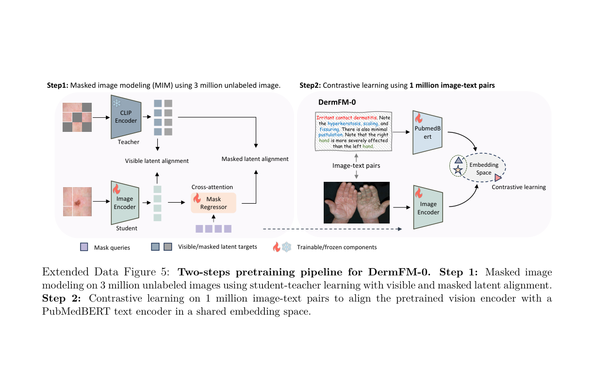
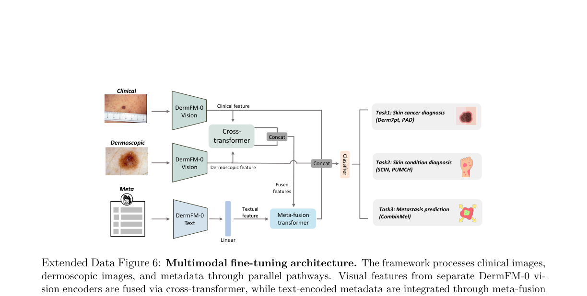

# A Vision-Language Foundation Model for Zero-shot Clinical Collaboration and Automated Concept Discovery in Dermatology

## 출처/링크

우선 인용 버전: Research Square preprint v1, 2026  
Posted date: 2026-02-18  
Title: `A Vision-Language Foundation Model for Zero-shot Clinical Collaboration and Automated Concept Discovery in Dermatology`  
Model name: `DermFM-Zero`  
DOI: `10.21203/rs.3.rs-8847635/v1`  
Local PDF: [v1_covered_39f61217-99b2-4e34-bab2-be9d9f76828e.pdf](../paper/v1_covered_39f61217-99b2-4e34-bab2-be9d9f76828e.pdf)  
Code: `https://github.com/SiyuanYan1/DermFM-Zero`  
Model weights: `https://huggingface.co/redlessone/DermFM-Zero`

## 주요 Figure 및 Table

### Figure 1. DermFM-Zero pretraining dataset 및 evaluation framework

- a. pretraining corpus의 disease / concept / text term 분포
- b. image-text data source
  - Derm1M: 240,246개
  - educational resources: 199,600개
  - MoleMap private clinical collection: 574,239개
- c. pretraining schematic
  - 입력 modality: clinical close-up, dermoscopy, mobile photo
  - text 정보: demographics, medical history, symptoms, clinical concept, diagnosis terminology
  - 학습 objective: unimodal self-supervised learning + multimodal contrastive learning
- d. three-stage evaluation framework
  1. Benchmark evaluation: zero/few-shot classification, cross-modal retrieval, VQA
  2. Zero-shot clinical validation: primary care reader study, clinician-vs-AI skin cancer diagnosis, specialist human-AI collaboration
  3. Automated concept discovery: SAE 기반 concept discovery, concept-based diagnosis, artifact intervention

### Figure 2. Zero-shot benchmark evaluation

- zero-shot image classification에서 DermFM-Zero가 CLIP, BiomedCLIP, MONET, DermLIP보다 전반적으로 우수
- binary task는 AUROC, multi-class task는 balanced accuracy로 평가
- Derm1M / SkinCap cross-modal retrieval에서 R@K 기준으로 강한 image-text alignment 제시
- SD-128 top class feature embedding t-SNE에서 DermFM-Zero representation이 더 compact하고 class separation이 좋다는 해석

### Figure 3. Reader study 1: primary care human-AI collaboration

- 30명의 general practitioner가 98개 skin condition clinical photo case를 평가
- AI assistance 전후로 top-3 differential diagnosis accuracy 및 management safety를 비교
- DermFM-Zero의 zero-shot top-3 prediction이 GP의 diagnostic score와 management appropriateness를 개선

### Figure 4. Reader study 2A: clinician vs zero-shot AI

- paired clinical image + dermoscopy 기반 multimodal skin cancer diagnosis
- 1,090명 clinician과 DermFM-Zero를 비교
- DermFM-Zero가 전체 clinician 평균과 board-certified dermatologist 평균보다 높은 TODIV diagnostic score를 보였다고 보고
- 기존 supervised ResNet50 기반 Ypsono baseline보다도 우수

### Figure 5. Reader study 2B: specialist human-AI collaboration

- 34명 clinician이 paired clinical + dermoscopy image와 기본 metadata를 보고 11개 lesion class 및 management option을 판단
- AI support 후 diagnostic accuracy와 management appropriateness가 개선
- non-expert가 가장 큰 이득을 얻어 unassisted expert 수준을 넘는 "skill-leveling" 효과를 주장

### Figure 6. Automated concept discovery and human intervention

- Sparse Autoencoder(SAE)로 DermFM-Zero vision feature를 sparse latent concept으로 분해
- 자동 명명된 concept 예: blue globules, pigment network, irregular streaks, hair, ear, arm, nail
- SAE concept bottleneck model이 expert-curated vocabulary 기반 CBM보다 우수
- ruler, purple pen, hair artifact 관련 top-5 neuron을 inference에서 suppress하여 artifact-biased ISIC subset AUROC를 개선

### Extended Data Figure 5. Two-step pretraining pipeline

- Step 1: 3 million unlabeled skin image에 masked image modeling / masked latent modeling 적용
- Step 2: 1 million image-text pair에 contrastive learning 적용
- text encoder는 PubMedBERT 사용

### Extended Data Figure 6. Multimodal fine-tuning architecture

- clinical image, dermoscopic image, metadata를 parallel pathway로 처리
- image branch: DermFM-Zero vision encoder
- metadata branch: structured metadata를 text로 변환 후 DermFM-Zero text encoder 사용
- fusion:
  - clinical-dermoscopic image feature는 cross-transformer로 결합
  - text metadata는 meta-fusion transformer에서 visual feature에 cross-attention
  - fused representation을 concat하여 classifier에 입력

## 목표와 기여

DermFM-Zero는 dermatology vision-language foundation model을 zero-shot diagnosis, reader study, automated concept discovery까지 평가한 논문이다. 핵심 기여는 대규모 image-text pretraining, zero-shot clinical validation, SAE 기반 concept discovery이다.

## Dataset 정보

Pretraining은 3 million 이상 unlabeled dermatology image와 1,014,085 image-text pair를 사용한다. Evaluation은 zero-shot classification, retrieval, VQA, multimodal fine-tuning, concept discovery로 구성되며 HAM-7, ISIC20-2, Derm1M, SkinCap, Derm7pt, CombinMel 등이 사용된다.

## Imbalance 처리

별도 imbalance sampling보다 large-scale foundation pretraining과 zero-shot transfer를 강조한다. 평가는 weighted F1, balanced accuracy, sensitivity, AUROC 등을 사용하며, artifact robustness는 ISIC-Intervention에서 SAE neuron suppression으로 평가한다.

## Tabular model

별도의 tabular-only model은 없다. Structured metadata는 natural language template으로 변환되어 PubMedBERT 기반 text encoder에 입력된다.

## Image model

DermFM-Zero는 two-stage pretraining을 사용한다. Stage 1은 ViT-Large student와 frozen CLIP-Large teacher를 이용한 masked latent modelling이고, Stage 2는 PubMedBERT text encoder와 image-text contrastive alignment이다.

## Fusion 방식

Multimodal fine-tuning에서는 image feature와 metadata-derived text feature를 transformer 기반 fusion으로 결합한다. Clinical image와 dermoscopy가 함께 있는 경우 두 image feature는 cross-transformer로 먼저 결합된다.

## 평가 지표

Classification/fine-tuning은 weighted F1, AUROC, balanced accuracy, sensitivity, macro F1을 사용한다. Retrieval은 Recall@K, reader study는 diagnostic accuracy와 management appropriateness, prognosis는 Cox/log-rank/time-dependent AUC, concept discovery는 Precision@K와 AUROC를 사용한다.

## 평가 결과

DermFM-Zero는 zero-shot classification 평균 73.3%, cross-modal retrieval 평균 R@50 60.2%를 보고한다. Reader study에서는 AI assistance 후 primary care top-3 accuracy가 0.266에서 0.482로, specialist collaboration accuracy가 0.50에서 0.61로 증가했다. Concept discovery에서는 SAE-CBM melanoma AUROC 0.939, clinical malignancy AUROC 0.933을 보고한다.

---

[메인 문서로 돌아가기](../2026-06-11_dermatology_ai_literature_review.md#3-주요-논문별-상세-분석)
