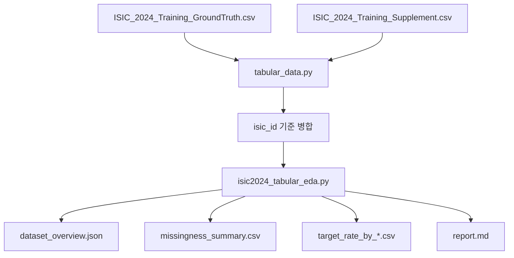
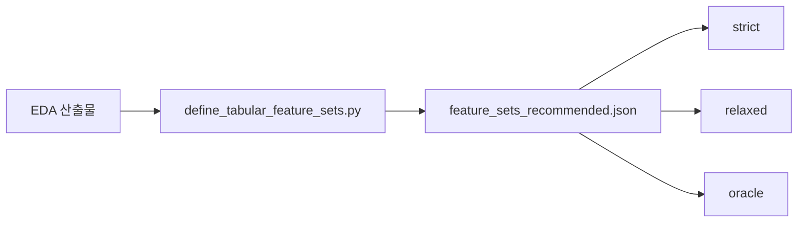
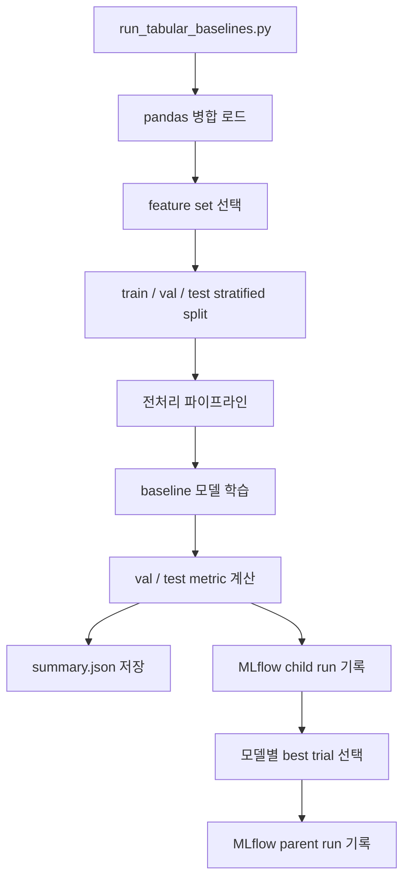
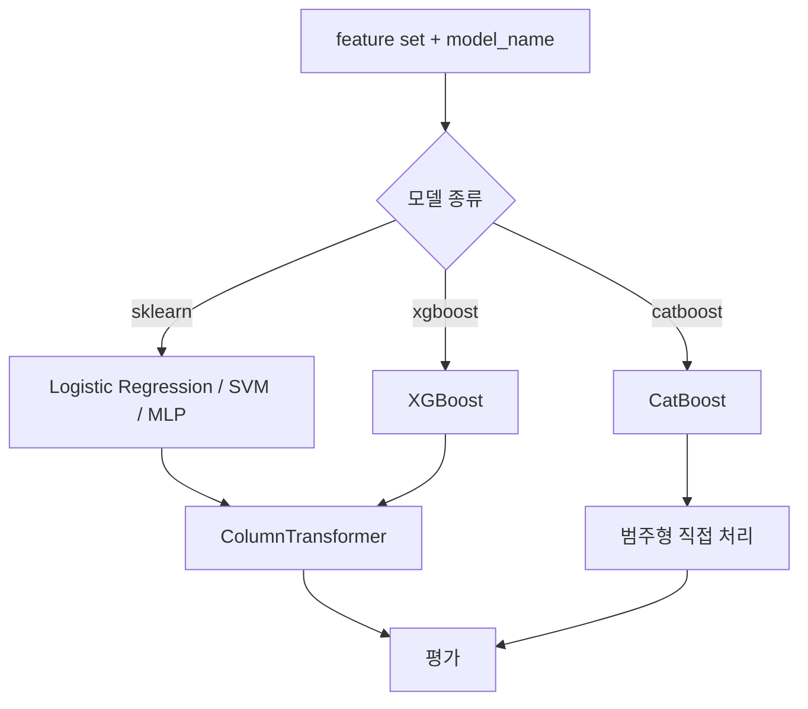
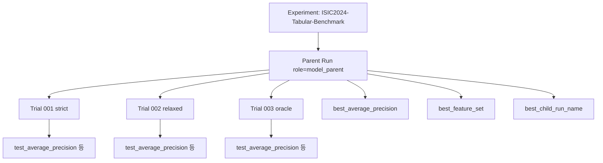
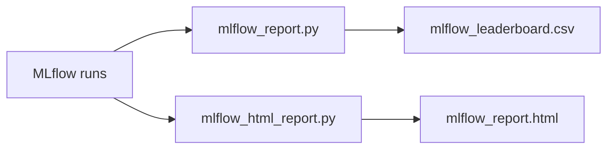
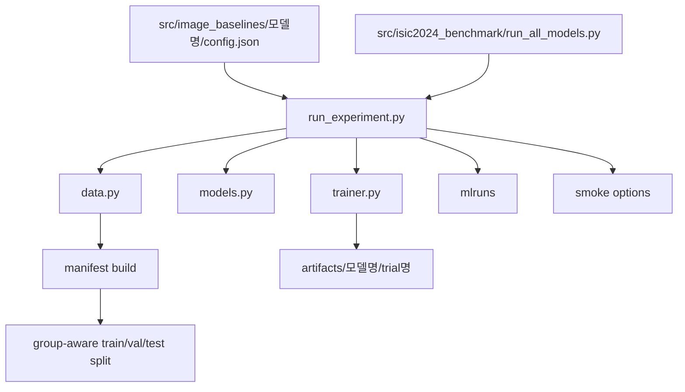
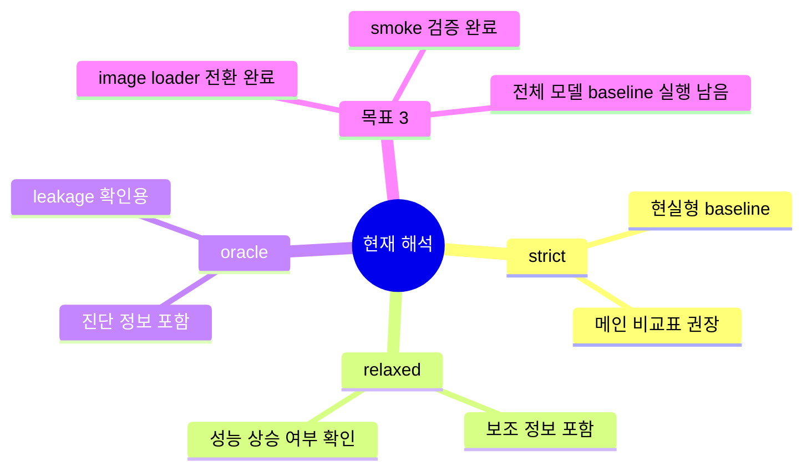

# 프로그램 동작 다이어그램

이 문서는 현재 저장소의 주요 흐름을 `ISIC2024 tabular`와 `image baseline 구조` 중심으로 설명합니다.

## 1. Tabular EDA 흐름

## 2. Feature Set 추천 흐름

## 3. Tabular Baseline 실행 흐름

## 4. Tabular 모델 분기

## 5. Tabular MLflow 구조

## 6. 리포트 생성 흐름

## 7. Image Baseline 구조

## 8. 현재 해석 포인트

