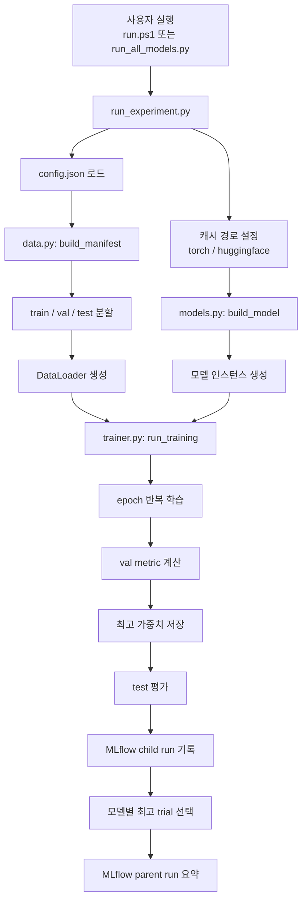
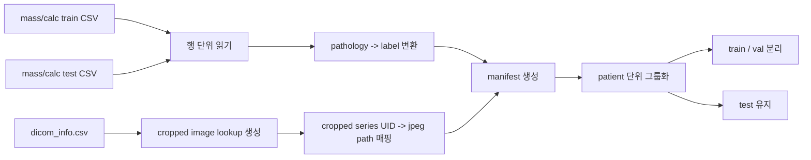
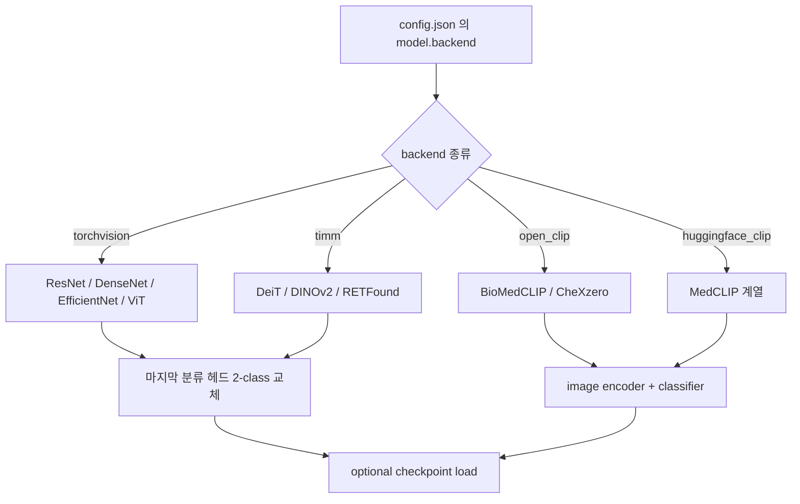
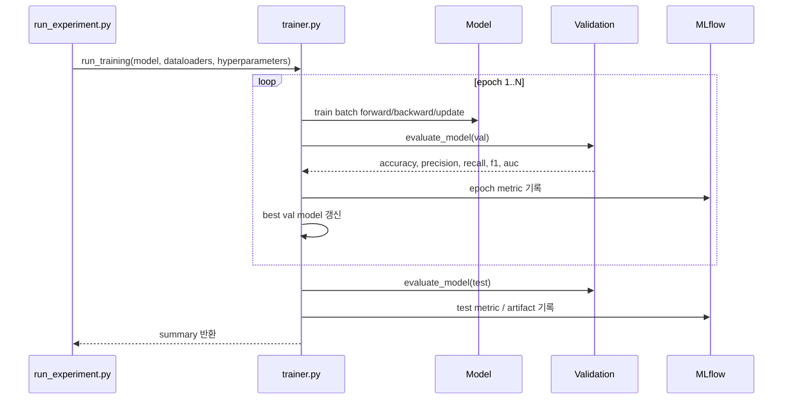
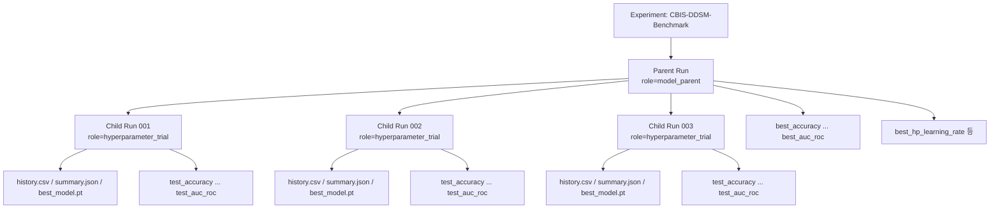
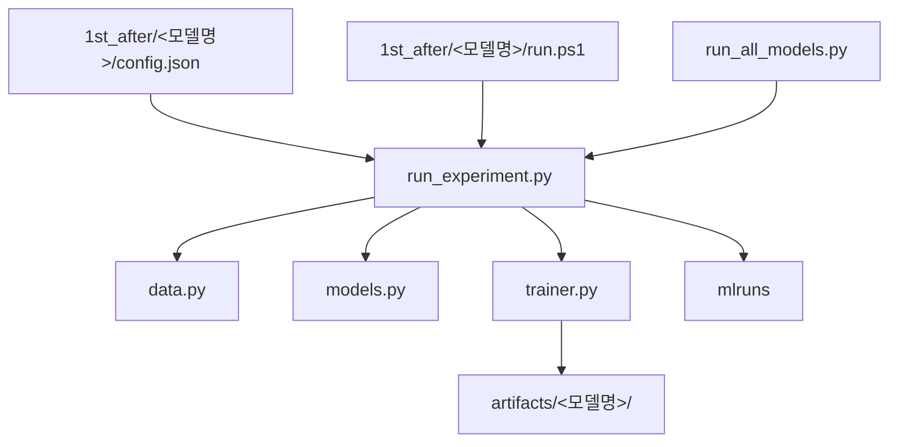
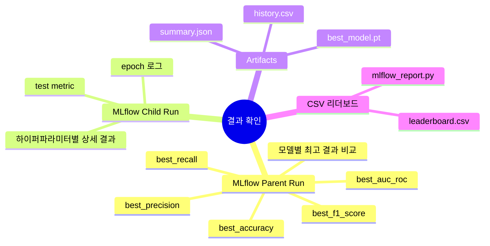

# 프로그램 동작 다이어그램

이 문서는 `CBIS-DDSM` 벤치마크 파이프라인이 어떻게 흘러가는지 다이어그램 중심으로 설명합니다.

## 1. 전체 실행 흐름

```mermaid
flowchart TD
    A[사용자 실행<br/>run.ps1 또는 run_all_models.py] --> B[run_experiment.py]
    B --> C[config.json 로드]
    B --> D[캐시 경로 설정<br/>torch / huggingface]
    C --> E[data.py: build_manifest]
    D --> F[models.py: build_model]
    E --> G[train / val / test 분할]
    G --> H[DataLoader 생성]
    F --> I[모델 인스턴스 생성]
    H --> J[trainer.py: run_training]
    I --> J
    J --> K[epoch 반복 학습]
    K --> L[val metric 계산]
    L --> M[최고 가중치 저장]
    M --> N[test 평가]
    N --> O[MLflow child run 기록]
    O --> P[모델별 최고 trial 선택]
    P --> Q[MLflow parent run 요약]
```

## 2. 데이터셋 준비 흐름

```mermaid
flowchart LR
    A[mass/calc train CSV] --> D[행 단위 읽기]
    B[mass/calc test CSV] --> D
    C[dicom_info.csv] --> E[cropped image lookup 생성]
    D --> F[pathology -> label 변환]
    E --> G[cropped series UID -> jpeg path 매핑]
    F --> H[manifest 생성]
    G --> H
    H --> I[patient 단위 그룹화]
    I --> J[train / val 분리]
    I --> K[test 유지]
```

## 3. 모델 생성 분기

```mermaid
flowchart TD
    A[config.json 의 model.backend] --> B{backend 종류}
    B -->|torchvision| C[ResNet / DenseNet / EfficientNet / ViT]
    B -->|timm| D[DeiT / DINOv2 / RETFound]
    B -->|open_clip| E[BioMedCLIP / CheXzero]
    B -->|huggingface_clip| F[MedCLIP 계열]
    C --> G[마지막 분류 헤드 2-class 교체]
    D --> G
    E --> H[image encoder + classifier]
    F --> H
    G --> I[optional checkpoint load]
    H --> I
```

## 4. 학습 루프

```mermaid
sequenceDiagram
    participant U as run_experiment.py
    participant T as trainer.py
    participant M as Model
    participant V as Validation
    participant F as MLflow

    U->>T: run_training(model, dataloaders, hyperparameters)
    loop epoch 1..N
        T->>M: train batch forward/backward/update
        T->>V: evaluate_model(val)
        V-->>T: accuracy, precision, recall, f1, auc
        T->>F: epoch metric 기록
        T->>T: best val model 갱신
    end
    T->>V: evaluate_model(test)
    T->>F: test metric / artifact 기록
    T-->>U: summary 반환
```

## 5. MLflow 구조

```mermaid
flowchart TD
    A[Experiment: CBIS-DDSM-Benchmark] --> B[Parent Run<br/>role=model_parent]
    B --> C[Child Run 001<br/>role=hyperparameter_trial]
    B --> D[Child Run 002<br/>role=hyperparameter_trial]
    B --> E[Child Run 003<br/>role=hyperparameter_trial]
    C --> F[history.csv / summary.json / best_model.pt]
    D --> G[history.csv / summary.json / best_model.pt]
    E --> H[history.csv / summary.json / best_model.pt]
    C --> I[test_accuracy ... test_auc_roc]
    D --> J[test_accuracy ... test_auc_roc]
    E --> K[test_accuracy ... test_auc_roc]
    B --> L[best_accuracy ... best_auc_roc]
    B --> M[best_hp_learning_rate 등]
```

## 6. 파일 구조 관점

```mermaid
flowchart TB
    A[1st_after/<모델명>/config.json] --> D[run_experiment.py]
    B[1st_after/<모델명>/run.ps1] --> D
    C[run_all_models.py] --> D
    D --> E[data.py]
    D --> F[models.py]
    D --> G[trainer.py]
    G --> H[artifacts/<모델명>/<trial명>]
    D --> I[mlruns]
```

## 7. 결과 확인 포인트

```mermaid
mindmap
  root((결과 확인))
    MLflow Parent Run
      모델별 최고 결과 비교
      best_accuracy
      best_precision
      best_recall
      best_f1_score
      best_auc_roc
    MLflow Child Run
      하이퍼파라미터별 상세 결과
      epoch 로그
      test metric
    Artifacts
      best_model.pt
      history.csv
      summary.json
    CSV 리더보드
      mlflow_report.py
      leaderboard.csv
```
