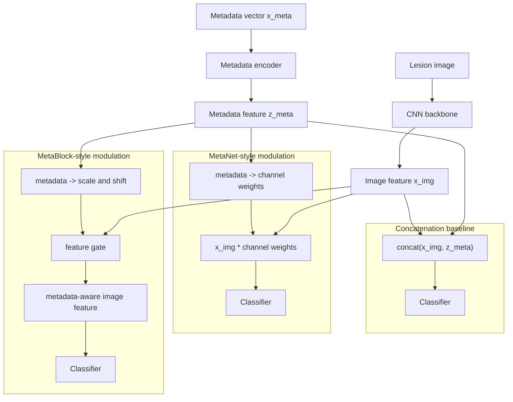
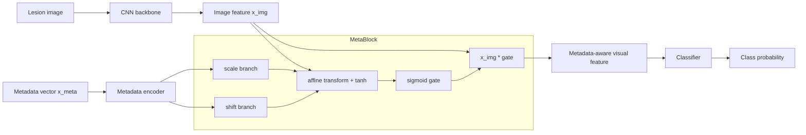
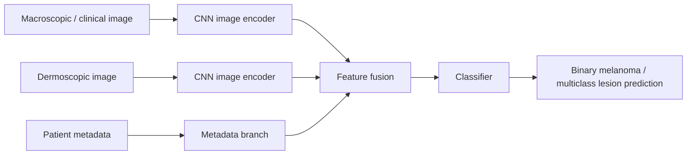
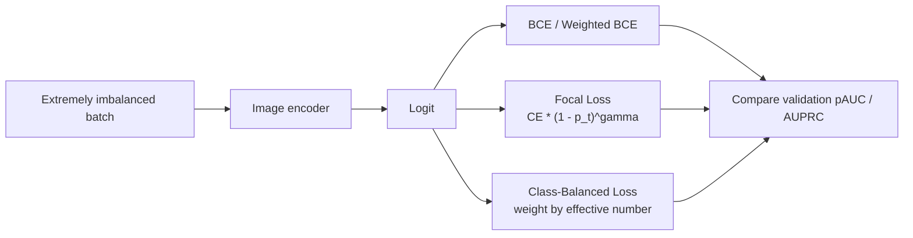
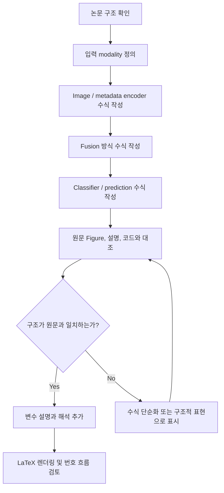

# ISIC 2024 Train-Only Multimodal Literature Review

조사일: 2026-05-04  
주제: ISIC 2024 Kaggle train dataset만 사용한 skin cancer detection 멀티모달 모델 연구를 위한 선행논문 조사  
핵심 조사 대상: dataset 불균형 극복 방법, image-tabular multimodal fusion 방법

---

## 1. 연구 배경

ISIC 2024 Kaggle Challenge는 3D Total Body Photography(3D-TBP)에서 추출한 피부 병변 crop image와 환자/병변 metadata를 함께 제공하는 binary classification 문제이다. 공식 train dataset은 SLICE-3D dataset이며, 총 401,059개 lesion tile로 구성된다.

가장 중요한 특징은 극단적인 class imbalance이다.

| 항목 | 개수 | 비율 |
|---|---:|---:|
| Benign / target 0 | 400,666 | 99.902% |
| Malignant / target 1 | 393 | 0.098% |
| Total | 401,059 | 100% |

따라서 accuracy 중심 평가는 부적절하며, malignant를 놓치지 않는 high-sensitivity 영역의 성능 평가가 중요하다. Kaggle 공식 metric도 `pAUC > 80% TPR`를 사용했다.

ISIC 2024 train dataset의 modality는 크게 두 가지이다.

- Image: 15mm x 15mm field-of-view lesion crop image
- Tabular metadata: age, sex, anatomical site, lesion size/color/shape 관련 WB360 measurements, patient_id, lesion_id, attribution 등

---

## 2. 논문 분석 요약표

| 논문/자료 | 목표 & 핵심 기여 | Dataset 정보 | Imbalanced data 극복방법 | Tabular model | Image model | Fusion 방식 | 평가 지표 | 평가(성능) | 최종결과 |
|---|---|---|---|---|---|---|---|---|---|
| SLICE-3D Dataset, Scientific Data 2024 | ISIC 2024 공식 train dataset 기술 및 공개 | ISIC 2024 train; 401,059 lesion tiles; binary malignant/benign; 3D-TBP image + metadata | benign 400,666 vs malignant 393; 모델 학습 없음, 데이터/학습 조작 없음 | metadata 제공: demographics, anatomical site, WB360 measurements, patient_id | 3D-TBP lesion crop image | 해당 없음 | 해당 없음 | dataset descriptor | ISIC 2024 train-only 연구의 1차 dataset 인용 자료 |
| ISIC 2024 Automated Triage, npj Digital Medicine 2025 | Kaggle ISIC 2024 상위 모델과 ablation 분석 | ISIC 2024 Challenge dataset; binary malignant/benign; 3D-TBP tile + metadata + patient-context | class 축소 없음; pAUC metric, patient-context, GBDT late fusion 중심 | Gradient Boosting Tree 3개, metadata + engineered feature + patient-context feature | EVA 2개 + EdgeNeXt ensemble | image model prediction + metadata를 GBDT에 late fusion | 우선: pAUC>80% TPR; 보조: AUC, SE top-15, NNT@80/90% sensitivity | pAUC 0.1726/0.2, AUC 0.9668, NNT80 51.57, NNT90 98.20 | metadata와 patient-context가 image-only보다 강한 성능 기여 |
| MetaBlock, JBHI 2021 | metadata가 CNN feature를 조절하는 attention-based fusion 제안 | PAD-UFES-20 6-class clinical image+metadata; ISIC 2019 8-class dermoscopy+metadata | class 수 조절 없음; over/under sampling 없음; frequency-weighted CE 사용 | metadata vector를 attention/gating block으로 변환 | CNN backbone | metadata-conditioned feature modulation | 우선: BACC = class별 recall 평균 | PAD-UFES-20 BACC 0.77±0.02, ISIC 2019 BACC 0.77±0.01; MMF-Net 재비교 BACC 0.765±0.017, AUC 0.935±0.004 | ISIC 2024 중간 fusion baseline으로 적합 |
| MMF-Net, Frontiers in Surgery 2022 | smartphone clinical image + metadata fusion | PAD-UFES-20; 6-class smartphone clinical image + metadata | class 수 유지; stratified 5-fold CV + on-the-fly augmentation; 명시적 over/under sampling 없음 | numeric/one-hot metadata + MLP encoder | ResNet-50 | intra-modality self-attention + inter-modality cross-attention | 우선: BACC, aggregated AUC; 보조: ACC | BACC 0.775±0.022, AUC 0.947±0.007, ACC 0.768±0.022 | cross-attention fusion 근거로 적합 |
| Yap et al., Experimental Dermatology 2018 | dermoscopy + clinical image + patient metadata 결합 | 2917 cases; dermoscopic + macroscopic image + patient metadata; binary melanoma 및 5-class task | task 목적상 binary와 5-class를 별도 평가; imbalance-specific sampling/loss는 핵심 아님 | patient metadata 사용 | CNN 기반 dermoscopic/clinical image model | multimodal classifier | 우선: binary AUC, multiclass mAP | AUC 0.866 vs 0.784, mAP 0.729 vs 0.598 | image-only보다 multimodal이 우수 |
| Islam et al., Scientific Reports 2026 | patient metadata + DER/DSLR image fusion으로 suspicious lesion triage | 79,246 images; 39,623 lesions; 19,295 patients; suspicious/non-suspicious; DER/DSLR image + 22 meta-features | binary triage label 정의; patient-separated split, augmentation, majority voting | metadata-only AI model | EfficientNet-B2 계열 | image feature + metadata concat, 최종 majority voting | 우선: sensitivity, specificity; ACC는 (SEN+SPC)/2 | fused SEN 99.66±0.28%, SPC 74.45±0.80%; voting SEN 99.50±1.18%, SPC 82.72±1.64% | metadata fusion이 specificity 개선 |
| Nguyen et al., Sensors 2022 | imbalanced skin lesion classification에서 soft-attention + imbalance-aware loss | HAM10000; 10,015 images; 7 classes; dermoscopy image + age/gender | class 수 유지; augmentation to 53,573 images; weighted/new loss 사용 | age/gender 사용 | InceptionResNetV2, MobileNetV3Large 등 | image 중심 + personal information | 우선: AUC, recall/F1; 보조: accuracy, precision | ACC 0.90, Precision/F1/Recall/AUC 0.81/0.81/0.82/0.99 | imbalance-aware loss와 attention의 결합 근거 |
| Focal Loss 2017 / Class-Balanced Loss 2019 | 일반 long-tail/class imbalance 학습의 대표 loss | 특정 dataset 고정 없음; long-tail classification 일반 loss | easy negative down-weighting, effective number 기반 class weight | 해당 없음 | 모든 CNN/ViT에 적용 가능 | 해당 없음 | task별 metric | long-tailed dataset에서 성능 개선 | ISIC 2024 image branch의 BCE 대체 loss 근거 |
| GAN/Diffusion augmentation 관련 연구 | minority skin lesion image 합성으로 imbalance 완화 | 연구별 skin lesion dataset; minority synthetic image 생성 | GAN/diffusion synthetic augmentation | 보통 없음 | CNN classifier | 해당 없음 | accuracy, AUC 등 | dataset별 개선 보고 | train-only 조건에서는 train positive만으로 생성해야 함 |

---

## 2.1 모델 구조 수식 공통 notation

이 문서의 모델 구조 수식은 원문 equation을 그대로 옮긴 것이 아니라, 각 논문의 figure, method 설명, 공개 코드 구조를 바탕으로 이해를 돕기 위해 정리한 구조적 표현이다. 원문에 명시된 수식이 아닌 경우에는 논문별로 별도 표시했다.

| 기호 | 의미 |
|---|---|
| `I` | lesion image input |
| `m` | patient 또는 lesion-level metadata vector |
| `z_p` | patient-context feature |
| `h_img` | image encoder가 만든 image embedding |
| `h_meta` | metadata encoder가 만든 metadata embedding |
| `y_hat` | predicted probability 또는 class score |

공통적으로 multimodal skin lesion classifier는 다음처럼 요약할 수 있다.

$$
\begin{aligned}
h_{\text{img}} &= f_{\theta}(I), \\
h_{\text{meta}} &= g_{\phi}(m), \\
h_{\text{fuse}} &= \mathcal{F}(h_{\text{img}}, h_{\text{meta}}, z_p), \\
\hat{y} &= c_{\psi}(h_{\text{fuse}})
\end{aligned}
$$

여기서 식의 각 구성요소는 다음과 같다.

| 구성요소 | 의미 |
|---|---|
| `f_theta` | CNN/ViT 계열 image encoder |
| `g_phi` | MLP/GBDT/tabular encoder |
| `F` | concat, late fusion, metadata modulation, cross-attention 같은 fusion 연산 |
| `c_psi` | 최종 classifier |

---

## 3. 주요 논문별 상세 분석

### 3.1 SLICE-3D Dataset: 400,000 Skin Lesion Image Crops Extracted from 3D TBP

출처: Scientific Data, 2024  
링크: https://www.nature.com/articles/s41597-024-03743-w

#### 주요 Figure

원문 라이선스: CC BY 4.0

**Figure 1. Examples of image types**

ISIC 2024의 tile image가 dermoscopic image보다 morphologic detail이 적고, 3D-TBP에서 추출된 low-resolution clinical crop이라는 점을 보여준다. 논문 dataset section에서 가장 유용하다.


**Figure 2. Dataset curation workflow**

strong label, weak label, tile sub-selection, QA 과정을 설명한다. train-only 연구에서 label noise와 weak benign label 문제를 설명할 때 유용하다.


1. 논문의 목표 & 핵심 기여

   ISIC 2024 Challenge의 공식 train dataset인 SLICE-3D를 소개한 dataset descriptor이다. 3D-TBP에서 자동 추출한 lesion crop image와 metadata를 공개하여, dermoscopy 중심 기존 데이터셋의 selection bias를 줄이고 primary care 또는 telehealth 환경에 가까운 저해상도/비전문 촬영 이미지 기반 모델 개발을 가능하게 했다.

2. Dataset 정보

   - Dataset: ISIC 2024 train dataset
   - Sample 수: 401,059 lesion tiles
   - Task: malignant/benign binary classification
   - Modality: 3D-TBP lesion image + patient/lesion metadata

3. Imbalanced data 극복방법

   - 불균형 정도: benign 400,666개 vs malignant 393개, 약 1020:1
   - 데이터 조작: 제안 없음
   - 학습 조작: 모델 학습 논문이 아니므로 없음
   - class 조절: binary target 자체를 기술하며 class 수 조절 없음

4. Tabular model

   모델은 없음. 다만 age, sex, anatomical site, lighting modality, lesion size/color/shape 관련 WB360 measurements, patient_id 등이 제공된다.

5. Image model

   모델은 없음. image는 15mm x 15mm lesion tile이며 평균 크기는 약 133px x 133px이다.

6. Fusion 방식

   해당 없음.

7. 모델 구조 수식

   원문에 학습 모델 구조 수식은 없으므로, 아래는 SLICE-3D sample 구성을 이해하기 위한 표기이다.

   $$
   x_i = (I_i, m_i, p_i), \quad y_i \in \{0, 1\}
   $$

   - `I_i`: 3D-TBP에서 추출된 lesion tile image
   - `m_i`: age, sex, anatomical site, WB360 measurement 등 metadata
   - `p_i`: patient identifier 또는 patient-level grouping 정보
   - `y_i`: malignant 여부

   따라서 이 논문은 위 식처럼 sample 구성을 정의한 dataset descriptor이며, 후속 연구가 사용할 multimodal input space를 제공한 것으로 해석해야 한다.

8. 평가 지표

   - 공식 classification metric: 없음
   - 참고: 후속 ISIC 2024 Challenge에서는 high sensitivity 영역의 `pAUC > 80% TPR`가 핵심 평가 지표로 사용됨

9. 평가(성능)

   - 모델 성능 결과: 해당 없음
   - 주요 정량값: benign 400,666개, malignant 393개

10. 최종결과

   ISIC 2024 train-only 연구의 dataset section에서 반드시 인용해야 할 1차 자료이다.

11. 추가 논의/생각해볼 점

   - benign label에 weak label이 포함되므로 label noise를 고려해야 한다.
   - patient-level clustering이 존재하므로 train-only 실험에서는 patient-level split과 leakage 방지가 중요하다.
   - image crop만으로는 정보가 제한적이어서 metadata와 patient-context feature의 필요성이 크다.

---

### 3.2 Automated Triage of Cancer-Suspicious Skin Lesions with 3D Total-Body Photography

출처: npj Digital Medicine, 2025  
링크: https://www.nature.com/articles/s41746-025-02070-7

#### 주요 Figure

원문 라이선스: CC BY 4.0

**Figure 1. Public/private leaderboard score distribution**

ISIC 2024가 positive가 매우 적고 leaderboard shake-up이 큰 문제였음을 보여준다. 데이터 불균형과 validation instability를 설명할 때 좋다.


**Figure 2. Lesion risk scores stratified by patient**

patient-context, ugly duckling sign, 환자 내 outlier lesion 개념을 설명하는 데 가장 중요한 그림이다.


**Figure 3. Association of lesion characteristics and ML-modelled risk**

WB360 metadata 중 어떤 feature가 모델 risk score와 관련되는지 보여준다. tabular feature engineering의 근거로 사용하기 좋다.


**Figure 4. Winning model diagram**

image-only model output과 metadata/patient-context feature를 boosting model로 결합한 late fusion 구조를 보여준다. ISIC 2024 train-only 연구의 강한 baseline으로 삼기 좋다.


1. 논문의 목표 & 핵심 기여

   ISIC 2024 Kaggle competition 결과를 분석하고, winning model의 ablation study를 통해 image, basic metadata, WB360 appearance metadata, patient-context feature가 성능에 미치는 영향을 비교했다.

2. Dataset 정보

   - Dataset: ISIC 2024 Challenge dataset
   - Task: malignant/benign binary classification
   - Modality: 3D-TBP lesion tile + metadata + patient-context feature

3. Imbalanced data 극복방법

   - class 조절: binary target 유지, class 수 축소/재정의 없음
   - 데이터 조작: 핵심 방법으로 oversampling/undersampling을 제안하지 않음
   - 학습/모델 조작: patient-context feature, metadata feature, GBDT late fusion 활용
   - 평가 기반 대응: `pAUC > 80% TPR`로 high-sensitivity 영역을 우선 평가
   - 주의: 일부 상위 image model은 external dermoscopy data를 사용했으므로 train-only 연구에서는 분리 해석 필요

4. Tabular model

   metadata branch는 basic demographics, WB360 appearance metadata, interaction terms, patient-context terms를 사용했다. 최종 단계에서는 neural network output과 metadata feature를 Gradient Boosting Tree 모델에 입력했다.

5. Image model

   image branch는 EVA model 2개와 EdgeNeXt 1개로 구성된 ensemble이다. 일부 image model은 external dermoscopy data도 사용했으나, train-only 연구에서는 외부 데이터 사용 부분을 제외하고 tile-only image branch를 참고하는 것이 적절하다.

6. Fusion 방식

   image model을 독립적으로 학습한 뒤, image prediction score와 metadata feature를 GBDT에 입력하는 late fusion 구조이다.

7. 모델 구조 수식

   아래 수식은 winning solution과 ablation 설명을 바탕으로 한 이해를 위한 구조적 표현이다. 핵심은 image model score를 단독으로 쓰지 않고 metadata 및 patient-context feature와 함께 GBDT late fusion에 넣는 것이다.

   $$
   \begin{aligned}
   s_{k,i} &= f_{\theta_k}(I_i), \quad k=1,\dots,K, \\
   s_{\text{img},i} &= \frac{1}{K}\sum_{k=1}^{K} s_{k,i}, \\
   z_{p,i} &= \rho(m_i, \mathcal{P}_i), \\
   u_i &= [s_{\text{img},i};\; m_i;\; z_{p,i}], \\
   \hat{y}_i &= G_{\psi}(u_i)
   \end{aligned}
   $$

   - `f_theta_k`: EVA, EdgeNeXt 등 개별 image model
   - `s_img_i`: image ensemble risk score
   - `P_i`: 같은 patient에 속한 병변 집합
   - `rho`: ugly duckling 또는 patient-wise rank/z-score 같은 patient-context feature 생성 함수
   - `G_psi`: image score와 tabular feature를 함께 사용하는 Gradient Boosting Tree classifier

   ISIC 2024에서 중요한 점은 image-only score가 아니라 위 식의 fusion vector `u_i`처럼 환자 맥락을 포함한 late fusion feature를 만든다는 점이다.

8. 평가 지표

   - 우선순위 지표: `pAUC > 80% TPR`. `TPR >= 0.8`인 ROC 구간의 partial AUC이며, score range는 `[0, 0.2]`이다.
   - 보조 지표: AUC.
   - clinical utility 지표: `SE top-15`, `NNT 80% sensitivity`, `NNT 90% sensitivity`.
   - NNT는 해당 sensitivity threshold에서 true positive 1개를 찾기 위해 expert review가 필요한 lesion 수로 해석할 수 있다.

9. 평가(성능)

   - 우선순위 지표: `pAUC 0.1726/0.2`
   - 보조 지표: full AUC `0.9668`
   - clinical utility: `NNT80 51.57`, `NNT90 98.20`
   - ablation: patient-context 제외 시 AUC가 0.967에서 0.956으로 감소
   - 추가 결과: WB360 metadata-only model이 tile-only model보다 좋은 성능을 보임

10. 최종결과

   ISIC 2024에서는 image-only보다 metadata와 patient-context를 결합한 multimodal late fusion이 핵심적이다. train-only 논문에서도 image-only, tabular-only, late fusion, patient-context ablation을 반드시 포함하는 것이 좋다.

11. 추가 논의/생각해볼 점

   - train-only 연구에서는 외부 dermoscopy data를 제외하고도 metadata/patient-context 효과가 유지되는지 확인해야 한다.
   - patient-context feature는 강력하지만, patient-level split을 잘못 잡으면 leakage로 과대평가될 수 있다.

---

### 3.3 MetaBlock: An Attention-Based Mechanism to Combine Images and Metadata

출처: IEEE Journal of Biomedical and Health Informatics, 2021  
링크: https://doi.org/10.1109/JBHI.2021.3062002
코드: https://github.com/paaatcha/MetaBlock

#### 주요 Figure

주의: IEEE 원문 Fig. 2와 Fig. 3 이미지는 직접 삽입하지 않는다. IEEE 논문 figure는 별도 재사용 권한이 필요할 수 있으므로, 본 문서에는 원문 구조를 설명하기 위한 자체 schematic을 넣는다. 원본 figure가 꼭 필요하면 DOI 링크 또는 IEEE Xplore에서 확인하고, 최종 논문/학위논문에는 IEEE RightsLink 권한 확인 후 삽입하는 것이 안전하다.

**자체 Figure 2. 비교 대상 multimodal fusion 구조**

원문 Fig. 2의 역할은 image feature와 metadata를 결합하는 여러 fusion 방식을 비교해 보여주는 것이다. 아래 도식은 concatenation, MetaNet, MetaBlock의 차이를 이해하기 위한 재구성이다.



**자체 Figure 3. MetaBlock 내부 구조**

원문 Fig. 3의 핵심은 metadata가 image feature를 직접 조절하는 gate를 만든다는 점이다. MetaBlock output은 image feature와 같은 shape를 유지하되, metadata 조건에 따라 중요한 channel 또는 feature를 강화한다.



핵심 해석:

- metadata encoder는 복잡한 tabular backbone이라기보다 metadata vector에서 scale/shift modifier를 만드는 branch에 가깝다.
- gate는 `sigmoid(...)`의 출력이며, 각 image feature/channel에 대해 0~1 사이의 중요도 weight를 만든다.
- 이 0~1 gate는 malignant를 직접 판정하는 threshold가 아니라 image feature별 중요도를 조절하는 feature-level attention이다.
- 최종 malignant probability는 MetaBlock 이후 classifier가 계산한다.

ISIC 2024 적용 예:

```text
image tile -> ConvNeXt/EfficientNet feature
metadata + WB360 + patient-context -> scale/shift modifier
MetaBlock -> metadata-aware image feature
classifier -> malignant probability
```

1. 논문의 목표 & 핵심 기여

   skin lesion classification에서 image feature와 patient metadata를 단순 concat하지 않고, metadata가 image feature channel을 조절하도록 하는 Metadata Processing Block(MetaBlock)을 제안했다.

2. Dataset 정보

   - Dataset 1: PAD-UFES-20
   - PAD-UFES-20 구성: 6-class clinical image + metadata
   - Dataset 2: ISIC 2019
   - ISIC 2019 구성: 8-class dermoscopy image + metadata

3. Imbalanced data 극복방법

   - 불균형 정도: PAD-UFES-20은 MEL 52개 vs BCC 845개, 약 16:1
   - 불균형 정도: ISIC 2019는 DF 239개 vs NV 12,875개, 약 54:1
   - class 조절: class 수 조절 없음
   - 데이터 조작: 명시적 oversampling/undersampling 없음
   - 학습 조작: class frequency 기반 weighted CrossEntropyLoss 사용

4. Tabular model

   metadata를 MLP 형태의 block에 입력해 image feature를 조절하는 weight 또는 modulation parameter를 생성한다.

5. Image model

   CNN backbone을 사용한다.

6. Fusion 방식

   intermediate fusion이다. metadata가 CNN feature extraction 과정 중간에 개입해 중요한 visual feature를 강화한다.

7. 모델 구조 수식

   아래 수식은 MetaBlock의 metadata-conditioned feature modulation을 이해하기 위한 구조적 표현이다. metadata가 image feature에 곱해지는 gate를 만들어 channel별 중요도를 조절한다.

   $$
   \begin{aligned}
   h_{\text{img}} &= f_{\theta}(I), \\
   a(m) &= W_a m + b_a, \\
   b(m) &= W_b m + b_b, \\
   g(m, h_{\text{img}}) &= \sigma\left(\tanh\left(a(m) \odot h_{\text{img}} + b(m)\right)\right), \\
   \tilde{h}_{\text{img}} &= h_{\text{img}} \odot g(m, h_{\text{img}}), \\
   \hat{y} &= \operatorname{softmax}(W_c\tilde{h}_{\text{img}} + b_c)
   \end{aligned}
   $$

   - `a(m)`: metadata에서 생성한 scale modifier
   - `b(m)`: metadata에서 생성한 shift modifier
   - `g(m, h_img)`: 0~1 범위의 feature-level gate
   - `h_img_tilde`: metadata 정보를 반영한 image feature

   단순 concat baseline은 아래처럼 image embedding과 metadata embedding을 이어 붙이는 형태이다.

   $$
   h_{\text{concat}} = [h_{\text{img}};\;h_{\text{meta}}]
   $$

   이에 비해 MetaBlock은 metadata가 image feature 자체를 조절한다는 점에서 intermediate fusion에 가깝다.

8. 평가 지표

   - 우선순위 지표: balanced accuracy(BACC)
   - 의미: multiclass BACC는 class별 recall의 평균

   ```text
   BACC = (recall_1 + recall_2 + ... + recall_K) / K
   ```

   - binary case: `BACC = (Sensitivity + Specificity) / 2`

9. 평가(성능)

   - PAD-UFES-20: `BACC 0.77 ± 0.02`
   - ISIC 2019: `BACC 0.77 ± 0.01`
   - 원 논문 비교: CNN-only, concatenation, MetaNet과 비교했으며 10개 실험 중 6개에서 가장 좋은 BACC 보고
   - MMF-Net 재비교: `ACC 0.735 ± 0.013`, `BACC 0.765 ± 0.017`, `AUC 0.935 ± 0.004`
   - no metadata baseline: `ACC 0.616 ± 0.051`, `BACC 0.651 ± 0.050`, `AUC 0.901 ± 0.007`

10. 최종결과

   ISIC 2024 train-only 논문에서 "simple concat vs metadata modulation" 비교 실험의 근거로 적합하다.

11. 추가 논의/생각해볼 점

   - MetaBlock은 불균형 자체를 해결하는 논문이라기보다 metadata-conditioned fusion 논문이다.
   - ISIC 2024처럼 1020:1 수준의 binary imbalance에서는 MetaBlock만으로는 부족하다.
   - ISIC 2024 적용 시 balanced sampler, focal/class-balanced loss, pAUC/AUPRC 평가를 함께 설계해야 한다.

---

### 3.4 MMF-Net: Deep Learning Based Multimodal Fusion Using Smartphone Images and Metadata

출처: Frontiers in Surgery, 2022  
링크: https://www.frontiersin.org/articles/10.3389/fsurg.2022.1029991/full

#### 주요 Figure

원문 라이선스: CC BY 4.0

**Figure 1. Overall network architecture**

image encoder, meta encoder, multimodal fusion module, classifier의 전체 흐름을 보여준다. multimodal fusion model architecture section에 유용하다.


**Figure 2. Multimodal fusion module**

self-attention과 cross-attention을 이용해 image feature와 metadata feature를 양방향으로 결합하는 구조를 보여준다. MetaBlock보다 적극적인 attention fusion을 설명할 때 중요하다.


**Figure 3. ROC curves**

class별 AUC 성능을 보여준다.


**Figure 4. Confusion matrix**

multiclass skin lesion classification에서 어떤 class가 혼동되는지 보여준다.


1. 논문의 목표 & 핵심 기여

   smartphone으로 수집된 clinical image와 metadata를 결합하여 skin lesion type을 분류하는 multimodal fusion network를 제안했다.

2. Dataset 정보

   - Dataset: PAD-UFES-20
   - Class setting: 6-class skin lesion classification
   - Modality: smartphone clinical image + metadata
   - Metadata: numeric/categorical metadata 제공

3. Imbalanced data 극복방법

   - class 조절: 6-class 설정 유지
   - 데이터 조작: on-the-fly image augmentation 사용
   - split: stratified 5-fold cross-validation
   - sampling: 명시적 oversampling/undersampling 없음
   - 학습 조작: weighted loss는 핵심 방법으로 보고하지 않음
   - 평가 기반 대응: BACC와 aggregated AUC 사용

4. Tabular model

   numeric feature는 그대로 사용하고, categorical feature는 one-hot encoding 후 MLP encoder를 통과시켰다.

5. Image model

   ResNet-50을 image encoder로 사용했다.

6. Fusion 방식

   intra-modality self-attention으로 각 modality 내부의 중요 feature를 강화하고, inter-modality cross-attention으로 image feature와 metadata feature가 서로를 guide하도록 했다.

7. 모델 구조 수식

   아래 수식은 MMF-Net의 self-attention과 cross-attention fusion을 이해하기 위한 구조적 표현이다.

   $$
   \operatorname{Attn}(Q,K,V)=\operatorname{softmax}\left(\frac{QK^{\top}}{\sqrt{d}}\right)V
   $$

   $$
   \begin{aligned}
   h_{\text{img}} &= f_{\theta}(I), \\
   h_{\text{meta}} &= g_{\phi}(m), \\
   \tilde{h}_{\text{img}} &= \operatorname{Attn}(W_Q^i h_{\text{img}}, W_K^i h_{\text{img}}, W_V^i h_{\text{img}}), \\
   \tilde{h}_{\text{meta}} &= \operatorname{Attn}(W_Q^m h_{\text{meta}}, W_K^m h_{\text{meta}}, W_V^m h_{\text{meta}}), \\
   c_{\text{img}\leftarrow\text{meta}} &= \operatorname{Attn}(W_Q^c\tilde{h}_{\text{img}}, W_K^c\tilde{h}_{\text{meta}}, W_V^c\tilde{h}_{\text{meta}}), \\
   c_{\text{meta}\leftarrow\text{img}} &= \operatorname{Attn}(W_Q^c\tilde{h}_{\text{meta}}, W_K^c\tilde{h}_{\text{img}}, W_V^c\tilde{h}_{\text{img}}), \\
   h_{\text{fuse}} &= [c_{\text{img}\leftarrow\text{meta}};\;c_{\text{meta}\leftarrow\text{img}}], \\
   \hat{y} &= \operatorname{softmax}(W_o h_{\text{fuse}} + b_o)
   \end{aligned}
   $$

   - self-attention은 image 내부 또는 metadata 내부에서 중요한 feature를 먼저 정제한다.
   - cross-attention은 image feature가 metadata를 참조하고, metadata feature가 image를 참조하도록 만든다.
   - ISIC 2024에 적용하면 metadata token에는 WB360 및 patient-context feature를 포함할 수 있다.

8. 평가 지표

   - 우선순위 지표: BACC, aggregated AUC
   - 보조 지표: ACC
   - BACC: class별 recall 평균
   - aggregated AUC: 6-class 문제에서 class pair별 AUC를 평균한 값

9. 평가(성능)

   - BACC: `0.775 ± 0.022`
   - aggregated AUC: `0.947 ± 0.007`
   - ACC: `0.768 ± 0.022`

10. 최종결과

   metadata 포함이 image-only보다 성능을 유의미하게 개선했다. ISIC 2024에서 cross-attention fusion을 제안할 때 직접적인 선행연구로 사용할 수 있다.

11. 추가 논의/생각해볼 점

   - cross-attention은 fusion 기여를 설명하기 좋다.
   - positive가 극도로 적은 ISIC 2024에서는 end-to-end 학습이 불안정할 수 있다.
   - train-only 조건에서는 late fusion baseline과 비교해 cross-attention의 실제 pAUC 개선폭을 검증해야 한다.

---

### 3.5 Yap et al.: Multimodal Skin Lesion Classification Using Deep Learning

출처: Experimental Dermatology, 2018  
링크: https://doi.org/10.1111/exd.13777

#### 주요 Figure

주의: Wiley 원문 figure는 직접 삽입하지 않고, multimodal concept schematic으로 대체한다.

**자체 Figure. Multiple image modalities + metadata fusion**



핵심 해석:

- 단일 macroscopic image보다 dermoscopy + clinical image + metadata 조합이 더 좋은 성능을 보였다.
- ISIC 2024는 dermoscopy가 없지만, "여러 source의 정보를 결합하면 image-only보다 성능이 좋아진다"는 선행근거로 사용할 수 있다.

1. 논문의 목표 & 핵심 기여

   하나의 macroscopic image만 사용하는 기존 방식에서 벗어나, dermoscopic image, clinical/macroscopic image, patient metadata를 결합한 multimodal classifier를 제안했다.

2. Dataset 정보

   - Dataset: 자체 dataset
   - Sample 수: 2917 cases
   - Modality: dermoscopic image + macroscopic image + patient metadata
   - Task: binary melanoma detection, 5-class classification

3. Imbalanced data 극복방법

   - class 조절: binary task와 5-class task를 별도 평가
   - 해석: task 목적에 따른 label setting이며, 하나의 binary target에서 class 수를 임의 축소한 것은 아님
   - 데이터 조작: imbalance-specific sampling은 핵심 기여로 보고되지 않음
   - 학습 조작: imbalance-specific loss는 핵심 기여로 보고되지 않음
   - 평가 기반 대응: AUC, mAP 중심 평가

4. Tabular model

   patient metadata를 multimodal classifier에 포함했다.

5. Image model

   CNN 기반 image model을 사용했다.

6. Fusion 방식

   multiple image modalities와 patient metadata를 결합하는 multimodal classifier 구조이다.

7. 모델 구조 수식

   아래 수식은 dermoscopic image, macroscopic image, patient metadata를 결합하는 multimodal classifier를 이해하기 위한 구조적 표현이다.

   $$
   \begin{aligned}
   h_{\text{derm}} &= f_{\theta_d}(I_{\text{derm}}), \\
   h_{\text{macro}} &= f_{\theta_c}(I_{\text{macro}}), \\
   h_{\text{meta}} &= g_{\phi}(m), \\
   h_{\text{fuse}} &= [h_{\text{derm}};\;h_{\text{macro}};\;h_{\text{meta}}], \\
   \hat{y}_{\text{bin}} &= \sigma(w_b^{\top}h_{\text{fuse}} + b_b), \\
   \hat{\mathbf{y}}_{\text{multi}} &= \operatorname{softmax}(W_m h_{\text{fuse}} + b_m)
   \end{aligned}
   $$

   - `I_derm`: dermoscopic image
   - `I_macro`: macroscopic 또는 clinical image
   - `y_hat_bin`: binary melanoma prediction
   - `y_hat_multi`: multiclass lesion type prediction

   ISIC 2024는 dermoscopy input이 없으므로 직접 적용식은 아래처럼 tile image와 metadata를 결합하는 형태로 단순화된다.

   $$
   h_{\text{fuse}} = [h_{\text{tile}};\;h_{\text{meta}}]
   $$

8. 평가 지표

   - 우선순위 지표: binary melanoma detection의 AUC
   - 우선순위 지표: multiclass classification의 mAP
   - mAP: class별 precision-recall curve의 average precision을 계산한 뒤 평균한 값

9. 평가(성능)

   - Binary melanoma detection: multimodal classifier `AUC 0.866`
   - Binary baseline: single macroscopic image `AUC 0.784`
   - Multiclass classification: multimodal classifier `mAP 0.729`
   - Multiclass baseline: `mAP 0.598`

10. 최종결과

   피부 병변 진단에서 image + metadata 결합이 image-only보다 우수하다는 초기 근거 논문이다.

11. 추가 논의/생각해볼 점

   - 여러 image modality가 있는 환경의 연구라 ISIC 2024의 single tile image 상황과는 입력 조건이 다르다.
   - metadata가 image-only 성능을 보완한다는 방향성은 ISIC 2024 train-only 연구의 근거로 사용할 수 있다.

---

### 3.6 Islam et al.: Fusion of Patient Metadata and Skin Lesion Images

출처: Scientific Reports, 2026  
링크: https://www.nature.com/articles/s41598-025-26392-4

#### 주요 Figure

원문 라이선스: CC BY 4.0

**Figure 6. Proposed AI framework**

metadata와 image를 함께 사용해 suspicious vs non-suspicious skin lesion을 분류하는 전체 framework를 보여준다.


**Figure 8. Fusion of metadata with image data**

image feature와 metadata feature를 결합하는 fusion 구조를 보여준다.


**Figure 11. Performance of image + metadata fusion**

metadata fusion이 specificity를 개선하는 결과를 보여준다. ISIC 2024에서 high sensitivity를 유지하면서 false positive를 줄이는 목표와 연결하기 좋다.


1. 논문의 목표 & 핵심 기여

   teledermatology triage에서 suspicious vs non-suspicious lesion을 분류하기 위해 patient metadata와 dermoscopic/DSLR image를 결합한 AI framework를 제안했다.

2. Dataset 정보

   - Dataset: UK private skin cancer diagnostic centres dataset
   - Patient 수: 19,295명
   - Lesion 수: 39,623개
   - Image 수: 79,246개
   - Task: suspicious/non-suspicious binary triage
   - Modality: DER/DSLR image + 22 meta-features

3. Imbalanced data 극복방법

   - 불균형 정도: suspicious 11,258개 vs non-suspicious 67,988개
   - class 조절: class 축소라기보다 clinical triage 목적의 binary label 정의
   - split: 80/20 patient-separated split
   - 데이터 조작: image preprocessing/augmentation
   - 모델 조작: model decision majority voting
   - 평가 기반 대응: sensitivity와 specificity 중심 평가

4. Tabular model

   22개 meta-feature 중 C4C risk factor 및 risk score를 활용한 metadata-only model을 구성했다.

5. Image model

   EfficientNet-B2 기반 image model을 사용했다.

6. Fusion 방식

   image feature와 metadata vector를 concat한 뒤 classifier에 입력했다. 추가로 여러 model decision을 majority voting으로 결합했다.

7. 모델 구조 수식

   아래 수식은 image feature와 metadata feature를 concat한 뒤 classifier와 majority voting을 적용하는 구조를 이해하기 위한 표현이다.

   $$
   \begin{aligned}
   h_{\text{img},i}^{(r)} &= f_{\theta_r}(I_i), \\
   h_{\text{meta},i}^{(r)} &= g_{\phi_r}(m_i), \\
   h_{\text{fuse},i}^{(r)} &= [h_{\text{img},i}^{(r)};\;h_{\text{meta},i}^{(r)}], \\
   \hat{y}_i^{(r)} &= \sigma(c_{\psi_r}(h_{\text{fuse},i}^{(r)})), \quad r=1,\dots,R, \\
   \hat{d}_i &= \mathbb{1}\left[\frac{1}{R}\sum_{r=1}^{R}\mathbb{1}(\hat{y}_i^{(r)} \ge \tau_r) \ge \frac{1}{2}\right]
   \end{aligned}
   $$

   - `r`: voting에 참여하는 개별 model index
   - `tau_r`: model별 suspicious 판정 threshold
   - `d_hat_i`: majority voting 이후 최종 suspicious/non-suspicious decision

   이 논문에서 metadata fusion의 역할은 아래 fusion vector를 통해 sensitivity를 유지하면서 specificity를 개선하는 방향으로 해석할 수 있다.

   $$
   h_{\text{fuse}} = [h_{\text{img}};\;h_{\text{meta}}]
   $$

8. 평가 지표

   - 우선순위 지표: sensitivity(SEN), specificity(SPC)
   - SEN: suspicious/malignant 계열을 놓치지 않는 정도
   - SPC: non-suspicious/benign을 불필요하게 의심하지 않는 정도
   - ACC: 논문 수식상 `ACC = (SEN + SPC) / 2`, binary balanced accuracy에 가까움

9. 평가(성능)

   - Image + metadata fused model: `SEN 99.66 ± 0.28%`, `SPC 74.45 ± 0.80%`
   - Majority voting: `SEN 99.50 ± 1.18%`, `SPC 82.72 ± 1.64%`
   - Metadata-only model: `SEN 85.24 ± 2.20%`, `SPC 61.12 ± 0.90%`
   - 핵심 효과: majority voting에서 sensitivity를 유지하면서 specificity 개선

10. 최종결과

   metadata fusion은 sensitivity를 유지하면서 specificity를 개선하는 데 유리하다. ISIC 2024에서도 high sensitivity 조건에서 false positive를 줄이는 fusion 목표와 잘 맞는다.

11. 추가 논의/생각해볼 점

   - specificity 개선은 ISIC 2024의 high-sensitivity pAUC 목표와 잘 연결된다.
   - private clinic 기반 데이터라 population bias가 있을 수 있다.
   - hair removal과 resizing 같은 preprocessing이 lesion shape를 왜곡할 가능성을 저자도 논의한다.

---

### 3.7 Nguyen et al.: Skin Lesion Classification on Imbalanced Data Using Soft Attention

출처: Sensors, 2022  
링크: https://www.mdpi.com/1424-8220/22/19/7530

#### 주요 Figure

원문 라이선스: CC BY 4.0

**Figure 2. Overall model architecture**

image input, metadata branch, soft-attention layer, classifier가 결합되는 전체 구조를 보여준다.


**Figure 6. Soft-Attention layer**

soft-attention이 feature map에서 중요한 영역을 강화하는 방식을 설명한다.


**Figure 7. Soft-Attention module**

soft-attention module의 세부 구조를 보여준다.


**Figure 9. AUC curves**

imbalance-aware loss와 soft-attention 기반 모델의 class별 ROC/AUC 결과를 보여준다.


1. 논문의 목표 & 핵심 기여

   imbalanced skin lesion classification에서 soft-attention과 imbalance-aware loss function을 결합한 deep learning model을 제안했다.

2. Dataset 정보

   - Dataset: HAM10000
   - Image 수: 10,015개 dermoscopy images
   - Class 수: 7 classes
   - Metadata: age, gender 등 patient information

3. Imbalanced data 극복방법

   - 불균형 정도: NV 6705개 vs DF 115개, 약 58:1
   - class 조절: class 수 조절 없음
   - 데이터 조작: augmentation으로 training image를 53,573개까지 확장
   - 학습 조작: weighted/new loss function 사용
   - 모델 조작: soft-attention으로 lesion 중심 feature 강화

4. Tabular model

   age, gender 같은 personal information을 추가로 사용했다.

5. Image model

   InceptionResNetV2, MobileNetV3Large 등 다양한 backbone을 사용했다.

6. Fusion 방식

   image feature 중심 구조에 personal information을 함께 사용했다.

7. 모델 구조 수식

   아래 수식은 soft-attention module과 personal information branch를 이해하기 위한 구조적 표현이다.

   $$
   \begin{aligned}
   F &= f_{\theta}(I), \\
   A &= \sigma(q_{\omega}(F)), \\
   \tilde{F} &= F \odot A, \\
   h_{\text{img}} &= \operatorname{GAP}(\tilde{F}), \\
   h_{\text{meta}} &= g_{\phi}(m_{\text{age}}, m_{\text{gender}}), \\
   h_{\text{fuse}} &= [h_{\text{img}};\;h_{\text{meta}}], \\
   \hat{\mathbf{y}} &= \operatorname{softmax}(W_c h_{\text{fuse}} + b_c)
   \end{aligned}
   $$

   - `F`: backbone이 만든 spatial feature map
   - `A`: lesion-relevant region 또는 channel을 강조하는 soft-attention map
   - `F_tilde`: attention이 적용된 feature map
   - `GAP`: global average pooling

   구조적으로는 class imbalance를 loss만으로 다루는 것이 아니라, attention map `A`를 통해 병변 관련 visual evidence를 강화한 뒤 metadata와 결합한다는 점이 중요하다.

8. 평가 지표

   - 우선순위 지표: AUC, recall, F1
   - 보조 지표: accuracy, precision
   - recall: minority class를 놓치지 않는 정도
   - F1: precision과 recall의 조화평균

9. 평가(성능)

   - Best model: InceptionResNetV2 + soft-attention + new loss
   - AUC: `0.99`
   - Recall: `0.82`
   - F1: `0.81`
   - Accuracy: `0.90`
   - Precision: `0.81`

10. 최종결과

   ISIC 2024 image branch에서 focal loss, class-balanced loss, attention block을 실험할 근거로 활용 가능하다.

11. 추가 논의/생각해볼 점

   - augmentation과 weighted loss가 함께 들어가 있어 성능 향상의 원인을 분리해 봐야 한다.
   - loss 때문인지 attention 때문인지 ablation을 세밀히 확인해야 한다.
   - ISIC 2024에서는 binary pAUC/AUPRC 기준으로 같은 전략이 유지되는지 별도 검증이 필요하다.

---

## 4. Dataset 불균형 극복 방법 정리

ISIC 2024 train-only 조건에서 사용할 수 있는 방법은 다음과 같다.

### 4.1 Sampling 기반

- Positive oversampling
- Negative undersampling
- Balanced batch sampler
- patient-level split을 유지한 stratified sampling

장점:

- 구현이 쉽고 image branch 학습에 바로 적용 가능하다.

주의점:

- positive가 393개뿐이므로 단순 oversampling은 overfitting 위험이 크다.
- 동일 patient가 train/validation에 섞이면 leakage가 발생할 수 있다.

### 4.2 Loss 기반

- Weighted BCE
- Focal Loss
- Class-Balanced Loss
- Class-Balanced Focal Loss
- Asymmetric Loss

ISIC 2024에서는 easy negative가 압도적으로 많으므로 focal 계열 loss가 적합하다. 다만 positive가 매우 적어 loss weight를 과도하게 키우면 calibration이 무너질 수 있으므로 validation pAUC와 AUPRC를 함께 확인해야 한다.

#### 참고 Figure. Loss 기반 imbalance 대응 구조

Focal Loss와 Class-Balanced Loss 논문은 skin lesion 전용은 아니지만, ISIC 2024의 extreme imbalance를 다룰 때 loss 설계 근거로 중요하다.



논문 작성 시 권장 사용:

- Focal Loss: easy negative가 압도적으로 많은 상황에서 negative loss contribution을 낮추는 근거
- Class-Balanced Loss: sample 수가 적은 malignant class에 effective number 기반 weight를 주는 근거
- ISIC 2024에서는 accuracy가 아니라 pAUC, AUPRC, sensitivity-specificity trade-off로 비교해야 한다.

### 4.3 Feature engineering 기반

ISIC 2024에서 특히 중요한 방법이다.

- patient별 lesion count
- patient별 feature mean/std
- lesion size/color feature의 patient-wise z-score
- anatomical site별 rank/percentile
- ugly duckling feature: 같은 환자 내에서 얼마나 outlier인지 측정
- WB360 feature interaction

선행연구상 ISIC 2024에서는 image tile보다 WB360 metadata와 patient-context feature가 더 강한 정보를 제공할 수 있다.

### 4.4 Synthetic augmentation

- GAN 또는 diffusion으로 malignant image 생성
- train positive만 사용한 lesion-preserving augmentation

주의점:

- 사용자가 "train dataset만 사용"한다고 했으므로 external data나 pretrained generative dataset을 사용하면 연구 조건에서 벗어날 수 있다.
- synthetic image는 artifact가 생길 수 있어 final model보다 ablation 또는 보조 실험으로 사용하는 것이 안전하다.

---

## 5. Multimodal Fusion 방식 정리

### 5.1 Late Fusion

구조:

1. image model을 학습한다.
2. train OOF prediction 또는 image embedding을 만든다.
3. tabular metadata와 image prediction을 합쳐 GBDT 또는 MLP에 입력한다.

장점:

- ISIC 2024 winning solution과 가장 유사하다.
- tabular feature가 강한 데이터셋에 적합하다.
- image branch와 tabular branch를 독립적으로 검증하기 쉽다.

단점:

- end-to-end multimodal model이라고 주장하기는 약하다.

### 5.2 Early Fusion / Concatenation

구조:

1. CNN/ViT image encoder에서 embedding 추출
2. metadata MLP embedding과 concat
3. classifier로 최종 예측

장점:

- 구현이 쉽고 논문 baseline으로 적합하다.

단점:

- image feature와 tabular feature의 scale 차이 때문에 metadata가 무시되거나 과도하게 지배할 수 있다.

### 5.3 Metadata Modulation / FiLM / MetaBlock

구조:

1. metadata encoder가 scale/shift/gating vector를 생성한다.
2. image feature map 또는 embedding을 metadata 조건으로 조절한다.

장점:

- 단순 concat보다 논문 기여로 설명하기 좋다.
- 환자 정보가 image feature extraction 과정에 직접 영향을 줄 수 있다.

단점:

- 구현과 ablation이 필요하다.

### 5.4 Cross-Attention Fusion

구조:

1. image token과 metadata token을 각각 encoder에 통과시킨다.
2. self-attention으로 modality 내부 feature를 정제한다.
3. cross-attention으로 image와 metadata가 서로를 guide하도록 한다.

장점:

- multimodal fusion 기여를 가장 명확히 보여줄 수 있다.
- MMF-Net 등 직접적인 선행연구가 있다.

단점:

- 데이터가 극단적으로 불균형이므로 end-to-end training이 불안정할 수 있다.
- train-only 조건에서는 positive 부족으로 과적합 위험이 크다.

---

## 6. ISIC 2024 Train-Only 논문 실험 설계 제안

### 6.1 권장 모델 구성

최소 실험군:

1. Image-only model
   - EfficientNetV2, ConvNeXt, EVA, EdgeNeXt 중 하나
   - weighted BCE / focal loss / class-balanced focal loss 비교

2. Tabular-only model
   - LightGBM, CatBoost, XGBoost
   - basic metadata + WB360 metadata
   - patient-context feature 포함/제외 ablation

3. Simple multimodal baseline
   - image embedding 또는 image OOF prediction + metadata concat
   - MLP 또는 GBDT classifier

4. Proposed multimodal model
   - MetaBlock/FiLM 또는 cross-attention 기반 fusion
   - patient-context feature를 포함한 tabular branch

### 6.2 필수 Ablation

| 실험 | 목적 |
---|---|
| image-only | image branch의 한계 확인 |
| tabular-only | metadata/WB360 feature의 독립 성능 확인 |
| image + basic metadata | 기본 임상정보 효과 확인 |
| image + WB360 metadata | lesion measurement 효과 확인 |
| image + patient-context feature | ugly duckling feature 효과 확인 |
| concat fusion vs attention fusion | 제안 fusion 방식의 기여 검증 |
| BCE vs focal vs class-balanced focal | imbalance 극복 방법 검증 |

### 6.3 권장 평가 지표

ISIC 2024의 class imbalance를 고려하면 다음 지표를 함께 제시하는 것이 좋다.

- pAUC > 80% TPR
- AUROC
- AUPRC
- sensitivity
- specificity
- F1-score
- balanced accuracy
- NNT@80% sensitivity
- NNT@90% sensitivity

특히 pAUC와 AUPRC를 중심으로 제시해야 한다. accuracy는 참고 지표로만 사용한다.

### 6.4 논문 주장 방향

가능한 논문 메시지:

> ISIC 2024 train dataset은 malignant 비율이 0.098%에 불과한 극단적 불균형 데이터이며, image-only deep learning은 rare malignant detection에서 한계가 있다. 본 연구는 patient-context-aware tabular feature와 lesion image representation을 결합하는 multimodal fusion을 통해 high-sensitivity 영역의 pAUC와 AUPRC를 개선한다.

---

## 6.5 수식 검토 순서도

각 논문에 추가한 모델 구조 수식은 아래 순서로 검토한다. 특히 원문 equation이 아니라 이해용 구조 표현인 경우, figure와 method 설명에 맞는 수준으로 단순화했는지 확인한다.



---

## 7. 참고문헌 및 링크

1. Kurtansky, N. R. et al. The SLICE-3D dataset: 400,000 skin lesion image crops extracted from 3D TBP for skin cancer detection. Scientific Data, 2024.  
   https://www.nature.com/articles/s41597-024-03743-w

2. Kurtansky, N. R. et al. Automated triage of cancer-suspicious skin lesions with 3D total-body photography. npj Digital Medicine, 2025.  
   https://www.nature.com/articles/s41746-025-02070-7

3. Pacheco, A. G. C. and Krohling, R. A. An Attention-Based Mechanism to Combine Images and Metadata in Deep Learning Models Applied to Skin Cancer Classification. IEEE JBHI, 2021.  
   https://doi.org/10.1109/JBHI.2021.3062002

4. Ou, C. et al. A deep learning based multimodal fusion model for skin lesion diagnosis using smartphone collected clinical images and metadata. Frontiers in Surgery, 2022.  
   https://www.frontiersin.org/articles/10.3389/fsurg.2022.1029991/full

5. Yap, J., Yolland, W., and Tschandl, P. Multimodal skin lesion classification using deep learning. Experimental Dermatology, 2018.  
   https://doi.org/10.1111/exd.13777

6. Islam, S. et al. Advancing skin cancer detection through deep learning and fusion of patient metadata and skin lesion images. Scientific Reports, 2026.  
   https://www.nature.com/articles/s41598-025-26392-4

7. Nguyen, V. D., Bui, N. D., and Do, H. K. Skin Lesion Classification on Imbalanced Data Using Deep Learning with Soft Attention. Sensors, 2022.  
   https://www.mdpi.com/1424-8220/22/19/7530

8. Lin, T.-Y. et al. Focal Loss for Dense Object Detection. ICCV 2017 / TPAMI 2020.  
   https://pubmed.ncbi.nlm.nih.gov/30040631/

9. Cui, Y. et al. Class-Balanced Loss Based on Effective Number of Samples. CVPR 2019.  
   https://openaccess.thecvf.com/content_CVPR_2019/html/Cui_Class-Balanced_Loss_Based_on_Effective_Number_of_Samples_CVPR_2019_paper.html

10. Goceri, E. GAN based augmentation using a hybrid loss function for dermoscopy images. Artificial Intelligence Review, 2024.  
    https://link.springer.com/article/10.1007/s10462-024-10897-x

11. Souza Jr., L. A. et al. LiwTERM: A Lightweight Transformer-Based Model for Dermatological Multimodal Lesion Detection. SIBGRAPI, 2024.  
    https://doi.org/10.1109/SIBGRAPI62404.2024.10716324
