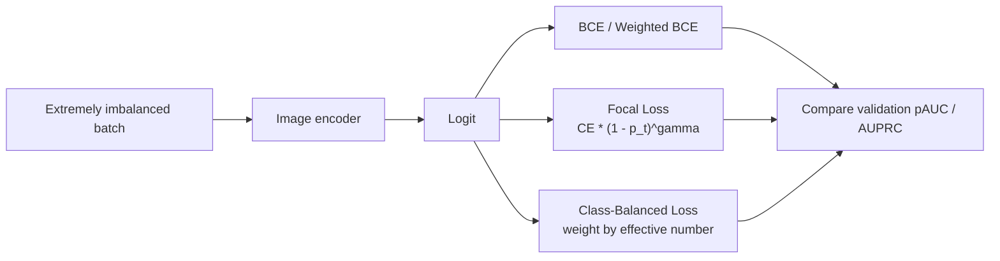
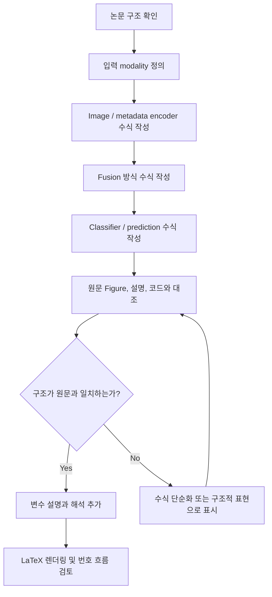

# ISIC 2024 Train-Only Multimodal Literature Review

조사일: 2026-05-04  
주제: ISIC 2024 Kaggle train dataset만 사용한 skin cancer detection 멀티모달 모델 연구를 위한 선행논문 조사  
핵심 조사 대상: dataset 불균형 극복 방법, image-tabular multimodal fusion 방법

---

## 1. 연구 배경

ISIC 2024 Kaggle Challenge는 3D Total Body Photography(3D-TBP)에서 추출한 피부 병변 crop image와 환자/병변 metadata를 함께 제공하는 binary classification 문제이다. 공식 train dataset은 SLICE-3D dataset이며, 총 401,059개 lesion tile로 구성된다.

가장 중요한 특징은 극단적인 class imbalance이다.

| 항목 | 개수 | 비율 |
|---|---:|---:|
| Benign / target 0 | 400,666 | 99.902% |
| Malignant / target 1 | 393 | 0.098% |
| Total | 401,059 | 100% |

따라서 accuracy 중심 평가는 부적절하며, malignant를 놓치지 않는 high-sensitivity 영역의 성능 평가가 중요하다. Kaggle 공식 metric도 `pAUC > 80% TPR`를 사용했다.

ISIC 2024 train dataset의 modality는 크게 두 가지이다.

- Image: 15mm x 15mm field-of-view lesion crop image
- Tabular metadata: age, sex, anatomical site, lesion size/color/shape 관련 WB360 measurements, patient_id, lesion_id, attribution 등

---

## 2. 논문 분석 요약

기존 단일 요약표는 논문 역할, 데이터셋, 모델 구조, 평가 결과가 한 번에 섞여 있어 가독성이 낮음. 아래 표들은 비교 목적별로 분할한 요약임. 긴 설명은 3장의 논문별 상세 분석 파일 참고.

### 2.1 한눈에 보는 논문 역할 요약

| 논문/자료 | 우리 연구에서의 역할 | 핵심 키워드 | 상세 분석 |
|---|---|---|---|
| SLICE-3D Dataset, Scientific Data 2024 | ISIC 2024 train dataset의 1차 근거 | 3D-TBP, ultra-rare malignant, weak label | [3.1](literature_review_papers/3_1_slice_3d_dataset.md) |
| ISIC 2024 Automated Triage, npj Digital Medicine 2025 | Kaggle challenge 결과와 ablation reference | pAUC, WB360, patient-context, GBT late fusion | [3.2](literature_review_papers/3_2_automated_triage_3d_tbp.md) |
| Wang et al., Scientific Reports 2025 | 3D-TBP image + clinical feature late fusion 및 XAI 근거 | XGBoost, SHAP, CAM, nomogram | [3.3](literature_review_papers/3_3_wang_explainable_multimodal_ai.md) |
| MetaBlock, JBHI 2021 | metadata modulation baseline 근거 | scale, shift, gating | [3.4](literature_review_papers/3_4_metablock_metadata_modulation.md) |
| MMF-Net, Frontiers in Surgery 2022 | attention-based fusion baseline 근거 | self-attention, cross-attention | [3.5](literature_review_papers/3_5_mmf_net_cross_attention_fusion.md) |
| Yap et al., Experimental Dermatology 2018 | 초기 multimodal skin lesion classification 근거 | dermoscopy, clinical image, metadata | [3.6](literature_review_papers/3_6_yap_multimodal_skin_lesion_classification.md) |
| Islam et al., Scientific Reports 2026 | patient metadata fusion 및 triage 근거 | patient-separated split, voting, specificity | [3.7](literature_review_papers/3_7_islam_patient_metadata_fusion.md) |
| Nguyen et al., Sensors 2022 | imbalance-aware image + metadata baseline 근거 | class weight, soft-attention, metadata branch | [3.8](literature_review_papers/3_8_nguyen_soft_attention_imbalance.md) |
| Focal Loss 2017 / Class-Balanced Loss 2019 | loss ablation 근거 | focal loss, effective number | [4.2](#42-loss-기반) |
| GAN/Diffusion augmentation 관련 연구 | minority augmentation 후보 | synthetic positive, train-only generation | [4.4](#44-synthetic-augmentation) |

### 2.2 Dataset 및 imbalance 비교

| 논문/자료 | Dataset / task | Imbalance 및 protocol 포인트 |
|---|---|---|
| SLICE-3D Dataset | ISIC 2024 train, 401,059 lesion tiles, binary malignant/benign | malignant 393개, 약 0.098%. 모델 학습 없음 |
| ISIC 2024 Automated Triage | ISIC 2024 Challenge set, binary malignant/benign | class 축소 없음. public/private leaderboard 및 pAUC > 80% TPR 중심 |
| Wang et al. 2025 | ISIC 2024 subset, 1,075 patients, 6-class lesion risk prediction | non-nevus class targeted augmentation. ISIC binary benchmark로 별도 비교 |
| MetaBlock | PAD-UFES-20, ISIC 2019 | weighted cross-entropy 및 stratified 5-fold CV |
| MMF-Net | PAD-UFES-20, 6-class smartphone clinical image + metadata | stratified 5-fold CV 및 on-the-fly augmentation |
| Yap et al. 2018 | 2,917 cases, dermoscopy + macroscopic image + metadata | binary melanoma와 5-class task 별도 평가 |
| Islam et al. 2026 | 39,623 lesions, 19,295 patients, DER/DSLR image + metadata | patient-separated split, augmentation, decision-level voting |
| Nguyen et al. 2022 | HAM10000, 10,015 images, 7 classes | augmentation to 53,573 images 및 class-weighted loss |
| Focal/Class-Balanced Loss | 특정 dataset 고정 없음 | long-tail classification 일반 loss |
| GAN/Diffusion augmentation | 연구별 skin lesion dataset | minority synthetic image 생성. train-only 조건 확인 필요 |

### 2.3 Model 및 fusion 방식 비교

| 논문/자료 | Image branch | Tabular / metadata branch | Fusion 또는 학습 방식 |
|---|---|---|---|
| ISIC 2024 Automated Triage | EVA 2개 + EdgeNeXt ensemble | GBT, WB360, engineered feature, patient-context | NN output vector + metadata를 3개 GBT에 입력 |
| Wang et al. 2025 | HAM10000 transfer learning CNN | clinical feature + XGBoost | CNN probability vector + clinical feature late fusion |
| MetaBlock | CNN backbone의 last feature map | metadata modifier 생성 | feature map scale/shift/gating |
| MMF-Net | ResNet-50 | MLP metadata encoder | intra-modality self-attention + bidirectional cross-attention |
| Yap et al. 2018 | dermoscopic/clinical image CNN | patient metadata | multimodal classifier |
| Islam et al. 2026 | EfficientNet-B2 계열 | 7개 C4C risk factor + C4C risk score | feature concat 후 decision-level majority voting |
| Nguyen et al. 2022 | InceptionResNetV2, MobileNetV3Large + soft-attention | age, gender, localization dense branch | soft-attention output + metadata feature concat |
| Focal/Class-Balanced Loss | 모든 CNN/ViT에 적용 가능 | 해당 없음 | BCE 대체 loss 후보 |
| GAN/Diffusion augmentation | CNN classifier와 결합 가능 | 보통 없음 | train positive 기반 synthetic augmentation 후보 |

### 2.4 평가 지표 및 대표 결과 비교

| 논문/자료 | 주요 metric | 대표 결과 | 해석 |
|---|---|---|---|
| ISIC 2024 Automated Triage | pAUC > 80% TPR, AUC, NNT | pAUC 0.1726/0.2, AUC 0.9668 | private leaderboard 기준 강한 challenge reference |
| Wang et al. 2025 | AUC, recall/F1, pFPR | multimodal AUC > 0.95, pFPR 0.17343 | late fusion + XAI 가능성 제시 |
| MetaBlock | BACC, ACC, AUC | 10개 실험 중 6개에서 최고 BACC | metadata modulation baseline 근거 |
| MMF-Net | BACC, aggregated AUC | BACC 0.775±0.022, AUC 0.947±0.007 | cross-attention fusion 근거 |
| Yap et al. 2018 | binary AUC, multiclass mAP | AUC 0.866 vs 0.784, mAP 0.729 vs 0.598 | early multimodal superiority 근거 |
| Islam et al. 2026 | sensitivity, specificity | voting SEN 99.50±1.18%, SPC 82.72±1.64% | high-sensitivity triage에서 specificity 개선 |
| Nguyen et al. 2022 | AUC, recall/F1, accuracy | abstract 기준 AUC 0.99, F1 0.81 | imbalance-aware loss + attention 근거 |
| Focal/Class-Balanced Loss | task별 metric | long-tailed dataset 성능 개선 보고 | ISIC 2024 loss ablation 후보 |
| GAN/Diffusion augmentation | accuracy, AUC 등 | dataset별 개선 보고 | 보조 실험 또는 ablation 후보 |

### 2.5 우리 연구 적용 시 주의점

| 항목 | 적용 가능성 | 주의점 |
|---|---|---|
| pAUC > 80% TPR | primary metric으로 직접 적용 가능 | 구현 정의, fold-wise reporting, AUC/F1/recall 병행 필요 |
| WB360 appearance metadata | tabular baseline 및 fusion 실험에 중요 | tile-only보다 항상 우수하다는 일반화 금지 |
| patient-context feature | ugly duckling feature 실험 가능 | patient-level split 및 fold-local 계산 필수 |
| image-only baseline | strict single-lesion setting의 핵심 비교군 | external dermoscopy data 사용 여부 분리 필요 |
| late fusion | ISIC 2024 winning solution과 가장 가까운 baseline | image score 생성 과정의 OOF/fold protocol 명시 필요 |
| metadata modulation / cross-attention | proposed multimodal model 후보 | late fusion 대비 ablation 필요 |
| imbalance-aware loss | image branch ablation 후보 | class weight는 train fold에서만 계산 필요 |
| synthetic augmentation | minority positive 보조 실험 후보 | train positive만 사용, artifact 및 overfitting 점검 필요 |

---

### 2.6 모델 구조 수식 공통 notation

이 문서의 모델 구조 수식은 원문 equation을 그대로 옮긴 것이 아니라, 각 논문의 figure, method 설명, 공개 코드 구조를 바탕으로 이해를 돕기 위해 정리한 구조적 표현이다. 원문에 명시된 수식이 아닌 경우에는 논문별로 별도 표시했다.

| 기호 | 의미 |
|---|---|
| `I` | lesion image input |
| `m` | patient 또는 lesion-level metadata vector |
| `z_p` | patient-context feature |
| `h_img` | image encoder가 만든 image embedding |
| `h_meta` | metadata encoder가 만든 metadata embedding |
| `y_hat` | predicted probability 또는 class score |

공통적으로 multimodal skin lesion classifier는 다음처럼 요약할 수 있다.

$$
\begin{aligned}
h_{\text{img}} &= f_{\theta}(I), \\
h_{\text{meta}} &= g_{\phi}(m), \\
h_{\text{fuse}} &= \mathcal{F}(h_{\text{img}}, h_{\text{meta}}, z_p), \\
\hat{y} &= c_{\psi}(h_{\text{fuse}})
\end{aligned}
$$

여기서 식의 각 구성요소는 다음과 같다.

| 구성요소 | 의미 |
|---|---|
| `f_theta` | CNN/ViT 계열 image encoder |
| `g_phi` | MLP/GBDT/tabular encoder |
| `F` | concat, late fusion, metadata modulation, cross-attention 같은 fusion 연산 |
| `c_psi` | 최종 classifier |

---

## 3. 주요 논문별 상세 분석

논문별 상세 분석은 문서 길이를 줄이고 읽기 속도를 개선하기 위해 별도 Markdown 파일로 분리했다. 이 장은 전체 흐름을 빠르게 파악하기 위한 링크 인덱스 역할을 한다.

| 번호 | 논문명 | 핵심 역할 | 상세 분석 링크 |
|---|---|---|---|
| 3.1 | SLICE-3D Dataset | ISIC 2024 train dataset의 공식 데이터셋 근거이며, ultra-rare malignant target, weak benign label, patient-level split 필요성을 정당화하는 1차 자료이다. | [상세 분석](literature_review_papers/3_1_slice_3d_dataset.md) |
| 3.2 | Automated Triage with 3D-TBP | ISIC 2024 challenge metric, metadata/patient-context ablation, image score와 tabular feature late fusion을 직접 뒷받침하는 핵심 baseline reference이다. | [상세 분석](literature_review_papers/3_2_automated_triage_3d_tbp.md) |
| 3.3 | Wang et al. Explainable Multimodal AI | 3D-TBP image-derived prediction vector와 clinical feature를 XGBoost로 결합하는 late fusion 및 SHAP/CAM 기반 설명 가능성 설계의 근거이다. | [상세 분석](literature_review_papers/3_3_wang_explainable_multimodal_ai.md) |
| 3.4 | MetaBlock | metadata가 image feature map을 modulation하는 중간 fusion 구조의 대표 논문으로, 단순 concatenation을 넘어선 fusion baseline 후보이다. | [상세 분석](literature_review_papers/3_4_metablock_metadata_modulation.md) |
| 3.5 | MMF-Net | image branch와 metadata branch 사이의 self-attention 및 cross-attention fusion을 비교 대상으로 설계할 때 사용할 수 있는 선행 연구이다. | [상세 분석](literature_review_papers/3_5_mmf_net_cross_attention_fusion.md) |
| 3.6 | Yap et al. Multimodal Classification | dermoscopy, clinical image, patient metadata 결합이 image-only보다 나은 성능을 보인 초기 multimodal skin lesion classification 근거이다. | [상세 분석](literature_review_papers/3_6_yap_multimodal_skin_lesion_classification.md) |
| 3.7 | Islam et al. Patient Metadata Fusion | patient-separated split, metadata fusion, decision-level voting으로 high-sensitivity triage 성능을 개선한 최근 multimodal triage reference이다. | [상세 분석](literature_review_papers/3_7_islam_patient_metadata_fusion.md) |
| 3.8 | Nguyen et al. Soft Attention + Imbalance | soft attention, metadata branch, class-weighted loss를 함께 사용한 imbalance-aware image-tabular baseline 및 ablation 근거이다. | [상세 분석](literature_review_papers/3_8_nguyen_soft_attention_imbalance.md) |

---

## 4. Dataset 불균형 극복 방법 정리

ISIC 2024 train-only 조건에서 사용할 수 있는 방법은 다음과 같다.

### 4.1 Sampling 기반

- Positive oversampling
- Negative undersampling
- Balanced batch sampler
- patient-level split을 유지한 stratified sampling

장점:

- 구현이 쉽고 image branch 학습에 바로 적용 가능하다.

주의점:

- positive가 393개뿐이므로 단순 oversampling은 overfitting 위험이 크다.
- 동일 patient가 train/validation에 섞이면 leakage가 발생할 수 있다.

### 4.2 Loss 기반

- Weighted BCE
- Focal Loss
- Class-Balanced Loss
- Class-Balanced Focal Loss
- Asymmetric Loss

ISIC 2024에서는 easy negative가 압도적으로 많으므로 focal 계열 loss가 적합하다. 다만 positive가 매우 적어 loss weight를 과도하게 키우면 calibration이 무너질 수 있으므로 validation pAUC와 AUPRC를 함께 확인해야 한다.

#### 참고 Figure. Loss 기반 imbalance 대응 구조

Focal Loss와 Class-Balanced Loss 논문은 skin lesion 전용은 아니지만, ISIC 2024의 extreme imbalance를 다룰 때 loss 설계 근거로 중요하다.

논문 작성 시 권장 사용:

- Focal Loss: easy negative가 압도적으로 많은 상황에서 negative loss contribution을 낮추는 근거
- Class-Balanced Loss: sample 수가 적은 malignant class에 effective number 기반 weight를 주는 근거
- ISIC 2024에서는 accuracy가 아니라 pAUC, AUPRC, sensitivity-specificity trade-off로 비교해야 한다.

### 4.3 Feature engineering 기반

ISIC 2024에서 특히 중요한 방법이다.

- patient별 lesion count
- patient별 feature mean/std
- lesion size/color feature의 patient-wise z-score
- anatomical site별 rank/percentile
- ugly duckling feature: 같은 환자 내에서 얼마나 outlier인지 측정
- WB360 feature interaction
- explainable feature importance: SHAP으로 확인한 `visual_classifier`, `tbp_lv_symm_2axis`, `tbp_lv_color_std_mean` 등

ISIC 2024 Automated Triage ablation에서는 tile-only 변형보다 WB360 appearance metadata-only 변형의 AUC가 높았음. 해석 범위는 해당 winning-solution 구성과 private leaderboard set에 한정 필요.

### 4.4 Synthetic augmentation

- GAN 또는 diffusion으로 malignant image 생성
- train positive만 사용한 lesion-preserving augmentation

주의점:

- 사용자가 "train dataset만 사용"한다고 했으므로 external data나 pretrained generative dataset을 사용하면 연구 조건에서 벗어날 수 있다.
- synthetic image는 artifact가 생길 수 있어 final model보다 ablation 또는 보조 실험으로 사용하는 것이 안전하다.

---

## 5. Multimodal Fusion 방식 정리

### 5.1 Late Fusion

구조:

1. image model을 학습한다.
2. train OOF prediction 또는 image embedding을 만든다.
3. tabular metadata와 image prediction을 합쳐 GBDT 또는 MLP에 입력한다.

장점:

- ISIC 2024 winning solution과 가장 유사하다.
- tabular feature가 강한 데이터셋에 적합하다.
- image branch와 tabular branch를 독립적으로 검증하기 쉽다.

단점:

- end-to-end multimodal model이라고 주장하기는 약하다.

### 5.2 Early Fusion / Concatenation

구조:

1. CNN/ViT image encoder에서 embedding 추출
2. metadata MLP embedding과 concat
3. classifier로 최종 예측

장점:

- 구현이 쉽고 논문 baseline으로 적합하다.

단점:

- image feature와 tabular feature의 scale 차이 때문에 metadata가 무시되거나 과도하게 지배할 수 있다.

### 5.3 Metadata Modulation / FiLM / MetaBlock

구조:

1. metadata encoder가 scale/shift/gating vector를 생성한다.
2. image feature map 또는 embedding을 metadata 조건으로 조절한다.

장점:

- 단순 concat보다 논문 기여로 설명하기 좋다.
- 환자 정보가 image feature extraction 과정에 직접 영향을 줄 수 있다.

단점:

- 구현과 ablation이 필요하다.

### 5.4 Cross-Attention Fusion

구조:

1. image token과 metadata token을 각각 encoder에 통과시킨다.
2. self-attention으로 modality 내부 feature를 정제한다.
3. cross-attention으로 image와 metadata가 서로를 guide하도록 한다.

장점:

- multimodal fusion 기여를 가장 명확히 보여줄 수 있다.
- MMF-Net 등 직접적인 선행연구가 있다.

단점:

- 데이터가 극단적으로 불균형이므로 end-to-end training이 불안정할 수 있다.
- train-only 조건에서는 positive 부족으로 과적합 위험이 크다.

---

## 6. ISIC 2024 Train-Only 논문 실험 설계 제안

### 6.1 권장 모델 구성

최소 실험군:

1. Image-only model
   - EfficientNetV2, ConvNeXt, EVA, EdgeNeXt 중 하나
   - weighted BCE / focal loss / class-balanced focal loss 비교

2. Tabular-only model
   - LightGBM, CatBoost, XGBoost
   - basic metadata + WB360 metadata
   - patient-context feature 포함/제외 ablation

3. Simple multimodal baseline
   - image embedding 또는 image OOF prediction + metadata concat
   - MLP 또는 GBDT classifier

4. Proposed multimodal model
   - MetaBlock/FiLM 또는 cross-attention 기반 fusion
   - patient-context feature를 포함한 tabular branch

5. Explainability layer
   - SHAP으로 tabular/WB360 feature contribution 분석
   - CAM으로 image branch가 주목한 lesion region 확인
   - nomogram 또는 coefficient-based score로 clinical decision support 해석 보강

### 6.2 필수 Ablation

| 실험 | 목적 |
|---|---|
| image-only | image branch의 한계 확인 |
| tabular-only | metadata/WB360 feature의 독립 성능 확인 |
| image + basic metadata | 기본 임상정보 효과 확인 |
| image + WB360 metadata | lesion measurement 효과 확인 |
| image + patient-context feature | ugly duckling feature 효과 확인 |
| concat fusion vs attention fusion | 제안 fusion 방식의 기여 검증 |
| BCE vs focal vs class-balanced focal | imbalance 극복 방법 검증 |
| SHAP/CAM/nomogram 포함 vs 제외 | 성능뿐 아니라 설명 가능성 기여 검증 |

### 6.3 권장 평가 지표

ISIC 2024의 class imbalance를 고려하면 다음 지표를 함께 제시하는 것이 좋다.

- pAUC > 80% TPR
- AUROC
- AUPRC
- sensitivity
- specificity
- F1-score
- balanced accuracy
- NNT@80% sensitivity
- NNT@90% sensitivity

특히 pAUC와 AUPRC를 중심으로 제시해야 한다. accuracy는 참고 지표로만 사용한다.

### 6.4 논문 주장 방향

가능한 논문 메시지:

> ISIC 2024 train dataset은 malignant 비율이 0.098%에 불과한 극단적 불균형 데이터이며, image-only deep learning은 rare malignant detection에서 한계가 있다. 본 연구는 patient-context-aware tabular feature와 lesion image representation을 결합하는 multimodal fusion을 통해 high-sensitivity 영역의 pAUC와 AUPRC를 개선한다.

---

## 6.5 수식 검토 순서도

각 논문에 추가한 모델 구조 수식은 아래 순서로 검토한다. 특히 원문 equation이 아니라 이해용 구조 표현인 경우, figure와 method 설명에 맞는 수준으로 단순화했는지 확인한다.

---

## 6.6 원문 대조 검토 메모

- ISIC 2024 Automated Triage: 원문 Methods는 neural network outputs와 metadata features를 3개 GBT model에 넣고 output을 aggregate한다고 설명하므로, 단일 평균 image score 수식을 GBT ensemble 수식으로 수정했다.
- Wang et al. 2025: 원문 Eq. (1)~(2)의 CNN six-class probability vector + clinical feature vector + XGBoost late fusion 수식을 반영했고, VIF/nomogram logistic scoring은 해석 가능 scoring layer로 구분했다.
- MetaBlock: 원문 Eq. (1)~(7)의 `x_img`, `x_meta`, `x_img_tilde`, `x_meta_tilde`, `T_gate`, `S_gate` 표기로 수정했다.
- MMF-Net: 원문 cross-attention 설명에 맞춰 image-guided/meta-guided 양방향 path의 Query, Key, Value 출처를 수정했고, BACC 설명을 sensitivity-specificity 평균으로 정리했다.
- Islam et al.: 전체 수집 metadata는 22개지만 multimodal fusion 설명은 7개 C4C risk factor와 C4C risk score, 총 8개 feature 중심이므로 본문과 요약표를 구분해 수정했다.
- Nguyen et al.: Soft-Attention은 단순 feature multiplication이 아니라 original feature tensor와 scaled attention feature의 concatenation 구조로 수정했고, abstract 수치와 본문/appendix 수치를 구분했다.

---

## 7. 참고문헌 및 링크

1. Kurtansky, N. R. et al. The SLICE-3D dataset: 400,000 skin lesion image crops extracted from 3D TBP for skin cancer detection. Scientific Data, 2024.  
   https://www.nature.com/articles/s41597-024-03743-w

2. Kurtansky, N. R. et al. Automated triage of cancer-suspicious skin lesions with 3D total-body photography. npj Digital Medicine, 2025.  
   https://www.nature.com/articles/s41746-025-02070-7

3. Wang, Z. et al. Explainable multimodal AI for skin lesion risk prediction via 3D imaging and clinical data. Scientific Reports, 2025.  
   https://www.nature.com/articles/s41598-025-33536-z

4. Pacheco, A. G. C. and Krohling, R. A. An Attention-Based Mechanism to Combine Images and Metadata in Deep Learning Models Applied to Skin Cancer Classification. IEEE JBHI, 2021.  
   https://doi.org/10.1109/JBHI.2021.3062002

5. Ou, C. et al. A deep learning based multimodal fusion model for skin lesion diagnosis using smartphone collected clinical images and metadata. Frontiers in Surgery, 2022.  
   https://www.frontiersin.org/articles/10.3389/fsurg.2022.1029991/full

6. Yap, J., Yolland, W., and Tschandl, P. Multimodal skin lesion classification using deep learning. Experimental Dermatology, 2018.  
   https://doi.org/10.1111/exd.13777

7. Islam, S. et al. Advancing skin cancer detection through deep learning and fusion of patient metadata and skin lesion images. Scientific Reports, 2026.  
   https://www.nature.com/articles/s41598-025-26392-4

8. Nguyen, V. D., Bui, N. D., and Do, H. K. Skin Lesion Classification on Imbalanced Data Using Deep Learning with Soft Attention. Sensors, 2022.  
   https://www.mdpi.com/1424-8220/22/19/7530

9. Lin, T.-Y. et al. Focal Loss for Dense Object Detection. ICCV 2017 / TPAMI 2020.  
   https://pubmed.ncbi.nlm.nih.gov/30040631/

10. Cui, Y. et al. Class-Balanced Loss Based on Effective Number of Samples. CVPR 2019.  
   https://openaccess.thecvf.com/content_CVPR_2019/html/Cui_Class-Balanced_Loss_Based_on_Effective_Number_of_Samples_CVPR_2019_paper.html

11. Goceri, E. GAN based augmentation using a hybrid loss function for dermoscopy images. Artificial Intelligence Review, 2024.  
    https://link.springer.com/article/10.1007/s10462-024-10897-x

12. Souza Jr., L. A. et al. LiwTERM: A Lightweight Transformer-Based Model for Dermatological Multimodal Lesion Detection. SIBGRAPI, 2024.  
    https://doi.org/10.1109/SIBGRAPI62404.2024.10716324
