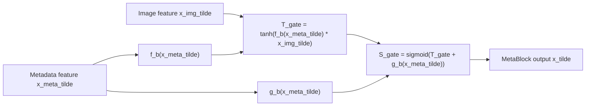
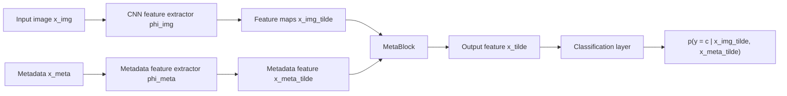

# MetaBlock: An Attention-Based Mechanism to Combine Images and Metadata

## 출처/링크

출처: IEEE Journal of Biomedical and Health Informatics, 2021  
링크: https://doi.org/10.1109/JBHI.2021.3062002
코드: https://github.com/paaatcha/MetaBlock

## 우리 연구에서의 위치

metadata가 image feature map을 modulation하는 중간 fusion 구조의 대표 논문으로, 단순 concatenation을 넘어선 fusion baseline 후보이다.

---

## 주요 Figure
주의: IEEE 원문 Fig. 2와 Fig. 3 이미지는 직접 삽입하지 않는다. IEEE 논문 figure는 별도 재사용 권한이 필요할 수 있으므로, 본 문서에는 원문 구조를 설명하기 위한 자체 schematic을 넣는다. 원본 figure가 꼭 필요하면 DOI 링크 또는 IEEE Xplore에서 확인하고, 최종 논문/학위논문에는 IEEE RightsLink 권한 확인 후 삽입하는 것이 안전하다.

**자체 Figure 2. MetaBlock 내부 구조**

원문 Fig. 2는 비교 구조가 아니라 MetaBlock의 내부 구조를 보여준다. metadata feature에서 `f_b`와 `g_b` modifier를 만들고, image feature map에 hyperbolic tangent gate와 sigmoid gate를 차례로 적용해 block output을 만든다.



**자체 Figure 3. CNN에 삽입된 MetaBlock layer**

원문 Fig. 3은 MetaBlock layer가 CNN model에 attached된 모습을 보여준다. CNN의 last feature maps와 metadata feature가 MetaBlock으로 들어가고, MetaBlock output이 classification layer로 전달된다.



핵심 해석:

- 원문은 image와 metadata를 각각 `x_img`, `x_meta`로 두고, feature extractor를 거친 값을 `x_img_tilde`, `x_meta_tilde`로 설명한다.
- `f_b(x_meta_tilde)`와 `g_b(x_meta_tilde)`는 metadata feature에서 생성되는 modifier coefficient이다.
- Eq. (3)의 MetaBlock output은 `sigmoid(tanh(f_b(x_meta_tilde) * x_img_tilde) + g_b(x_meta_tilde))` 형태이다.
- 이 output은 class probability가 아니라 classification layer로 전달되는 중간 feature map이다.

ISIC 2024 적용 예:

```text
image tile -> ConvNeXt/EfficientNet feature
metadata + WB360 + patient-context -> scale/shift modifier
MetaBlock -> metadata-aware image feature
classifier -> malignant probability
```

## 목표와 기여
skin lesion classification에서 image feature와 patient metadata를 단순 concat하지 않고, metadata feature가 CNN의 last feature maps를 scale/shift/gating하도록 하는 Metadata Processing Block(MetaBlock)을 제안했다.

## Dataset 정보
- Dataset 1: PAD-UFES-20
- PAD-UFES-20 구성: 6-class clinical image + metadata
- Dataset 2: ISIC 2019
- ISIC 2019 구성: 8-class dermoscopy image + metadata

## Imbalance 처리
- 불균형 정도: PAD-UFES-20은 MEL 52개 vs BCC 845개, 약 16:1
- 불균형 정도: ISIC 2019는 DF 239개 vs NV 12,875개, 약 54:1
- class 조절: class 수 조절 없음
- 데이터 조작: common image augmentation 사용, 5-fold CV는 label frequency 기준 stratified
- 학습 조작: class frequency 기반 weighted cross-entropy 사용

## Tabular model
metadata는 feature extractor `phi_meta`를 거쳐 `x_meta_tilde`가 되고, MetaBlock 내부의 `f_b`와 `g_b` single-layer neural network가 image feature map을 조절하는 modifier coefficient를 만든다.

## Image model
EfficientNet-B4, DenseNet-121, MobileNet-v2, ResNet-50, VGG-13 등 CNN backbone의 last feature map layer를 image feature로 사용했다.

## Fusion 방식
intermediate fusion이다. metadata가 CNN feature extraction 과정 중간에 개입해 중요한 visual feature를 강화한다.

## 모델 구조 수식
아래 수식은 원문 Eq. (1)~(7)을 문서용으로 정리한 표현이다. 원문은 image와 metadata를 `x_img`, `x_meta`로 두고, feature extractor를 거친 값을 각각 `x_img_tilde`, `x_meta_tilde`로 설명한다.

$$
\begin{aligned}
\tilde{x}_{\text{img}} &= \phi_{\text{img}}(x_{\text{img}}), \\
\tilde{x}_{\text{meta}} &= \phi_{\text{meta}}(x_{\text{meta}}), \\
f_b(\tilde{x}_{\text{meta}}) &= W_f^{T}\tilde{x}_{\text{meta}} + w_f^0, \\
g_b(\tilde{x}_{\text{meta}}) &= W_g^{T}\tilde{x}_{\text{meta}} + w_g^0, \\
T_{\text{gate}} &= \tanh\left(f_b(\tilde{x}_{\text{meta}}) \odot \tilde{x}_{\text{img}}\right), \\
S_{\text{gate}} &= \sigma\left(T_{\text{gate}} + g_b(\tilde{x}_{\text{meta}})\right), \\
\tilde{x} &= S_{\text{gate}}, \\
\hat{y} &= \operatorname{classifier}(\tilde{x})
\end{aligned}
$$

- `x_img_tilde`: CNN에서 추출한 last feature maps
- `x_meta_tilde`: metadata feature extractor가 만든 metadata feature
- `f_b`, `g_b`: metadata feature에서 modifier coefficient를 만드는 single-layer neural network
- `T_gate`: hyperbolic tangent gate
- `S_gate`: sigmoid gate이자 MetaBlock output feature
- `x_tilde`: `x_img_tilde`와 같은 shape를 유지하는 MetaBlock output

단순 concat baseline은 아래처럼 image embedding과 metadata embedding을 이어 붙이는 형태이다.

$$
h_{\text{concat}} = [h_{\text{img}};\;h_{\text{meta}}]
$$

이에 비해 MetaBlock은 metadata feature `x_meta_tilde`가 CNN feature map `x_img_tilde`의 변환에 직접 들어간다는 점에서 intermediate fusion에 가깝다.

## 평가 지표
- 우선순위 지표: balanced accuracy(BACC)
- 의미: multiclass BACC는 class별 recall의 평균

```text
BACC = (recall_1 + recall_2 + ... + recall_K) / K
```

- binary case: `BACC = (Sensitivity + Specificity) / 2`

## 평가 결과
- 원 논문 비교: CNN-only, concatenation, MetaNet과 비교했으며 10개 실험 중 6개에서 가장 좋은 BACC 보고
- ISIC 2019: MetaBlock은 5개 CNN 중 3개에서 최고 BACC를 보였고, Friedman/Wilcoxon test에서도 차이를 보고
- PAD-UFES-20: MetaBlock은 5개 CNN 중 3개에서 최고 BACC를 보였고, 평균적으로 metadata를 쓰지 않는 baseline보다 높은 성능을 보임
- 참고: 기존 문서에 있던 `BACC 0.77 ± 0.02`, `BACC 0.77 ± 0.01` 같은 단일 대표값은 원문 Table 전체를 단순화한 값이라 본문에서는 제거

## ISIC2024 strict multimodal 연구에 주는 시사점
ISIC 2024 train-only 논문에서 "simple concat vs metadata modulation" 비교 실험의 근거로 적합하다.

## 추가 논의/생각해볼 점
- MetaBlock은 불균형 자체를 해결하는 논문이라기보다 metadata-conditioned fusion 논문이다.
- ISIC 2024처럼 1020:1 수준의 binary imbalance에서는 MetaBlock만으로는 부족하다.
- ISIC 2024 적용 시 balanced sampler, focal/class-balanced loss, pAUC/AUPRC 평가를 함께 설계해야 한다.

---

[메인 문서로 돌아가기](../2026-05-12_isic2024_multimodal_literature_review.md#3-주요-논문별-상세-분석)
