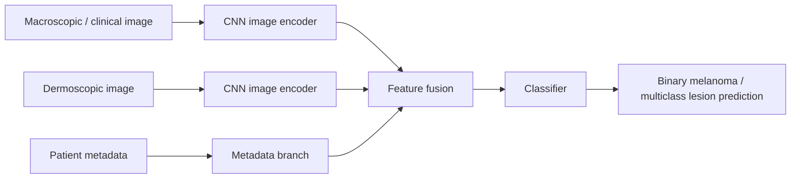

# Yap et al.: Multimodal Skin Lesion Classification Using Deep Learning

## 출처/링크

출처: Experimental Dermatology, 2018  
링크: https://doi.org/10.1111/exd.13777

## 우리 연구에서의 위치

dermoscopy, clinical image, patient metadata 결합이 image-only보다 나은 성능을 보인 초기 multimodal skin lesion classification 근거이다.

---

## 주요 Figure
주의: Wiley 원문 figure는 직접 삽입하지 않고, multimodal concept schematic으로 대체한다.

**자체 Figure. Multiple image modalities + metadata fusion**

핵심 해석:

- 단일 macroscopic image보다 dermoscopy + clinical image + metadata 조합이 더 좋은 성능을 보였다.
- ISIC 2024는 dermoscopy가 없지만, "여러 source의 정보를 결합하면 image-only보다 성능이 좋아진다"는 선행근거로 사용할 수 있다.

## 목표와 기여
하나의 macroscopic image만 사용하는 기존 방식에서 벗어나, dermoscopic image, clinical/macroscopic image, patient metadata를 결합한 multimodal classifier를 제안했다.

## Dataset 정보
- Dataset: 자체 dataset
- Sample 수: 2917 cases
- Modality: dermoscopic image + macroscopic image + patient metadata
- Task: binary melanoma detection, 5-class classification

## Imbalance 처리
- class 조절: binary task와 5-class task를 별도 평가
- 해석: task 목적에 따른 label setting이며, 하나의 binary target에서 class 수를 임의 축소한 것은 아님
- 데이터 조작: imbalance-specific sampling은 핵심 기여로 보고되지 않음
- 학습 조작: imbalance-specific loss는 핵심 기여로 보고되지 않음
- 평가 기반 대응: AUC, mAP 중심 평가

## Tabular model
patient metadata를 multimodal classifier에 포함했다.

## Image model
CNN 기반 image model을 사용했다.

## Fusion 방식
multiple image modalities와 patient metadata를 결합하는 multimodal classifier 구조이다.

## 모델 구조 수식
아래 수식은 dermoscopic image, macroscopic image, patient metadata를 결합하는 multimodal classifier를 이해하기 위한 구조적 표현이다.

$$
\begin{aligned}
h_{\text{derm}} &= f_{\theta_d}(I_{\text{derm}}), \\
h_{\text{macro}} &= f_{\theta_c}(I_{\text{macro}}), \\
h_{\text{meta}} &= g_{\phi}(m), \\
h_{\text{fuse}} &= [h_{\text{derm}};\;h_{\text{macro}};\;h_{\text{meta}}], \\
\hat{y}_{\text{bin}} &= \sigma(w_b^{\top}h_{\text{fuse}} + b_b), \\
\hat{\mathbf{y}}_{\text{multi}} &= \operatorname{softmax}(W_m h_{\text{fuse}} + b_m)
\end{aligned}
$$

- `I_derm`: dermoscopic image
- `I_macro`: macroscopic 또는 clinical image
- `y_hat_bin`: binary melanoma prediction
- `y_hat_multi`: multiclass lesion type prediction

ISIC 2024는 dermoscopy input이 없으므로 직접 적용식은 아래처럼 tile image와 metadata를 결합하는 형태로 단순화된다.

$$
h_{\text{fuse}} = [h_{\text{tile}};\;h_{\text{meta}}]
$$

## 평가 지표
- 우선순위 지표: binary melanoma detection의 AUC
- 우선순위 지표: multiclass classification의 mAP
- mAP: class별 precision-recall curve의 average precision을 계산한 뒤 평균한 값

## 평가 결과
- Binary melanoma detection: multimodal classifier `AUC 0.866`
- Binary baseline: single macroscopic image `AUC 0.784`
- Multiclass classification: multimodal classifier `mAP 0.729`
- Multiclass baseline: `mAP 0.598`

## ISIC2024 strict multimodal 연구에 주는 시사점
피부 병변 진단에서 image + metadata 결합이 image-only보다 우수하다는 초기 근거 논문이다.

## 추가 논의/생각해볼 점
- 여러 image modality가 있는 환경의 연구라 ISIC 2024의 single tile image 상황과는 입력 조건이 다르다.
- metadata가 image-only 성능을 보완한다는 방향성은 ISIC 2024 train-only 연구의 근거로 사용할 수 있다.

---

[메인 문서로 돌아가기](../2026-05-12_isic2024_multimodal_literature_review.md#3-주요-논문별-상세-분석)
