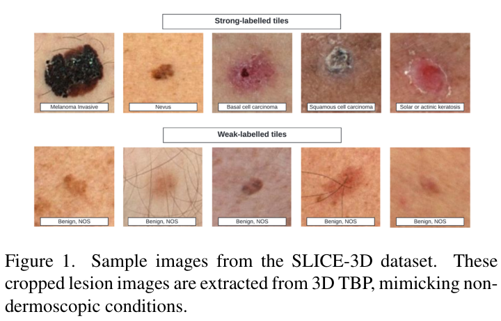
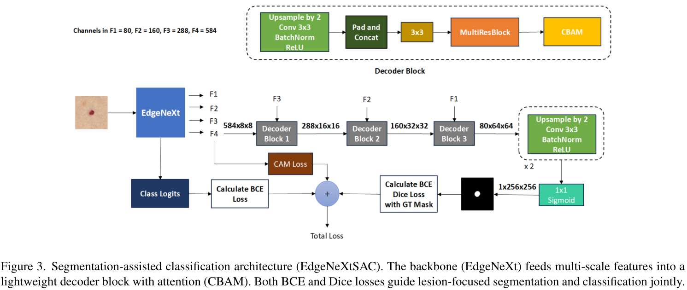
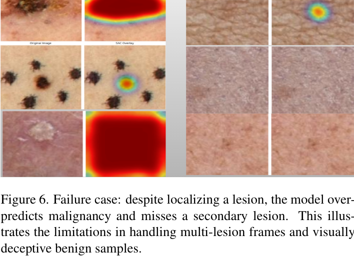

# ISIC 2024 비더모스코피 3D-TBP 이미지에서 설계 메타데이터와 합성 병변을 활용한 Segmentation-Assisted Classification + GBDT 하이브리드 앙상블

원문: Muhammad Zubair Hasan and Fahmida Yasmin Rifat, "Hybrid Ensemble of Segmentation-Assisted Classification and GBDT for Skin Cancer Detection with Engineered Metadata and Synthetic Lesions from ISIC 2024 Non-Dermoscopic 3D-TBP Images", arXiv:2506.03420v1, 2025.

원문 PDF: `2506.03420v1.pdf`

DOI: `10.48550/arXiv.2506.03420`

## 초록

피부암은 전 세계적으로 가장 흔하고 생명을 위협하는 질환 중 하나이며, 조기 발견은 환자 예후에 매우 중요하다. 이 논문은 ISIC 2024의 SLICE-3D 데이터셋을 사용해 악성 및 양성 피부 병변을 분류하는 하이브리드 머신러닝/딥러닝 접근법을 제안한다. SLICE-3D는 3D Total Body Photography(TBP)에서 추출한 401,059개의 cropped lesion image로 구성되며, 비더모스코피이자 스마트폰 촬영과 유사한 조건을 모사한다.

제안 방법은 vision transformer 계열의 EVA02와 convolutional ViT hybrid 계열의 EdgeNeXtSAC를 결합해 robust visual feature를 추출한다. 특히 EdgeNeXtSAC는 segmentation-assisted classification pipeline을 사용해 병변 localization을 강화한다. 이미지 모델 예측은 engineered feature와 patient-specific relational metric을 포함한 GBDT ensemble에 입력되어 최종 분류에 사용된다.

극심한 class imbalance를 완화하고 일반화를 높이기 위해 Stable Diffusion으로 생성한 synthetic malignant lesion을 추가하고, 외부 데이터셋을 3-class format으로 정렬하는 diagnosis-informed relabeling 전략을 적용한다. 평가 지표는 80% TPR 이상 영역의 partial AUC(pAUC)이며, 최고 성능은 다음과 같다.

$$
\mathrm{pAUC} = 0.1755
$$

논문은 하이브리드이면서 해석 가능한 AI 시스템이 telemedicine 및 자원이 제한된 환경의 피부암 triage에 유용할 수 있음을 보여준다.

## 1. 서론

피부암은 전 세계적으로 가장 흔한 암 중 하나이며, 특히 자외선 노출이 높은 지역에서 발생률이 계속 증가하고 있다. 조기 진단은 예후를 크게 개선하지만, 피부과 전문의의 시각 검사와 조직병리 검사는 시간이 오래 걸리고 임상 판단의 변동성을 포함한다. 이런 한계와 환자 수 증가로 인해 자동화된 보조 진단 시스템의 필요성이 커지고 있다.

딥러닝 기반 CAD 시스템은 피부과 영상에서 빠르고 재현 가능한 평가를 제공하며, CNN은 병변 이미지에서 계층적이고 판별적인 특징을 자동 추출할 수 있어 의료 영상 분석의 핵심 방법으로 자리 잡았다. 그러나 피부 병변 분류는 시각적 유사성, class imbalance, 다양한 피부톤 및 촬영 조건에서의 일반화 부족, 해석 가능성 부족이라는 어려움이 있다.

논문의 주요 기여는 다음과 같다.

- segmentation-assisted classification 전략을 도입해 image-based model의 병변 localization과 cancer detection accuracy를 개선한다.
- GBDT와 EVA02, EdgeNeXt 같은 image-based deep model을 결합하는 hybrid ensemble framework를 제안한다.
- lesion-to-patient ratio, outlier score 등 patient-specific relational feature를 분석해 feature space를 풍부하게 만든다.
- Stable Diffusion 기반 synthetic malignant lesion으로 class imbalance를 완화한다.
- 외부 데이터셋을 nevus/melanoma/bkl의 3-class setup으로 재라벨링하는 diagnosis-informed data integration 전략을 사용한다.

## 2. 방법론

### 2.1 Dataset

이 연구는 ISIC 2024 Skin Cancer Detection with 3D-TBP competition의 SLICE-3D 데이터셋을 사용한다. 데이터셋은 3D Total Body Photography 시스템에서 추출한 진단 라벨이 있는 피부 병변 이미지로 구성된다. 이미지는 비더모스코피, 스마트폰 유사 촬영 조건을 모사하며 teledermatology use case와 맞닿아 있다.

데이터셋은 총 401,059개의 cropped lesion image로 구성되며, 각 이미지는 약 $128 \times 128$ pixel 크기의 JPEG 파일이다. CSV metadata에는 다음 정보가 포함된다.

- Patient Demographics
- Lesion Diagnosis Information
- Lesion Location
- Lesion Size & Geometry
- Lesion Shape & Symmetry
- Lesion Location Coordinates
- Lesion Color Information

심각한 class imbalance를 완화하기 위해 training set에 Stable Diffusion으로 생성한 synthetic malignant example을 추가했다. 최종 class distribution은 다음과 같다.

$$
\mathrm{Malignant} = 393\ \mathrm{real\ lesions} + 30{,}228\ \mathrm{synthetic\ lesions}
$$

$$
\mathrm{Benign} = 400{,}666\ \mathrm{lesions}
$$

### 2.2 Overall Approach

제안 방법은 raw image, handcrafted feature, external model prediction을 통합해 robustness와 generalization을 높인다. 전체 pipeline은 synthetic malignant lesion을 real data에 추가하고, 여러 image model을 학습한 뒤, 이들의 probability output을 metadata 및 engineered feature와 concatenate하여 GBDT ensemble을 학습하는 구조다.

## 3. Image-Based Classification

논문은 soft prediction을 만들기 위해 두 가지 image model을 학습한다.

- EVA02
- EdgeNeXt 기반 EdgeNeXtSAC

### 3.1 EVA02

EVA02-small vision transformer를 skin lesion classification을 위한 high-capacity image encoder로 사용한다. ImageNet-22k로 pre-training되고 ImageNet-1k로 fine-tuning된 모델을 benign/malignant binary classification task에 맞게 조정했다.

환자 간 leakage를 방지하기 위해 다음 validation 전략을 사용한다.

$$
3\text{-fold Stratified Group K-Fold}
$$

각 fold는 malignancy class ratio를 보존하면서 train/validation 사이 patient-level disjoint partition을 강제한다. 따라서 같은 환자의 이미지가 train과 validation fold에 동시에 나타나지 않는다.

Class imbalance 완화를 위해 training batch는 benign과 malignant를 1:1 비율로 sampling한다.

$$
\mathrm{benign}:\mathrm{malignant} = 1:1
$$

또한 binary classifier 외에 외부 ISIC competition 데이터로 학습한 3-class classifier도 사용한다. 진단 label은 다음 세 class로 harmonization된다.

- melanoma
- nevus
- bkl, benign keratinocyte lesion

Keratinocyte 관련 병변, 예를 들어 basal cell carcinoma, seborrheic keratosis, solar lentigo, lentigo NOS는 bkl class로 묶었다. 나머지 benign lesion은 nevus category로 재분류했다. 이 3-class classifier의 auxiliary output은 downstream GBDT model의 input feature로 사용된다.

### 3.2 EdgeNeXtSAC

EdgeNeXtSAC는 EdgeNeXt architecture를 dual-head framework로 확장한 Segmentation-Assisted Classifier다. 모델은 shared encoder feature와 task-specific decoder를 활용해 lesion classification과 segmentation을 함께 수행한다.

Encoder는 네 stage의 hierarchical feature map을 추출한다.

$$
F_1,\ F_2,\ F_3,\ F_4
$$

Decoder는 feature map을 점진적으로 upsample한다. 각 Decoder Block은 $2\times$ upsample, $3 \times 3$ convolution, batch normalization, ReLU, skip-connection fusion, MultiResBlock, CBAM을 포함한다. 최종 segmentation output은 $1 \times 1$ convolution과 sigmoid activation을 거쳐 lesion probability map을 만든다.

$$
M_{pred} \in \mathbb{R}^{1 \times 256 \times 256}
$$

## 4. 원문 수식

논문의 total loss $L_{total}$은 세 구성 요소의 합이다.

### 4.1 Classification Loss, BCE

원문 식 (1)은 binary cross entropy classification loss다.

$$
L_{cls}
= -\left[
y \cdot \log(\hat{y})
+ (1-y) \cdot \log(1-\hat{y})
\right]
\tag{1}
$$

여기서 $y \in \{0,1\}$는 true class label이고, $\hat{y}$는 병변이 malignant일 predicted probability다.

### 4.2 CAM Loss, Dice

원문 식 (2)는 classification head의 Class Activation Map(CAM)을 ground-truth segmentation mask와 정렬하는 weakly-supervised Dice loss다.

$$
L_{cam}
= 1 -
\frac{
2\sum M_{cam}\cdot M_{gt}
}{
\sum M_{cam} + \sum M_{gt} + \epsilon
}
\tag{2}
$$

여기서 $M_{cam}$은 normalized CAM이고, $M_{gt}$는 binary ground-truth mask다.

### 4.3 Segmentation Loss, BCE + Dice

원문 식 (3)은 final segmentation output을 pixel-wise BCE와 Dice loss의 합으로 supervised하는 compound loss다.

$$
L_{seg}
= L_{bce}^{mask} + L_{dice}^{mask}
\tag{3}
$$

### 4.4 Total Loss

원문 식 (4)는 전체 training objective다.

$$
L_{total}
= L_{cls} + L_{cam} + L_{seg}
\tag{4}
$$

이 multi-task setup은 classification과 segmentation 사이의 일관성을 강제해, 병변 경계가 미묘하거나 label이 weak한 상황에서도 spatially meaningful region에 집중하도록 유도한다.

## 5. Feature Engineering과 GBDT

저자들은 original metadata를 확장해 174개의 engineered feature를 추가했고, 최종적으로 GBDT 모델에는 214개 input feature가 사용된다.

| Feature Group | Count | Example Feature |
|---|---:|---|
| Raw numeric | 34 | `clin_size_long_diam_mm`, `tbp_lv_H` |
| Raw categorical, one-hot | 6 | `sex`, `anatom_site_general` |
| One-hot categorical features | 47 | categorical indicator features |
| Engineered features | 43 | `lesion_shape_index`, `border_complexity` |
| Patient-normalized features | 76 | `tbp_lv_H_patient_norm`, `lesion_size_ratio_patient_norm` |
| Patient-aggregated metrics | 3 | `count_per_patient`, `tbp_lv_areaMM2_bp` |
| External model predictions | 5 | `predictions_eva`, `predictions_edg` |
| Total | 214 | - |

Feature engineering은 lesion-level 정보와 patient-level context를 함께 포착하도록 설계된다. 주요 feature는 다음과 같다.

- geometric descriptor
- color-based descriptor
- lesion shape index
- hue contrast
- lesion color difference
- patient-normalized feature
- anatomical site 및 patient grouping 기반 aggregate metric
- image-based deep learning model prediction

외부 prediction feature에는 과적합을 막기 위해 Gaussian noise를 주입한다.

$$
\sigma = 0.1
$$

GBDT stage에서는 LightGBM, XGBoost, CatBoost를 사용한다. Cross-validation은 leakage 방지와 patient independence 유지를 위해 stratified GroupKFold를 사용하며, 3개 random seed와 5-fold를 결합해 다음 setup을 만든다.

$$
3 \times 5\text{-fold}
$$

최종 ensemble은 3 model type, 5 fold, 3 seed로 구성된다.

$$
3 \times 5 \times 3 = 45\ \mathrm{GBDT\ models}
$$

최종 classification score는 image model softmax output과 handcrafted tabular feature를 concatenate한 뒤 GBDT ensemble prediction을 aggregate해 생성한다.

## 6. Evaluation Metric

성능 평가는 80% TPR 이상 영역의 partial Area Under the ROC Curve, 즉 pAUC를 사용한다. 이 지표는 high sensitivity가 중요한 임상적으로 의미 있는 ROC 영역에 초점을 둔다.

### 6.1 ROC Curve

ROC curve는 여러 threshold에서 true positive rate와 false positive rate의 trade-off를 나타낸다.

$$
\mathrm{TPR} = \frac{\mathrm{TP}}{\mathrm{TP}+\mathrm{FN}}
$$

$$
\mathrm{FPR} = \frac{\mathrm{FP}}{\mathrm{FP}+\mathrm{TN}}
$$

### 6.2 pAUC Above 80% TPR

원문 식 (5)는 다음과 같다.

$$
\mathrm{pAUC}
=
\int_{0.8}^{1.0}
\mathrm{ROC}(t)\,dt
\tag{5}
$$

여기서 $\mathrm{ROC}(t)$는 ROC curve function이며, 적분은 TPR이 80% 이상인 영역에 대응하는 FPR range에서 계산된다고 설명한다.

pAUC score는 다음 범위로 정규화된다.

$$
\mathrm{pAUC} \in [0.0, 0.2]
$$

## 7. 실험 결과

### 7.1 Image Model Performance

Table 2는 synthetic augmentation 유무에 따른 image-based classifier의 pAUC를 보여준다.

| Model | pAUC |
|---|---:|
| EVA02, real only | 0.1516 |
| EVA02 + Synth | 0.1633 |
| EdgeNeXt, real only | 0.1401 |
| EdgeNeXtSAC, real only | 0.1439 |
| EdgeNeXtSAC + Synth | 0.1576 |

EVA02는 original data만 사용할 때 다음 성능을 보였다.

$$
\mathrm{pAUC}=0.1516
$$

Synthetic malignant lesion을 포함하면 성능이 다음으로 향상된다.

$$
\mathrm{pAUC}=0.1633
$$

EdgeNeXt baseline은 다음 성능을 보였다.

$$
\mathrm{pAUC}=0.1401
$$

Segmentation supervision을 도입한 EdgeNeXtSAC는 다음으로 향상된다.

$$
\mathrm{pAUC}=0.1439
$$

Synthetic malignant sample까지 포함하면 다음 성능에 도달한다.

$$
\mathrm{pAUC}=0.1576
$$

### 7.2 GBDT Ensemble Performance

Table 3은 feature-based GBDT 성능을 보여준다.

| Configuration | pAUC |
|---|---:|
| GBDT Ensemble, raw | 0.1500 |
| + Feature Engineering | 0.1644 |
| + Image Model Probabilities | 0.1755 |

Raw metadata만 사용한 GBDT ensemble은 다음 성능을 보였다.

$$
\mathrm{pAUC}=0.1500
$$

Feature engineering을 적용하면 다음으로 향상된다.

$$
\mathrm{pAUC}=0.1644
$$

최종적으로 image classifier의 softmax probability score를 추가하면 최고 성능에 도달한다.

$$
\mathrm{pAUC}=0.1755
$$

이는 structured metadata, handcrafted feature, deep network의 high-level visual embedding 사이의 시너지를 보여준다.

## 8. Prediction Confidence와 Visualization

Figure 4는 ensemble model의 benign/malignant prediction confidence를 분석한다. 왼쪽 panel은 confidence $\geq 0.5$인 예측에서 true positive와 false positive가 어떻게 분포하는지 보여준다. True positive는 주로 0.6-0.9 confidence range에 나타났고, false positive는 threshold 0.5 근처에 밀집했다. 이는 많은 오류가 low-confidence 영역에서 발생하며 calibration이나 threshold adjustment로 완화될 가능성이 있음을 시사한다.

오른쪽 panel은 전체 prediction confidence distribution을 보여준다. Benign prediction은 0 근처에 뚜렷하게 집중되어 있고, malignant prediction은 0-1 전 범위에 더 넓게 퍼져 있다. 이는 malignant lesion detection이 더 불확실하고 어렵다는 점을 보여준다.

Figure 5는 baseline EdgeNeXt와 proposed EdgeNeXtSAC의 GradCAM++ attention overlay를 비교한다. Baseline model은 diffuse하거나 irrelevant한 영역을 강조하는 경우가 많지만, SAC-enhanced model은 병변 영역에 더 국소적으로 집중한다.

Figure 6은 false positive와 false negative failure case를 보여준다. False positive는 irregular border, dark pigmentation, structural complexity 등 malignant pattern과 유사한 benign feature 때문에 발생한다. False negative는 작고 옅거나 contrast가 낮은 malignant lesion에서 나타나며, 병변이 human eye에도 잘 보이지 않는 경우가 있다.

## 9. Feature Importance

GBDT feature importance 분석에서는 engineered feature가 상위 predictor로 나타났다. 특히 다음 feature들이 중요하게 언급된다.

- `tbp_lv_deltaLBnorm`
- `tbp_lv_eccentricity`
- `tbp_lv_symm_2axis`
- `clin_size_long_diam_mm`
- `age_approx`
- `predictions_eva`
- `predictions_edg`
- `tbp_lv_x`
- `tbp_lv_y`

이는 color asymmetry, geometric irregularity, bilateral symmetry, lesion size, age, image-based softmax output, spatial coordinate가 malignancy prediction에 유용함을 보여준다.

## 10. 결론

이 논문은 class imbalance, 다양한 피부톤에 대한 일반화 부족, 제한된 해석 가능성 등 dermatological AI의 핵심 문제를 다루는 modular framework를 제시한다. 3D-TBP 데이터셋을 사용해 segmentation-assisted classification, metadata-guided feature engineering, Stable Diffusion 기반 synthetic lesion augmentation, CNN/GBDT ensemble learning을 결합했다.

가장 높은 성능은 CNN softmax output을 tabular feature와 결합했을 때 얻어졌다.

$$
\mathrm{best\ pAUC}=0.1755
$$

Segmentation-guided attention은 spatial focus와 explainability를 강화했고, confidence distribution 분석은 benign prediction은 확신도가 높은 반면 malignant prediction은 더 불확실하다는 점을 보여준다. 저자들은 향후 transformer-CNN hybrid, lesion-grounded multimodal attention, class-conditional diffusion, ISIC 및 HAM10000 데이터셋을 포함한 더 넓은 검증으로 확장할 수 있다고 제안한다.

## ISIC2024 프로젝트 관점 메모

이 논문은 ISIC2024/SLICE-3D 기반 image + metadata fusion과 직접 관련되는 참고 논문이다. 특히 다음 아이디어가 현재 프로젝트에 유용하다.

- patient-level split을 명시적으로 사용한다.
- image model probability를 tabular/GBDT feature로 결합하는 late fusion 구조를 사용한다.
- feature engineering과 patient-normalized feature의 강한 기여를 보여준다.
- rare malignant class를 위해 synthetic malignant augmentation을 사용한다.
- EdgeNeXtSAC처럼 segmentation-assisted image classifier를 제안한다.

다만 우리 프로젝트에서 paper-facing 실험으로 사용할 때는 다음을 엄격히 지켜야 한다.

- `iddx_full`, diagnosis text, pathology-derived text는 ordinary inference-time feature로 사용하지 않는다.
- external dataset relabeling과 synthetic malignant lesion은 strict baseline이 아니라 별도 candidate 또는 reference-inspired ablation으로 분리한다.
- class weight, sampler, feature engineering aggregation, scaler, encoder는 fold의 training split에서만 fit해야 한다.
- threshold-dependent metric은 validation threshold만 사용해야 한다.
- 최종 보고에는 pAUC above TPR 0.80, AUC, F1, precision, recall, balanced accuracy를 포함해야 한다.

## 원문 그림과 표 안내

- Figure 1: SLICE-3D sample images, 본문에 삽입됨
- Figure 2: Overall pipeline, 본문에 삽입됨
- Figure 3: EdgeNeXtSAC architecture, 본문에 삽입됨
- Figure 4: Prediction confidence analysis, 본문에 삽입됨
- Figure 5: GradCAM++ localization comparison, 본문에 삽입됨
- Figure 6: Failure cases, 본문에 삽입됨
- Table 1: GBDT feature groups, 본문 표로 반영됨
- Table 2: Image model pAUC, 본문 표로 반영됨
- Table 3: GBDT ensemble pAUC, 본문 표로 반영됨
