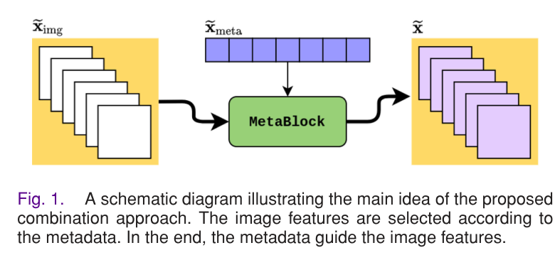
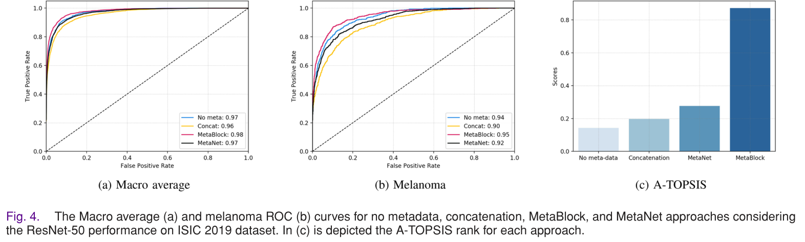
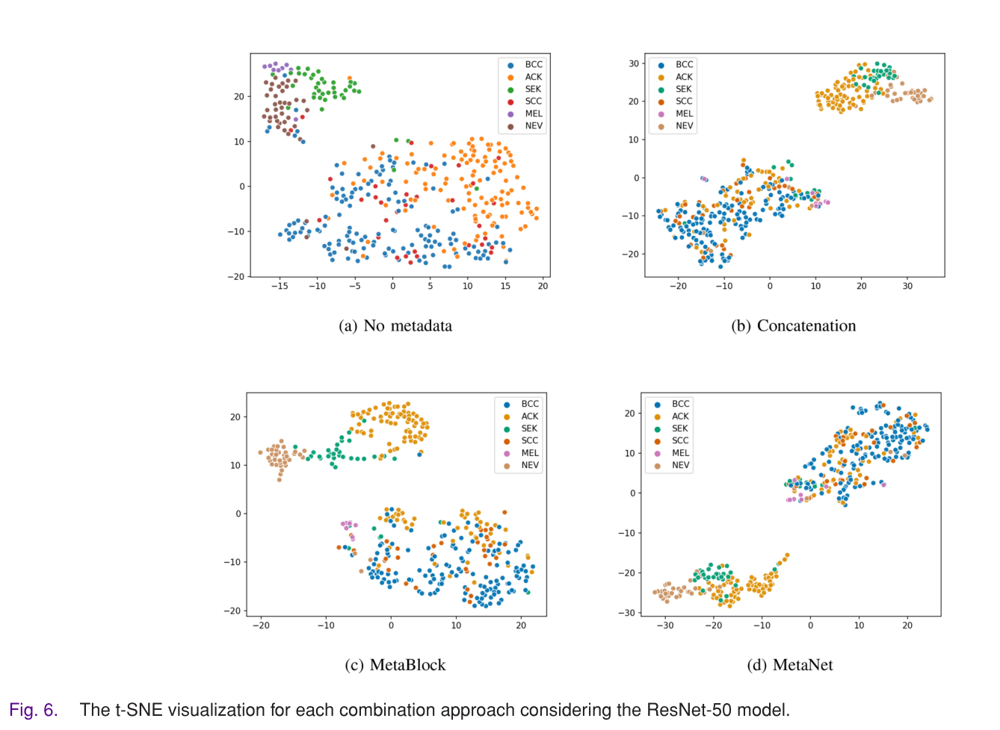
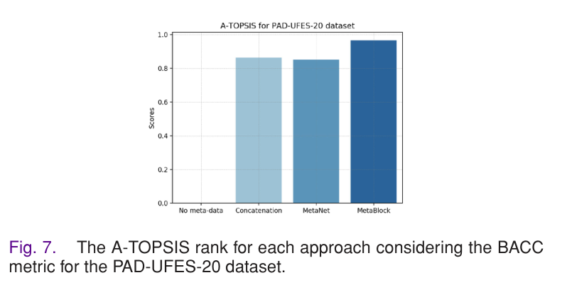

# 이미지와 메타데이터를 결합하기 위한 어텐션 기반 메커니즘: 피부암 분류 딥러닝 모델 적용

원문: Andre G. C. Pacheco and Renato A. Krohling, "An Attention-Based Mechanism to Combine Images and Metadata in Deep Learning Models Applied to Skin Cancer Classification", IEEE Journal of Biomedical and Health Informatics, 2021.

원문 PDF: `An_Attention-Based_Mechanism_to_Combine_Images_and_Metadata_in_Deep_Learning_Models_Applied_to_Skin_Cancer_Classification.pdf`

## 초록

딥러닝 기반 피부암 컴퓨터 보조 진단 시스템은 보통 피부 병변 이미지만으로 예측을 수행한다. 이미지 기반 모델은 유망한 성능을 보이지만, 실제 피부 병변 판독에서 전문가가 고려하는 환자 인구통계 및 임상 정보까지 함께 사용하면 더 높은 성능을 기대할 수 있다.

이 논문은 피부암 분류 딥러닝 모델에서 이미지 특징과 메타데이터 특징을 결합하는 문제를 다룬다. 저자들은 Metadata Processing Block, 즉 MetaBlock이라는 새로운 알고리즘을 제안한다. MetaBlock은 메타데이터를 이용해 이미지에서 추출된 중요한 특징을 강화함으로써 분류를 보조한다.

제안 방법은 두 가지 결합 방식과 비교된다. 하나는 특징 단순 연결(concatenation) 방식이고, 다른 하나는 MetaNet이다. ISIC 2019와 PAD-UFES-20 두 피부 병변 데이터셋에서 실험한 결과, MetaBlock은 테스트한 모든 모델에서 분류 성능을 개선했으며, 10개 시나리오 중 6개에서 다른 결합 방식보다 더 좋은 성능을 보였다.

핵심어: 합성곱 신경망, 데이터 결합, 딥러닝, 피부암 분류

## 1. 서론

세계보건기구에 따르면 피부암은 전 세계에서 진단되는 암의 약 3분의 1을 차지한다. 피부암 발생률은 지난 수십 년 동안 꾸준히 증가해 왔다. 피부암 진단에서 피부과 전문의는 병변을 관찰하고, 환자의 임상 정보를 평가하며, 본인의 경험을 바탕으로 병변을 분류한다.

하지만 정확한 진단은 쉽지 않다. 특히 더모스코피는 육안으로 보이지 않는 형태학적 특징을 볼 수 있게 해 주는 비침습적 진단 기법이지만, 이를 정확히 해석하려면 훈련과 경험이 필요하다. 높은 발생률과 전문가 부족 문제 때문에 피부암 컴퓨터 보조 진단 시스템에 대한 수요가 커지고 있다.

최근 딥러닝, 특히 합성곱 신경망(CNN)은 의료 영상 분석과 피부암 분류에서 표준적인 접근법으로 자리 잡았다. 여러 연구는 CNN이 피부 병변 이미지 분류에서 피부과 전문의와 비슷하거나 더 높은 성능을 낼 수 있음을 보였다. 그러나 대부분의 연구는 더모스코피 이미지에만 기반하며, 환자 인구통계 정보는 충분히 활용하지 않았다.

환자 인구통계 정보 또는 환자 임상 정보는 피부과 전문의가 병변을 평가할 때 참고하는 중요한 단서다. 나이, 해부학적 위치, 암 병력, 피부 포토타입 등은 더 정확한 임상 진단에 도움을 줄 수 있다.

기존 연구들은 이미지와 환자 정보를 함께 사용하려는 시도를 했지만, 대부분 단순 특징 연결 방식을 사용했다. 이 방식은 이미지 특징과 메타데이터 사이의 잠재적 관계를 충분히 고려하지 못할 수 있다. 최근 제안된 MetaNet은 메타데이터에서 계수를 추출해 이미지 특징을 보조하는 곱셈 기반 융합 방식을 사용했지만, 가장 치명적인 피부암인 흑색종 분류 개선에는 한계를 보였다.

이 논문은 이미지와 메타데이터를 딥러닝 모델에서 결합하는 문제를 다루며, MetaBlock이라는 새로운 구조를 제안한다. MetaBlock은 이미지에서 추출된 특징 중 중요한 부분을 메타데이터에 따라 강화한다. 저자들은 이 방법을 ISIC 2019와 PAD-UFES-20 데이터셋에 적용하고, 단순 연결 방식 및 MetaNet과 비교한다.

## 2. 이미지와 메타데이터 특징 결합

정보 융합에서 멀티모달 융합 또는 이종 융합은 서로 다른 출처에서 얻은 여러 종류의 데이터를 결합하는 작업을 의미한다. 멀티미디어 분석에서는 오디오, 비디오, 텍스트를 함께 사용해 감정 인식 등을 수행하는 방식이 널리 연구되어 왔다. 서로 다른 데이터는 상호 보완 정보를 제공할 수 있고, 의사결정 과정의 효과를 높일 수 있다.

멀티모달 융합에는 여러 전략이 있지만, 이미지 처리에서는 특징 수준 융합(feature-level fusion)이 자주 사용된다. 이는 각 데이터 유형에서 추출한 특징을 정해진 방식으로 결합한 뒤, 결합된 특징을 분류기 등에 입력하는 방식이다.

질병 분류, 얼굴 인식, 이미지 검색, 객체 식별처럼 시각적 패턴 차이가 작은 문제에서는 이미지 특징만으로 충분하지 않을 수 있다. 노이즈, 시점, 데이터 분산 등이 성능을 어렵게 만들기 때문이다. 이런 문제를 완화하기 위해 CNN 특징과 수작업 특징, 또는 서로 다른 CNN 아키텍처에서 얻은 특징을 결합하는 방식이 많이 사용되었다.

가장 일반적인 결합 방식은 특징 연결이다. 즉, 여러 특징을 하나의 벡터나 구조로 붙여서 분류기에 입력한다. 이 방식은 단순하고 효과적이기 때문에 널리 쓰인다.

하지만 이미지 특징과 환자 임상 정보처럼 서로 성격이 다른 데이터를 결합하는 경우에는 문제가 조금 다르다. 이미지는 주된 정보원이고, 메타데이터는 이미지 판단을 보조하는 맥락 정보다. 이미지 특징은 고차원인 반면 메타데이터는 상대적으로 저차원이므로, 단순 연결만으로는 메타데이터가 이미지 특징 중 어떤 부분을 강조해야 하는지 모델에 충분히 알려주기 어렵다.

따라서 단순 연결보다 더 나은 결합 방법이 필요하며, MetaBlock은 이 문제를 해결하기 위해 제안된다.

## 3. Metadata Processing Block, MetaBlock

MetaBlock은 메타데이터를 이용해 이미지에서 추출된 feature map을 강화하는 어텐션 기반 메커니즘이다. 기본 아이디어는 LSTM 게이트에서 영감을 받았다. LSTM 게이트처럼 단일층 신경망, 활성화 함수, 원소별 연산을 사용해 어떤 특징을 통과시키고 어떤 특징을 억제할지 결정한다.

분류 문제의 각 샘플은 다음 세 가지로 구성된다고 가정한다.

- 이미지: $x_{img}$
- 맥락 정보를 나타내는 메타데이터: $x_{meta}$
- 레이블: $y \in \{1, \ldots, N_{lab}\}$

논문은 이 문제를 다음 튜플로 표현한다.

$$
\{X_{img}, X_{meta}, Y\}
$$

이미지 특징 추출기는 CNN으로 정의된다. CNN의 마지막 feature map을 이미지 특징으로 사용한다.

$$
\psi_{img} = g_{cnn}(x_{img})
$$

메타데이터 특징 추출기 $\psi_{meta}$는 문제의 데이터 유형에 따라 달라질 수 있으며, 논문에서는 다음 조건만 요구한다.

$$
\psi_{meta}(x_{meta}) \in \mathbb{R}^{d_{meta}}
$$

두 특징 집합은 원문 식 (1)처럼 정의된다.

$$
\begin{aligned}
\tilde{x}_{img} &= \psi_{img}(x_{img}) \\
\tilde{x}_{meta} &= \psi_{meta}(x_{meta})
\end{aligned}
\tag{1}
$$

여기서 이미지 특징은 feature map 형태이고, 메타데이터 특징은 벡터 형태다. 최종 목표는 이미지 특징과 메타데이터 특징이 주어졌을 때 레이블의 확률을 추정하는 것이다.

$$
\tilde{x}_{img} \in \mathbb{R}^{k_{img} \times m_{img} \times n_{img}}
$$

$$
\tilde{x}_{meta} \in \mathbb{R}^{d_{meta}}
$$

여기서 $k_{img}$는 feature map의 개수이고, $m_{img} \times n_{img}$는 각 feature map의 크기다. 최종 목표는 클래스 $c \in \{1, \ldots, N_{lab}\}$에 대해 다음 확률을 추정하는 것이다.

$$
\hat{y} = p(y = c \mid \tilde{x}_{img}, \tilde{x}_{meta})
\tag{2}
$$

MetaBlock의 목표는 메타데이터가 이미지 feature map을 안내하도록 만드는 것이다. 출력 특징은 원래 이미지 feature map과 같은 shape을 가지지만, 메타데이터에 따라 중요한 특징이 강조되도록 수정된다.

핵심 수식은 다음과 같다.

$$
\tilde{x} =
\sigma \left[
    \tanh \left[
        f_b(\tilde{x}_{meta}) \odot \tilde{x}_{img}
    \right]
    + g_b(\tilde{x}_{meta})
\right]
\tag{3}
$$

여기서 $\odot$는 원소별 곱(element-wise product), $\sigma(\cdot)$는 sigmoid 함수, $\tanh(\cdot)$는 hyperbolic tangent 함수다. 논문은 두 활성화 함수를 LSTM gate처럼 동작하도록 설계한다.

$f_b(\tilde{x}_{meta})$와 $g_b(\tilde{x}_{meta})$는 메타데이터를 입력으로 받는 학습 가능한 함수다. 논문에서는 두 함수를 단일층 신경망으로 모델링한다. 이 함수들은 이미지 feature map을 scaling하고 shifting하는 계수를 생성한다. 배치 정규화가 특징의 차원을 유지하면서 값을 변환하는 것처럼, MetaBlock도 이미지 특징의 차원을 유지하면서 메타데이터 기반 변환을 수행한다.

원문 식 (4), (5)는 다음과 같다.

$$
f_b(\tilde{x}_{meta}) = W_f^T \tilde{x}_{meta} + w_{0f}
\tag{4}
$$

$$
g_b(\tilde{x}_{meta}) = W_g^T \tilde{x}_{meta} + w_{0g}
\tag{5}
$$

가중치와 bias의 차원은 다음과 같이 주어진다.

$$
\{W_f, W_g\} \in \mathbb{R}^{d_{meta} \times k_{img}}
$$

$$
\{w_{0f}, w_{0g}\} \in \mathbb{R}^{k_{img}}
$$

따라서 각 함수는 $k_{img}$개의 계수를 반환한다. 논문은 이 계수를 modifier coefficient라고 부르며, 이미지 feature map을 수정해 중요한 특징을 강화하는 가중치로 해석할 수 있다고 설명한다.

MetaBlock은 두 개의 게이트를 사용한다.

### 쌍곡탄젠트 게이트

첫 번째 게이트는 `tanh`를 사용한다. 이 게이트는 scaling 연산 결과에 비선형성을 부여하고, 값을 -1에서 1 사이로 제한한다. 값이 1에 가까우면 해당 특징의 관련성이 높고, -1에 가까우면 반대 의미를 갖는다.

$$
T_{gate} = \tanh \left[
    f_b(\tilde{x}_{meta}) \odot \tilde{x}_{img}
\right]
\tag{6}
$$

### 시그모이드 게이트

두 번째 게이트는 `sigmoid`를 사용한다. 이 게이트는 이전 게이트의 결과를 shift하고, 값을 0에서 1 사이로 출력한다. 특정 특징을 0에 가깝게 만들어 사실상 꺼 버릴 수 있으므로, 최종적으로 가장 관련 있는 특징을 선택하는 역할을 한다.

$$
S_{gate} = \sigma \left[
    T_{gate} + g_b(\tilde{x}_{meta})
\right]
\tag{7}
$$

MetaBlock은 CNN 아키텍처에 독립적이다. CNN의 마지막 feature map 뒤에 붙여 분류층으로 보내는 구조가 기본이지만, 필요하면 분류기 이전의 다른 층으로 연결할 수도 있다. $f_b$와 $g_b$의 가중치는 CNN 전체와 함께 end-to-end backpropagation으로 학습된다.

## 4. 실험 및 결과

저자들은 MetaBlock 성능을 평가하기 위해 다섯 가지 CNN 아키텍처와 두 개의 피부 병변 데이터셋을 사용했다.

사용한 CNN은 다음과 같다.

- EfficientNet-B4
- DenseNet-121
- MobileNet-v2
- ResNet-50
- VGG-13

사용한 데이터셋은 다음과 같다.

- ISIC 2019: 더모스코피 이미지, 나이/성별/해부학적 위치 세 가지 임상 특징, 8개 병변 클래스
- PAD-UFES-20: 스마트폰으로 촬영한 임상 이미지, 나이/성별/해부학적 위치/암 병력/피부 포토타입 등 21개 임상 특징, 6개 병변 클래스

두 데이터셋의 중요한 차이는 이미지 종류와 임상 특징 수다. ISIC 2019는 더모스코피 이미지이며 메타데이터가 3개뿐이다. PAD-UFES-20은 임상 이미지이며 메타데이터가 21개로 더 많다.

비교 대상은 다음 네 가지다.

- 메타데이터를 사용하지 않는 CNN
- 이미지 특징과 메타데이터를 단순 연결하는 방식
- MetaNet
- MetaBlock

모든 모델은 ImageNet 사전학습 가중치를 사용해 초기화하고, ISIC 2019 및 PAD-UFES-20에서 fine-tuning했다. 학습은 PyTorch로 구현되었고, SGD optimizer를 사용했다. 데이터 불균형을 고려해 weighted cross-entropy를 손실 함수로 사용했다. 이미지는 224 x 224로 조정했으며, flip, brightness/contrast/saturation 조정, scaling, random noise 등 일반적인 image augmentation을 적용했다.

평가는 5-fold cross-validation으로 수행했다. 논문은 label frequency 기준 stratified fold를 사용했다고 설명한다. 성능 지표는 accuracy, balanced accuracy, AUC를 사용했고, 데이터가 불균형하므로 balanced accuracy를 주요 지표로 보았다. 방법 비교에는 Friedman test, Wilcoxon test, A-TOPSIS ranking을 사용했다.

> 주의: 이 논문은 ISIC2024 프로젝트의 현재 규칙과 달리 patient-level split 여부를 명시하지 않는다. 우리 프로젝트에서 이 방법을 참고할 때는 반드시 patient_id 기준 분할과 train-only preprocessing을 별도로 보장해야 한다.

## 5. 메타데이터 전처리

두 데이터셋 모두 환자 임상 정보를 메타데이터로 사용했다. ISIC 2019는 세 가지 특징만 포함하고, PAD-UFES-20은 21개 특징을 포함한다.

특징 유형별 처리는 다음과 같다.

- 수치형 특징: 별도의 변환 없이 사용했다. 0에서 1 사이 정규화도 시도했지만 최종 결과 변화가 없었다고 보고한다.
- Boolean 특징: True는 1, False는 0으로 표현했다.
- 문자열/범주형 특징: one-hot encoding을 적용했다. 예를 들어 성별은 male, female, missing에 따라 `[1, 0]`, `[0, 1]`, `[0, 0]`처럼 표현할 수 있다.

ISIC 2019의 세 범주형 특징은 one-hot encoding 후 11차원 메타데이터 벡터가 된다. PAD-UFES-20의 21개 범주형 특징은 81차원 메타데이터 벡터가 된다.

> 주의: 원문은 one-hot encoder를 fold별 training data에만 fit했는지 명확히 설명하지 않는다. 우리 프로젝트에서는 범주형 encoder, imputer, scaler 등 모든 전처리기는 fold의 training split에서만 fit해야 한다.

## 6. ISIC 2019 결과

ISIC 2019에서 저자들은 메타데이터를 사용하지 않은 모델, 단순 연결 모델, MetaNet, MetaBlock을 비교했다. 원문 Table I과 Table II는 각 CNN별 평균 및 표준편차를 제시한다.

핵심 결과는 다음과 같다.

- 환자 임상 특징을 이미지 분류에 함께 사용하면 balanced accuracy 기준 성능이 개선되는 경향을 보였다.
- 특히 MetaBlock은 5개 CNN 중 3개에서 가장 좋은 balanced accuracy를 보였다.
- Friedman test 결과 `p = 0.0011`로 방법 간 차이가 있는 것으로 나타났다.
- Wilcoxon pairwise test에서도 MetaBlock은 다른 방법들과 통계적으로 구분되는 결과를 보였다.
- A-TOPSIS ranking에서도 MetaBlock이 가장 높은 순위를 보였다.
- ResNet-50 기준 ROC curve에서도 MetaBlock이 macro average와 melanoma ROC 모두에서 다른 방법보다 좋은 곡선을 보였다.

ISIC 2019 private test partition에서도 ResNet-50 기준 MetaBlock이 가장 높은 balanced accuracy를 보였다. 다만 private test ground truth는 공개되어 있지 않아 ISIC live challenge platform을 통해 평가했다. 논문은 이 결과가 외부 데이터 없이 단일 모델로 얻은 성능이라고 설명한다.

## 7. PAD-UFES-20 결과

PAD-UFES-20에서도 네 가지 방법을 비교했다. 원문 Table V와 Table VI는 각 모델별 평균 및 표준편차를 제시한다.

핵심 결과는 다음과 같다.

- 메타데이터를 포함하면 모든 지표에서 뚜렷한 성능 향상이 나타났다.
- 메타데이터 사용 모델들의 balanced accuracy는 대략 71.7%에서 77% 범위였다.
- MetaBlock을 적용하면 balanced accuracy가 최소 8.2% 개선되었다고 보고한다.
- ISIC 2019와 마찬가지로 MetaBlock은 단순 연결 및 MetaNet보다 안정적인 성능을 보였다.
- 성능 향상 폭은 ISIC 2019보다 훨씬 컸는데, 이는 PAD-UFES-20이 21개 임상 특징을 제공하기 때문이라고 해석한다.

저자들은 이 차이를 확인하기 위해 PAD-UFES-20에서도 ISIC 2019와 동일한 세 가지 메타데이터, 즉 나이, 성별, 해부학적 위치만 사용해 실험했다. 그 결과 성능 향상 폭은 크게 줄었고, ISIC 2019에서 보인 수준과 비슷해졌다. 이는 추가 임상 특징이 성능 향상에 중요했음을 시사한다.

ResNet-50 기준 confusion matrix 분석에서는 메타데이터가 ACK, MEL, NEV, SEK 진단율을 개선하는 데 도움을 준 것으로 나타났다. 반면 SCC와 BCC 사이의 오분류는 증가했다. 두 병변은 시각적으로도 유사하고 임상 특징 값도 비슷하기 때문에 이런 혼동이 발생한 것으로 해석된다.

t-SNE 시각화에서도 메타데이터 결합 방식은 샘플 clustering을 개선했지만, 비색소성 피부 병변을 구분하는 데는 여전히 어려움을 보였다. 저자들은 SCC와 BCC의 혼동 자체는 둘 다 암이고 조직검사가 필요하므로 큰 문제는 아니지만, 이들을 비교적 가벼운 질환인 ACK와 혼동하는 것이 더 중요한 문제라고 설명한다.

흑색종(MEL)에 대해서는 MetaBlock이 가장 좋은 성능을 보였고, 단순 연결과 MetaNet은 메타데이터를 사용하지 않은 모델 대비 뚜렷한 개선을 보이지 않았다.

Friedman test 결과는 `p ≈ 5 x 10^-11`로 방법 간 차이가 매우 유의했다. Wilcoxon test에서는 MetaNet과 단순 연결을 제외한 모든 pairwise comparison에서 유의한 차이가 있었다. A-TOPSIS ranking 역시 MetaBlock이 가장 높은 순위를 보였다.

## 8. 논의

실험 결과는 메타데이터와 환자 임상 정보가 CNN 기반 피부암 분류 성능을 개선할 수 있음을 보여준다. 하지만 개선 정도는 결합 방식에 크게 의존한다.

ISIC 2019에서는 단순 연결과 MetaNet이 메타데이터 미사용 모델과 통계적으로 유의한 차이를 보이지 않았다. 두 방식은 일부 CNN에서만 성능이 좋았기 때문이다. 반면 MetaBlock은 더 안정적으로 작동했고, balanced accuracy 기준 평균 1% 이상 개선을 보였다.

PAD-UFES-20에서는 세 가지 결합 방식 모두 메타데이터 미사용 모델보다 좋은 성능을 보였다. 그러나 MetaBlock이 가장 좋은 성능과 안정성을 보였다. 특히 흑색종 분류 성능을 개선했다는 점이 중요하다.

VGG-13은 다른 아키텍처보다 balanced accuracy가 낮았다. VGG-13은 마지막 층에서 더 많은 feature map을 출력한다. 이는 MetaBlock이 매우 많은 feature map을 출력하는 네트워크에서는 상대적으로 덜 효과적일 수 있음을 시사한다. EfficientNet-B4나 ResNet-50처럼 더 최근의 모델은 마지막 층 feature map 수가 더 적고, 이 점이 MetaBlock에 유리하게 작용한 것으로 해석된다.

데이터셋별 차이도 중요하다. PAD-UFES-20에서 메타데이터 효과가 훨씬 컸던 이유는 ISIC 2019보다 훨씬 많은 임상 특징을 포함하기 때문이다. 단순 연결 방식은 이런 정보를 안정적으로 활용하지 못할 수 있지만, MetaBlock은 메타데이터를 이미지 feature map 선택과 강화에 직접 사용하기 때문에 더 나은 성능을 보인 것으로 해석된다.

MetaNet에 대해서는, 원 논문이 주로 label별 recall 중심으로 분석했고 통계 검정을 충분히 제공하지 않았다고 지적한다. 이 논문 실험에서는 MetaNet 성능이 CNN 아키텍처에 의존하며, 대부분 단순 연결 방식과 비슷한 수준임을 보였다.

MetaBlock을 CNN에 붙이면 trainable parameter 수가 증가하지만 증가 폭은 작다. PAD-UFES-20 실험에서 가장 영향을 많이 받은 VGG-13도 parameter 수가 약 0.85% 증가하는 수준이었다. 나머지 모델은 증가 폭이 0.05%에서 0.3% 정도로 작았다.

## 9. 결론

이 논문은 이미지에서 추출된 feature map을 메타데이터로 강화하는 어텐션 기반 구조인 MetaBlock을 제안했다. MetaBlock은 피부 병변 이미지와 환자 임상 정보를 결합해 피부암 분류 성능을 높이는 것을 목표로 한다.

저자들은 ISIC 2019와 PAD-UFES-20 두 데이터셋에서 다섯 가지 CNN 아키텍처를 사용해 MetaBlock을 평가했다. 비교 대상은 메타데이터 미사용 모델, 단순 연결 방식, MetaNet이었다.

요약하면 MetaBlock은 두 데이터셋 모두에서 5개 CNN 중 3개 모델의 balanced accuracy 기준 최고 성능을 보였다. 또한 다른 두 결합 방식보다 안정적인 성능을 보였고, 통계 검정에서도 전반적으로 더 나은 방법으로 나타났다.

## ISIC2024 프로젝트 관점 메모

이 논문은 현재 프로젝트의 "image + ordinary inference-time tabular metadata" 방향과 잘 맞는 선행연구다. 특히 MetaBlock은 ordinary tabular metadata를 사용해 image feature map을 조절하는 fusion 방식으로 볼 수 있다.

다만 우리 프로젝트에 그대로 가져올 때는 다음 조건을 반드시 지켜야 한다.

- `iddx_full`, diagnosis text, pathology-derived text는 ordinary metadata로 사용하지 않는다.
- 환자 단위 split을 사용한다. 같은 `patient_id`가 train/validation/test에 동시에 들어가면 안 된다.
- one-hot encoder, imputer, scaler, class weight, sampler, threshold는 fold의 training split에서만 fit하거나 선택한다.
- threshold-dependent metric은 validation에서 선택한 threshold로 test fold에 적용한다.
- pAUC above TPR 0.80, AUC, F1, precision, recall, balanced accuracy를 함께 보고한다.
- MetaBlock류 모델은 `src/isic2024_multimodal/models/fusion/`에 두는 것이 자연스럽다.

## 원문 표와 그림 안내

텍스트 추출 과정에서 표의 수치 값은 안정적으로 추출되지 않아, 이 한글 버전에는 표 캡션과 결과 해석만 반영했다. 정확한 수치는 원문 PDF의 다음 항목을 확인해야 한다.

- Table I: ISIC 2019 전체 성능
- Table II: ISIC 2019 balanced accuracy 비교
- Table III: ISIC 2019 Wilcoxon test
- Table IV: ISIC 2019 private test 성능
- Table V: PAD-UFES-20 전체 성능
- Table VI: PAD-UFES-20 balanced accuracy 비교
- Table VII: PAD-UFES-20에서 세 가지 메타데이터만 사용한 결과
- Table VIII: PAD-UFES-20 Wilcoxon test
- Figure 1-3: MetaBlock 개념 및 구조, 본문에 삽입됨
- Figure 4-7: ROC, confusion matrix, t-SNE, A-TOPSIS 결과, 본문에 삽입됨
