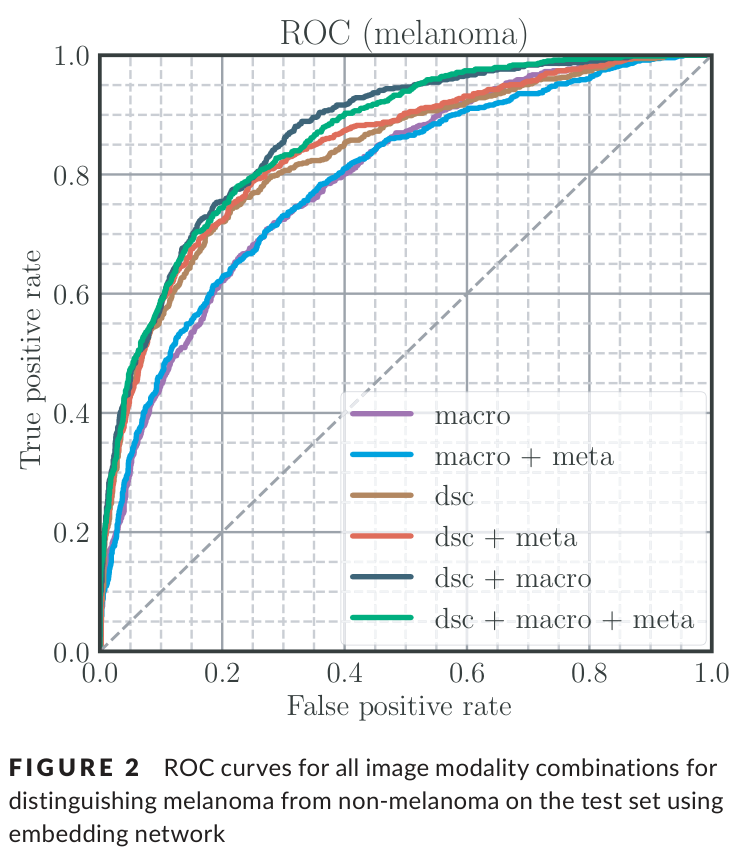
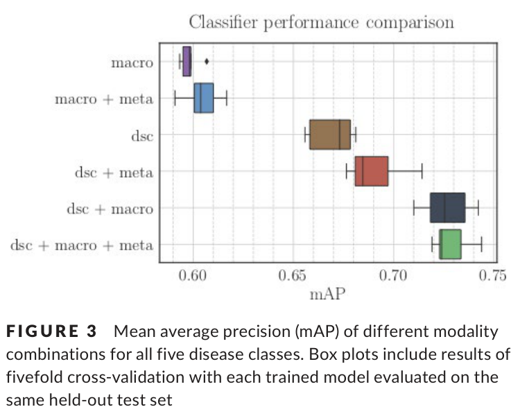

# 딥러닝을 이용한 멀티모달 피부 병변 분류

원문: Jordan Yap, William Yolland, Philipp Tschandl, "Multimodal skin lesion classification using deep learning", Experimental Dermatology, 2018.

원문 PDF: `Experimental Dermatology - 2018 - Yap - Multimodal skin lesion classification using deep learning.pdf`

DOI: `10.1111/exd.13777`

## 초록

합성곱 신경망(CNN)은 피부 병변 분류에 성공적으로 적용되어 왔지만, 기존 연구는 대체로 단일 임상/육안 이미지 또는 단일 더모스코피 이미지에 기반해 이진 결정을 출력하는 경우가 많았다. 이 논문은 여러 영상 modality와 환자 metadata를 함께 결합해 자동 피부 병변 진단 성능을 개선하는 방법을 제시한다.

저자들은 실제 임상 시나리오에 가까운 5-class classification task에서 방법을 평가했다. 더모스코피 이미지와 육안/임상 macroscopic 이미지를 결합하면 단일 macroscopic 이미지만 사용할 때보다 binary melanoma detection과 multiclass classification 모두에서 성능이 향상되었다.

대표 결과는 다음과 같다.

$$
\mathrm{AUC}_{Melanoma}: 0.866 \ \mathrm{vs.}\ 0.784
$$

$$
\mathrm{mAP}: 0.729 \ \mathrm{vs.}\ 0.598
$$

또한 저자들은 더모스코피 이미지가 macroscopic 이미지보다 자동 분류에 더 높은 성능을 제공함을 정량적으로 보였다. 가장 좋은 성능은 더모스코피 이미지, macroscopic 이미지, 환자 metadata를 함께 결합했을 때 얻어졌다.

핵심어: deep learning, dermatology, dermatoscopy, feature fusion, multimodal

## 1. 서론

더모스코피는 피부암 선별에서 표준적인 기술로 여겨지며, 육안 검사보다 높은 진단 정확도를 제공한다. 흑색종은 조기에 발견할수록 사망률을 낮출 수 있기 때문에 민감도를 높이는 것이 중요하다. 반면 편평세포암, 광선각화증, Bowen disease, 기저세포암 같은 keratinocyte cancer는 흑색종보다 훨씬 흔하고, 특히 기저세포암은 진단이 지연되어 진행된 단계에서 치료하면 비용 부담이 크게 증가한다.

Teledermatology와 teledermatoscopy 기반 의뢰 시스템은 정확하고, 의료 시스템 부담과 수술 대기 시간을 줄일 수 있음이 보고되어 왔다. 자동 분류 시스템은 많은 환자를 빠르게 선별하고 고위험 환자를 식별하는 도구가 될 수 있다.

더모스코피 이미지의 자동 분석, 특히 neural network 기반 분석은 오래전부터 연구되어 왔으며, 최근에는 의사와 비교해 유망한 결과를 보였다. 임상 close-up, 즉 macroscopic 이미지도 피부암 진단에 사용할 수 있지만, 여러 질병 클래스를 예측하는 경우 더모스코피보다 낮은 정확도를 보이는 것으로 알려져 있다.

실제 임상에서 피부과 의사는 하나의 이미지만 보고 판단하지 않는다. 더모스코피 이미지, 임상 시야, 환자 정보, 예를 들어 병변 발생 시점, 병변 변화, 대략적인 나이, 성별, 병변 위치 등을 함께 고려한다. 이 논문은 이러한 실제 진단 방식에 맞춰 더모스코피 이미지, macroscopic 이미지, patient-level metadata를 함께 결합하는 network architecture를 제안한다.

## 2. 관련 연구

### 2.1 Macroscopic Image Analysis

Macroscopic 이미지 분류에서는 대규모 온라인 이미지 데이터베이스와 fine-tuning된 CNN을 사용한 연구들이 보고되었다. 일부 연구는 10만 장 이상의 macroscopic 이미지를 수집하고, Inception 계열 네트워크를 학습해 다양한 피부 질환을 구분했다. 다른 연구는 2만 장 이상의 macroscopic 이미지를 사용하고 ResNet-152를 fine-tuning해 의사와 경쟁 가능한 성능을 보고했다.

그러나 더모스코피와 macroscopic 이미지를 함께 본 의사의 정확도가 더 높다는 보고도 있다. 이는 더모스코피가 육안 검사보다 높은 진단 정확도를 제공한다는 기존 결과와 일치한다.

### 2.2 Dermatoscopic Image Analysis

더모스코피 이미지 분류에는 초기부터 neural network가 사용되었고, 이후에는 이미지 전처리, 특징 추출, convolutional neural network 발전, ImageNet 사전학습 모델, ISIC 데이터셋 공개 등이 성능 향상을 이끌었다. ISIC archive는 진단, metadata, segmentation mask와 함께 고품질 이미지를 제공해 자동 피부 병변 분류 연구를 촉진했다.

### 2.3 Modality Fusion

여러 modality를 하나의 framework에 통합하면 neural network가 추가 정보를 활용할 수 있다. Image fusion은 같은 domain 안에서, 또는 semantic information과 metadata처럼 다른 domain 사이에서도 사용된다. 이 논문은 이미지 modality와 metadata를 late fusion 방식으로 결합한다.

## 3. 방법

### 3.1 Dataset

데이터셋의 원래 조직병리 진단은 여러 fine-grained class를 포함하고 있었으며, 피부과 전문의가 수작업으로 더 높은 수준의 disease class로 집계했다. 저자들은 100개 이상의 사례가 있는 disease class만 사용했다.

사용 조건은 다음과 같다.

- metadata가 있는 case
- macroscopic image가 있는 case
- dermatoscopic image가 있는 case
- histopathological diagnosis가 있는 case
- 이미지 품질이 충분하고 식별 가능한 얼굴 특징, 장신구, 의복 등이 없는 case

최종 데이터셋은 2,917개 case로 구성되며, 다섯 클래스를 포함한다.

- naevus
- melanoma
- basal cell carcinoma, BCC
- squamous cell carcinoma, SCC
- pigmented benign keratoses, bkl

저자들은 코가 보이면 BCC를 예측하는 식의 원치 않는 bias를 줄이기 위해 식별 가능한 부위를 제거하려고 했다. 다만 전체 case가 조직병리 진단을 포함하므로, 전문가가 절제 필요성을 판단한 비교적 어려운 case라는 점이 중요하다.

### 3.2 Network Architecture

이미지 특징 추출에는 수정된 ResNet-50을 사용했다. 원래 ResNet-50의 softmax와 1000-dimensional fully connected layer를 제거하고, average pooling layer의 flattened output을 2048-dimensional image feature vector로 사용했다. 논문은 이를 image feature extraction network라고 부른다.

Transfer learning을 사용해 작은 데이터셋에서 발생하기 쉬운 overfitting 문제를 완화했다. 이미지 특징 추출 네트워크의 가중치는 ILSVRC 2015의 1000-way classification task로 사전학습된 모델에서 초기화했다.

여러 modality를 활용하기 위해 late fusion을 사용했다. Fusion 뒤에는 embedding network가 연결된다. Embedding network는 다음으로 구성된다.

- 1024-dimensional fully connected layer 2개
- ReLU activation
- 5-way softmax layer

전체 modality가 있을 때 network는 Figure 1과 같다.

### 3.3 Full Multimodality Classification

세 modality가 모두 있을 때, 즉 macroscopic image, dermatoscopic image, metadata가 모두 있을 때, 네트워크는 두 개의 image feature extraction tower를 사용한다. 하나는 dermatoscopic image용이고, 다른 하나는 macroscopic image용이다.

저자들은 두 tower가 weight를 공유하는 것보다, 각 tower가 독립적인 parameter를 학습하도록 둘 때 더 좋은 성능을 보였다고 설명한다.

Late fusion은 각 이미지가 해당 feature extraction tower를 통과한 뒤 얻은 feature vector와 metadata feature vector를 concatenate하는 방식이다. 논문이 명시적으로 수식화하지는 않았지만, 원문 설명에 맞춰 다음처럼 표현할 수 있다.

$$
f_{fusion} = [f_{dsc}; f_{macro}; f_{meta}]
$$

여기서 $f_{dsc}$는 dermatoscopic image feature, $f_{macro}$는 macroscopic image feature, $f_{meta}$는 metadata feature를 의미한다. 결합된 vector는 embedding network로 전달된다.

### 3.4 Partial Multimodality Classification

하나의 image modality와 metadata만 있을 때는 사용하지 않는 image tower를 제거한다. 예를 들어 dermatoscopic image와 metadata만 있는 경우에는 macroscopic tower를 생략한다.

이 경우 feature 결합은 다음처럼 표현할 수 있다.

$$
f_{fusion} = [f_{dsc}; f_{meta}]
$$

또는 macroscopic image와 metadata만 사용하는 경우에는 다음과 같다.

$$
f_{fusion} = [f_{macro}; f_{meta}]
$$

### 3.5 Single Image Classification

metadata 없이 하나의 image modality만 사용할 때는 이미지를 image feature extraction network에 통과시키고, 얻은 image feature vector를 embedding network로 전달한다.

저자들은 single image classification에서 embedding network를 추가해도 표준 ResNet-50과 비슷한 성능을 보였다고 보고한다.

### 3.6 Evaluation Metrics

모든 클래스에서 높은 분류 성능을 달성하는 것도 중요하지만, 특히 흑색종처럼 사망률이 높은 악성 종양을 정확히 예측하는 것이 더 중요하다. 따라서 저자들은 multiclass 성능과 malignancy detection 성능을 함께 반영하기 위해 다음 지표를 보고했다.

$$
\mathrm{mAP}
$$

$$
\mathrm{Top\text{-}1\ Acc}
$$

$$
\mathrm{AUC}_{Melanoma}
$$

$$
\mathrm{AUC}_{Cancer}
$$

여기서 $\mathrm{AUC}_{Melanoma}$는 melanoma vs non-melanoma를 구분하는 ROC AUC이고, $\mathrm{AUC}_{Cancer}$는 any skin cancer detection에 대한 ROC AUC다.

## 4. 결과

### 4.1 Metadata Only Classification

이미지 없이 metadata만 사용했을 때의 성능을 평가하기 위해, 저자들은 age, gender, body location을 기반으로 diagnosis를 예측하는 random forest classifier를 학습했다. Random forest는 feature importance를 계산할 수 있다는 장점 때문에 선택되었다.

5-fold cross-validation grid search로 parameter를 찾은 뒤, metadata-only random forest는 test set에서 다음 성능을 보였다.

$$
\mathrm{mAP} = 0.402
$$

Feature importance 분석에서는 age와 head/neck/face location이 metadata-only prediction에서 가장 영향력 있는 특징으로 나타났다. Embedding network만 사용한 metadata classification도 시도했지만, $\mathrm{mAP}=0.391$로 약간 낮았다.

### 4.2 Single Image Classification

저자들은 single image tower model이 기존 state-of-the-art와 비교 가능한지 확인하기 위해 ISIC 2017 classification challenge training data로 fine-tuning했다. 학습 후 평균 AUC는 다음과 같았다.

$$
\mathrm{AUC} = 0.858
$$

이는 ISIC 2017 ranked submissions 기준 상위 30% 정도에 해당했다. 저자들은 이 결과를 바탕으로, 이후 실험에서 사용한 단일 이미지 네트워크가 경쟁력 있는 더모스코피 피부 병변 분류 성능을 가진다고 보았다.

### 4.3 Multimodal Network Performance

Table 1은 held-out test set에서 modality 조합별 성능을 보여준다. 값은 5-fold cross-validation의 평균과 표준편차다.

| Network | Modality | $\mathrm{Top\text{-}1\ Acc}$ | $\mathrm{mAP}$ | $\mathrm{AUC}_{Melanoma}$ | $\mathrm{AUC}_{Cancer}$ |
|---|---|---:|---:|---:|---:|
| Random forest classifier | $\mathrm{meta}$ | $0.544\ (0.006)$ | $0.402\ (0.005)$ | $0.634\ (0.010)$ | $0.810\ (0.004)$ |
| CNN, no embedding | $\mathrm{macro}$ | $0.647\ (0.016)$ | $0.598\ (0.009)$ | $0.784\ (0.005)$ | $0.858\ (0.007)$ |
| CNN, no embedding | $\mathrm{macro}+\mathrm{meta}$ | $0.645\ (0.009)$ | $0.603\ (0.012)$ | $0.794\ (0.011)$ | $0.862\ (0.004)$ |
| CNN, no embedding | $\mathrm{dsc}$ | $0.705\ (0.013)$ | $0.682\ (0.015)$ | $0.830\ (0.010)$ | $0.870\ (0.007)$ |
| CNN, no embedding | $\mathrm{dsc}+\mathrm{meta}$ | $0.700\ (0.008)$ | $0.672\ (0.008)$ | $0.832\ (0.005)$ | $0.871\ (0.004)$ |
| CNN, no embedding | $\mathrm{dsc}+\mathrm{macro}$ | $0.716\ (0.012)$ | $0.720\ (0.011)$ | $0.846\ (0.007)$ | $0.888\ (0.005)$ |
| CNN, no embedding | $\mathrm{dsc}+\mathrm{macro}+\mathrm{meta}$ | $0.719\ (0.011)$ | $0.714\ (0.007)$ | $0.849\ (0.010)$ | $0.881\ (0.004)$ |
| CNN, with embedding | $\mathrm{macro}$ | $0.647\ (0.010)$ | $0.598\ (0.005)$ | $0.791\ (0.009)$ | $0.854\ (0.004)$ |
| CNN, with embedding | $\mathrm{macro}+\mathrm{meta}$ | $0.652\ (0.005)$ | $0.604\ (0.009)$ | $0.787\ (0.007)$ | $0.859\ (0.004)$ |
| CNN, with embedding | $\mathrm{dsc}$ | $0.707\ (0.010)$ | $0.669\ (0.010)$ | $0.831\ (0.004)$ | $0.871\ (0.004)$ |
| CNN, with embedding | $\mathrm{dsc}+\mathrm{meta}$ | $0.701\ (0.011)$ | $0.691\ (0.014)$ | $0.840\ (0.008)$ | $0.872\ (0.005)$ |
| CNN, with embedding | $\mathrm{dsc}+\mathrm{macro}$ | $\mathbf{0.721\ (0.007)}$ | $0.726\ (0.012)$ | $\mathbf{0.866\ (0.006)}$ | $\mathbf{0.888\ (0.005)}$ |
| CNN, with embedding | $\mathrm{dsc}+\mathrm{macro}+\mathrm{meta}$ | $0.720\ (0.007)$ | $\mathbf{0.729\ (0.009)}$ | $0.861\ (0.006)$ | $\mathbf{0.888\ (0.002)}$ |

Embedding network 결과를 보면, melanoma vs non-melanoma 구분 성능은 $\mathrm{dsc}$ 단독보다 $\mathrm{dsc}+\mathrm{macro}$ 조합에서 향상되었다.

$$
\mathrm{AUC}_{Melanoma}: 0.831 \rightarrow 0.866
$$

metadata까지 추가한 $\mathrm{dsc}+\mathrm{macro}+\mathrm{meta}$에서는 약간 낮아져 $0.861$을 보였다.

Multiclass classification에서도 더모스코피와 macroscopic 이미지를 결합하면 성능이 향상되었다.

$$
\mathrm{mAP}: 0.669\ (\mathrm{dsc}) \rightarrow 0.726\ (\mathrm{dsc}+\mathrm{macro})
$$

metadata를 추가하면 $\mathrm{mAP}$는 조금 더 올라 $0.729$가 되었다.

$$
\mathrm{mAP}: 0.726\ (\mathrm{dsc}+\mathrm{macro}) \rightarrow 0.729\ (\mathrm{dsc}+\mathrm{macro}+\mathrm{meta})
$$

Confusion matrix 분석에 따르면, macroscopic modality를 추가한 $\mathrm{dsc}+\mathrm{macro}$ 조합은 주로 squamous cell carcinoma 분류에 도움을 주었다. Metadata가 추가된 경우에는 BCC 분류에 도움을 주는 경향이 있었지만, SCC를 BCC로 더 많이 오분류하기도 했다.

## 5. 논의

Radiology에서는 여러 영상이 공간적으로 registration되어 있어 channel-wise fusion을 적용하기 쉬운 경우가 많다. 그러나 이 논문의 modality들은 서로 성격이 다르며, 이미지 registration이 존재하지 않는다. 따라서 저자들은 일부 domain에서 사용되는 pixel-level image fusion이 아니라, feature-level late fusion을 선택했다.

기존 연구는 metadata age, body site, naevus count, dysplastic nevi 비율, melanoma history 등을 neural network-based classifier에 결합해 nevus와 melanoma 구분 AUC를 향상시킨 바 있다. 그러나 이 논문에서는 age, location, sex만 포함한 metadata가 pigmented skin lesion의 정확도를 유의하게 높이지 못했다.

저자들은 melanoma risk를 더 잘 나타내는 임상 속성, 예를 들어 naevus count, atypical nevi, melanoma history 같은 정보가 데이터셋에 없었기 때문에 metadata의 효과가 제한적이었다고 해석한다.

또한 임상 이미지 기반 자동 분석은 이미지 구도, 크기, 조명, 거리의 변동성이 더 크기 때문에 더모스코피 이미지보다 불안정할 수 있다. 이 논문에서는 macroscopic 이미지를 수동으로 crop하지 않았고, 이미지 중앙에서 가장 큰 정사각형 영역을 자동 crop했다. 이런 제한은 실제 임상 적용에서 성능 안정성에 영향을 줄 수 있다.

## 6. 한계

데이터셋은 조직병리로 확인된 case만 포함하므로 verification bias가 존재한다. 이는 머신러닝에는 신뢰할 수 있는 label을 제공하지만, 실제 진료에서 절제되지 않은 benign lesion 분포와는 다를 수 있다.

또한 benign group, 특히 nevi와 bkl에 대한 해석에는 주의가 필요하다. 연구에서 양성으로 분류된 case 중 일부가 $\mathrm{dsc}+\mathrm{macro}$ 모델에서는 악성으로 분류되었지만, 실제로는 이 case들이 충분히 의심스러웠기 때문에 절제된 사례라는 점을 고려해야 한다.

저자들은 향후 연구에서 excision되지 않은 benign lesion, seborrheic keratoses, nevi, angiomas, dermatofibromas 등을 더 포함하고, suspicion 기준으로 stratification하는 것이 필요하다고 제안한다.

## 7. 결론

이 논문은 더모스코피 이미지, macroscopic 이미지, patient metadata를 결합한 multimodal skin lesion classification 방법을 제시했다. 가장 좋은 전반적 성능은 더모스코피와 macroscopic 이미지를 함께 사용하고 embedding network를 적용한 경우에 나타났으며, metadata는 일부 multiclass 성능, 특히 $\mathrm{mAP}$를 소폭 개선했다.

핵심 메시지는 더모스코피 이미지가 macroscopic 이미지보다 강한 신호를 제공하지만, 실제 임상 판단처럼 여러 modality를 결합하면 자동 피부 병변 분류 성능을 개선할 수 있다는 것이다.

## ISIC2024 프로젝트 관점 메모

이 논문은 현재 프로젝트의 `image + ordinary inference-time tabular metadata` 방향과 관련된 초기 multimodal fusion 선행연구다. 다만 ISIC2024 paper-facing 실험에 적용할 때는 다음을 반드시 지켜야 한다.

- row-level split이 아니라 patient-level split을 사용해야 한다.
- 같은 `patient_id`가 train, validation, test fold에 동시에 나타나면 안 된다.
- metadata encoder, imputer, scaler, categorical encoder는 fold의 training split에서만 fit해야 한다.
- `iddx_full`, diagnosis text, pathology-derived text는 ordinary inference-time metadata로 사용하지 않는다.
- metadata는 나이, 성별, 병변 위치 등 inference-time에 사용 가능한 ordinary tabular metadata로 제한한다.
- threshold-dependent metric은 validation에서 선택한 threshold로 test fold에 적용해야 한다.
- ISIC2024 기본 metric에는 pAUC above TPR 0.80, AUC, F1, precision, recall, balanced accuracy를 포함해야 한다.
- 이 논문의 late fusion 구조는 `src/isic2024_multimodal/models/fusion/` 아래의 baseline 또는 비교 대상으로 구현하는 것이 자연스럽다.

## 원문 그림과 표 안내

- Figure 1: Multimodal classification network architecture, 본문에 삽입됨
- Figure 2: Melanoma ROC curves for modality combinations, 본문에 삽입됨
- Figure 3: $\mathrm{mAP}$ box plots for modality combinations, 본문에 삽입됨
- Figure 4: Normalized confusion matrix, 본문에 삽입됨
- Table 1: Modality combination performance, 본문 표로 반영됨
- Figure S1, Table S1, Table S2, Appendix S1: PDF 본문에는 supporting information 안내만 있고 실제 supplement 내용은 포함되지 않아 별도 이미지로 삽입하지 않음
