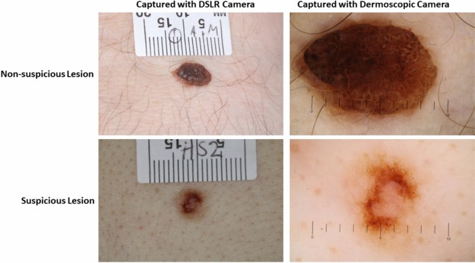
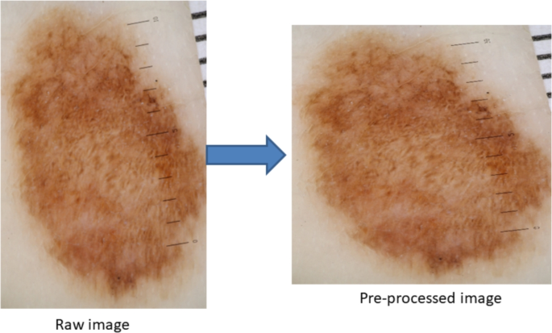
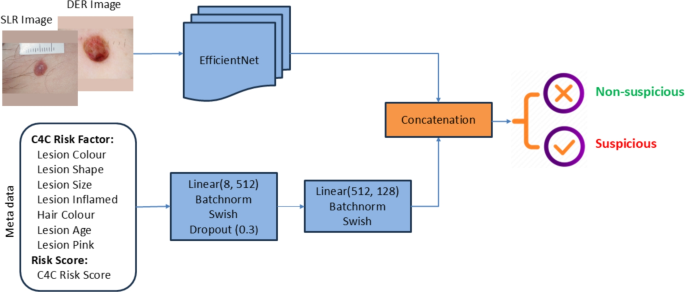
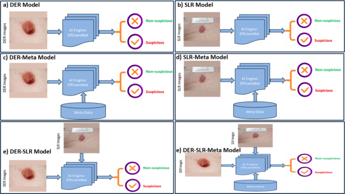
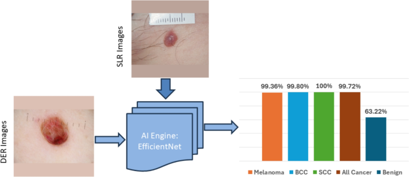
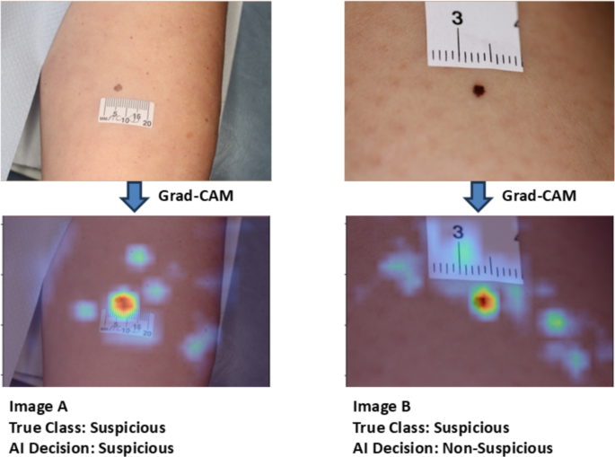
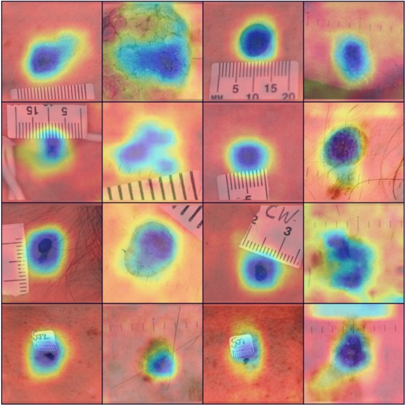

# 환자 메타데이터와 피부 병변 영상의 융합 및 딥러닝을 통한 피부암 탐지 고도화

원문: Shafiqul Islam et al., "Advancing skin cancer detection through deep learning and fusion of patient metadata and skin lesion images", *Scientific Reports*, 2026.

원문 PDF: `s41598-025-26392-4.pdf`  
DOI: `10.1038/s41598-025-26392-4`

## 번역 원칙 안내

이 문서는 원 논문의 본문 흐름을 따라 한국어로 옮긴 Markdown 번역본이다. 그림은 원 논문 공개 HTML/PDF에서 추출한 원본 figure를 사용했고, 표와 수식은 Markdown/LaTeX 렌더링에 맞춰 재작성했다. ISIC2024 Kaggle 연구 설계에 관한 해석은 본문 번역과 섞지 않고 `ISIC2024 연구 코멘트 (번역 아님)` 블록으로만 분리했다.

## 초록

지난 30년 동안 피부암 발생률은 크게 증가했으며, 영국의 NHS와 민간 의료 부문 모두에서 피부 병변 평가를 기다리는 시간도 상당히 길어졌다. 따라서 대기 시간을 줄이고 더 빠르게 의사결정을 하기 위해, 원격피부과 분류 과정에서 피부 병변이 의심 병변인지 비의심 병변인지를 자동으로 분류할 수 있는 방법이 필요하다. 본 연구는 환자 메타데이터와 영상 데이터를 함께 사용해 피부 병변을 의심 또는 비의심 범주로 분류하는 AI 프레임워크를 제안한다.

제안 방법을 평가하기 위해 저자들은 영국 전역의 민간 피부암 진단 센터 네트워크를 방문한 19,295명의 환자로부터 79,246장의 피부 병변 영상과 병변 크기, 병변 색, 병변 형태, 환자 나이, 성별 등 22개의 메타 특징을 수집했다. 피부 병변 분류를 위해 세 종류의 모델을 개발했다. 첫째, 메타데이터만 사용하는 AI 모델은 민감도 $85.24 \pm 2.20\%$, 특이도 $61.12 \pm 0.90\%$를 달성했다. 둘째, 영상만 사용하는 AI 모델은 민감도 $99.72 \pm 1.35\%$, 특이도 $63.22 \pm 3.11\%$를 달성했다. 셋째, 메타데이터와 영상을 함께 사용하는 융합 모델은 민감도 $99.66 \pm 0.28\%$, 특이도 $74.45 \pm 0.80\%$를 달성했다.

또한 개발된 AI 모델들의 의사결정을 다수결 방식으로 융합한 결과, 민감도 $99.50 \pm 1.18\%$, 특이도 $82.72 \pm 1.64\%$를 달성하여 영상 데이터만 사용하는 기존 최신 방법보다 우수한 성능을 보였다. 저자들은 추가로 Grad-CAM과 soft-attention 기반 후처리 단계를 도입해 AI 의사결정의 설명 가능성을 제공하고, 의료진의 정보 기반 의사결정을 지원하고자 했다. 개발된 AI 프레임워크는 의심 피부 병변 탐지에 활용 가능성이 크며, 불필요한 생검 의뢰를 줄임으로써 피부암 진단 및 치료 대기 시간을 단축하고 결과를 개선할 수 있다.

## 약어

| 약어 | 의미 |
|---|---|
| NHS | National Health Service |
| AI | Artificial Intelligence |
| NMSC | Non-melanoma skin cancer |
| BCC | Basal cell carcinoma |
| SCC | Squamous cell carcinoma |
| 7PCL | 7-point checklist |
| ML | Machine learning |
| DL | Deep learning |
| CNN | Convolutional neural network |
| DER | Dermoscopic image |
| SLR | DSLR image |
| C4C | Check4Cancer |
| AUC | Area under the curve |
| ACC | 이 논문에서는 민감도와 특이도의 평균으로 계산된 balanced accuracy |

## 1. 서론

전 세계 흑색종 부담은 2040년에 신규 환자 510,000명과 사망자 96,000명까지 증가할 것으로 예측된다. 한편 비흑색종 피부암은 모든 악성 피부 종양의 약 90%를 차지하며, 기저세포암과 편평세포암을 포함한다. 비흑색종 피부암의 발생은 2007년부터 2017년까지 33% 증가해 전 세계 770만 건에 도달했다. 영국 Cancer Research UK는 영국에서 매년 16,744건의 흑색종과 155,985건의 비흑색종 피부암이 새로 발생한다고 보고하지만, 비흑색종 피부암 수치는 실제보다 낮게 추정된 것으로 널리 인식된다.

피부암 발생이 증가하는 상황에서 피부과 전문의, 전문 피부암 간호사, 원격진료 판독 인력은 국내외적으로 부족하다. COVID-19 팬데믹 기간의 연속적인 봉쇄가 끝난 뒤 피부 병변 평가 및 진단 대기 시간은 크게 늘었다. 따라서 원격피부과 분류 단계에서 병변 분류를 보조하는 고도화된 모델은 피부암 진단과 치료 대기 시간을 줄이는 데 의미 있게 기여할 수 있다.

2000년대 초에는 피부암 진단에 7-point checklist(7PCL)와 같은 전통적 기법이 사용되었으나, 민감도 73.3%, 특이도 57.1% 수준의 중간 정도 성능에 머물렀다. 이후 컴퓨터 기반 피부암 진단 연구는 피부경 영상을 분석해 병변을 분할하고, 형태·질감·색상과 같은 수작업 특징을 추출한 뒤 KNN, SVM 같은 기본 ML 모델을 학습하는 방식으로 발전했다. 공개 데이터셋과 딥러닝 기술이 보급되면서 CNN 기반 영상 분석이 피부 병변 분류 연구의 중심이 되었다.

기존 연구 대부분은 피부 병변 영상에 초점을 맞추었고, 환자 메타데이터와 영상 데이터를 함께 이용한 피부암 탐지는 상대적으로 제한적으로 다루어졌다. 일부 연구는 나이, 성별, 해부학적 위치 같은 제한적 메타데이터를 사용했으나, 환자 메타데이터와 영상 데이터를 결합하는 것이 AI 성능을 얼마나 개선하는지 충분히 강조하지 못했다. 저자들은 이 연구 공백을 메우기 위해 새로 식별한 피부암 위험인자 및 가중 위험점수와 피부 병변 영상을 결합하는 다중모달 AI 프레임워크를 설계했다.

본 연구의 주요 기여는 다음과 같다.

1. 영국 민간 피부 진단 클리닉 네트워크의 19,295명 환자로부터 79,246장의 피부 병변 영상과 메타데이터를 수집·평가했다. 각 병변에 대해 22개 메타 특징과 두 종류의 영상, 즉 피부경 영상(DER)과 DSLR 영상(SLR)을 수집했다.
2. 환자 메타데이터와 피부 병변 영상을 결합하는 다중모달 AI 프레임워크를 개발했다. 입력 데이터 유형을 달리한 모델 중 메타데이터와 영상을 함께 사용하는 모델이 가장 높은 성능을 보였고, 다수결 기반 의사결정 융합은 특이도를 크게 개선했다.
3. Grad-CAM과 soft-attention으로 구성된 후처리 모듈을 추가하여 병변 heatmap을 생성하고, AI 모델이 의사결정 중 어디에 주목하는지 보여줌으로써 설명 가능성을 높였다.

## 2. 방법

### 2.1 데이터 수집

저자들은 2015년부터 2022년까지 Check4Cancer(C4C)의 영국 민간 피부암 진단 클리닉 네트워크를 방문한 19,295명의 환자로부터 39,623개 피부 병변에 대한 79,246장의 영상을 수집했다. 각 병변마다 피부경 카메라로 촬영한 영상 39,623장과 DSLR 카메라로 촬영한 영상 39,623장을 확보했다.

**표 1. 피부 병변 영상 데이터 수집 요약**

| 환자 수 | 병변 수 | 영상 수 | 의심 병변 | 비의심 병변 | 기간 |
|---:|---:|---:|---:|---:|---|
| 19,295 | 39,623 | 79,246 | 11,258 | 67,988 | 2015-2022 |

**그림 1.** 수집된 피부 병변 영상 예시: (a) 비의심 병변, (b) 의심 병변.

**그림 2.** 의심 및 비의심 피부 병변을 촬영하는 데 사용된 두 종류의 카메라, 즉 피부경 카메라와 DSLR 카메라. 본 연구에서는 총 79,246장의 피부 병변 영상과 대응 환자 메타데이터를 분석했다.

각 병변은 원격피부과 분류 단계에서 사내 피부암 전문가에 의해 시각적으로 평가되었다. 판독자는 모두 피부암 수술의이며, 15년 이상의 원격진료 판독 경험과 피부암 진단 연구 경험을 보유했다. 전문가들은 크기, 형태, 색상 또는 피부경 소견에서 흑색종의 비정형 특징을 보이는 색소성 병변을 의심 병변으로 분류했다. 모든 모델에는 배치 크기 32가 사용되었다.

### 2.2 데이터 전처리

저자들은 원본 피부 병변 영상에서 털이 병변 영역과 피부색을 가려 모델 성능을 떨어뜨릴 수 있다고 판단했다. 이를 완화하기 위해 Bardou 등의 털 제거 방법을 적용했다. 이 방법은 털 제거에는 효과적이지만, 시각적으로 복원 영상의 품질이 일부 낮아지는 절충이 있었다.

**그림 3.** 털 제거 후 피부 병변 영상의 재구성 결과.

수집된 원본 영상은 평균 약 5MB, 해상도 약 $3000 \times 4000$ 픽셀이었다. EfficientNet에 입력하기 위해 영상을 $1024 \times 1024$ 픽셀로 재구성했다. 단순 리사이즈는 병변 형태 왜곡을 초래할 수 있어, 저자들은 병변 비율을 보존하는 padding 기반 재구성 방식을 시험했다.

**그림 4.** 피부 병변 영상 재구성. 원본은 3.39MB, $2848 \times 4273$ 픽셀이며, 전처리 후 187KB, $1024 \times 1024$ 픽셀이 된다. 단순 리사이즈 후 병변 형태가 왜곡될 수 있음을 시각적으로 확인했다.

**그림 5.** 영상 재구성에 사용한 padding 접근법. 하나는 각 영상의 대표 피부색 픽셀값으로 padding을 채우는 방식이고, 다른 하나는 검은색 $(0,0,0)$ padding을 사용하는 방식이다.

### 2.3 AI 모델 개발

원본 영상은 $1024 \times 1024$로 재구성되었고, 메타데이터는 문자열 값을 명목형 값으로 인코딩한 뒤 AI 모델 입력으로 사용되었다. C4C 위험인자, C4C 위험점수, 피부 병변 영상은 모두 모델 입력으로 들어가며, 모델은 입력이 의심 또는 비의심 그룹에 속하는지 판단한다.

**그림 6.** 메타데이터(C4C 위험인자와 C4C 위험점수) 및 영상을 기반으로 의심/비의심 피부 병변을 분류하는 제안 AI 프레임워크.

저자들은 EfficientNet 계열 모델을 사용했다. EfficientNet은 네트워크의 폭, 깊이, 해상도를 고정 비율로 함께 조정하는 compound scaling 전략을 사용한다. 이는 한 차원만 키우는 기존 확장 방식보다 효율적으로 성능을 개선할 수 있다.

**그림 7.** EfficientNet의 compound scaling 개념. (a)는 기준 네트워크, (b)-(d)는 폭·깊이·해상도 중 하나만 키우는 기존 확장, (e)는 세 차원을 고정 비율로 함께 확장하는 방식이다.

### 2.4 다중모달 데이터 융합

제안 접근의 핵심 장점은 79,246개 영상에 대응하는 메타데이터가 존재한다는 점이다. 이 메타데이터에는 7개의 C4C 위험인자와 전체 C4C 위험점수로 구성된 8개 특징이 포함된다. 저자들은 이전 연구에서 7개의 C4C 위험인자와 C4C 위험점수의 식별 방법을 설명했다.

**그림 8.** 메타데이터와 영상 데이터를 결합해 AI 프레임워크를 만드는 방식. 여기서 `Swish`는 활성화 함수이고, `concat`은 영상 벡터와 메타데이터 벡터의 결합을 의미한다. 결합 뒤 dropout ratio 0.5의 선형 dropout 층을 거쳐 최종 feature map을 만들고, 의심/비의심 범주를 분류한다.

저자들은 입력 데이터 유형을 바꾸어 여섯 개 모델을 구성했다.

- `EfficientNet-B2-DER`: 피부경 영상만 사용
- `EfficientNet-B2-SLR`: DSLR 영상만 사용
- `EfficientNet-B2-DER-Meta`: 피부경 영상과 메타데이터 사용
- `EfficientNet-B2-SLR-Meta`: DSLR 영상과 메타데이터 사용
- `EfficientNet-B2-DER-SLR`: 피부경 영상과 DSLR 영상 사용
- `EfficientNet-B2-DER-SLR-Meta`: 피부경 영상, DSLR 영상, 메타데이터 사용

**그림 9.** 환자 메타데이터와 피부 병변 영상을 결합하는 다중모달 AI 프레임워크. 입력 조합을 달리하여 (a) DER, (b) SLR, (c) DER+metadata, (d) SLR+metadata, (e) SLR+DER, (f) SLR+DER+metadata 모델을 개발했다.

### 2.5 데이터 분할과 평가 지표

79,246장의 피부 병변 영상은 학습 80%, 테스트 20%로 나뉘었다. 환자 단위 정보가 학습과 테스트에 동시에 들어가지 않도록, 같은 환자의 영상과 메타데이터는 학습 또는 테스트 중 한쪽에만 배정했다. 학습 데이터로 모델을 만들고 hyperparameter를 조정했으며, 선택된 모델은 테스트 데이터로 평가했다.

> **ISIC2024 연구 코멘트 (번역 아님)**
> 이 내용은 원문 번역이 아니라, ISIC2024 Kaggle 멀티모달 연구 설계에 참고할 점을 정리한 주석이다.
> 이 논문은 환자 단위 leakage 방지를 명시한다는 점에서 참고할 가치가 있다. 다만 우리 프로젝트에서는 단순 80/20 holdout이 아니라 fold별 patient-level split, fold별 train-only preprocessing, validation 기반 threshold 선택, test fold 최종 보고를 고정해야 한다.

성능은 민감도, 특이도, 논문에서의 ACC, AUC로 평가했다.

$$
\mathrm{Sensitivity} = \frac{TP}{TP + FN}
\tag{1}
$$

$$
\mathrm{Specificity} = \frac{TN}{FP + TN}
\tag{2}
$$

$$
\mathrm{ACC} = \frac{SEN + SPC}{2}
\tag{3}
$$

$$
\mathrm{AUC} = P\left(Score(TP) > Score(TN)\right)
\tag{4}
$$

## 3. 결과 및 논의

### 3.1 메타데이터만 사용한 경우

저자들은 병변 분홍색, 병변 크기, 병변 색, 병변 염증, 병변 형태, 병변 나이, 자연 모발색으로 구성된 7개의 주요 위험인자를 `C4C risk factors`로 정의했다. 이 위험인자들은 흑색종뿐 아니라 주요 피부암 세부 유형 전반과 관련된다.

**표 2. 메타데이터만 사용한 AI 모델 성능**

| 방법 | 위험인자 | 민감도 | 특이도 | ACC | AUC |
|---|---|---:|---:|---:|---:|
| 7 C4C 위험인자 | 병변 색, 병변 형태, 병변 크기, 병변 염증, 모발색, 병변 나이, 병변 분홍색 | 80.46% | 62.09% | 71.27% | 70.13% |
| 7 C4C 위험인자 + 11개 외부 특징 융합 | 병변 크기, 색, 형태, 7mm 초과 여부, 염증, 진물, 가려움, 분홍색, 병변 나이, 환자 나이, 성별, 병변 신체 부위, 점 수, Williams 점수 등 | 85.24% | 61.12% | 73.18% | 74.15% |

이전 메타데이터 기반 연구에서 C4C 위험인자는 의심 병변 탐지에 대해 민감도 $80.46 \pm 2.50\%$, 특이도 $62.09 \pm 1.90\%$를 보였다. 7개 C4C 위험인자에 11개 외부 위험인자를 결합했을 때 가장 좋은 성능이 나타났으며, 민감도는 $85.24 \pm 2.20\%$, 특이도는 $61.12 \pm 0.90\%$였다.

### 3.2 영상 데이터만 사용한 경우

영상 데이터만 사용한 모델은 전체 피부암 탐지에서 민감도 $99.72 \pm 1.35\%$, 특이도 $63.22 \pm 3.11\%$를 달성했다. 세부적으로 흑색종은 $99.36 \pm 0.72\%$, SCC는 $100 \pm 0\%$, BCC는 $99.80 \pm 0.30\%$의 탐지 성능을 보였다. 그러나 양성 또는 비악성 사례의 올바른 분류 성능은 상대적으로 낮았다.

**그림 10.** 영상 데이터만 사용한 AI 기반 모델의 성능.

### 3.3 영상과 메타데이터 융합

환자 메타데이터와 영상을 융합한 모델은 전체 피부암 탐지에서 민감도 $99.66 \pm 0.28\%$, 특이도 $74.45 \pm 0.80\%$를 달성했다. 영상만 사용한 모델과 비교하면 특이도가 $63.22 \pm 3.11\%$에서 $74.45 \pm 0.80\%$로 증가했으며, 이는 양성 병변을 올바르게 분류하는 능력이 크게 향상되었음을 의미한다.

**그림 11.** 환자 메타데이터와 영상을 융합한 AI 모델의 성능.

**표 3. 입력 조합별 개별 모델 성능 비교**

| 모델 | 테스트 입력 | 민감도 | 특이도 | ACC | AUC |
|---|---|---:|---:|---:|---:|
| EfficientNet-B2-DER | DER images | 99.50% | 63.06% | 81.28% | 89.43% |
| EfficientNet-B2-SLR | SLR images | 95.48% | 63.51% | 79.50% | 87.91% |
| EfficientNet-B2-DER-Meta | DER images + metadata | 99.50% | 74.73% | 87.15% | 92.20% |
| EfficientNet-B2-SLR-Meta | SLR images + metadata | 99.33% | 72.25% | 85.79% | 91.41% |
| EfficientNet-B2-DER-SLR | DER images | 99.83% | 69.95% | 84.89% | 90.53% |
| EfficientNet-B2-DER-SLR | SLR images | 99.67% | 57.25% | 78.46% | 87.06% |
| EfficientNet-B2-DER-SLR-Meta | DER images + metadata | 99.83% | 77.71% | 88.77% | 92.98% |
| EfficientNet-B2-DER-SLR-Meta | SLR images + metadata | 99.50% | 71.20% | 85.35% | 91.19% |

### 3.4 AI 의사결정 융합

저자들은 테스트 입력에 대한 여러 AI 모델의 결과를 다수결로 융합했다. 가장 좋은 균형을 보인 조합은 `EfficientNet-B2-DER-SLR`과 `EfficientNet-B2-DER-SLR-Meta`의 의사결정을 융합한 경우였고, 특이도는 단일 최고 모델의 $77.71 \pm 0.66\%$에서 $82.72 \pm 1.64\%$로 개선되었다.

**표 4. 개별 최고 모델과 AI 의사결정 융합 성능 비교**

| 모델 | 테스트 입력 | 민감도 | 특이도 | ACC | AUC |
|---|---|---:|---:|---:|---:|
| EfficientNet-B2-DER-SLR-Meta | DER images + metadata | 99.83% | 77.71% | 88.77% | 92.98% |
| Fusion: EfficientNet-B2-DER-SLR + EfficientNet-B2-DER-SLR-Meta | SLR images / DER images + metadata | 99.50% | 82.72% | 91.11% | 94.06% |
| Fusion: 3-model variant | SLR images / DER images / DER images + metadata | 100.00% | 75.38% | 87.69% | 92.40% |
| Fusion: 4-model variant | DER images + metadata / SLR images + metadata / DER images / DER images + metadata | 99.66% | 80.12% | 89.89% | 93.55% |
| Fusion: 5-model variant | SLR images + metadata / DER images + metadata / SLR images + metadata / DER images / DER images + metadata | 99.83% | 75.88% | 87.86% | 92.55% |

> **ISIC2024 연구 코멘트 (번역 아님)**
> 이 논문의 decision fusion은 우리 프로젝트에서 late fusion baseline으로 비교할 수 있다. 다만 leaderboard나 test fold를 이용해 ensemble 조합을 고르면 paper-valid하지 않다. Ensemble 구성과 threshold는 validation에서만 선택하고, test fold에는 고정된 설정을 적용해야 한다.

### 3.5 벤치마킹

제안 모델은 Skin Analytics 및 Cochrane 데이터베이스의 체계적 문헌고찰 기반 지표와 비교되었다. C4C 모델은 흑색종, BCC, SCC 및 전체 피부암 탐지에서 높은 민감도를 보였고, 특이도를 80%로 고정한 비교에서도 경쟁력 있는 성능을 유지했다.

**표 5. Skin Analytics 및 Cochrane 결과와의 벤치마킹**

| 병변 유형 | HCP, 80% 고정 특이도 | Skin Analytics | C4C(본 연구) | C4C, 80% 고정 특이도 |
|---|---:|---:|---:|---:|
| Melanoma | - | 95% | 99.37% | 98.10% |
| BCC | - | 98% | 99.50% | 98.79% |
| SCC | - | 97% | 100% | 100% |
| All skin cancer | 96% | 97% | 99.66% | 98.75% |
| Benign | 80% | 73% | 74.45% | 80.37% |
| AUC | - | - | 85.61% | 89.12% |

### 3.6 AI 의사결정 설명 가능성

저자들은 EfficientNet-B2의 마지막 층에서 Grad-CAM heatmap을 생성해 모델이 병변 영역에 제대로 초점을 맞추는지 확인했다. 한 예에서 모델은 영상 A를 올바르게 분류했으나 영상 B는 잘못 분류했다. heatmap을 확인하자 모델이 병변 주변의 자(ruler) 같은 artifact에 큰 주의를 기울인 것이 오분류 원인으로 보였다.

**그림 12.** Grad-CAM을 이용해 EfficientNet-B2 마지막 층에서 생성한 heatmap. 모델이 올바른 병변 영역에 집중하는지 확인한다.

저자들은 이런 artifact 문제를 줄이기 위해 scaled dot-product attention 기반 soft-attention 모듈을 도입했다. 목적은 모델이 병변 영역에 더 집중하고, 자와 같은 불필요한 artifact를 무시하도록 유도하는 것이다.

**그림 13.** Scaled dot-product attention을 도입해 모델이 정확한 병변 영역에 집중하고 artifact를 무시하도록 유도하는 방식.

### 3.7 한계

저자들은 몇 가지 한계를 제시한다. 첫째, 본 연구의 ground truth는 모든 사례에서 생검 결과가 아니라 사내 전문가가 의심/비의심으로 평가한 병변 등급을 사용했다. 생검 결과는 일부 이용 가능했지만, 저자들은 다양한 피부암 subtype을 모두 탐지하는 AI 프레임워크 개발에 초점을 맞추었다. 둘째, 연구 데이터는 Check4Cancer 네트워크에서 수집된 영국 환자 데이터이며, 다른 인구집단·촬영 조건·의료 환경에서의 외부 검증이 필요하다. 셋째, Grad-CAM과 soft-attention은 모델의 주목 영역을 설명하는 데 도움을 주지만, 그 자체가 임상적 인과 설명을 보장하지는 않는다.

> **ISIC2024 연구 코멘트 (번역 아님)**
> 이 한계는 우리 논문에서 claim discipline에 특히 중요하다. ISIC2024 실험 결과도 patient-level leakage audit, fold-wise 결과, metric 정의, config path, split source가 없으면 “paper-ready”라고 쓰면 안 된다. 또한 attention heatmap은 보조 해석 자료이지, 진단 근거를 임상적으로 증명한 자료로 표현하면 안 된다.

## 4. 결론

환자 메타데이터와 피부 병변 영상으로 구성된 다중모달 데이터를 고도화된 AI 기법과 결합하는 방식은 원격피부과 분류 단계에서 의심 피부 병변을 조기에 탐지하는 데 큰 잠재력을 가진다. 불필요한 생검 의뢰가 줄어들면 피부암 진단 및 치료 대기 시간이 단축되고 환자 결과가 개선될 수 있다.

본 연구는 다중모달 입력 기반 피부 병변 분류 AI 프레임워크를 제안했으며, Skin Analytics와 대면 평가 문헌에 보고된 기존 최신 결과보다 우수한 성능을 보였다. 메타데이터와 영상 데이터를 함께 사용하면 영상만 사용하는 경우보다 특이도가 유의하게 개선되었다. 또한 Grad-CAM과 soft-attention을 이용한 후처리 모듈을 통해 AI 모델이 의사결정 중 어디에 주목하는지 설명하려고 했다.

## 데이터 가용성

데이터 가용성은 원 논문의 `Data availability` 항목을 따른다. 본 번역본은 논문 이해를 위한 문서이며, 원 데이터나 모델 체크포인트를 포함하지 않는다.

## 이해상충

원문에 따르면 일부 저자는 Check4Cancer Limited와 고용 또는 지분 관련 이해관계가 있다. Dr Herrera와 Professor Gan에 대해서는 경쟁적 이해관계가 없다고 명시되어 있다.

## 참고문헌

참고문헌 상세 목록은 원문 PDF의 References 절을 따른다. 본 번역본에서는 본문 인용 번호를 보존해 원문과 대조할 수 있도록 했다.
