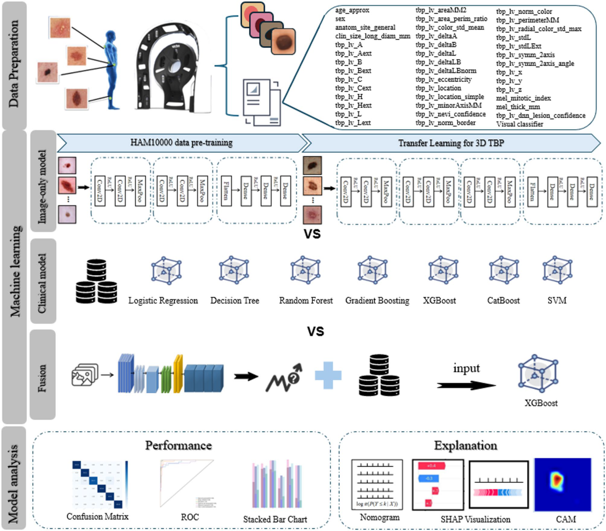
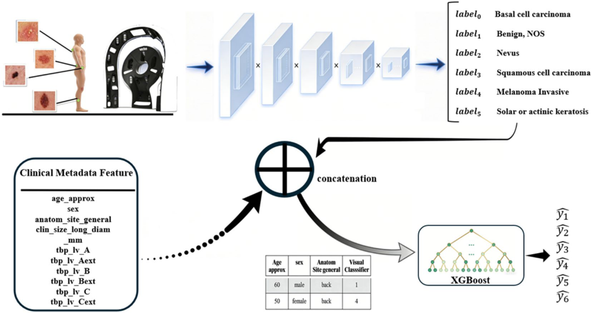
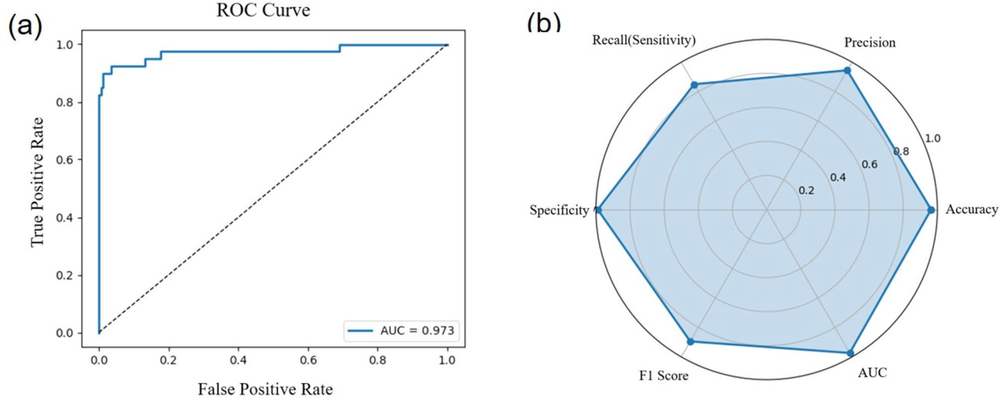

# 3D 영상과 임상 데이터를 통한 피부 병변 위험 예측을 위한 설명 가능한 멀티모달 AI

원문: Zheng Wang et al., "Explainable multimodal AI for skin lesion risk prediction via 3D imaging and clinical data", *Scientific Reports*, 2025.

원문 PDF: `s41598-025-33536-z-1.pdf`  
DOI: `10.1038/s41598-025-33536-z`

## 번역 원칙 안내

이 파일은 원 논문의 구조와 흐름을 따라 한국어로 옮긴 Markdown 번역본이다. 원문에 실린 그림은 PDF에서 추출한 원본 figure를 사용했고, 표와 수식은 Markdown/LaTeX 렌더링에 맞춰 재작성했다. ISIC2024 Kaggle 멀티모달 연구 설계에 관한 해석은 본문 번역과 섞지 않고 `ISIC2024 연구 코멘트 (번역 아님)` 블록으로만 분리했다.

## 초록

피부 병변의 정확한 진단은 병변 형태의 다양성과 기존 진단 방법의 한계 때문에 여전히 어렵다. 본 연구는 3D total body photography(3D TBP) 영상과 구조화된 임상 데이터를 통합하여 여섯 가지 흔한 피부 병변 유형을 분류하고 위험을 평가하는 설명 가능한 인공지능 프레임워크를 개발했다.

저자들은 1,075명의 환자로 구성된 ISIC 2024 데이터셋을 사용해 41개의 임상 및 병변 특이 feature를 추출하고 분석했다. 의사결정 지원을 위해 다항 로지스틱 회귀 모델을 구현했으며, 모델 해석 가능성은 SHAP(Shapley Additive Explanations)와 CAM(Class Activation Maps)으로 평가했다. 임상 데이터만 사용한 XGBoost 모델은 중등도 정확도(BCC 78.6%, nevus 72.6%)를 보였고, 3D TBP 영상만으로 학습한 CNN은 nevus에 대해 87.1% 정확도를 보였다.

멀티모달 융합 모델은 단일 모달 접근보다 크게 우수했으며, recall과 F1 score가 95%를 넘고 AUC가 0.95를 초과했다. 특히 nevus와 actinic keratosis의 AUC는 0.98이었다. 또한 ISIC 2024 challenge에서 partial false-positive rate(pFPR) 0.1734로 상위권 성능에 근접했다. Nomogram으로 시각화한 통합 scoring system은 `visual_classifier`와 `tbp_lv_symm_2axis` 같은 주요 predictor를 식별했다. 이 해석 가능한 멀티모달 AI 프레임워크는 진단 정확도와 위험 층화를 개선하며, 정밀 피부과와 피부암 조기 발견을 위한 투명하고 임상적으로 실행 가능한 도구를 제공한다.

**키워드:** skin lesion risk prediction, 3D total body photography, multimodal fusion, explainable AI, deep learning

## 1. 서론

피부 병변은 전 세계적으로 중요한 건강 문제이며, 의료 부담과 삶의 질 저하에 크게 기여한다. Nevus와 같은 양성 병변은 일반적으로 악성 잠재력이 낮지만, solar keratosis와 actinic keratosis 같은 전암성 병변은 치료하지 않으면 squamous cell carcinoma(SCC)로 진행할 수 있다. 악성 피부암 중 basal cell carcinoma(BCC), SCC, melanoma는 가장 흔하고 임상적으로 까다로운 유형으로, 형태가 다양하고 예후가 다르며 진단상 중복이 자주 발생한다.

ABCDE rule 같은 전통적 임상 접근은 주관적 해석과 관찰자 간 변동성에 의해 제한된다. Reflectance confocal microscopy(RCM), optical coherence tomography(OCT) 같은 영상 기법은 병변 시각화를 향상시키지만 높은 비용, 제한된 해상도, 운영 복잡성 때문에 널리 임상 도입되기 어렵다.

최근 AI와 deep learning은 피부 병변 진단 자동화에서 강한 가능성을 보였다. 하지만 많은 모델은 2D dermoscopic image 또는 단일 모달 데이터에 의존하며, 임상적 맥락이나 설명 가능성을 충분히 제공하지 못한다. 임상 현장에서 필요한 것은 병변의 시각적 단서와 환자 및 병변 관련 구조화 데이터를 함께 사용하면서, 예측 근거를 투명하게 보여주는 모델이다.

3D total body photography(3D TBP)는 기존 2D 영상의 한계를 보완하는 새로운 영상 modality이다. 동기화된 고해상도 DSLR array를 사용해 피부 표면을 포괄적으로 매핑하고, 병변 형태, 색 분포, 해부학적 맥락을 자세히 시각화한다. 이 기술은 장기적인 병변 추적과 병변 부담의 정량 평가를 가능하게 하며, 계산 분석을 위한 풍부한 멀티모달 데이터원을 제공한다. 그러나 3D TBP를 구조화된 임상 데이터와 함께 설명 가능한 AI 프레임워크로 통합하는 연구는 아직 충분히 이루어지지 않았다.

본 연구는 3D TBP 영상 feature와 구조화된 임상 parameter를 결합하여 피부 병변 분류의 정확도와 해석 가능성을 높이는 설명 가능한 멀티모달 AI 프레임워크를 제안한다. 프레임워크는 dermoscopic dataset으로 사전학습된 CNN의 transfer learning을 사용하고, 여섯 class 병변 예측을 위한 다항 로지스틱 회귀 scoring model과 결합한다. 투명성을 높이기 위해 SHAP와 CAM으로 주요 feature와 spatial attention을 시각화한다.

> **ISIC2024 연구 코멘트 (번역 아님)**
> 이 내용은 원문 번역이 아니라, ISIC2024 Kaggle 멀티모달 연구 설계에 참고할 점을 정리한 주석이다.
> 이 논문은 ISIC2024/SLICE-3D 계열의 `3D-TBP image + ordinary clinical/tabular metadata` 융합을 직접 다룬다. 우리 프로젝트에서는 이 방향을 baseline 연구의 중심에 두되, `iddx_full`, diagnosis text, pathology-derived text를 ordinary inference input으로 섞지 않는 경계가 중요하다.

## 2. 방법

### 2.1 데이터 획득

본 연구의 피부 병변 데이터는 ISIC 2024 데이터셋에서 얻었다. 이 데이터셋은 2015년부터 2024년 사이 3D TBP를 촬영한 환자 기록을 포함한다. 미국 Memorial Sloan Kettering Cancer Center, 스페인 Barcelona Clinic Hospital, 호주 Queensland University, 오스트리아 Vienna Medical University, 스위스 Basel University Hospital 등 여섯 대륙의 기관에서 수집된 국제 데이터셋이다.

이 데이터셋은 주로 biopsy를 받았거나 단기간 digital dermoscopy로 추적된 비정형 또는 임상적으로 중요한 병변에 초점을 맞추며, 기존 dermoscopic database에서 흔한 selection bias를 줄이고자 했다. 저자들은 approximate age(`age_approx`), 병변 크기(`clin_size_long_diam_mm`), TBP-derived parameter(`tbp_lv_A`, `tbp_lv_Bext` 등)를 포함하여 총 41개의 임상 및 병변 특이 feature를 후향적으로 추출했다.

추출된 feature 중 `tbp_lv_eccentricity`와 `tbp_lv_symm_2axis`는 각각 병변 eccentricity와 border asymmetry를 정량화한다. 이들은 피부과 평가에서 식별력 있는 지표로 쓰인다. 3D TBP-derived image는 ABCD rule의 핵심인 asymmetry, border irregularity, color variation, diameter와 관련된 형태·색상 단서를 보존한다. 표준화된 TBP 데이터는 직접 임상 진찰에서 사용하는 시각 단서와 유사한 정보를 예측 모델에 제공하여 해석 가능성과 진단 일관성을 높인다.

데이터셋에는 여섯 개 주요 병변 category가 포함된다.

| 병변 category | 표본 수 |
|---|---:|
| Invasive melanoma | 157 |
| Basal cell carcinoma | 163 |
| Squamous cell carcinoma | 73 |
| Nevus | 443 |
| Benign not otherwise specified, Benign NOS | 200 |
| Solar or actinic keratosis | 39 |

Class imbalance를 다루기 위해 nevus를 제외한 모든 병변 유형에 random rotation, horizontal flipping, color variation 등 data augmentation을 적용했다. 이 방법은 label을 바꾸지 않으면서 데이터 다양성을 높이고, underrepresented lesion characteristic을 학습하도록 하기 위해 선택되었다. Class weighting과 oversampling도 고려되었지만, 저자들은 overfitting을 줄이고 병변 표현의 자연 변동성을 유지하기 위해 data augmentation을 선택했다.

**그림 1.** 제안된 설명 가능한 멀티모달 AI 프레임워크의 개요. ROC는 receiver operating characteristic, SHAP는 Shapley additive explanations, CAM은 class activation map, XGBoost는 extreme gradient boosting, CatBoost는 categorical boosting, SVM은 support vector machine을 의미한다.

### 2.2 연구 설계

임상 parameter 평가를 위해 logistic regression, decision tree, random forest, gradient boosting, XGBoost, CatBoost, support vector machine(SVM) 등 다양한 machine learning algorithm을 학습했고, 가장 정확하고 robust한 모델을 선택했다. 영상 데이터에는 CNN을 사용했으며 HAM10000 데이터셋 기반 transfer learning을 적용했다.

CNN architecture는 convolutional layer, activation function, pooling operation으로 구성된 세 개의 convolutional block을 포함하며, 여섯 class 피부 병변 분류에 맞추어 조정되었다. 3D TBP image에 대응하기 위해 fine-tuning 단계에서 두 개의 Conv2D layer를 추가하여 feature extraction을 강화했다. 그러나 단일 modality 접근은 진단 정확도에 제한이 있었다.

### 2.3 멀티모달 융합 전략

저자들은 image-derived information과 clinical information을 하나의 predictive model로 통합하는 multimodal fusion framework를 개발했다. 먼저 3D TBP image로 학습한 deep learning network가 여섯 class probability output을 생성하고, 이 output을 구조화된 visual feature vector로 사용했다. 동시에 approximate age와 longitudinal lesion diameter를 포함한 clinical metadata를 clinical feature vector로 구성했다. Scale comparability와 model stability를 위해 두 feature set을 concatenate하고 standardize한 뒤 XGBoost classifier에 입력했다.

이 late-fusion 전략은 CNN이 추출한 visual representation과 보완적 clinical variable을 합성하여, 표현형 정보와 인구통계·임상 정보가 함께 의사결정에 기여하도록 한다. 예측 과정은 다음과 같이 표현된다.

$$
f_{\mathrm{image}} = \mathrm{CNN}_{\mathrm{image}}(I), \quad
f_{\mathrm{clinical}} = [x_1, x_2, \ldots, x_n]
\tag{1}
$$

$$
\hat{y} =
\mathrm{XGBoost}\left(
\mathrm{Concatenate}(f_{\mathrm{image}}, f_{\mathrm{clinical}})
\right)
\tag{2}
$$

여기서 $f_{\mathrm{image}} \in \mathbb{R}^{6}$는 CNN이 생성한 여섯 class probability vector이고, $f_{\mathrm{clinical}}$은 clinical feature set이며, $\hat{y}$는 최종 예측이다. SHAP, CAM, nomogram assessment를 포함한 해석 가능성 분석을 통해 이 multimodal approach가 unimodal model보다 우수함을 검증했다.

**그림 2.** Multimodal fusion workflow.

> **ISIC2024 연구 코멘트 (번역 아님)**
> 이 구조는 ISIC2024 멀티모달 baseline의 late fusion 후보로 적합하다. 단, XGBoost에 넣는 tabular feature는 fold별 training split에서 fit된 전처리만 사용해야 하며, validation/test 전체 통계로 scaling, imputation, feature selection을 fit하면 leakage가 된다.

### 2.4 Scoring system

본 연구는 여섯 개 피부 질환 category의 확률을 추정하기 위해 다항 로지스틱 회귀 모델을 사용했다. 이 모델은 분류 성능을 평가하면서도 투명성과 해석 가능성을 유지하는 framework를 제공한다. Model stability를 높이고 predictor redundancy를 줄이기 위해 variance inflation factor(VIF)로 multicollinearity를 평가했다.

각 feature $X_i$에 대해 다른 모든 feature를 independent variable로 하는 선형 회귀 모델을 맞추고, coefficient of determination $R_i^2$를 계산하여 $X_i$가 다른 predictor로 얼마나 설명되는지 측정했다. VIF는 다음과 같이 계산된다.

$$
\mathrm{VIF}_i = \frac{1}{1 - R_i^2}
\tag{3}
$$

VIF가 10을 초과하는 feature는 높은 collinearity를 가진 것으로 보고 제외했다. 남은 feature 사이의 multicollinearity가 작다는 가정 아래, category $k$에 대한 cumulative logistic function은 다음과 같이 정의된다.

$$
\mathrm{logit}\left(P(Y \le k \mid X)\right)
= \beta_0^{(k)} + \sum_{i=1}^{n}\beta_i^{(k)} X_i
\tag{4}
$$

여기서 $\beta_0^{(k)}$는 category $k$의 intercept이고, $\beta_i^{(k)}$는 category $k$에 대한 $i$번째 feature의 회귀계수이다. 여섯 category 각각의 예측 확률을 얻기 위해 모델은 다음과 같은 log odds 형태를 사용한다.

$$
\log\left(\frac{P(Y=1)}{P(Y=0)}\right)
= \beta_0 + \beta_1X_1 + \beta_2X_2 + \cdots + \beta_nX_n
\tag{5}
$$

이 접근은 예측 성능과 해석 가능성 사이의 균형을 제공하며, 개별 feature가 class별 분류 결과에 미치는 영향을 자세히 분석할 수 있게 한다.

### 2.5 모델 학습 및 구현

모델은 learning rate $1 \times 10^{-4}$, batch size 128, Adam optimizer를 사용하여 200 epoch 동안 학습되었다. Multi-class classification을 위해 cross-entropy loss를 적용했다. 모든 실험은 CUDA acceleration을 사용하는 NVIDIA RTX 4070 GPU(8GB RAM)에서 수행했다.

CSV 형식으로 저장된 데이터셋은 전처리 후 `torchvision.transforms.ToTensor()` 함수로 tensor 형태로 변환되었고, 각 image는 모델 입력 specification에 맞게 $128 \times 128 \times 3$ pixel로 resize되었다. 학습은 standard forward propagation, backward propagation, parameter update로 구성되었으며, 각 epoch에서 loss와 accuracy를 기록하여 convergence를 모니터링했다. 구현은 PyTorch framework를 사용했고, `torch`, `numpy`, `pandas`, `Pillow`, `matplotlib`, `seaborn`, `scikit-learn`을 사용했다.

### 2.6 통계 분석

저자들은 피부 병변 subtype에 따라 clinical 및 demographic characteristic(age, sex)과 lesion-specific imaging/texture feature를 분석했다. 통계적 유의성은 p-value로 평가했다. Clinical parameter와 3D imaging feature를 결합한 multimodal fusion model을 개발하고, ROC curve와 confusion matrix로 성능을 평가했다. 해석 가능성을 높이기 위해 SHAP analysis로 중요한 feature를 식별했고, nomogram을 구축하여 prediction outcome과 feature contribution을 직관적으로 시각화했다.

## 3. 결과

### 3.1 임상 covariate의 기술 분석

저자들은 3D TBP를 받은 1,075명의 환자에서 41개의 clinical 및 lesion-specific feature를 평가했다. Feature는 demographic feature(`age_approx`, sex), lesion morphology(`tbp_lv_area_perim_ratio` 등), color/texture metric(`tbp_lv_Bext`, `tbp_lv_C` 등)을 포함한다. 병변은 invasive melanoma, BCC, SCC, nevus, Benign NOS, solar/actinic keratosis의 여섯 category로 분류되었다.

Baseline comparison에서 나이($P=0.3907$), 성별($P=0.4272$), 병변 크기(`clin_size_long_diam_mm`; $P=0.3371$), TBP intensity/color index, geometry, symmetry, spatial coordinate, area, perimeter는 대부분 유의한 집단 차이를 보이지 않았다. 유일하게 유의한 분리를 보인 feature는 `tbp_lv_nevi_confidence`였으며, 전체 평균은 $45.7 \pm 43.5$, nevus에서 가장 높고($71.0 \pm 36.9$), SCC에서 가장 낮았다($2.7 \pm 12.2$, $P=0.0480$). DNN lesion confidence는 전체적으로 높았지만 discriminative하지 않았다($P=0.3738$).

### 3.2 Clinical-only model의 진단 정확도

저자들은 clinical covariate만으로 학습한 machine learning model의 진단 성능을 평가했다. XGBoost model은 BCC에 대해 78.6% 정확도를 달성했지만, BCC 사례의 10.7%가 nevus로 오분류되어 치료 지연 위험을 만들 수 있었다. Nevus classification accuracy는 72.6%였으며, nevus의 22.1%가 BCC로 잘못 분류되어 불필요한 intervention을 유발할 수 있었다. Benign NOS는 60.0% 정확도를 보였고, 25.0%가 BCC로, 12.5%가 nevus로 잘못 분류되었다. Invasive melanoma detection은 43.8%로 낮았으며 false-negative rate가 높았다. Actinic keratosis와 SCC는 각각 12.5%, 16.7%만 올바르게 식별되었고, SCC 병변의 75.0%가 BCC로 오진되었다.

**표 1. Clinical data에서 모델 비교**

| Models | Acc | Pre | Rec | F1 | PR |
|---|---:|---:|---:|---:|---:|
| Logistic Regression | 0.5813 | 0.5734 | 0.3556 | 0.4161 | 0.5142 |
| Decision Tree | 0.5953 | 0.4148 | 0.4061 | 0.4083 | 0.3096 |
| Random Forest | 0.6697 | 0.5636 | 0.3759 | 0.4381 | 0.5572 |
| Gradient Boosting | 0.6744 | 0.6166 | 0.4070 | 0.4629 | 0.5735 |
| SVM | 0.6139 | 0.5786 | 0.3116 | 0.3753 | 0.5479 |
| CatBoost | 0.6697 | 0.5632 | 0.3807 | 0.4382 | 0.5715 |
| XGBoost | 0.6837 | 0.5425 | 0.4090 | 0.4582 | 0.5848 |

### 3.3 3D TBP-only model 성능 평가

3D total body photography(TBP) image만 사용해 여섯 class CNN을 학습하여 병변 분류 성능을 평가했다. Adapted model은 nevus 87.10%, Benign NOS 75.34%, invasive melanoma 71.88%의 정확도를 달성했다. Basal cell carcinoma는 54.05%, squamous cell carcinoma는 60.32%로 중등도 성능에 머물렀고, misclassification rate가 높았다. Actinic/solar keratosis는 65.62%가 올바르게 식별되었고, 15.62%가 SCC로 잘못 분류되었다. 이는 pre-trained image model을 domain adaptation하는 것만으로는 병변 유형별 성능 변동이 크며, 형태와 texture overlap 때문에 multimodal data fusion이 필요함을 보여준다.

### 3.4 Multimodal model 성능과 임상 해석 가능성

CNN-derived 3D TBP embedding과 clinical covariate를 통합한 multimodal feature set은 five-fold cross-validation에서 여섯 skin lesion category를 분류하는 데 우수한 성능을 보였다. ROC analysis에서 모든 class의 AUC가 0.95를 넘었고, nevus와 actinic keratosis는 0.98에 도달했다. 이는 multimodal fusion approach가 형태적으로 다양한 병변 유형 전반에서 robust하게 일반화될 수 있음을 보여준다.

**표 2. Multimodal data에서 five-fold cross-validation**

| Skin lesion | First | Second | Third | Fourth | Fifth |
|---|---:|---:|---:|---:|---:|
| Basal cell carcinoma | 0.99 | 0.95 | 0.96 | 0.96 | 0.96 |
| Benign, NOS | 0.98 | 0.96 | 0.99 | 0.98 | 0.99 |
| Nevus | 0.99 | 1.00 | 0.97 | 0.99 | 0.98 |
| Squamous cell carcinoma | 0.97 | 0.98 | 0.95 | 1.00 | 0.99 |
| Melanoma Invasive | 0.97 | 0.98 | 0.99 | 0.93 | 0.98 |
| Solar or actinic keratosis | 0.92 | 0.95 | 1.00 | 0.99 | 0.89 |

해석 가능성을 높이기 위해 SHAP와 CAM을 사용하여 핵심 predictor를 식별하고 임상적 관련성을 시각화했다. SHAP summary plot은 TBP-derived numerical feature와 clinical parameter가 예측에 어떻게 기여하는지 보여준다. 특히 `visual_classifier`, `tbp_lv_z`, `tbp_lv_norm_color`, `tbp_lv_deltaA`, `tbp_lv_deltaB` 등은 색상, 깊이, 병변 구조와 관련된 중요한 단서를 제공했다. CAM visualization은 악성 병변에서 깊이와 pigment heterogeneity가 더 강조되는 양상을 보여주며, 양성 병변의 상대적 균일성과 대비된다.

**그림 3.** Multimodal fusion model의 성능과 해석 가능성. (a) XGBoost classifier를 사용한 five-fold cross-validation ROC curve, (b) multimodal data에 대한 SHAP feature importance, (c) 대표 피부 병변 image의 CAM visualization.

ISIC 2024 binary classification challenge와 비교하기 위해 저자들은 여섯 병변 category를 benign과 malignant group으로 축약했다. Fusion model은 strong performance를 유지했고, fixed sensitivity 조건에서 pFPR 0.17343을 달성했다. 이는 challenge 상위 5개 팀의 pFPR 0.17210-0.17264에 근접한 결과이다.

**그림 4.** Fusion model의 성능 평가. (a) Fused data의 ROC curve, (b) 전체 model performance를 보여주는 radar chart.

**표 3. 상위 5개 팀과의 비교**

| Team | pFPR |
|---|---:|
| Ours | 0.17343 |
| Ilya Novoselskiy | 0.17264 |
| Yakiniku | 0.17243 |
| KS | 0.17229 |
| BiBanhBao | 0.17225 |
| Kanna Hashimoto friends 2 | 0.17210 |

> **ISIC2024 연구 코멘트 (번역 아님)**
> 이 논문은 clinical-only, image-only, multimodal fusion을 같은 문제에서 비교한다는 점이 유용하다. 우리 프로젝트도 tabular-only, image-only, late fusion, feature concatenation fusion, gated fusion을 같은 patient-level fold와 같은 metric으로 비교해야 한다. Challenge leaderboard 성능은 참고자료일 뿐 paper claim의 최종 근거로 쓰면 안 된다.

### 3.5 임상 의사결정 진단을 위한 통합 scoring panel

저자들은 basal cell carcinoma, Benign NOS, nevus, SCC, invasive melanoma, solar/actinic keratosis 여섯 category의 확률을 예측하기 위해 다항 로지스틱 회귀 모델을 개발했다. Predictor independence를 보장하기 위해 multicollinearity를 체계적으로 평가했다. Hierarchical clustering heatmap은 대부분 약한 상관을 보였고, 특정 structural descriptor에서만 cluster가 나타났다.

VIF 분석은 `tbp_lv_Lext`, `tbp_lv_L`, `tbp_lv_B`, `tbp_lv_A`, `tbp_lv_deltaL`, `tbp_lv_Aext` 등 여섯 feature가 threshold 10을 초과함을 보였다. Pairwise scatterplot은 이 feature들 사이의 선형 의존성을 확인했다. Highly collinear feature를 제외한 뒤 VIF는 최대 1.7로 감소했고, 최종 feature set이 중대한 redundancy 없이 robust predictive modeling에 적합함을 확인했다.

**그림 5.** Model feature의 multicollinearity analysis. (a) Hierarchical clustering이 포함된 correlation matrix, (b) 주요 correlated feature의 pairwise scatterplot, (c) highly collinear variable 제거 후 VIF distribution.

각 변수는 nomogram에서 점수로 변환되고, 합산된 total score는 class membership probability로 매핑된다. Predictor 중 `visual_classifier`가 병변 분류와 가장 강한 관련성을 보였다($\beta=3.503$, $\mathrm{OR}=24.68$, 95% CI: 13.27-45.90, $P=0.0021$). `tbp_lv_Aext`는 중등도 효과를 보였고($\mathrm{OR}=0.80$, $P=0.0058$), `tbp_lv_symm_2axis`는 넓은 confidence interval을 가져 effect size estimation의 불확실성을 시사했다.

최종 multivariable model에서 가장 강한 양의 predictor는 `visual_classifier`, `tbp_lv_symm_2axis`, `tbp_lv_color_std_mean`이었다. 계수가 0에 가까운 `tbp_lv_L`, `tbp_lv_x` 등은 영향이 작았고, `tbp_lv_areaMM2`, `tbp_lv_eccentricity` 같은 음의 계수 predictor는 higher-risk lesion classification probability를 낮추었다. 나이와 공간 좌표($x$, $y$)는 $\mathrm{OR} \approx 1$로 진단 관련성이 제한적이었다.

**그림 6.** 피부 병변 진단을 위한 nomogram 기반 scoring system.

> **ISIC2024 연구 코멘트 (번역 아님)**
> SHAP, CAM, nomogram은 해석 가능성 evidence로 유용하지만, leakage-free 성능을 증명하지는 않는다. 우리 프로젝트에서는 XAI figure를 논문 보조 근거로 쓰되, patient-level split audit, train-only preprocessing evidence, fold-wise metric이 먼저 갖춰져야 한다.

## 4. 논의

본 연구는 구조화된 임상 데이터와 3D TBP image를 설명 가능한 AI 프레임워크 안에서 통합하면 피부 병변 분류의 진단 성능이 크게 향상됨을 보여준다. 제안 multimodal model은 모든 병변 category에서 recall과 F1 score가 95%를 넘고 AUC가 0.95를 초과했으며, nevus와 actinic keratosis에서는 AUC 0.98을 달성했다. 반면 clinical data 기반 XGBoost와 3D TBP 단독 CNN 같은 unimodal model은 낮은 정확도(72.6-87.1%)를 보였다. ISIC 2024 challenge benchmark(pFPR 0.1734)는 모델의 일반화 가능성이 강함을 시사한다.

SHAP와 CAM은 모델 예측에 대한 투명한 해석을 제공했다. 이 기법들은 network가 color variation과 border irregularity 같은 임상적으로 관련 있는 feature에 집중함을 보여주었고, 이는 기존 dermatological heuristic과 일치한다. 다항 로지스틱 회귀 모델은 class-specific risk probability를 정량화하여 임상 해석 가능성을 높였다. Nomogram visualization은 `visual_classifier`와 `tbp_lv_symm_2axis`를 주요 결정 인자로 식별했다.

임상적으로 이 multimodal framework는 피부암의 조기 발견, triage, 대규모 screening에 적용될 수 있다. 특히 자원이 제한된 환경에서 non-specialist clinician이 referral이 필요한 high-risk lesion을 식별하도록 지원하고, 다양한 임상 환경에서 진단 일관성을 높일 수 있다. 투명한 decision pathway는 임상의 신뢰를 높이고 routine dermatologic workflow와의 통합을 촉진할 수 있다.

그러나 한계도 있다. 이 연구는 ISIC 2024 dataset에만 의존한다. 데이터셋은 크지만 controlled clinical trial에서 나온 것이 아니므로 selection bias와 acquisition bias가 있다. 기관별 imaging hardware, lighting, camera angle 차이는 image quality와 lesion presentation의 inconsistency를 만든다. SCC처럼 특정 병변 유형의 표본 수가 제한적이어서 model stability에 영향을 줄 수 있다. Class imbalance를 다루기 위해 data augmentation을 사용했지만, 이는 낙관적인 성능 추정으로 이어질 수 있다. 따라서 높은 AUC는 완전히 일반화 가능한 임상 성능이라기보다 training data 내부의 consistency를 반영할 가능성이 있다.

또한 현재 모델은 real-world TBP 또는 독립 external cohort에서 검증되지 않았다. 실제 임상 적용에는 patient positioning, background complexity, lighting heterogeneity 같은 문제가 있으며, 이는 predictive accuracy에 영향을 줄 수 있다. 다양한 medical center, device, patient population에서 엄격한 prospective validation이 필요하다.

> **ISIC2024 연구 코멘트 (번역 아님)**
> 이 논문의 한계는 우리 연구 주장에도 그대로 적용된다. Kaggle/ISIC2024 내부 split 결과만으로 “임상 적용 가능”을 강하게 주장하지 말고, “defined patient-level protocol에서 multimodal modeling의 유용성을 시사한다” 정도로 제한하는 것이 안전하다.

## 5. 결론

제안된 멀티모달 설명 가능 AI 프레임워크는 3D TBP image와 임상 데이터를 통합하여 여섯 skin lesion type에서 높은 진단 정확도($\mathrm{AUC}>0.95$, $\mathrm{F1}>95\%$)를 달성했고, SHAP와 CAM 분석을 통해 투명성을 유지했다. Deep learning과 clinical reasoning을 연결함으로써 이 시스템은 피부과 진료를 위한 신뢰할 수 있고 해석 가능한 decision-support tool을 제공하며, 실제 환경에서 조기 발견, triage, 개인화된 환자 관리 개선에 기여할 잠재력이 있다.

## 데이터 가용성

본 연구에서 생성 및 분석된 데이터셋은 ISIC repository에서 이용 가능하다고 원문에 명시되어 있다.

`https://challenge2024.isic-archive.com/`

## 참고문헌

참고문헌 상세 목록은 원문 PDF의 References 절을 따른다. 본 번역본에서는 본문 인용 번호와 핵심 지표 표기를 원문과 대조 가능하게 유지했다.
