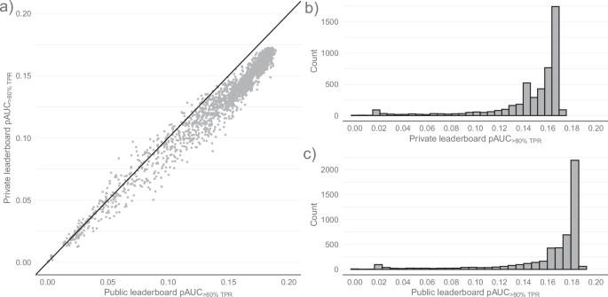
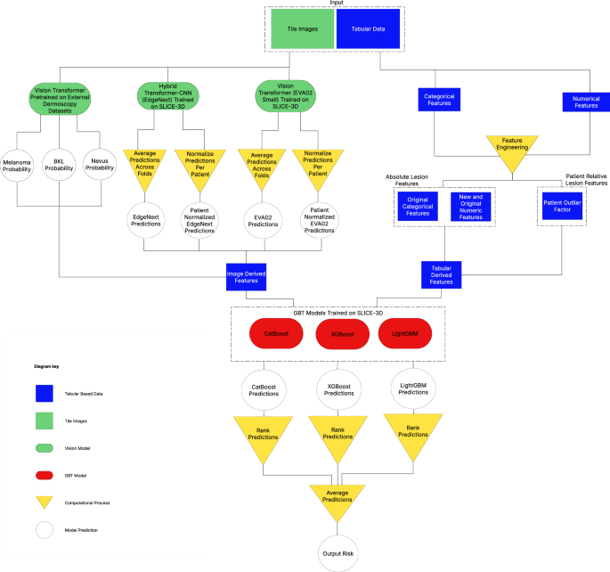

# 3D 전신 사진 기반 암 의심 피부 병변의 자동 분류

원문: Nicholas R. Kurtansky et al., "Automated triage of cancer-suspicious skin lesions with 3D total-body photography", *npj Digital Medicine*, 2025.

원문 PDF: `s41746-025-02070-7.pdf`  
DOI: `10.1038/s41746-025-02070-7`

## 번역 원칙 안내

이 문서는 원 논문의 구조를 따라 한국어로 옮긴 Markdown 번역본이다. 그림은 원 논문 공개 HTML/PDF에서 추출한 원본 figure를 사용했고, 표와 지표 표기는 Markdown/LaTeX에 맞게 정리했다. ISIC2024 Kaggle 연구 설계와 연결되는 해석은 본문 번역과 섞지 않고 `ISIC2024 연구 코멘트 (번역 아님)` 블록으로만 분리했다.

## 초록

전문가 평가가 필요한 피부 병변을 신중히 선별하는 일은 피부암 조기 발견에 중요하다. 그러나 무증상 선별검사의 비용효율성 부족, 전문 피부과 접근성의 지역 격차, 검사 비효율과 인력 부족에 따른 긴 대기 시간은 여전히 문제이다. 고품질 피부경 사진으로 학습된 기계학습 모델은 개별적이고 선별된 피부 병변을 진단할 때 임상의에게 도움을 줄 수 있음이 보여졌다. 반면 분류(triage)를 목적으로 설계된 모델은 더 넓은 범위의 피부 병변을 대표하는 데이터셋이 부족해 상대적으로 덜 연구되었다.

3D 전신 사진(3D total-body photography, 3D TBP)은 피부암 모니터링을 위해 환자에게 보이는 모든 피부 병변을 기록하는 신기술이다. 다기관·국제 프로젝트는 3D 전신 사진에서 잘라낸 900,000개 이상의 병변 crop을 수집해 온라인 기계학습 grand challenge를 구성했다. 본 논문은 `ISIC 2024 - Skin Cancer Detection with 3D-TBP` 대회의 결과를 요약하고, 환자 내 문맥(intra-patient context)을 활용한 모델이 이전 발표 접근법보다 우수함을 보이며, ablation study를 통해 자동 비정형 피부 병변 분류의 임상적 타당성을 탐색한다.

## 1. 서론

피부 영상에서 기계학습과 인공지능은 피부암 분류에서 상당한 가능성을 보였다. 기존 병변 기반 접근은 특정 사용 상황에서 임상 의사결정을 개선하고, 이론적 환경에서는 피부과 전문의보다 높은 성능을 보였다고 보고되었다. 그러나 지금까지 ML 모델의 진단 정확도는 대개 사전에 선택된 병변에서 평가되었다. 이러한 병변은 보통 임상의, 보조 의료인, melanographer 같은 사람이 피부경 평가와 추가 검사를 위해 관심 병변으로 골라야 한다.

이 방식은 물류적 부담을 만들고 악성 병변을 놓칠 위험을 낳을 수 있다. 또한 이렇게 만들어진 데이터셋은 선택 편향을 갖기 쉬워, 실제로 더 흔히 나타나는 병변을 충분히 대표하지 못할 수 있다. 병변 기반 진단과 달리 ML 보조 triage는 상대적으로 적게 탐구되었다.

3D 전신 사진은 환자의 거의 모든 보이는 병변을 기록하고, 장기 추적 중 변화가 있는 병변을 찾는 데 쓰인다. 이 논문은 SLICE-3D 기반 ISIC 2024 대회의 병변 tile과 메타데이터를 사용해, 3D TBP에서 잘라낸 병변 이미지와 다양한 메타데이터가 피부암 자동 triage에 얼마나 기여하는지 평가한다.

## 2. 결과

### 2.1 ISIC'24 데이터셋과 참가 개요

ISIC 2024 대회는 3D TBP 이미지에서 후보 병변을 잘라낸 tile을 이용해 병리로 확인된 피부암을 구별하는 위험 예측 모델을 제출하도록 설계되었다. 공식 학습 데이터는 공개 SLICE-3D 데이터셋으로, 약 1,000명의 환자에서 얻은 약 400,000개의 병변 tile로 구성되었다. 평가 데이터는 public leaderboard와 private leaderboard로 나뉘며, private leaderboard가 최종 평가에 사용되었다.

본 연구는 네 종류의 입력 정보 계열을 구분한다.

**표 1. 입력 feature class 설명**

| Tile | 기본 인구통계 메타데이터 | WB360 외형 메타데이터 | 환자 문맥 정보 |
|---|---|---|---|
| Vectra WB360 사진에서 병변 중심 $15\,\mathrm{mm} \times 15\,\mathrm{mm}$ 영역을 잘라 JPEG로 저장한 이미지 파일 | 환자 나이, 성별, 해부학적 위치, 병원/기관 등, 별도 3D 계측 없이 알 수 있는 기본 정보 | Vectra WB360 도구로부터 계산되는 병변 면적, 색 대비, 경계 불규칙성, 조명 modality 등 | 동일 환자 내 다른 병변 정보를 이용해 만든 특징. 예: 총 병변 수, 환자 평균 대비 병변 면적 정규화 등. `patient_id`를 통해 환자 내 병변 집합을 참조한다. |

> **ISIC2024 연구 코멘트 (번역 아님)**
> 이 내용은 원문 번역이 아니라, ISIC2024 Kaggle 멀티모달 연구 설계에 참고할 점을 정리한 주석이다.
> 이 표는 우리 프로젝트의 feature set 분리 기준으로 직접 쓸 수 있다. `basic metadata`, `WB360 appearance metadata`, `patient contextual information`은 ordinary inference-time tabular 입력 후보이지만, 진단명·병리 텍스트·`iddx_full`은 이 범주에 넣지 않는다.

**표 2. 학습·평가 데이터 분포 비교 요약**

| 항목 | 학습 | Public LB | Private LB |
|---|---:|---:|---:|
| 전체 환자 수 | 1,042 | 342 | 935 |
| 전체 병변 tile | 401,059 | 140,770 | 370,704 |
| 악성 label | 393 | 138 | 342 |
| 양성/불확정 label | 400,666 | 140,632 | 370,362 |
| 병변 tile 400개 이상 환자 비율 | 31.4% | 33.9% | 32.1% |
| 악성 label이 없는 환자 비율 | 75.1% | 71.6% | 74.7% |
| 악성 label이 정확히 1개인 환자 비율 | 18.5% | 21.6% | 19.6% |
| 악성 label이 2개 이상인 환자 비율 | 6.3% | 6.7% | 5.8% |

### 2.2 3D TBP 기반 ML 모델의 피부암 탐지 가능성

공식 제출물의 public leaderboard 점수와 private leaderboard 점수는 높은 상관을 보였다. 그러나 public과 private 사이에 순위 변동도 관찰되었는데, 이는 ML 대회에서 흔히 말하는 leaderboard shake-up 현상이다. private leaderboard에는 935명의 환자와 370,704개 병변이 포함되었고, 악성 class는 342개로 극도로 희소했다.

**그림 1.** Public 및 private leaderboard 점수의 빈도와 이변량 분포. (a)는 public 점수와 private 점수의 산점도를 보여주며, 두 점수는 높은 상관을 보였다. (b)-(c)는 leaderboard 점수 분포를 나타낸다.

대회 최고 모델은 private leaderboard에서 $\mathrm{pAUC}_{>80\%\,TPR}=0.173$과 AUC 0.968을 기록했다. 이전 통계 모델인 Marchetti et al. 접근법과 비교하면, 3D TBP 기반 대회 모델은 악성 병변 triage에서 훨씬 높은 성능을 보였다. 이 결과는 3D TBP 기반 이미지와 메타데이터가 자동 피부암 triage에 충분한 신호를 제공함을 시사한다.

**표 3. ISIC'24 private leaderboard 평가 데이터에서 자동 접근법별 진단 효과 지표**

| 작업 | 모델 | pAUC > 80% TPR | AUC | NNT 80% SE | NNT 90% SE | SE top-15 |
|---|---|---:|---:|---:|---:|---:|
| 악성 분류 | ISIC'24 전체 제출 중 최고 | 0.173 | 0.968 | 42.26 | 88.60 | 0.790 |
| 악성 분류 | Marchetti et al. | 0.032 | 0.704 | 874.27 | 1013.24 | 0.360 |
| 악성 분류 | 우승 모델 전체 입력 | 0.173 | 0.967 | 50.57 | 98.20 | 0.729 |
| 악성 분류 | 기본+WB360 메타데이터+tile, 환자 문맥 제외 | 0.165 | 0.956 | 72.68 | 145.72 | 0.687 |
| 악성 분류 | 기본+WB360 메타데이터+환자 문맥, tile 제외 | 0.164 | 0.957 | 63.62 | 167.16 | 0.695 |
| 악성 분류 | 기본+WB360 메타데이터만 | 0.152 | 0.941 | 111.34 | 230.96 | 0.646 |
| 흑색종 분류 | ISIC'24 전체 제출 중 최고 | 0.176 | 0.970 | 126.31 | 261.92 | 0.791 |
| 흑색종 분류 | Marchetti et al. | 0.114 | 0.893 | 739.45 | 1610.18 | 0.541 |
| 흑색종 분류 | 우승 모델 전체 입력 | 0.169 | 0.962 | 212.36 | 412.60 | 0.689 |

### 2.3 입력 feature class의 상대적 중요도

Ablation study는 tile 이미지, 기본 메타데이터, WB360 외형 메타데이터, 환자 문맥 정보가 각각 성능에 어떻게 기여하는지 평가했다. 전체 입력을 사용하는 모델이 가장 좋은 결과를 보였고, 환자 문맥을 제거하거나 tile을 제거하면 성능이 낮아졌다. 특히 환자별 병변 수나 환자 내 상대적 병변 특징 같은 intra-patient context는 자동 triage에서 중요한 정보를 제공했다.

**그림 2.** Melanoma가 포함된 91명 환자별 병변 위험 점수. 우승 모델의 melanoma 위험 점수는 붉은 점으로, 전체 병변 위험 점수는 회색 boxplot으로 표시했다. 상당수 melanoma는 같은 환자 내에서 매우 높은 위험 순위에 위치했다.

> **ISIC2024 연구 코멘트 (번역 아님)**
> Patient context feature는 강력하지만 leakage risk도 같이 생긴다. 같은 환자의 다른 병변을 요약하는 feature는 inference 시점에 실제로 사용할 수 있는 정보인지 먼저 정의해야 하며, 어떤 통계도 validation/test 전체 분포를 보고 fit하면 안 된다. Fold별 train-only preprocessing과 patient-level split audit가 필수다.

### 2.4 병변 특성과 ML 모델 위험 인식의 관련성

저자들은 연속형 메타데이터와 상위 500개 제출 모델의 평균 병변 위험 순위 사이의 상관을 분석했다. 병변 크기와 색 변화 관련 측정값은 더 높은 위험 점수와 약한-중간 정도의 양의 관련성을 보였다. 이는 melanoma 식별에 사용되는 ABCD checklist나 7-point checklist 같은 임상적 도구와 방향성이 맞는다. 반면 일부 경계 불규칙성 측정은 예상보다 낮은 관련성을 보이기도 했다.

**그림 3.** 병변 특성과 ML 모델링 위험의 관련성. Waterfall graph는 각 연속형 메타데이터 feature와 ISIC'24 상위 500개 제출의 평균 병변 위험 점수 순위 사이의 상관을 보여준다.

## 3. 논의

본 논문은 3D TBP 기반 ML 모델이 넓은 후보 병변 집합에서 암 의심 병변을 자동으로 선별할 수 있음을 보여준다. 기존 피부경 기반 모델은 주로 사람이 이미 관심 병변으로 고른 이미지를 대상으로 평가되었지만, 3D TBP 기반 triage 문제는 환자에게 존재하는 많은 병변 중 전문 평가가 필요한 병변을 우선순위화하는 더 넓은 문제이다.

대회 데이터의 악성 비율은 약 0.1%로 극히 낮았다. 이 때문에 AUC가 높더라도 실제 triage에서는 높은 민감도를 유지하면서 검토해야 할 병변 수를 얼마나 줄일 수 있는지가 중요하다. 논문은 pAUC above 80% TPR, NNT(number needed to triage), top-k 민감도 등 triage 친화적 지표를 함께 제시한다.

또한 결과는 환자 문맥 정보의 중요성을 강조한다. 단일 병변의 절대 특징뿐 아니라 같은 환자 내 다른 병변과 비교한 상대적 특징은 위험 예측에 도움이 된다. 이는 피부과 진료에서 한 환자의 여러 병변을 함께 비교하는 임상적 사고와 맞닿아 있다.

다만 저자들은 몇 가지 한계를 언급한다. 데이터는 3D TBP를 촬영한 환자와 특정 병변 detection pipeline에 의존하며, 실제 임상 배치에서는 장비, 촬영 조건, 병변 선별 절차, 의료기관별 환자 분포 차이가 성능에 영향을 줄 수 있다. 또한 leaderboard 기반 평가는 엄격한 독립 검증과 다를 수 있으므로, 실제 임상 workflow에서의 전향적 검증이 필요하다.

> **ISIC2024 연구 코멘트 (번역 아님)**
> 이 논문이 사용하는 pAUC above 80% TPR는 ISIC2024 challenge의 핵심 지표와 맞다. 우리 실험 표에서도 pAUC above TPR 0.80을 primary metric으로 두고, AUC, F1, precision, recall, balanced accuracy는 validation-selected threshold 기준으로 함께 보고하는 것이 좋다.

## 4. 방법

### 4.1 ISIC'24 대회와 데이터셋

`ISIC 2024 - Skin Cancer Detection with 3D-TBP` 대회는 2024년 6월 27일부터 9월 6일까지 Kaggle에서 진행되었다. 참가자는 Vectra WB360 영상에서 추출된 후보 병변에 대해 병리로 확인된 피부암 여부를 구분하는 ML 기반 위험 예측 모델을 제출했다. 공식 학습 데이터셋은 공개 SLICE-3D 데이터셋으로, 북미·유럽·호주의 7개 의료기관에서 수집되었다.

각 tile은 Vectra WB360 병변 detection 도구가 식별한 병변을 중심으로 한 $15\,\mathrm{mm} \times 15\,\mathrm{mm}$ 피부 영역이며 JPEG 형식으로 제공되었다. 메타데이터에는 기본 메타데이터, WB360 계측값, 진단 label이 포함되었다.

### 4.2 ML 모델 평가

대회 평가는 ROC 곡선의 높은 민감도 영역을 강조하기 위해 TPR 80% 이상 구간의 부분 AUC를 사용했다. 논문에서는 이를 다음과 같이 개념적으로 정리할 수 있다.

$$
\mathrm{pAUC}_{>80\%\,TPR}
= \int_{TPR \ge 0.80} TPR(FPR)\,dFPR
$$

이 지표는 암 의심 병변 triage에서 낮은 민감도를 허용하기 어렵다는 임상적 요구를 반영한다. 추가적으로 전체 AUC, 특정 민감도에서 검토해야 할 병변 수(NNT), 환자별 top-k 병변 내 민감도 등이 분석되었다.

### 4.3 Ablation study

Ablation study의 대상은 ISIC'24 우승 모델이었다. 우승 모델은 image processing branch와 메타데이터 기반 branch를 결합한다. 영상 branch는 세 개의 신경망 분류 모델 ensemble로 구성되며, 두 개의 EVA 모델과 하나의 EdgeNext 모델을 포함한다. 하나의 EVA 모델은 외부 피부경 데이터로 학습되었고, EdgeNext와 두 번째 EVA 모델은 ISIC'24 tile 데이터로 학습되었다. 이후 각 영상 모델의 확률 추정값과 메타데이터를 결합해 boosting model이 최종 병변 위험 점수를 생성했다.

**그림 4.** ISIC'24 대회 우승 모델의 구조. 이 모델은 ablation study의 대상이며, image-only model의 확률 추정값과 메타데이터를 후단 boosting model에서 결합해 최종 위험 점수를 만든다.

> **ISIC2024 연구 코멘트 (번역 아님)**
> 이 구조는 late fusion baseline의 강한 후보지만, competition winner를 그대로 재현하는 것과 논문용 baseline을 만드는 것은 다르다. 우리 논문에서는 먼저 단일 image backbone, tabular-only, late fusion, feature concat fusion, gated fusion을 같은 fold와 같은 metric으로 비교한 뒤 ensemble/boosting을 별도 ablation으로 분리하는 편이 안전하다.

## 데이터 및 코드 가용성

데이터 및 코드 가용성은 원 논문의 `Data availability`와 `Code availability` 항목을 따른다. 본 번역본은 논문 이해를 위한 문서이며, 원 데이터셋이나 모델 파일을 포함하지 않는다.

## 참고문헌

참고문헌 상세 목록은 원문 PDF의 References 절을 따른다. 본 번역본에서는 본문 인용 번호와 핵심 지표 표기를 유지해 원문과 대조할 수 있도록 했다.
