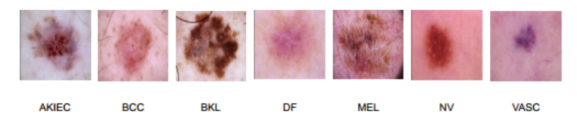
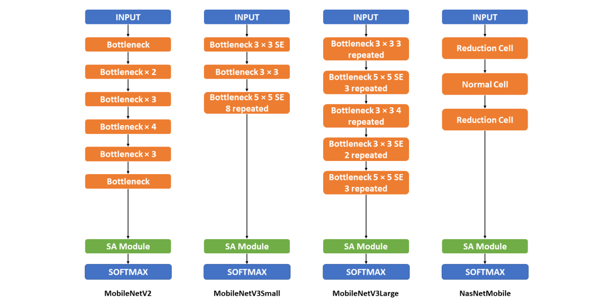
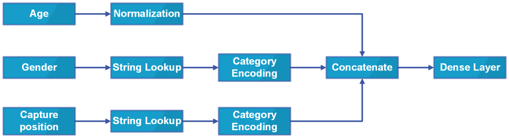
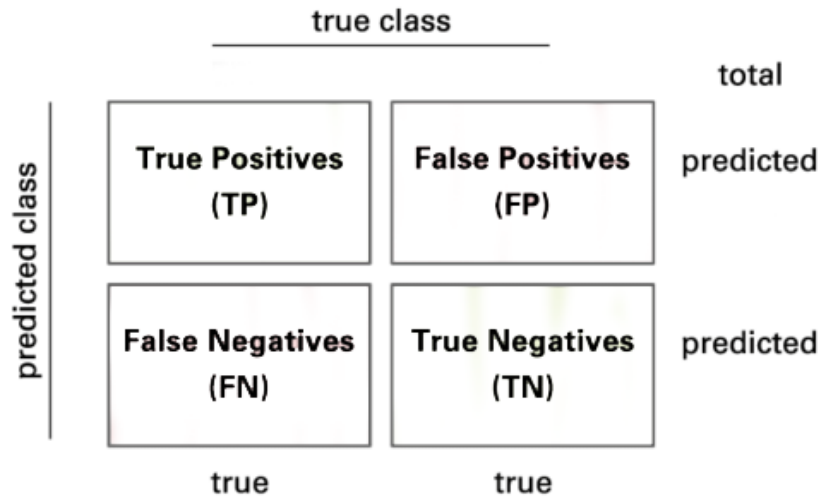
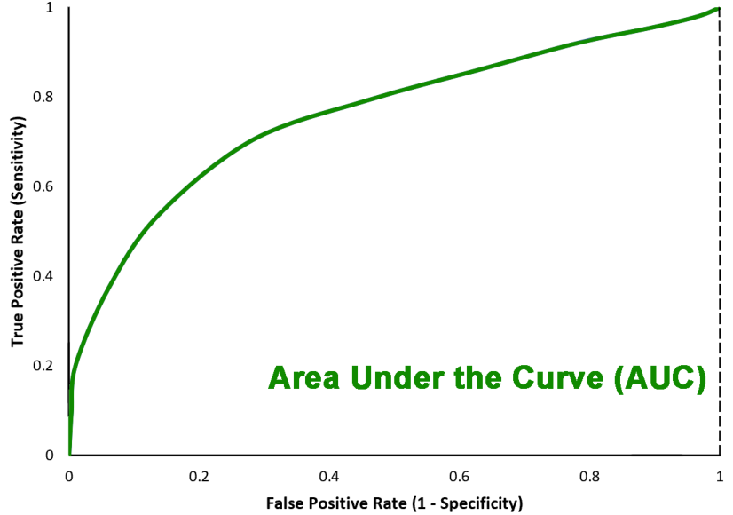
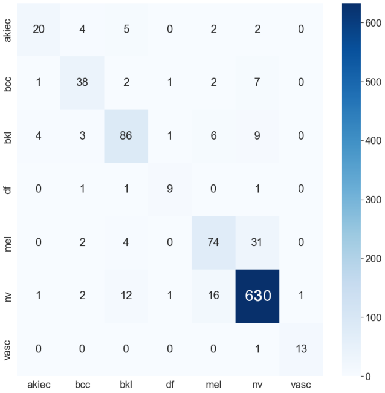
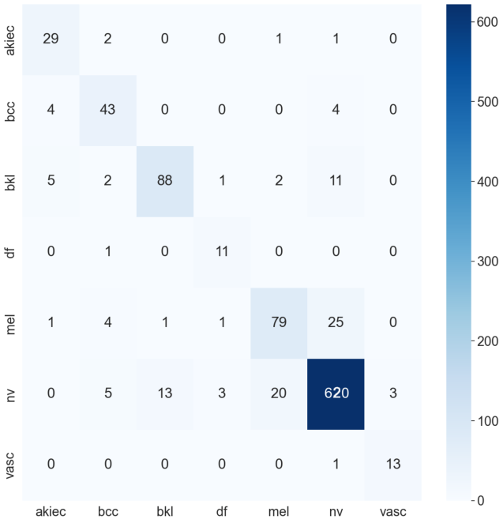
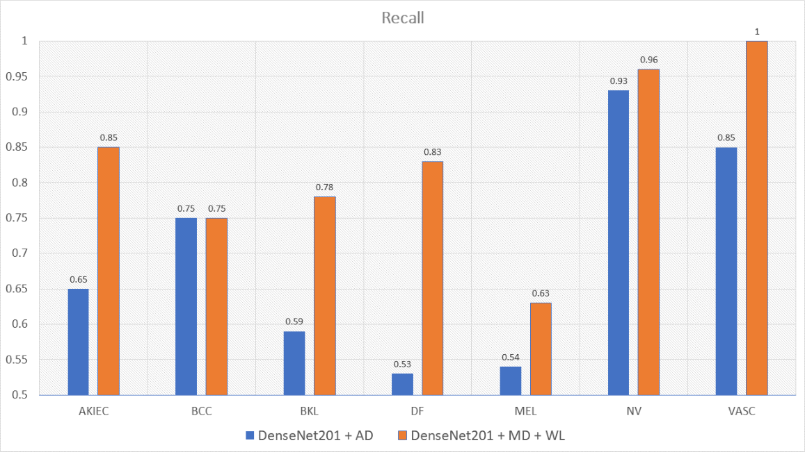
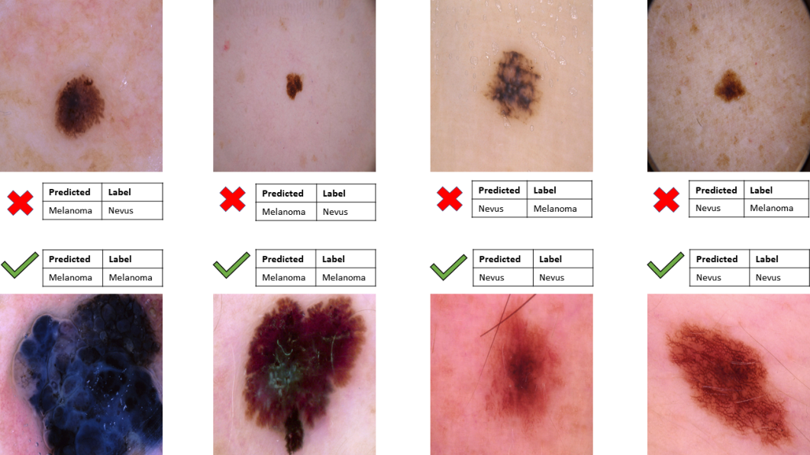

# Soft-Attention을 이용한 불균형 데이터 기반 피부 병변 분류

원문: Viet Dung Nguyen, Ngoc Dung Bui, Hoang Khoi Do, "Skin Lesion Classification on Imbalanced Data Using Deep Learning with Soft Attention", *Sensors*, 2022.

원문 PDF: `sensors-22-07530-v4.pdf`  
DOI: `10.3390/s22197530`

## 번역 원칙 안내

이 문서는 원 논문의 본문 흐름을 따라 한국어로 옮긴 Markdown 번역본이다. 그림은 원 PDF에서 figure 영역을 추출한 원본 figure를 사용했고, 표와 수식은 Markdown/LaTeX 형식으로 정리했다. ISIC2024 Kaggle 연구 설계와 연결되는 해석은 본문 번역과 섞지 않고 `ISIC2024 연구 코멘트 (번역 아님)` 블록으로만 분리했다.

## 초록

오늘날 산업 지역의 빠른 발달은 오염된 공기 때문에 피부 질환 발생 증가로 이어지고 있다. American Cancer Society의 보고에 따르면 2022년 약 100,000명이 피부암을 앓고, 이 중 7,600명 이상이 생존하지 못할 것으로 추정된다. 지방 병원과 의료기관의 의사가 과부하 상태이고 하위 의료기관 의사의 경험이 부족한 상황에서, 피부 질환을 빠르고 정확하게 진단하는 과정을 보조하는 도구는 필수적이다.

인공지능 기술의 강력한 발전과 함께 피부 질환 진단을 지원하기 위한 많은 해결책이 연구·개발되었다. 본 논문은 DenseNet, InceptionNet, ResNet 등 하나의 딥러닝 backbone 모델과 soft-attention을 결합하여 주요 피부 병변의 heatmap을 비지도 방식으로 추출하는 방법을 제안한다. 또한 나이와 성별을 포함한 개인 정보도 사용한다. 특히 데이터 불균형을 고려하는 새로운 loss function을 제안한다.

HAM10000 데이터셋에서의 실험 결과, InceptionResNetV2와 soft-attention, 새로운 loss function을 함께 사용했을 때 정확도 90%, precision 평균 0.81, F1-score 평균 0.81, recall 평균 0.82, AUC 0.99를 달성했다. 또한 MobileNetV3Large와 soft-attention 및 새로운 loss function을 결합한 모델은 파라미터 수가 11배 적고 hidden layer 수가 4배 적음에도 정확도 0.86을 얻었으며, InceptionResNetV2보다 30배 빠른 진단 시간을 보였다.

**키워드:** 피부 병변, 분류, 딥러닝, soft-attention, 불균형

## 1. 서론

### 1.1 문제 정의

피부암은 전 세계 사망의 주요 원인 중 하나인 흔한 암이다. 미국에서는 매일 9,500명 이상이 피부암으로 진단되며, 매년 360만 명이 기저세포 피부암 진단을 받는다. Skin Cancer Foundation에 따르면 전 세계 피부암 발생률은 계속 증가하고 있다. 2019년에는 미국에서 192,310건의 흑색종이 진단될 것으로 추정되었다. 반면 조기 진단을 받으면 생존율은 약 99%와 관련되지만, 질병이 피부를 넘어 진행되면 생존율은 낮다. 피부암 발생 증가, 낮은 인식 수준, 임상 전문성과 서비스 부족을 고려하면 효과적인 해결책이 필요하다.

최근 딥러닝과 기계학습 알고리즘은 다양한 과제, 특히 피부 질환 진단 과제에서 우수한 성능을 보였다. AI 기반 컴퓨터 보조 진단(CAD)은 진단, 예후, 치료 세 범주에서 활용된다. 진단에서는 AI 알고리즘이 의사의 검토 전에 질병 탐지를 보조하고, 예후에서는 환자의 병력과 의료 데이터를 기반으로 생존율을 예측하며, 치료에서는 특정 질환에 대한 솔루션 구축에 쓰인다.

피부암 사례 증가에 대응하기 위해 지난 10년간 DenseNet, EfficientNet, Inception, MobileNet, Xception, ResNet, NasNet 등 다양한 AI 모델이 사용되었다. 본 논문은 이들 모델을 backbone으로 사용하고 soft-attention과 메타데이터, 불균형 대응 loss를 결합한다.

### 1.2 관련 연구

피부 병변 분류는 새로운 분야가 아니며, 최근 몇 년 동안 높은 성능의 모델이 다수 제안되었다. 접근법은 크게 딥러닝 방식과 기계학습 방식으로 나눌 수 있다. 두 접근 모두 좋은 성능을 보였고, 데이터 증강과 feature extractor는 성능 향상에 중요한 보조 요소로 사용되었다.

**표 1. 관련 연구 요약**

| 연구 | 딥러닝 | 기계학습 | 데이터 증강 | 특징 추출 | 데이터셋 | 결과 |
|---|---|---|---|---|---|---|
| [1] | 분류 |  | x |  | HAM10000 | 0.93 ACC |
| [14] | 분류 | 분류 | x | x | HAM10000 | 0.90 ACC |
| [15] | 분류 | 분류 | x |  | HAM10000, PH2 | - |
| [16] | 분류 |  | x |  | HAM10000 | 0.88 ACC |
| [17] | 분류 |  | x |  | HAM10000 | 0.86 ACC |

#### 1.2.1 딥러닝 접근

딥러닝에서 soft-attention은 피부암 분류 성능을 개선하는 최신 기술 중 하나로 사용되었다. 선행 연구는 DenseNet201, InceptionResNetV2, ResNet50, VGG16 같은 backbone 모델에 soft-attention layer를 결합했다. 이 방식은 높은 정확도와 precision을 얻었지만, 불균형 데이터셋에서 단순 데이터 증강만으로는 class별 recall과 F1-score가 낮아지는 문제가 있었다. 본 연구는 이 문제를 고려해 새로운 가중 loss를 제안한다.

ResNet50과 VGG16을 ImageNet으로 사전학습한 뒤 transfer learning에 사용하고, histogram equalization 및 random forest, XGBoost, SVM과 결합한 연구도 있었다. 그러나 병변 주변 배경이 histogram에 영향을 주어 편향이 생길 수 있다. 본 연구는 병변 heatmap 특징을 만들 수 있는 soft-attention을 사용해 이런 문제를 완화하고자 한다.

#### 1.2.2 기계학습 접근

전통적 기계학습 접근은 segmentation, 수작업 특징 추출, 분류기를 결합하는 방식으로 진행되어 왔다. 그러나 데이터셋 불균형, class별 낮은 민감도, 임상적으로 중요한 소수 class의 오분류 문제가 남아 있다. 본 논문은 영상 backbone, soft-attention, 메타데이터, 가중 loss를 함께 사용해 class 불균형 문제를 줄이는 것을 목표로 한다.

## 2. 재료 및 방법

### 2.1 재료

#### 2.1.1 영상 데이터

본 논문은 Harvard Dataverse에 공개된 HAM10000 데이터셋을 사용한다. 이 데이터셋은 7개 class를 포함한다. 즉 actinic keratoses and intraepithelial carcinoma/Bowen's disease(AKIEC), basal cell carcinoma(BCC), benign keratosis-like lesions(BKL), dermatofibroma(DF), melanoma(MEL), melanocytic nevi(NV), vascular lesions(VASC)이다.

**표 2. HAM10000 데이터 분포**

| Class | AKIEC | BCC | BKL | DF | MEL | NV | VASC | Total |
|---|---:|---:|---:|---:|---:|---:|---:|---:|
| Sample 수 | 327 | 514 | 1099 | 115 | 1113 | 6705 | 142 | 10,015 |

50% 이상의 병변은 조직병리(HISTO)로 확인되었고, 나머지는 추적검사(FOLLOWUP), 전문가 합의(CONSENSUS), 생체 공초점 현미경(CONFOCAL)으로 ground truth가 정해졌다. 학습 전에 전체 데이터는 shuffle된 뒤 90% 학습, 10% 검증으로 분할된다. 영상은 RGB 형식이고 원본 크기는 $(450,600)$이다.

**그림 1.** 각 class의 예시 영상.

#### 2.1.2 메타데이터

HAM10000 데이터셋은 성별, 나이, 촬영 위치를 포함한 환자 메타데이터도 제공한다.

**표 3. 데이터셋 메타데이터 예시**

| ID | Age | Gender | Local |
|---|---:|---|---|
| ISIC-00001 | 15 | Male | back |
| ISIC-00002 | 85 | Female | elbow |

> **ISIC2024 연구 코멘트 (번역 아님)**
> 이 내용은 원문 번역이 아니라, ISIC2024 Kaggle 멀티모달 연구 설계에 참고할 점을 정리한 주석이다.
> 이 논문은 나이·성별·촬영 부위 같은 ordinary metadata를 이미지 모델과 결합한다는 점에서 참고할 수 있다. ISIC2024에서는 여기에 3D-TBP 기반 병변 계측 feature를 더할 수 있지만, `iddx_full`이나 diagnosis text는 ordinary tabular feature set에 넣지 않는다.

### 2.2 방법론

#### 2.2.1 전체 구조

전체 모델 구조는 두 입력을 받는다. 첫 번째는 영상 데이터이고, 두 번째는 메타데이터이다. 메타데이터 branch는 전처리된 뒤 dense layer에 들어가며, 이후 soft-attention layer 출력과 concat된다.

**그림 2.** 전체 모델 구조.

**그림 3.** 제안 backbone 모델 구조. DenseNet201, InceptionResNetV2, ResNet50, ResNet152, NasNetLarge 같은 non-mobile backbone과 soft-attention의 결합 구조를 보여준다.

**그림 4.** MobileNetV2, MobileNetV3Small, MobileNetV3Large, NasNetMobile 등 mobile 기반 backbone과 soft-attention 결합 구조.

#### 2.2.2 입력 스키마

Backbone마다 요구되는 입력 영상 크기와 pixel value 범위가 다르다. DenseNet201과 ResNet 계열은 ImageNet 기반 입력 전처리를 사용하고, MobileNet과 NasNet 계열은 $[-1,1]$ 범위의 pixel 값을 요구한다. 메타데이터에서는 unknown 값을 별도 category로 유지하고, 성별과 촬영 부위는 범주형 인코딩하며, 나이는 수치적으로 정규화한다. 처리된 메타데이터는 4096 neuron dense layer에 들어가고, 이후 soft-attention 출력과 결합된다.

**그림 5.** 입력 스키마.

#### 2.2.3 Backbone 모델

본 논문에서 사용한 backbone 모델의 크기, 학습 가능 파라미터 수, depth는 다음과 같다.

**표 4. Backbone 모델 크기, 파라미터, depth**

| 모델 | 크기(MB) | 학습 가능 파라미터 | Depth |
|---|---:|---:|---:|
| ResNet50 | 98 | 25,583,592 | 107 |
| ResNet152 | 232 | 60,268,520 | 311 |
| DenseNet201 | 80 | 20,013,928 | 402 |
| InceptionResNetV2 | 215 | 55,813,192 | 449 |
| MobileNetV2 | 14 | 3,504,872 | 105 |

#### 2.2.4 Soft-Attention

Soft-attention layer는 고해상도 영상에서 grid 기반 feature extraction을 수행하고, CNN이 생성한 tensor를 기반으로 attention map을 만든다. 원 논문은 soft-attention feature를 다음과 같이 표현한다.

$$
f_{sa} = \gamma t \sum_{k=1}^{K} \mathrm{softmax}(W_k * t)
\tag{1}
$$

여기서 $t \in \mathbb{R}^{h \times w \times d}$는 CNN이 생성한 feature tensor이고, $W_k$는 attention weight, $K$는 attention head 수에 해당한다.

**그림 6.** Soft-attention layer.

**그림 7.** Soft-attention module.

#### 2.2.5 불균형 대응 loss function

데이터셋은 class별 sample 수가 매우 불균형하다. 원 논문은 class weight를 사용한 cross-entropy 형태의 loss를 제안한다.

$$
L(\theta, x_n) = -\frac{1}{N}\sum_{c=1}^{C}\sum_{n=1}^{N} W_c \times y_{nc} \times \log(\hat{y}_{nc})
\tag{2}
$$

가중치 $W$는 전체 데이터 수와 class별 데이터 수를 고려해 정의된다.

$$
W = N \odot D
\tag{3}
$$

$$
D = \frac{1}{C}\odot
\begin{bmatrix}
\frac{1}{N_1} & \frac{1}{N_2} & \cdots & \frac{1}{N_n}
\end{bmatrix}
\tag{4}
$$

> **ISIC2024 연구 코멘트 (번역 아님)**
> Ultra-rare malignant target에서는 class weight와 sampler가 성능에 큰 영향을 준다. 우리 실험에서는 class weight, oversampling, balanced batch sampler를 반드시 training split에서만 계산해야 하며, validation/test 분포를 보거나 전체 데이터로 weight를 계산하면 leakage로 간주한다.

### 2.3 평가 지표

다중 class confusion matrix $A$는 다음과 같이 나타낼 수 있다.

$$
A =
\begin{bmatrix}
a_{11} & a_{12} & \cdots & a_{1j} \\
a_{21} & a_{22} & \cdots & a_{2j} \\
\vdots & \vdots & \ddots & \vdots \\
a_{i1} & a_{i2} & \cdots & a_{ij}
\end{bmatrix}
$$

**그림 8.** Confusion matrix.

각 class의 false positive, false negative, true negative는 다음과 같이 계산된다.

$$
FP = -TP + \sum_{k=1}^{i} A_{ki}
\tag{5}
$$

$$
FN = -TP + \sum_{k=1}^{j} A_{kj}
\tag{6}
$$

$$
TN_c = \sum_{i=1}^{C}\sum_{j=1}^{C} a_{ij}
- \left(\sum_{k=1}^{i} A_{i=c,ki} + \sum_{k=1}^{j} A_{j=c,kj}\right)
+ a_{i=c,j=c}
\tag{7}
$$

민감도, 특이도, precision, F1-score, accuracy, balanced accuracy는 다음과 같다.

$$
\mathrm{Sensitivity} = \frac{TP}{TP + FN}
\tag{8}
$$

$$
\mathrm{Specificity} = \frac{TN}{TN + FP}
\tag{9}
$$

$$
\mathrm{Precision} = \frac{TP}{TP + FP}
\tag{10}
$$

$$
\mathrm{F1\text{-}score} = \frac{2TP}{2TP + FP + FN}
\tag{11}
$$

$$
\mathrm{Accuracy} = \frac{TP + TN}{TP + FP + FN + TN}
\tag{12}
$$

$$
\mathrm{Balanced\ Accuracy} = \frac{\mathrm{Sens} + \mathrm{Spec}}{2}
\tag{13}
$$

**그림 9.** ROC 곡선 아래 면적(AUC).

## 3. 결과

### 3.1 실험 설정

학습 전 데이터셋은 학습 90%, 검증 10%로 분할되었다. HAM10000에서 제공되는 테스트셋은 857개 영상으로 구성된다. 데이터 증강 효과를 분석하기 위해 학습 전 영상 데이터는 rotation, width/height shift, zoom, horizontal/vertical flipping 등을 사용해 53,573장으로 증강되었다.

모든 모델은 Adam optimizer로 학습되었고 초기 learning rate는 0.001로 설정되었다. 검증 정확도가 25 epoch 동안 증가하지 않으면 early stopping을 적용했다.

### 3.2 정확도 비교

메타데이터와 새로운 weight loss를 사용한 모델은 단순 증강 데이터만 사용한 모델보다 전반적으로 더 높은 정확도를 보였다.

**표 5. 전체 모델 정확도**

| 모델 | ACC(증강 데이터) | ACC(메타데이터) |
|---|---:|---:|
| InceptionResNetV2 | 0.79 | 0.90 |
| DenseNet201 | 0.84 | 0.89 |
| ResNet50 | 0.76 | 0.70 |
| ResNet152 | 0.81 | 0.57 |
| NasNetLarge | 0.56 | 0.84 |
| MobileNetV2 | 0.83 | 0.81 |
| MobileNetV3Small | 0.83 | 0.78 |
| MobileNetV3Large | 0.85 | 0.86 |
| NasNetMobile | 0.84 | 0.86 |

상위 두 모델인 DenseNet201과 InceptionResNetV2의 confusion matrix는 다음과 같다.

**그림 10.** DenseNet201 confusion matrix.

**그림 11.** InceptionResNetV2 confusion matrix.

### 3.3 F1-score와 recall 비교

증강 데이터만 사용한 모델은 일부 class, 특히 sample 수가 적은 class에서 낮은 F1-score와 recall을 보였다. 반면 메타데이터와 새로운 weight loss를 사용한 모델은 class별 성능이 더 균형적이었다. 특히 InceptionResNetV2와 DenseNet201은 적은 sample을 가진 class에서도 상대적으로 안정적인 성능을 보였다.

**그림 12.** 증강 데이터로 학습한 DenseNet201과 메타데이터 및 weight loss로 학습한 DenseNet201의 F1-score 비교.

**그림 13.** 증강 데이터로 학습한 InceptionResNetV2와 메타데이터 및 weight loss로 학습한 InceptionResNetV2의 F1-score 비교.

**그림 14.** 증강 데이터로 학습한 DenseNet201과 메타데이터 및 weight loss로 학습한 DenseNet201의 recall 비교.

**그림 15.** 증강 데이터로 학습한 InceptionResNetV2와 메타데이터 및 weight loss로 학습한 InceptionResNetV2의 recall 비교.

### 3.4 MobileNetV3Large와 대형 모델 비교

MobileNetV3Large는 DenseNet201과 InceptionResNetV2보다 훨씬 적은 파라미터와 얕은 depth를 가지면서도 유사한 정확도를 달성했다. 추론 시간은 InceptionResNetV2보다 훨씬 짧아 모바일 또는 IoT 장치 적용 가능성을 보여준다.

**표 6. MobileNetV3Large와 DenseNet201, InceptionResNetV2 비교**

| 모델 | MobileNetV3Large | DenseNet201 | InceptionResNetV2 |
|---|---:|---:|---:|
| 학습 가능 파라미터 | 5,490,039 | 17,382,935 | 47,599,671 |
| Depth | 118 | 402 | 449 |
| Accuracy | 0.86 | 0.89 | 0.90 |
| Training time(seconds/epoch) | 116 | 1000 | 3500 |
| Infer time(seconds) | 0.13 | 1.16 | 4.08 |

### 3.5 AUC와 loss ablation

메타데이터를 사용하는 InceptionResNetV2와 DenseNet201은 모두 AUC 0.99를 달성했다. 이는 증강 데이터만 사용하는 경우보다 높다.

**표 7. 모델별 AUC**

| 모델 | AUC(증강 데이터) | AUC(메타데이터) |
|---|---:|---:|
| InceptionResNetV2 | 0.971 | 0.99 |
| DenseNet201 | 0.93 | 0.99 |
| ResNet50 | 0.95 | 0.93 |
| ResNet152 | 0.97 | 0.87 |
| NasNetLarge | 0.74 | 0.96 |

**그림 16.** DenseNet201과 InceptionResNetV2의 ROC.

새로운 loss function은 기존 weighting 방식이나 weight를 사용하지 않는 경우보다 높은 정확도를 보였다.

**표 8. Loss 기반 모델 정확도 비교**

| 모델 | Weight 없음 | 기존 loss 정확도 | 새 loss 정확도 |
|---|---:|---:|---:|
| InceptionResNetV2 | 0.74 | 0.79 | 0.90 |
| DenseNet201 | 0.81 | 0.84 | 0.89 |
| MobileNetV3Large | 0.79 | 0.80 | 0.86 |

> **ISIC2024 연구 코멘트 (번역 아님)**
> 이 결과는 imbalance ablation을 별도 실험군으로 두어야 함을 보여준다. 우리 프로젝트에서는 plain BCE, weighted BCE, focal loss, class-balanced loss, positive oversampling, balanced batch sampler, validation-selected threshold를 같은 split에서 비교해야 한다.

### 3.6 비교 분석과 오류 양상

InceptionResNetV2, soft-attention, 메타데이터, 새로운 loss function의 조합은 본 논문에서 가장 좋은 모델이다. 정확도는 0.90으로 일부 선행 연구의 0.93보다 낮지만, F1-score, recall, AUC는 더 균형적이다. 특히 imbalanced data에서 class별 성능 균형은 단순 accuracy보다 중요하다.

**표 9. 비교 분석**

| 접근법 | Accuracy | Precision | F1-score | Recall | AUC |
|---|---:|---:|---:|---:|---:|
| InceptionResNetV2 [1] | 0.93 | 0.89 | 0.75 | 0.71 | 0.97 |
| [14] | - | 0.88 | 0.77 | 0.74 | - |
| [16] | 0.88 | - | - | - | - |
| [17] | 0.86 | - | - | - | - |
| GradCam and Kernel SHAP [18] | 0.88 | - | - | - | - |
| 본 논문 InceptionResNetV2 + SA + metadata + new loss | 0.90 | 0.81 | 0.81 | 0.82 | 0.99 |

모델은 일부 경우 melanoma와 검은색 nevus를 혼동했다. 두 병변의 색과 크기가 유사한 경우 모델이 melanoma를 nevus로, 또는 검은 nevus를 melanoma로 분류할 수 있다.

**그림 17.** Melanoma와 nevus를 구분하는 모델 능력 및 혼동 사례.

## 4. 결론

본 연구는 하나의 backbone 모델과 soft-attention을 결합한 모델을 제안했다. 모델은 영상 데이터와 메타데이터라는 두 입력을 사용하며, 데이터 불균형 문제를 해결하기 위해 새로운 weight loss function을 적용했다. 최종적으로 InceptionResNetV2, soft-attention, 메타데이터의 조합이 정확도 0.90으로 가장 좋은 모델이었다.

정확도와 precision이 모든 비교에서 최고는 아니지만, F1-score, recall, AUC가 각각 0.86, 0.81, 0.975 수준으로 가장 균형적인 지표를 보였다. 따라서 InceptionResNetV2는 low-sample class를 포함한 모든 class를 비교적 잘 분류할 수 있다. 또한 MobileNetV3Large, soft-attention, 메타데이터의 조합은 정확도 0.86을 달성하면서도 파라미터 수와 depth가 훨씬 작고 추론 시간이 짧아 모바일 및 IoT 장치 적용 가능성을 보여준다.

제안 방법은 여전히 melanoma와 검은색 nevus를 구분하는 데 어려움이 있다. 두 병변이 유사한 색과 크기를 갖는 경우 오분류가 발생할 수 있으며, 향후에는 색상 특징 처리 방식 변경 또는 더 정교한 병변 표현 학습이 필요하다.

## 저자 기여, 연구비, 윤리, 데이터 가용성

원문에 따르면 개념화는 V.D.N.과 H.K.D., 방법론은 V.D.N.과 H.K.D., 소프트웨어는 H.K.D.가 담당했다. 본 연구는 외부 연구비를 받지 않았으며, 기관생명윤리위원회 및 사전동의 항목은 해당 없음으로 명시되었다. 코드와 데이터 분석 보고서는 원문 Data Availability Statement의 GitHub 저장소에서 확인할 수 있다.

## 약어

| 약어 | 의미 |
|---|---|
| CAD | Computer-aided diagnosis |
| AI | Artificial Intelligence |
| AKIEC | Actinic keratoses and intraepithelial carcinoma or Bowen's disease |
| BCC | Basal Cell Carcinoma |
| BKL | Benign Keratosis-like Lesions |
| DF | Dermatofibroma |
| MEL | Melanoma |
| NV | Melanocytic Nevi |
| VASC | Vascular Lesions |
| HISTO | Histopathology |
| FOLLOWUP | Follow-up examination |
| CONSENSUS | Expert Consensus |
| CONFOCAL | Confocal Microscopy |
| RGB | Red Green Blue |
| TP/FN/TN/FP | True Positive / False Negative / True Negative / False Positive |
| AUC | Area Under the Curve |
| ROC | Receiver Operating Curve |

## 부록 표 요약

원문 Appendix A와 Appendix B는 mobile/non-mobile backbone의 상세 layer 구성을 표로 제공한다. 본 번역본에서는 본문 이해에 필요한 핵심 구조와 성능표를 우선 반영했으며, 세부 layer-by-layer 구조는 원문 Appendix 표 A1-A5를 대조하도록 한다.

## 참고문헌

참고문헌 상세 목록은 원문 PDF의 References 절을 따른다. 본 번역본에서는 본문 인용 번호와 모델명, 데이터셋명, 지표 표기를 원문과 대조 가능하게 유지했다.
