# Segmentation and Classification of Skin Cancer Diseases Based on Deep Learning

## 출처/링크

출처: IEEE Access, 2025  
DOI: `10.1109/ACCESS.2025.3569170`  
Google Scholar 인용: 확인 불가 (조회일: 2026-05-20, 자동 조회 중 Google Scholar reCAPTCHA 발생)  
PDF: [Segmentation_and_Classification_of_Skin_Cancer_Diseases_Based_on_Deep_Learning_Challenges_and_Future_Directions.pdf](../paper/Segmentation_and_Classification_of_Skin_Cancer_Diseases_Based_on_Deep_Learning_Challenges_and_Future_Directions.pdf)

## 주요 Figure 및 Table

원문 PDF의 본문 Figure/Table을 번호 단위로 추출해 로컬 asset으로 저장했다. Caption은 길게 옮기지 않고, 각 항목이 보여주는 내용과 ISIC2024 연구 관점의 의미를 한국어로 의역해 정리했다.

**Figure 1. 논문 주장에 필요한 핵심 시각 자료**

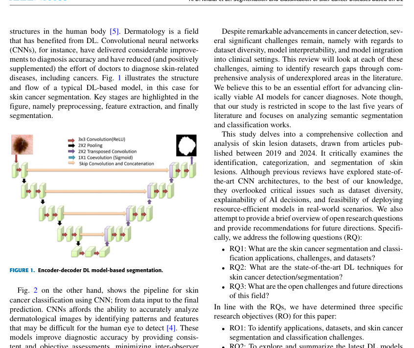

해석: 이 Figure는 논문 주장에 필요한 핵심 시각 자료 범주를 시각적으로 보여준다. 원문 맥락에서는 해당 논문의 핵심 근거를 보강하는 자료이며, 특히 skin cancer segmentation/classification review의 모델군, dataset, challenge, future direction 관련 내용을 이해하는 데 도움이 된다. ISIC2024 연구에서는 related work에서 segmentation, classification, XAI, future direction을 배경으로 정리할 때 사용할 수 있다.

**Figure 2. 논문 주장에 필요한 핵심 시각 자료**

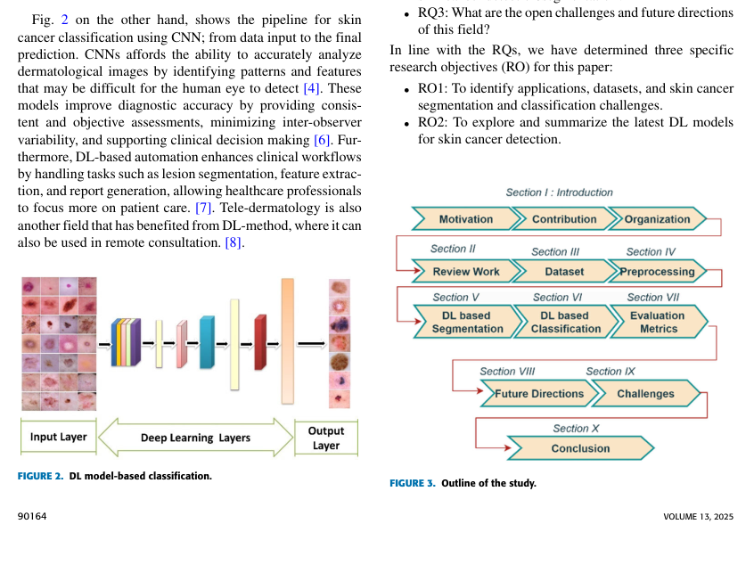

해석: 이 Figure는 논문 주장에 필요한 핵심 시각 자료 범주를 시각적으로 보여준다. 원문 맥락에서는 해당 논문의 핵심 근거를 보강하는 자료이며, 특히 skin cancer segmentation/classification review의 모델군, dataset, challenge, future direction 관련 내용을 이해하는 데 도움이 된다. ISIC2024 연구에서는 related work에서 segmentation, classification, XAI, future direction을 배경으로 정리할 때 사용할 수 있다.

**Figure 3. 논문 주장에 필요한 핵심 시각 자료**

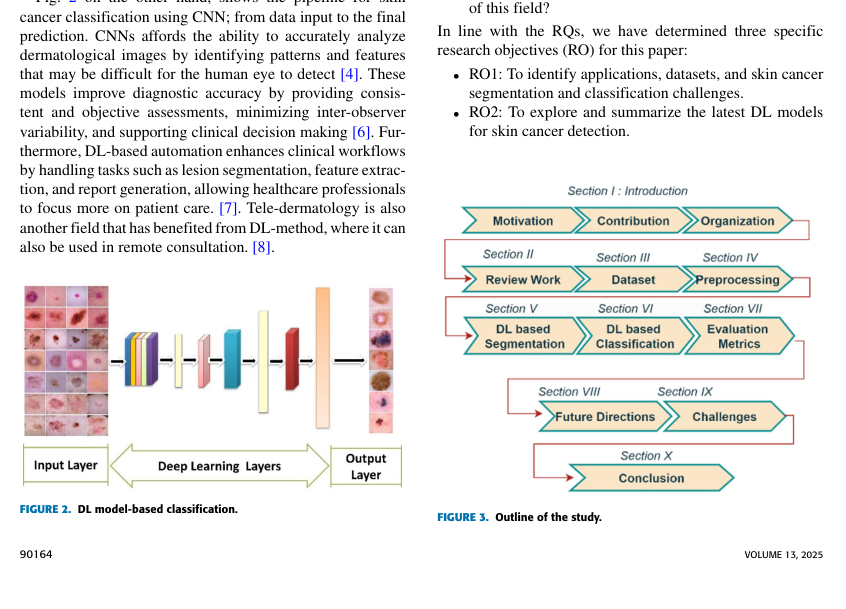

해석: 이 Figure는 논문 주장에 필요한 핵심 시각 자료 범주를 시각적으로 보여준다. 원문 맥락에서는 해당 논문의 핵심 근거를 보강하는 자료이며, 특히 skin cancer segmentation/classification review의 모델군, dataset, challenge, future direction 관련 내용을 이해하는 데 도움이 된다. ISIC2024 연구에서는 related work에서 segmentation, classification, XAI, future direction을 배경으로 정리할 때 사용할 수 있다.

**Table 1. 성능 비교와 정량 평가 결과 요약**

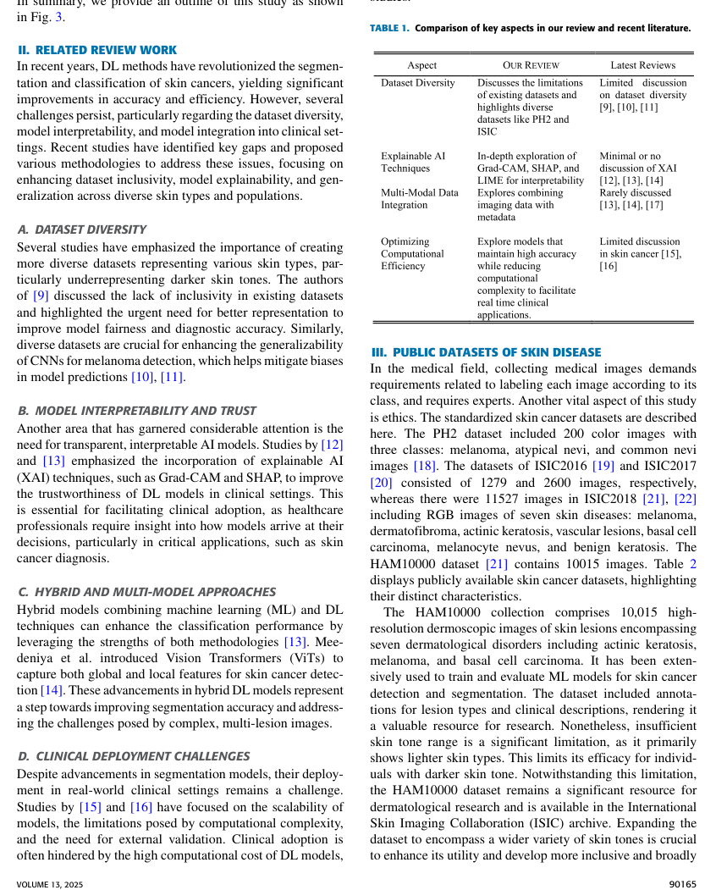

해석: 이 Table은 성능 비교와 정량 평가 결과 범주의 정보를 표 형태로 정리한다. 비교 축과 수치는 해당 논문의 핵심 근거를 보강하며, 특히 skin cancer segmentation/classification review의 모델군, dataset, challenge, future direction 관련 내용을 비교해 읽는 기준이 된다. ISIC2024 연구에서는 related work에서 segmentation, classification, XAI, future direction을 배경으로 정리할 때 사용할 수 있다.

**Table 3. 성능 비교와 정량 평가 결과 요약**

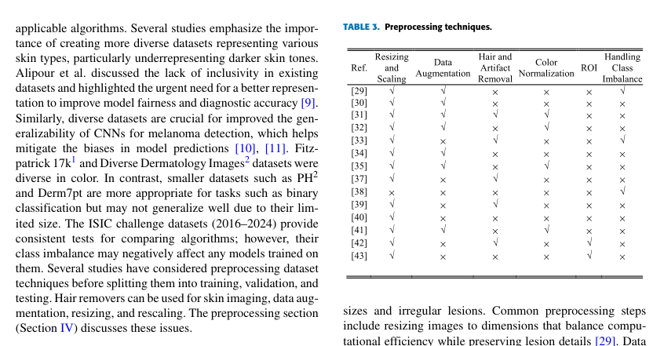

해석: 이 Table은 성능 비교와 정량 평가 결과 범주의 정보를 표 형태로 정리한다. 비교 축과 수치는 해당 논문의 핵심 근거를 보강하며, 특히 skin cancer segmentation/classification review의 모델군, dataset, challenge, future direction 관련 내용을 비교해 읽는 기준이 된다. ISIC2024 연구에서는 related work에서 segmentation, classification, XAI, future direction을 배경으로 정리할 때 사용할 수 있다.

**Table 2. 데이터 구성, 예시, 분포 특성 요약**

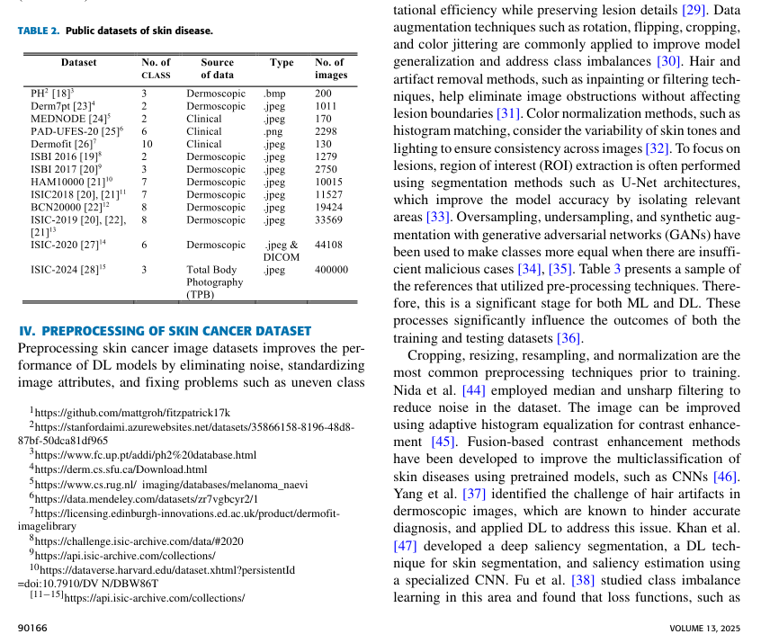

해석: 이 Table은 데이터 구성, 예시, 분포 특성 범주의 정보를 표 형태로 정리한다. 비교 축과 수치는 해당 논문의 핵심 근거를 보강하며, 특히 skin cancer segmentation/classification review의 모델군, dataset, challenge, future direction 관련 내용을 비교해 읽는 기준이 된다. ISIC2024 연구에서는 related work에서 segmentation, classification, XAI, future direction을 배경으로 정리할 때 사용할 수 있다.

**Figure 6. 논문 주장에 필요한 핵심 시각 자료**

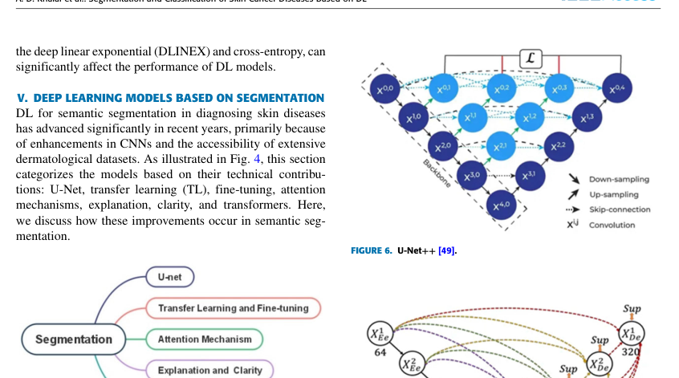

해석: 이 Figure는 논문 주장에 필요한 핵심 시각 자료 범주를 시각적으로 보여준다. 원문 맥락에서는 해당 논문의 핵심 근거를 보강하는 자료이며, 특히 skin cancer segmentation/classification review의 모델군, dataset, challenge, future direction 관련 내용을 이해하는 데 도움이 된다. ISIC2024 연구에서는 related work에서 segmentation, classification, XAI, future direction을 배경으로 정리할 때 사용할 수 있다.

**Figure 4. 논문 주장에 필요한 핵심 시각 자료**

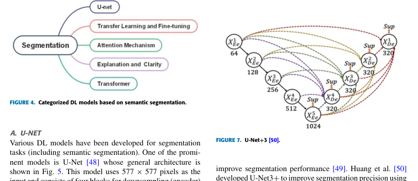

해석: 이 Figure는 논문 주장에 필요한 핵심 시각 자료 범주를 시각적으로 보여준다. 원문 맥락에서는 해당 논문의 핵심 근거를 보강하는 자료이며, 특히 skin cancer segmentation/classification review의 모델군, dataset, challenge, future direction 관련 내용을 이해하는 데 도움이 된다. ISIC2024 연구에서는 related work에서 segmentation, classification, XAI, future direction을 배경으로 정리할 때 사용할 수 있다.

**Figure 7. 논문 주장에 필요한 핵심 시각 자료**

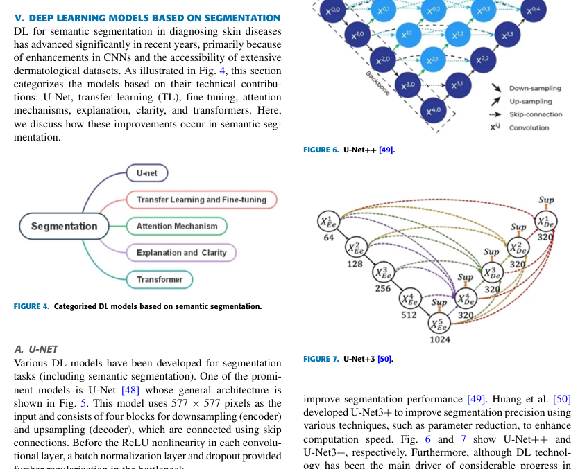

해석: 이 Figure는 논문 주장에 필요한 핵심 시각 자료 범주를 시각적으로 보여준다. 원문 맥락에서는 해당 논문의 핵심 근거를 보강하는 자료이며, 특히 skin cancer segmentation/classification review의 모델군, dataset, challenge, future direction 관련 내용을 이해하는 데 도움이 된다. ISIC2024 연구에서는 related work에서 segmentation, classification, XAI, future direction을 배경으로 정리할 때 사용할 수 있다.

**Figure 5. 연구 설계와 모델/데이터 처리 흐름**

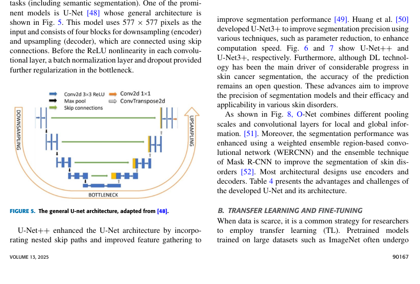

해석: 이 Figure는 연구 설계와 모델/데이터 처리 흐름 범주를 시각적으로 보여준다. 원문 맥락에서는 해당 논문의 핵심 근거를 보강하는 자료이며, 특히 skin cancer segmentation/classification review의 모델군, dataset, challenge, future direction 관련 내용을 이해하는 데 도움이 된다. ISIC2024 연구에서는 related work에서 segmentation, classification, XAI, future direction을 배경으로 정리할 때 사용할 수 있다.

**Figure 8. 연구 설계와 모델/데이터 처리 흐름**

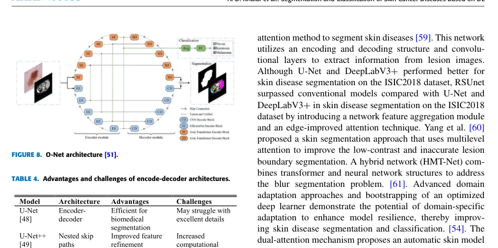

해석: 이 Figure는 연구 설계와 모델/데이터 처리 흐름 범주를 시각적으로 보여준다. 원문 맥락에서는 해당 논문의 핵심 근거를 보강하는 자료이며, 특히 skin cancer segmentation/classification review의 모델군, dataset, challenge, future direction 관련 내용을 이해하는 데 도움이 된다. ISIC2024 연구에서는 related work에서 segmentation, classification, XAI, future direction을 배경으로 정리할 때 사용할 수 있다.

**Table 4. 연구 설계와 모델/데이터 처리 흐름 요약**

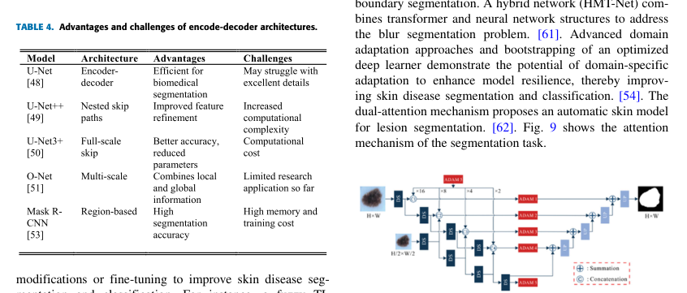

해석: 이 Table은 연구 설계와 모델/데이터 처리 흐름 범주의 정보를 표 형태로 정리한다. 비교 축과 수치는 해당 논문의 핵심 근거를 보강하며, 특히 skin cancer segmentation/classification review의 모델군, dataset, challenge, future direction 관련 내용을 비교해 읽는 기준이 된다. ISIC2024 연구에서는 related work에서 segmentation, classification, XAI, future direction을 배경으로 정리할 때 사용할 수 있다.

**Figure 9. 모델 해석과 시각화 결과**

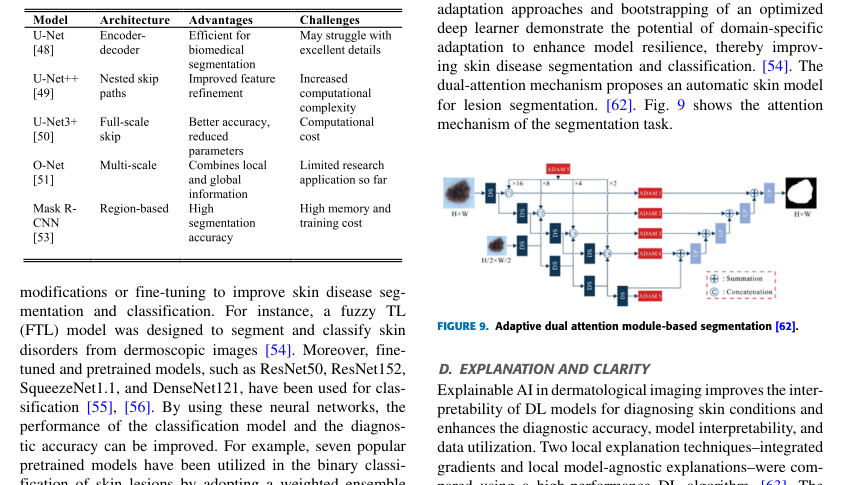

해석: 이 Figure는 모델 해석과 시각화 결과 범주를 시각적으로 보여준다. 원문 맥락에서는 해당 논문의 핵심 근거를 보강하는 자료이며, 특히 skin cancer segmentation/classification review의 모델군, dataset, challenge, future direction 관련 내용을 이해하는 데 도움이 된다. ISIC2024 연구에서는 related work에서 segmentation, classification, XAI, future direction을 배경으로 정리할 때 사용할 수 있다.

**Table 5. 비교 항목과 핵심 수치 요약**

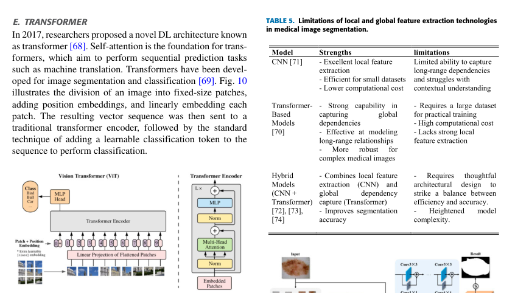

해석: 이 Table은 비교 항목과 핵심 수치 범주의 정보를 표 형태로 정리한다. 비교 축과 수치는 해당 논문의 핵심 근거를 보강하며, 특히 skin cancer segmentation/classification review의 모델군, dataset, challenge, future direction 관련 내용을 비교해 읽는 기준이 된다. ISIC2024 연구에서는 related work에서 segmentation, classification, XAI, future direction을 배경으로 정리할 때 사용할 수 있다.

**Figure 10. 논문 주장에 필요한 핵심 시각 자료**

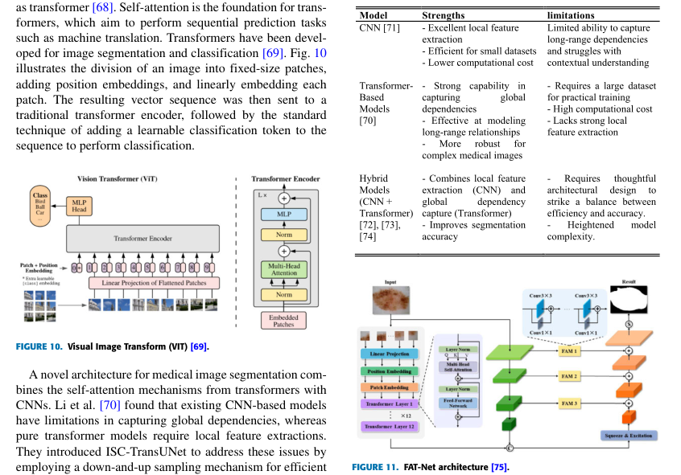

해석: 이 Figure는 논문 주장에 필요한 핵심 시각 자료 범주를 시각적으로 보여준다. 원문 맥락에서는 해당 논문의 핵심 근거를 보강하는 자료이며, 특히 skin cancer segmentation/classification review의 모델군, dataset, challenge, future direction 관련 내용을 이해하는 데 도움이 된다. ISIC2024 연구에서는 related work에서 segmentation, classification, XAI, future direction을 배경으로 정리할 때 사용할 수 있다.

**Figure 11. 연구 설계와 모델/데이터 처리 흐름**

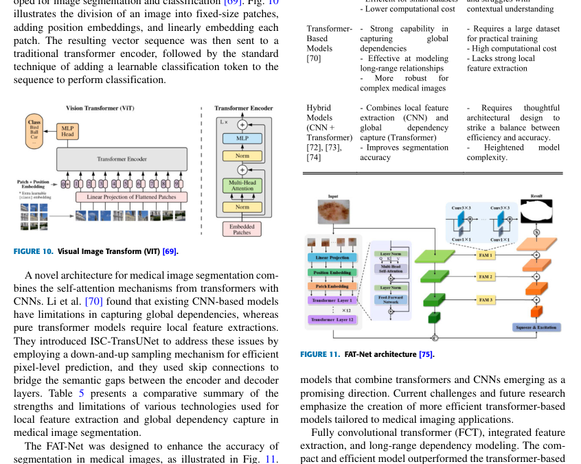

해석: 이 Figure는 연구 설계와 모델/데이터 처리 흐름 범주를 시각적으로 보여준다. 원문 맥락에서는 해당 논문의 핵심 근거를 보강하는 자료이며, 특히 skin cancer segmentation/classification review의 모델군, dataset, challenge, future direction 관련 내용을 이해하는 데 도움이 된다. ISIC2024 연구에서는 related work에서 segmentation, classification, XAI, future direction을 배경으로 정리할 때 사용할 수 있다.

**Figure 13. 논문 주장에 필요한 핵심 시각 자료**

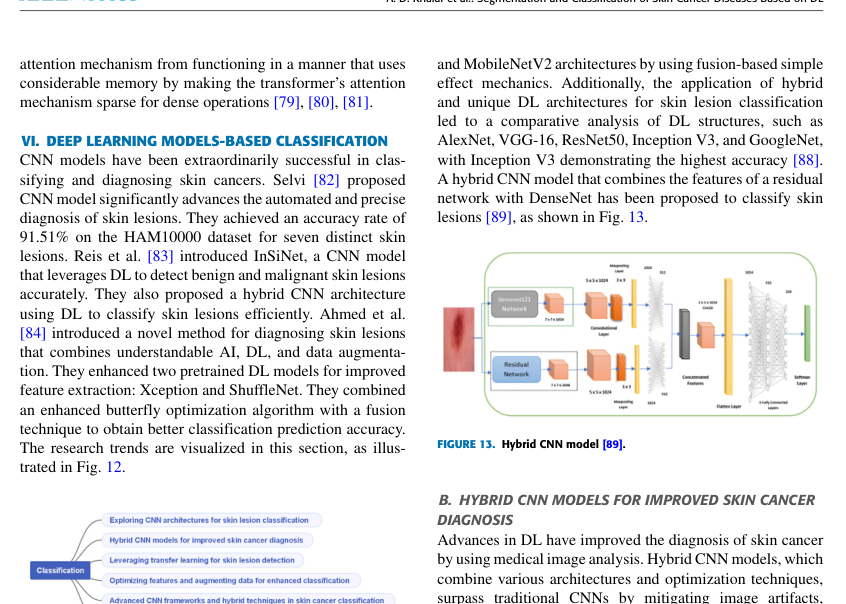

해석: 이 Figure는 논문 주장에 필요한 핵심 시각 자료 범주를 시각적으로 보여준다. 원문 맥락에서는 해당 논문의 핵심 근거를 보강하는 자료이며, 특히 skin cancer segmentation/classification review의 모델군, dataset, challenge, future direction 관련 내용을 이해하는 데 도움이 된다. ISIC2024 연구에서는 related work에서 segmentation, classification, XAI, future direction을 배경으로 정리할 때 사용할 수 있다.

**Figure 12. 논문 주장에 필요한 핵심 시각 자료**

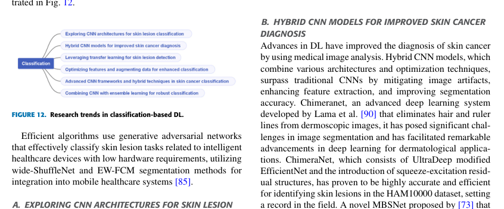

해석: 이 Figure는 논문 주장에 필요한 핵심 시각 자료 범주를 시각적으로 보여준다. 원문 맥락에서는 해당 논문의 핵심 근거를 보강하는 자료이며, 특히 skin cancer segmentation/classification review의 모델군, dataset, challenge, future direction 관련 내용을 이해하는 데 도움이 된다. ISIC2024 연구에서는 related work에서 segmentation, classification, XAI, future direction을 배경으로 정리할 때 사용할 수 있다.

**Figure 14. 논문 주장에 필요한 핵심 시각 자료**

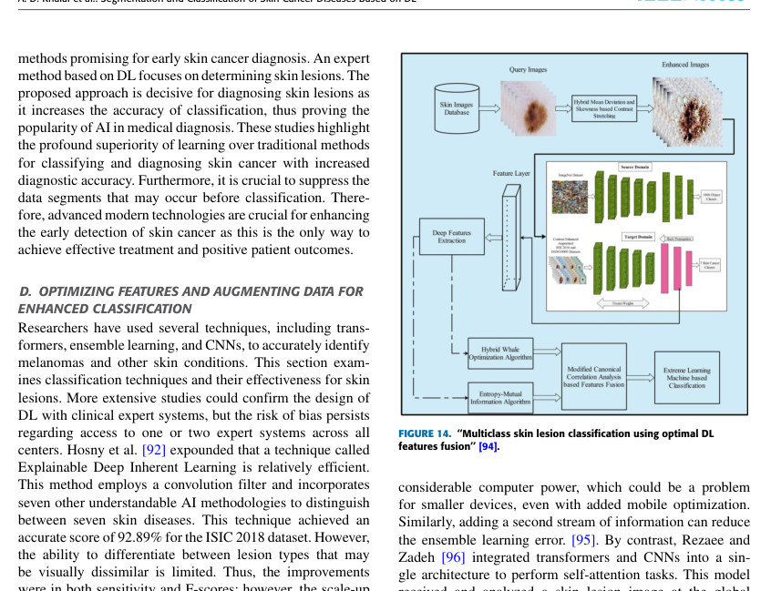

해석: 이 Figure는 논문 주장에 필요한 핵심 시각 자료 범주를 시각적으로 보여준다. 원문 맥락에서는 해당 논문의 핵심 근거를 보강하는 자료이며, 특히 skin cancer segmentation/classification review의 모델군, dataset, challenge, future direction 관련 내용을 이해하는 데 도움이 된다. ISIC2024 연구에서는 related work에서 segmentation, classification, XAI, future direction을 배경으로 정리할 때 사용할 수 있다.

**Table 6. 데이터 구성, 예시, 분포 특성 요약**

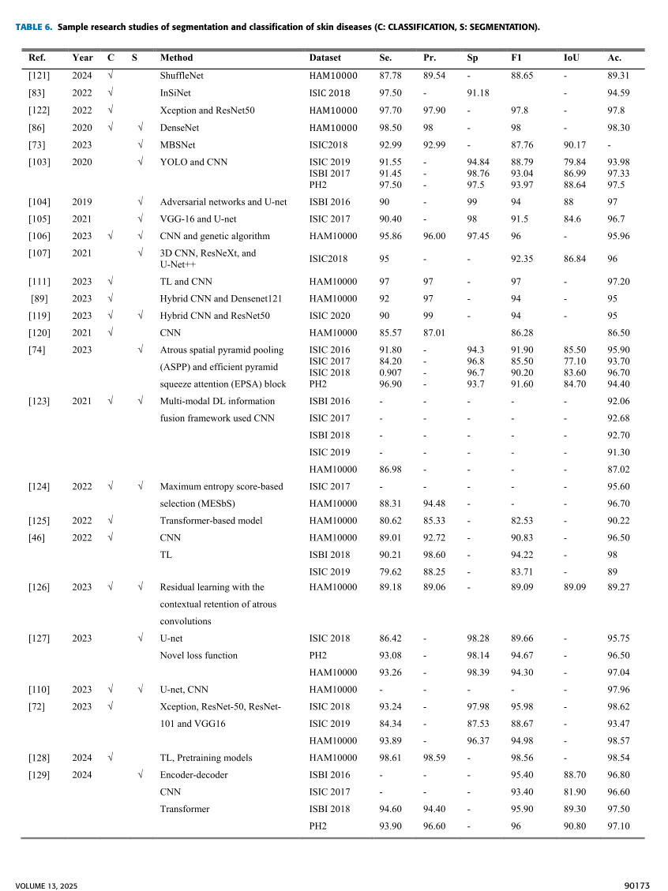

해석: 이 Table은 데이터 구성, 예시, 분포 특성 범주의 정보를 표 형태로 정리한다. 비교 축과 수치는 해당 논문의 핵심 근거를 보강하며, 특히 skin cancer segmentation/classification review의 모델군, dataset, challenge, future direction 관련 내용을 비교해 읽는 기준이 된다. ISIC2024 연구에서는 related work에서 segmentation, classification, XAI, future direction을 배경으로 정리할 때 사용할 수 있다.

**Table 6. 데이터 구성, 예시, 분포 특성 요약**

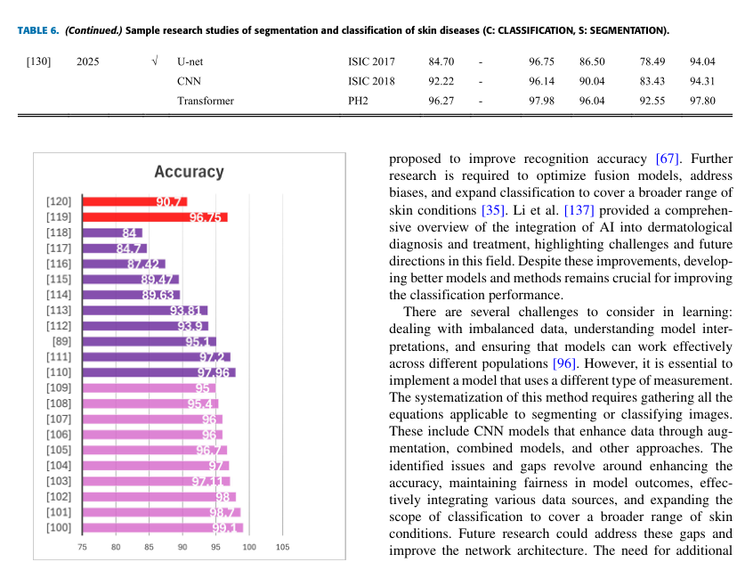

해석: 이 Table은 데이터 구성, 예시, 분포 특성 범주의 정보를 표 형태로 정리한다. 비교 축과 수치는 해당 논문의 핵심 근거를 보강하며, 특히 skin cancer segmentation/classification review의 모델군, dataset, challenge, future direction 관련 내용을 비교해 읽는 기준이 된다. ISIC2024 연구에서는 related work에서 segmentation, classification, XAI, future direction을 배경으로 정리할 때 사용할 수 있다.

**Figure 15. 데이터 구성, 예시, 분포 특성**

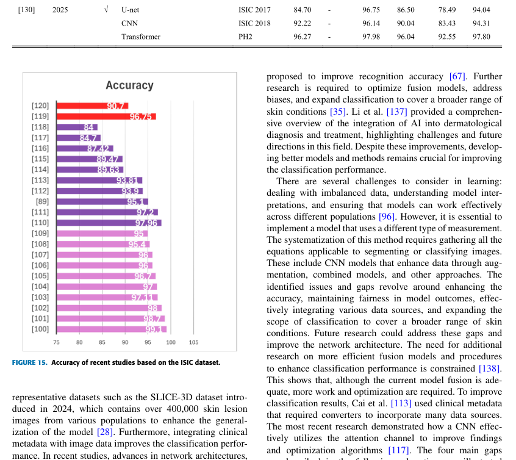

해석: 이 Figure는 데이터 구성, 예시, 분포 특성 범주를 시각적으로 보여준다. 원문 맥락에서는 해당 논문의 핵심 근거를 보강하는 자료이며, 특히 skin cancer segmentation/classification review의 모델군, dataset, challenge, future direction 관련 내용을 이해하는 데 도움이 된다. ISIC2024 연구에서는 related work에서 segmentation, classification, XAI, future direction을 배경으로 정리할 때 사용할 수 있다.

**Figure 16. 논문 주장에 필요한 핵심 시각 자료**

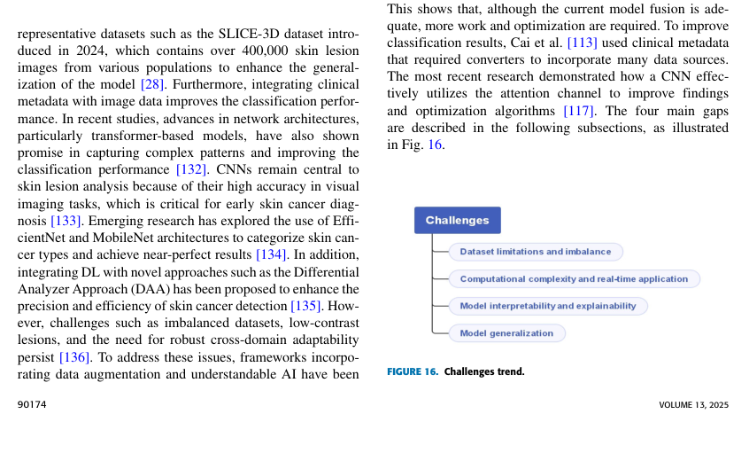

해석: 이 Figure는 논문 주장에 필요한 핵심 시각 자료 범주를 시각적으로 보여준다. 원문 맥락에서는 해당 논문의 핵심 근거를 보강하는 자료이며, 특히 skin cancer segmentation/classification review의 모델군, dataset, challenge, future direction 관련 내용을 이해하는 데 도움이 된다. ISIC2024 연구에서는 related work에서 segmentation, classification, XAI, future direction을 배경으로 정리할 때 사용할 수 있다.

**Table 7. 데이터 구성, 예시, 분포 특성 요약**

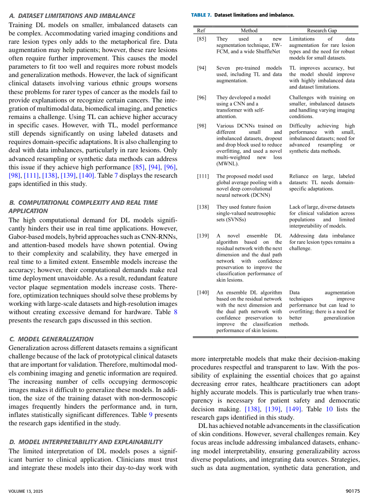

해석: 이 Table은 데이터 구성, 예시, 분포 특성 범주의 정보를 표 형태로 정리한다. 비교 축과 수치는 해당 논문의 핵심 근거를 보강하며, 특히 skin cancer segmentation/classification review의 모델군, dataset, challenge, future direction 관련 내용을 비교해 읽는 기준이 된다. ISIC2024 연구에서는 related work에서 segmentation, classification, XAI, future direction을 배경으로 정리할 때 사용할 수 있다.

**Table 9. 비교 항목과 핵심 수치 요약**

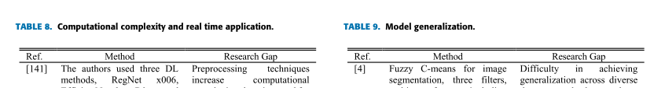

해석: 이 Table은 비교 항목과 핵심 수치 범주의 정보를 표 형태로 정리한다. 비교 축과 수치는 해당 논문의 핵심 근거를 보강하며, 특히 skin cancer segmentation/classification review의 모델군, dataset, challenge, future direction 관련 내용을 비교해 읽는 기준이 된다. ISIC2024 연구에서는 related work에서 segmentation, classification, XAI, future direction을 배경으로 정리할 때 사용할 수 있다.

**Table 8. 비교 항목과 핵심 수치 요약**

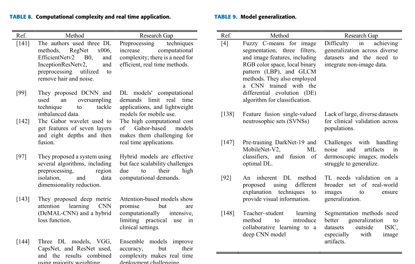

해석: 이 Table은 비교 항목과 핵심 수치 범주의 정보를 표 형태로 정리한다. 비교 축과 수치는 해당 논문의 핵심 근거를 보강하며, 특히 skin cancer segmentation/classification review의 모델군, dataset, challenge, future direction 관련 내용을 비교해 읽는 기준이 된다. ISIC2024 연구에서는 related work에서 segmentation, classification, XAI, future direction을 배경으로 정리할 때 사용할 수 있다.

**Table 10. 모델 해석과 시각화 결과 요약**

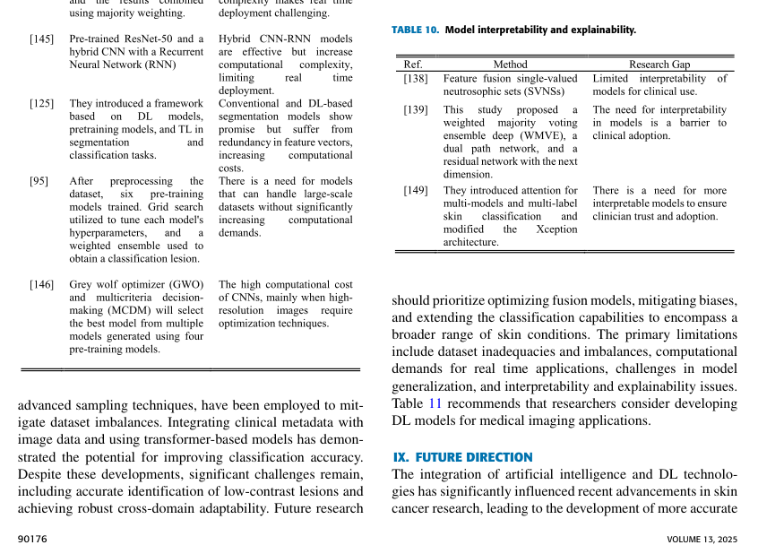

해석: 이 Table은 모델 해석과 시각화 결과 범주의 정보를 표 형태로 정리한다. 비교 축과 수치는 해당 논문의 핵심 근거를 보강하며, 특히 skin cancer segmentation/classification review의 모델군, dataset, challenge, future direction 관련 내용을 비교해 읽는 기준이 된다. ISIC2024 연구에서는 related work에서 segmentation, classification, XAI, future direction을 배경으로 정리할 때 사용할 수 있다.

**Table 11. 비교 항목과 핵심 수치 요약**

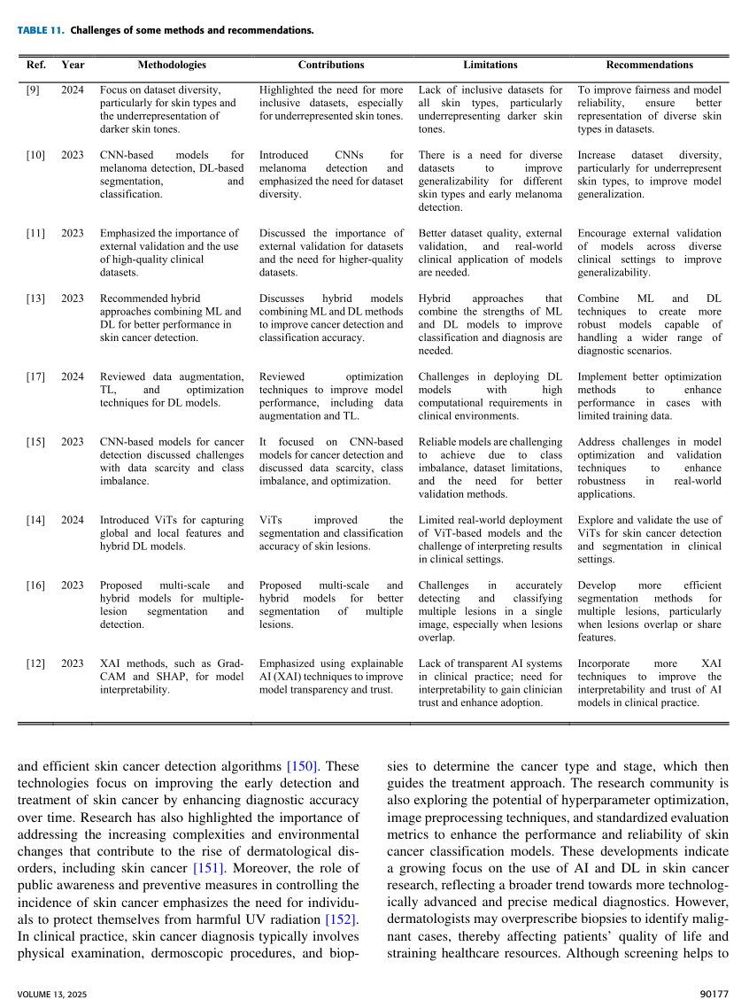

해석: 이 Table은 비교 항목과 핵심 수치 범주의 정보를 표 형태로 정리한다. 비교 축과 수치는 해당 논문의 핵심 근거를 보강하며, 특히 skin cancer segmentation/classification review의 모델군, dataset, challenge, future direction 관련 내용을 비교해 읽는 기준이 된다. ISIC2024 연구에서는 related work에서 segmentation, classification, XAI, future direction을 배경으로 정리할 때 사용할 수 있다.

**Figure 17. 논문 주장에 필요한 핵심 시각 자료**

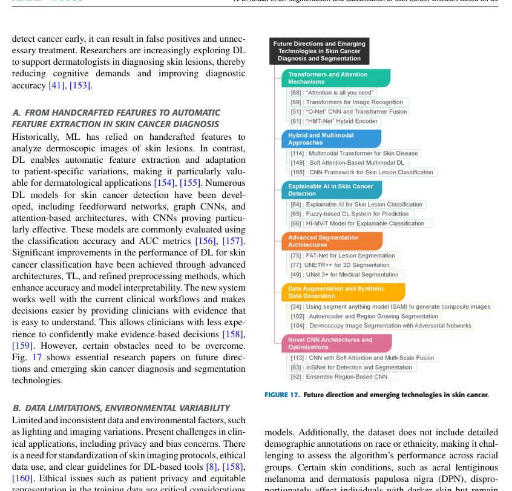

해석: 이 Figure는 논문 주장에 필요한 핵심 시각 자료 범주를 시각적으로 보여준다. 원문 맥락에서는 해당 논문의 핵심 근거를 보강하는 자료이며, 특히 skin cancer segmentation/classification review의 모델군, dataset, challenge, future direction 관련 내용을 이해하는 데 도움이 된다. ISIC2024 연구에서는 related work에서 segmentation, classification, XAI, future direction을 배경으로 정리할 때 사용할 수 있다.

## 우리 연구에서의 위치

skin cancer segmentation/classification에서 CNN, U-Net, transformer, preprocessing, deployment challenge를 종합 정리한 review 논문이다. ISIC 2024 연구의 broad related work와 future direction을 정리하는 데 사용한다.

---

## 목표와 기여

skin cancer segmentation과 classification의 deep learning 연구를 정리하고, dataset, preprocessing, model architecture, deployment challenge, future direction을 종합한다.

## Dataset 정보

PH2, ISIC 2016-2024, HAM10000, Derm7pt, Fitzpatrick17k 등 공개 skin disease dataset을 비교 및 검토한다.

## Imbalance 처리

자체 실험은 없지만 class imbalance가 ISIC 계열 dataset 성능에 영향을 줄 수 있음을 지적한다. augmentation, preprocessing, loss function 등 문헌상 대응 방법을 소개한다.

## Tabular model

해당 없음. tabular clinical model은 주요 대상이 아니다.

## Image model

CNN, U-Net, transfer learning, attention, transformer, hybrid deep learning segmentation/classification 모델을 review한다.

## Fusion 방식

review 차원에서 pretrained CNN fusion, hybrid CNN-transformer, multimodal/fusion 접근을 논의한다. 자체 fusion architecture를 제안하지는 않는다.

## 평가 지표

accuracy, Dice, IoU, sensitivity, specificity 등 문헌별 지표를 비교한다.

## 평가 결과

자체 benchmark 결과는 없다. 논문은 diverse dataset, explainability, transferability, rare disease coverage, robust evaluation, real-world deployment를 핵심 gap으로 정리한다.

## ISIC2024 연구 시사점

- segmentation/classification 연구 흐름과 ISIC series dataset 배경을 간단히 인용할 수 있다.
- imbalance, explainability, external validation의 필요성을 broad review 근거로 보강한다.
- 직접 baseline 성능을 가져오기보다는 challenge/future direction 인용 자료로 사용하는 것이 적절하다.

## 추가 논의/주의점

- review 논문이므로 특정 모델의 실험 protocol 근거로 쓰면 약하다.
- ISIC 2024의 pAUC metric과 직접 연결되는 결과는 제한적이다.
- discussion section에서 broader dermatology AI limitation을 정리할 때 가장 유용하다.

---

[메인 문서로 돌아가기](../2026-05-18_dermatology_ai_literature_review.md#3-주요-논문별-상세-분석)
