# AI Dermatology: Reviewing the Frontiers of Skin Cancer Detection Technologies

## 출처/링크

출처: Intelligent Oncology, 2025  
DOI: `10.1016/j.intonc.2025.03.002`  
Google Scholar 인용: 확인 불가 (조회일: 2026-05-20, 자동 조회 중 Google Scholar reCAPTCHA 발생)  
PDF: [1-s2.0-S2950261625000196-main.pdf](../paper/1-s2.0-S2950261625000196-main.pdf)

## 주요 Figure 및 Table

원문 PDF의 본문 Figure/Table을 번호 단위로 추출해 로컬 asset으로 저장했다. Caption은 길게 옮기지 않고, 각 항목이 보여주는 내용과 ISIC2024 연구 관점의 의미를 한국어로 의역해 정리했다.

**Figure 1. 논문 주장에 필요한 핵심 시각 자료**

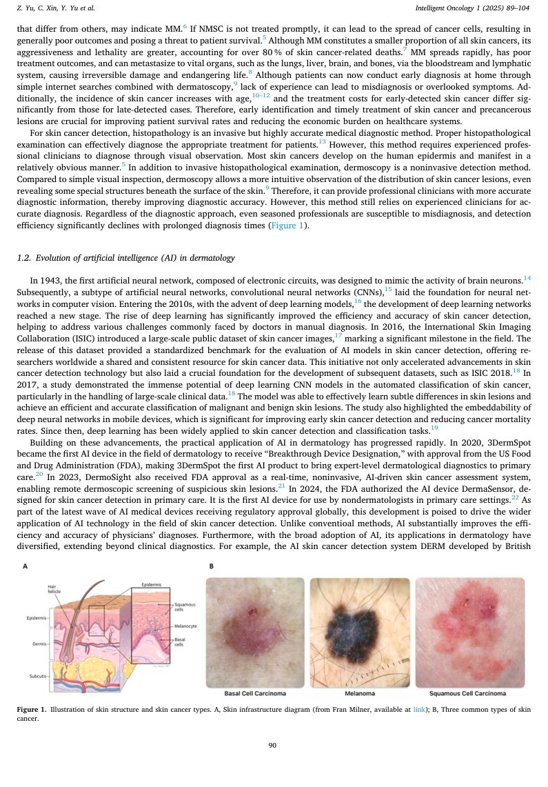

해석: 이 Figure는 논문 주장에 필요한 핵심 시각 자료 범주를 시각적으로 보여준다. 원문 맥락에서는 해당 논문의 핵심 근거를 보강하는 자료이며, 특히 AI dermatology review의 dataset, segmentation, classification, multimodal/transformer 흐름 관련 내용을 이해하는 데 도움이 된다. ISIC2024 연구에서는 ISIC 2024 연구의 broad motivation과 multimodal/transformer 배경을 설명할 때 활용할 수 있다.

**Table 1. 데이터 구성, 예시, 분포 특성 요약**

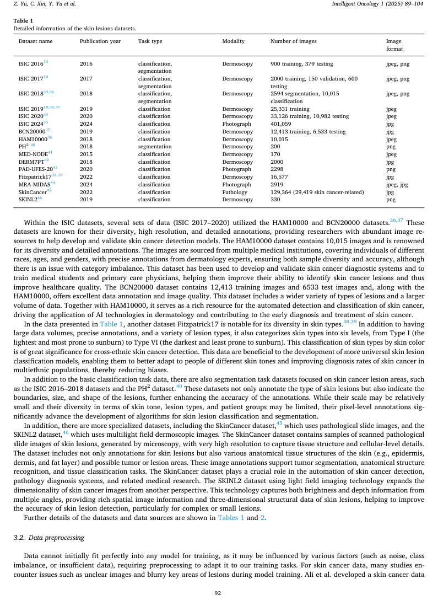

해석: 이 Table은 데이터 구성, 예시, 분포 특성 범주의 정보를 표 형태로 정리한다. 비교 축과 수치는 해당 논문의 핵심 근거를 보강하며, 특히 AI dermatology review의 dataset, segmentation, classification, multimodal/transformer 흐름 관련 내용을 비교해 읽는 기준이 된다. ISIC2024 연구에서는 ISIC 2024 연구의 broad motivation과 multimodal/transformer 배경을 설명할 때 활용할 수 있다.

**Table 2. 데이터 구성, 예시, 분포 특성 요약**

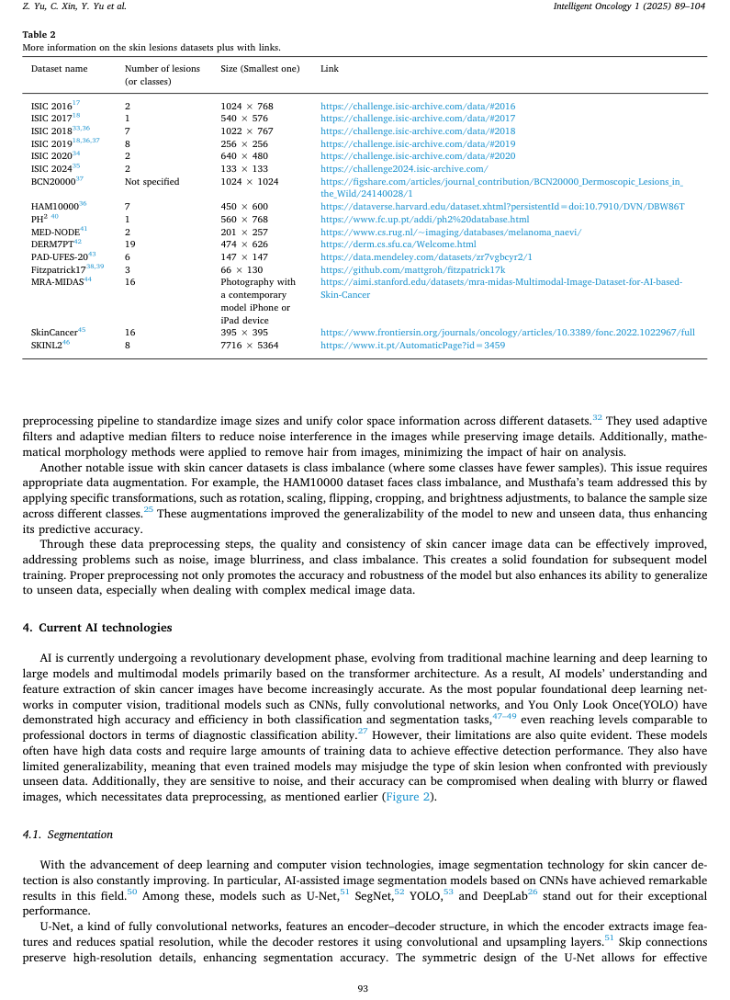

해석: 이 Table은 데이터 구성, 예시, 분포 특성 범주의 정보를 표 형태로 정리한다. 비교 축과 수치는 해당 논문의 핵심 근거를 보강하며, 특히 AI dermatology review의 dataset, segmentation, classification, multimodal/transformer 흐름 관련 내용을 비교해 읽는 기준이 된다. ISIC2024 연구에서는 ISIC 2024 연구의 broad motivation과 multimodal/transformer 배경을 설명할 때 활용할 수 있다.

**Figure 2. 연구 설계와 모델/데이터 처리 흐름**

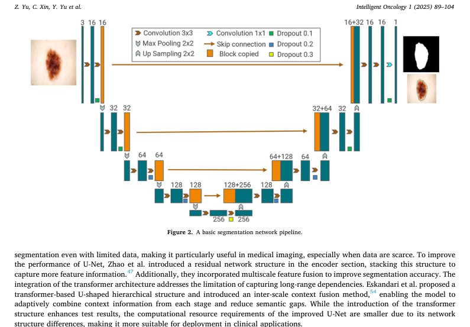

해석: 이 Figure는 연구 설계와 모델/데이터 처리 흐름 범주를 시각적으로 보여준다. 원문 맥락에서는 해당 논문의 핵심 근거를 보강하는 자료이며, 특히 AI dermatology review의 dataset, segmentation, classification, multimodal/transformer 흐름 관련 내용을 이해하는 데 도움이 된다. ISIC2024 연구에서는 ISIC 2024 연구의 broad motivation과 multimodal/transformer 배경을 설명할 때 활용할 수 있다.

**Table 3. 비교 항목과 핵심 수치 요약**

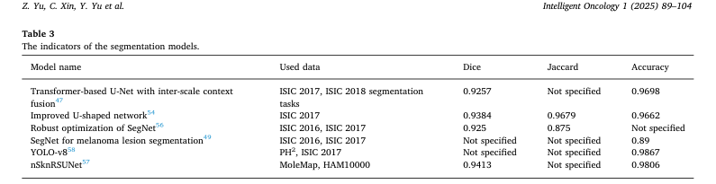

해석: 이 Table은 비교 항목과 핵심 수치 범주의 정보를 표 형태로 정리한다. 비교 축과 수치는 해당 논문의 핵심 근거를 보강하며, 특히 AI dermatology review의 dataset, segmentation, classification, multimodal/transformer 흐름 관련 내용을 비교해 읽는 기준이 된다. ISIC2024 연구에서는 ISIC 2024 연구의 broad motivation과 multimodal/transformer 배경을 설명할 때 활용할 수 있다.

**Table 4. 비교 항목과 핵심 수치 요약**

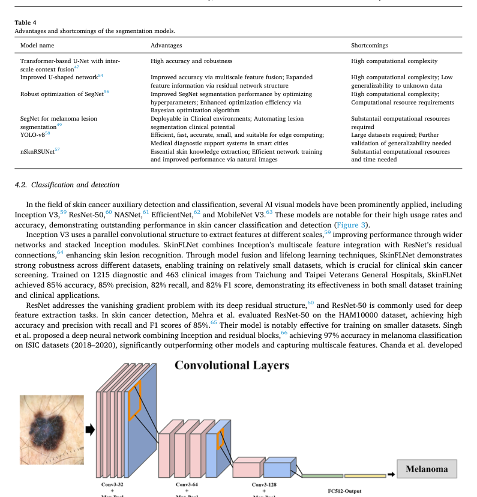

해석: 이 Table은 비교 항목과 핵심 수치 범주의 정보를 표 형태로 정리한다. 비교 축과 수치는 해당 논문의 핵심 근거를 보강하며, 특히 AI dermatology review의 dataset, segmentation, classification, multimodal/transformer 흐름 관련 내용을 비교해 읽는 기준이 된다. ISIC2024 연구에서는 ISIC 2024 연구의 broad motivation과 multimodal/transformer 배경을 설명할 때 활용할 수 있다.

**Figure 3. 연구 설계와 모델/데이터 처리 흐름**

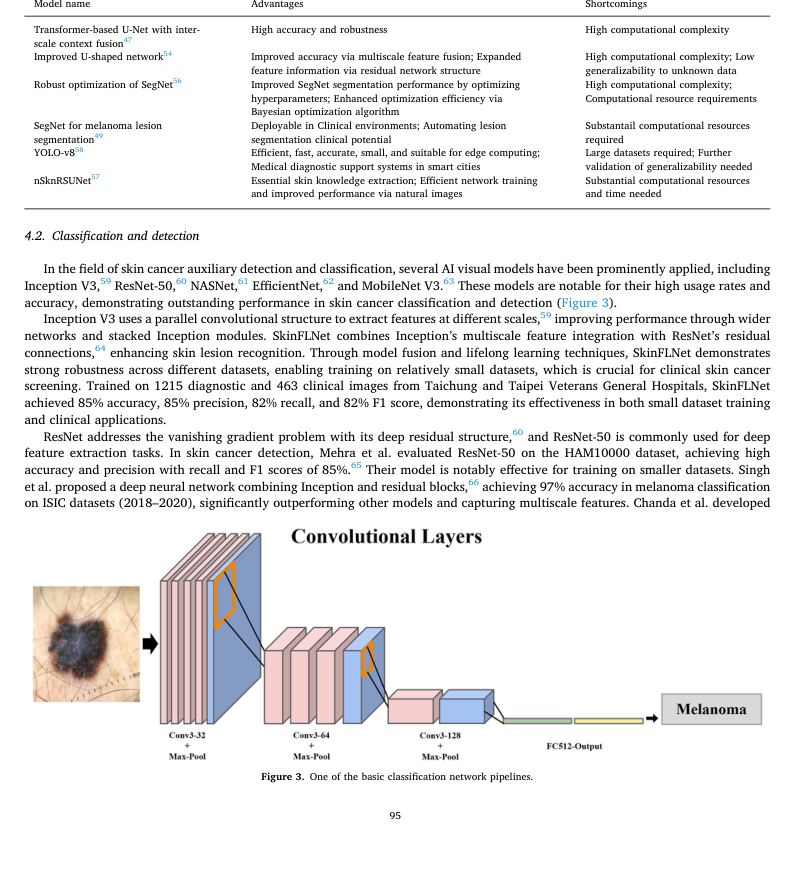

해석: 이 Figure는 연구 설계와 모델/데이터 처리 흐름 범주를 시각적으로 보여준다. 원문 맥락에서는 해당 논문의 핵심 근거를 보강하는 자료이며, 특히 AI dermatology review의 dataset, segmentation, classification, multimodal/transformer 흐름 관련 내용을 이해하는 데 도움이 된다. ISIC2024 연구에서는 ISIC 2024 연구의 broad motivation과 multimodal/transformer 배경을 설명할 때 활용할 수 있다.

**Table 5. 비교 항목과 핵심 수치 요약**

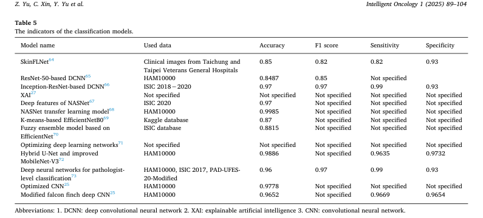

해석: 이 Table은 비교 항목과 핵심 수치 범주의 정보를 표 형태로 정리한다. 비교 축과 수치는 해당 논문의 핵심 근거를 보강하며, 특히 AI dermatology review의 dataset, segmentation, classification, multimodal/transformer 흐름 관련 내용을 비교해 읽는 기준이 된다. ISIC2024 연구에서는 ISIC 2024 연구의 broad motivation과 multimodal/transformer 배경을 설명할 때 활용할 수 있다.

**Table 6. 비교 항목과 핵심 수치 요약**

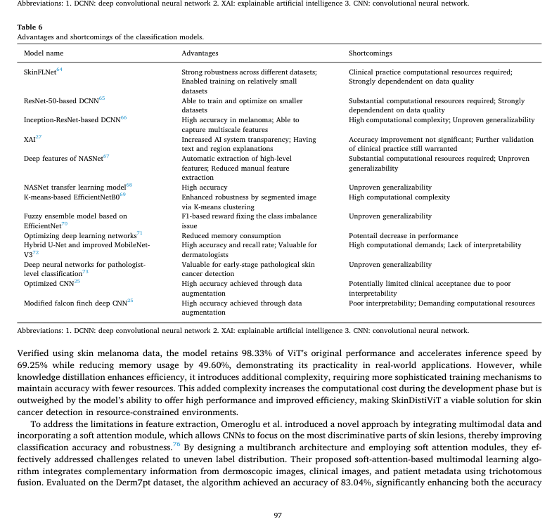

해석: 이 Table은 비교 항목과 핵심 수치 범주의 정보를 표 형태로 정리한다. 비교 축과 수치는 해당 논문의 핵심 근거를 보강하며, 특히 AI dermatology review의 dataset, segmentation, classification, multimodal/transformer 흐름 관련 내용을 비교해 읽는 기준이 된다. ISIC2024 연구에서는 ISIC 2024 연구의 broad motivation과 multimodal/transformer 배경을 설명할 때 활용할 수 있다.

**Figure 4. 연구 설계와 모델/데이터 처리 흐름**

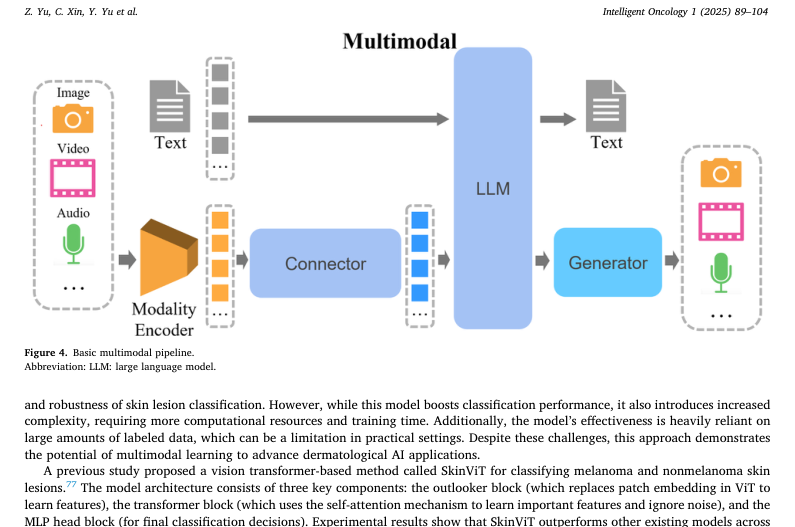

해석: 이 Figure는 연구 설계와 모델/데이터 처리 흐름 범주를 시각적으로 보여준다. 원문 맥락에서는 해당 논문의 핵심 근거를 보강하는 자료이며, 특히 AI dermatology review의 dataset, segmentation, classification, multimodal/transformer 흐름 관련 내용을 이해하는 데 도움이 된다. ISIC2024 연구에서는 ISIC 2024 연구의 broad motivation과 multimodal/transformer 배경을 설명할 때 활용할 수 있다.

**Figure 5. 데이터 구성, 예시, 분포 특성**

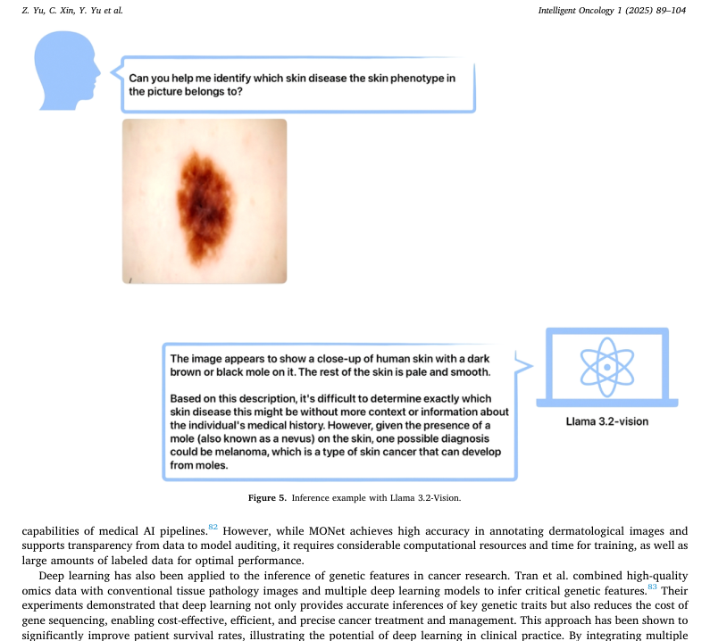

해석: 이 Figure는 데이터 구성, 예시, 분포 특성 범주를 시각적으로 보여준다. 원문 맥락에서는 해당 논문의 핵심 근거를 보강하는 자료이며, 특히 AI dermatology review의 dataset, segmentation, classification, multimodal/transformer 흐름 관련 내용을 이해하는 데 도움이 된다. ISIC2024 연구에서는 ISIC 2024 연구의 broad motivation과 multimodal/transformer 배경을 설명할 때 활용할 수 있다.

**Table 7. 비교 항목과 핵심 수치 요약**

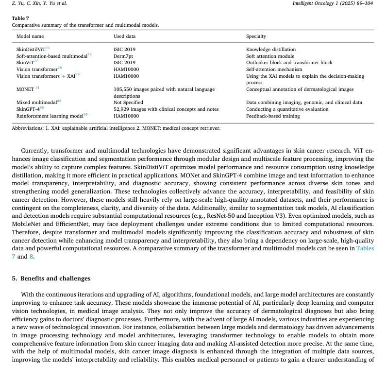

해석: 이 Table은 비교 항목과 핵심 수치 범주의 정보를 표 형태로 정리한다. 비교 축과 수치는 해당 논문의 핵심 근거를 보강하며, 특히 AI dermatology review의 dataset, segmentation, classification, multimodal/transformer 흐름 관련 내용을 비교해 읽는 기준이 된다. ISIC2024 연구에서는 ISIC 2024 연구의 broad motivation과 multimodal/transformer 배경을 설명할 때 활용할 수 있다.

**Table 8. 비교 항목과 핵심 수치 요약**

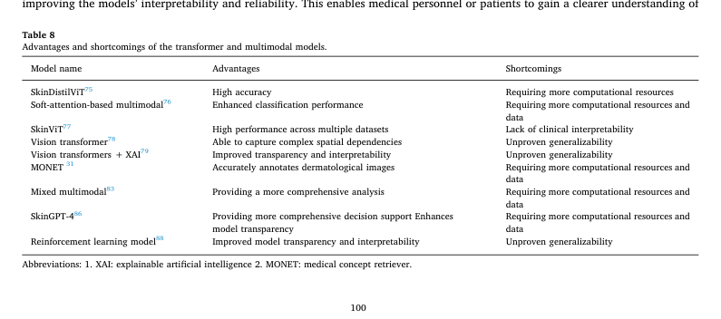

해석: 이 Table은 비교 항목과 핵심 수치 범주의 정보를 표 형태로 정리한다. 비교 축과 수치는 해당 논문의 핵심 근거를 보강하며, 특히 AI dermatology review의 dataset, segmentation, classification, multimodal/transformer 흐름 관련 내용을 비교해 읽는 기준이 된다. ISIC2024 연구에서는 ISIC 2024 연구의 broad motivation과 multimodal/transformer 배경을 설명할 때 활용할 수 있다.

## 우리 연구에서의 위치

skin cancer detection AI 기술을 segmentation, classification, reinforcement learning, transformer, multimodal integration 관점에서 넓게 정리한 review 논문이다. introduction과 related work에서 dermatology AI 연구 흐름을 요약할 때 사용할 수 있다.

---

## 목표와 기여

skin cancer detection에서 AI 기술이 조기 진단, 병변 분할, 분류, 임상 의사결정 보조에 어떻게 쓰이는지 종합적으로 검토한다. 특히 data diversity, explainability, clinical integration 문제를 핵심 한계로 제시한다.

## Dataset 정보

자체 dataset은 없다. ISIC 계열 공개 dataset, FDA 승인/임상 적용 사례, 다양한 skin cancer image dataset을 문헌 기반으로 다룬다.

## Imbalance 처리

자체 imbalance 처리 방법은 없다. data diversity, augmentation, model bias, clinical integration 한계를 review의 주요 과제로 제시한다.

## Tabular model

해당 없음. tabular model은 독립 주제로 깊게 다루지 않는다.

## Image model

CNN, segmentation network, transformer, XAI model, reinforcement learning 기반 기술을 폭넓게 정리한다.

## Fusion 방식

transformer와 multimodal technology가 diagnostic process를 정교화할 수 있다고 논의하지만, 자체 fusion architecture는 없다.

## 평가 지표

문헌별 accuracy, precision, recall, F-score 등 성능 지표를 인용한다.

## 평가 결과

자체 benchmark 결과는 없다. AI가 조기 피부암 진단의 정확도와 효율을 높였지만, 데이터 다양성, 해석가능성, 임상 통합이 남은 핵심 장애물이라고 정리한다.

## ISIC2024 연구 시사점

- ISIC 2024 연구의 broader motivation을 설명할 때 활용 가능하다.
- multimodal integration과 transformer 기반 접근의 흐름을 소개하는 배경 자료로 쓸 수 있다.
- 직접적인 pAUC baseline이나 train-only protocol 근거로는 제한적이다.

## 추가 논의/주의점

- review 논문이므로 구체적인 실험 설계 근거는 원 논문을 추가 확인해야 한다.
- 임상 적용 논의는 넓지만 ISIC 2024의 3D-TBP train setting과 직접 일치하지 않는다.
- limitation section에서 explainability와 clinical integration을 언급할 때 유용하다.

---

[메인 문서로 돌아가기](../2026-05-18_dermatology_ai_literature_review.md#3-주요-논문별-상세-분석)
