# AcuSim: A Synthetic Dataset for Cervicocranial Acupuncture Points Localisation

## 출처/링크

출처: Scientific Data, 2025  
DOI: `10.1038/s41597-025-04934-9`  
Google Scholar 인용: 확인 불가 (조회일: 2026-05-20, 자동 조회 중 Google Scholar reCAPTCHA 발생)  
PDF: [s41597-025-04934-9.pdf](../paper/s41597-025-04934-9.pdf)

## 주요 Figure 및 Table

원문 PDF의 본문 Figure/Table을 번호 단위로 추출해 로컬 asset으로 저장했다. Caption은 길게 옮기지 않고, 각 항목이 보여주는 내용과 ISIC2024 연구 관점의 의미를 한국어로 의역해 정리했다.

**Table 1. 데이터 구성, 예시, 분포 특성 요약**

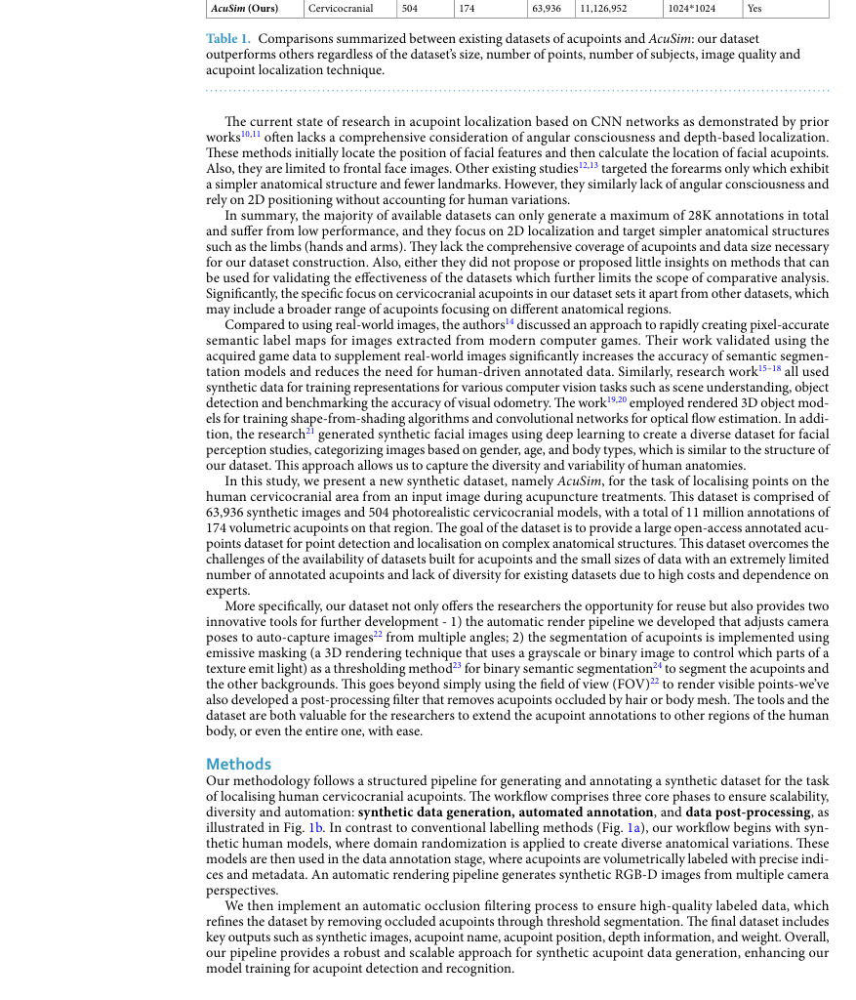

해석: 이 Table은 데이터 구성, 예시, 분포 특성 범주의 정보를 표 형태로 정리한다. 비교 축과 수치는 해당 논문의 핵심 근거를 보강하며, 특히 AcuSim의 synthetic human/acupoint dataset 생성, annotation, localization model 평가 관련 내용을 비교해 읽는 기준이 된다. ISIC2024 연구에서는 직접적인 skin lesion baseline보다는 synthetic data generation과 annotation QA의 보조 참고로 제한해 사용하는 것이 적절하다.

**Figure 1. 연구 설계와 모델/데이터 처리 흐름**

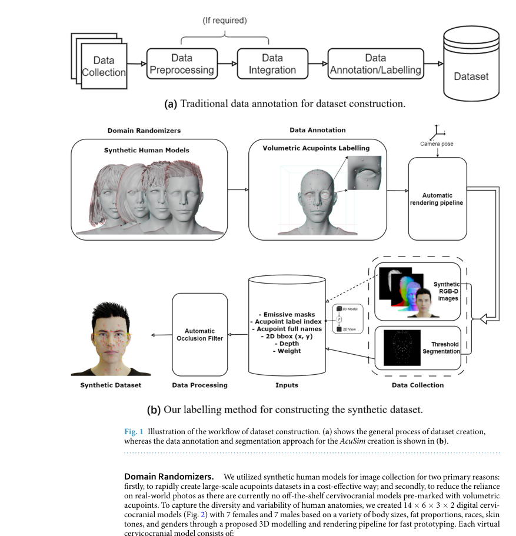

해석: 이 Figure는 연구 설계와 모델/데이터 처리 흐름 범주를 시각적으로 보여준다. 원문 맥락에서는 해당 논문의 핵심 근거를 보강하는 자료이며, 특히 AcuSim의 synthetic human/acupoint dataset 생성, annotation, localization model 평가 관련 내용을 이해하는 데 도움이 된다. ISIC2024 연구에서는 직접적인 skin lesion baseline보다는 synthetic data generation과 annotation QA의 보조 참고로 제한해 사용하는 것이 적절하다.

**Figure 2. 데이터 구성, 예시, 분포 특성**

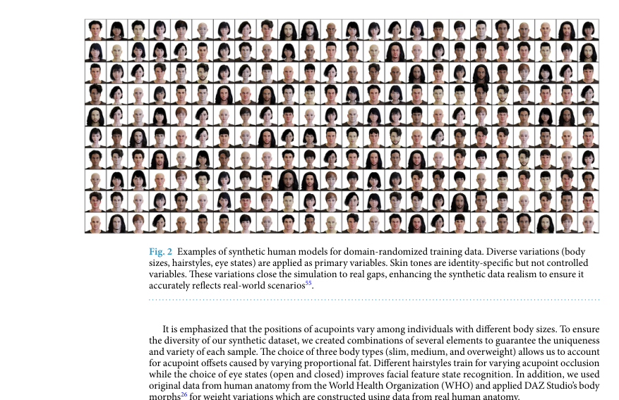

해석: 이 Figure는 데이터 구성, 예시, 분포 특성 범주를 시각적으로 보여준다. 원문 맥락에서는 해당 논문의 핵심 근거를 보강하는 자료이며, 특히 AcuSim의 synthetic human/acupoint dataset 생성, annotation, localization model 평가 관련 내용을 이해하는 데 도움이 된다. ISIC2024 연구에서는 직접적인 skin lesion baseline보다는 synthetic data generation과 annotation QA의 보조 참고로 제한해 사용하는 것이 적절하다.

**Figure 3. 논문 주장에 필요한 핵심 시각 자료**

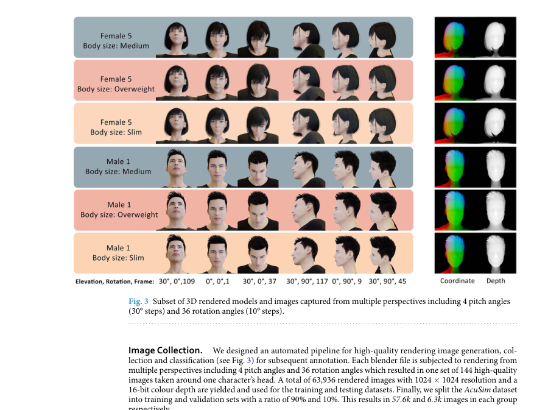

해석: 이 Figure는 논문 주장에 필요한 핵심 시각 자료 범주를 시각적으로 보여준다. 원문 맥락에서는 해당 논문의 핵심 근거를 보강하는 자료이며, 특히 AcuSim의 synthetic human/acupoint dataset 생성, annotation, localization model 평가 관련 내용을 이해하는 데 도움이 된다. ISIC2024 연구에서는 직접적인 skin lesion baseline보다는 synthetic data generation과 annotation QA의 보조 참고로 제한해 사용하는 것이 적절하다.

**Figure 4. 논문 주장에 필요한 핵심 시각 자료**

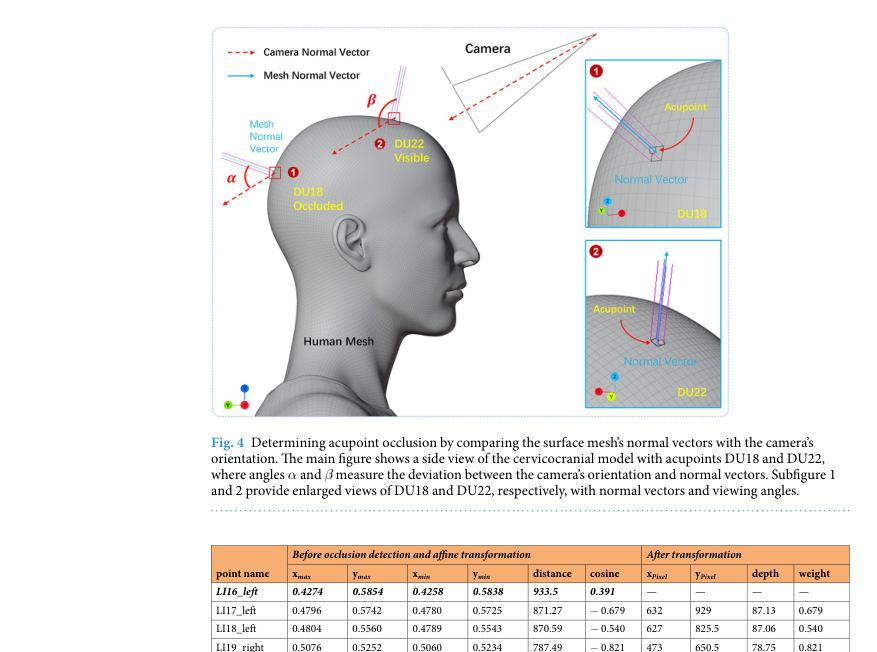

해석: 이 Figure는 논문 주장에 필요한 핵심 시각 자료 범주를 시각적으로 보여준다. 원문 맥락에서는 해당 논문의 핵심 근거를 보강하는 자료이며, 특히 AcuSim의 synthetic human/acupoint dataset 생성, annotation, localization model 평가 관련 내용을 이해하는 데 도움이 된다. ISIC2024 연구에서는 직접적인 skin lesion baseline보다는 synthetic data generation과 annotation QA의 보조 참고로 제한해 사용하는 것이 적절하다.

**Table 2. 데이터 구성, 예시, 분포 특성 요약**

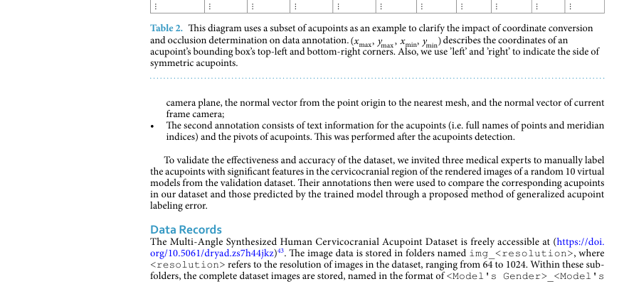

해석: 이 Table은 데이터 구성, 예시, 분포 특성 범주의 정보를 표 형태로 정리한다. 비교 축과 수치는 해당 논문의 핵심 근거를 보강하며, 특히 AcuSim의 synthetic human/acupoint dataset 생성, annotation, localization model 평가 관련 내용을 비교해 읽는 기준이 된다. ISIC2024 연구에서는 직접적인 skin lesion baseline보다는 synthetic data generation과 annotation QA의 보조 참고로 제한해 사용하는 것이 적절하다.

**Figure 5. 논문 주장에 필요한 핵심 시각 자료**

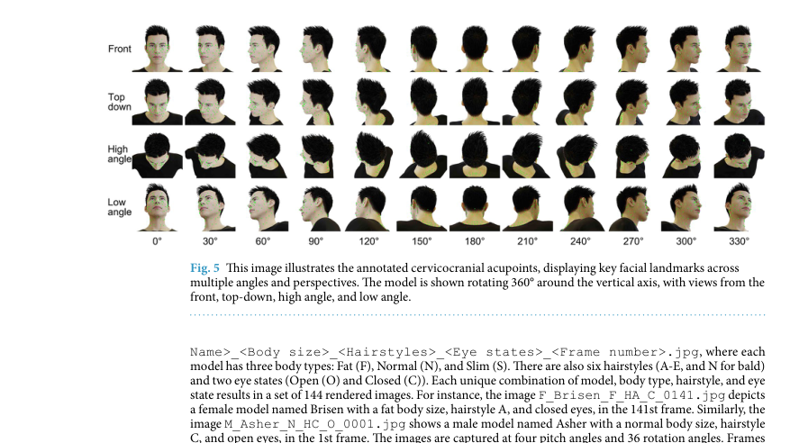

해석: 이 Figure는 논문 주장에 필요한 핵심 시각 자료 범주를 시각적으로 보여준다. 원문 맥락에서는 해당 논문의 핵심 근거를 보강하는 자료이며, 특히 AcuSim의 synthetic human/acupoint dataset 생성, annotation, localization model 평가 관련 내용을 이해하는 데 도움이 된다. ISIC2024 연구에서는 직접적인 skin lesion baseline보다는 synthetic data generation과 annotation QA의 보조 참고로 제한해 사용하는 것이 적절하다.

**Table 3. 연구 설계와 모델/데이터 처리 흐름 요약**

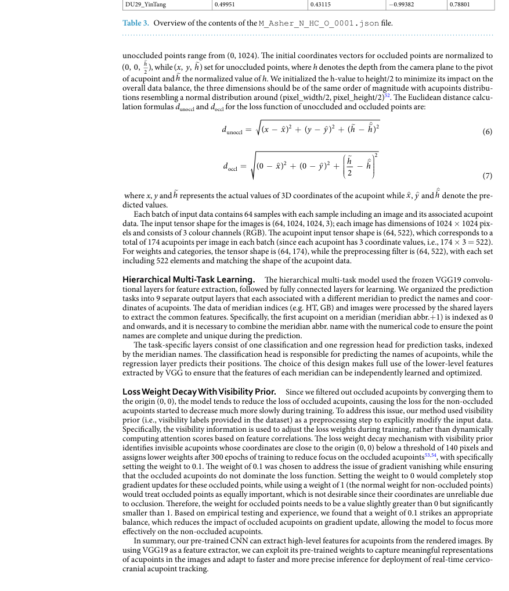

해석: 이 Table은 연구 설계와 모델/데이터 처리 흐름 범주의 정보를 표 형태로 정리한다. 비교 축과 수치는 해당 논문의 핵심 근거를 보강하며, 특히 AcuSim의 synthetic human/acupoint dataset 생성, annotation, localization model 평가 관련 내용을 비교해 읽는 기준이 된다. ISIC2024 연구에서는 직접적인 skin lesion baseline보다는 synthetic data generation과 annotation QA의 보조 참고로 제한해 사용하는 것이 적절하다.

**Figure 6. 논문 주장에 필요한 핵심 시각 자료**

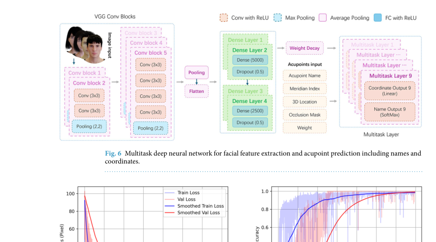

해석: 이 Figure는 논문 주장에 필요한 핵심 시각 자료 범주를 시각적으로 보여준다. 원문 맥락에서는 해당 논문의 핵심 근거를 보강하는 자료이며, 특히 AcuSim의 synthetic human/acupoint dataset 생성, annotation, localization model 평가 관련 내용을 이해하는 데 도움이 된다. ISIC2024 연구에서는 직접적인 skin lesion baseline보다는 synthetic data generation과 annotation QA의 보조 참고로 제한해 사용하는 것이 적절하다.

**Figure 7. 성능 비교와 정량 평가 결과**

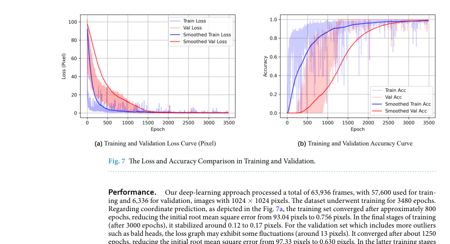

해석: 이 Figure는 성능 비교와 정량 평가 결과 범주를 시각적으로 보여준다. 원문 맥락에서는 해당 논문의 핵심 근거를 보강하는 자료이며, 특히 AcuSim의 synthetic human/acupoint dataset 생성, annotation, localization model 평가 관련 내용을 이해하는 데 도움이 된다. ISIC2024 연구에서는 직접적인 skin lesion baseline보다는 synthetic data generation과 annotation QA의 보조 참고로 제한해 사용하는 것이 적절하다.

**Figure 8. 데이터 구성, 예시, 분포 특성**

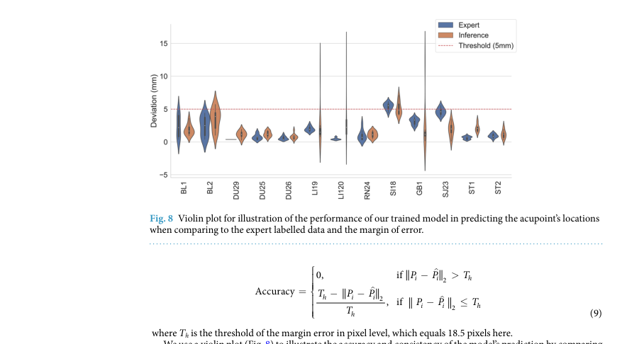

해석: 이 Figure는 데이터 구성, 예시, 분포 특성 범주를 시각적으로 보여준다. 원문 맥락에서는 해당 논문의 핵심 근거를 보강하는 자료이며, 특히 AcuSim의 synthetic human/acupoint dataset 생성, annotation, localization model 평가 관련 내용을 이해하는 데 도움이 된다. ISIC2024 연구에서는 직접적인 skin lesion baseline보다는 synthetic data generation과 annotation QA의 보조 참고로 제한해 사용하는 것이 적절하다.

**Figure 9. 데이터 구성, 예시, 분포 특성**

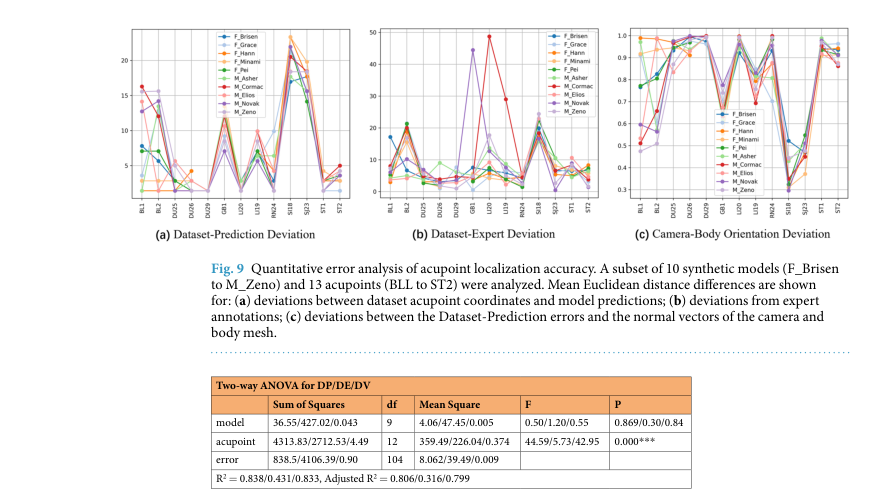

해석: 이 Figure는 데이터 구성, 예시, 분포 특성 범주를 시각적으로 보여준다. 원문 맥락에서는 해당 논문의 핵심 근거를 보강하는 자료이며, 특히 AcuSim의 synthetic human/acupoint dataset 생성, annotation, localization model 평가 관련 내용을 이해하는 데 도움이 된다. ISIC2024 연구에서는 직접적인 skin lesion baseline보다는 synthetic data generation과 annotation QA의 보조 참고로 제한해 사용하는 것이 적절하다.

**Table 4. 데이터 구성, 예시, 분포 특성 요약**

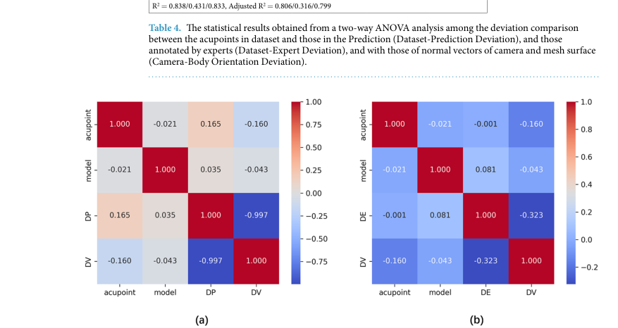

해석: 이 Table은 데이터 구성, 예시, 분포 특성 범주의 정보를 표 형태로 정리한다. 비교 축과 수치는 해당 논문의 핵심 근거를 보강하며, 특히 AcuSim의 synthetic human/acupoint dataset 생성, annotation, localization model 평가 관련 내용을 비교해 읽는 기준이 된다. ISIC2024 연구에서는 직접적인 skin lesion baseline보다는 synthetic data generation과 annotation QA의 보조 참고로 제한해 사용하는 것이 적절하다.

**Figure 10. 데이터 구성, 예시, 분포 특성**

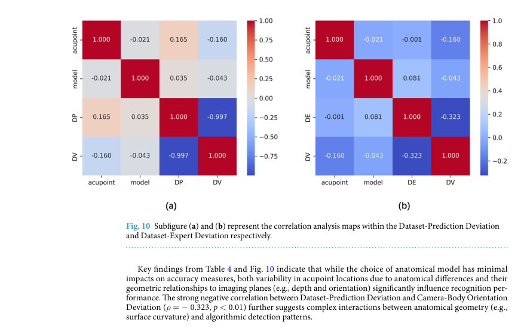

해석: 이 Figure는 데이터 구성, 예시, 분포 특성 범주를 시각적으로 보여준다. 원문 맥락에서는 해당 논문의 핵심 근거를 보강하는 자료이며, 특히 AcuSim의 synthetic human/acupoint dataset 생성, annotation, localization model 평가 관련 내용을 이해하는 데 도움이 된다. ISIC2024 연구에서는 직접적인 skin lesion baseline보다는 synthetic data generation과 annotation QA의 보조 참고로 제한해 사용하는 것이 적절하다.

## 우리 연구에서의 위치

이 논문은 피부암/피부과 진단과 직접 관련성이 낮은 낮은 우선순위 자료이다. 다만 synthetic RGB-D dataset 생성, 자동 rendering/labeling, domain randomization 관점에서는 synthetic data methodology의 보조 참고로 사용할 수 있다.

---

## 목표와 기여

cervicocranial acupuncture point localization을 위한 synthetic RGB-D dataset과 자동 rendering/labeling pipeline을 제안한다.

## Dataset 정보

- Synthetic anatomical model: 504개
- RGB-D image: 63,936개
- Acupoint: 174개 volumetric acupoint
- Annotation: 11,126,952개
- Domain: acupuncture point localization이며 피부암 진단 dataset은 아니다.

## Imbalance 처리

class imbalance 처리보다는 synthetic model 다양화와 domain randomization에 초점을 둔다.

## Tabular model

별도 tabular model은 없다.

## Image model

VGG19 convolution layer를 feature extractor로 사용하고, coordinate regression과 acupoint name classification을 수행하는 multitask CNN을 사용한다.

## Fusion 방식

RGB-D image, depth, 2D bounding box, occlusion filtering, coordinate metadata를 localization pipeline에서 함께 사용한다.

## 평가 지표

classification accuracy, 5 mm 이내 localization 비율, coordinate RMSE/cross-entropy loss를 사용한다.

## 평가 결과

CNN validation에서 accuracy 99.73%, expert annotation 대비 5 mm 이내 예측 92.86%를 보고한다.

## ISIC2024 연구 시사점

- 피부암 AI 관련도는 낮으므로 main related work에는 넣지 않는 편이 좋다.
- synthetic data generation, rendering label 자동화, domain randomization을 간단히 언급할 때만 보조 참고로 사용할 수 있다.
- ISIC 2024 malignant image synthesis 또는 augmentation의 직접 근거로 쓰기에는 domain gap이 크다.

## 추가 논의/주의점

- 논문의 task가 acupuncture point localization이라 dermatology cancer detection과 다르다.
- 성능 수치는 ISIC 2024와 비교할 수 없다.
- 본 문헌 묶음에서는 낮은 우선순위/보조 참고로 분류한다.

---

[메인 문서로 돌아가기](../2026-05-18_dermatology_ai_literature_review.md#3-주요-논문별-상세-분석)
