# A Multimodal Vision Foundation Model for Clinical Dermatology

## 출처/링크

우선 인용 버전: Nature Medicine published version, 2025  
Published title: `A multimodal vision foundation model for clinical dermatology`  
Published DOI: `10.1038/s41591-025-03747-y`  
Google Scholar 인용: 140회 (조회일: 2026-05-20, published title 기준)  
Published PDF: [s41591-025-03747-y-1.pdf](../paper/s41591-025-03747-y-1.pdf)  
참고 preprint PDF: [33499_A_General_Purpose_Multim.pdf](../paper/33499_A_General_Purpose_Multim.pdf) (`A General-Purpose Multimodal Foundation Model for Dermatology`, arXiv v1, DOI `10.48550/arXiv.2410.15038`)

## 주요 Figure 및 Table

**Figure 1. 연구 설계와 모델/데이터 처리 흐름**

해석: 이 Figure는 연구 설계와 모델/데이터 처리 흐름 범주를 시각적으로 보여준다. 원문 맥락에서는 해당 논문의 핵심 근거를 보강하는 자료이며, 특히 PanDerm의 multimodal foundation representation, TBP screening, reader study 성능 주장 관련 내용을 이해하는 데 도움이 된다. ISIC2024 연구에서는 외부 pretraining과 3D-TBP image-metadata 결합을 train-only baseline과 분리해 논의할 때 근거로 사용할 수 있다.

**Figure 2. 데이터 구성, 예시, 분포 특성**

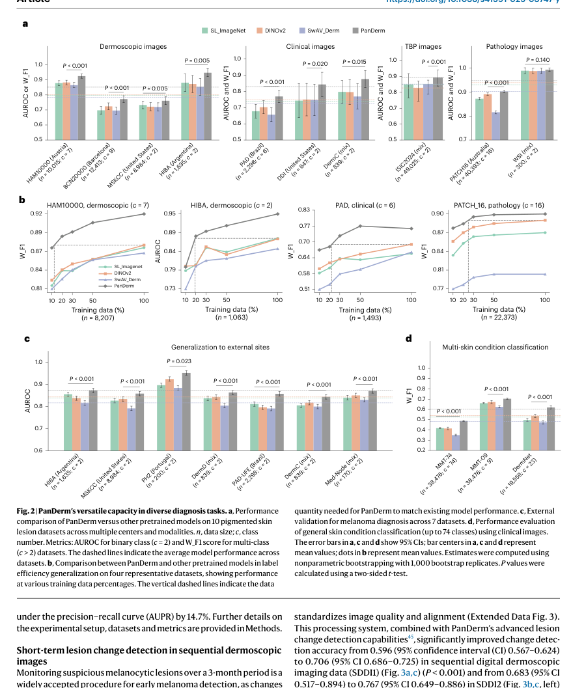

해석: 이 Figure는 데이터 구성, 예시, 분포 특성 범주를 시각적으로 보여준다. 원문 맥락에서는 해당 논문의 핵심 근거를 보강하는 자료이며, 특히 PanDerm의 multimodal foundation representation, TBP screening, reader study 성능 주장 관련 내용을 이해하는 데 도움이 된다. ISIC2024 연구에서는 외부 pretraining과 3D-TBP image-metadata 결합을 train-only baseline과 분리해 논의할 때 근거로 사용할 수 있다.

**Figure 3. 연구 설계와 모델/데이터 처리 흐름**

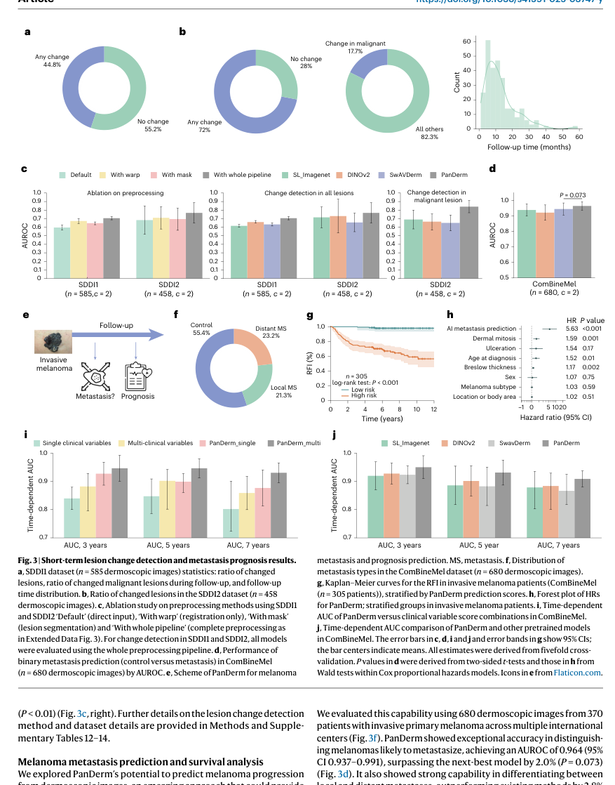

해석: 이 Figure는 연구 설계와 모델/데이터 처리 흐름 범주를 시각적으로 보여준다. 원문 맥락에서는 해당 논문의 핵심 근거를 보강하는 자료이며, 특히 PanDerm의 multimodal foundation representation, TBP screening, reader study 성능 주장 관련 내용을 이해하는 데 도움이 된다. ISIC2024 연구에서는 외부 pretraining과 3D-TBP image-metadata 결합을 train-only baseline과 분리해 논의할 때 근거로 사용할 수 있다.

**Figure 4. 데이터 구성, 예시, 분포 특성**

해석: 이 Figure는 데이터 구성, 예시, 분포 특성 범주를 시각적으로 보여준다. 원문 맥락에서는 해당 논문의 핵심 근거를 보강하는 자료이며, 특히 PanDerm의 multimodal foundation representation, TBP screening, reader study 성능 주장 관련 내용을 이해하는 데 도움이 된다. ISIC2024 연구에서는 외부 pretraining과 3D-TBP image-metadata 결합을 train-only baseline과 분리해 논의할 때 근거로 사용할 수 있다.

**Figure 5. 연구 설계와 모델/데이터 처리 흐름**

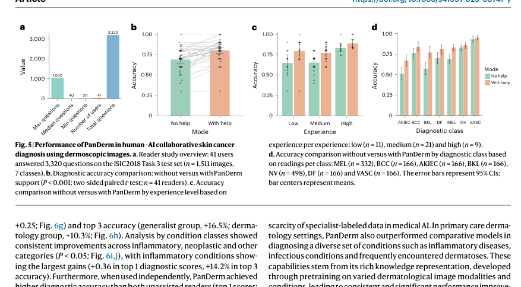

해석: 이 Figure는 연구 설계와 모델/데이터 처리 흐름 범주를 시각적으로 보여준다. 원문 맥락에서는 해당 논문의 핵심 근거를 보강하는 자료이며, 특히 PanDerm의 multimodal foundation representation, TBP screening, reader study 성능 주장 관련 내용을 이해하는 데 도움이 된다. ISIC2024 연구에서는 외부 pretraining과 3D-TBP image-metadata 결합을 train-only baseline과 분리해 논의할 때 근거로 사용할 수 있다.

**Figure 6. 데이터 구성, 예시, 분포 특성**

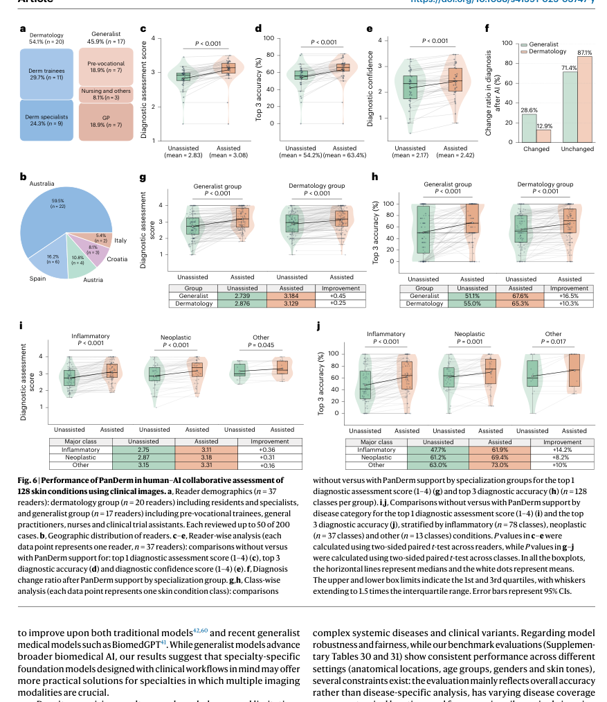

해석: 이 Figure는 데이터 구성, 예시, 분포 특성 범주를 시각적으로 보여준다. 원문 맥락에서는 해당 논문의 핵심 근거를 보강하는 자료이며, 특히 PanDerm의 multimodal foundation representation, TBP screening, reader study 성능 주장 관련 내용을 이해하는 데 도움이 된다. ISIC2024 연구에서는 외부 pretraining과 3D-TBP image-metadata 결합을 train-only baseline과 분리해 논의할 때 근거로 사용할 수 있다.

**Extended Data Figure 1. 데이터 구성, 예시, 분포 특성**

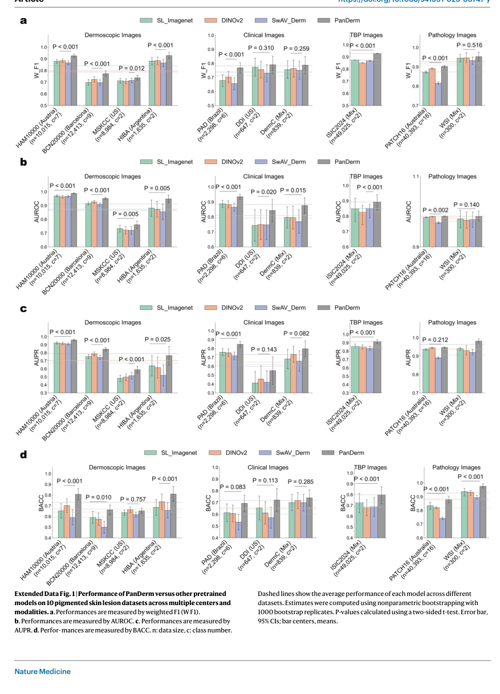

해석: 이 Figure는 데이터 구성, 예시, 분포 특성 범주를 시각적으로 보여준다. 원문 맥락에서는 해당 논문의 핵심 근거를 보강하는 자료이며, 특히 PanDerm의 multimodal foundation representation, TBP screening, reader study 성능 주장 관련 내용을 이해하는 데 도움이 된다. ISIC2024 연구에서는 외부 pretraining과 3D-TBP image-metadata 결합을 train-only baseline과 분리해 논의할 때 근거로 사용할 수 있다.

**Extended Data Figure 2. 데이터 구성, 예시, 분포 특성**

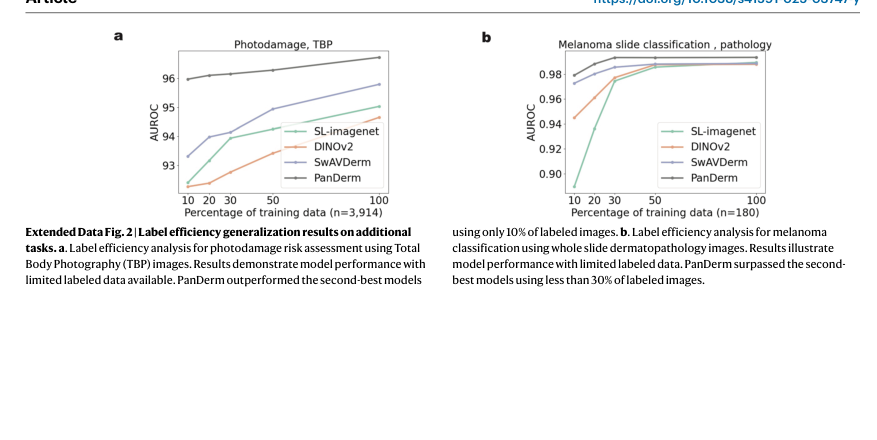

해석: 이 Figure는 데이터 구성, 예시, 분포 특성 범주를 시각적으로 보여준다. 원문 맥락에서는 해당 논문의 핵심 근거를 보강하는 자료이며, 특히 PanDerm의 multimodal foundation representation, TBP screening, reader study 성능 주장 관련 내용을 이해하는 데 도움이 된다. ISIC2024 연구에서는 외부 pretraining과 3D-TBP image-metadata 결합을 train-only baseline과 분리해 논의할 때 근거로 사용할 수 있다.

**Extended Data Figure 3. 데이터 구성, 예시, 분포 특성**

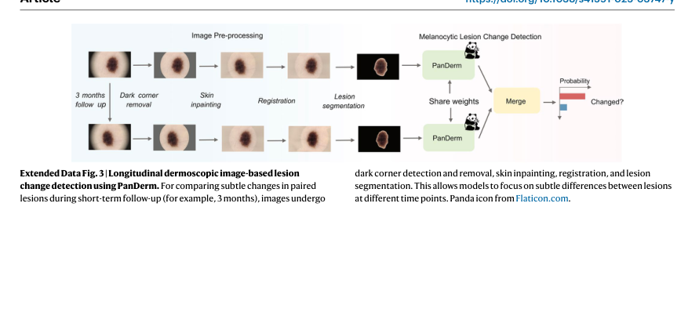

해석: 이 Figure는 데이터 구성, 예시, 분포 특성 범주를 시각적으로 보여준다. 원문 맥락에서는 해당 논문의 핵심 근거를 보강하는 자료이며, 특히 PanDerm의 multimodal foundation representation, TBP screening, reader study 성능 주장 관련 내용을 이해하는 데 도움이 된다. ISIC2024 연구에서는 외부 pretraining과 3D-TBP image-metadata 결합을 train-only baseline과 분리해 논의할 때 근거로 사용할 수 있다.

**Extended Data Figure 4. 구성요소별 ablation과 민감도 분석**

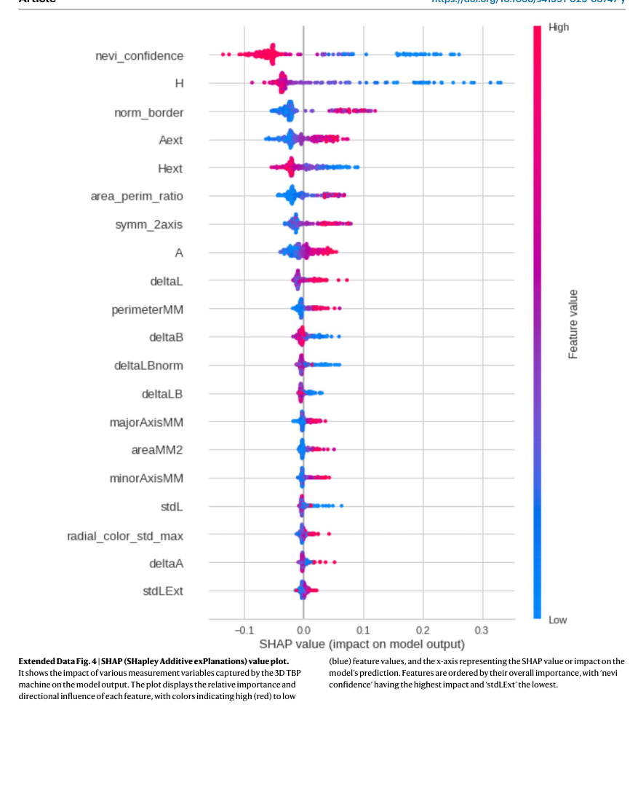

해석: 이 Figure는 구성요소별 ablation과 민감도 분석 범주를 시각적으로 보여준다. 원문 맥락에서는 해당 논문의 핵심 근거를 보강하는 자료이며, 특히 PanDerm의 multimodal foundation representation, TBP screening, reader study 성능 주장 관련 내용을 이해하는 데 도움이 된다. ISIC2024 연구에서는 외부 pretraining과 3D-TBP image-metadata 결합을 train-only baseline과 분리해 논의할 때 근거로 사용할 수 있다.

**Extended Data Figure 5. 데이터 구성, 예시, 분포 특성**

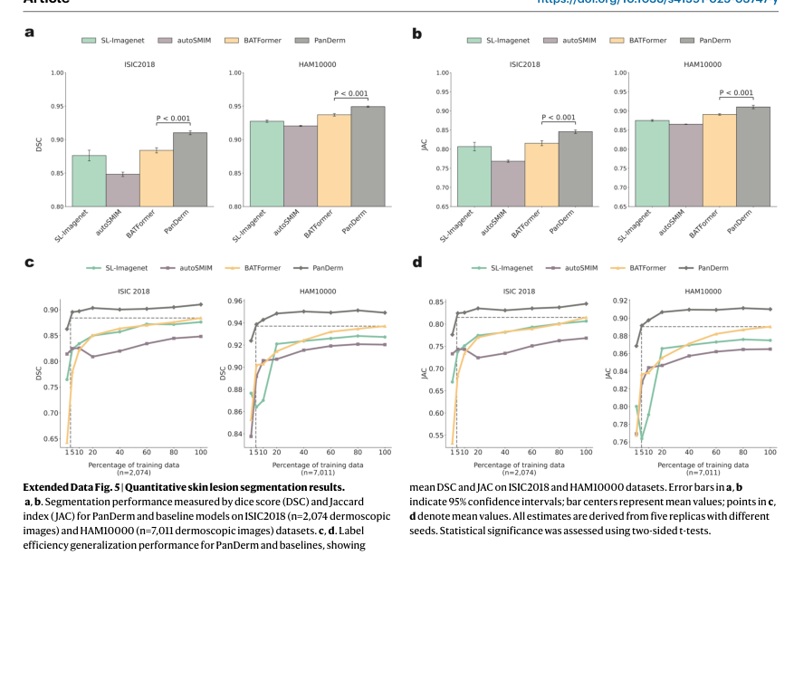

해석: 이 Figure는 데이터 구성, 예시, 분포 특성 범주를 시각적으로 보여준다. 원문 맥락에서는 해당 논문의 핵심 근거를 보강하는 자료이며, 특히 PanDerm의 multimodal foundation representation, TBP screening, reader study 성능 주장 관련 내용을 이해하는 데 도움이 된다. ISIC2024 연구에서는 외부 pretraining과 3D-TBP image-metadata 결합을 train-only baseline과 분리해 논의할 때 근거로 사용할 수 있다.

**Extended Data Figure 6. 데이터 구성, 예시, 분포 특성**

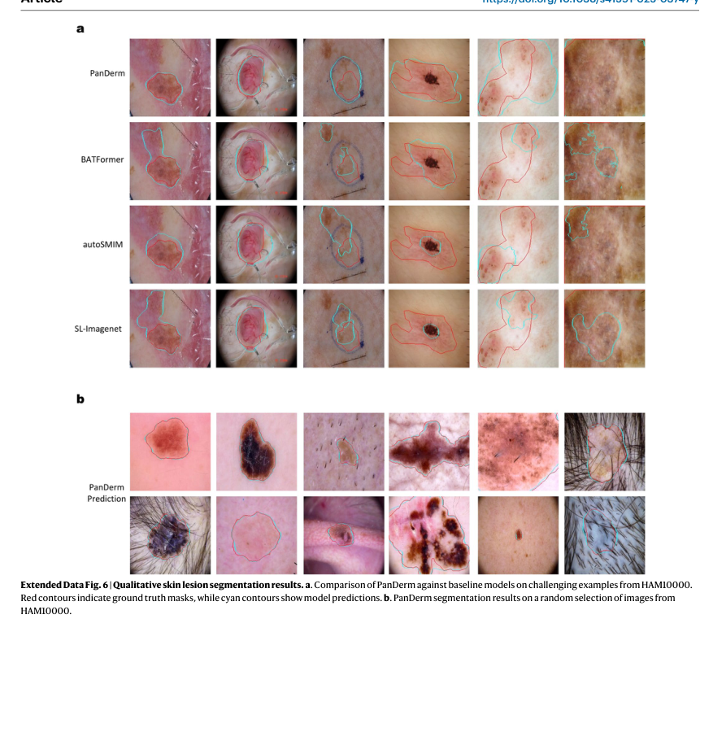

해석: 이 Figure는 데이터 구성, 예시, 분포 특성 범주를 시각적으로 보여준다. 원문 맥락에서는 해당 논문의 핵심 근거를 보강하는 자료이며, 특히 PanDerm의 multimodal foundation representation, TBP screening, reader study 성능 주장 관련 내용을 이해하는 데 도움이 된다. ISIC2024 연구에서는 외부 pretraining과 3D-TBP image-metadata 결합을 train-only baseline과 분리해 논의할 때 근거로 사용할 수 있다.

**Extended Data Figure 7. 성능 비교와 정량 평가 결과**

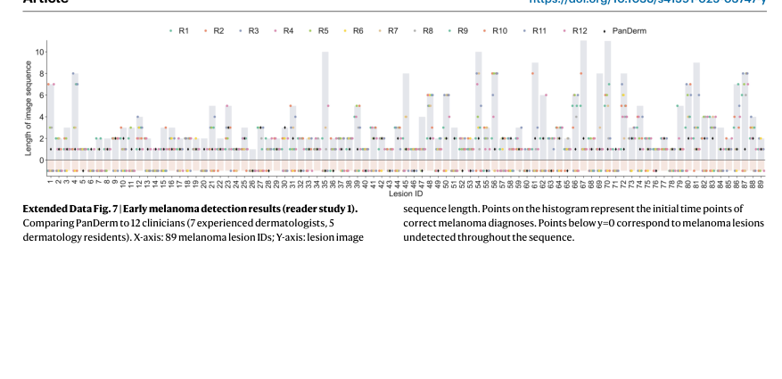

해석: 이 Figure는 성능 비교와 정량 평가 결과 범주를 시각적으로 보여준다. 원문 맥락에서는 해당 논문의 핵심 근거를 보강하는 자료이며, 특히 PanDerm의 multimodal foundation representation, TBP screening, reader study 성능 주장 관련 내용을 이해하는 데 도움이 된다. ISIC2024 연구에서는 외부 pretraining과 3D-TBP image-metadata 결합을 train-only baseline과 분리해 논의할 때 근거로 사용할 수 있다.

**Extended Data Figure 8. 데이터 구성, 예시, 분포 특성**

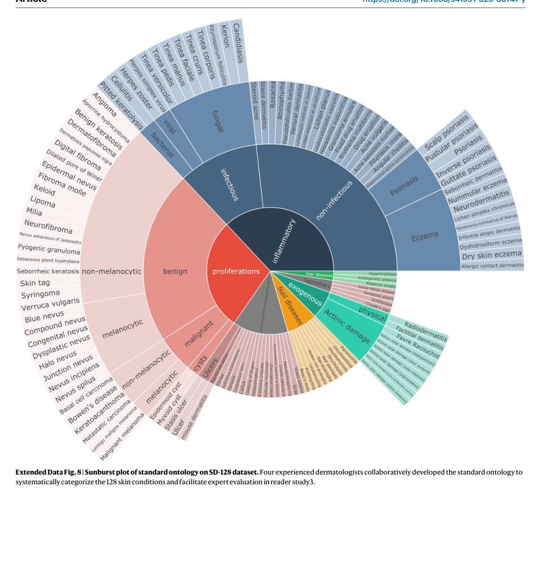

해석: 이 Figure는 데이터 구성, 예시, 분포 특성 범주를 시각적으로 보여준다. 원문 맥락에서는 해당 논문의 핵심 근거를 보강하는 자료이며, 특히 PanDerm의 multimodal foundation representation, TBP screening, reader study 성능 주장 관련 내용을 이해하는 데 도움이 된다. ISIC2024 연구에서는 외부 pretraining과 3D-TBP image-metadata 결합을 train-only baseline과 분리해 논의할 때 근거로 사용할 수 있다.

**Extended Data Figure 9. 데이터 구성, 예시, 분포 특성**

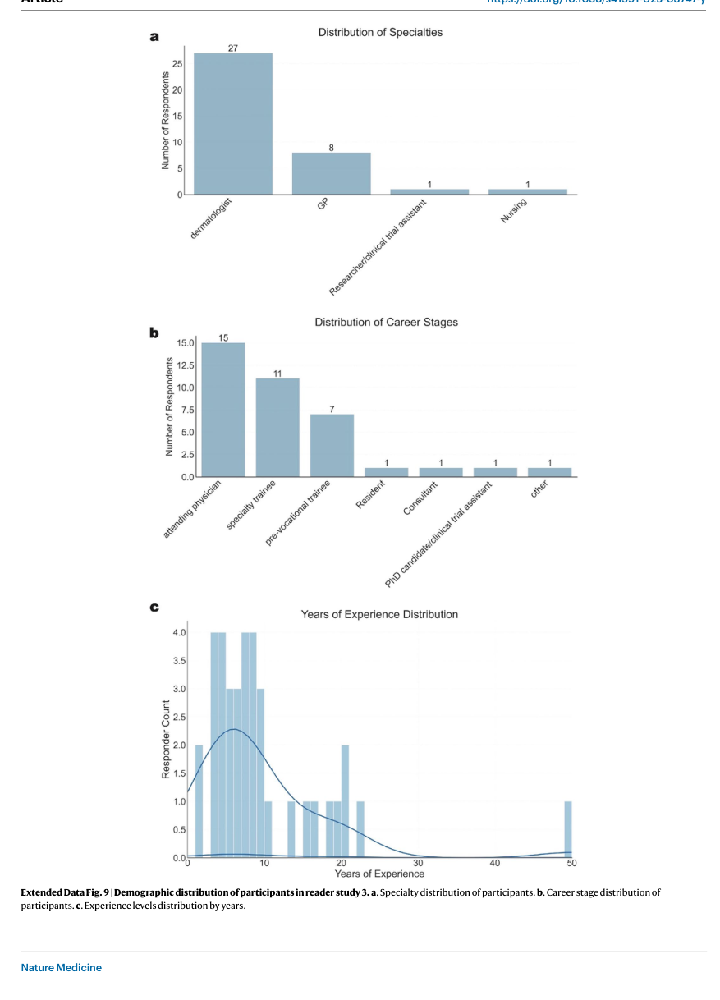

해석: 이 Figure는 데이터 구성, 예시, 분포 특성 범주를 시각적으로 보여준다. 원문 맥락에서는 해당 논문의 핵심 근거를 보강하는 자료이며, 특히 PanDerm의 multimodal foundation representation, TBP screening, reader study 성능 주장 관련 내용을 이해하는 데 도움이 된다. ISIC2024 연구에서는 외부 pretraining과 3D-TBP image-metadata 결합을 train-only baseline과 분리해 논의할 때 근거로 사용할 수 있다.

**Extended Data Table 1. 성능 비교와 정량 평가 결과 요약**

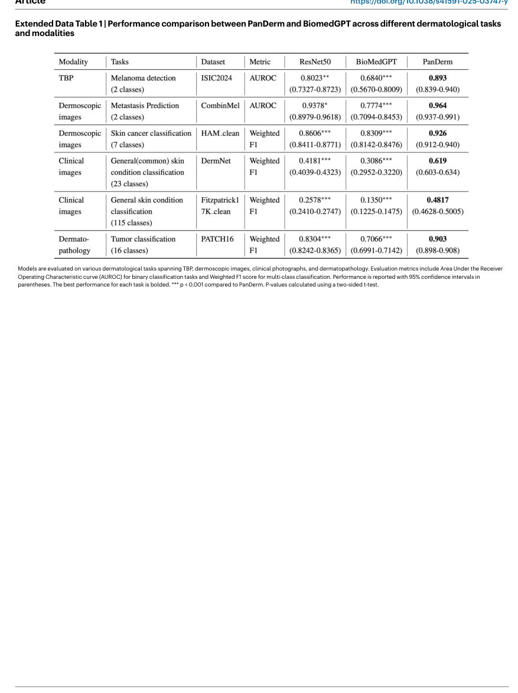

해석: 이 Table은 성능 비교와 정량 평가 결과 범주의 정보를 표 형태로 정리한다. 비교 축과 수치는 해당 논문의 핵심 근거를 보강하며, 특히 PanDerm의 multimodal foundation representation, TBP screening, reader study 성능 주장 관련 내용을 비교해 읽는 기준이 된다. ISIC2024 연구에서는 외부 pretraining과 3D-TBP image-metadata 결합을 train-only baseline과 분리해 논의할 때 근거로 사용할 수 있다.

## 우리 연구에서의 위치

PanDerm은 dermatology AI가 단일 dermoscopy classifier에서 3D-TBP, clinical image, dermoscopy, dermatopathology를 포괄하는 foundation model로 확장되고 있음을 보여주는 핵심 reference이다. ISIC 2024 연구에서는 train-only baseline과 별도로, external pretraining 또는 multimodal representation learning의 장기 확장 방향을 설명할 때 유용하다.

---

## 목표와 기여

PanDerm이라는 범용 멀티모달 피부과 foundation model을 제안해 피부암 선별, 진단, 분할, 병변 변화 추적, 예후 예측을 하나의 표현 학습 모델로 지원한다. 특히 label이 희소한 dermatology task에서 self-supervised pretraining을 통해 downstream 성능과 label efficiency를 높이는 것이 핵심 기여이다.

## Dataset 정보

- Pretraining: 11개 기관, 4개 modality, 2,149,706개 unlabeled skin image
- Modality: TBP tile, dermatopathology, clinical image, dermoscopy
- Downstream 평가: 28개 dataset
- TBP screening 실험: malignant 216개와 benign 197,716개를 포함하는 극단적 imbalance setting

## Imbalance 처리

명시적인 oversampling/undersampling보다 대규모 self-supervised pretraining과 label-efficient 학습으로 희소 positive label 문제를 완화한다. ISIC 2024와 유사하게 TBP screening에서는 malignant가 매우 적은 setting을 다루므로, ultra-rare malignant detection의 배경 근거로 활용할 수 있다.

## Tabular model

독립적인 tabular model을 핵심 구성으로 제안하지는 않는다. 다만 일부 TBP screening 실험에서 lesion measurement 또는 metadata를 image feature와 함께 사용해 image-only triage보다 임상적으로 유용한 screening 성능을 보고한다.

## Image model

ViT-Large visual encoder를 중심으로 mask regressor와 CLIP-Large teacher를 사용한다. masked latent alignment와 visible latent alignment를 통해 dermatology image modality 간 공통 representation을 학습한다.

## Fusion 방식

TBP tile, clinical image, dermoscopy, dermatopathology image modality를 공통 embedding space로 통합한다. 일부 downstream screening 실험에서는 TBP image representation과 measurement metadata를 결합한다.

## 평가 지표

AUROC, AUPR, weighted F1, balanced accuracy, sensitivity, lesion detection count, reader study accuracy를 사용한다. ISIC 2024와 직접 같은 metric은 아니지만 high-sensitivity triage 관점에서 sensitivity와 unnecessary dermoscopy reduction이 중요하다.

## 평가 결과

여러 downstream task에서 SOTA 수준의 성능을 보고한다. early melanoma reader study에서는 평균 임상의보다 높은 정확도를 보였고, human-AI 협업에서 추가 향상을 보고했다. TBP screening에서는 sensitivity 0.893과 불필요한 dermoscopy 약 60.8% 감소를 보고한다.

## ISIC2024 연구 시사점

- ISIC 2024의 3D-TBP tile은 단일 image classifier보다 foundation representation과 잘 맞는 modality이다.
- train-only 연구에서는 PanDerm을 직접 baseline으로 쓰기보다 external pretraining discussion에서 분리해 다루는 것이 안전하다.
- metadata를 포함한 TBP screening 성능은 image-tabular fusion의 임상적 필요성을 뒷받침한다.

## 추가 논의/주의점

- 로컬에 Nature Medicine published PDF가 있으므로, 논문 정리와 인용은 published version을 우선 사용한다.
- Nature Medicine published version과 arXiv PDF title이 다르므로 citation에서 version을 명확히 구분해야 한다.
- ISIC 2024 train-only setting에서는 외부 대규모 pretraining 사용 여부를 엄격히 표시해야 한다.
- foundation model 성능을 직접 비교하려면 downstream split, label definition, modality availability가 맞는지 확인해야 한다.

---

[메인 문서로 돌아가기](../2026-05-18_dermatology_ai_literature_review.md#3-주요-논문별-상세-분석)
