# Automatic Melanoma Detection Using an Optimized Five-Stream Convolutional Neural Network

## 출처/링크

출처: Scientific Reports, 2025  
DOI: `10.1038/s41598-025-05675-w`  
Google Scholar 인용: 확인 불가 (조회일: 2026-05-20, 자동 조회 중 Google Scholar reCAPTCHA 발생)  
PDF: [s41598-025-05675-w.pdf](../paper/s41598-025-05675-w.pdf)

## 주요 Figure 및 Table

원문 PDF의 본문 Figure/Table을 번호 단위로 추출해 로컬 asset으로 저장했다. Caption은 길게 옮기지 않고, 각 항목이 보여주는 내용과 ISIC2024 연구 관점의 의미를 한국어로 의역해 정리했다.

**Figure 1. 연구 설계와 모델/데이터 처리 흐름**

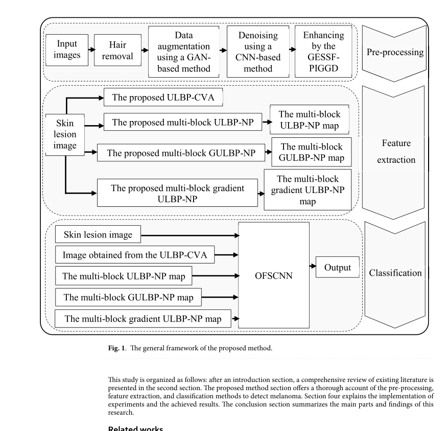

해석: 이 Figure는 연구 설계와 모델/데이터 처리 흐름 범주를 시각적으로 보여준다. 원문 맥락에서는 해당 논문의 핵심 근거를 보강하는 자료이며, 특히 GAN augmentation, preprocessing, handcrafted feature extraction, optimized multi-stream CNN 구조 관련 내용을 이해하는 데 도움이 된다. ISIC2024 연구에서는 ISIC 2024 classification pipeline에서 augmentation, feature branch, optimizer ablation을 비교할 때 참고할 수 있다.

**Figure 2. 성능 비교와 정량 평가 결과**

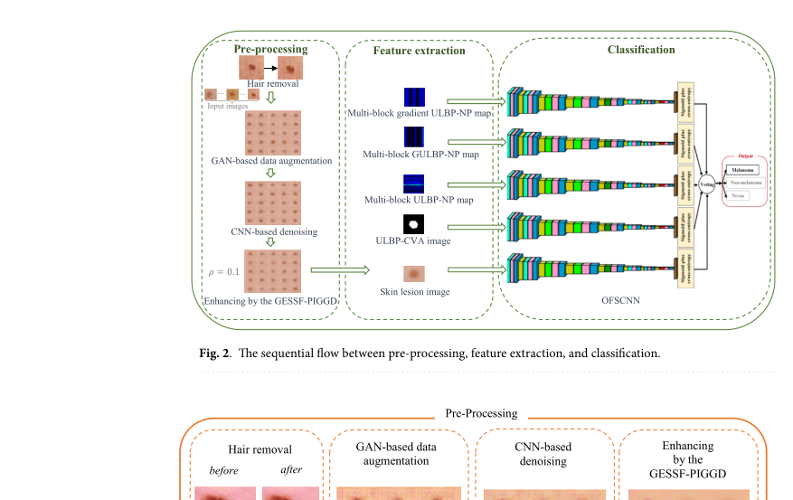

해석: 이 Figure는 성능 비교와 정량 평가 결과 범주를 시각적으로 보여준다. 원문 맥락에서는 해당 논문의 핵심 근거를 보강하는 자료이며, 특히 GAN augmentation, preprocessing, handcrafted feature extraction, optimized multi-stream CNN 구조 관련 내용을 이해하는 데 도움이 된다. ISIC2024 연구에서는 ISIC 2024 classification pipeline에서 augmentation, feature branch, optimizer ablation을 비교할 때 참고할 수 있다.

**Figure 3. 성능 비교와 정량 평가 결과**

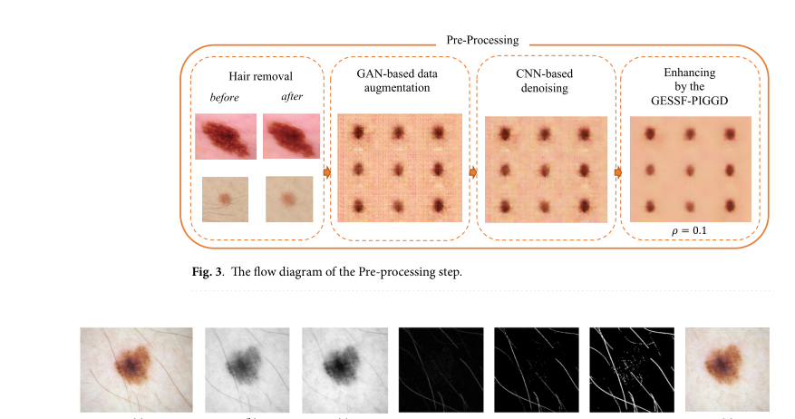

해석: 이 Figure는 성능 비교와 정량 평가 결과 범주를 시각적으로 보여준다. 원문 맥락에서는 해당 논문의 핵심 근거를 보강하는 자료이며, 특히 GAN augmentation, preprocessing, handcrafted feature extraction, optimized multi-stream CNN 구조 관련 내용을 이해하는 데 도움이 된다. ISIC2024 연구에서는 ISIC 2024 classification pipeline에서 augmentation, feature branch, optimizer ablation을 비교할 때 참고할 수 있다.

**Figure 4. 성능 비교와 정량 평가 결과**

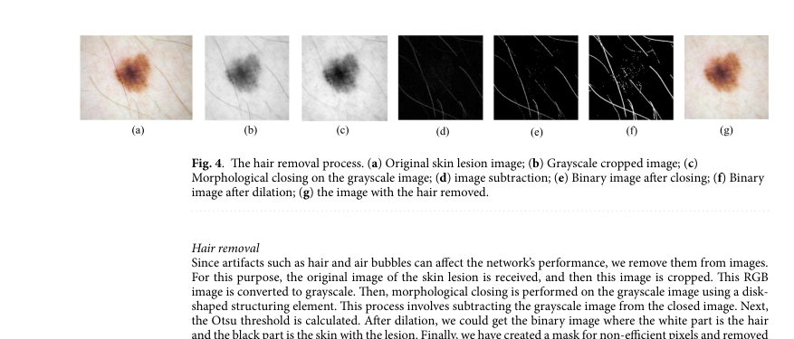

해석: 이 Figure는 성능 비교와 정량 평가 결과 범주를 시각적으로 보여준다. 원문 맥락에서는 해당 논문의 핵심 근거를 보강하는 자료이며, 특히 GAN augmentation, preprocessing, handcrafted feature extraction, optimized multi-stream CNN 구조 관련 내용을 이해하는 데 도움이 된다. ISIC2024 연구에서는 ISIC 2024 classification pipeline에서 augmentation, feature branch, optimizer ablation을 비교할 때 참고할 수 있다.

**Figure 5. 데이터 구성, 예시, 분포 특성**

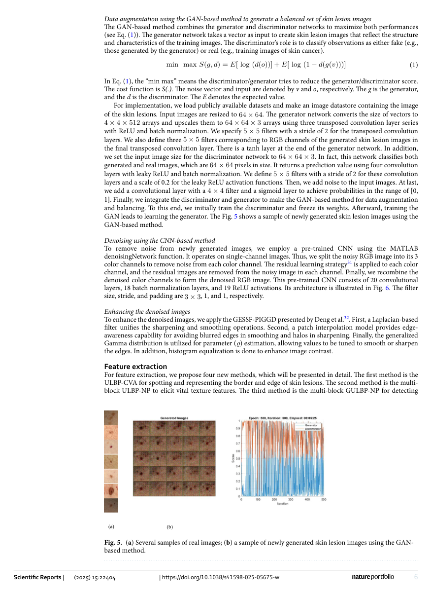

해석: 이 Figure는 데이터 구성, 예시, 분포 특성 범주를 시각적으로 보여준다. 원문 맥락에서는 해당 논문의 핵심 근거를 보강하는 자료이며, 특히 GAN augmentation, preprocessing, handcrafted feature extraction, optimized multi-stream CNN 구조 관련 내용을 이해하는 데 도움이 된다. ISIC2024 연구에서는 ISIC 2024 classification pipeline에서 augmentation, feature branch, optimizer ablation을 비교할 때 참고할 수 있다.

**Figure 6. 연구 설계와 모델/데이터 처리 흐름**

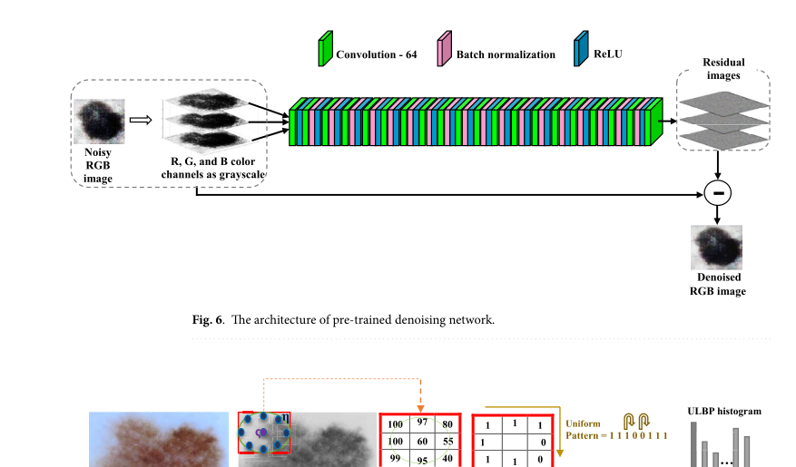

해석: 이 Figure는 연구 설계와 모델/데이터 처리 흐름 범주를 시각적으로 보여준다. 원문 맥락에서는 해당 논문의 핵심 근거를 보강하는 자료이며, 특히 GAN augmentation, preprocessing, handcrafted feature extraction, optimized multi-stream CNN 구조 관련 내용을 이해하는 데 도움이 된다. ISIC2024 연구에서는 ISIC 2024 classification pipeline에서 augmentation, feature branch, optimizer ablation을 비교할 때 참고할 수 있다.

**Figure 7. 논문 주장에 필요한 핵심 시각 자료**

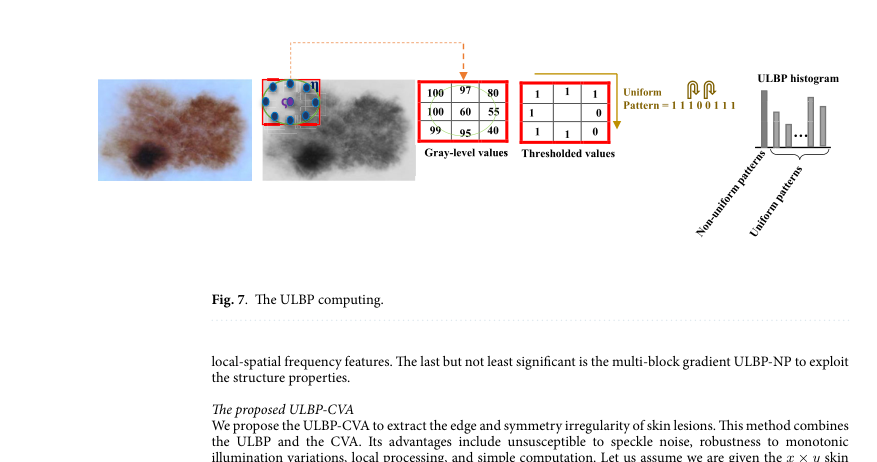

해석: 이 Figure는 논문 주장에 필요한 핵심 시각 자료 범주를 시각적으로 보여준다. 원문 맥락에서는 해당 논문의 핵심 근거를 보강하는 자료이며, 특히 GAN augmentation, preprocessing, handcrafted feature extraction, optimized multi-stream CNN 구조 관련 내용을 이해하는 데 도움이 된다. ISIC2024 연구에서는 ISIC 2024 classification pipeline에서 augmentation, feature branch, optimizer ablation을 비교할 때 참고할 수 있다.

**Figure 8. 데이터 구성, 예시, 분포 특성**

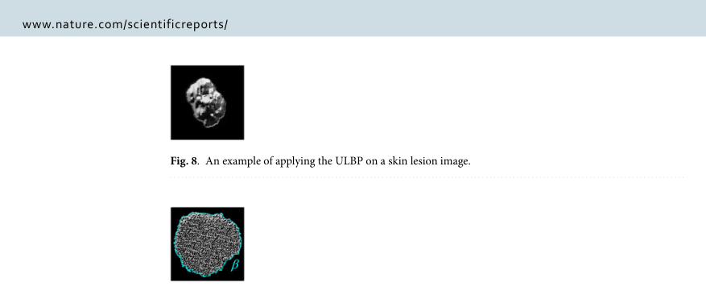

해석: 이 Figure는 데이터 구성, 예시, 분포 특성 범주를 시각적으로 보여준다. 원문 맥락에서는 해당 논문의 핵심 근거를 보강하는 자료이며, 특히 GAN augmentation, preprocessing, handcrafted feature extraction, optimized multi-stream CNN 구조 관련 내용을 이해하는 데 도움이 된다. ISIC2024 연구에서는 ISIC 2024 classification pipeline에서 augmentation, feature branch, optimizer ablation을 비교할 때 참고할 수 있다.

**Figure 9. 논문 주장에 필요한 핵심 시각 자료**

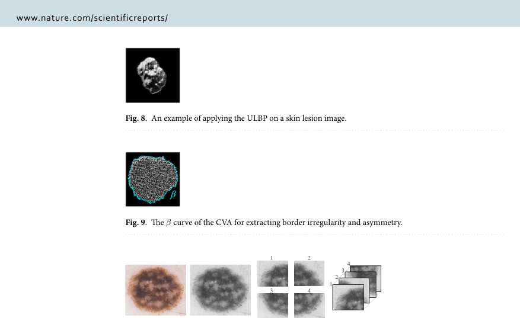

해석: 이 Figure는 논문 주장에 필요한 핵심 시각 자료 범주를 시각적으로 보여준다. 원문 맥락에서는 해당 논문의 핵심 근거를 보강하는 자료이며, 특히 GAN augmentation, preprocessing, handcrafted feature extraction, optimized multi-stream CNN 구조 관련 내용을 이해하는 데 도움이 된다. ISIC2024 연구에서는 ISIC 2024 classification pipeline에서 augmentation, feature branch, optimizer ablation을 비교할 때 참고할 수 있다.

**Figure 10. 논문 주장에 필요한 핵심 시각 자료**

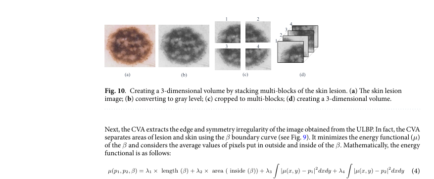

해석: 이 Figure는 논문 주장에 필요한 핵심 시각 자료 범주를 시각적으로 보여준다. 원문 맥락에서는 해당 논문의 핵심 근거를 보강하는 자료이며, 특히 GAN augmentation, preprocessing, handcrafted feature extraction, optimized multi-stream CNN 구조 관련 내용을 이해하는 데 도움이 된다. ISIC2024 연구에서는 ISIC 2024 classification pipeline에서 augmentation, feature branch, optimizer ablation을 비교할 때 참고할 수 있다.

**Figure 11. 논문 주장에 필요한 핵심 시각 자료**

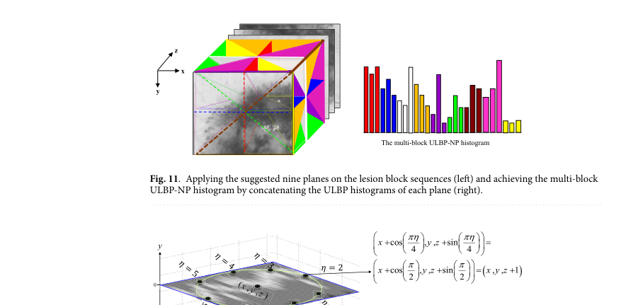

해석: 이 Figure는 논문 주장에 필요한 핵심 시각 자료 범주를 시각적으로 보여준다. 원문 맥락에서는 해당 논문의 핵심 근거를 보강하는 자료이며, 특히 GAN augmentation, preprocessing, handcrafted feature extraction, optimized multi-stream CNN 구조 관련 내용을 이해하는 데 도움이 된다. ISIC2024 연구에서는 ISIC 2024 classification pipeline에서 augmentation, feature branch, optimizer ablation을 비교할 때 참고할 수 있다.

**Figure 12. 논문 주장에 필요한 핵심 시각 자료**

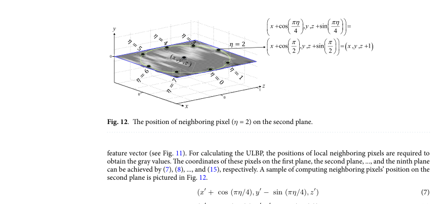

해석: 이 Figure는 논문 주장에 필요한 핵심 시각 자료 범주를 시각적으로 보여준다. 원문 맥락에서는 해당 논문의 핵심 근거를 보강하는 자료이며, 특히 GAN augmentation, preprocessing, handcrafted feature extraction, optimized multi-stream CNN 구조 관련 내용을 이해하는 데 도움이 된다. ISIC2024 연구에서는 ISIC 2024 classification pipeline에서 augmentation, feature branch, optimizer ablation을 비교할 때 참고할 수 있다.

**Figure 13. 논문 주장에 필요한 핵심 시각 자료**

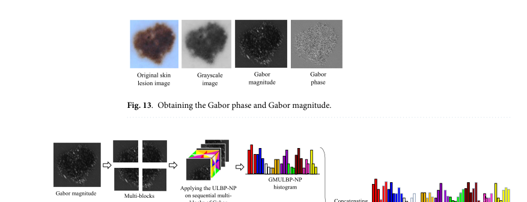

해석: 이 Figure는 논문 주장에 필요한 핵심 시각 자료 범주를 시각적으로 보여준다. 원문 맥락에서는 해당 논문의 핵심 근거를 보강하는 자료이며, 특히 GAN augmentation, preprocessing, handcrafted feature extraction, optimized multi-stream CNN 구조 관련 내용을 이해하는 데 도움이 된다. ISIC2024 연구에서는 ISIC 2024 classification pipeline에서 augmentation, feature branch, optimizer ablation을 비교할 때 참고할 수 있다.

**Figure 14. 성능 비교와 정량 평가 결과**

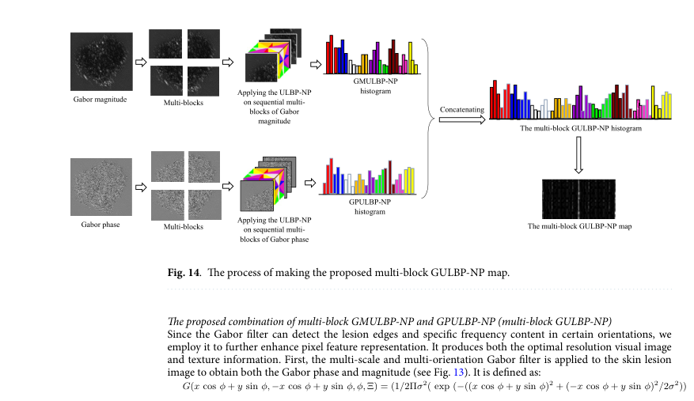

해석: 이 Figure는 성능 비교와 정량 평가 결과 범주를 시각적으로 보여준다. 원문 맥락에서는 해당 논문의 핵심 근거를 보강하는 자료이며, 특히 GAN augmentation, preprocessing, handcrafted feature extraction, optimized multi-stream CNN 구조 관련 내용을 이해하는 데 도움이 된다. ISIC2024 연구에서는 ISIC 2024 classification pipeline에서 augmentation, feature branch, optimizer ablation을 비교할 때 참고할 수 있다.

**Figure 15. 성능 비교와 정량 평가 결과**

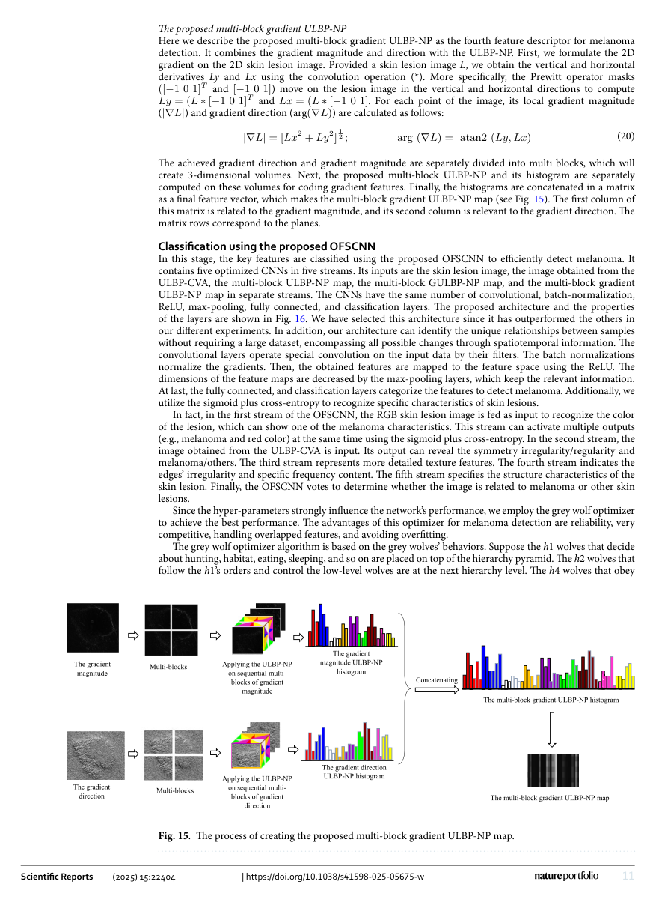

해석: 이 Figure는 성능 비교와 정량 평가 결과 범주를 시각적으로 보여준다. 원문 맥락에서는 해당 논문의 핵심 근거를 보강하는 자료이며, 특히 GAN augmentation, preprocessing, handcrafted feature extraction, optimized multi-stream CNN 구조 관련 내용을 이해하는 데 도움이 된다. ISIC2024 연구에서는 ISIC 2024 classification pipeline에서 augmentation, feature branch, optimizer ablation을 비교할 때 참고할 수 있다.

**Figure 16. 연구 설계와 모델/데이터 처리 흐름**

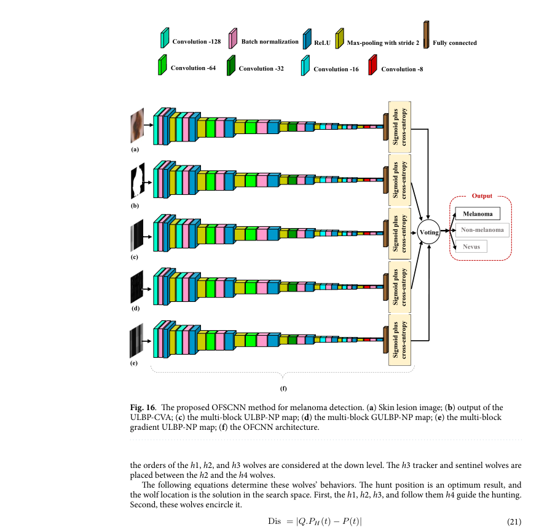

해석: 이 Figure는 연구 설계와 모델/데이터 처리 흐름 범주를 시각적으로 보여준다. 원문 맥락에서는 해당 논문의 핵심 근거를 보강하는 자료이며, 특히 GAN augmentation, preprocessing, handcrafted feature extraction, optimized multi-stream CNN 구조 관련 내용을 이해하는 데 도움이 된다. ISIC2024 연구에서는 ISIC 2024 classification pipeline에서 augmentation, feature branch, optimizer ablation을 비교할 때 참고할 수 있다.

**Figure 17. 데이터 구성, 예시, 분포 특성**

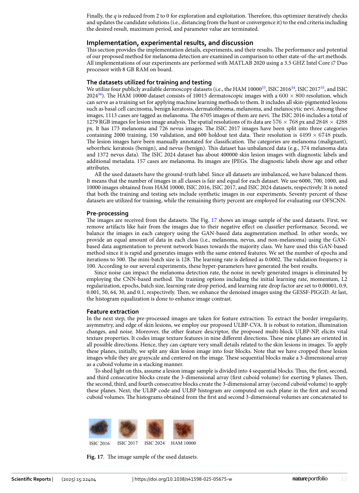

해석: 이 Figure는 데이터 구성, 예시, 분포 특성 범주를 시각적으로 보여준다. 원문 맥락에서는 해당 논문의 핵심 근거를 보강하는 자료이며, 특히 GAN augmentation, preprocessing, handcrafted feature extraction, optimized multi-stream CNN 구조 관련 내용을 이해하는 데 도움이 된다. ISIC2024 연구에서는 ISIC 2024 classification pipeline에서 augmentation, feature branch, optimizer ablation을 비교할 때 참고할 수 있다.

**Figure 18. 데이터 구성, 예시, 분포 특성**

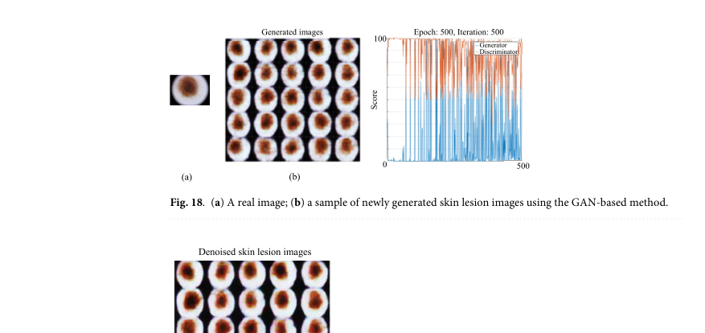

해석: 이 Figure는 데이터 구성, 예시, 분포 특성 범주를 시각적으로 보여준다. 원문 맥락에서는 해당 논문의 핵심 근거를 보강하는 자료이며, 특히 GAN augmentation, preprocessing, handcrafted feature extraction, optimized multi-stream CNN 구조 관련 내용을 이해하는 데 도움이 된다. ISIC2024 연구에서는 ISIC 2024 classification pipeline에서 augmentation, feature branch, optimizer ablation을 비교할 때 참고할 수 있다.

**Figure 19. 구성요소별 ablation과 민감도 분석**

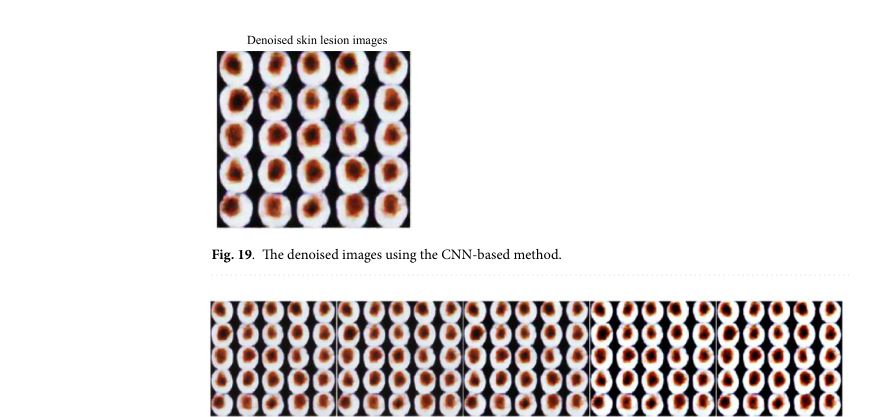

해석: 이 Figure는 구성요소별 ablation과 민감도 분석 범주를 시각적으로 보여준다. 원문 맥락에서는 해당 논문의 핵심 근거를 보강하는 자료이며, 특히 GAN augmentation, preprocessing, handcrafted feature extraction, optimized multi-stream CNN 구조 관련 내용을 이해하는 데 도움이 된다. ISIC2024 연구에서는 ISIC 2024 classification pipeline에서 augmentation, feature branch, optimizer ablation을 비교할 때 참고할 수 있다.

**Figure 20. 논문 주장에 필요한 핵심 시각 자료**

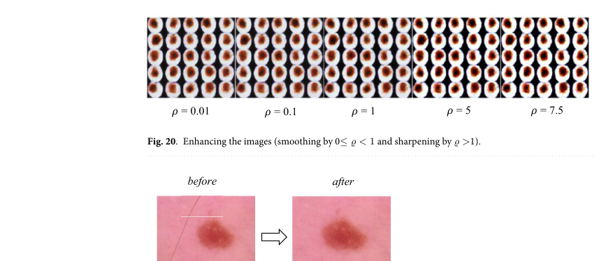

해석: 이 Figure는 논문 주장에 필요한 핵심 시각 자료 범주를 시각적으로 보여준다. 원문 맥락에서는 해당 논문의 핵심 근거를 보강하는 자료이며, 특히 GAN augmentation, preprocessing, handcrafted feature extraction, optimized multi-stream CNN 구조 관련 내용을 이해하는 데 도움이 된다. ISIC2024 연구에서는 ISIC 2024 classification pipeline에서 augmentation, feature branch, optimizer ablation을 비교할 때 참고할 수 있다.

**Figure 21. 데이터 구성, 예시, 분포 특성**

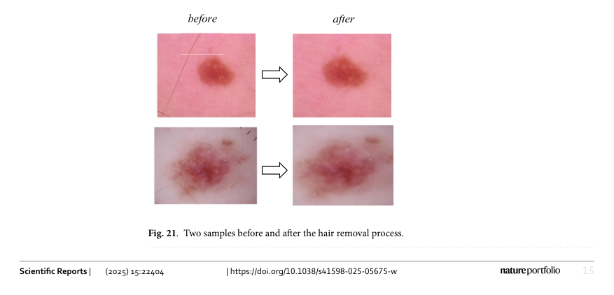

해석: 이 Figure는 데이터 구성, 예시, 분포 특성 범주를 시각적으로 보여준다. 원문 맥락에서는 해당 논문의 핵심 근거를 보강하는 자료이며, 특히 GAN augmentation, preprocessing, handcrafted feature extraction, optimized multi-stream CNN 구조 관련 내용을 이해하는 데 도움이 된다. ISIC2024 연구에서는 ISIC 2024 classification pipeline에서 augmentation, feature branch, optimizer ablation을 비교할 때 참고할 수 있다.

**Figure 22. 데이터 구성, 예시, 분포 특성**

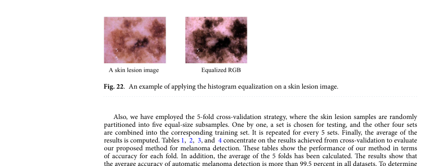

해석: 이 Figure는 데이터 구성, 예시, 분포 특성 범주를 시각적으로 보여준다. 원문 맥락에서는 해당 논문의 핵심 근거를 보강하는 자료이며, 특히 GAN augmentation, preprocessing, handcrafted feature extraction, optimized multi-stream CNN 구조 관련 내용을 이해하는 데 도움이 된다. ISIC2024 연구에서는 ISIC 2024 classification pipeline에서 augmentation, feature branch, optimizer ablation을 비교할 때 참고할 수 있다.

**Figure 23. 데이터 구성, 예시, 분포 특성**

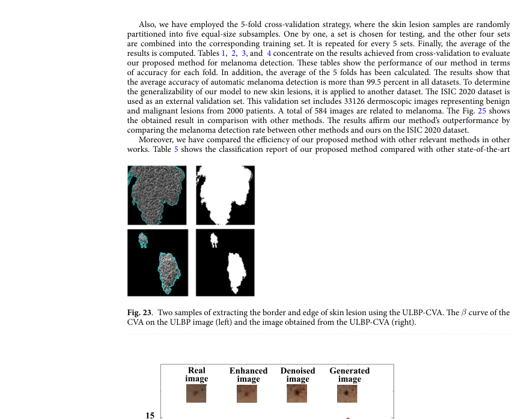

해석: 이 Figure는 데이터 구성, 예시, 분포 특성 범주를 시각적으로 보여준다. 원문 맥락에서는 해당 논문의 핵심 근거를 보강하는 자료이며, 특히 GAN augmentation, preprocessing, handcrafted feature extraction, optimized multi-stream CNN 구조 관련 내용을 이해하는 데 도움이 된다. ISIC2024 연구에서는 ISIC 2024 classification pipeline에서 augmentation, feature branch, optimizer ablation을 비교할 때 참고할 수 있다.

**Figure 24. 구성요소별 ablation과 민감도 분석**

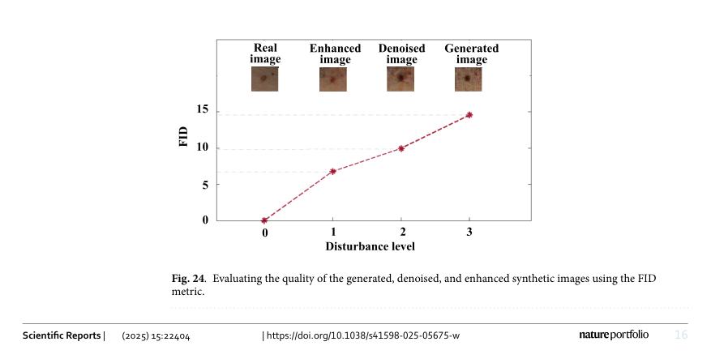

해석: 이 Figure는 구성요소별 ablation과 민감도 분석 범주를 시각적으로 보여준다. 원문 맥락에서는 해당 논문의 핵심 근거를 보강하는 자료이며, 특히 GAN augmentation, preprocessing, handcrafted feature extraction, optimized multi-stream CNN 구조 관련 내용을 이해하는 데 도움이 된다. ISIC2024 연구에서는 ISIC 2024 classification pipeline에서 augmentation, feature branch, optimizer ablation을 비교할 때 참고할 수 있다.

**Table 1. 성능 비교와 정량 평가 결과 요약**

해석: 이 Table은 성능 비교와 정량 평가 결과 범주의 정보를 표 형태로 정리한다. 비교 축과 수치는 해당 논문의 핵심 근거를 보강하며, 특히 GAN augmentation, preprocessing, handcrafted feature extraction, optimized multi-stream CNN 구조 관련 내용을 비교해 읽는 기준이 된다. ISIC2024 연구에서는 ISIC 2024 classification pipeline에서 augmentation, feature branch, optimizer ablation을 비교할 때 참고할 수 있다.

**Table 2. 성능 비교와 정량 평가 결과 요약**

해석: 이 Table은 성능 비교와 정량 평가 결과 범주의 정보를 표 형태로 정리한다. 비교 축과 수치는 해당 논문의 핵심 근거를 보강하며, 특히 GAN augmentation, preprocessing, handcrafted feature extraction, optimized multi-stream CNN 구조 관련 내용을 비교해 읽는 기준이 된다. ISIC2024 연구에서는 ISIC 2024 classification pipeline에서 augmentation, feature branch, optimizer ablation을 비교할 때 참고할 수 있다.

**Table 3. 성능 비교와 정량 평가 결과 요약**

해석: 이 Table은 성능 비교와 정량 평가 결과 범주의 정보를 표 형태로 정리한다. 비교 축과 수치는 해당 논문의 핵심 근거를 보강하며, 특히 GAN augmentation, preprocessing, handcrafted feature extraction, optimized multi-stream CNN 구조 관련 내용을 비교해 읽는 기준이 된다. ISIC2024 연구에서는 ISIC 2024 classification pipeline에서 augmentation, feature branch, optimizer ablation을 비교할 때 참고할 수 있다.

**Table 4. 성능 비교와 정량 평가 결과 요약**

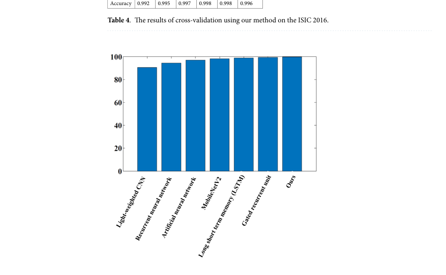

해석: 이 Table은 성능 비교와 정량 평가 결과 범주의 정보를 표 형태로 정리한다. 비교 축과 수치는 해당 논문의 핵심 근거를 보강하며, 특히 GAN augmentation, preprocessing, handcrafted feature extraction, optimized multi-stream CNN 구조 관련 내용을 비교해 읽는 기준이 된다. ISIC2024 연구에서는 ISIC 2024 classification pipeline에서 augmentation, feature branch, optimizer ablation을 비교할 때 참고할 수 있다.

**Figure 25. 데이터 구성, 예시, 분포 특성**

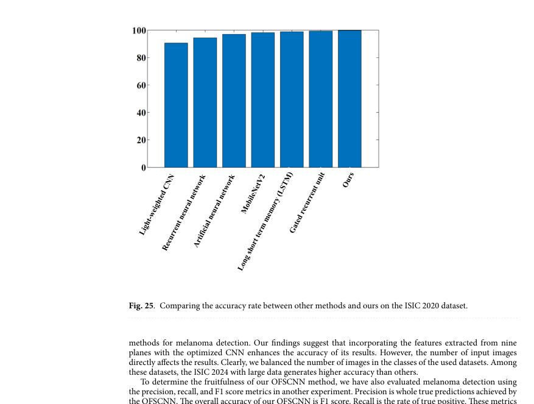

해석: 이 Figure는 데이터 구성, 예시, 분포 특성 범주를 시각적으로 보여준다. 원문 맥락에서는 해당 논문의 핵심 근거를 보강하는 자료이며, 특히 GAN augmentation, preprocessing, handcrafted feature extraction, optimized multi-stream CNN 구조 관련 내용을 이해하는 데 도움이 된다. ISIC2024 연구에서는 ISIC 2024 classification pipeline에서 augmentation, feature branch, optimizer ablation을 비교할 때 참고할 수 있다.

**Table 5. 비교 항목과 핵심 수치 요약**

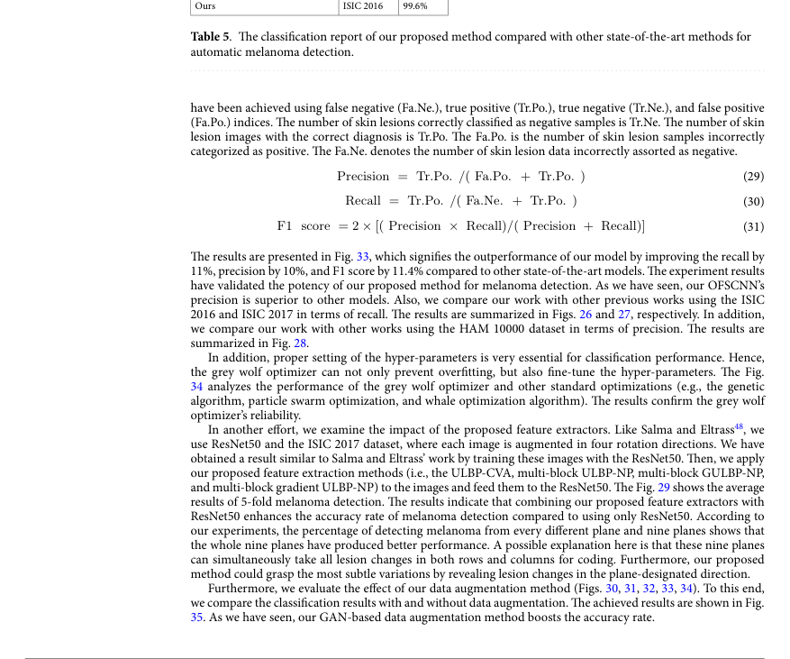

해석: 이 Table은 비교 항목과 핵심 수치 범주의 정보를 표 형태로 정리한다. 비교 축과 수치는 해당 논문의 핵심 근거를 보강하며, 특히 GAN augmentation, preprocessing, handcrafted feature extraction, optimized multi-stream CNN 구조 관련 내용을 비교해 읽는 기준이 된다. ISIC2024 연구에서는 ISIC 2024 classification pipeline에서 augmentation, feature branch, optimizer ablation을 비교할 때 참고할 수 있다.

**Figure 26. 데이터 구성, 예시, 분포 특성**

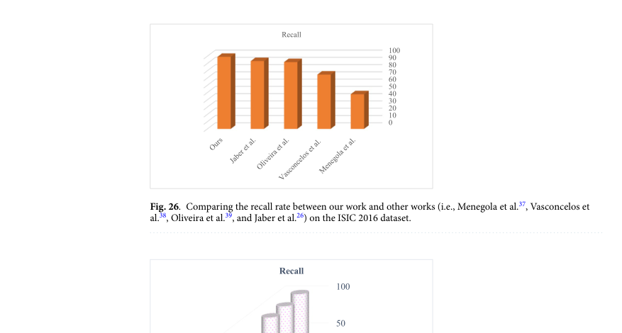

해석: 이 Figure는 데이터 구성, 예시, 분포 특성 범주를 시각적으로 보여준다. 원문 맥락에서는 해당 논문의 핵심 근거를 보강하는 자료이며, 특히 GAN augmentation, preprocessing, handcrafted feature extraction, optimized multi-stream CNN 구조 관련 내용을 이해하는 데 도움이 된다. ISIC2024 연구에서는 ISIC 2024 classification pipeline에서 augmentation, feature branch, optimizer ablation을 비교할 때 참고할 수 있다.

**Figure 27. 데이터 구성, 예시, 분포 특성**

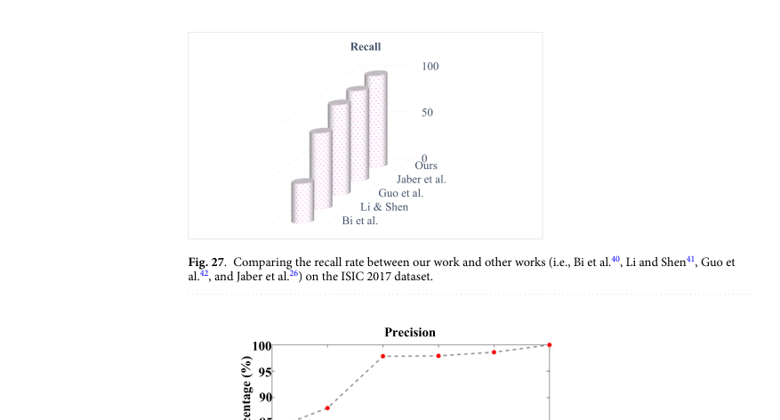

해석: 이 Figure는 데이터 구성, 예시, 분포 특성 범주를 시각적으로 보여준다. 원문 맥락에서는 해당 논문의 핵심 근거를 보강하는 자료이며, 특히 GAN augmentation, preprocessing, handcrafted feature extraction, optimized multi-stream CNN 구조 관련 내용을 이해하는 데 도움이 된다. ISIC2024 연구에서는 ISIC 2024 classification pipeline에서 augmentation, feature branch, optimizer ablation을 비교할 때 참고할 수 있다.

**Figure 28. 데이터 구성, 예시, 분포 특성**

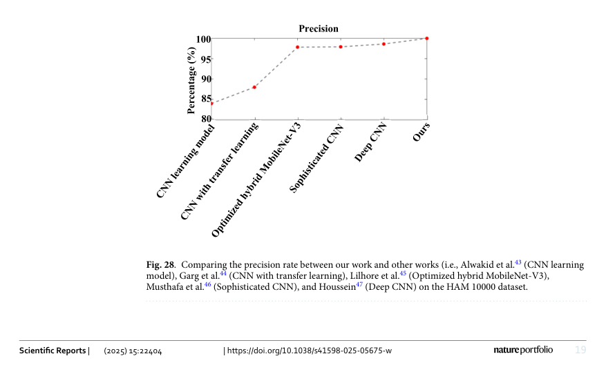

해석: 이 Figure는 데이터 구성, 예시, 분포 특성 범주를 시각적으로 보여준다. 원문 맥락에서는 해당 논문의 핵심 근거를 보강하는 자료이며, 특히 GAN augmentation, preprocessing, handcrafted feature extraction, optimized multi-stream CNN 구조 관련 내용을 이해하는 데 도움이 된다. ISIC2024 연구에서는 ISIC 2024 classification pipeline에서 augmentation, feature branch, optimizer ablation을 비교할 때 참고할 수 있다.

**Figure 29. 구성요소별 ablation과 민감도 분석**

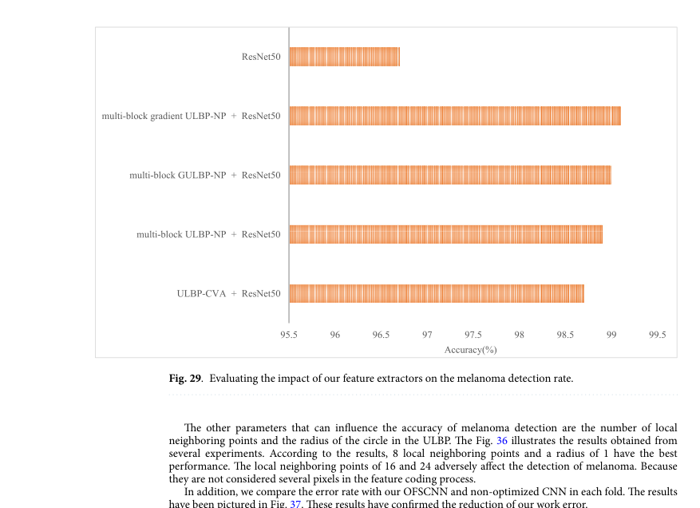

해석: 이 Figure는 구성요소별 ablation과 민감도 분석 범주를 시각적으로 보여준다. 원문 맥락에서는 해당 논문의 핵심 근거를 보강하는 자료이며, 특히 GAN augmentation, preprocessing, handcrafted feature extraction, optimized multi-stream CNN 구조 관련 내용을 이해하는 데 도움이 된다. ISIC2024 연구에서는 ISIC 2024 classification pipeline에서 augmentation, feature branch, optimizer ablation을 비교할 때 참고할 수 있다.

**Figure 30. 논문 주장에 필요한 핵심 시각 자료**

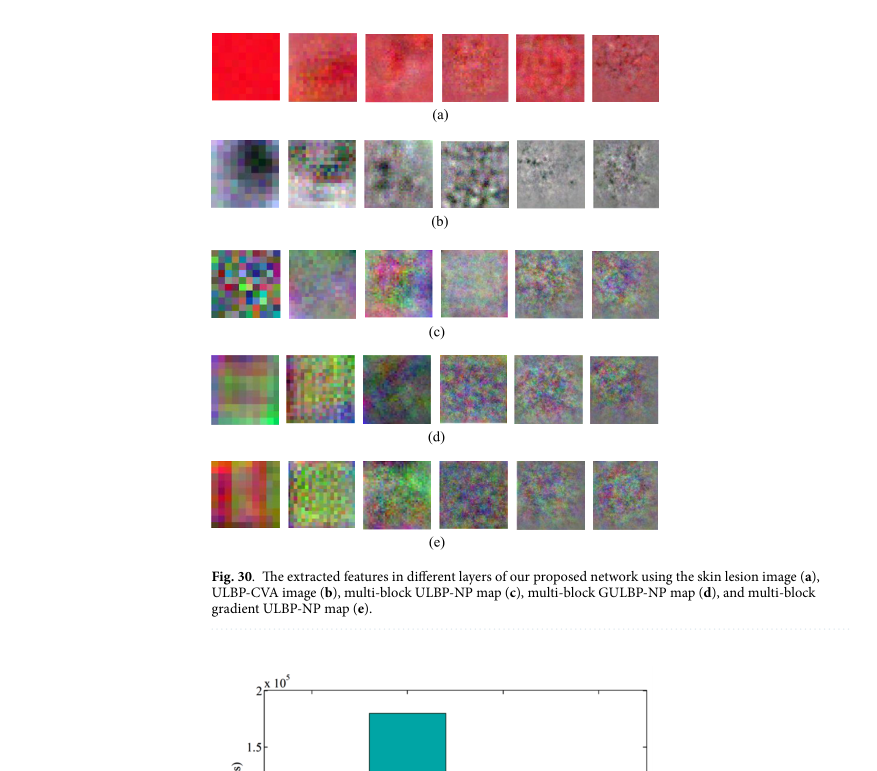

해석: 이 Figure는 논문 주장에 필요한 핵심 시각 자료 범주를 시각적으로 보여준다. 원문 맥락에서는 해당 논문의 핵심 근거를 보강하는 자료이며, 특히 GAN augmentation, preprocessing, handcrafted feature extraction, optimized multi-stream CNN 구조 관련 내용을 이해하는 데 도움이 된다. ISIC2024 연구에서는 ISIC 2024 classification pipeline에서 augmentation, feature branch, optimizer ablation을 비교할 때 참고할 수 있다.

**Figure 31. 논문 주장에 필요한 핵심 시각 자료**

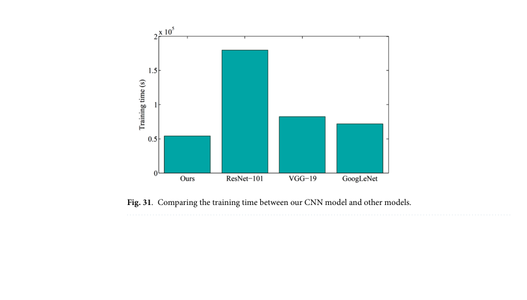

해석: 이 Figure는 논문 주장에 필요한 핵심 시각 자료 범주를 시각적으로 보여준다. 원문 맥락에서는 해당 논문의 핵심 근거를 보강하는 자료이며, 특히 GAN augmentation, preprocessing, handcrafted feature extraction, optimized multi-stream CNN 구조 관련 내용을 이해하는 데 도움이 된다. ISIC2024 연구에서는 ISIC 2024 classification pipeline에서 augmentation, feature branch, optimizer ablation을 비교할 때 참고할 수 있다.

**Figure 32. 성능 비교와 정량 평가 결과**

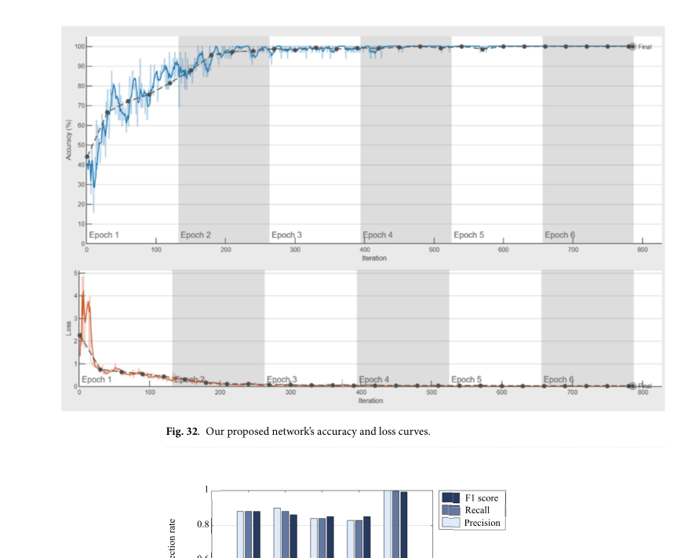

해석: 이 Figure는 성능 비교와 정량 평가 결과 범주를 시각적으로 보여준다. 원문 맥락에서는 해당 논문의 핵심 근거를 보강하는 자료이며, 특히 GAN augmentation, preprocessing, handcrafted feature extraction, optimized multi-stream CNN 구조 관련 내용을 이해하는 데 도움이 된다. ISIC2024 연구에서는 ISIC 2024 classification pipeline에서 augmentation, feature branch, optimizer ablation을 비교할 때 참고할 수 있다.

**Figure 33. 논문 주장에 필요한 핵심 시각 자료**

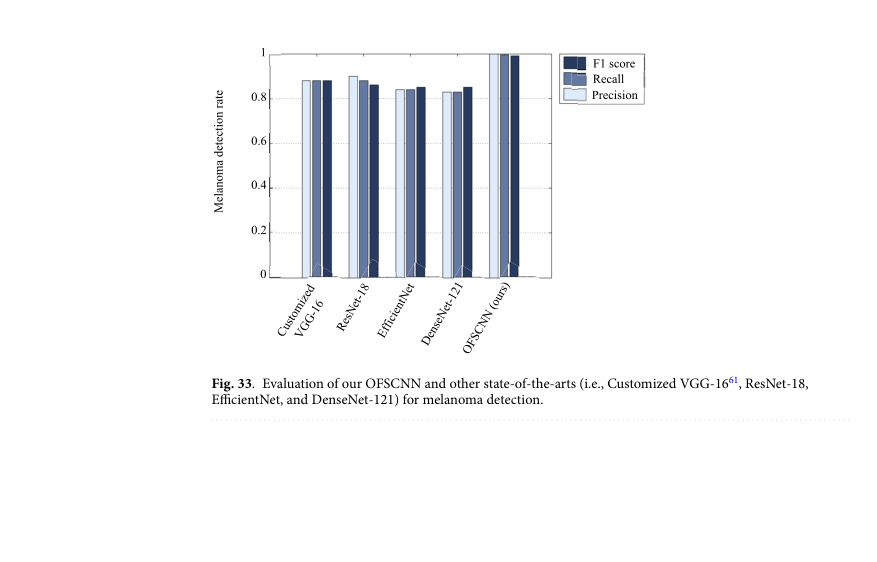

해석: 이 Figure는 논문 주장에 필요한 핵심 시각 자료 범주를 시각적으로 보여준다. 원문 맥락에서는 해당 논문의 핵심 근거를 보강하는 자료이며, 특히 GAN augmentation, preprocessing, handcrafted feature extraction, optimized multi-stream CNN 구조 관련 내용을 이해하는 데 도움이 된다. ISIC2024 연구에서는 ISIC 2024 classification pipeline에서 augmentation, feature branch, optimizer ablation을 비교할 때 참고할 수 있다.

**Figure 34. 성능 비교와 정량 평가 결과**

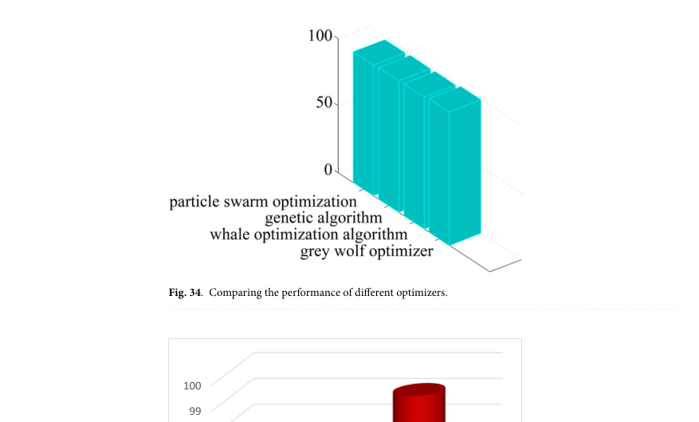

해석: 이 Figure는 성능 비교와 정량 평가 결과 범주를 시각적으로 보여준다. 원문 맥락에서는 해당 논문의 핵심 근거를 보강하는 자료이며, 특히 GAN augmentation, preprocessing, handcrafted feature extraction, optimized multi-stream CNN 구조 관련 내용을 이해하는 데 도움이 된다. ISIC2024 연구에서는 ISIC 2024 classification pipeline에서 augmentation, feature branch, optimizer ablation을 비교할 때 참고할 수 있다.

**Figure 35. 데이터 구성, 예시, 분포 특성**

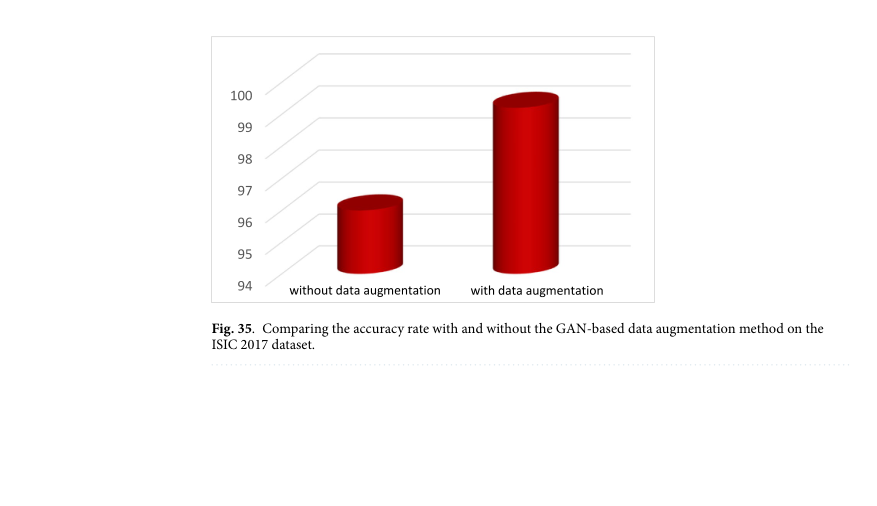

해석: 이 Figure는 데이터 구성, 예시, 분포 특성 범주를 시각적으로 보여준다. 원문 맥락에서는 해당 논문의 핵심 근거를 보강하는 자료이며, 특히 GAN augmentation, preprocessing, handcrafted feature extraction, optimized multi-stream CNN 구조 관련 내용을 이해하는 데 도움이 된다. ISIC2024 연구에서는 ISIC 2024 classification pipeline에서 augmentation, feature branch, optimizer ablation을 비교할 때 참고할 수 있다.

**Figure 36. 성능 비교와 정량 평가 결과**

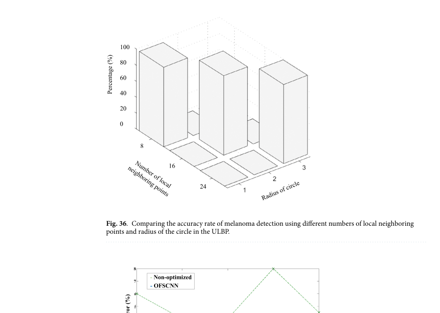

해석: 이 Figure는 성능 비교와 정량 평가 결과 범주를 시각적으로 보여준다. 원문 맥락에서는 해당 논문의 핵심 근거를 보강하는 자료이며, 특히 GAN augmentation, preprocessing, handcrafted feature extraction, optimized multi-stream CNN 구조 관련 내용을 이해하는 데 도움이 된다. ISIC2024 연구에서는 ISIC 2024 classification pipeline에서 augmentation, feature branch, optimizer ablation을 비교할 때 참고할 수 있다.

**Figure 37. 성능 비교와 정량 평가 결과**

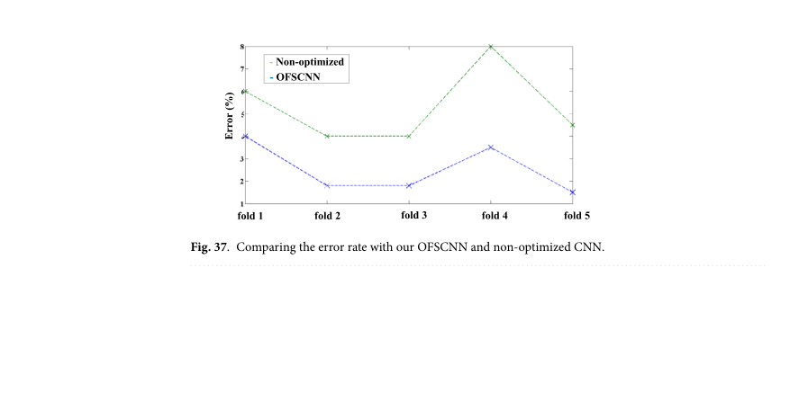

해석: 이 Figure는 성능 비교와 정량 평가 결과 범주를 시각적으로 보여준다. 원문 맥락에서는 해당 논문의 핵심 근거를 보강하는 자료이며, 특히 GAN augmentation, preprocessing, handcrafted feature extraction, optimized multi-stream CNN 구조 관련 내용을 이해하는 데 도움이 된다. ISIC2024 연구에서는 ISIC 2024 classification pipeline에서 augmentation, feature branch, optimizer ablation을 비교할 때 참고할 수 있다.

**Figure 38. 논문 주장에 필요한 핵심 시각 자료**

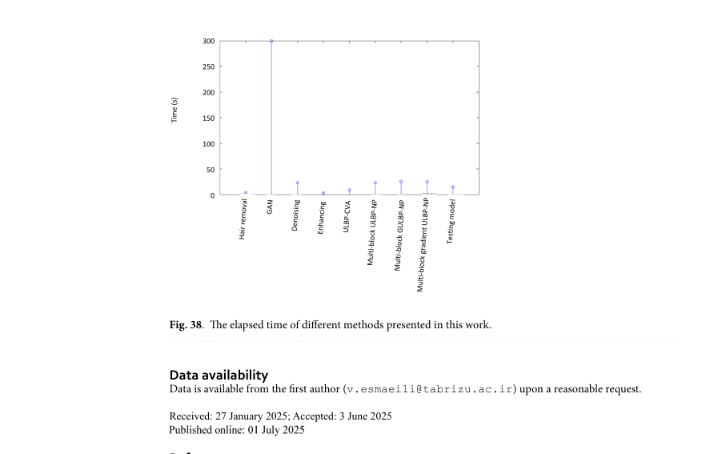

해석: 이 Figure는 논문 주장에 필요한 핵심 시각 자료 범주를 시각적으로 보여준다. 원문 맥락에서는 해당 논문의 핵심 근거를 보강하는 자료이며, 특히 GAN augmentation, preprocessing, handcrafted feature extraction, optimized multi-stream CNN 구조 관련 내용을 이해하는 데 도움이 된다. ISIC2024 연구에서는 ISIC 2024 classification pipeline에서 augmentation, feature branch, optimizer ablation을 비교할 때 참고할 수 있다.

## 우리 연구에서의 위치

multi-stream image feature와 GAN 기반 class balancing을 결합한 melanoma detection 논문이다. 다만 여러 dataset에서 매우 높은 accuracy를 보고하므로, ISIC 2024 연구에서는 직접적인 SOTA baseline이라기보다 전처리, feature stream, synthetic balancing의 보조 참고로 사용하는 것이 안전하다.

---

## 목표와 기여

hair/noise/artifact와 class imbalance 문제를 전처리하고, lesion color, edge, texture, frequency, gradient 정보를 multi-stream CNN으로 결합해 melanoma detection 정확도를 높이는 방법을 제안한다.

## Dataset 정보

- HAM10000
- ISIC 2024
- ISIC 2017
- ISIC 2016

여러 dermoscopy 및 skin lesion image dataset에서 성능을 보고한다.

## Imbalance 처리

GAN 기반 이미지 생성을 통해 class balance를 맞춘다. hair removal, CNN denoising, enhancement, contrast adjustment 등 전처리도 함께 적용한다.

## Tabular model

별도 tabular model은 없다.

## Image model

ULBP-CVA, multi-block ULBP-NP, Gabor/gradient feature map 등을 입력으로 사용하는 optimized five-stream CNN(OFSCNN)을 제안한다.

## Fusion 방식

lesion color, edge, texture, local-spatial frequency, multi-oriented gradient feature stream을 CNN 내부에서 결합한다. 이는 image feature stream fusion이며 image-tabular fusion은 아니다.

## 평가 지표

accuracy, precision, recall, F1-score, 5-fold cross-validation을 사용한다.

## 평가 결과

HAM10000 99.8%, ISIC 2024 99.9%, ISIC 2017 99.62%, ISIC 2016 99.6% detection accuracy를 보고하며, 기존 SOTA 대비 recall, precision, F1 향상을 주장한다.

## ISIC2024 연구 시사점

- lesion-specific handcrafted-like feature stream과 CNN feature를 결합하는 image-only baseline 아이디어로 참고할 수 있다.
- GAN/diffusion synthetic augmentation을 minority class balancing 후보로 논의할 때 참고 가능하다.
- metadata fusion 근거는 아니므로 multimodal model justification에는 제한적으로 사용해야 한다.

## 추가 논의/주의점

- ISIC 2024의 원본 malignant prevalence를 유지했는지, balanced subset을 썼는지 확인이 필요하다.
- 매우 높은 accuracy는 pAUC > 80% TPR setting과 직접 비교하지 않는다.
- GAN 생성 이미지가 train/test leakage나 artifact overfitting을 만들 수 있으므로 train-only 조건에서는 positive train fold 내부에서만 생성해야 한다.

---

[메인 문서로 돌아가기](../2026-05-18_dermatology_ai_literature_review.md#3-주요-논문별-상세-분석)
