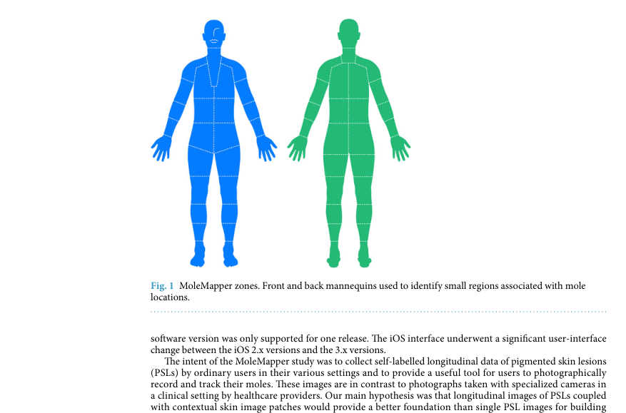
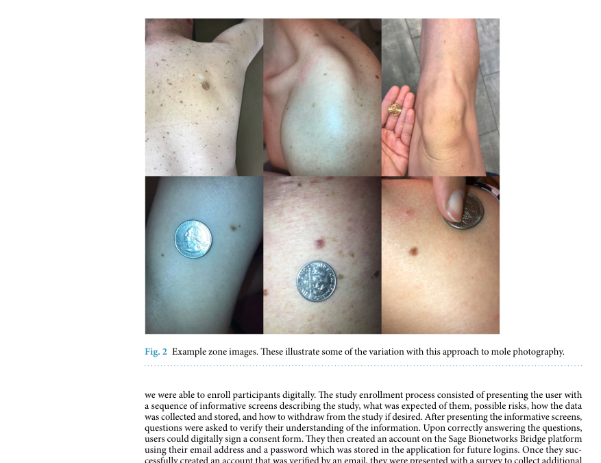
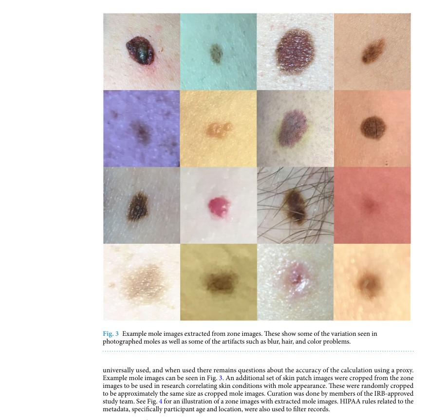
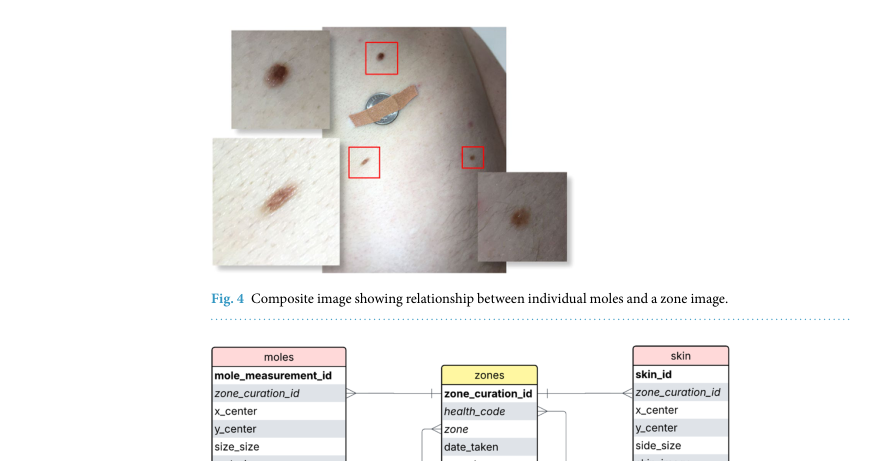
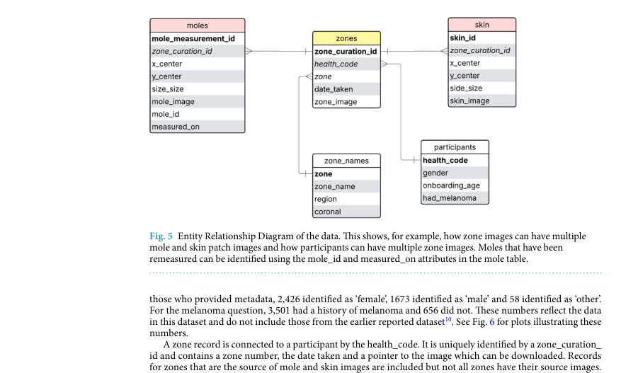
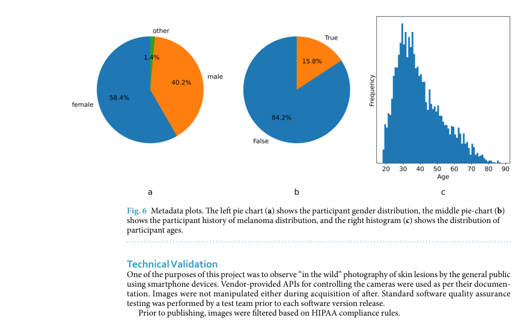

# New Release of User-Captured Images from the OHSU Melanoma MoleMapper Project

## 출처/링크

출처: Scientific Data, 2025  
DOI: `10.1038/s41597-025-05552-1`  
Google Scholar 인용: 확인 불가 (조회일: 2026-05-20, 자동 조회 중 Google Scholar reCAPTCHA 발생)  
PDF: [s41597-025-05552-1.pdf](../paper/s41597-025-05552-1.pdf)

## 주요 Figure 및 Table

원문 PDF의 본문 Figure/Table을 번호 단위로 추출해 로컬 asset으로 저장했다. Caption은 길게 옮기지 않고, 각 항목이 보여주는 내용과 ISIC2024 연구 관점의 의미를 한국어로 의역해 정리했다.

**Figure 1. 논문 주장에 필요한 핵심 시각 자료**

해석: 이 Figure는 논문 주장에 필요한 핵심 시각 자료 범주를 시각적으로 보여준다. 원문 맥락에서는 해당 논문의 핵심 근거를 보강하는 자료이며, 특히 OHSU MoleMapper의 consumer mobile image, zone/mole 관계, metadata schema 관련 내용을 이해하는 데 도움이 된다. ISIC2024 연구에서는 비전문 촬영 이미지와 patient-level longitudinal/context metadata의 차이를 비교할 때 참고할 수 있다.

**Figure 2. 데이터 구성, 예시, 분포 특성**

해석: 이 Figure는 데이터 구성, 예시, 분포 특성 범주를 시각적으로 보여준다. 원문 맥락에서는 해당 논문의 핵심 근거를 보강하는 자료이며, 특히 OHSU MoleMapper의 consumer mobile image, zone/mole 관계, metadata schema 관련 내용을 이해하는 데 도움이 된다. ISIC2024 연구에서는 비전문 촬영 이미지와 patient-level longitudinal/context metadata의 차이를 비교할 때 참고할 수 있다.

**Figure 3. 데이터 구성, 예시, 분포 특성**

해석: 이 Figure는 데이터 구성, 예시, 분포 특성 범주를 시각적으로 보여준다. 원문 맥락에서는 해당 논문의 핵심 근거를 보강하는 자료이며, 특히 OHSU MoleMapper의 consumer mobile image, zone/mole 관계, metadata schema 관련 내용을 이해하는 데 도움이 된다. ISIC2024 연구에서는 비전문 촬영 이미지와 patient-level longitudinal/context metadata의 차이를 비교할 때 참고할 수 있다.

**Figure 4. 논문 주장에 필요한 핵심 시각 자료**

해석: 이 Figure는 논문 주장에 필요한 핵심 시각 자료 범주를 시각적으로 보여준다. 원문 맥락에서는 해당 논문의 핵심 근거를 보강하는 자료이며, 특히 OHSU MoleMapper의 consumer mobile image, zone/mole 관계, metadata schema 관련 내용을 이해하는 데 도움이 된다. ISIC2024 연구에서는 비전문 촬영 이미지와 patient-level longitudinal/context metadata의 차이를 비교할 때 참고할 수 있다.

**Figure 5. 데이터 구성, 예시, 분포 특성**

해석: 이 Figure는 데이터 구성, 예시, 분포 특성 범주를 시각적으로 보여준다. 원문 맥락에서는 해당 논문의 핵심 근거를 보강하는 자료이며, 특히 OHSU MoleMapper의 consumer mobile image, zone/mole 관계, metadata schema 관련 내용을 이해하는 데 도움이 된다. ISIC2024 연구에서는 비전문 촬영 이미지와 patient-level longitudinal/context metadata의 차이를 비교할 때 참고할 수 있다.

**Figure 6. 데이터 구성, 예시, 분포 특성**

해석: 이 Figure는 데이터 구성, 예시, 분포 특성 범주를 시각적으로 보여준다. 원문 맥락에서는 해당 논문의 핵심 근거를 보강하는 자료이며, 특히 OHSU MoleMapper의 consumer mobile image, zone/mole 관계, metadata schema 관련 내용을 이해하는 데 도움이 된다. ISIC2024 연구에서는 비전문 촬영 이미지와 patient-level longitudinal/context metadata의 차이를 비교할 때 참고할 수 있다.

## 우리 연구에서의 위치

일반 사용자가 smartphone으로 촬영한 pigmented lesion image를 공개한 dataset 논문이다. ISIC 2024의 3D-TBP clinical acquisition과 달리 consumer-captured image domain을 다루므로, real-world robustness, image quality, self-supervised pretraining 후보를 논의할 때 보조 근거로 쓸 수 있다.

---

## 목표와 기여

임상 환경이 아닌 일반 사용자의 smartphone pigmented skin lesion 사진을 공개해 consumer-captured skin image 연구 공백을 채운다.

## Dataset 정보

- 참여자: 4,158명
- Image: 27,499개 cropped mole image
- 주변 image: 7,305개 nearby skin patch, 1,000개 contextual zone image
- Metadata: onboarding age, sex at birth, melanoma history 등 participant metadata
- 제공 위치: Synapse `syn51520810`

## Imbalance 처리

unlabeled dataset이므로 supervised class imbalance 보정은 없다. self-supervised pretraining, image quality analysis, consumer-captured domain shift 분석 용도를 제안한다.

## Tabular model

별도 tabular model은 없다. participant-level metadata가 제공되어 subgroup analysis 또는 representation learning 후 분석에 활용 가능하다.

## Image model

모델 성능 논문이 아닌 dataset release이다. classification benchmark 결과를 핵심으로 제공하지 않는다.

## Fusion 방식

mole crop, surrounding skin patch, contextual zone image, participant metadata를 함께 제공하는 dataset-level multimodal 구성이다.

## 평가 지표

HIPAA/PHI filtering, data curation, access process를 중심으로 검증한다. classification metric은 없다.

## 평가 결과

큰 규모의 공개 consumer-collected smartphone pigmented lesion dataset을 제공하며, 비임상 촬영 환경의 품질 및 편향 분석과 self-supervised pretraining에 활용 가능하다고 설명한다.

## ISIC2024 연구 시사점

- ISIC 2024 모델이 clinical/3D-TBP acquisition에 특화될 수 있다는 domain shift 논의에 활용 가능하다.
- 주변 피부 patch와 contextual zone image는 lesion crop-only 한계를 보완하는 future direction 근거가 된다.
- unlabeled dataset이므로 supervised performance baseline으로 사용하면 안 된다.

## 추가 논의/주의점

- 공개 접근 권한과 데이터 사용 조건을 확인해야 한다.
- diagnosis label이 없으므로 malignant detection 성능 비교에는 직접 사용할 수 없다.
- consumer-captured image는 blur, lighting, scale variability가 커서 ISIC 2024와 distribution이 크게 다르다.

---

[메인 문서로 돌아가기](../2026-05-18_dermatology_ai_literature_review.md#3-주요-논문별-상세-분석)
