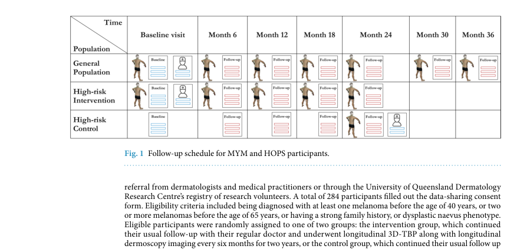
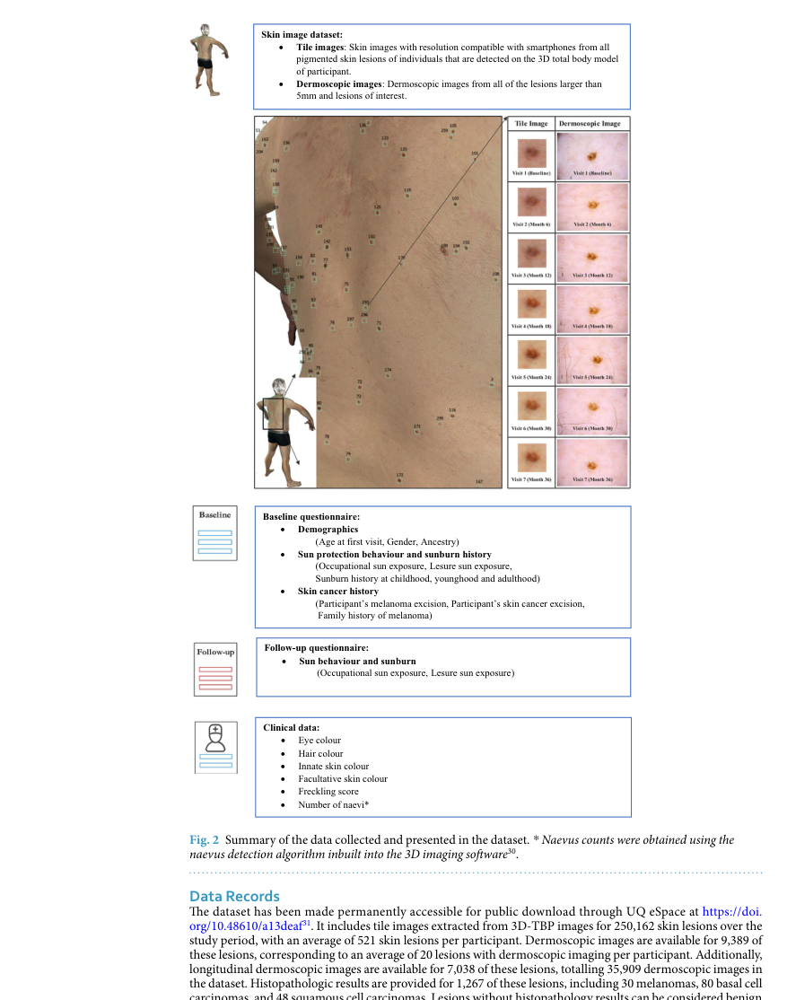
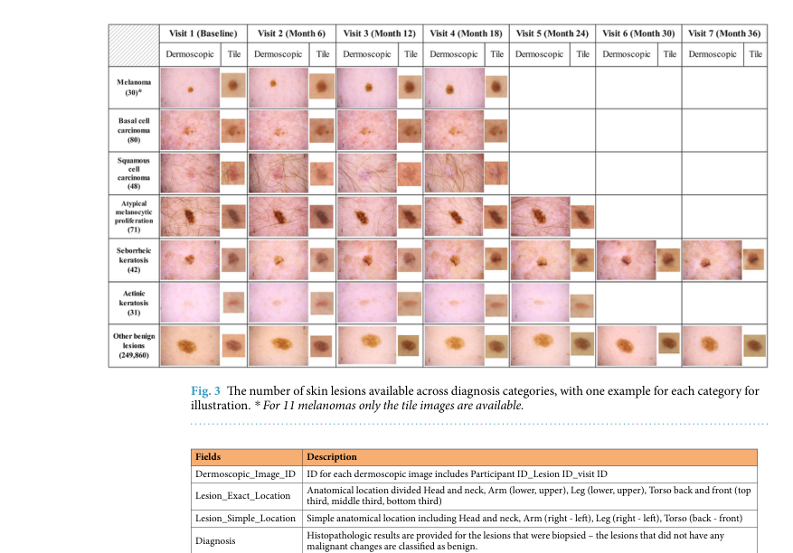
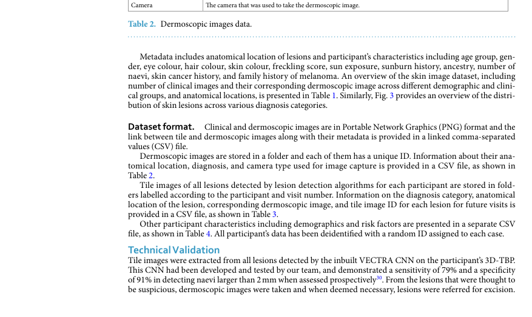
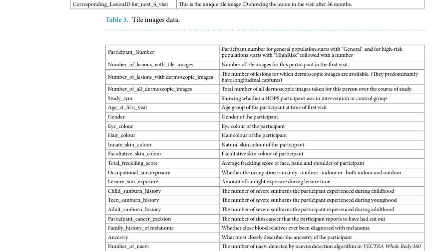
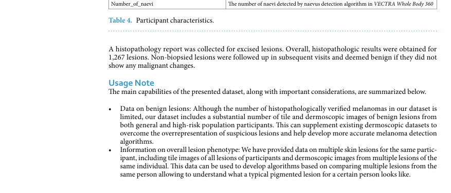

# A Longitudinal Dataset of Tile and Corresponding Dermoscopic Images with Metadata

## 출처/링크

출처: Scientific Data, 2025  
DOI: `10.1038/s41597-025-05880-2`  
Google Scholar 인용: 확인 불가 (조회일: 2026-05-20, 자동 조회 중 Google Scholar reCAPTCHA 발생)  
PDF: [s41597-025-05880-2.pdf](../paper/s41597-025-05880-2.pdf)

## 주요 Figure 및 Table

원문 PDF의 본문 Figure/Table을 번호 단위로 추출해 로컬 asset으로 저장했다. Caption은 길게 옮기지 않고, 각 항목이 보여주는 내용과 ISIC2024 연구 관점의 의미를 한국어로 의역해 정리했다.

**Figure 1. 논문 주장에 필요한 핵심 시각 자료**

해석: 이 Figure는 논문 주장에 필요한 핵심 시각 자료 범주를 시각적으로 보여준다. 원문 맥락에서는 해당 논문의 핵심 근거를 보강하는 자료이며, 특히 longitudinal dermoscopy와 3D-TBP tile 데이터의 follow-up schedule, modality, participant 특성 관련 내용을 이해하는 데 도움이 된다. ISIC2024 연구에서는 single time-point ISIC 2024와 longitudinal patient monitoring dataset의 차이를 논의할 때 사용할 수 있다.

**Figure 2. 데이터 구성, 예시, 분포 특성**

해석: 이 Figure는 데이터 구성, 예시, 분포 특성 범주를 시각적으로 보여준다. 원문 맥락에서는 해당 논문의 핵심 근거를 보강하는 자료이며, 특히 longitudinal dermoscopy와 3D-TBP tile 데이터의 follow-up schedule, modality, participant 특성 관련 내용을 이해하는 데 도움이 된다. ISIC2024 연구에서는 single time-point ISIC 2024와 longitudinal patient monitoring dataset의 차이를 논의할 때 사용할 수 있다.

**Table 1. 데이터 구성, 예시, 분포 특성 요약**

해석: 이 Table은 데이터 구성, 예시, 분포 특성 범주의 정보를 표 형태로 정리한다. 비교 축과 수치는 해당 논문의 핵심 근거를 보강하며, 특히 longitudinal dermoscopy와 3D-TBP tile 데이터의 follow-up schedule, modality, participant 특성 관련 내용을 비교해 읽는 기준이 된다. ISIC2024 연구에서는 single time-point ISIC 2024와 longitudinal patient monitoring dataset의 차이를 논의할 때 사용할 수 있다.

**Figure 3. 데이터 구성, 예시, 분포 특성**

해석: 이 Figure는 데이터 구성, 예시, 분포 특성 범주를 시각적으로 보여준다. 원문 맥락에서는 해당 논문의 핵심 근거를 보강하는 자료이며, 특히 longitudinal dermoscopy와 3D-TBP tile 데이터의 follow-up schedule, modality, participant 특성 관련 내용을 이해하는 데 도움이 된다. ISIC2024 연구에서는 single time-point ISIC 2024와 longitudinal patient monitoring dataset의 차이를 논의할 때 사용할 수 있다.

**Table 2. 데이터 구성, 예시, 분포 특성 요약**

해석: 이 Table은 데이터 구성, 예시, 분포 특성 범주의 정보를 표 형태로 정리한다. 비교 축과 수치는 해당 논문의 핵심 근거를 보강하며, 특히 longitudinal dermoscopy와 3D-TBP tile 데이터의 follow-up schedule, modality, participant 특성 관련 내용을 비교해 읽는 기준이 된다. ISIC2024 연구에서는 single time-point ISIC 2024와 longitudinal patient monitoring dataset의 차이를 논의할 때 사용할 수 있다.

**Table 3. 데이터 구성, 예시, 분포 특성 요약**

해석: 이 Table은 데이터 구성, 예시, 분포 특성 범주의 정보를 표 형태로 정리한다. 비교 축과 수치는 해당 논문의 핵심 근거를 보강하며, 특히 longitudinal dermoscopy와 3D-TBP tile 데이터의 follow-up schedule, modality, participant 특성 관련 내용을 비교해 읽는 기준이 된다. ISIC2024 연구에서는 single time-point ISIC 2024와 longitudinal patient monitoring dataset의 차이를 논의할 때 사용할 수 있다.

**Table 4. 데이터 구성, 예시, 분포 특성 요약**

해석: 이 Table은 데이터 구성, 예시, 분포 특성 범주의 정보를 표 형태로 정리한다. 비교 축과 수치는 해당 논문의 핵심 근거를 보강하며, 특히 longitudinal dermoscopy와 3D-TBP tile 데이터의 follow-up schedule, modality, participant 특성 관련 내용을 비교해 읽는 기준이 된다. ISIC2024 연구에서는 single time-point ISIC 2024와 longitudinal patient monitoring dataset의 차이를 논의할 때 사용할 수 있다.

## 우리 연구에서의 위치

단일 병변 이미지가 아니라 같은 사람의 여러 병변, 시간 변화, dermoscopy, metadata를 함께 제공하는 dataset이다. ISIC 2024 연구에서 patient-level context, ugly duckling sign, longitudinal change의 필요성을 설명하는 핵심 보완 reference이다.

---

## 목표와 기여

isolated dermoscopy image 중심 dataset의 한계를 보완하고, clinician-like context를 반영한 skin cancer identification dataset을 제공한다. tile image, corresponding dermoscopy image, participant metadata, longitudinal follow-up을 연결한다는 점이 핵심이다.

## Dataset 정보

- Cohort: general population 196명, high-risk melanoma cohort 284명
- 참여자: 총 480명
- Image: 250,162개 3D-TBP tile lesion image
- Corresponding dermoscopy: 9,389개
- Longitudinal 정보: 340명은 2-7회 follow-up image 포함
- Metadata: demographics, skin cancer history, sun exposure/protection, naevus count, anatomical location 등

## Imbalance 처리

dataset descriptor이므로 model-level imbalance 처리는 없다. 다만 cohort 구성과 풍부한 participant/lesion metadata를 통해 subgroup analysis와 longitudinal analysis가 가능하다.

## Tabular model

별도 tabular model은 없다. 그러나 demographics, melanoma history, sun exposure, naevus count, anatomical site 등 풍부한 metadata를 제공하므로 image-tabular fusion 연구에 중요한 기반이 될 수 있다.

## Image model

새 classifier는 없다. VECTRA WB360의 CNN lesion detection은 tile 추출 과정에 사용된다.

## Fusion 방식

tile image, corresponding dermoscopic image, longitudinal time point, participant-level metadata를 연결하는 dataset-level multimodal fusion이다.

## 평가 지표

technical validation과 extraction/metadata consistency 중심이다. 신규 진단 모델 성능은 보고하지 않는다.

## 평가 결과

기존 isolated dermoscopy dataset의 한계를 보완해, 병변 간 비교와 시간 변화를 포함하는 skin cancer identification dataset을 제공한다.

## ISIC2024 연구 시사점

- ISIC 2024의 patient_id와 lesion-level metadata를 단순 tabular feature가 아니라 patient-context feature로 해석할 근거를 준다.
- fold split은 lesion-level이 아니라 patient-level leakage를 막도록 설계해야 한다.
- future work에서 longitudinal feature나 lesion-to-lesion comparison을 제안하기 좋다.

## 추가 논의/주의점

- ISIC 2024 train dataset과 동일 dataset은 아니므로 직접 성능 비교보다 concept reference로 사용한다.
- longitudinal information은 ISIC 2024 train에는 제한적이므로 현재 실험에서 무리하게 가정하면 안 된다.
- corresponding dermoscopy가 있는 dataset은 multimodal image-pair 연구에는 강하지만, ISIC 2024 tile-only setting과 modality가 다르다.

---

[메인 문서로 돌아가기](../2026-05-18_dermatology_ai_literature_review.md#3-주요-논문별-상세-분석)
